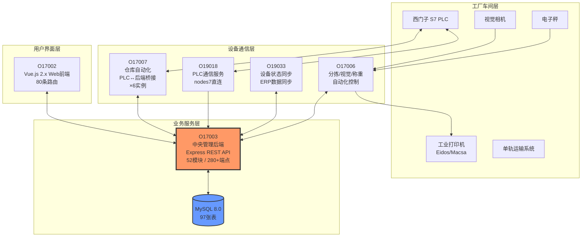
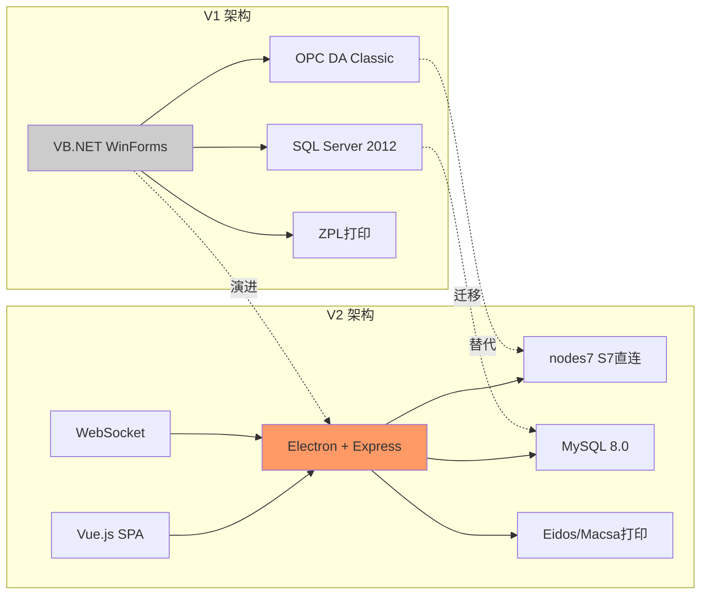
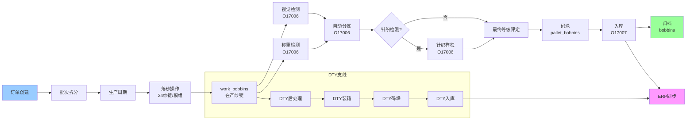

# SILKROAD-5 原始项目解读 — 汇总报告

> **任务编号:** SILKROAD-5 (Plane) / #8 (Vikunja)
> **分析日期:** 2026-09-17
> **分析方法:** 纯源码逐行解读（未参考任何已有文档）
> **分析范围:** V1 (VB.NET) + V2 (Node.js/Electron) + V3PLUS (.NET) + V3 (Java) + V4 (Python) + V5 (Go) + igh-silkroad (Go)
> **产出:** 21份详细报告 / 33,541行 / 347张Mermaid图

---

## 一、原始项目技术栈文档

### 1.1 V1 技术栈 (第一版本程序)

| 组件 | 技术 | 说明 |
|------|------|------|
| 语言 | VB.NET (.NET Framework 4.0) | Windows Forms 桌面应用 |
| 数据库 | SQL Server 2012 | 通过 UDL 连接字符串配置 |
| 工业通信 | OPC DA (Classic) | DB40/DB50 数据块，A/B双线设计 |
| 打印 | ZPL (Zebra) | 条码标签打印 |
| 日志 | 自定义文本文件日志 | ClsLog.vb |
| 部署 | 单机部署 | 每台工控PC运行一个子系统 |

**V1 子系统:**
1. **Huaxiang_Palletizer** — 码垛机管理（最大，25+窗体）
2. **Huaxiang_Sorting** — 分拣质检管理
3. **Huaxiang_TrolleyRobot** — 小车机器人管理

### 1.2 V2 技术栈 (第二版本程序)

| 组件 | 技术 | 版本 | 说明 |
|------|------|------|------|
| 运行时 | Electron + Node.js | Electron 4.x | 桌面壳，无GUI窗口，系统托盘 |
| HTTP框架 | Express | 4.16.4 | RESTful API |
| WebSocket | ws | 6.2.0 | 实时数据推送 |
| 数据库 | MySQL | 8.0.20 / 5.7.44 | 多实例部署 |
| 认证 | JWT + bcryptjs | — | 私有库 net.hivetechnology.auth |
| 日志 | Winston | 3.2.1 | 多级别+文件轮转 |
| 前端 | Vue.js 2.x + Webpack | — | PWA，Milligram CSS |
| PLC通信 | nodes7 (S7 直连) | — | 替代V1的OPC DA |
| 打印 | Eidos + Macsa | — | 工业打印机协议 |

**V2 子系统矩阵:**

| 程序编号 | 功能 | 文件数 | 角色 |
|----------|------|--------|------|
| **O17003** | 中央管理后端 | 168 | REST API服务器，52个业务模块 |
| O17003_DTY | DTY变体 | 165 | DTY后处理专用 |
| O17003_spinnings | 纺纱变体 | 156 | 纺纱流程专用 |
| **O17006** | 分拣/视觉/称重 | 15 | 分拣产线自动化 |
| O17006_DTY | DTY分拣变体 | 17 | DTY分拣专用 |
| **O17007** | 仓库自动化 | 13-14 | PLC↔后端桥接中间件 |
| O17007_DTY_1/2 | DTY仓库实例 | 13 | DTY仓库管理 |
| O17007_WAREHOUSE_1-4 | FDY仓库实例 | 14 | FDY仓库管理 |
| **O19018** | PLC通信服务 | 4 | PLC标签映射和数据读写 |
| O19018_DTY | DTY通信变体 | 5 | DTY PLC通信 |
| **O19033** | 设备状态同步 | 8-11 | ERP数据同步 |
| O19033_DTY | DTY设备变体 | 11 | DTY设备同步 |
| **O17002** | Web前端 | 编译产物 | Vue.js SPA，80条路由 |

### 1.3 数据库架构

| 环境 | 数据库 | 主机 | 用途 |
|------|--------|------|------|
| V1 | SQL Server 2012 | 工控PC本地 | Palletizer/Sorting/TrolleyRobot |
| V2 主库 | MySQL 8.0.20 | h028 | O17003 FDY 主数据 |
| V2 DTY库 | MySQL 8.0.20 | h030 | O17003 DTY 主数据 |
| V2 纺纱库 | MySQL 5.7.44 | fangsi | O17003 纺纱数据 |

**核心数据表:** 97张（从SQL查询推断），覆盖订单、批次、纱锭、模组、分拣、仓库、DTY等全业务域。

---

## 二、核心功能清单（≥5个核心模块）

### 模块1: 生产管理

| 子功能 | 说明 | 涉及程序 |
|--------|------|----------|
| 订单管理 | 创建/启动/完成生产订单，订单队列排序 | O17003 |
| 批次管理 | 订单拆分为批次，批次前缀/重量/锁定控制 | O17003 |
| 生产周期 | doffer/warehouse/palletizer三套并行周期统计 | O17003 |
| 落纱操作 | 24位纱锭批量落纱，存储过程 manage_doffing | O17003, O19033 |
| 纺丝管理 | 纺丝线/纺丝侧配置，纱锭装载序列 | O17003 |
| 卷绕机管理 | 卷绕机检查，时间段限制，全检/跳检规则 | O17003 |

**业务链:** 订单 → 批次 → 周期 → 落纱 → 纱锭（work_bobbins → pallet_bobbins → bobbins 三阶段生命周期）

### 模块2: 质量检测与分拣

| 子功能 | 说明 | 涉及程序 |
|--------|------|----------|
| 视觉检测 | VisionDataManager 接收相机数据，生成vision_grade | O17006 |
| 称重检测 | WeightingManager 称重并评级，weight_grade | O17006 |
| 分拣管理 | SortingManager 根据多维等级自动分拣 | O17006 |
| 针织检测 | KnittingManager 织样检测评级 | O17006 |
| 最终等级 | 5维等级(sorting/weight/final/vision/knitting)综合评定 | O17003 |
| 缺陷管理 | 20种缺陷代码，预检缺陷筒子管理 | O17003 |
| 标签打印 | Eidos/Macsa/SortingPrinter 多打印机协议 | O17006 |

**检测链:** 视觉检测 → 称重 → 分拣等级 → 针织检测 → 最终等级

### 模块3: 仓储物流

| 子功能 | 说明 | 涉及程序 |
|--------|------|----------|
| 托盘管理 | 码垛、托盘位置、托盘追踪 | O17003 |
| 位置管理 | 仓库位置类型、位置状态 | O17003 |
| 物料移动 | 模组在工厂内的移动记录 | O17003 |
| 单轨运输 | monorail + sections 追踪物理路径 | O17003 |
| 小车管理 | 手动/自动小车装载和移动 | O17003, O19033 |
| 仓库自动化 | PLC仓位状态同步，自动出入库 | O17007 |

### 模块4: DTY后处理

| 子功能 | 说明 | 涉及程序 |
|--------|------|----------|
| DTY订单 | 独立的DTY订单管理 | O17003, O17007 |
| DTY筒子 | DTY加工后的筒子管理 | O17003 |
| DTY箱子 | DTY装箱管理 | O17003 |
| DTY托盘 | DTY码垛管理 | O17003, O19033 |
| DTY仓库订单 | DTY出入库订单 | O17003, O17007 |
| DTY打包 | DTYPackingOrdersManager | O17007 |

### 模块5: 系统集成

| 子功能 | 说明 | 涉及程序 |
|--------|------|----------|
| ERP集成 | erpBobbins/erpPallets 数据同步 | O17003 |
| PLC通信 | nodes7 S7协议直连，标签映射 | O19018 |
| WebSocket广播 | MySQL binlog → WS实时推送 | O17003 |
| 打印服务 | 多打印机管理和任务分发 | O17003, O17006 |
| 许可证系统 | 保护生产关键操作(落纱/码垛) | O17003 |
| 通知系统 | 系统级通知管理 | O17003 |

### 模块6: 设备状管理

| 子功能 | 说明 | 涉及程序 |
|--------|------|----------|
| 模组状态 | 24位纱锭模组的多维状态追踪 | O17003, O19033 |
| 设备同步 | PLC数据与后端数据的双向同步 | O19018, O19033 |
| 故障转移 | HTTP通信故障转移（备用IP） | O17007, O19018 |
| 客户监控 | clientsSupervisionSettings | O17003 |

---

## 三、现有问题和痛点列表（≥3个主要问题）

### 3.1 🔴 严重问题 (P0/P1)

| # | 问题 | 位置 | 影响 |
|---|------|------|------|
| P0-1 | **SQL注入漏洞** | V2 `queries/dailyBobbinsAmounts.js` | `${spinningSideId}` 直接拼入SQL，可被注入攻击 |
| P0-2 | **SQL语法错误** | V2 `dtyBoxes.js`, `trolleys.js` | 运行时会报SQL错误导致功能不可用 |
| P0-3 | **错误的require路径** | V2 `dtyWorkBobbins.js` | 模块引用路径错误，运行时崩溃 |
| P1-1 | **HTTP无限重试** | V2 O17007 | 故障转移重试限制代码被注释掉，网络故障时无限循环 |
| P1-2 | **OPC每次读取写数据库** | V1 全部子系统 | 每次UI刷新触发330次DB写入，严重性能瓶颈 |
| P1-3 | **路由参数名错误** | V2 `positionTypes.js` | 路由参数名与控制器不匹配 |
| P1-4 | **monorails SQL别名不匹配** | V2 `monorails.js` | SQL查询结果字段名不匹配 |

### 3.2 🟠 中等问题 (P2)

| # | 问题 | 位置 | 影响 |
|---|------|------|------|
| P2-1 | **安全认证形同虚设** | V2 O17003 | JWT认证和RBAC权限已实现但几乎所有业务路由未应用 |
| P2-2 | **硬编码数据库凭据** | V2 所有config.js | 用户名密码明文存储在配置文件中 |
| P2-3 | **密码使用MD5** | V2 auth库 | MD5不是安全的密码哈希算法 |
| P2-4 | **N+1查询性能问题** | V2 modules.js, workBobbins.js | 循环中逐个UPDATE，应批量处理 |
| P2-5 | **孤立路由文件** | V2 lotWeights.js, dtyWorkBobbins.js | 存在但未注册到Express，功能不可用 |
| P2-6 | **空路由** | V2 dtyBobbins.js | 导入了控制器但未绑定端点 |
| P2-7 | **全局原型污染** | V2 logger.js | 扩展Date.prototype，影响所有Date对象 |
| P2-8 | **主循环异常不捕获** | V2 O17007 | 递归调用无await，异常不被捕获 |
| P2-9 | **V1代码大量重复** | V1 Sorting FrmMain | 3898行重复代码（A/B线几乎完全相同） |

### 3.3 🟡 架构级痛点

| # | 痛点 | 说明 |
|---|------|------|
| A1 | **代码复制而非复用** | V2的DTY变体(O17003_DTY, O17006_DTY等)是主版本的几乎完全拷贝，仅少量差异。维护6+个近乎相同的代码库 |
| A2 | **Electron壳无GUI** | O17003作为REST API服务器却打包在Electron桌面壳中，资源浪费且部署复杂 |
| A3 | **V1代码结构混乱** | 单个窗体文件动辄3000+行，业务逻辑与UI完全耦合，无法单元测试 |
| A4 | **无API文档** | 280+个REST端点无Swagger/OpenAPI文档 |
| A5 | **无自动化测试** | V1和V2均无单元测试、集成测试框架 |
| A6 | **数据库迁移无管理** | 无migration工具，表结构变更靠手动SQL |
| A7 | **多实例配置管理** | O17007有6个实例用配置差异区分，但配置散落在各自目录 |
| A8 | **许可证仅保护3个端点** | 许可证检查只应用于doffings/pallets/dty-pallets的POST |

---

## 四、可复用模块识别

### 4.1 直接可复用

| 模块 | 来源 | 复用方式 | 说明 |
|------|------|----------|------|
| **三层架构模式** | V2 O17003 | 架构参考 | Route→Controller→Query 分层清晰，52个模块完全对称 |
| **分页中间件** | V2 net.hivetechnology.pagination | 直接复用 | COUNT(*) OVER() 窗口函数分页 |
| **自定义错误类** | V2 error.js | 直接复用 | NotFoundError/DuplicateError 语义化错误 |
| **Winston日志配置** | V2 logger.js | 参考改进 | 多级别+文件轮转（去掉原型污染） |
| **HTTP故障转移** | V2 O17007/O19018 http.js | 参考改进 | 主备IP切换（修复无限重试） |

### 4.2 业务逻辑可复用

| 业务逻辑 | 来源 | 说明 |
|----------|------|------|
| **5维等级体系** | V2 O17003 | sorting/weight/final/vision/knitting 多维质量评级模型 |
| **24位模组管理** | V2 O17003/O19033 | 24纱锭为一组的批量处理逻辑 |
| **纱锭生命周期** | V2 O17003 | work_bobbins→pallet_bobbins→bobbins 三阶段流转 |
| **DTY后处理流程** | V2 O17003/O17007 | DTY订单→箱子→托盘→仓库的完整链路 |
| **PLC通信映射** | V2 O19018 | makeAddress标签映射和模块化变量结构 |
| **仓库多实例协调** | V2 O17007 | readStatus状态机(0→1→2→0)串行协调模式 |

### 4.3 数据模型可复用

| 数据模型 | 说明 |
|----------|------|
| **97张核心表结构** | 从SQL查询推断的完整ER模型，可作为新系统设计基础 |
| **订单→批次→周期→落纱 链路** | 生产管理核心数据关系 |
| **纸管颜色系统** | color1+color2双色组合标识产品类型 |
| **存储过程** | manage_doffing/manage_negative_doffing/load_bobbins 等核心业务SP |

---

## 五、原始项目架构图

### 5.1 系统全景架构

### 5.2 V1→V2 演进对比

### 5.3 数据流转总图

---

## 六、详细分析报告索引

| # | 文件 | 内容 | 行数 | Mermaid图 |
|---|------|------|------|-----------|
| 1 | [v1/01-v1-complete-analysis.md](v1/01-v1-complete-analysis.md) | V1 VB.NET 全版本解读 | 1,393 | 29 |
| 2 | [v2/01-o17003-architecture.md](v2/01-o17003-architecture.md) | V2 O17003 核心架构 | 1,033 | 11 |
| 3 | [v2/02-o17003-production.md](v2/02-o17003-production.md) | V2 生产管理业务 | 2,315 | 26 |
| 4 | [v2/03-o17003-logistics-quality.md](v2/03-o17003-logistics-quality.md) | V2 物流/质检/DTY | 1,656 | 31 |
| 5 | [v2/04-o17007-warehouse-automation.md](v2/04-o17007-warehouse-automation.md) | V2 仓库自动化 | 2,179 | 12 |
| 6 | [v2/05-device-automation.md](v2/05-device-automation.md) | V2 设备级自动化 | 1,505 | 26 |
| 7 | [v2/06-frontend-database.md](v2/06-frontend-database.md) | V2 前端+数据库 | 803 | 7 |
| 8 | [v2/07-o17003-dty-variant.md](v2/07-o17003-dty-variant.md) | V2 O17003 DTY变体差异 | 1,246 | 27 |
| 9 | [v2/08-o17003-spinnings-variant.md](v2/08-o17003-spinnings-variant.md) | V2 O17003 纺纱变体差异 | 1,093 | 18 |
| 10 | [v2/09-new-projects.md](v2/09-new-projects.md) | V2 新发现项目 (O17008/O17004/O19028) | 1,309 | 36 |
| 11 | [v2/10-dty-variants-deep.md](v2/10-dty-variants-deep.md) | V2 DTY变体深度对比 | 799 | 11 |
| 12 | [v2/11-database-architecture.md](v2/11-database-architecture.md) | V2 数据库架构+存储过程 | 1,386 | 10 |
| — | **V1+V2 小计** | — | **16,717** | **244** |

### 新版本分析报告

| # | 文件 | 内容 | 行数 | Mermaid图 |
|---|------|------|------|-----------|
| 13 | [v3plus/01-v3plus-analysis.md](v3plus/01-v3plus-analysis.md) | V3PLUS .NET+IIS+layui 前端改进版 | 1,107 | 9 |
| 14 | [v3/01-v3-complete-analysis.md](v3/01-v3-complete-analysis.md) | V3 Java Spring Boot 重写版 | 1,583 | 19 |
| 15 | [v4/01-v4-complete-analysis.md](v4/01-v4-complete-analysis.md) | V4 Python FastAPI 边端版（在产运行） | 1,644 | 25 |
| 16 | [v5/01-v5-complete-analysis.md](v5/01-v5-complete-analysis.md) | V5 Go+Vue3 双架构版 | 1,641 | 20 |
| 17 | [silkroad/01-architecture.md](silkroad/01-architecture.md) | igh-silkroad 整体架构分析 | 1,703 | 4 |
| 18 | [silkroad/02-edge-backend.md](silkroad/02-edge-backend.md) | igh-silkroad 边端后端深度分析 | 1,911 | 4 |
| 19 | [silkroad/03-server-backend.md](silkroad/03-server-backend.md) | igh-silkroad 中心端后端深度分析 | 2,285 | 5 |
| 20 | [silkroad/04-frontend.md](silkroad/04-frontend.md) | igh-silkroad 前端分析+6大痛点 | 1,887 | 4 |
| 21 | [silkroad/05-ha-plcsim.md](silkroad/05-ha-plcsim.md) | igh-silkroad 双机热备+PLC仿真器 | 2,423 | 13 |
| — | **新版本小计** | — | **16,184** | **103** |
| — | **全部合计** | — | **33,541** | **347** |

---

## 七、SILKROAD-5 验收标准核对

| 验收标准 | 状态 | 说明 |
|----------|------|------|
| ✅ 完成原始项目架构图 | 已完成 | 系统全景架构图 + V1→V2演进图 + 数据流转图 |
| ✅ 识别至少5个核心功能模块 | 已完成 | 识别6个核心模块（生产/质检/仓储/DTY/集成/设备） |
| ✅ 列出至少3个主要问题 | 已完成 | 列出7个P0/P1严重问题 + 9个P2中等问题 + 8个架构痛点 |
| ✅ 原始项目技术栈文档 | 已完成 | V1/V2完整技术栈对比 |
| ✅ 核心功能清单 | 已完成 | 6大模块/30+子功能详细清单 |
| ✅ 现有问题和痛点列表 | 已完成 | 24+个分级问题清单 |
| ✅ 可复用模块识别 | 已完成 | 5个直接可复用 + 6个业务逻辑可复用 + 4个数据模型可复用 |
