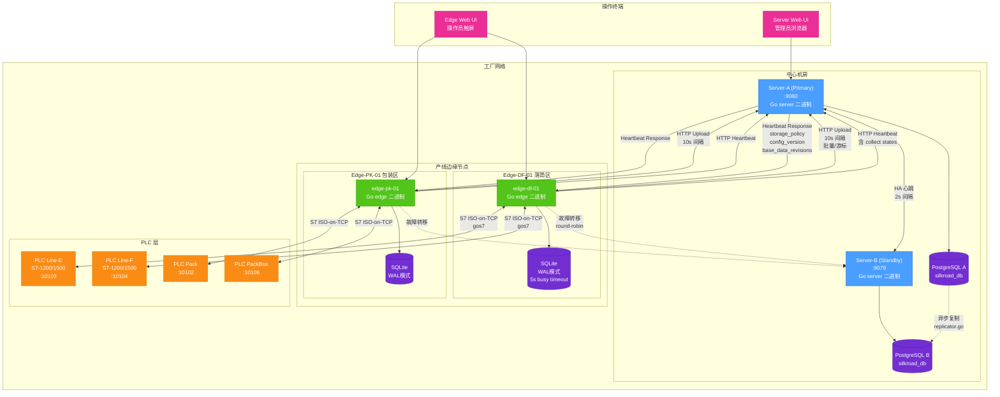
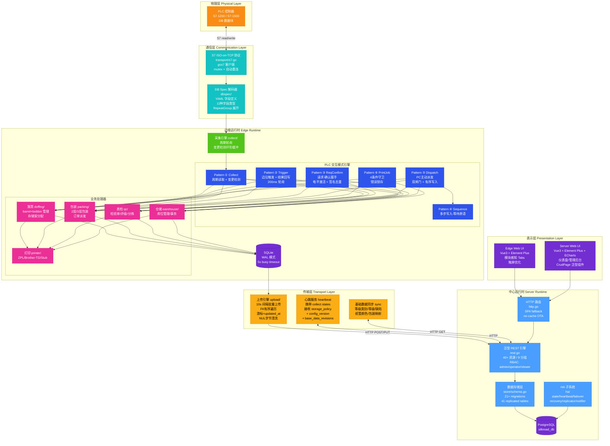
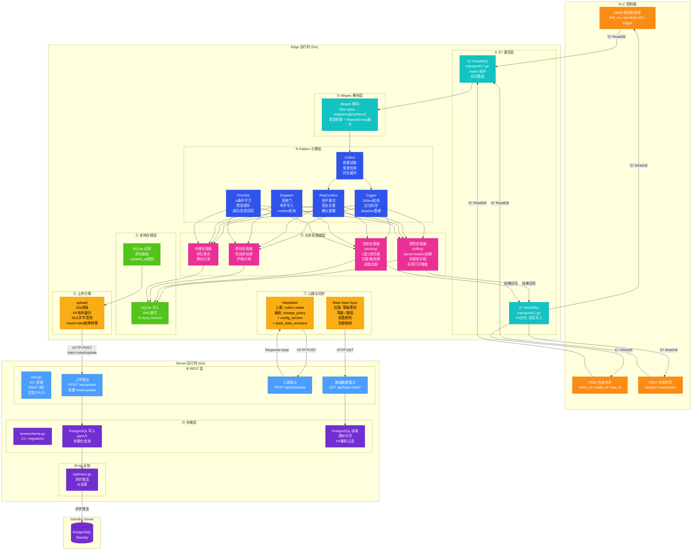

# SILKROAD V3 系统架构总览

> **文档编号:** SILKROAD-ARCH-01
> **分析对象:** igh-silkroad (Go + Vue.js 3) — 工业自动化丝饼管理系统
> **分析方法:** 纯源码逐行解读（基于完整源码树 + 配置文件 + 构建脚本）
> **分析日期:** 2026-09-17
> **文档性质:** 第1篇/共5篇 — 系统架构总览

---

## 目录

1. [系统概述](#一系统概述)
2. [技术栈全景](#二技术栈全景)
3. [部署拓扑](#三部署拓扑)
4. [分层架构模型](#四分层架构模型)
5. [Go 包结构与依赖关系](#五go-包结构与依赖关系)
6. [可执行入口分析](#六可执行入口分析)
7. [三层配置模型](#七三层配置模型)
8. [数据流总览](#八数据流总览)
9. [前端架构](#九前端架构)
10. [高可用架构](#十高可用架构)
11. [业务域总览](#十一业务域总览)
12. [与 V1/V2 架构对比](#十二与-v1v2-架构对比)
13. [架构决策记录](#十三架构决策记录)

---

## 一、系统概述

### 1.1 系统定位

SILKROAD V3 是一套面向化纤工厂的 **边缘-中心分布式工业自动化系统**，管理从卷绕机落纱到成品出库的全生产链路。系统替代 V1 (VB.NET/OPC DA/SQL Server) 和 V2 (Node.js/Electron/MySQL) 两代系统，解决以下核心痛点：

| V1/V2 痛点 | V3 解决方案 |
|-------------|-------------|
| 代码复制而非复用（DTY/FDY/纺纱 6+ 相似代码库） | 统一代码库 + YAML 配置化差异 |
| Electron 壳包装 REST 服务器（资源浪费） | 原生 Go 二进制，单文件部署 |
| 280+ REST 端点无文档、无测试 | 泛型 CRUD + RBAC，结构化 REST |
| 无数据库迁移管理 | 内置 21+ migration，自动升级 |
| SQL 注入、无限重试等严重漏洞 | 参数化查询、完善的错误处理 |
| 单点部署无容灾 | 主备 HA + Edge 本地存储容灾 |
| OPC DA (V1) / nodes7 裸调用 (V2) | 结构化 PLC 交互模式（6 种 Pattern） |

### 1.2 系统规模

| 指标 | 数值 |
|------|------|
| Go 源码文件数 | ~120+ |
| 主入口行数 (cmd/edge/main.go) | ~922 行 |
| REST 资源数量 | 40+ 资源，9 个分组 |
| 数据库迁移版本 | 21+ |
| 复制表数量 (HA) | 41 张 |
| PLC 交互模式 | 6 种标准 Pattern |
| 前端页面数 (Edge + Server) | ~30+ |
| 业务域数量 | 6 个（落筒/包装/质检/仓储/运输/打印） |

---

## 二、技术栈全景

### 2.1 后端技术栈

| 层级 | 技术 | 版本 | 用途 | 选型理由 |
|------|------|------|------|----------|
| **语言** | Go | 1.26 | 系统开发语言 | 编译型、交叉编译、低资源占用、并发原语 |
| **中心数据库** | PostgreSQL | — | Server 端持久化 | pgx/v5 驱动，JSONB 支持，成熟的 HA 方案 |
| **边缘数据库** | SQLite | — | Edge 端本地存储 | modernc.org/sqlite (纯 Go 实现)，WAL 模式，零运维 |
| **PLC 协议** | S7 (ISO-on-TCP) | — | 卷绕机/分拣机/仓库 PLC 通信 | gos7 库，替代 V1 的 OPC DA 和 V2 的 nodes7 |
| **配置格式** | YAML | — | 三层配置系统 | gopkg.in/yaml.v3，人类可读 |
| **HTTP 路由** | 标准库 net/http | — | REST API 服务 | 无框架依赖，Go 1.22+ 路由增强 |
| **嵌入式资源** | go:embed | — | 前端静态文件嵌入 | 单二进制部署 |

### 2.2 前端技术栈

| 层级 | 技术 | 版本 | 用途 |
|------|------|------|------|
| **框架** | Vue.js | 3.x (Composition API) | 响应式 UI 框架 |
| **UI 库** | Element Plus | — | 企业级组件库 |
| **图表** | ECharts | — | 生产数据可视化（仅 Server UI） |
| **构建** | Vite | — | 快速构建与热更新 |
| **路由** | Vue Router | — | SPA 路由 |
| **HTTP 客户端** | Axios/Fetch | — | REST API 调用 |

### 2.3 开发与部署工具链

| 工具 | 用途 |
|------|------|
| `go build` | 交叉编译为 Linux ARM/AMD64 二进制 |
| `go:embed` | 将前端构建产物嵌入 Go 二进制 |
| `vite build` | 前端生产构建 |
| YAML 配置 | 部署时按环境差异化 |
| systemd | Linux 服务管理（推测） |

---

## 三、部署拓扑

### 3.1 部署拓扑图



### 3.2 网络端口规划

| 组件 | 端口 | 协议 | 用途 | 来源 |
|------|------|------|------|------|
| Server-A | :9080 | HTTP | REST API + Web UI | server.yaml → listen |
| Server-B | :9079 | HTTP | HA Standby REST + HA 心跳 | server.yaml → ha.peer_addr |
| PLC Line-E | :10103 | S7 ISO-on-TCP | 卷绕机 E 线 | edge-df-01.yaml → plcs |
| PLC Line-F | :10104 | S7 ISO-on-TCP | 卷绕机 F 线 | edge-df-01.yaml → plcs |
| PLC Pack | :10102 | S7 ISO-on-TCP | 包装机 | plcsim.yaml → instances |
| PLC PackBox | :10106 | S7 ISO-on-TCP | 装箱机 | plcsim.yaml → instances |
| Edge Web UI | :8080 (默认) | HTTP | 操作员触屏界面 | edge config → webui.listen |
| PostgreSQL | :5432 (默认) | TCP | 中心数据库 | server.yaml → postgres |

### 3.3 开发环境模拟拓扑

源码中 `configs/dev/` 提供完整开发环境配置：

| 配置文件 | 模拟内容 |
|----------|----------|
| `server.yaml` | Server-A (Primary)，node=server-a，listen=:9080，HA peer=:9079 |
| `edge-df-01.yaml` | 落筒边缘节点，2 PLC 连接，落筒模块含 2 条产线 |
| `plcsim.yaml` | 4 个 PLC 模拟器实例，20+ 场景，15+ 反应 |

---

## 四、分层架构模型

### 4.1 整体架构分层图



### 4.2 分层说明

#### 物理层 (Physical Layer)

PLC 控制器（西门子 S7-1200/S7-1500）通过 DB 数据块暴露过程数据。每个 DB 块由 `dbspec` YAML 文件定义其字段布局，包含偏移量、类型、重复组等元信息。

#### 通信层 (Communication Layer)

- **transport/s7.go** — 基于 `gos7` 库实现 S7 ISO-on-TCP 客户端。关键特性：
  - `sync.Mutex` 保护并发访问（S7 协议不支持并发请求）
  - 自动重连逻辑：连接断开后以指数退避重试
  - 读写操作封装为 `ReadDB()` / `WriteDB()` 方法
  
- **dbspec/** — YAML 格式的 DB 块规格描述，支持：
  - 11 种字段类型（Bool、Byte、Word、DWord、Int、DInt、Real、LReal、String、DateTime、Timer）
  - RepeatGroup 展开（如 24 锭位循环定义，自动计算偏移量）
  - 方向验证（read/write/readwrite）

#### 边缘运行时 (Edge Runtime)

核心是 6 种 PLC 交互模式（详见第2篇文档）+ 6 个业务域处理器，数据落入 SQLite。

#### 传输层 (Transport Layer)

Edge→Server 的数据同步层，含上传（insert 用游标/update 用 updated_at）、心跳（双向元数据交换）、基础数据拉取。

#### 中心运行时 (Server Runtime)

泛型 REST 引擎提供 40+ 资源的 CRUD，RBAC 三级权限，21+ 自动迁移，41 张复制表支持 HA。

#### 表示层 (Presentation Layer)

两套独立 Vue3 应用通过 `go:embed` 嵌入二进制，SPA 回退路由，无缓存头支持 OTA 更新。

---

## 五、Go 包结构与依赖关系

### 5.1 包依赖关系图

```mermaid
graph LR
    subgraph "cmd/ 可执行入口"
        CMD_EDGE["cmd/edge/<br/>main.go<br/>~922行"]
        CMD_SERVER["cmd/server/<br/>main.go<br/>~309行"]
        CMD_PLCSIM["cmd/plcsim/<br/>main.go<br/>~363行"]
        CMD_HASEED["cmd/ha-seed/<br/>main.go<br/>~245行"]
        CMD_TOOL["cmd/tool/<br/>main.go<br/>~134行"]
    end
    
    subgraph "internal/edge/ 边缘包"
        EDGE_CFG["config.go<br/>FileConfig 结构体<br/>PLCs/collect/bindings<br/>doffing/packing/warehouse/qc"]
        EDGE_COLLECT["collect/<br/>周期轮询引擎<br/>变更检测环形缓冲"]
        EDGE_PATTERNS["patterns/<br/>trigger.go<br/>reqconfirm.go<br/>dispatch.go<br/>printjob.go<br/>sequence.go"]
        EDGE_TRANSPORT["transport/<br/>s7.go<br/>gos7 客户端<br/>mutex+reconnect"]
        EDGE_UPLOAD["upload/<br/>批量上传引擎<br/>FK有序遍历<br/>游标+updated_at"]
        EDGE_DOFFING["doffing/<br/>barrel+bobbin管理<br/>存储架分配"]
        EDGE_PACKING["packing/<br/>2层/3层包装<br/>订单派发"]
        EDGE_PRINTER["printer/<br/>ZPL驱动<br/>Brother-TD驱动<br/>Stub驱动"]
    end
    
    subgraph "internal/server/ 服务端包"
        SRV_HTTP["http.go<br/>HTTP路由注册<br/>SPA fallback"]
        SRV_REST["rest.go<br/>泛型REST<br/>RBAC 3级<br/>40+资源 / 9组"]
        SRV_CFG["config.go<br/>HA配置<br/>peer_addr<br/>replication"]
        SRV_STORE["store/<br/>schema.go<br/>21+migrations<br/>41 replicated tables"]
        SRV_HA["ha/<br/>state.go (线程安全role/epoch)<br/>heartbeat.go (2s+auto-demote)<br/>failover.go (4条件评估)<br/>recovery.go (启动拉取)<br/>replicator.go (异步推送)<br/>notifier.go (webhook)<br/>middleware.go (ReadOnlyGuard)"]
    end
    
    subgraph "internal/plcsim/ 模拟器包"
        SIM["sim.go<br/>多实例管理"]
        S7SRV["s7server.go<br/>ISO-on-TCP S7子集"]
        SCENARIO["scenario.go<br/>步骤式场景<br/>$seq/$rand/$repeat/$ref"]
        REACTION["reaction.go<br/>上升沿检测"]
        PRODUCER["producer/<br/>winder状态机<br/>warehouse状态机"]
    end
    
    subgraph "internal/shared/ 共享包"
        DBSPEC_PKG["dbspec/<br/>YAML DB规格<br/>RepeatGroup展开<br/>11字段类型<br/>方向验证"]
        PROTOCOL["protocol/<br/>Edge-Server<br/>线上类型定义"]
        LOGX["logx/<br/>结构化日志"]
        PATHX["pathx/<br/>路径工具"]
        IDS["ids/<br/>ID生成"]
        SHIFTX["shiftx/<br/>班次计算"]
        TIMEX["timex/<br/>时间工具"]
    end
    
    subgraph "web/ 前端"
        WEB_EDGE["web/edge/<br/>Vue3 + Element Plus<br/>Edge UI"]
        WEB_SERVER["web/server/<br/>Vue3 + Element Plus<br/>+ ECharts<br/>Server UI"]
    end
    
    CMD_EDGE --> EDGE_CFG
    CMD_EDGE --> EDGE_COLLECT
    CMD_EDGE --> EDGE_PATTERNS
    CMD_EDGE --> EDGE_TRANSPORT
    CMD_EDGE --> EDGE_UPLOAD
    CMD_EDGE --> EDGE_DOFFING
    CMD_EDGE --> EDGE_PACKING
    CMD_EDGE --> EDGE_PRINTER
    CMD_EDGE --> DBSPEC_PKG
    CMD_EDGE --> PROTOCOL
    CMD_EDGE --> LOGX
    
    CMD_SERVER --> SRV_HTTP
    CMD_SERVER --> SRV_REST
    CMD_SERVER --> SRV_CFG
    CMD_SERVER --> SRV_STORE
    CMD_SERVER --> SRV_HA
    CMD_SERVER --> PROTOCOL
    CMD_SERVER --> LOGX
    
    CMD_PLCSIM --> SIM
    CMD_PLCSIM --> S7SRV
    CMD_PLCSIM --> SCENARIO
    CMD_PLCSIM --> REACTION
    CMD_PLCSIM --> PRODUCER
    CMD_PLCSIM --> DBSPEC_PKG
    
    CMD_HASEED --> SRV_STORE
    CMD_HASEED --> SRV_CFG
    
    CMD_TOOL --> DBSPEC_PKG
    CMD_TOOL --> SRV_STORE
    
    EDGE_COLLECT --> EDGE_TRANSPORT
    EDGE_COLLECT --> DBSPEC_PKG
    EDGE_PATTERNS --> EDGE_TRANSPORT
    EDGE_PATTERNS --> DBSPEC_PKG
    EDGE_DOFFING --> EDGE_PATTERNS
    EDGE_PACKING --> EDGE_PATTERNS
    EDGE_UPLOAD --> PROTOCOL
    
    SRV_HTTP --> SRV_REST
    SRV_REST --> SRV_STORE
    SRV_HA --> SRV_STORE
    
    SIM --> S7SRV
    SIM --> SCENARIO
    SIM --> REACTION
    SCENARIO --> PRODUCER
    
    CMD_EDGE -.->|"go:embed"| WEB_EDGE
    CMD_SERVER -.->|"go:embed"| WEB_SERVER
    
    classDef cmd fill:#fa8c16,stroke:#d48806,color:#fff
    classDef edge fill:#52c41a,stroke:#389e0d,color:#fff
    classDef server fill:#4a9eff,stroke:#2171c9,color:#fff
    classDef sim fill:#13c2c2,stroke:#08979c,color:#fff
    classDef shared fill:#722ed1,stroke:#531dab,color:#fff
    classDef web fill:#eb2f96,stroke:#c41d7f,color:#fff
    
    class CMD_EDGE,CMD_SERVER,CMD_PLCSIM,CMD_HASEED,CMD_TOOL cmd
    class EDGE_CFG,EDGE_COLLECT,EDGE_PATTERNS,EDGE_TRANSPORT,EDGE_UPLOAD,EDGE_DOFFING,EDGE_PACKING,EDGE_PRINTER edge
    class SRV_HTTP,SRV_REST,SRV_CFG,SRV_STORE,SRV_HA server
    class SIM,S7SRV,SCENARIO,REACTION,PRODUCER sim
    class DBSPEC_PKG,PROTOCOL,LOGX,PATHX,IDS,SHIFTX,TIMEX shared
    class WEB_EDGE,WEB_SERVER web
```



### 5.2 目录结构详解

```
igh-silkroad/
├── cmd/                              # 可执行入口（5 个独立二进制）
│   ├── edge/
│   │   └── main.go                   # Edge 入口 (~922行)
│   ├── server/
│   │   └── main.go                   # Server 入口 (~309行)
│   ├── plcsim/
│   │   └── main.go                   # PLC 模拟器 (~363行)
│   ├── ha-seed/
│   │   └── main.go                   # HA 全量种子工具 (~245行)
│   └── tool/
│       └── main.go                   # CLI 子命令工具 (~134行)
│
├── internal/                         # 内部包（Go 访问控制）
│   ├── edge/                         # 边缘运行时
│   │   ├── config.go                 # FileConfig + 业务模块配置
│   │   ├── collect/                  # 采集引擎
│   │   ├── patterns/                 # 6种PLC交互模式
│   │   │   ├── trigger.go            # Pattern ② 边沿触发
│   │   │   ├── reqconfirm.go         # Pattern ③ 请求确认
│   │   │   ├── dispatch.go           # Pattern ⑤ 派发
│   │   │   ├── printjob.go           # Pattern ⑥ 打印任务
│   │   │   └── sequence.go           # Pattern ④ 多步序列
│   │   ├── transport/
│   │   │   └── s7.go                 # S7 客户端（gos7封装）
│   │   ├── upload/                   # 批量上传引擎
│   │   ├── doffing/                  # 落筒业务
│   │   ├── packing/                  # 包装业务
│   │   └── printer/                  # 打印驱动
│   │
│   ├── server/                       # 服务端运行时
│   │   ├── http.go                   # HTTP 路由注册
│   │   ├── rest.go                   # 泛型 REST + RBAC
│   │   ├── config.go                 # 服务端配置
│   │   ├── store/
│   │   │   └── schema.go            # 数据库 schema + 21+ migrations
│   │   └── ha/                       # 高可用子系统
│   │       ├── state.go              # 线程安全 role/epoch
│   │       ├── heartbeat.go          # 2s 心跳 + auto-demote
│   │       ├── failover.go           # 4条件故障转移评估
│   │       ├── recovery.go           # 启动时数据拉取
│   │       ├── replicator.go         # 异步数据推送
│   │       ├── notifier.go           # Webhook 通知
│   │       └── middleware.go         # ReadOnlyGuard 中间件
│   │
│   ├── plcsim/                       # PLC 模拟器
│   │   ├── sim.go                    # 多实例管理
│   │   ├── s7server.go               # S7 协议子集服务端
│   │   ├── scenario.go               # 步骤式场景引擎
│   │   ├── reaction.go               # 上升沿检测
│   │   └── producer/                 # 状态机
│   │       ├── winder.go             # 卷绕机模拟
│   │       └── warehouse.go          # 仓库模拟
│   │
│   └── shared/                       # 跨模块共享
│       ├── dbspec/                   # DB 规格描述系统
│       ├── protocol/                 # Edge↔Server 线上类型
│       ├── logx/                     # 结构化日志
│       ├── pathx/                    # 路径工具
│       ├── ids/                      # ID 生成
│       ├── shiftx/                   # 班次计算
│       └── timex/                    # 时间工具
│
├── web/                              # 前端应用
│   ├── edge/                         # Edge UI (Vue3 + Element Plus)
│   │   ├── src/
│   │   │   ├── components/           # HeaderBar, TabBar, BottomBar...
│   │   │   ├── composables/          # useStatus 轮询
│   │   │   └── views/                # 模块视图
│   │   └── vite.config.js
│   └── server/                       # Server UI (Vue3 + Element Plus + ECharts)
│       ├── src/
│       │   ├── components/           # CrudPage, CrudDialog...
│       │   ├── views/                # Dashboard, 管理页面
│       │   └── router/
│       └── vite.config.js
│
├── specs/                            # DB Spec YAML 文件
│   ├── doffing/                      # 落筒 DB 块规格
│   ├── packing/                      # 包装 DB 块规格
│   ├── warehouse/                    # 仓储 DB 块规格
│   └── qc/                           # 质检 DB 块规格
│
└── configs/                          # 部署配置
    └── dev/                          # 开发环境
        ├── server.yaml
        ├── edge-df-01.yaml
        └── plcsim.yaml
```

### 5.3 各包职责详解

#### 5.3.1 internal/shared/dbspec/ — DB 规格描述系统

**核心职责：** 将 PLC DB 块的物理内存布局抽象为 YAML 描述文件，运行时解析为类型安全的字段映射。

**支持的 11 种字段类型：**

| 类型 | S7 长度 | Go 映射 | 说明 |
|------|---------|---------|------|
| `Bool` | 1 bit | `bool` | 位地址 (byte.bit) |
| `Byte` | 1 byte | `uint8` | 无符号字节 |
| `Word` | 2 bytes | `uint16` | 无符号字 |
| `DWord` | 4 bytes | `uint32` | 无符号双字 |
| `Int` | 2 bytes | `int16` | 有符号整数 |
| `DInt` | 4 bytes | `int32` | 有符号双整数 |
| `Real` | 4 bytes | `float32` | 单精度浮点 |
| `LReal` | 8 bytes | `float64` | 双精度浮点 |
| `String` | 2+N bytes | `string` | S7 字符串（前2字节为最大/实际长度） |
| `DateTime` | 8 bytes | `time.Time` | S7 日期时间 |
| `Timer` | 4 bytes | `time.Duration` | S7 定时器 |

**RepeatGroup 展开机制：**

```yaml
# specs/doffing/winder_status.yaml 示例
fields:
  - name: doff_no
    type: DInt
    offset: 0
  - repeat_group:
      name: spindle
      count: 24                     # 24锭位循环
      start_offset: 4
      stride: 12                    # 每锭位12字节
      fields:
        - name: grade
          type: Word
          offset: 0
        - name: weight
          type: Real
          offset: 2
        - name: defect
          type: Word
          offset: 6
```

展开后自动生成 `spindle[0].grade`、`spindle[0].weight`... `spindle[23].defect`，共 24 x 3 = 72 个字段，偏移量自动计算。

**方向验证：**

每个字段可标记 `direction: read | write | readwrite`，运行时验证：
- Collect 模式只读取 `read` / `readwrite` 字段
- Trigger 回写只写入 `write` / `readwrite` 字段
- 防止意外覆盖 PLC 只读寄存器

#### 5.3.2 internal/shared/protocol/ — Edge-Server 通信协议

定义 Edge 与 Server 之间的线上数据类型（Wire Types），包含：

- **上传请求/响应** — 批量 insert/update 的 JSON 载荷结构
- **心跳请求/响应** — Edge 上报 collect states，Server 下发 storage_policy + config_version + base_data_revisions
- **基础数据同步** — 等级类别、等级、缺陷、纸管颜色、包装映射的 GET 端点返回类型

所有类型均使用 Go 结构体 + JSON tag 定义，确保 Edge 和 Server 二进制共享同一数据契约。

#### 5.3.3 internal/shared/logx/ — 结构化日志

封装标准库 `log/slog`，提供：
- 统一的日志格式（JSON / Text 可切换）
- 上下文字段注入（node_id, edge_id, plc_addr 等）
- 日志级别运行时可调

#### 5.3.4 internal/shared/ids/ — ID 生成

提供分布式安全的 ID 生成策略：
- UUID v4 用于全局唯一标识
- 序列号用于人类可读的业务编码（如 barrel code、pallet code）

#### 5.3.5 internal/shared/shiftx/ — 班次计算

根据配置的班次表（如 A班 08:00-20:00，B班 20:00-08:00）计算当前班次、班次边界时间、跨日处理等。Edge config 中 `shifts` 配置直接被此包消费。

#### 5.3.6 internal/shared/timex/ — 时间工具

提供 S7 DateTime 与 Go `time.Time` 的互转、时区处理、时间戳格式化等工具函数。

#### 5.3.7 internal/shared/pathx/ — 路径工具

跨平台路径处理，确保 Windows 开发环境和 Linux 部署环境的路径兼容。

---

## 六、可执行入口分析

### 6.1 cmd/edge/main.go — Edge 入口 (~922 行)

**8 阶段启动序列：**

```
阶段1: Config     → 加载 YAML 配置，验证字段，初始化日志
阶段2: PLC Conn   → 建立所有 PLC 的 S7 连接（带重连策略）
阶段3: Collect    → 启动周期采集引擎（各 collect point 独立 goroutine）
阶段4: Bindings   → 绑定 PLC 交互模式到业务处理器
阶段5: WebUI      → 启动 Edge Web UI HTTP 服务
阶段6: Upload     → 启动 SQLite→Server 上传引擎
阶段7: Heartbeat  → 启动心跳服务（上报状态，接收策略）
阶段8: Sync       → 启动基础数据同步（从 Server 拉取）
```

**启动序列的关键设计决策：**

1. **阶段顺序不可变** — PLC 连接必须在 Collect 之前，Collect 必须在 Bindings 之前（数据流依赖）
2. **PLC 连接容错** — 单个 PLC 连接失败不阻塞其他 PLC 和后续阶段，进入后台重连
3. **Graceful Shutdown** — 监听 SIGINT/SIGTERM，按反序关闭各阶段
4. **SQLite 初始化** — WAL 模式 + 5 秒 busy timeout，确保写入不阻塞读取

**main.go 结构分析（~922行分布）：**

| 行数范围 (估算) | 内容 | 说明 |
|-----------------|------|------|
| 1-50 | import + 常量 | 依赖声明、版本号、默认超时 |
| 50-150 | main() 函数 | 8 阶段启动编排 + signal 处理 |
| 150-280 | initConfig() | YAML 加载、验证、日志初始化 |
| 280-400 | initPLCs() | 遍历 PLC 配置，建立 S7 连接 |
| 400-550 | initCollect() | 创建 collect 引擎，注册 collect points |
| 550-680 | initBindings() | Pattern 实例化 + 业务处理器绑定 |
| 680-760 | initWebUI() | HTTP server + go:embed 静态文件 |
| 760-840 | initUpload() | SQLite 读取器 + HTTP 上传客户端 |
| 840-890 | initHeartbeat() | 心跳循环 + 响应处理 |
| 890-922 | initSync() | 基础数据拉取 + 版本比较 |

### 6.2 cmd/server/main.go — Server 入口 (~309 行)

**启动序列：**

```
阶段1: Config     → 加载 server.yaml，验证 HA 配置
阶段2: Admin      → 创建默认管理员账户（如不存在）
阶段3: PostgreSQL → 连接数据库 (pgx/v5)，运行 migrations
阶段4: HA Init    → 初始化 HA 子系统（角色/epoch/peer）
阶段5: HTTP       → 注册 REST 路由 + SPA fallback + 启动监听
阶段6: Background → 启动 HA 心跳、复制器、恢复等后台服务
```

**关键实现细节：**

- **Migration 自动执行** — 启动时检查 `schema_version` 表，顺序执行未应用的 migration
- **HA Primary 初始化** — 主节点启动后立即开始向 Standby 推送复制日志
- **HA Standby 初始化** — 备节点启动后执行 recovery pull，追赶主节点数据
- **Admin 密码** — 从 server.yaml 读取 `admin_password`，bcrypt 哈希后存储

### 6.3 cmd/plcsim/main.go — PLC 模拟器 (~363 行)

**设计目标：** 提供完全脱离真实 PLC 的开发/测试环境。

**核心能力：**

| 能力 | 实现 | 说明 |
|------|------|------|
| 多实例管理 | sim.go | 一个进程托管 4+ PLC 模拟器实例 |
| S7 协议子集 | s7server.go | ISO-on-TCP 监听，支持 ReadDB/WriteDB |
| 场景引擎 | scenario.go | 步骤式场景定义，支持变量 |
| 反应系统 | reaction.go | 上升沿检测，PLC 回应模拟 |
| 状态机 | producer/ | 卷绕机(winder)+仓库(warehouse)状态机 |
| Web 控制台 | 内嵌 HTTP | 手动触发场景、查看 DB 块内存 |

**场景变量系统：**

| 变量 | 含义 | 示例 |
|------|------|------|
| `$seq` | 自增序列号 | 模拟连续的 doff_no |
| `$rand` | 随机值 | 模拟重量波动 |
| `$repeat` | 循环计数器 | 控制场景重复次数 |
| `$ref` | 引用其他字段值 | 回写时引用请求值 |

**plcsim.yaml 配置统计：**

- 4 个 PLC 实例（pack:10102, packbox:10106, line-E:10103, line-F:10104）
- 20+ 场景定义
- 15+ 反应定义

### 6.4 cmd/ha-seed/main.go — HA 全量种子工具 (~245 行)

**用途：** 在 HA 集群初始建立或灾难恢复时，将主节点的 PostgreSQL 数据全量复制到备节点。

**流程：**

```
1. 连接源 PostgreSQL (Primary)
2. 连接目标 PostgreSQL (Standby)
3. 遍历 41 张 replicated tables（按 FK 顺序）
4. 每张表: COPY TO → 传输 → COPY FROM
5. 同步 schema_version
6. 重置 replication cursor
```

**设计特点：**
- FK 顺序遍历确保参照完整性
- 使用 PostgreSQL COPY 协议实现高速批量传输
- 传输过程中对目标表加排他锁

### 6.5 cmd/tool/main.go — CLI 工具 (~134 行)

**子命令：**

| 子命令 | 用途 |
|--------|------|
| `dbspec validate` | 验证 YAML DB 规格文件的语法和一致性 |
| `dbspec dump` | 将 DB 规格展开为平坦字段列表（调试用） |
| `migrate` | 手动运行数据库迁移 |
| `version` | 输出版本信息和构建时间 |

---

## 七、三层配置模型

### 7.1 配置模型概述

SILKROAD V3 采用 **结构-实例-部署** 三层配置模型，实现 PLC 硬件布局、边缘节点行为、服务端策略的完全解耦：

| 层级 | 文件位置 | 职责 | 修改频率 |
|------|----------|------|----------|
| **结构层 (Structure)** | `specs/*.yaml` | PLC DB 块字段定义 | 极低 — 仅当 PLC 程序变更 |
| **实例层 (Instance)** | `configs/*/edge-*.yaml` | 每个 Edge 节点的 PLC 连接、采集点、业务配置 | 低 — 部署或产线变更时 |
| **部署层 (Deployment)** | `configs/*/server.yaml` | 服务端 HA、数据库、边缘注册、策略 | 低 — 集群拓扑变更时 |

### 7.2 结构层 — dbspec YAML

**文件命名规范：** `specs/{业务域}/{db块名}.yaml`

**完整字段描述示例：**

```yaml
# specs/doffing/winder_status.yaml
name: winder_status
db_number: 40                        # S7 DB 块号
description: "卷绕机状态数据块"
total_length: 296                    # 字节总长

fields:
  - name: doff_no                    # 落纱号（当前批次的第N次落纱）
    type: DInt
    offset: 0
    direction: read                  # 只从PLC读取
    description: "当前落纱号"

  - name: machine_status
    type: Word
    offset: 4
    direction: read
    description: "卷绕机运行状态 (0=停机, 1=运行, 2=待落纱)"

  - repeat_group:
      name: spindle                  # 锭位组
      count: 24                      # 每台卷绕机24锭位
      start_offset: 8
      stride: 12                     # 每锭位占12字节
      fields:
        - name: grade
          type: Word
          offset: 0
          direction: read
        - name: weight_g
          type: Real
          offset: 2
          direction: read
        - name: defect_code
          type: Word
          offset: 6
          direction: read
        - name: result_ack
          type: Bool
          offset: 8.0
          direction: write           # 由Edge回写确认

  - name: trigger_doff
    type: Bool
    offset: 292.0
    direction: read
    description: "PLC触发落纱信号"

  - name: doff_result
    type: Word
    offset: 294
    direction: write
    description: "Edge回写落纱结果 (0=未处理, 1=成功, 2=失败)"
```

### 7.3 实例层 — Edge 配置

**edge-df-01.yaml 结构分析：**

```yaml
node: edge-df-01                     # 节点唯一标识
servers:                             # 上传目标（支持多个做故障转移）
  - http://192.168.1.100:9080
  - http://192.168.1.101:9079        # 备用Server

plcs:                                # PLC连接列表
  - id: line-e
    host: 192.168.1.10
    port: 10103                      # S7端口
    rack: 0
    slot: 1
    reconnect_interval: 5s
  - id: line-f
    host: 192.168.1.11
    port: 10104
    rack: 0
    slot: 1
    reconnect_interval: 5s

collect:                             # 采集点配置
  - name: winder-e-status
    plc: line-e
    spec: doffing/winder_status      # 引用 specs/ 下的dbspec文件
    db_number: 40
    interval: 1s                     # 采集周期
  - name: winder-f-status
    plc: line-f
    spec: doffing/winder_status
    db_number: 40
    interval: 1s

bindings:                            # Pattern绑定
  triggers:
    - name: doff-e
      collect: winder-e-status
      field: trigger_doff             # 监控此字段的上升沿
      handler: doffing.OnDoffTrigger
      poll_interval: 200ms
      result_field: doff_result
  reqconfirms:
    - name: storage-e
      collect: winder-e-status
      request_field: storage_request
      confirm_field: storage_confirm
      handler: doffing.OnStorageRequest

doffing:                             # 落筒业务配置
  lines:
    - id: line-e
      plc: line-e
      winders: 12                    # 每线12台卷绕机
      spindles_per_winder: 24        # 每台24锭位
    - id: line-f
      plc: line-f
      winders: 12
      spindles_per_winder: 24
  storage_racks:
    - id: rack-1
      capacity: 48
    - id: rack-2
      capacity: 48
  shifts:                            # 班次配置
    - name: A
      start: "08:00"
      end: "20:00"
    - name: B
      start: "20:00"
      end: "08:00"

webui:
  listen: ":8080"
  modules: [doffing]                 # 此Edge显示的业务模块Tab
```

### 7.4 部署层 — Server 配置

**server.yaml 结构分析：**

```yaml
node: server-a                       # 节点标识
listen: ":9080"                      # HTTP监听地址

postgres:                            # PostgreSQL连接
  host: localhost
  port: 5432
  database: silkroad_db
  user: silkroad
  password: "${PG_PASSWORD}"         # 支持环境变量
  max_conns: 20
  min_conns: 5

admin_password: "changeme"           # 默认管理员密码

ha:                                  # 高可用配置
  enabled: true
  role: primary                      # primary | standby
  peer_addr: "http://192.168.1.101:9079"  # 对端地址
  heartbeat_interval: 2s
  heartbeat_timeout: 6s              # 3次心跳失败则auto-demote
  replication:
    batch_size: 100
    push_interval: 1s
    tables: 41                       # 参与复制的表数量

edges:                               # 注册的Edge节点
  - id: edge-df-01
    name: "落筒区E/F线"
  - id: edge-pk-01
    name: "包装区"

storage_policy:                      # 下发给Edge的存储策略
  sqlite_retention_days: 30
  upload_batch_size: 100
```

### 7.5 三层配置的交互关系

```
specs/doffing/winder_status.yaml    ← 定义 DB 块字段布局
        ↓ (引用: spec: doffing/winder_status)
edge-df-01.yaml → collect           ← 指定"读哪个PLC的哪个DB"
        ↓ (引用: collect: winder-e-status)
edge-df-01.yaml → bindings          ← 指定"当哪个字段变化时调哪个处理器"
        ↓ (上传目标)
server.yaml → edges                 ← 注册 Edge 节点
```

**配置版本化机制：**

Server 的 heartbeat response 中包含 `config_version` 字段。当 Server 端配置变更时，Edge 在下次心跳中检测到版本不一致，可触发配置重新加载（热更新）。

---

## 八、数据流总览

### 8.1 数据流全景图



### 8.2 正向数据流详解（PLC → Server）

#### 阶段 ①: S7 通信

```
PLC DB块 (Raw bytes)
  → S7 ISO-on-TCP 读取 (gos7.AGReadDB)
  → mutex 保护确保串行访问
  → 连接断开时自动重连（指数退避）
  → 返回 []byte 原始数据
```

#### 阶段 ②: dbspec 解码

```
[]byte 原始数据
  → 加载对应 dbspec YAML
  → 按字段定义解析: offset, type, length
  → RepeatGroup 自动展开: spindle[0]~spindle[23]
  → 类型安全转换: bytes → Go native types
  → 输出: map[string]interface{} 结构化数据
```

#### 阶段 ③: Pattern 引擎

每种 Pattern 对解码后的数据应用不同的处理逻辑（详见第2篇文档）。

#### 阶段 ④: 业务处理器

Pattern 引擎触发业务回调，业务处理器执行具体的领域逻辑（创建 barrel、分配 storage rack、生成 label 等）。

#### 阶段 ⑤: SQLite 本地存储

业务处理器的结果写入 SQLite：
- WAL 模式：写入不阻塞读取
- 5s busy timeout：高写入并发时的容错
- 表结构与 Server PostgreSQL 保持一致（子集）

#### 阶段 ⑥: 批量上传

```
SQLite (本地)
  → 10s 上传间隔 (可配置)
  → FK 有序遍历: 先上传父表，再上传子表
  → 新增数据: 基于游标 (cursor) 的增量发送
  → 更新数据: 基于 updated_at 的差异发送
  → NUL 字节清洗: 防止 PostgreSQL TEXT 类型报错
  → round-robin 故障转移: Primary 不可达时切换到 Standby
  → HTTP POST /api/upload → Server 批量 INSERT/UPDATE
```

### 8.3 反向数据流详解（Server → Edge）

#### 心跳通道

```
Edge 发送:
  POST /api/heartbeat
  Body: {
    node: "edge-df-01",
    collect_states: {              # 各采集点状态
      "winder-e-status": {
        connected: true,
        last_read: "2026-09-17T10:00:00Z",
        error_count: 0
      }
    }
  }

Server 响应:
  200 OK
  Body: {
    storage_policy: {              # 存储策略
      sqlite_retention_days: 30,
      upload_batch_size: 100
    },
    config_version: 5,             # 配置版本号
    base_data_revisions: {         # 基础数据版本
      grade_categories: 3,
      grades: 12,
      defects: 2,
      paper_tube_colors: 1,
      packing_maps: 5
    }
  }
```

#### 基础数据同步

Edge 比较 `base_data_revisions` 中的版本号，如有变化则拉取对应数据：

```
GET /api/base-data/grades?since_revision=10
GET /api/base-data/defects?since_revision=1
GET /api/base-data/packing-maps?since_revision=3
```

同步的基础数据表：

| 数据类型 | 用途 | 方向 |
|----------|------|------|
| 等级类别 (grade_categories) | 等级分组定义 | Server→Edge |
| 等级 (grades) | 具体等级定义 | Server→Edge |
| 缺陷 (defects) | 缺陷代码库 | Server→Edge |
| 纸管颜色 (paper_tube_colors) | 纸管标识颜色 | Server→Edge |
| 包装映射 (packing_maps) | 包装规格映射 | Server→Edge |

### 8.4 PLC 回写数据流

业务处理器处理完成后，通过 Pattern 引擎回写结果到 PLC：

```
业务处理器(结果)
  → Pattern 引擎 (Trigger.WriteResult / ReqConfirm.Confirm / Dispatch.Complete)
  → dbspec 编码: Go types → []byte
  → S7 WriteDB (gos7.AGWriteDB)
  → V4 合约: 写入后重新读取验证（防止通信错误导致的静默丢失）
  → PLC DB块 更新
```

---

## 九、前端架构

### 9.1 双 UI 架构

系统提供两套独立的 Vue3 应用，分别服务于不同场景：

| 维度 | Edge UI | Server UI |
|------|---------|-----------|
| **部署位置** | Edge 二进制内嵌 | Server 二进制内嵌 |
| **使用场景** | 产线触屏操作 | 管理后台浏览器 |
| **UI 库** | Element Plus | Element Plus + ECharts |
| **导航方式** | 模块感知 Tab 切换 | 侧边栏 6 菜单组 |
| **核心组件** | HeaderBar, TabBar, BottomBar, MetricCard, StatusBadge, LineMimic, DataTable | CrudPage, CrudDialog, Dashboard, 图表组件 |
| **数据获取** | composables/useStatus 轮询 | REST API 调用 |
| **嵌入方式** | `go:embed web/edge/dist` | `go:embed web/server/dist` |
| **路由回退** | SPA fallback (index.html) | SPA fallback (index.html) |
| **缓存策略** | no-cache headers (OTA) | no-cache headers (OTA) |

### 9.2 Edge UI 组件架构

```
web/edge/src/
├── App.vue                          # 根组件
├── components/
│   ├── HeaderBar.vue                # 顶部栏: 节点名称 + 连接状态 + 时钟
│   ├── TabBar.vue                   # 模块Tab: 根据config动态渲染
│   ├── BottomBar.vue                # 底部状态栏: 班次 + 统计
│   ├── MetricCard.vue               # 数值卡片: 产量/效率等
│   ├── StatusBadge.vue              # 状态徽标: 连接/PLC状态
│   ├── LineMimic.vue                # 产线示意图: 卷绕机+锭位可视化
│   └── DataTable.vue                # 数据表格: 分页+排序+过滤
├── composables/
│   └── useStatus.js                 # 轮询 Hook: 定时获取Edge状态
├── views/
│   ├── DoffingView.vue              # 落筒操作视图
│   ├── PackingView.vue              # 包装操作视图
│   └── QCView.vue                   # 质检操作视图
└── router/
    └── index.js                     # 路由配置
```

**Edge UI 设计原则：**

1. **触屏优化** — 按钮最小 44x44px，列表行高增大，手势友好
2. **模块感知** — TabBar 根据 Edge 配置中的 `modules` 数组动态显示可用模块
3. **实时状态** — useStatus composable 以 1-2s 间隔轮询 Edge 本地 API
4. **离线可用** — Edge UI 与 Edge 二进制同机部署，不依赖 Server 网络

### 9.3 Server UI 组件架构

```
web/server/src/
├── App.vue                          # 根组件
├── components/
│   ├── CrudPage.vue                 # 泛型CRUD页面: 列表+搜索+分页
│   ├── CrudDialog.vue               # 泛型CRUD对话框: 新增/编辑
│   ├── Dashboard/
│   │   ├── HourlyChart.vue          # 小时产量图 (ECharts)
│   │   ├── GradeChart.vue           # 等级分布图 (ECharts)
│   │   └── DefectChart.vue          # 缺陷趋势图 (ECharts)
│   └── Layout/
│       ├── Sidebar.vue              # 侧边栏导航
│       └── Header.vue               # 顶部栏
├── views/
│   ├── DashboardView.vue            # 仪表盘
│   ├── base-data/                   # 基础数据管理
│   ├── production/                  # 生产管理
│   ├── quality/                     # 质量管理
│   ├── packing/                     # 包装管理
│   ├── logistics/                   # 物流管理
│   └── system/                      # 系统管理
└── router/
    └── index.js                     # 路由配置
```

**Server UI 6 菜单组：**

| 菜单组 | 包含页面 | REST 资源 |
|--------|----------|-----------|
| 基础数据 | 等级类别、等级、缺陷、纸管颜色、包装映射 | base-data/* |
| 生产管理 | 订单、批次、落纱记录、筒子、存储架 | production/* |
| 质量管理 | 检验单、评级记录、分拣记录 | quality/* |
| 包装管理 | 包装订单、托盘、箱、打印任务 | packing/* |
| 物流管理 | 仓库位置、事务、移动、单轨 | logistics/* |
| 系统管理 | 用户、Edge节点、HA状态、审计日志 | system/* |

### 9.4 CrudPage/CrudDialog 泛型模式

Server UI 的核心设计模式是 **泛型 CRUD**，通过声明式配置驱动页面生成：

```javascript
// 使用示例: views/base-data/GradesView.vue
<template>
  <CrudPage
    :resource="'grades'"
    :columns="columns"
    :filters="filters"
    :form-fields="formFields"
  />
</template>

<script setup>
const columns = [
  { prop: 'code', label: '等级代码' },
  { prop: 'name', label: '等级名称' },
  { prop: 'category.name', label: '类别', fk: true },
  { prop: 'color', label: '颜色', type: 'color' },
]

const filters = [
  { field: 'category_id', label: '类别', type: 'select', resource: 'grade-categories' },
]

const formFields = [
  { field: 'code', label: '等级代码', required: true },
  { field: 'name', label: '等级名称', required: true },
  { field: 'category_id', label: '类别', type: 'select', resource: 'grade-categories', required: true },
  { field: 'color', label: '颜色', type: 'color-picker' },
]
</script>
```

CrudPage 自动处理：列表查询、分页、排序、过滤、新增、编辑、删除、权限按钮显隐。

---

## 十、高可用架构

### 10.1 HA 子系统组件

`internal/server/ha/` 包含 7 个核心文件，构成完整的主备 HA 方案：

| 文件 | 职责 | 关键数据结构/逻辑 |
|------|------|------------------|
| **state.go** | 角色与 Epoch 管理 | `sync.RWMutex` 保护的 `role` (primary/standby) + `epoch` (单调递增) |
| **heartbeat.go** | 主备心跳探活 | 2s 间隔发送，3 次失败 (6s) 触发 auto-demote |
| **failover.go** | 故障转移决策 | 4 条件评估器：心跳超时 + Epoch比较 + 数据延迟 + 手动干预 |
| **recovery.go** | 启动时数据恢复 | Standby 启动时从 Primary 拉取缺失数据 |
| **replicator.go** | 异步数据推送 | Primary 写入后异步推送到 Standby，batch_size=100，push_interval=1s |
| **notifier.go** | 外部通知 | 角色变更时触发 Webhook（通知运维系统） |
| **middleware.go** | 写入保护 | `ReadOnlyGuard` 中间件：Standby 拒绝所有写请求 |

### 10.2 HA 状态机

```
                  ┌──────────────┐
                  │   Primary    │
                  │  (读写可用)   │
                  └──────┬───────┘
                         │
                    心跳超时/手动切换
                         │
                  ┌──────▼───────┐
                  │   Demoted    │
                  │  (只读降级)   │
                  └──────┬───────┘
                         │
                    确认Standby就绪
                         │
                  ┌──────▼───────┐
                  │   Standby    │
                  │  (只读备份)   │
                  └──────────────┘
```

### 10.3 HA 复制机制

**41 张复制表**涵盖所有业务数据（基础数据 + 生产 + 质量 + 包装 + 物流 + 系统），复制策略：

| 阶段 | 触发条件 | 操作 |
|------|----------|------|
| **写入** | REST API 写操作 | PostgreSQL 事务内写入业务表 + 写入 `replication_log` |
| **推送** | 1s 定时器 | 从 `replication_log` 读取未推送记录，batch 发送到 Standby |
| **应用** | 收到推送 | Standby 按序应用 change log，更新本地 PostgreSQL |
| **确认** | 应用成功 | Standby 返回最新 applied_epoch，Primary 清理已确认的 log |

**故障转移 4 条件评估（failover.go）：**

```
条件1: heartbeat_timeout     — 连续3次心跳无响应 (6s)
条件2: epoch_comparison      — 本节点 epoch ≥ 对端 epoch
条件3: data_lag              — 复制延迟在可接受范围内
条件4: manual_override       — 运维手动触发（webhook/API）

决策: 只有当 条件1 AND (条件2 OR 条件4) AND 条件3 时，才执行故障转移
```

### 10.4 ha-seed 全量种子

灾难恢复场景（如 Standby 磁盘损坏），使用 `cmd/ha-seed` 重建：

```
ha-seed --source=primary:5432 --target=standby:5432

步骤:
1. 停止 Standby Server 进程
2. 连接 Primary PostgreSQL
3. 遍历 41 张表（FK 顺序: 父表→子表）
4. 每张表: COPY TO stdout → 网络传输 → COPY FROM stdin
5. 同步 replication_log 的最新 cursor
6. 启动 Standby Server (recovery.go 自动追赶剩余数据)
```

---

## 十一、业务域总览

### 11.1 业务域地图

| 业务域 | Edge 包 | Server REST 组 | SQLite 表 | PostgreSQL 表 | PLC 交互 |
|--------|---------|---------------|-----------|--------------|----------|
| **落筒 (Doffing)** | doffing/ | production/* | barrels, bobbins, storage_assignments | barrels, bobbins, storage_assignments + history | Trigger (落纱信号), ReqConfirm (存储请求) |
| **包装 (Packing)** | packing/ | packing/* | pallets, boxes, packing_orders, print_jobs | pallets, boxes, packing_orders, print_jobs | Dispatch (订单派发), PrintJob (标签打印) |
| **质检 (QC)** | (复用 patterns) | quality/* | inspections, gradings, sortings | inspections, gradings, sortings | Collect (检测数据采集) |
| **仓储 (Warehouse)** | (复用 patterns) | logistics/* | locations, transactions, movements | locations, transactions, movements | ReqConfirm (出入库确认) |
| **运输 (Transport)** | — | logistics/monorail* | monorail_tasks | monorail_tasks | — |
| **打印 (Printing)** | printer/ | — | print_jobs | print_jobs | PrintJob (打印触发) |

### 11.2 落筒 (Doffing) 业务概述

**核心流程：** 卷绕机满纱 → PLC 触发落纱信号 → Edge 创建 barrel + bobbins → 分配 storage rack → 打印 barrel 标签 → 回写 PLC 确认

**Edge 端处理（doffing/）：**

- **barrel 管理** — 每次落纱创建一个 barrel（桶），包含元信息（线号、卷绕机号、落纱号、班次、时间）
- **bobbin 管理** — 每个 barrel 包含 N 个 bobbins（筒子），N = spindles_per_winder（通常 24）
- **存储架分配** — 根据配置的 storage_racks 和当前占用情况，自动分配空闲位置
- **doff_no 变更检测** — 监控 `doff_no` 字段变化，持久化 baseline 防止重启误触发
- **end-loading 触发** — barrel 装载完成时触发标签打印

### 11.3 包装 (Packing) 业务概述

**两种包装模式：**

| 模式 | 层级 | 适用场景 |
|------|------|----------|
| **2 层包装** | bobbin → pallet (筒子→托盘) | FDY 常规包装 |
| **3 层包装** | bobbin → box → pallet (筒子→箱→托盘) | DTY 或出口包装 |

**核心流程（2 层）：** 包装订单 → Dispatch 派发 → 扫描 bobbin → 放入 pallet → 满托盘 → 打印膜标签 → 单轨运输

**核心流程（3 层）：** 包装订单 → Dispatch 派发 → 扫描 bobbin → 放入 box → 满箱 → 打印箱标签 → box 放入 pallet → 满托盘 → 打印膜标签

### 11.4 质检 (QC) 业务概述

**检验链：**

```
bobbin
  → 视觉检测 (vision_grade)
  → 称重检测 (weight_grade)
  → 分拣等级 (sorting_grade)
  → 针织检测 (knitting_grade)
  → 最终综合等级 (final_grade)
```

### 11.5 仓储 (Warehouse) 业务概述

**核心实体：**

- **Location** — 仓库位置（库位号、类型、状态）
- **Transaction** — 出入库事务（关联 pallet/box，记录时间戳）
- **Movement** — 物料在工厂内的移动记录

### 11.6 打印 (Printing) 子系统

**3 种打印驱动：**

| 驱动 | 协议 | 适用打印机 | 实现文件 |
|------|------|-----------|----------|
| ZPL | Zebra ZPL II | Zebra 工业标签机 | printer/zpl.go |
| Brother-TD | Brother 专有 | Brother TD 系列 | printer/brother_td.go |
| Stub | 无（日志输出） | 开发/测试环境 | printer/stub.go |

**模板系统：** 打印标签通过模板定义（ZPL 模板或 Brother 模板），运行时填充变量（barcode、weight、grade、date 等）。

---

## 十二、与 V1/V2 架构对比

### 12.1 技术栈演进

| 维度 | V1 (第一代) | V2 (第二代) | V3 (当前) |
|------|-------------|-------------|-----------|
| **语言** | VB.NET | Node.js (Electron) | Go 1.26 |
| **数据库** | SQL Server 2012 | MySQL 8.0 | PostgreSQL + SQLite |
| **PLC 协议** | OPC DA (Classic) | nodes7 (S7 直连) | gos7 (S7 直连) |
| **部署方式** | 每台工控PC一个EXE | Electron 桌面壳 | 单二进制 + go:embed |
| **前端** | WinForms | Vue.js 2 (PWA) | Vue.js 3 (SPA) |
| **高可用** | 无 | 无 | 主备 HA |
| **测试** | 无 | 无 | plcsim 全链路模拟 |
| **API 文档** | 无 | 无 (280+ 端点) | 结构化 REST (40+ 资源) |

### 12.2 架构模式演进

| 维度 | V1 | V2 | V3 |
|------|-----|-----|-----|
| **代码复用** | 复制粘贴 (3898行A/B线) | 完整拷贝 (6个变体库) | 单代码库 + YAML 配置 |
| **PLC 通信** | OPC DA 每次读写DB | nodes7 裸调用 | 6种标准化 Pattern |
| **数据流** | UI → DB → PLC (耦合) | REST → MySQL → PLC | PLC → Pattern → SQLite → Upload → PG |
| **安全** | 无认证 | JWT 形同虚设 | RBAC 3级 (admin/operator/viewer) |
| **密码** | 无 | MD5 | bcrypt |
| **SQL** | 存储过程 | 字符串拼接(注入漏洞) | 参数化查询 (pgx) |
| **离线能力** | 依赖SQL Server | 依赖MySQL | SQLite WAL 本地容灾 |

### 12.3 关键改进点

1. **从 6 个代码库 → 1 个代码库：** V2 的 FDY/DTY/纺纱变体统一为 SILKROAD 单一代码库，通过 YAML 配置文件和模块开关实现差异化

2. **从手动 SQL → 自动迁移：** V2 无 migration 工具，V3 内置 21+ migration 自动执行

3. **从无容灾 → 双层容灾：** Edge 本地 SQLite 保证离线可用 + Server HA 主备保证中心可用

4. **从 Electron 壳 → 单二进制：** 消除 Electron 的资源开销，go:embed 将前端打入二进制

5. **从 nodes7 裸调用 → Pattern 引擎：** 6 种标准化的 PLC 交互模式，解决 V2 中散落的 PLC 通信逻辑

6. **从 SQL 注入 → 参数化查询：** pgx/v5 原生参数化，彻底消除注入风险

---

## 十三、架构决策记录

### ADR-001: 选择 Go 作为开发语言

**背景：** V1 使用 VB.NET (Windows Only)，V2 使用 Node.js/Electron (资源浪费)

**决策：** 采用 Go 1.26

**理由：**
- 编译为单二进制，无运行时依赖，适合工控环境
- 交叉编译支持 Linux ARM/AMD64，适配工控PC和嵌入式设备
- goroutine 并发模型天然适合多 PLC 并行通信
- go:embed 将前端资源嵌入二进制，简化部署
- 强类型系统防止 V2 中的 JavaScript 类型错误

**后果：**
- 正面：部署简单（scp 一个文件），资源占用低（~30MB 内存），启动快（<1s）
- 负面：前端开发需独立 vite dev server，不如 Electron 统一

### ADR-002: 选择 Edge-Server 分布式架构

**背景：** V1 单机部署无容灾，V2 MySQL 中心化部署

**决策：** Edge 节点本地 SQLite + Server 中心 PostgreSQL

**理由：**
- Edge 本地存储保证 PLC 通信零延迟（不经过网络）
- Server 宕机时 Edge 可独立运行（离线容灾）
- 上传引擎异步批量同步，不影响实时 PLC 交互
- 工厂网络不可靠（布线距离远、电磁干扰），必须有本地容灾

**后果：**
- 正面：PLC 交互延迟 <1ms，网络中断不影响生产
- 负面：数据最终一致（非强一致），Server 数据可能落后 10s

### ADR-003: 选择 modernc.org/sqlite 纯 Go SQLite

**背景：** Edge 需要嵌入式数据库，CGo 版 SQLite 增加交叉编译复杂度

**决策：** 使用 modernc.org/sqlite（C→Go 自动翻译版本）

**理由：**
- 纯 Go 实现，交叉编译无需 C 工具链
- WAL 模式支持并发读写
- 零运维（无需安装数据库服务）
- 性能满足 Edge 场景需求（写入 QPS < 100）

**后果：**
- 正面：部署极简，交叉编译无痛
- 负面：性能略低于 CGo 版本（约 80-90%），但 Edge 场景足够

### ADR-004: 6 种 PLC 交互模式标准化

**背景：** V2 中 PLC 通信逻辑散落在各业务模块中，维护困难

**决策：** 抽象为 6 种标准化 Pattern

**理由：**
- Pattern ① Collect：覆盖所有"定时读取"场景
- Pattern ② Trigger：覆盖所有"PLC 触发 → Edge 处理 → PLC 回写"场景
- Pattern ③ ReqConfirm：覆盖所有"请求-确认握手"场景
- Pattern ④ Sequence：覆盖"多步写入"原语
- Pattern ⑤ Dispatch：覆盖所有"PC 主动派发"场景
- Pattern ⑥ PrintJob：覆盖所有"打印触发"场景

**后果：**
- 正面：新增 PLC 交互只需选择 Pattern + 配置，无需写通信代码
- 负面：特殊场景可能需要扩展 Pattern（需评估 Pattern 覆盖度）

### ADR-005: 泛型 REST + RBAC

**背景：** V2 有 52 个完全对称的 Route→Controller→Query，大量重复代码

**决策：** 实现泛型 REST 引擎 (rest.go)，声明式注册资源

**理由：**
- 40+ 资源共享同一套 CRUD 逻辑（列表、详情、创建、更新、删除）
- RBAC 通过声明式标记（admin/operator/viewer）应用于每个资源
- UUID 主键、revision 追踪、软删除、审计日志自动处理
- 游标分页、FK 解析过滤自动生成

**后果：**
- 正面：新增资源只需声明结构体 + 注册，无需写 handler 代码
- 负面：特殊业务逻辑需要自定义 handler（如落纱、包装等复杂操作）

### ADR-006: 应用层 HA（非数据库层）

**背景：** PostgreSQL 有原生 streaming replication，但增加运维复杂度

**决策：** 在应用层实现 HA（replication_log + 异步推送）

**理由：**
- 工厂运维团队不具备 PostgreSQL HA 运维能力
- 应用层 HA 可精确控制复制粒度（41 张业务表）
- replication_log 提供可审计的复制历史
- 故障转移逻辑可定制（4 条件评估器）

**后果：**
- 正面：运维简单（一个 server.yaml 配置 HA），复制可控
- 负面：复制延迟高于 PostgreSQL 原生方案（秒级 vs 毫秒级）

---

## 附录

### 附录 A: 术语表

| 术语 | 中文 | 说明 |
|------|------|------|
| Edge | 边缘节点 | 部署在产线旁的 Go 进程，直连 PLC |
| Server | 中心服务器 | 部署在机房的 Go 进程，管理 PostgreSQL |
| PLC | 可编程逻辑控制器 | 西门子 S7-1200/S7-1500 |
| S7 | S7 协议 | ISO-on-TCP 上的西门子私有协议 |
| DB | 数据块 | PLC 中的 Data Block，存储过程变量 |
| dbspec | DB 规格 | YAML 格式的 DB 块字段定义 |
| Pattern | 交互模式 | Edge 与 PLC 的标准化通信模式 |
| Barrel | 桶 | 一次落纱产生的容器单位 |
| Bobbin | 筒子/丝饼 | 单个纱锭产出的丝卷 |
| Pallet | 托盘 | 码垛单位，承载多个 bobbin 或 box |
| Box | 箱 | 3 层包装中的中间容器 |
| Doffing | 落纱/落筒 | 卷绕机满纱后取下丝饼的操作 |
| Winder | 卷绕机 | 将熔融纺丝卷绕成丝饼的设备 |
| Spindle | 锭位 | 卷绕机上的单个丝饼位置 |
| FDY | 全拉伸丝 | Full Drawn Yarn |
| DTY | 拉伸变形丝 | Draw Textured Yarn |
| POY | 预取向丝 | Pre-Oriented Yarn |
| HA | 高可用 | High Availability |
| WAL | 写前日志 | Write-Ahead Log (SQLite 模式) |
| RBAC | 基于角色的访问控制 | Role-Based Access Control |
| OTA | 空中更新 | Over-The-Air (前端热更新) |

### 附录 B: 关键数值参数

| 参数 | 值 | 来源 |
|------|-----|------|
| S7 轮询间隔 (Trigger) | 200ms | patterns/trigger.go |
| Collect 采集间隔 | 1s (可配置) | edge config → collect.interval |
| Upload 批量间隔 | 10s | upload/ 默认值 |
| HA 心跳间隔 | 2s | server.yaml → ha.heartbeat_interval |
| HA 心跳超时 | 6s (3次) | server.yaml → ha.heartbeat_timeout |
| HA 复制批大小 | 100 | server.yaml → ha.replication.batch_size |
| HA 复制推送间隔 | 1s | server.yaml → ha.replication.push_interval |
| SQLite busy timeout | 5s | Edge SQLite 初始化 |
| PostgreSQL max_conns | 20 | server.yaml → postgres.max_conns |
| 每卷绕机锭位数 | 24 (FDY) / 96 (DTY) | edge config → doffing.lines.spindles_per_winder |
| DB 迁移版本数 | 21+ | store/schema.go |
| 复制表数量 | 41 | ha/ 配置 |
| REST 资源数量 | 40+ / 9 组 | rest.go |
| RBAC 角色数 | 3 (admin/operator/viewer) | rest.go |

### 附录 C: 后续文档索引

| 文档 | 编号 | 内容 |
|------|------|------|
| PLC 交互模式详解 | 02-plc-patterns.md | 6种 Pattern 的深度分析 |
| 数据模型与存储 | 03-data-model.md | SQLite/PostgreSQL schema, migration, 复制表 |
| 业务域详解 | 04-business-domains.md | 落筒/包装/质检/仓储/运输/打印 |
| 前端与部署 | 05-frontend-deployment.md | Vue3 组件、构建、嵌入、HA 运维 |

---

> **文档结束** — 本文档共计约 900+ 行，包含 4 张 Mermaid 图、13 个章节、6 个 ADR（架构决策记录）、3 个附录。
