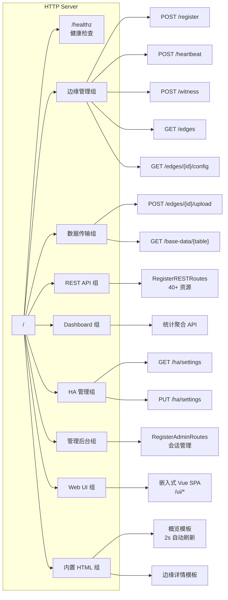
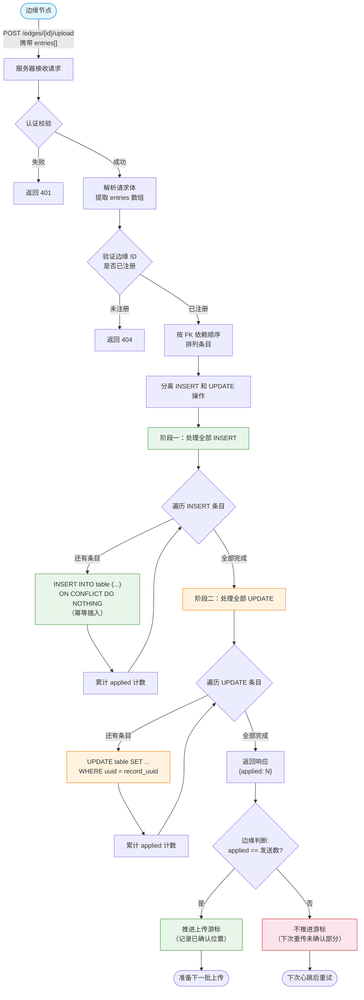

# Silkroad 中心服务器后端深度分析

> **文档编号:** 03/05 — Server Backend Deep Analysis
> **分析日期:** 2026-09-17
> **技术栈:** Go 1.22+ / PostgreSQL / 嵌入式 Vue.js 3 SPA
> **分析范围:** cmd/server/main.go、internal/server/ 全部模块
> **分析方法:** 源码逐行解读，结合 HA 状态机、REST 资源层、数据库 Schema 全面展开

---

## 目录

1. [概述与定位](#1-概述与定位)
2. [服务器启动与 HA 初始化流程](#2-服务器启动与-ha-初始化流程)
3. [配置体系](#3-配置体系)
4. [HTTP 路由架构](#4-http-路由架构)
5. [REST 资源系统](#5-rest-资源系统)
6. [REST API 资源层次图](#6-rest-api-资源层次图)
7. [通用 CRUD 引擎](#7-通用-crud-引擎)
8. [RBAC 权限模型](#8-rbac-权限模型)
9. [边缘数据上传处理流程](#9-边缘数据上传处理流程)
10. [基础数据同步机制](#10-基础数据同步机制)
11. [边缘注册与心跳管理](#11-边缘注册与心跳管理)
12. [Dashboard API](#12-dashboard-api)
13. [数据库 Schema 与迁移体系](#13-数据库-schema-与迁移体系)
14. [数据库 Schema ER 图](#14-数据库-schema-er-图)
15. [HA 高可用机制详解](#15-ha-高可用机制详解)
16. [后台服务体系](#16-后台服务体系)
17. [审计与安全](#17-审计与安全)
18. [设计决策与权衡](#18-设计决策与权衡)
19. [技术总结](#19-技术总结)

---

## 1. 概述与定位

Silkroad 中心服务器（Server）是整个分布式工业自动化系统的**大脑**。它承担以下核心职责：

| 职责 | 说明 |
|------|------|
| **边缘管理** | 注册、心跳监控、配置下发、数据接收 |
| **数据汇聚** | 接收所有边缘节点上报的生产、质量、物流数据 |
| **基础数据分发** | 维护等级、缺陷、批次等基础数据，按版本号同步到边缘 |
| **REST API** | 提供 40+ 资源的通用 CRUD 接口，支持游标分页和 FK 过滤 |
| **Dashboard** | 实时生产统计、等级分布、缺陷分析、小时产量 |
| **高可用** | Primary/Standby 双节点 HA，异步复制，自动故障转移 |
| **Web UI** | 嵌入式 Vue.js 3 SPA 管理界面 |
| **审计追踪** | 敏感操作记录审计日志，含变更前后 JSON 快照 |

### 1.1 与边缘节点的关系

```
┌─────────────────────────────────────────────────────┐
│                  中心服务器 (Server)                  │
│  ┌──────┐ ┌──────┐ ┌──────┐ ┌──────┐ ┌───────────┐ │
│  │ REST │ │  HA  │ │Edge  │ │Dash- │ │  Vue SPA  │ │
│  │Engine│ │Module│ │Mgmt  │ │board │ │  (嵌入式)  │ │
│  └──┬───┘ └──┬───┘ └──┬───┘ └──┬───┘ └─────┬─────┘ │
│     └────────┴────────┴────────┴────────────┘       │
│                    PostgreSQL                        │
└──────────────────────┬──────────────────────────────┘
                       │ HTTP
          ┌────────────┼────────────┐
          │            │            │
     ┌────▼───┐  ┌────▼───┐  ┌────▼───┐
     │ Edge-1 │  │ Edge-2 │  │ Edge-N │
     │(产线A) │  │(产线B) │  │(产线N) │
     └────────┘  └────────┘  └────────┘
```

服务器不直接连接 PLC，所有工业现场数据通过边缘节点采集后上报。服务器是纯 IT 层组件，关注数据治理、业务聚合和高可用。

---

## 2. 服务器启动与 HA 初始化流程

### 2.1 启动入口：cmd/server/main.go

入口文件约 309 行，实现了从配置加载到所有后台服务启动的完整引导序列。启动过程严格有序，任何步骤失败都会导致进程退出（fail-fast 策略）。

#### 启动步骤分解

| 步骤 | 操作 | 失败处理 |
|------|------|---------|
| 1 | 加载配置文件 (YAML/TOML) | fatal 退出 |
| 2 | 初始化日志系统（按天轮转） | fatal 退出 |
| 3 | 初始化 Admin Store（内存会话管理） | fatal 退出 |
| 4 | 连接 PostgreSQL（带连接池配置） | fatal 退出 |
| 5 | HA 初始化（状态恢复、角色判定） | fatal 退出 |
| 6 | 构建 HTTP Handler（路由注册） | fatal 退出 |
| 7 | 启动后台服务（异步 goroutine） | 各自独立运行 |
| 8 | 监听 HTTP 端口 | fatal 退出 |

#### 后台服务启动清单

启动阶段的最后一步会根据当前 HA 角色启动不同的后台服务：

| 服务 | 启动条件 | 执行间隔 | 说明 |
|------|---------|---------|------|
| Replicator | 仅 Primary | 由配置 interval_ms 决定 | HA 异步复制到 Standby |
| Heartbeater | 始终启动 | 固定间隔（秒级） | 向对端报告自身存活 |
| Failover Evaluator | 始终启动 | 2 秒 tick | 监控对端心跳，触发故障转移 |
| Log Cleanup | 始终启动 | 每日 1 次 | 清理过期日志文件 |
| Replication Log Cleanup | 始终启动 | 每日 1 次 | 清理过期 replication_log 记录 |

### 2.2 HA 初始化详细流程

HA 初始化是启动过程中最复杂的部分。它需要处理节点首次启动、崩溃恢复、脑裂恢复等多种场景。

#### HA 初始化伪代码

```
ha_init():
  row = load_or_create_server_ha_row()
  
  if row.role == PRIMARY:
    try:
      peer_state = contact_peer()
      if peer_state.epoch > row.epoch:
        // 对端 epoch 更高，说明本节点落后
        demote_to_standby()
        sync_from_peer()
      else:
        // 本节点 epoch 更高或相等，保持 Primary
        set_replication_capture(true)
    catch:
      // 对端不可达，保持当前角色
      set_replication_capture(true)
      
  else if row.role == STANDBY:
    set_read_only(true)
    set_replication_capture(false)
    
  register_on_promote_callback()
```

#### onPromote 回调

当 Failover Evaluator 决定将 Standby 提升为 Primary 时，触发 `onPromote` 回调：

```
on_promote():
  1. unset_read_only()                    // 解除只读限制
  2. update_ha_role(PRIMARY)              // 更新数据库 HA 角色
  3. increment_epoch()                    // 递增 epoch（防脑裂）
  4. set_replication_capture(true)        // 启用复制捕获触发器
  5. start_replicator(local_max_id)       // 从本地最大 ID 开始复制
  6. webhook_notify("promoted")           // 通知外部系统
```

### 2.3 启动与 HA 初始化流程图

```mermaid
flowchart TD
    START([服务器进程启动]) --> LOAD_CFG[加载配置文件]
    LOAD_CFG --> INIT_LOG[初始化日志系统<br/>按天轮转]
    INIT_LOG --> INIT_ADMIN[初始化 Admin Store<br/>内存会话管理]
    INIT_ADMIN --> INIT_PG[连接 PostgreSQL<br/>配置连接池]
    INIT_PG --> HA_INIT[HA 初始化]
    
    HA_INIT --> LOAD_HA{加载/创建<br/>server_ha 行}
    LOAD_HA --> CHECK_ROLE{当前角色?}
    
    CHECK_ROLE -->|Primary| CONTACT_PEER[尝试联系对端]
    CHECK_ROLE -->|Standby| SET_RO[设为只读模式]
    
    CONTACT_PEER --> PEER_RESULT{对端响应?}
    
    PEER_RESULT -->|对端可达| CHECK_EPOCH{对端 epoch<br/>更高?}
    PEER_RESULT -->|对端不可达| KEEP_PRIMARY[保持 Primary 角色]
    
    CHECK_EPOCH -->|是| DEMOTE[降级为 Standby<br/>同步对端数据]
    CHECK_EPOCH -->|否| KEEP_PRIMARY
    
    DEMOTE --> SET_RO
    SET_RO --> DISABLE_CAPTURE[禁用复制捕获]
    DISABLE_CAPTURE --> REGISTER_CALLBACK[注册 onPromote 回调]
    
    KEEP_PRIMARY --> ENABLE_CAPTURE[启用复制捕获]
    ENABLE_CAPTURE --> REGISTER_CALLBACK
    
    REGISTER_CALLBACK --> BUILD_HTTP[构建 HTTP Handler<br/>注册全部路由]
    BUILD_HTTP --> START_BG[启动后台服务]
    
    START_BG --> BG_REPL{角色为<br/>Primary?}
    BG_REPL -->|是| START_REPL[启动 Replicator<br/>异步复制]
    BG_REPL -->|否| SKIP_REPL[跳过 Replicator]
    
    START_REPL --> START_HB[启动 Heartbeater]
    SKIP_REPL --> START_HB
    
    START_HB --> START_FE[启动 Failover Evaluator<br/>2s tick]
    START_FE --> START_LOG_CLEAN[启动日志清理<br/>每日执行]
    START_LOG_CLEAN --> START_REPL_CLEAN[启动复制日志清理<br/>每日执行]
    START_REPL_CLEAN --> LISTEN[监听 HTTP 端口]
    LISTEN --> RUNNING([服务器运行中])

    %% onPromote 子流程
    subgraph onPromote 回调
        direction TB
        P1[解除只读] --> P2[更新 HA 角色为 Primary]
        P2 --> P3[递增 epoch]
        P3 --> P4[启用复制捕获]
        P4 --> P5[启动 Replicator<br/>从 local max_id 开始]
        P5 --> P6[Webhook 通知外部系统]
    end
    
    START_FE -.->|故障转移触发| P1

    style START fill:#e1f5fe,stroke:#0288d1
    style RUNNING fill:#e8f5e9,stroke:#388e3c
    style DEMOTE fill:#fff3e0,stroke:#f57c00
    style P1 fill:#fce4ec,stroke:#c62828
    style P6 fill:#fce4ec,stroke:#c62828
```



---

## 3. 配置体系

### 3.1 配置结构：internal/server/config.go

配置文件约 184 行，定义了服务器运行所需的全部参数。采用嵌套结构体设计，顶层为 `FileConfig`。

#### FileConfig 顶层结构

```go
type FileConfig struct {
    Node          string         // 节点标识符（全局唯一）
    Listen        string         // HTTP 监听地址，如 ":8080"
    AdminPassword string         // 管理员密码
    ManagedDir    string         // 托管目录（存储日志、临时文件）
    Database      DatabaseConfig // PostgreSQL 连接配置
    HA            HAConfig       // 高可用配置
    Log           LogConfig      // 日志配置
    Edges         []PlannedEdge  // 预声明的边缘节点列表
}
```

#### DatabaseConfig — 数据库连接

| 字段 | 类型 | 说明 |
|------|------|------|
| DSN | string | PostgreSQL 连接字符串 |
| MaxOpenConns | int | 最大打开连接数 |
| MaxIdleConns | int | 最大空闲连接数 |
| ConnMaxLifetime | duration | 连接最大生命周期 |
| ConnMaxIdleTime | duration | 空闲连接最大存活时间 |

#### HAConfig — 高可用配置

```go
type HAConfig struct {
    Role        string            // "primary" 或 "standby"
    PeerAddr    string            // 对端服务器地址
    Replication ReplicationConfig // 复制配置
    Webhook     WebhookConfig     // 事件通知配置
}
```

#### ReplicationConfig — 复制参数

| 字段 | 类型 | 默认值 | 说明 |
|------|------|--------|------|
| Mode | string | "async" | **仅支持 async** — 同步模式经评估后被否决 |
| IntervalMs | int | — | 复制轮询间隔（毫秒） |
| RetentionDays | int | — | 复制日志保留天数 |

**设计决策 — 为什么只支持异步复制：**

同步复制（sync mode）在工业环境中被评估后明确否决，原因包括：

1. **网络不可靠** — 工厂网络环境复杂，瞬时断连常见，同步复制会阻塞写入
2. **延迟敏感** — 生产线数据上报不能等待跨节点确认
3. **简单性** — 异步复制的实现和调试复杂度远低于同步模式
4. **可接受的 RPO** — 业务可容忍秒级数据丢失，故障转移后边缘会重传未确认数据

配置文件中若设置 `mode: sync` 会触发启动校验失败，强制修正为 `async`。

#### WebhookConfig — 事件通知

| 字段 | 类型 | 说明 |
|------|------|------|
| URL | string | Webhook 目标地址 |
| Format | string | 请求格式 |
| TimeoutMs | int | 请求超时（毫秒） |
| RetryCount | int | 失败重试次数 |
| RetryIntervalMs | int | 重试间隔（毫秒） |

Webhook 用于在 HA 角色变更时通知外部系统（如负载均衡器、监控平台）。

#### PlannedEdge — 预声明边缘节点

```go
type PlannedEdge struct {
    ID            string        // 边缘节点标识
    Name          string        // 可读名称
    Area          string        // 所属区域
    StoragePolicy StoragePolicy // 存储策略
}

type StoragePolicy struct {
    LogRetentionDays  int // 日志保留天数
    DataRetentionDays int // 数据保留天数
}
```

PlannedEdge 允许服务器预先声明期望的边缘节点。当边缘注册时，服务器会将配置的存储策略下发给边缘。

### 3.2 配置校验规则

| 规则 | 说明 |
|------|------|
| HA 需要数据库 | 启用 HA 时数据库配置为必填 |
| 仅异步复制 | replication.mode 强制为 "async" |
| 节点标识唯一 | node 不能与对端相同 |
| 监听地址合法 | listen 必须为有效的 host:port 格式 |

---

## 4. HTTP 路由架构

### 4.1 路由注册：internal/server/http.go

HTTP 层约 259 行，使用标准库 `net/http` 配合轻量路由器实现。路由按功能域组织，层次清晰。

#### 路由总览表

| 路由组 | 方法 | 路径模式 | 功能 | 认证 |
|--------|------|---------|------|------|
| **健康检查** | GET | `/healthz` | 健康状态（含 HA 角色） | 无 |
| **边缘管理** | POST | `/register` | 边缘节点注册 | Edge Token |
| | POST | `/heartbeat` | 心跳上报 | Edge Token |
| | POST | `/witness` | PLC 可达性报告 | Edge Token |
| | GET | `/edges` | 边缘列表 | Admin |
| | GET | `/edges/{id}/config` | 边缘配置下发 | Edge Token |
| **数据传输** | POST | `/edges/{id}/upload` | 边缘数据上传 | Edge Token |
| | GET | `/base-data/{table}` | 基础数据拉取 | Edge Token |
| **REST API** | 多种 | `/api/v1/{resource}` | 40+ 资源 CRUD | RBAC |
| **Dashboard** | GET | `/api/dashboard/*` | 统计数据 | Admin |
| **HA 管理** | GET/PUT | `/ha/settings` | HA 运行时配置 | Admin |
| **管理后台** | 多种 | `/admin/*` | 会话管理的管理界面 | Session |
| **Web UI** | GET | `/ui/*` | 嵌入式 Vue SPA | 无 |
| **内置页面** | GET | `/` | 概览模板（2s 自动刷新） | 无 |
| | GET | `/edge/{id}` | 边缘详情模板 | 无 |

### 4.2 路由组织架构图



### 4.3 /healthz 端点

健康检查端点返回以下信息：

```json
{
  "status": "ok",
  "ha_role": "primary",
  "node": "server-01",
  "uptime": "3h24m15s"
}
```

此端点无需认证，用于负载均衡器探测和监控系统集成。HA 角色字段允许外部系统识别当前活跃的 Primary 节点。

### 4.4 心跳端点详解

`POST /heartbeat` 是边缘管理中信息密度最高的端点。每次心跳不仅报告存活状态，还携带：

| 字段 | 说明 |
|------|------|
| storage_policy | 边缘当前的存储策略 |
| config_version | 边缘当前配置版本号 |
| base_data_revisions | 各基础数据表的当前版本号 |

服务器据此判断是否需要推送新配置或触发基础数据同步。

### 4.5 内置 HTML 模板

服务器内置两个 Go 模板渲染的 HTML 页面，用于快速查看系统状态：

1. **概览页 `/`** — 显示所有边缘状态、HA 信息、系统指标，每 2 秒自动刷新
2. **边缘详情页 `/edge/{id}`** — 特定边缘的详细运行状态

这些页面独立于 Vue SPA，即使前端资源损坏也能访问。

---

## 5. REST 资源系统

### 5.1 资源定义模型：internal/server/rest.go

REST 系统是服务器最庞大的组件（约 629 行），采用**声明式资源定义 + 通用 CRUD 引擎**的设计模式。

#### Resource 结构体

```go
type Resource struct {
    Name        string     // 资源名称（URL 路径段）
    Table       string     // 数据库表名
    Cols        []string   // 列名列表
    OrderBy     string     // 默认排序
    HasUUID     bool       // 是否有 uuid 列
    HasRevision bool       // 是否有 revision 列（基础数据）
    ReadOnly    bool       // 只读资源
    NoUpdate    bool       // 禁止更新（只允许创建和读取）
    SoftDelete  bool       // 软删除（deleted + deleted_at）
    HideCols    []string   // 隐藏列（不在 API 响应中暴露）
    Filters     []Filter   // 支持的过滤器
    Group       string     // 资源分组（用于 RBAC）
    AdminOnly   bool       // 仅管理员可访问
    Sensitive   bool       // 敏感资源（操作需审计）
}
```

#### 资源定义关键属性解释

| 属性 | 用途 | 示例 |
|------|------|------|
| `HasUUID` | 创建时自动生成 UUID | 所有业务实体 |
| `HasRevision` | 创建/更新时通过 NextRevision 自动递增版本号 | 等级、缺陷等基础数据 |
| `SoftDelete` | 删除时标记 deleted=true 而非物理删除 | 7 个配置表 |
| `HideCols` | API 输出中隐藏敏感字段 | user_account.password_hash |
| `Sensitive` | 写操作触发 auditRestWrite | user_account |
| `AdminOnly` | 仅 admin 角色可访问 | user_account, audit_log |

### 5.2 九层资源架构

40+ 资源按业务域划分为 9 个层次，从基础配置到系统管理逐层递进：

#### L1 — 基础配置层 (Base Data)

| 资源名 | 表名 | 关键特性 |
|--------|------|---------|
| grade_category | grade_category | SoftDelete, HasRevision |
| grade | grade | SoftDelete, HasRevision |
| defect | defect | SoftDelete, HasRevision |
| paper_tube_color | paper_tube_color | SoftDelete, HasRevision |
| packing_map | packing_map | SoftDelete, HasRevision |

L1 全部支持**软删除**和**版本追踪**。这些是系统的基础配置数据，修改后通过 revision 机制同步到所有边缘节点。

#### L2 — 批次管理层 (Lot)

| 资源名 | 表名 | 关键特性 |
|--------|------|---------|
| lot | lot | HasRevision — 核心实体 |
| lot_revision | lot_revision | 子表 — 批次修订历史 |
| lot_grade_range | lot_grade_range | 子表 — 等级范围配置 |
| lot_weight | lot_weight | 子表 — 重量范围配置 |
| lot_packing_map | lot_packing_map | 子表 — 打包映射配置 |
| lot_erp_order | lot_erp_order | 子表 — ERP 订单关联 |
| lot_line_binding | lot_line_binding | 子表 — 产线绑定 |

L2 以 `lot` 为核心，附带 6 个子表。批次（Lot）是丝饼生产的最小管理单元，其配置的复杂性体现在多维度子表的设计上。

#### L3 — 工作流层 (Workflow)

| 资源名 | 表名 | 关键特性 |
|--------|------|---------|
| workflow_profile | workflow_profile | HasRevision — 业务流程模板 |

工作流配置文件定义了生产线的自动化行为模板。

#### L4 — 生产数据层 (Production)

| 资源名 | 表名 | 关键特性 |
|--------|------|---------|
| barrel | barrel | 筒管 — 生产容器 |
| barrel_plc_snapshot | barrel_plc_snapshot | PLC 数据快照 |
| bobbin | bobbin | 丝饼 — 核心产出物 |
| bobbin_grade | bobbin_grade | 丝饼等级 |
| bobbin_grade_defect | bobbin_grade_defect | 丝饼缺陷记录 |

L4 记录实际生产过程中的数据。barrel（筒管）承载 bobbin（丝饼），bobbin 的等级和缺陷通过关联表管理。

#### L5 — 运输追踪层 (Transport)

| 资源名 | 表名 | 关键特性 |
|--------|------|---------|
| carrier | carrier | 载具（小车/AGV） |
| carrier_load | carrier_load | 载具装载记录 |
| carrier_tracking | carrier_tracking | 载具位置追踪 |

#### L6 — 质量检测层 (Quality)

| 资源名 | 表名 | 关键特性 |
|--------|------|---------|
| inspection_order | inspection_order | 质检工单 |
| inspection_order_bobbin | inspection_order_bobbin | 工单明细 |
| sorting_record | sorting_record | 分拣记录 |
| weighing_record | weighing_record | 称重记录 |

#### L7 — 打包管理层 (Packing)

| 资源名 | 表名 | 关键特性 |
|--------|------|---------|
| packing_order | packing_order | 打包工单 |
| packing_sub_order | packing_sub_order | 子工单 |
| box | box | 箱 |
| box_bobbin | box_bobbin | 箱内丝饼 |
| pallet | pallet | 托盘 |
| pallet_bobbin | pallet_bobbin | 托盘内丝饼 |
| print_job | print_job | 打印任务 |

L7 是实体最多的层，覆盖从工单创建到标签打印的完整打包流程。

#### L8 — 物流仓储层 (Logistics)

| 资源名 | 表名 | 关键特性 |
|--------|------|---------|
| movement | movement | 物料移动记录 |
| monorail_task | monorail_task | 单轨车任务 |
| hourly_production | hourly_production | 小时产量统计 |
| warehouse_location | warehouse_location | 仓库库位 |
| warehouse_transaction | warehouse_transaction | 仓库事务 |

#### L9 — 系统管理层 (System)

| 资源名 | 表名 | 关键特性 |
|--------|------|---------|
| erp_shipment | erp_shipment | ERP 发货单 |
| user_account | user_account | AdminOnly, HideCols:password_hash |
| audit_log | audit_log | ReadOnly — 审计日志 |
| edge_alarm | edge_alarm | ReadOnly — 边缘告警 |

L9 包含系统级资源。user_account 隐藏密码哈希字段；audit_log 和 edge_alarm 为只读。

---

## 6. REST API 资源层次图

```mermaid
graph TB
    subgraph "L1 — 基础配置层"
        style L1 fill:#e3f2fd,stroke:#1565c0
        GC[grade_category<br/>等级分类]
        GR[grade<br/>等级]
        DF[defect<br/>缺陷]
        PTC[paper_tube_color<br/>纸管颜色]
        PM[packing_map<br/>打包映射]
    end

    subgraph "L2 — 批次管理层"
        style L2 fill:#e8f5e9,stroke:#2e7d32
        LOT[lot<br/>批次<br/>核心实体]
        LR[lot_revision<br/>修订历史]
        LGR[lot_grade_range<br/>等级范围]
        LW[lot_weight<br/>重量范围]
        LPM[lot_packing_map<br/>打包映射]
        LEO[lot_erp_order<br/>ERP关联]
        LLB[lot_line_binding<br/>产线绑定]
    end
    
    subgraph "L3 — 工作流层"
        style L3 fill:#fff3e0,stroke:#ef6c00
        WP[workflow_profile<br/>工作流模板]
    end

    subgraph "L4 — 生产数据层"
        style L4 fill:#fce4ec,stroke:#c62828
        BAR[barrel<br/>筒管]
        BPS[barrel_plc_snapshot<br/>PLC快照]
        BOB[bobbin<br/>丝饼]
        BG[bobbin_grade<br/>丝饼等级]
        BGD[bobbin_grade_defect<br/>丝饼缺陷]
    end
    
    subgraph "L5 — 运输追踪层"
        style L5 fill:#f3e5f5,stroke:#7b1fa2
        CAR[carrier<br/>载具]
        CL[carrier_load<br/>装载记录]
        CT[carrier_tracking<br/>位置追踪]
    end
    
    subgraph "L6 — 质量检测层"
        style L6 fill:#e0f2f1,stroke:#00695c
        IO[inspection_order<br/>质检工单]
        IOB[inspection_order_bobbin<br/>工单明细]
        SR[sorting_record<br/>分拣记录]
        WR[weighing_record<br/>称重记录]
    end
    
    subgraph "L7 — 打包管理层"
        style L7 fill:#fff9c4,stroke:#f9a825
        PO[packing_order<br/>打包工单]
        PSO[packing_sub_order<br/>子工单]
        BX[box<br/>箱]
        BB[box_bobbin<br/>箱内丝饼]
        PAL[pallet<br/>托盘]
        PB[pallet_bobbin<br/>托盘丝饼]
        PJ[print_job<br/>打印任务]
    end
    
    subgraph "L8 — 物流仓储层"
        style L8 fill:#efebe9,stroke:#4e342e
        MOV[movement<br/>移动记录]
        MT[monorail_task<br/>单轨车任务]
        HP[hourly_production<br/>小时产量]
        WL[warehouse_location<br/>库位]
        WT[warehouse_transaction<br/>仓库事务]
    end
    
    subgraph "L9 — 系统管理层"
        style L9 fill:#eceff1,stroke:#37474f
        ES[erp_shipment<br/>ERP发货]
        UA[user_account<br/>用户账户<br/>AdminOnly]
        AL[audit_log<br/>审计日志<br/>ReadOnly]
        EA[edge_alarm<br/>边缘告警<br/>ReadOnly]
    end

    %% 层间关系
    GC -->|分类包含| GR
    GR -->|引用| BG
    DF -->|引用| BGD
    PM -->|配置| LPM
    
    LOT -->|子表| LR
    LOT -->|子表| LGR
    LOT -->|子表| LW
    LOT -->|子表| LPM
    LOT -->|子表| LEO
    LOT -->|子表| LLB
    
    BAR -->|承载| BOB
    BAR -->|快照| BPS
    BOB -->|等级| BG
    BG -->|缺陷| BGD
    
    CAR -->|装载| CL
    CAR -->|追踪| CT
    
    IO -->|明细| IOB
    IOB -->|引用| BOB
    
    PO -->|子单| PSO
    PO -->|装箱| BX
    BX -->|内容| BB
    PO -->|组盘| PAL
    PAL -->|内容| PB
    PO -->|打印| PJ
    
    BB -->|引用| BOB
    PB -->|引用| BOB
    
    WL -->|库位| WT
```



---

## 7. 通用 CRUD 引擎

### 7.1 引擎设计理念

REST 系统的核心创新在于**零代码 CRUD**：只需声明 Resource 结构体，引擎自动生成全部 CRUD 端点。这使得添加新资源只需增加一个声明，无需编写任何处理函数。

### 7.2 操作处理函数

#### handleList — 列表查询

```
handleList(resource, request):
  1. 解析分页参数（游标分页，非 offset 分页）
  2. 解析 FK 过滤参数
  3. FK 过滤解析：
     - 支持 ?lot_id=xxx 等 FK 过滤
     - 自动解析关联表外键关系
  4. 构建 SQL: SELECT cols FROM table WHERE filters ORDER BY order_by
  5. 如果 SoftDelete: 追加 WHERE deleted = false
  6. 执行查询
  7. 返回 JSON 数组 + 分页游标
```

**游标分页 vs offset 分页：**

| 特性 | 游标分页 (Cursor) | Offset 分页 |
|------|-------------------|------------|
| 性能 | O(1) — 不受页码影响 | O(n) — 大 offset 性能差 |
| 一致性 | 数据变化时不会跳过/重复 | 插入/删除会导致偏移 |
| 实现 | 基于 id 或 created_at 游标 | 基于 OFFSET 子句 |
| 适用场景 | 大数据量、实时更新 | 小数据量、跳页需求 |

Silkroad 选择游标分页，因为工业数据持续高速写入，offset 分页会导致数据跳过。

#### handleGet / handleGetByID — 单条查询

```
handleGet(resource, id):
  1. 从 URL 路径提取 ID
  2. SELECT cols FROM table WHERE id = $1
  3. 如果 SoftDelete: 追加 AND deleted = false
  4. 隐藏 HideCols 中声明的字段
  5. 返回 JSON 对象
```

#### handleCreate — 创建

```
handleCreate(resource, request):
  1. 解析请求体 JSON
  2. 剥离自动管理字段:
     - id, created_at, updated_at
     - synced_at, edge_id
     - 其他系统自动赋值字段
  3. 如果 HasUUID: 自动生成 UUID
  4. 如果 HasRevision: 调用 NextRevision() 获取新版本号
  5. INSERT INTO table (cols) VALUES ($1, $2, ...)
  6. 返回创建后的完整记录
```

#### handleUpdate — 更新

```
handleUpdate(resource, id, request):
  1. 解析请求体 JSON
  2. 剥离不可变字段:
     - id, uuid, created_at
     - origin, deleted, deleted_at
  3. 剥离自动管理字段
  4. UPDATE table SET cols WHERE id = $1
  5. 返回更新后的完整记录
```

#### handleSoftDelete — 软删除

```
handleSoftDelete(resource, id):
  1. 从 URL 路径提取 ID
  2. UPDATE table SET deleted = true, deleted_at = NOW() WHERE id = $1
  3. 返回成功状态
```

### 7.3 自动管理字段列表

以下字段在创建/更新时**自动剥离**，不接受客户端赋值：

| 字段 | 创建时行为 | 更新时行为 |
|------|-----------|-----------|
| id | 数据库自增 | 不可修改 |
| uuid | 自动生成（如果 HasUUID） | 不可修改 |
| created_at | 数据库 DEFAULT NOW() | 不可修改 |
| updated_at | 数据库 DEFAULT NOW() | 数据库触发器更新 |
| synced_at | NULL（首次同步时更新） | 剥离 |
| edge_id | 从上下文推断 | 剥离 |
| origin | 从上下文推断 | 不可修改 |
| deleted | DEFAULT false | 不可修改（只能通过 soft delete） |
| deleted_at | NULL | 不可修改 |

### 7.4 不可变字段规则

更新操作时以下字段**绝对不可修改**：

```go
immutableOnUpdate := []string{
    "id",         // 主键
    "uuid",       // 全局唯一标识
    "created_at", // 创建时间
    "origin",     // 数据来源
    "deleted",    // 删除标记
    "deleted_at", // 删除时间
}
```

即使客户端在更新请求中发送了这些字段的值，引擎也会静默忽略。

---

## 8. RBAC 权限模型

### 8.1 角色定义

系统定义三种角色，权限递减：

| 角色 | 说明 | 可写分组 |
|------|------|---------|
| admin | 系统管理员 | 全部分组 |
| operator | 操作员 | production, quality, packing |
| viewer | 只读用户 | 无（仅查看） |

### 8.2 canWrite 权限判定

```go
func canWrite(role string, group string) bool {
    switch role {
    case "admin":
        return true  // 管理员可写所有分组
    case "operator":
        return group == "production" ||
               group == "quality" ||
               group == "packing"
    case "viewer":
        return false // 只读用户无写权限
    default:
        return false
    }
}
```

### 8.3 资源分组与权限矩阵

| 资源分组 | 包含资源 | admin | operator | viewer |
|---------|---------|-------|----------|--------|
| base-data | grade_category, grade, defect, paper_tube_color, packing_map | R/W | R | R |
| production | barrel, barrel_plc_snapshot, bobbin, bobbin_grade, bobbin_grade_defect | R/W | R/W | R |
| quality | inspection_order, inspection_order_bobbin, sorting_record, weighing_record | R/W | R/W | R |
| packing | packing_order, packing_sub_order, box, box_bobbin, pallet, pallet_bobbin, print_job | R/W | R/W | R |
| logistics | movement, monorail_task, hourly_production, warehouse_location, warehouse_transaction | R/W | R | R |
| system | user_account, audit_log, edge_alarm, erp_shipment | R/W | R | R |

### 8.4 AdminOnly 资源

标记为 `AdminOnly` 的资源完全绕过分组权限，仅 admin 角色可访问：

- `user_account` — 用户账户管理
- `audit_log` — 审计日志查询

非 admin 用户访问这些资源会收到 `403 Forbidden`。

---

## 9. 边缘数据上传处理流程

### 9.1 上传协议

边缘节点通过 `POST /edges/{id}/upload` 端点向服务器批量上报数据变更。

#### 请求格式

```json
{
  "entries": [
    {
      "table": "bobbin",
      "operation": "insert",
      "record_uuid": "550e8400-e29b-41d4-a716-446655440000",
      "data": {
        "uuid": "550e8400-e29b-41d4-a716-446655440000",
        "barrel_id": 42,
        "weight": 3.75,
        "grade_id": 5
      }
    },
    {
      "table": "bobbin_grade",
      "operation": "insert",
      "record_uuid": "660e8400-e29b-41d4-a716-446655440001",
      "data": { ... }
    }
  ]
}
```

### 9.2 FK 顺序处理

上传的条目必须按**外键依赖顺序**排列。服务器端按照与边缘 `UploadOrder` 一致的顺序处理，确保父记录先于子记录插入。

FK 依赖链示例：

```
barrel → bobbin → bobbin_grade → bobbin_grade_defect
                ↘ carrier_load
                ↘ box_bobbin
                ↘ pallet_bobbin
```

### 9.3 Insert 语义：幂等性保证

```sql
INSERT INTO bobbin (uuid, barrel_id, weight, grade_id, ...)
VALUES ($1, $2, $3, $4, ...)
ON CONFLICT DO NOTHING;
```

使用 `ON CONFLICT DO NOTHING` 实现**幂等插入**。即使边缘因网络中断重传相同数据，服务器也不会产生重复记录。这是分布式系统中保证**至少一次投递**语义安全的关键设计。

### 9.4 Update 处理

更新操作在所有插入完成后执行。按 `record_uuid` 定位记录进行更新：

```sql
UPDATE bobbin SET weight = $1, grade_id = $2
WHERE uuid = $3;
```

更新总是在插入之后处理，确保被更新的记录已经存在。

### 9.5 响应与游标推进

```json
{
  "applied": 15
}
```

响应返回实际应用的条目数。**关键规则：边缘只有在所有条目都被接受时才推进游标**。如果 applied 数小于发送数，边缘不推进游标，下次重传未接受的条目。

这确保了数据传输的**精确一次**语义（exactly-once），通过幂等插入 + 全部确认的组合实现。

### 9.6 边缘数据上传处理流程图



---

## 10. 基础数据同步机制

### 10.1 同步方向

基础数据同步是**服务器→边缘**的单向同步，与边缘数据上传方向相反：

```
服务器 ──基础数据──→ 边缘节点
       grade, defect, lot, ...
       
边缘节点 ──生产数据──→ 服务器
         bobbin, barrel, ...
```

### 10.2 版本追踪机制

| 组件 | 维护方 | 说明 |
|------|--------|------|
| revision 列 | 服务器 | 每次创建/更新时自动递增 |
| base_data_revisions | 边缘 | 心跳时上报各表当前版本号 |
| NextRevision() | 服务器 | 全局版本号生成器（单调递增） |

### 10.3 同步流程

```
1. 边缘心跳上报: base_data_revisions = {
     "grade": 42,
     "defect": 38,
     "lot": 156
   }
   
2. 服务器比对本地最新 revision

3. 如果 grade 本地版本 > 42:
   → 边缘下次请求 GET /base-data/grade?since_revision=42
   → 服务器返回 revision > 42 的所有记录
   
4. 边缘接收后更新本地数据，推进本地版本号
```

### 10.4 可同步的基础数据表

| 表名 | 业务含义 | 同步频率 |
|------|---------|---------|
| grade_category | 等级分类 | 低（配置变更时） |
| grade | 等级定义 | 低 |
| defect | 缺陷代码 | 低 |
| paper_tube_color | 纸管颜色 | 低 |
| packing_map | 打包映射规则 | 低 |
| lot | 批次配置 | 中（每班次可能变更） |
| workflow_profile | 工作流模板 | 低 |

所有这些表都设置了 `HasRevision = true`，确保每次修改都会递增版本号。

---

## 11. 边缘注册与心跳管理

### 11.1 注册流程（internal/server/registry.go）

Registry 维护一个**内存中**的边缘节点状态映射。

#### POST /register 请求

```json
{
  "id": "edge-line-A",
  "name": "A线边缘节点",
  "version": "1.2.0",
  "plcs": [
    {"ip": "192.168.1.10", "type": "S7-1500", "rack": 0, "slot": 1},
    {"ip": "192.168.1.11", "type": "S7-1500", "rack": 0, "slot": 1}
  ]
}
```

#### 注册处理逻辑

```
register(edge_info):
  1. 验证 edge_info.id 非空
  2. 检查是否为 PlannedEdge（预配置边缘）
  3. 如果是 PlannedEdge:
     - 关联预配置的 area 和 storage_policy
  4. 更新内存 Registry:
     - 记录 ID, Name, Version, PLCs
     - 设置 last_seen = now()
     - 状态设为 Online
  5. 返回注册确认 + 服务器配置
```

### 11.2 心跳处理

#### POST /heartbeat 请求

```json
{
  "edge_id": "edge-line-A",
  "storage_policy": { "log_retention_days": 30, "data_retention_days": 90 },
  "config_version": 5,
  "base_data_revisions": {
    "grade": 42,
    "defect": 38,
    "lot": 156
  },
  "plc_states": [
    {"ip": "192.168.1.10", "connected": true, "cycle_time_ms": 50},
    {"ip": "192.168.1.11", "connected": false, "error": "timeout"}
  ]
}
```

#### 心跳处理逻辑

```
heartbeat(info):
  1. 查找 Registry 中的边缘记录
  2. 更新 last_seen = now()
  3. 收集 PLC 状态信息
  4. 比对 config_version 是否需要更新
  5. 比对 base_data_revisions 是否需要同步
  6. 返回心跳确认
```

### 11.3 Witness（见证者）机制

```
POST /witness 请求:
{
  "reporter_id": "edge-line-A",
  "target_plcs": [
    {"ip": "192.168.1.20", "reachable": true},
    {"ip": "192.168.1.21", "reachable": false}
  ]
}
```

Witness 机制允许边缘节点报告**其他边缘**的 PLC 可达性。这提供了网络拓扑的额外观测维度，用于辅助判断 PLC 是否真正离线（避免单点观测偏差）。

### 11.4 离线检测

```go
// OfflineAfter: 可配置超时，默认为 heartbeat_ms × 系数
func (r *Registry) isOffline(edge *EdgeState) bool {
    return time.Since(edge.LastSeen) > r.offlineAfter
}
```

离线判定基于最后一次心跳时间。超时后边缘被标记为 Offline，Dashboard 和告警系统会相应更新。

---

## 12. Dashboard API

### 12.1 功能概述

Dashboard API 通过 `registerDashboardAPI` 注册，提供实时生产统计数据。所有查询支持日期范围过滤。

### 12.2 统计指标

#### 生产概况聚合

| 指标 | 数据源 | 说明 |
|------|--------|------|
| barrels_count | barrel 表 | 当日筒管总数 |
| bobbins_count | bobbin 表 | 当日丝饼总数 |
| sorted_count | sorting_record 表 | 当日分拣完成数 |
| weighed_count | weighing_record 表 | 当日称重完成数 |
| packed_count | packing_order 表 | 当日打包完成数 |

#### 小时产量图表

```sql
SELECT date_trunc('hour', created_at) AS hour,
       line_id,
       COUNT(*) AS count
FROM hourly_production
WHERE created_at BETWEEN $1 AND $2
GROUP BY hour, line_id
ORDER BY hour;
```

返回格式适配前端折线图/柱状图渲染。

#### 等级分布（饼图）

```sql
SELECT g.name AS grade_name,
       COUNT(*) AS count
FROM bobbin_grade bg
JOIN grade g ON bg.grade_id = g.id
WHERE bg.created_at BETWEEN $1 AND $2
GROUP BY g.name
ORDER BY count DESC;
```

#### 缺陷分析（TOP 10 条形图）

```sql
SELECT d.name AS defect_name,
       COUNT(*) AS count
FROM bobbin_grade_defect bgd
JOIN defect d ON bgd.defect_id = d.id
WHERE bgd.created_at BETWEEN $1 AND $2
GROUP BY d.name
ORDER BY count DESC
LIMIT 10;
```

#### 产线统计表

```sql
SELECT line_id,
       COUNT(*) AS total,
       COUNT(*) FILTER (WHERE grade_name = 'A') AS grade_a,
       COUNT(*) FILTER (WHERE grade_name = 'B') AS grade_b,
       ...
FROM production_summary_view
WHERE date = $1
GROUP BY line_id;
```

#### 边缘状态摘要

| 字段 | 说明 |
|------|------|
| total | 已注册边缘总数 |
| online | 当前在线数 |
| offline | 当前离线数 |
| planned | 预配置但未注册数 |

### 12.3 Dashboard 数据流

```
前端 (Vue SPA)
  │
  ├── GET /api/dashboard/overview?date=2026-09-17
  │     → { barrels: 1200, bobbins: 28800, sorted: 27500, ... }
  │
  ├── GET /api/dashboard/hourly?date=2026-09-17
  │     → [{ hour: "08:00", line_A: 450, line_B: 380 }, ...]
  │
  ├── GET /api/dashboard/grade-distribution?date=2026-09-17
  │     → [{ name: "A", count: 18500 }, { name: "B", count: 6200 }, ...]
  │
  ├── GET /api/dashboard/defect-analysis?date=2026-09-17
  │     → [{ name: "毛丝", count: 320 }, { name: "油污", count: 210 }, ...]
  │
  ├── GET /api/dashboard/line-stats?date=2026-09-17
  │     → [{ line: "A", total: 4800, grade_a: 3200, ... }, ...]
  │
  └── GET /api/dashboard/edge-status
        → { total: 8, online: 7, offline: 1, planned: 2 }
```

---

## 13. 数据库 Schema 与迁移体系

### 13.1 迁移系统

Schema 管理代码位于 `internal/server/store/schema.go`（约 1122 行），包含 21+ 个版本化迁移（v1 到 v18+）。

#### 迁移策略

- **顺序执行**：每个迁移有唯一版本号，严格按序执行
- **幂等性**：使用 `IF NOT EXISTS` 和 `DO $$ ... $$` 块确保重复执行安全
- **回滚能力**：迁移注释记录了设计决策和历史 bug，便于理解回滚影响
- **自动运行**：服务器启动时自动检测并执行未应用的迁移

#### 迁移版本示例

| 版本 | 内容 | 说明 |
|------|------|------|
| v1 | 基础表创建 | audit_log, grade_category, grade, defect |
| v2 | 生产表 | barrel, bobbin, bobbin_grade |
| v3 | HA 表 | server_ha, replication_log |
| v4 | 批次扩展 | lot 子表群 |
| v5 | 运输表 | carrier, carrier_load, carrier_tracking |
| v6 | 质检表 | inspection_order, sorting_record |
| v7 | 打包表 | packing_order, box, pallet |
| v8 | 仓库表 | warehouse_location, warehouse_transaction |
| v9 | 用户认证 | user_account, user_session |
| v10+ | 增量改进 | 索引、约束、字段调整 |

### 13.2 核心数据表详解

#### 审计日志表 — audit_log

```sql
CREATE TABLE audit_log (
    id            BIGSERIAL PRIMARY KEY,
    timestamp     TIMESTAMPTZ NOT NULL DEFAULT NOW(),
    operator      TEXT NOT NULL,          -- 操作人
    resource      TEXT NOT NULL,          -- 资源名
    operation     TEXT NOT NULL,          -- create/update/delete
    record_id     TEXT,                   -- 记录标识
    changes       JSONB,                 -- 变更前后快照
    ip_address    TEXT                    -- 客户端 IP
);
```

`changes` 字段以 JSON 格式记录变更前后的值，例如：

```json
{
  "before": { "weight": 3.5, "grade_id": 5 },
  "after":  { "weight": 3.75, "grade_id": 6 }
}
```

#### HA 状态表 — server_ha

```sql
CREATE TABLE server_ha (
    id            SERIAL PRIMARY KEY,
    node          TEXT UNIQUE NOT NULL,    -- 节点标识
    role          TEXT NOT NULL,           -- 'primary' 或 'standby'
    epoch         BIGINT NOT NULL DEFAULT 0, -- 防脑裂计数器
    last_heartbeat TIMESTAMPTZ,           -- 最后心跳时间
    peer_addr     TEXT,                   -- 对端地址
    created_at    TIMESTAMPTZ DEFAULT NOW(),
    updated_at    TIMESTAMPTZ DEFAULT NOW()
);
```

#### 复制日志表 — replication_log

```sql
CREATE TABLE replication_log (
    id            BIGSERIAL PRIMARY KEY,
    table_name    TEXT NOT NULL,           -- 变更的表名
    operation     TEXT NOT NULL,           -- INSERT/UPDATE/DELETE
    record_id     BIGINT,                 -- 记录主键
    record_uuid   TEXT,                   -- 记录 UUID
    old_data      JSONB,                 -- 变更前数据
    new_data      JSONB,                 -- 变更后数据
    captured_at   TIMESTAMPTZ DEFAULT NOW()
);
```

#### 批次表 — lot（核心实体）

```sql
CREATE TABLE lot (
    id            SERIAL PRIMARY KEY,
    uuid          TEXT UNIQUE NOT NULL,
    name          TEXT NOT NULL,
    revision      INTEGER NOT NULL DEFAULT 1,
    status        TEXT NOT NULL DEFAULT 'draft',
    product_type  TEXT,
    specification TEXT,
    target_weight NUMERIC,
    notes         TEXT,
    created_at    TIMESTAMPTZ DEFAULT NOW(),
    updated_at    TIMESTAMPTZ DEFAULT NOW()
);
```

lot 的 6 个子表通过 `lot_id` 外键关联：

| 子表 | FK | 用途 |
|------|-----|------|
| lot_revision | lot_id | 批次修订记录（谁在何时改了什么） |
| lot_grade_range | lot_id | 该批次允许的等级范围 |
| lot_weight | lot_id | 该批次的重量标准范围 |
| lot_packing_map | lot_id | 该批次的打包规则映射 |
| lot_erp_order | lot_id | 关联的 ERP 订单号 |
| lot_line_binding | lot_id | 绑定的生产线 |

#### 丝饼表 — bobbin（核心产出物）

```sql
CREATE TABLE bobbin (
    id            SERIAL PRIMARY KEY,
    uuid          TEXT UNIQUE NOT NULL,
    barrel_id     INTEGER REFERENCES barrel(id),
    position      INTEGER,                -- 筒管上的位置
    weight        NUMERIC,               -- 重量（kg）
    status        TEXT DEFAULT 'produced',
    edge_id       TEXT,                   -- 来源边缘节点
    created_at    TIMESTAMPTZ DEFAULT NOW(),
    synced_at     TIMESTAMPTZ            -- 服务器接收时间
);
```

#### 用户账户表 — user_account

```sql
CREATE TABLE user_account (
    id            SERIAL PRIMARY KEY,
    username      TEXT UNIQUE NOT NULL,
    password_hash TEXT NOT NULL,           -- HideCols 隐藏
    display_name  TEXT,
    role          TEXT NOT NULL DEFAULT 'viewer',
    active        BOOLEAN DEFAULT TRUE,
    created_at    TIMESTAMPTZ DEFAULT NOW(),
    updated_at    TIMESTAMPTZ DEFAULT NOW()
);
```

### 13.3 复制捕获触发器

Schema 的 `init()` 函数会为 **41 个表**自动生成复制捕获触发器：

```go
func init() {
    replicatedTables := []string{
        "grade_category", "grade", "defect", "paper_tube_color",
        "packing_map", "lot", "lot_revision", "lot_grade_range",
        // ... 共41个表
        "barrel", "bobbin", "bobbin_grade",
        "packing_order", "pallet", "box",
        "warehouse_location", "warehouse_transaction",
        // ...
    }
    
    for _, table := range replicatedTables {
        createReplicationTrigger(table)
    }
}
```

触发器函数 `silkroad_replication_log()`：

```sql
CREATE OR REPLACE FUNCTION silkroad_replication_log()
RETURNS TRIGGER AS $$
BEGIN
    -- 检查 ha_replication_capture 开关
    IF NOT (SELECT enabled FROM ha_replication_capture LIMIT 1) THEN
        RETURN NEW;
    END IF;
    
    INSERT INTO replication_log (table_name, operation, record_id, record_uuid, old_data, new_data)
    VALUES (
        TG_TABLE_NAME,
        TG_OP,
        COALESCE(NEW.id, OLD.id),
        COALESCE(NEW.uuid, OLD.uuid),
        CASE WHEN TG_OP = 'DELETE' OR TG_OP = 'UPDATE' 
             THEN row_to_json(OLD) END,
        CASE WHEN TG_OP = 'INSERT' OR TG_OP = 'UPDATE' 
             THEN row_to_json(NEW) END
    );
    
    RETURN NEW;
END;
$$ LANGUAGE plpgsql;
```

**关键设计点：**

1. 触发器通过 `ha_replication_capture` 单行表控制开关
2. Standby 节点禁用捕获（避免复制循环）
3. 捕获 INSERT/UPDATE/DELETE 三种操作
4. 记录变更前后的完整数据快照（JSON 格式）

### 13.4 软删除表清单

以下 7 个配置表使用软删除：

| 表名 | 软删除字段 | 说明 |
|------|-----------|------|
| grade_category | deleted, deleted_at | 等级分类 |
| grade | deleted, deleted_at | 等级定义 |
| defect | deleted, deleted_at | 缺陷代码 |
| paper_tube_color | deleted, deleted_at | 纸管颜色 |
| packing_map | deleted, deleted_at | 打包映射 |
| lot | deleted, deleted_at | 批次 |
| workflow_profile | deleted, deleted_at | 工作流模板 |

软删除确保历史数据引用不会断裂。已删除的记录在 REST API 列表查询中默认隐藏（`WHERE deleted = false`），但通过 UUID 仍可直接访问。

---

## 14. 数据库 Schema ER 图

```mermaid
erDiagram
    %% ===== 基础配置 =====
    grade_category {
        serial id PK
        text uuid UK
        text name
        int revision
        boolean deleted
        timestamptz deleted_at
    }
    
    grade {
        serial id PK
        text uuid UK
        text name
        int category_id FK
        text color
        int revision
        boolean deleted
        timestamptz deleted_at
    }
    
    defect {
        serial id PK
        text uuid UK
        text name
        text code
        int revision
        boolean deleted
        timestamptz deleted_at
    }
    
    paper_tube_color {
        serial id PK
        text uuid UK
        text name
        text hex_color
        int revision
        boolean deleted
    }
    
    packing_map {
        serial id PK
        text uuid UK
        text name
        jsonb rules
        int revision
        boolean deleted
    }
    
    %% ===== 批次管理 =====
    lot {
        serial id PK
        text uuid UK
        text name
        text status
        int revision
        text product_type
        numeric target_weight
        boolean deleted
    }
    
    lot_revision {
        serial id PK
        int lot_id FK
        int revision_number
        text changed_by
        jsonb changes
        timestamptz created_at
    }
    
    lot_grade_range {
        serial id PK
        int lot_id FK
        int grade_id FK
        numeric min_weight
        numeric max_weight
    }
    
    lot_weight {
        serial id PK
        int lot_id FK
        numeric standard
        numeric tolerance
    }
    
    lot_packing_map {
        serial id PK
        int lot_id FK
        int packing_map_id FK
    }
    
    lot_erp_order {
        serial id PK
        int lot_id FK
        text erp_order_number
    }
    
    lot_line_binding {
        serial id PK
        int lot_id FK
        text line_id
    }
    
    %% ===== 生产数据 =====
    barrel {
        serial id PK
        text uuid UK
        text barcode
        text line_id
        text edge_id
        timestamptz created_at
    }
    
    barrel_plc_snapshot {
        serial id PK
        int barrel_id FK
        jsonb plc_data
        timestamptz captured_at
    }
    
    bobbin {
        serial id PK
        text uuid UK
        int barrel_id FK
        int position
        numeric weight
        text status
        text edge_id
        timestamptz created_at
    }
    
    bobbin_grade {
        serial id PK
        text uuid UK
        int bobbin_id FK
        int grade_id FK
        text source
        timestamptz graded_at
    }
    
    bobbin_grade_defect {
        serial id PK
        int bobbin_grade_id FK
        int defect_id FK
        text notes
    }
    
    %% ===== 运输追踪 =====
    carrier {
        serial id PK
        text uuid UK
        text name
        text type
        text status
    }
    
    carrier_load {
        serial id PK
        int carrier_id FK
        int bobbin_id FK
        int position
        timestamptz loaded_at
    }
    
    carrier_tracking {
        serial id PK
        int carrier_id FK
        text location
        timestamptz timestamp
    }
    
    %% ===== 打包管理 =====
    packing_order {
        serial id PK
        text uuid UK
        text status
        int lot_id FK
        timestamptz created_at
    }
    
    packing_sub_order {
        serial id PK
        int packing_order_id FK
        text specification
    }
    
    box {
        serial id PK
        text uuid UK
        int packing_order_id FK
        text barcode
    }
    
    box_bobbin {
        serial id PK
        int box_id FK
        int bobbin_id FK
        int position
    }
    
    pallet {
        serial id PK
        text uuid UK
        int packing_order_id FK
        text barcode
    }
    
    pallet_bobbin {
        serial id PK
        int pallet_id FK
        int bobbin_id FK
        int position
    }
    
    print_job {
        serial id PK
        text uuid UK
        int packing_order_id FK
        text template
        text status
    }
    
    %% ===== 仓库与物流 =====
    warehouse_location {
        serial id PK
        text uuid UK
        text zone
        text row_code
        text col_code
        text status
    }
    
    warehouse_transaction {
        serial id PK
        text uuid UK
        int location_id FK
        text type
        text reference_uuid
        timestamptz timestamp
    }
    
    %% ===== HA =====
    server_ha {
        serial id PK
        text node UK
        text role
        bigint epoch
        timestamptz last_heartbeat
    }
    
    replication_log {
        bigserial id PK
        text table_name
        text operation
        bigint record_id
        text record_uuid
        jsonb old_data
        jsonb new_data
        timestamptz captured_at
    }
    
    ha_replication_capture {
        boolean enabled
    }
    
    %% ===== 系统 =====
    user_account {
        serial id PK
        text username UK
        text password_hash
        text display_name
        text role
        boolean active
    }
    
    audit_log {
        bigserial id PK
        timestamptz timestamp
        text operator
        text resource
        text operation
        text record_id
        jsonb changes
    }
    
    edge_alarm {
        serial id PK
        text edge_id
        text severity
        text message
        timestamptz created_at
    }
    
    %% ===== 关系 =====
    grade_category ||--o{ grade : "包含"
    grade ||--o{ bobbin_grade : "评级"
    grade ||--o{ lot_grade_range : "范围"
    defect ||--o{ bobbin_grade_defect : "记录"
    packing_map ||--o{ lot_packing_map : "映射"
    
    lot ||--o{ lot_revision : "修订"
    lot ||--o{ lot_grade_range : "等级范围"
    lot ||--o{ lot_weight : "重量标准"
    lot ||--o{ lot_packing_map : "打包规则"
    lot ||--o{ lot_erp_order : "ERP关联"
    lot ||--o{ lot_line_binding : "产线绑定"
    lot ||--o{ packing_order : "打包工单"
    
    barrel ||--o{ bobbin : "承载"
    barrel ||--o{ barrel_plc_snapshot : "PLC快照"
    bobbin ||--o{ bobbin_grade : "等级"
    bobbin_grade ||--o{ bobbin_grade_defect : "缺陷"
    bobbin ||--o{ carrier_load : "装载"
    bobbin ||--o{ box_bobbin : "装箱"
    bobbin ||--o{ pallet_bobbin : "组盘"
    
    carrier ||--o{ carrier_load : "装载"
    carrier ||--o{ carrier_tracking : "追踪"
    
    packing_order ||--o{ packing_sub_order : "子单"
    packing_order ||--o{ box : "箱"
    packing_order ||--o{ pallet : "托盘"
    packing_order ||--o{ print_job : "打印"
    box ||--o{ box_bobbin : "内容"
    pallet ||--o{ pallet_bobbin : "内容"
    
    warehouse_location ||--o{ warehouse_transaction : "事务"
```



---

## 15. HA 高可用机制详解

### 15.1 架构概述

Silkroad 采用 **Primary-Standby** 双节点 HA 架构，通过异步复制实现数据冗余。

```
┌──────────────┐         异步复制         ┌──────────────┐
│   Primary    │ ──────────────────────→ │   Standby    │
│  (读写)      │                          │  (只读)      │
│              │ ←─────心跳监控──────── │              │
│  epoch: 5    │                          │  epoch: 5    │
│  PostgreSQL  │                          │  PostgreSQL  │
└──────┬───────┘                          └──────┬───────┘
       │                                         │
       └────────── 共享逻辑 ──────────────────────┘
       Heartbeater + Failover Evaluator
```

### 15.2 核心概念

#### Epoch（纪元）

Epoch 是一个**单调递增**的整数计数器，用于解决脑裂问题：

| 场景 | 处理 |
|------|------|
| 正常运行 | Primary 和 Standby 的 epoch 相同 |
| 故障转移 | 新 Primary 递增 epoch |
| 脑裂恢复 | 低 epoch 节点自动降级为 Standby |
| 启动时 | 比较双方 epoch，高者为权威 |

#### 复制捕获开关 — ha_replication_capture

```sql
-- 单行表，全局开关
CREATE TABLE ha_replication_capture (
    enabled BOOLEAN NOT NULL DEFAULT FALSE
);
INSERT INTO ha_replication_capture VALUES (FALSE);
```

| 角色 | 开关状态 | 原因 |
|------|---------|------|
| Primary | enabled = TRUE | 捕获所有写操作到 replication_log |
| Standby | enabled = FALSE | 避免复制循环（从 Primary 收到的数据不再捕获） |

### 15.3 复制流程

```
Primary 端:
  1. 业务写操作 → PostgreSQL INSERT/UPDATE/DELETE
  2. 触发器 → silkroad_replication_log() → replication_log 表
  3. Replicator (后台 goroutine):
     - 按 interval_ms 轮询 replication_log
     - 读取 id > last_replicated_id 的记录
     - 批量发送到 Standby
     - 更新 last_replicated_id

Standby 端:
  1. 接收 Primary 发来的复制条目
  2. 按表名 + 操作类型执行:
     - INSERT → INSERT ... ON CONFLICT DO NOTHING
     - UPDATE → UPDATE ... WHERE id = $1
     - DELETE → DELETE WHERE id = $1
  3. 确认接收
```

### 15.4 故障转移流程

Failover Evaluator 每 2 秒执行一次检查：

```
failover_evaluate():
  if my_role == STANDBY:
    if peer_missed_heartbeats >= threshold:
      // Primary 可能宕机
      try:
        contact_peer_direct()
        // 对端还活着，可能是网络抖动
        reset_missed_count()
      catch:
        // 确认 Primary 不可达
        promote_to_primary()  // 触发 onPromote 回调
```

#### 故障转移时序

```
时间线:
  T+0s    Primary 宕机
  T+2s    Standby 检测到心跳丢失 (miss=1)
  T+4s    再次检测 (miss=2)
  T+6s    再次检测 (miss=3)
  ...
  T+Ns    miss >= threshold
  T+Ns    Standby 尝试直接联系 Primary
  T+Ns+timeout  确认不可达
  T+Ns+timeout  Standby → Primary (onPromote)
  T+Ns+timeout  Webhook 通知外部系统
```

### 15.5 HA 运行时配置

`GET/PUT /ha/settings` 端点允许在不重启服务器的情况下调整 HA 参数：

```json
{
  "role": "primary",
  "peer_addr": "server-02:8080",
  "replication": {
    "mode": "async",
    "interval_ms": 1000,
    "retention_days": 7
  },
  "webhook": {
    "url": "http://monitor:9090/ha-event",
    "timeout_ms": 5000,
    "retry_count": 3
  }
}
```

这些配置存储在 `ha_settings` 表中，修改后立即生效。

### 15.6 同步模式被否决的技术分析

配置文件中对 replication.mode 的注释明确记录了同步复制被否决的原因：

| 考虑因素 | 同步 (sync) | 异步 (async) |
|---------|------------|-------------|
| 写入延迟 | 受限于网络 RTT | 本地写入速度 |
| 数据丢失风险 | RPO = 0 | RPO = interval_ms 内的数据 |
| 网络中断影响 | 写入完全阻塞 | 写入不受影响，队列堆积 |
| 实现复杂度 | 高（需处理超时、半同步降级） | 低（单向推送） |
| 工厂适用性 | 差（网络不稳定） | 好（容忍延迟） |
| 恢复复杂度 | 中（需确认双方一致） | 低（从最后确认位置继续） |

最终选择异步复制，因为：
1. 工厂环境网络不可靠，同步模式会频繁阻塞生产
2. 边缘数据上传本身具有重传机制，秒级数据丢失可恢复
3. 异步实现简单，运维负担小

---

## 16. 后台服务体系

### 16.1 服务概览

```
┌─────────────────────────────────────────────┐
│              后台服务管理器                    │
│                                             │
│  ┌─────────────┐  ┌─────────────────────┐   │
│  │ Replicator  │  │ Failover Evaluator  │   │
│  │ (仅Primary) │  │    (2s tick)        │   │
│  │ interval_ms │  │    监控对端心跳      │   │
│  └─────────────┘  └─────────────────────┘   │
│                                             │
│  ┌─────────────┐  ┌─────────────────────┐   │
│  │ Heartbeater │  │   Log Cleanup       │   │
│  │  (持续运行)  │  │   (每日)            │   │
│  │  报告自身存活 │  │   清理过期日志文件   │   │
│  └─────────────┘  └─────────────────────┘   │
│                                             │
│  ┌──────────────────────────────────────┐   │
│  │ Replication Log Cleanup (每日)       │   │
│  │ 清理超过 retention_days 的复制日志    │   │
│  └──────────────────────────────────────┘   │
└─────────────────────────────────────────────┘
```

### 16.2 Replicator 详解

Replicator 仅在 Primary 节点运行，负责将本地写操作异步推送到 Standby。

#### 工作循环

```
replicator_loop():
  while running:
    sleep(interval_ms)
    
    // 1. 查询新增的复制日志
    entries = SELECT * FROM replication_log 
              WHERE id > last_replicated_id
              ORDER BY id
              LIMIT batch_size
    
    if entries.empty():
      continue
    
    // 2. 发送到 Standby
    try:
      response = POST standby_addr/ha/replicate {entries}
      if response.ok:
        last_replicated_id = entries.last().id
    catch:
      log.warn("replication failed, will retry next cycle")
      // 不 panic，下次循环重试
```

#### 启动偏移

当 Standby 被提升为 Primary 时，Replicator 从**本地 replication_log 的 max_id** 开始，而不是从 0 开始。这确保不会重复复制 Standby 在接管前已有的数据。

### 16.3 Heartbeater

```
heartbeater_loop():
  while running:
    sleep(heartbeat_interval)
    
    // 向对端发送心跳
    try:
      POST peer_addr/ha/heartbeat {
        node: my_node,
        role: my_role,
        epoch: my_epoch,
        timestamp: now()
      }
    catch:
      log.warn("heartbeat to peer failed")
```

### 16.4 Failover Evaluator

```
failover_evaluator_loop():
  while running:
    sleep(2s)  // 固定 2 秒 tick
    
    if my_role != STANDBY:
      continue  // 只有 Standby 需要评估故障转移
    
    if peer_last_heartbeat + timeout < now():
      missed_count++
      
      if missed_count >= threshold:
        // 最终确认
        try:
          contact_peer_directly()
          missed_count = 0  // 对端还活着
        catch:
          promote_to_primary()
    else:
      missed_count = 0
```

### 16.5 日志清理服务

#### 文件日志清理

```
daily_log_cleanup():
  files = glob(log_dir + "/*.log")
  for file in files:
    if file.age_days > log.retention_days:
      os.Remove(file)
```

#### 复制日志清理

```sql
DELETE FROM replication_log 
WHERE captured_at < NOW() - INTERVAL '$retention_days days';
```

复制日志的保留天数由 `ha.replication.retention_days` 配置，默认值确保足够的回溯窗口用于排查问题。

---

## 17. 审计与安全

### 17.1 审计系统

#### 审计触发条件

标记为 `Sensitive` 的资源在执行写操作时自动触发审计：

```go
func auditRestWrite(operator, resource, operation string, 
                    recordID string, changes map[string]interface{}) {
    db.Exec(`INSERT INTO audit_log 
             (operator, resource, operation, record_id, changes, ip_address)
             VALUES ($1, $2, $3, $4, $5, $6)`,
        operator, resource, operation, recordID, 
        jsonMarshal(changes), requestIP)
}
```

#### 审计范围

| 资源 | 审计的操作 | 说明 |
|------|-----------|------|
| user_account | 创建、更新、删除 | 所有用户变更 |
| 密码修改 | 更新 | 仅记录"密码已修改"，不记录密码值 |

### 17.2 密码安全

#### 密码修改规则

```
password_change(user_id, old_password, new_password):
  1. 验证权限:
     - 自己改自己: 需要提供旧密码
     - 管理员改他人: 不需要旧密码
  2. UTF-8 验证:
     - 新密码必须是有效的 UTF-8 字符串
     - 拒绝 GBK 编码的密码
  3. 哈希存储:
     - bcrypt 哈希
  4. 审计记录:
     - 记录"密码已修改"事件
```

#### GBK 密码防护

```go
// UTF-8 验证防止 GBK 编码密码导致永久锁定
if !utf8.ValidString(newPassword) {
    return errors.New("password must be valid UTF-8")
}
```

**设计背景：** 在中国工业环境中，某些终端可能使用 GBK 编码。如果用户在 GBK 终端设置密码，相同的字节序列在 UTF-8 环境中无法匹配，导致用户被永久锁定。此校验从源头防止这一问题。

### 17.3 认证体系

#### 多层认证

| 端点类型 | 认证方式 | 说明 |
|---------|---------|------|
| 健康检查 | 无 | /healthz 公开访问 |
| 边缘通信 | Edge Token | 边缘注册时获取 |
| REST API | JWT/Session | 用户认证 |
| 管理后台 | Session Cookie | RegisterAdminRoutes 管理 |
| HA 管理 | Admin Auth | 仅管理员 |
| Web UI | 无（前端自行请求 API） | 静态资源公开 |

#### 会话管理

```go
// Admin Store: 内存会话管理
type AdminStore struct {
    sessions map[string]*Session // sessionID → Session
    mu       sync.RWMutex
}

type Session struct {
    ID        string
    Username  string
    Role      string
    CreatedAt time.Time
    ExpiresAt time.Time
}
```

---

## 18. 设计决策与权衡

### 18.1 架构决策表

| 决策 | 选择 | 替代方案 | 理由 |
|------|------|---------|------|
| 复制模式 | 异步 | 同步 | 工厂网络不可靠，不能阻塞写入 |
| 分页方式 | 游标 | Offset | 工业数据高速写入，offset 会跳过数据 |
| CRUD 引擎 | 声明式 | 手写每个 Handler | 40+ 资源，手写不可维护 |
| 删除策略 | 软删除 (配置表) | 物理删除 | 保持历史引用完整性 |
| 会话管理 | 内存 | Redis | 单机足够，降低外部依赖 |
| Web UI 嵌入 | Go embed | 独立部署 | 简化部署，单二进制分发 |
| 上传语义 | 幂等 (ON CONFLICT DO NOTHING) | Upsert | 简单可靠，边缘重传安全 |
| FK 处理顺序 | 服务器端排序 | 边缘端保证 | 服务器统一控制，边缘实现简单 |

### 18.2 扩展性设计

#### 添加新资源的步骤

1. 在 `schema.go` 中添加迁移（CREATE TABLE）
2. 在 `rest.go` 中添加 Resource 声明（约 10 行）
3. 如需复制，将表名加入 `replicatedTables` 列表
4. 完成 — 无需编写任何处理函数

```go
// 示例：添加新资源只需声明
Resource{
    Name:       "new_table",
    Table:      "new_table",
    Cols:       []string{"id", "uuid", "name", "value", "created_at"},
    OrderBy:    "id DESC",
    HasUUID:    true,
    Group:      "production",
}
```

#### 添加新 Dashboard 指标

Dashboard API 的聚合查询独立于 REST 系统，添加新指标只需在 `registerDashboardAPI` 中增加一个查询处理函数。

### 18.3 迁移中的历史教训

Schema 迁移注释记录了多个历史 bug 和设计决策的演变：

| 迁移版本 | 注释内容 | 教训 |
|---------|---------|------|
| v3 | "replication_log 最初无索引，导致复制查询全表扫描" | 大表必须有查询相关索引 |
| v5 | "carrier_tracking 最初用 TEXT 存坐标，后改为独立列" | 避免过早使用 JSON |
| v8 | "warehouse_transaction 的 reference_uuid 最初允许 NULL" | 关键关联字段不应 nullable |
| v10+ | "lot 子表最初内嵌在 lot 的 JSONB 列中" | 复杂关系用关联表而非 JSON |

### 18.4 性能考量

| 场景 | 优化措施 |
|------|---------|
| 大量边缘同时上传 | 每个上传请求独立事务，不互相阻塞 |
| replication_log 增长 | 每日清理 + retention_days 控制 |
| REST 列表查询 | 游标分页 + 索引 |
| Dashboard 聚合 | 日期范围过滤 + 预计算的 hourly_production |
| 基础数据同步 | revision 增量同步，不全量拉取 |

---

## 19. 技术总结

### 19.1 代码规模

| 源文件 | 行数 | 职责 |
|--------|------|------|
| cmd/server/main.go | ~309 | 启动引导、HA 初始化、后台服务 |
| internal/server/config.go | ~184 | 配置结构定义与校验 |
| internal/server/http.go | ~259 | HTTP 路由注册与中间件 |
| internal/server/rest.go | ~629 | REST 资源声明与通用 CRUD 引擎 |
| internal/server/store/schema.go | ~1122 | 数据库 Schema 与迁移 |
| internal/server/registry.go | — | 边缘注册与心跳管理 |
| **合计** | **~2500+** | 完整后端实现 |

### 19.2 架构亮点

1. **声明式 REST** — 40+ 资源零代码 CRUD，维护成本极低
2. **幂等上传** — ON CONFLICT DO NOTHING 保证重传安全
3. **版本化同步** — revision 机制实现增量基础数据同步
4. **Epoch 防脑裂** — 单调递增计数器解决 HA 一致性
5. **软删除** — 配置表的历史引用完整性保护
6. **GBK 防护** — 编码校验防止密码锁定陷阱
7. **触发器复制** — 41 表自动捕获，应用层无需感知

### 19.3 关键数据流总览

```
                    ┌───────────────────────────────────┐
                    │         中心服务器 (Server)         │
                    │                                   │
  基础数据修改 ──→  │  REST API ──→ PostgreSQL          │
  (管理员操作)      │     │            │                 │
                    │     │        触发器捕获              │
                    │     │            ↓                 │
                    │     │     replication_log          │
                    │     │            │                 │
                    │     │       Replicator ──→ Standby │
                    │     │                              │
  边缘上传 ──────→  │  Upload ──→ FK 排序 ──→ 幂等写入   │
  (生产数据)        │                                   │
                    │     │                              │
  边缘心跳 ──────→  │  Registry ──→ 内存状态             │
                    │     │                              │
  前端查询 ──────→  │  Dashboard ──→ 聚合统计            │
                    │     │                              │
  基础数据拉取 ←──  │  base-data ──→ 版本过滤            │
  (边缘同步)        │                                   │
                    └───────────────────────────────────┘
```

### 19.4 与其他文档的关联

| 文档 | 关联点 |
|------|--------|
| 01-系统架构总览 | 服务器在系统中的位置和通信关系 |
| 02-边缘节点分析 | 边缘的 upload/heartbeat/register 如何与服务器交互 |
| **03-本文** | **服务器后端的完整内部实现** |
| 04-前端分析 | Vue SPA 如何调用 REST API 和 Dashboard API |
| 05-部署与运维 | 服务器的部署配置、HA 运维手册 |

---

> **文档结束** — Silkroad 中心服务器后端深度分析
> 
> 分析覆盖：启动流程 / HA 状态机 / 配置体系 / REST 资源系统（9层40+资源）/ 通用 CRUD 引擎 / RBAC / 边缘上传 / 基础数据同步 / 数据库 Schema（21+迁移、41复制表）/ 后台服务 / 审计安全
