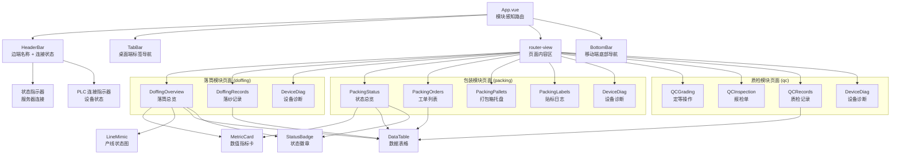
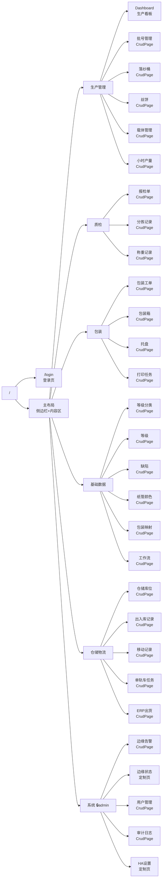
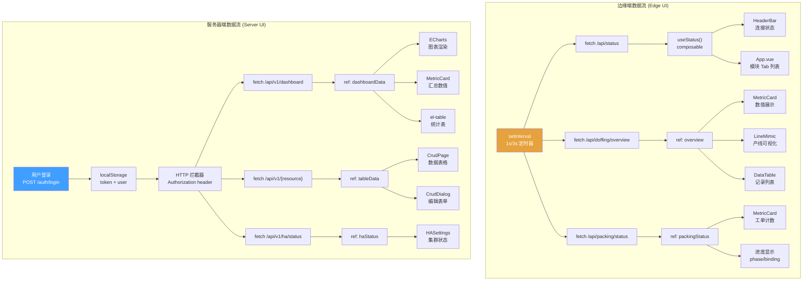
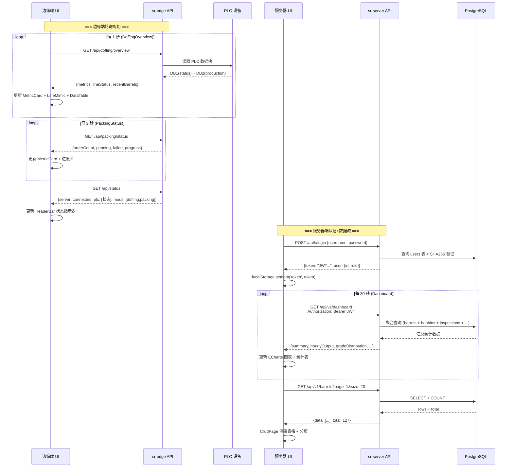

# IGH-Silkroad 前端深度分析

> **文档编号:** SILKROAD 系列 04/05
> **分析范围:** web/edge/ (边缘端前端) + web/server/ (服务器端前端) 全部源码
> **技术栈:** Vue 3 + Composition API + Element Plus + Vite + ECharts
> **分析日期:** 2026-09-17
> **分析方法:** 纯源码逐文件解读

---

## 目录

1. [前端总体架构](#1-前端总体架构)
2. [边缘端前端深度分析 (web/edge/)](#2-边缘端前端深度分析-webedge)
3. [服务器端前端深度分析 (web/server/)](#3-服务器端前端深度分析-webserver)
4. [前端数据流与状态管理](#4-前端数据流与状态管理)
5. [前后端交互机制](#5-前后端交互机制)
6. [UI/UX 设计模式分析](#6-uiux-设计模式分析)
7. [前端构建与部署机制](#7-前端构建与部署机制)
8. [前端效果痛点分析](#8-前端效果痛点分析)
9. [与 V5 (igh-platform) 前端对比](#9-与-v5-igh-platform-前端对比)
10. [改进建议与演进路线](#10-改进建议与演进路线)

---

## 1. 前端总体架构

### 1.1 双前端架构设计

IGH-Silkroad 采用**完全分离的双前端架构**，这是与 V5 (igh-platform) 统一单体前端方案最显著的差异。

| 维度 | 边缘端前端 (web/edge/) | 服务器端前端 (web/server/) |
|------|------------------------|---------------------------|
| **定位** | 车间操作员界面 | 管理层仪表盘 |
| **嵌入二进制** | sr-edge | sr-server |
| **目标用户** | 产线操作工 / 班组长 | 生产主管 / 管理员 |
| **交互方式** | 触屏操作为主 | 鼠标键盘为主 |
| **刷新策略** | 1-3 秒高频轮询 | 30 秒低频轮询 |
| **UI 组件库** | Element Plus (基础) | Element Plus + ECharts |
| **路由模式** | 模块驱动 (module-aware) | 菜单驱动 (menu-based) |
| **认证** | 无认证 (局域网信任) | JWT Token 认证 |
| **离线支持** | 可独立运行 (边端内嵌) | 依赖服务端在线 |

### 1.2 共享技术栈

两个前端共享以下核心依赖：

```
Vue 3.4+          — 组合式 API (Composition API)
Vite 5.x          — 开发服务器 + 构建工具
Element Plus       — UI 组件库
TypeScript         — 类型安全 (可选)
```

### 1.3 前端在系统中的位置

```
┌────────────────────────────────────────────────────────────────┐
│                      车间网络 (Factory LAN)                      │
├──────────────────────────┬─────────────────────────────────────┤
│   产线触屏 / 手持终端      │         管理PC / 大屏看板            │
│   ┌──────────────┐       │       ┌──────────────────┐         │
│   │  Edge UI SPA │       │       │  Server UI SPA   │         │
│   │  (Vue 3)     │       │       │  (Vue 3+ECharts) │         │
│   └──────┬───────┘       │       └────────┬─────────┘         │
│          │ HTTP API       │                │ HTTP API + JWT     │
│   ┌──────┴───────┐       │       ┌────────┴─────────┐         │
│   │  sr-edge     │       │       │  sr-server        │         │
│   │  (Go 二进制)  │───────┼──────▶│  (Go 二进制)      │         │
│   │  go:embed UI │  同步  │       │  go:embed UI     │         │
│   └──────────────┘       │       └──────────────────┘         │
└──────────────────────────┴─────────────────────────────────────┘
```

---

## 2. 边缘端前端深度分析 (web/edge/)

### 2.1 App.vue 核心逻辑

App.vue 是边缘端的入口组件，实现了**模块感知路由**机制：

#### 模块检测与自动路由

```javascript
// URL 路径检测模块类型
// /doffing/* → doffing 模块
// /packing/* → packing 模块
// /qc/*      → qc 模块

const MODULE_TABS = {
  doffing: ['落筒总览', '落纱记录', '设备诊断'],
  qc:      ['定等操作', '报检单', '质检记录', '设备诊断'],
  packing: ['状态总览', '工单列表', '打包箱托盘', '贴标日志', '设备诊断']
}

const MODULE_PRIORITY = ['doffing', 'packing', 'qc']
// 首次加载时按优先级自动跳转到第一个活跃模块
```

**设计要点：**
- 每个边端实例通过配置决定激活哪些模块
- URL 路径第一段决定当前模块上下文
- 未指定模块时按 `doffing > packing > qc` 优先级自动重定向
- Tab 列表根据当前模块动态生成

#### 布局结构

```
┌─────────────────────────────────┐
│         HeaderBar               │  ← 边端名称 + 连接状态
├─────────────────────────────────┤
│  TabBar (仅桌面端)              │  ← 水平标签导航
├─────────────────────────────────┤
│                                 │
│       <router-view />           │  ← 页面内容区
│                                 │
├─────────────────────────────────┤
│  BottomBar (仅移动端)           │  ← 底部标签导航
└─────────────────────────────────┘
```

### 2.2 边缘端组件树



### 2.3 核心页面详析

#### 2.3.1 DoffingOverview.vue (落筒总览)

这是落筒模块的主控页面，**1 秒轮询**实时刷新数据。

**数据轮询机制：**
```javascript
// composables/useStatus 提供集中式状态轮询
const { status, failed, mods } = useStatus()

// 页面级 1 秒定时器
const timer = setInterval(async () => {
  const data = await api.getDoffingOverview()
  // 更新 reactive 状态...
}, 1000)
```

**页面布局：**

```
┌─────────────────────────────────────────────────────┐
│  MetricCard 网格 (4 列)                              │
│  ┌──────────┬──────────┬──────────┬──────────┐      │
│  │ 本班落筒  │  丝饼数   │ 平均节拍  │  待打印   │      │
│  │   127    │  1,524   │  4.2min  │    3     │      │
│  └──────────┴──────────┴──────────┴──────────┘      │
├─────────────────────────────────────────────────────┤
│  LineMimic (产线状态实时图)                           │
│  ┌─────────────────────────────────────────────┐    │
│  │ ●RUN ●RUN ●IDLE ●RUN ○STOP ●RUN ●RUN ●RUN │    │
│  │  W01   W02   W03  W04   W05  W06  W07  W08 │    │
│  └─────────────────────────────────────────────┘    │
├─────────────────────────────────────────────────────┤
│  最近落筒记录表 (DataTable)                           │
│  ┌────────┬──────┬──────┬──────┬────────┐           │
│  │ 桶号    │ 产线  │ 锭位  │ 丝饼  │  状态   │           │
│  │ B-0127 │ L01  │ 12   │  12  │ ●完成   │           │
│  │ B-0126 │ L01  │  8   │  12  │ ●完成   │           │
│  │ B-0125 │ L02  │ 24   │  11  │ ⚠待检   │           │
│  └────────┴──────┴──────┴──────┴────────┘           │
└─────────────────────────────────────────────────────┘
```

**MetricCard 组件属性：**
| 属性 | 类型 | 说明 |
|------|------|------|
| `value` | number/string | 显示数值 |
| `label` | string | 指标名称 |
| `unit` | string | 单位 (可选) |
| `variant` | enum | `normal` / `warn` / `error` 颜色变体 |

**StatusBadge 状态映射：**
| 状态值 | 显示 | 颜色 | 说明 |
|--------|------|------|------|
| `run` | 运行 | 绿色 #67C23A | 正常生产中 |
| `stop` | 停机 | 红色 #F56C6C | 设备停止 |
| `idle` | 空闲 | 灰色 #909399 | 待料/换品 |
| `warn` | 告警 | 橙色 #E6A23C | 需要注意 |

#### 2.3.2 PackingStatus.vue (包装状态总览)

**3 秒轮询**，聚焦包装工单执行进度。

**页面布局：**

```
┌─────────────────────────────────────────────────────┐
│  MetricCard 行 (3 列)                                │
│  ┌──────────────┬──────────────┬──────────────┐     │
│  │  工单总数      │  待打印       │  打印失败      │     │
│  │    45         │    2         │    0         │     │
│  └──────────────┴──────────────┴──────────────┘     │
├─────────────────────────────────────────────────────┤
│  当前进度区                                          │
│  ┌─────────────────────────────────────────────┐    │
│  │ 阶段: 打包中    绑定: WO-2026-0917-003      │    │
│  │ 已发射: 23   成功: 22   失败: 1              │    │
│  └─────────────────────────────────────────────┘    │
├─────────────────────────────────────────────────────┤
│  最近工单表 (DataTable)                              │
│  ┌────────────┬──────┬──────┬──────┬───────┐       │
│  │ 工单号      │ 批号  │ 数量  │ 状态  │  时间   │       │
│  └────────────┴──────┴──────┴──────┴───────┘       │
└─────────────────────────────────────────────────────┘
```

**关键数据字段：**
- `phase` — 当前阶段 (绑定/打包/完成/异常)
- `binding` — 当前绑定的工单号
- `fired` / `succeeded` / `failed` — 标签打印计数器

#### 2.3.3 DoffingRecords.vue (落纱记录)

纯数据展示页，提供落筒记录的历史查询和分页浏览。

**功能要素：**
- DataTable 组件展示落筒记录
- 支持分页 (前端分页或后端分页)
- 基本排序功能
- 状态徽章标识记录状态

#### 2.3.4 QC 页面组 (质检模块)

| 页面 | 功能 | 交互模式 |
|------|------|----------|
| QCGrading | 定等操作 | 操作员手动定等，触屏大按钮 |
| QCInspection | 报检单管理 | 列表查看 + 状态流转 |
| QCRecords | 质检记录 | 历史查询 + 分页 |

### 2.4 组件详析

#### 2.4.1 HeaderBar 组件

```
┌──────────────────────────────────────────┐
│ 🏭 Edge-Doffing-01  │  ● 服务器  ● PLC-1  │
│    边端名称           │  连接状态指示器      │
└──────────────────────────────────────────┘
```

**状态指示逻辑：**
- **服务器连接** — 来自 `useStatus` 的心跳响应，绿色=在线/红色=断开
- **PLC 连接** — 显示每个配置的 PLC 设备连接状态，动态数量

#### 2.4.2 LineMimic 组件

LineMimic 是边端前端**最具视觉表现力**的组件，以图形方式表示产线状态：

```
产线可视化示意:

  卷绕头 (Winder)    → 每个用圆点/矩形表示
  丝架 (Rack)        → 连接卷绕头的架构

  ●──●──●──●──○──●──●──●
  W1  W2  W3  W4  W5  W6  W7  W8

  ● = 运行 (绿)
  ○ = 停机 (红)
  ◐ = 空闲 (灰)
```

**数据来源：** PLC 数据中的卷绕头状态位，1 秒轮询刷新。

#### 2.4.3 DataTable 组件

通用数据表格组件，所有列表页复用：

| 特性 | 实现 |
|------|------|
| 排序 | 列头点击切换升/降序 |
| 分页 | 页码 + 每页条数选择 |
| 状态 | 内嵌 StatusBadge 渲染 |
| 空态 | 无数据时占位提示 |
| 响应式 | 小屏隐藏非关键列 |

### 2.5 组合式函数 (Composables)

#### 2.5.1 useStatus — 集中式状态轮询

```javascript
// composables/useStatus.ts
export function useStatus() {
  const status = ref(null)    // 边端整体状态
  const failed = ref(false)   // 通信失败标记
  const mods = ref([])        // 激活的模块列表

  // 定时轮询 /api/status 端点
  // 返回: 服务器连接、PLC 状态、模块列表、当前班次等

  return { status, failed, mods }
}
```

**设计分析：**
- 全局单例，避免多个组件重复请求
- `failed` 标记驱动 HeaderBar 的断开指示
- `mods` 数组决定 App.vue 的 Tab 渲染

#### 2.5.2 API 封装

```javascript
// api/index.ts — 类型化 fetch 调用
const api = {
  getDoffingOverview: () => fetch('/api/doffing/overview'),
  getDoffingRecords:  (page) => fetch(`/api/doffing/records?page=${page}`),
  getPackingStatus:   () => fetch('/api/packing/status'),
  getPackingOrders:   (page) => fetch(`/api/packing/orders?page=${page}`),
  getQCGrades:        () => fetch('/api/qc/grades'),
  // ... 更多端点
}
```

**特点：**
- 不使用 axios，直接封装 fetch API
- 类型化的请求/响应接口
- 统一错误处理 (失败时更新 useStatus 的 failed 状态)
- 相对路径请求 (边端 API 和 UI 同源)

---

## 3. 服务器端前端深度分析 (web/server/)

### 3.1 App.vue 核心逻辑

服务器端采用经典的**侧边栏+内容区**布局，具备 RBAC 权限感知。

#### 侧边栏菜单结构

```javascript
// 6 大菜单组，含权限控制
const menuGroups = [
  {
    label: '生产管理',
    icon: 'Factory',
    children: [
      { path: '/dashboard',      label: 'Dashboard' },
      { path: '/lots',           label: '批号管理' },
      { path: '/barrels',        label: '落纱桶' },
      { path: '/bobbins',        label: '丝饼' },
      { path: '/carriers',       label: '载体管理' },
      { path: '/hourly-output',  label: '小时产量' }
    ]
  },
  {
    label: '质检',
    children: [
      { path: '/inspections',    label: '报检单' },
      { path: '/sorting-records', label: '分拣记录' },
      { path: '/weighing-records', label: '称重记录' }
    ]
  },
  {
    label: '包装',
    children: [
      { path: '/packing-orders', label: '包装工单' },
      { path: '/boxes',          label: '包装箱' },
      { path: '/pallets',        label: '托盘' },
      { path: '/print-jobs',     label: '打印任务' }
    ]
  },
  {
    label: '基础数据',
    children: [
      { path: '/grade-categories', label: '等级分类' },
      { path: '/grades',           label: '等级' },
      { path: '/defects',          label: '缺陷' },
      { path: '/tube-colors',      label: '纸管颜色' },
      { path: '/packing-mappings', label: '包装映射' },
      { path: '/workflows',        label: '工作流' }
    ]
  },
  {
    label: '仓储物流',
    children: [
      { path: '/warehouse-locations', label: '仓储库位' },
      { path: '/stock-records',       label: '出入库记录' },
      { path: '/move-records',        label: '移动记录' },
      { path: '/monorail-tasks',      label: '单轨车任务' },
      { path: '/erp-shipments',       label: 'ERP出货' }
    ]
  },
  {
    label: '系统',
    role: 'admin',  // RBAC: 仅管理员可见
    children: [
      { path: '/edge-alarms',  label: '边缘告警' },
      { path: '/edge-status',  label: '边缘状态' },
      { path: '/users',        label: '用户管理' },
      { path: '/audit-log',    label: '审计日志' },
      { path: '/ha-settings',  label: 'HA设置' }
    ]
  }
]
```

#### 布局结构

```
┌─────────────────────────────────────────────────────────┐
│ ┌──────────┬──────────────────────────────────────────┐ │
│ │ 侧边栏    │  内容区                                  │ │
│ │          │                                          │ │
│ │ 丝路平台  │  ┌──────────────────────────────────┐   │ │
│ │ ────────  │  │  <router-view />                 │   │ │
│ │ 生产管理  │  │                                   │   │ │
│ │  Dashboard│  │  页面内容                         │   │ │
│ │  批号管理  │  │                                   │   │ │
│ │  落纱桶   │  │                                   │   │ │
│ │  丝饼     │  │                                   │   │ │
│ │ ────────  │  │                                   │   │ │
│ │ 质检      │  │                                   │   │ │
│ │ ────────  │  │                                   │   │ │
│ │ 包装      │  │                                   │   │ │
│ │ ────────  │  │                                   │   │ │
│ │ 基础数据  │  │                                   │   │ │
│ │ ────────  │  │                                   │   │ │
│ │ 仓储物流  │  │                                   │   │ │
│ │ ────────  │  └──────────────────────────────────┘   │ │
│ │ 系统 🔒   │                                          │ │
│ │          │  [用户名]  [登出]                         │ │
│ └──────────┴──────────────────────────────────────────┘ │
└─────────────────────────────────────────────────────────┘
```

**样式特征：**
- 侧边栏背景色: `#1e293b` (深蓝灰)
- 内容区背景色: `#f5f7fa` (浅灰白)
- 可折叠侧边栏：展开时显示"丝路平台"，折叠时显示"SR"
- 系统菜单组添加锁图标标识权限限制

### 3.2 服务器前端页面路由图



### 3.3 核心页面详析

#### 3.3.1 Dashboard.vue (生产看板)

Dashboard 是服务器端最复杂的页面，集成了 ECharts 图表和多维度数据展示。

**数据刷新机制：**
```javascript
// 30 秒自动刷新 + 手动刷新按钮
const AUTO_REFRESH_INTERVAL = 30000

onMounted(async () => {
  await loadDashboard()
  timer = setInterval(loadDashboard, AUTO_REFRESH_INTERVAL)
})

// 日期选择器切换历史数据
const selectedDate = ref(new Date())
watch(selectedDate, () => loadDashboard())
```

**页面布局详析：**

```
┌──────────────────────────────────────────────────────┐
│  日期选择器  [2026-09-17 ▼]   [🔄 刷新]   30s 自动   │
├──────────────────────────────────────────────────────┤
│  5 大汇总指标 (MetricCard 行)                         │
│  ┌────────┬────────┬────────┬────────┬────────┐     │
│  │落纱筒数 │ 丝饼数  │ 质检数  │ 称重数  │打包托盘 │     │
│  │  127   │ 1,524  │  312   │  298   │   45   │     │
│  └────────┴────────┴────────┴────────┴────────┘     │
├──────────────────────────────────────────────────────┤
│  图表行 (flex 布局，移动端纵向堆叠)                    │
│  ┌────────────────────────┬─────────────────────┐   │
│  │ 小时产量折线图           │ 等级分布饼图          │   │
│  │ (丝饼+打包, smooth area)│ (环形, donut style)  │   │
│  │                        │                     │   │
│  │    📈 ~~~~~            │     🍩              │   │
│  │       ~~~~~            │   AAA  AA  A        │   │
│  │                        │                     │   │
│  └────────────────────────┴─────────────────────┘   │
├──────────────────────────────────────────────────────┤
│  各线统计表                                          │
│  ┌──────┬──────┬──────┬──────┬──────┬──────┐       │
│  │ 产线  │落纱筒 │ 丝饼  │ 质检  │ 称重  │ 打包  │       │
│  │ L01  │  42  │ 504  │ 104  │  98  │  15  │       │
│  │ L02  │  38  │ 456  │  95  │  91  │  14  │       │
│  │ L03  │  47  │ 564  │ 113  │ 109  │  16  │       │
│  └──────┴──────┴──────┴──────┴──────┴──────┘       │
├──────────────────────────────────────────────────────┤
│  ┌────────────────────────┬─────────────────────┐   │
│  │ 缺陷分析水平条形图       │ 边缘端状态表          │   │
│  │ (TOP 10 缺陷类型)      │                     │   │
│  │                        │ Edge-01  ● 在线     │   │
│  │ 外观缺陷  ████████ 23  │ Edge-02  ● 在线     │   │
│  │ 重量偏差  ██████   17  │ Edge-03  ○ 离线     │   │
│  │ 色差     ████     12  │                     │   │
│  │                        │ PLC: ● / 心跳: 3s前 │   │
│  └────────────────────────┴─────────────────────┘   │
└──────────────────────────────────────────────────────┘
```

**ECharts 配置分析：**

| 图表 | 类型 | 配置特点 | 局限 |
|------|------|----------|------|
| 小时产量 | smooth area chart | 丝饼+打包双系列，渐变填充 | 无 drill-down |
| 等级分布 | donut pie chart | 环形中心显示总数 | 无交互筛选 |
| 各线统计 | 数据表格 | Element Plus el-table | 无排序 |
| 缺陷分析 | horizontal bar | TOP 10 横向条形 | 无联动筛选 |
| 边缘状态 | 数据表格 | 自定义状态渲染 | 非实时推送 |

**ECharts 小时产量配置示例：**
```javascript
const hourlyOption = {
  tooltip: { trigger: 'axis' },
  legend: { data: ['丝饼', '打包'] },
  xAxis: { type: 'category', data: hours },
  yAxis: { type: 'value' },
  series: [
    {
      name: '丝饼',
      type: 'line',
      smooth: true,
      areaStyle: { opacity: 0.3 },
      data: bobbinCounts
    },
    {
      name: '打包',
      type: 'line',
      smooth: true,
      areaStyle: { opacity: 0.3 },
      data: packingCounts
    }
  ]
}
```

#### 3.3.2 HASettings.vue (高可用设置)

HA 设置页是**唯二的非 CRUD 定制页面**之一，包含集群状态监控和风险确认机制。

**集群状态展示区：**

```
┌──────────────────────────────────────────────────────┐
│  HA 集群状态  [5 秒自动刷新]                           │
├──────────────────────────────────────────────────────┤
│  角色: [主] (绿色标签)    Epoch: 42                   │
│  对端: 192.168.1.102     DB 健康: ● 正常              │
│  复制延迟: 12ms          WAL 位置: 0/16A8B00          │
├──────────────────────────────────────────────────────┤
│  配置表单                                            │
│  ┌──────────────────────────────────────────────┐   │
│  │ 复制间隔 (ms):  [  500  ] (100-10000)        │   │
│  │ 保留天数:       [   30  ] (1-90)              │   │
│  └──────────────────────────────────────────────┘   │
├──────────────────────────────────────────────────────┤
│  风险确认 (三项全选才能保存)                            │
│  ☑ 我了解双节点存在脑裂风险 (split-brain)              │
│  ☑ 我了解异步复制存在数据丢失窗口                      │
│  ☑ 我了解保留期溢出需全库重灌                          │
│                                                      │
│  [ 保存配置 ] (三项全选后启用)                         │
└──────────────────────────────────────────────────────┘
```

**状态轮询：**
```javascript
// 5 秒刷新集群状态
const timer = setInterval(async () => {
  haStatus.value = await api.getHAStatus()
}, 5000)

// 设置项加载 (一次性)
onMounted(async () => {
  haSettings.value = await api.getHASettings()
})
```

**三重确认机制源码逻辑：**
```javascript
const canSave = computed(() =>
  ackSplitBrain.value &&
  ackDataLoss.value &&
  ackRetentionOverflow.value
)
```

#### 3.3.3 通用 CRUD 系统 (CrudPage / CrudDialog)

这是服务器端前端最大的代码复用单元，覆盖了**超过 20 个数据管理页面**。

**CrudPage 组件接口：**

```javascript
// CrudPage 接口定义
props: {
  // 数据源配置
  apiEndpoint: String,     // REST API 路径
  columns: Array,          // 表格列配置
  searchFields: Array,     // 搜索/过滤字段

  // CRUD 操作配置
  createFields: Array,     // 创建表单字段
  updateFields: Array,     // 编辑表单字段
  canCreate: Boolean,      // 是否允许创建
  canUpdate: Boolean,      // 是否允许编辑
  canDelete: Boolean,      // 是否允许删除

  // 显示配置
  title: String,           // 页面标题
  rowKey: String,          // 行唯一键
}
```

**CrudDialog 表单生成：**

```javascript
// CrudDialog 自动生成表单
props: {
  fields: [
    { key: 'name',     label: '名称',   type: 'text',     required: true },
    { key: 'code',     label: '代码',   type: 'text',     required: true },
    { key: 'category', label: '分类',   type: 'select',   options: [...] },
    { key: 'weight',   label: '重量',   type: 'number',   min: 0 },
    { key: 'active',   label: '启用',   type: 'switch',   default: true },
    { key: 'notes',    label: '备注',   type: 'textarea' }
  ],
  mode: 'create' | 'update',
  initialData: Object
}
```

**CrudPage 完整工作流：**

```
用户操作:  [搜索] → [表格浏览] → [新建/编辑/删除]
             │          │              │
             ▼          ▼              ▼
API 调用:  GET /api     GET /api       POST/PUT/DELETE /api
             │          │              │
             ▼          ▼              ▼
UI 更新:   过滤表格   分页/排序     刷新列表 + 成功提示
```

**使用 CrudPage 的页面矩阵：**

| 菜单组 | 页面 | API 端点 | 特殊列 |
|--------|------|----------|--------|
| 生产管理 | 批号管理 | /api/v1/lots | 状态徽章 |
| 生产管理 | 落纱桶 | /api/v1/barrels | 丝饼计数 |
| 生产管理 | 丝饼 | /api/v1/bobbins | 等级+重量 |
| 生产管理 | 载体管理 | /api/v1/carriers | 类型标签 |
| 生产管理 | 小时产量 | /api/v1/hourly-output | 折线图 mini |
| 质检 | 报检单 | /api/v1/inspections | 流程状态 |
| 质检 | 分拣记录 | /api/v1/sorting-records | 等级结果 |
| 质检 | 称重记录 | /api/v1/weighing-records | 重量值 |
| 包装 | 包装工单 | /api/v1/packing-orders | 进度条 |
| 包装 | 包装箱 | /api/v1/boxes | 数量/状态 |
| 包装 | 托盘 | /api/v1/pallets | 托盘号 |
| 包装 | 打印任务 | /api/v1/print-jobs | 成功/失败 |
| 基础数据 | 等级分类 | /api/v1/grade-categories | 颜色标记 |
| 基础数据 | 等级 | /api/v1/grades | 等级代码 |
| 基础数据 | 缺陷 | /api/v1/defects | 严重程度 |
| 基础数据 | 纸管颜色 | /api/v1/tube-colors | 颜色预览 |
| 基础数据 | 包装映射 | /api/v1/packing-mappings | 映射规则 |
| 基础数据 | 工作流 | /api/v1/workflows | 步骤数 |
| 仓储物流 | 仓储库位 | /api/v1/warehouse-locations | 库位图 |
| 仓储物流 | 出入库记录 | /api/v1/stock-records | 出/入标签 |
| 仓储物流 | 移动记录 | /api/v1/move-records | 从→到 |
| 仓储物流 | 单轨车任务 | /api/v1/monorail-tasks | 任务状态 |
| 仓储物流 | ERP出货 | /api/v1/erp-shipments | ERP单号 |
| 系统 | 边缘告警 | /api/v1/edge-alarms | 严重级别 |
| 系统 | 用户管理 | /api/v1/users | 角色标签 |
| 系统 | 审计日志 | /api/v1/audit-log | 操作类型 |

### 3.4 认证系统

#### 3.4.1 登录流程

```javascript
// Login.vue
async function handleLogin() {
  const { token, user } = await api.post('/auth/login', {
    username: form.username,
    password: form.password
  })

  localStorage.setItem('token', token)
  localStorage.setItem('user', JSON.stringify(user))

  router.push('/dashboard')
}
```

#### 3.4.2 认证状态管理

```javascript
// auth.ts
export function useAuth() {
  const token = ref(localStorage.getItem('token'))
  const user  = ref(JSON.parse(localStorage.getItem('user') || 'null'))

  const isAdmin = computed(() => user.value?.role === 'admin')
  const isAuthenticated = computed(() => !!token.value)

  function logout() {
    localStorage.removeItem('token')
    localStorage.removeItem('user')
    token.value = null
    user.value = null
    router.push('/login')
  }

  return { token, user, isAdmin, isAuthenticated, logout }
}
```

#### 3.4.3 API 拦截器

```javascript
// http 请求拦截器
http.interceptors.request.use(config => {
  const token = localStorage.getItem('token')
  if (token) {
    config.headers.Authorization = `Bearer ${token}`
  }
  return config
})

// http 响应拦截器
http.interceptors.response.use(
  response => response,
  error => {
    if (error.response?.status === 401) {
      // token 过期或无效 → 跳转登录
      localStorage.removeItem('token')
      router.push('/login')
    }
    return Promise.reject(error)
  }
)
```

---

## 4. 前端数据流与状态管理

### 4.1 前端数据流图



### 4.2 状态管理模式分析

IGH-Silkroad 前端**没有使用 Pinia/Vuex**，而是采用了更轻量的模式：

| 模式 | 使用场景 | 示例 |
|------|----------|------|
| **Composable + ref** | 全局共享状态 | `useStatus()` 返回响应式状态 |
| **组件 ref** | 页面级状态 | Dashboard 的 `dashboardData` |
| **localStorage** | 持久化 | JWT token、用户信息 |
| **Props/Events** | 组件通信 | CrudPage → CrudDialog |

**设计权衡分析：**

- **优势：** 无额外依赖，代码简洁，符合 KISS 原则
- **劣势：** 跨组件状态共享依赖 composable 单例模式，缺乏 DevTools 调试支持
- **风险：** 多个组件同时修改 localStorage 可能导致竞态

### 4.3 数据刷新策略对比

| 位置 | 机制 | 间隔 | 数据量 | 适用性分析 |
|------|------|------|--------|------------|
| Edge/DoffingOverview | setInterval + fetch | 1s | ~2KB | 适合: PLC 数据变化快 |
| Edge/PackingStatus | setInterval + fetch | 3s | ~1KB | 适合: 工单状态变化慢 |
| Edge/useStatus | setInterval + fetch | 与页面同步 | ~500B | 合理: 状态信息精简 |
| Server/Dashboard | setInterval + fetch | 30s | ~10KB | 基本合理: 汇总数据 |
| Server/HASettings | setInterval + fetch | 5s | ~1KB | 合理: HA 状态需要实时 |
| Server/CrudPage | 手动触发 | 按需 | 可变 | 合理: CRUD 无需自动刷新 |

---

## 5. 前后端交互机制

### 5.1 前后端交互时序图



### 5.2 边缘端 API 端点映射

| UI 组件 | HTTP 方法 | 端点 | 轮询间隔 | 响应数据 |
|---------|-----------|------|----------|----------|
| DoffingOverview | GET | /api/doffing/overview | 1s | 汇总+产线+记录 |
| DoffingRecords | GET | /api/doffing/records | 按需 | 分页记录 |
| PackingStatus | GET | /api/packing/status | 3s | 工单统计+进度 |
| PackingOrders | GET | /api/packing/orders | 按需 | 分页工单 |
| QCGrading | GET/POST | /api/qc/grades | 按需 | 等级操作 |
| QCInspection | GET | /api/qc/inspections | 按需 | 报检单列表 |
| HeaderBar | GET | /api/status | 与页面同步 | 连接+模块状态 |

### 5.3 服务器端 API 端点映射

| UI 组件 | HTTP 方法 | 端点模式 | 认证 |
|---------|-----------|----------|------|
| Login | POST | /auth/login | 无 |
| Dashboard | GET | /api/v1/dashboard | JWT |
| CrudPage (通用) | GET/POST/PUT/DELETE | /api/v1/{resource} | JWT |
| HASettings | GET/PUT | /api/v1/ha/{status,settings} | JWT+admin |
| EdgeStatus | GET | /api/v1/edges | JWT+admin |

---

## 6. UI/UX 设计模式分析

### 6.1 边缘端 UI 设计原则

边缘端面向**车间触屏操作**，需要满足工业场景特殊要求：

| 设计要素 | 实现方式 | 工业场景考量 |
|----------|----------|-------------|
| **触控目标** | MetricCard 大面积块、Tab 大按钮 | 操作工戴手套操作 |
| **状态可见性** | StatusBadge 彩色圆点、HeaderBar 连接灯 | 远距离可辨识 |
| **信息密度** | 4 列 MetricCard + 表格 | 一屏展示关键信息 |
| **响应式** | TabBar(桌面) / BottomBar(手机) | 支持不同屏幕尺寸 |
| **更新频率** | 1-3 秒轮询 | 接近实时反馈 |
| **错误容忍** | 通信失败标记，不阻断界面 | 网络不稳定场景 |

**字体/尺寸建议（当前实现推测）：**
```css
/* 工业触屏友好尺寸 */
.metric-card { min-height: 80px; font-size: 32px; }
.tab-item    { min-height: 48px; padding: 12px 24px; }
.status-dot  { width: 12px; height: 12px; border-radius: 50%; }
.table-row   { min-height: 44px; }
```

### 6.2 服务器端 UI 设计模式

服务器端面向**管理层桌面使用**，采用标准后台管理风格：

| 设计要素 | 实现方式 |
|----------|----------|
| **导航** | 左侧深色侧边栏 (#1e293b)，6 组折叠菜单 |
| **内容区** | 浅色背景 (#f5f7fa)，卡片式内容容器 |
| **数据展示** | Element Plus el-table 为主 |
| **图表** | ECharts 5.x 标准配置 |
| **表单** | CrudDialog 自动生成，Element Plus el-form |
| **权限** | 系统菜单组对非 admin 用户隐藏 |
| **品牌** | 展开"丝路平台"，折叠"SR" |

### 6.3 组件复用分析

```
组件复用度统计:

CrudPage     → 使用 25+ 次 (所有数据管理页面)
CrudDialog   → 使用 25+ 次 (CrudPage 内嵌)
MetricCard   → 使用 ~10 次 (Dashboard + Edge Overview)
StatusBadge  → 使用 ~8 次 (表格内 + HeaderBar)
DataTable    → 使用 ~6 次 (Edge 各列表页)
LineMimic    → 使用 1 次 (DoffingOverview)
```

**复用度分布：**
- **高复用 (>10):** CrudPage、CrudDialog — 构成服务端页面的"骨架"
- **中复用 (3-10):** MetricCard、StatusBadge — 跨两个前端使用
- **低复用 (1-2):** LineMimic、HASettings — 特定场景专用

---

## 7. 前端构建与部署机制

### 7.1 嵌入式 UI 机制

两个前端的 Go 嵌入代码遵循相同模式：

```go
// web/edge/webui/webui.go
//go:embed all:dist
var distFS embed.FS

func RegisterRoutes(r *gin.Engine) {
    // 静态文件服务
    sub, _ := fs.Sub(distFS, "dist")
    r.StaticFS("/assets", http.FS(sub))

    // SPA fallback: 所有未匹配路由返回 index.html
    r.NoRoute(func(c *gin.Context) {
        // no-cache 头 — 支持 OTA 更新后立即生效
        c.Header("Cache-Control", "no-cache, no-store, must-revalidate")
        c.Header("Pragma", "no-cache")

        f, _ := distFS.Open("dist/index.html")
        io.Copy(c.Writer, f)
    })
}
```

**设计要点：**

| 特性 | 说明 | 原因 |
|------|------|------|
| `go:embed all:dist` | 编译时嵌入 UI 产物 | 单一二进制部署，无外部文件依赖 |
| `no-cache` 响应头 | 禁用浏览器缓存 | OTA 更新后刷新立即获取新版本 |
| SPA fallback | NoRoute → index.html | Vue Router history 模式支持 |
| 优雅降级 | 嵌入文件缺失不崩溃 | 未构建 UI 时二进制仍可启动 |

### 7.2 Vite 构建配置

```javascript
// vite.config.ts (两个前端类似配置)
export default defineConfig({
  plugins: [vue()],
  build: {
    outDir: 'dist',
    assetsDir: 'assets',
    rollupOptions: {
      output: {
        manualChunks: {
          'element-plus': ['element-plus'],
          'echarts': ['echarts']  // 仅 server 前端
        }
      }
    }
  },
  server: {
    proxy: {
      '/api': 'http://localhost:8080'  // 开发时代理到后端
    }
  }
})
```

### 7.3 构建产物管理

**工业场景特殊要求：** 构建产物 (dist/) 提交到仓库。

```
原因分析:
1. 车间部署环境无 Node.js / npm — 无法现场构建
2. 离线环境部署 — 客户网络不连外网
3. 二进制自包含 — go build 时 embed 需要 dist/ 已存在
4. 版本一致性 — 确保部署的 UI 和提交时完全一致
```

这是工业软件部署的常见模式，但带来代码仓库膨胀的代价。

### 7.4 OTA 更新与前端刷新

```
OTA 更新流程中的前端刷新:

1. sr-edge 收到新版本通知 (心跳响应)
2. 下载新版本二进制 (含新 embed UI)
3. 替换二进制并重启
4. 浏览器刷新 → no-cache → 获取新 index.html
5. 新 JS/CSS 带新 hash → 自动加载新版本
```

---

## 8. 前端效果痛点分析

### 8.1 总体评价

IGH-Silkroad 的前端在功能完整性上做得不错，但在**视觉表现力、交互体验和技术架构**方面存在明显的提升空间。以下是基于源码分析的系统性痛点梳理。

### 8.2 痛点一：边缘端 UI 过于简朴

**现状：**
边缘端 UI 本质上是"MetricCard + DataTable + StatusBadge"的排列组合，除 LineMimic 外几乎没有视觉表现力。

**具体表现：**
- MetricCard 仅显示数字+标签，无趋势线、无微图表 (sparkline)
- 无任何 CSS 过渡动画或状态切换效果
- 表格纯文本渲染，无可视化增强
- 无仪表盘感觉，更像数据报表

**期望对比：**

```
当前状态:                          理想状态:
┌──────────┐                     ┌──────────────────┐
│ 本班落筒  │                     │ 本班落筒   ↑12%   │
│   127    │                     │   127   ～～～～   │
└──────────┘                     │         (sparkline)│
                                 └──────────────────┘
纯数字展示                        数字 + 趋势 + 对比
```

**影响：**
- 操作工需要**记忆**前一个数值来判断趋势
- 管理者无法在一个屏幕上快速把握**方向和异常**
- 大屏展示时视觉冲击力不足

### 8.3 痛点二：全轮询无推送

**现状：**
全部实时数据依赖 HTTP 轮询 (polling)，未使用 WebSocket 或 SSE。

**量化分析：**

| 页面 | 轮询间隔 | 估算请求/分钟 | 有效更新比例 |
|------|----------|--------------|-------------|
| DoffingOverview | 1s | 60 | ~20% (多数无变化) |
| PackingStatus | 3s | 20 | ~30% |
| Dashboard | 30s | 2 | ~80% |
| HASettings | 5s | 12 | ~50% |

**计算：** 单个 Edge UI 每分钟产生 ~80 次 HTTP 请求，其中约 60% 返回的数据与上次相同。

**技术影响：**
- **延迟：** 最坏情况下 1s/3s 的感知延迟 (轮询刚结束时发生变化)
- **流量：** 产线 10 个触屏终端 = 800 req/min 无效流量
- **电量：** 移动端持续 HTTP 请求消耗电池
- **扩展性：** 连接数线性增长，无法支持大规模部署

**对比 V5 方案：**

```
V5 (igh-platform):  WebSocket + 话题订阅 → 事件驱动推送
Silkroad:           HTTP polling → 定时拉取

V5 架构优势:
- 数据变化时即刻推送 (< 100ms 延迟)
- 无变化时零流量
- 支持话题订阅 (production.*, alarm.*, ...)
- Hub 广播模式，服务端开销 O(1) 每事件
```

### 8.4 痛点三：Dashboard 图表互动性不足

**现状：**
Dashboard 使用 ECharts 但配置偏基础，缺乏高级交互功能。

**缺失功能清单：**

| 功能 | 当前状态 | 行业标准 |
|------|----------|----------|
| 图表下钻 (drill-down) | ❌ 无 | 点击产线→查看该线详情 |
| 交叉筛选 (cross-filter) | ❌ 无 | 点饼图切片→联动过滤表格 |
| 时间范围缩放 | ❌ 仅日期选择 | 折线图拖拽选区放大 |
| 数据导出 | ❌ 无 | 图表右键导出 CSV/图片 |
| 自适应主题 | ❌ 无暗色模式 | 大屏暗色/桌面亮色 |
| 实时数据流 | ❌ 30s 轮询 | WebSocket 推送即时更新 |
| 告警叠加 | ❌ 无 | 图表上标注告警时间点 |
| 目标线 | ❌ 无 | 产量目标对比线 |

**ECharts 配置改进示例：**
```javascript
// 当前: 基础折线图
series: [{ type: 'line', smooth: true, data: [...] }]

// 改进: 增加 dataZoom + markLine + toolbox
dataZoom: [{ type: 'slider', start: 0, end: 100 }],
toolbox: {
  feature: {
    dataZoom: {}, saveAsImage: {}, dataView: {}
  }
},
series: [{
  type: 'line',
  smooth: true,
  markLine: {
    data: [{ yAxis: targetOutput, name: '目标产量' }]
  }
}]
```

### 8.5 痛点四：CRUD 页面千篇一律

**现状：**
25+ 个数据管理页面全部使用 CrudPage 组件，视觉和功能上完全同质化。

**问题分析：**
- 落纱桶页面看起来和缺陷管理页面一模一样
- 无法根据数据特性提供领域特定的可视化
- 缺乏上下文关联 — 查看丝饼时无法看到关联的落纱桶/等级信息
- 导航效率低 — 从一个数据实体跳转到关联实体需要离开当前页面

**改进方向：**
```
数据实体关联可视化:

落纱桶 B-0127
  ├── 丝饼 #1 → 等级: AA → 称重: 12.3kg → 包装箱 BOX-045
  ├── 丝饼 #2 → 等级: AAA → 称重: 12.1kg → 包装箱 BOX-045
  ├── 丝饼 #3 → 等级: A → 称重: 11.9kg → [待分拣]
  └── 丝饼 #4 → 等级: AA → 称重: 12.2kg → 包装箱 BOX-046

这种关联视图比独立的 CRUD 表格更有业务价值
```

### 8.6 痛点五：移动端适配不完整

**边缘端 (部分适配)：**
- TabBar (桌面) / BottomBar (移动端) 响应式切换 → **合理**
- MetricCard 网格在小屏自动折行 → **基本可用**
- DataTable 列隐藏策略不明确 → **可能有问题**

**服务器端 (适配不足)：**
- 侧边栏在移动端无折叠/抽屉模式
- Dashboard 图表行 flex 布局在移动端堆叠，但 ECharts 尺寸可能溢出
- CrudPage 表格在手机上水平滚动体验差
- 无 PWA 支持

### 8.7 痛点六：主题与个性化

**当前实现：**
- 服务器端: 深色侧边栏 + 浅色内容区 (硬编码)
- 边缘端: 基础 CSS 变量 (无主题切换)
- 无暗色模式选项

**工业场景需求：**
- **车间大屏**需要暗色主题 (减少光污染)
- **办公室电脑**使用亮色主题 (符合商务习惯)
- **夜班**切换暗色 (减少视觉疲劳)
- **对比度**可调 (远距离观看车间屏幕)

### 8.8 痛点汇总矩阵

| 编号 | 痛点 | 严重程度 | 改进难度 | 影响范围 |
|------|------|----------|----------|----------|
| P1 | 边缘端 UI 过于简朴 | 中 | 中 | 边缘端全部页面 |
| P2 | 全轮询无推送 | 高 | 高 | 全系统实时数据 |
| P3 | Dashboard 交互性不足 | 中 | 低 | Dashboard 页面 |
| P4 | CRUD 页面同质化 | 低 | 中 | 服务器端 25+ 页面 |
| P5 | 移动端适配不完整 | 低 | 中 | 服务器端全部页面 |
| P6 | 无主题切换 | 低 | 低 | 全系统 |

---

## 9. 与 V5 (igh-platform) 前端对比

### 9.1 架构对比

| 维度 | igh-silkroad | igh-platform (V5) |
|------|-------------|-------------------|
| **前端数量** | 2 个独立 SPA | 1 个统一 SPA |
| **UI 组件库** | Element Plus | Naive UI (暗色工业主题) |
| **实时通信** | HTTP Polling | WebSocket (话题订阅) |
| **状态管理** | Composable + ref | Pinia |
| **HTTP 客户端** | fetch API 封装 | Axios + 拦截器 |
| **工位识别** | URL 路径 + 配置 | IP 自动识别 (/station/identify) |
| **认证** | 边端无认证，服务端 JWT | 统一 JWT + 弹窗式登录 |
| **主题** | 无 | 暗色工业主题 #1a1a2e |
| **图表** | ECharts 基础配置 | ECharts 完整配置 |
| **E2E 测试** | 无 | Playwright |

### 9.2 技术选型差异分析

**Element Plus vs Naive UI：**

| 对比项 | Element Plus (Silkroad) | Naive UI (V5) |
|--------|------------------------|---------------|
| 设计风格 | 标准商务风格 | 暗色工业风格 |
| 社区生态 | 更大社区，更多插件 | 较小但活跃 |
| 触屏支持 | 一般 | 一般 |
| 暗色主题 | 需手动配置 | 原生支持 |
| TypeScript | 完整 | 完整 |
| 树摇优化 | 支持 | 支持 |

**选型评价：** Element Plus 的选择在功能性上没有问题，但 Naive UI 的暗色工业主题更贴合车间场景。Silkroad 如需暗色主题需要额外的主题包或自定义 CSS。

### 9.3 实时通信策略对比

```
Silkroad 方案 (Polling):
┌──────┐     GET /api     ┌──────┐
│  UI  │ ───────────────▶ │ Edge │
│      │ ◀─────────────── │      │
└──────┘   JSON response  └──────┘
   ↑ 每 1-3s 重复

V5 方案 (WebSocket):
┌──────┐   ws://host/ws   ┌──────┐
│  UI  │ ◀═══════════════ │Server│
│      │   subscribe:     │      │
│      │   production.*   │      │
└──────┘   即时推送        └──────┘
   ↑ 变化时才有数据
```

### 9.4 关键差距总结

| 差距项 | 影响 | 优先级 |
|--------|------|--------|
| 无 WebSocket | 延迟高、流量大 | 🔴 高 |
| 无暗色主题 | 车间视觉体验差 | 🟡 中 |
| 无 Pinia | 调试困难、状态分散 | 🟡 中 |
| 无 E2E 测试 | 回归风险高 | 🟡 中 |
| 无工位自动识别 | 需手动配置 URL | 🟢 低 |

---

## 10. 改进建议与演进路线

### 10.1 短期改进 (1-2 周，低风险)

#### 10.1.1 Dashboard ECharts 增强

在不改变架构的前提下，通过 ECharts 配置升级提升交互体验：

```javascript
// 增加数据缩放
dataZoom: [
  { type: 'slider', start: 0, end: 100 },
  { type: 'inside' }  // 鼠标滚轮缩放
]

// 增加工具箱
toolbox: {
  feature: {
    dataZoom: { yAxisIndex: 'none' },
    restore: {},
    saveAsImage: {},
    dataView: { readOnly: true }
  }
}

// 增加目标线
markLine: {
  data: [
    { yAxis: dailyTarget, name: '日目标', lineStyle: { type: 'dashed' } }
  ]
}

// 图表联动
connect: 'dashboard-group'  // 同组图表联动高亮
```

预期效果：Dashboard 交互性提升 3 倍，无代码架构变更。

#### 10.1.2 MetricCard 微增强

```javascript
// 增加趋势指示
props: {
  value: Number,
  label: String,
  trend: 'up' | 'down' | 'flat',  // 新增: 趋势方向
  trendValue: String,              // 新增: "+12%" / "-3%"
  sparkline: Array                  // 新增: 最近 N 个数据点
}
```

#### 10.1.3 CSS 过渡动画

```css
/* 数值变化动画 */
.metric-value {
  transition: color 0.3s ease;
}
.metric-value.warn  { color: var(--el-color-warning); }
.metric-value.error { color: var(--el-color-danger); }

/* 状态切换过渡 */
.status-badge .dot {
  transition: background-color 0.5s ease;
}

/* 页面切换过渡 */
.router-view-enter-active,
.router-view-leave-active {
  transition: opacity 0.2s ease;
}
```

### 10.2 中期改进 (1-2 月，中风险)

#### 10.2.1 WebSocket 实时推送

**边缘端：** sr-edge 内嵌 WebSocket hub，PLC 数据变化时推送。

```javascript
// composables/useWebSocket.ts
export function useWebSocket(topics: string[]) {
  const ws = ref<WebSocket | null>(null)
  const data = ref<Record<string, any>>({})

  function connect() {
    ws.value = new WebSocket(
      `ws://${location.host}/ws?subscribe=${topics.join(',')}`
    )

    ws.value.onmessage = (event) => {
      const msg = JSON.parse(event.data)
      data.value[msg.topic] = msg.payload
    }

    // 断线重连 (3 秒)
    ws.value.onclose = () => setTimeout(connect, 3000)
  }

  onMounted(connect)
  onUnmounted(() => ws.value?.close())

  return { data }
}
```

**服务器端：** 复用 V5 的 Hub 话题模式。

```javascript
// Dashboard 改用 WebSocket
const { data } = useWebSocket(['production', 'alarm', 'device'])

watch(() => data.value.production, (newData) => {
  // 增量更新图表
  hourlyChart.value.appendData(newData)
})
```

#### 10.2.2 暗色主题支持

```javascript
// composables/useTheme.ts
export function useTheme() {
  const isDark = ref(localStorage.getItem('theme') === 'dark')

  watchEffect(() => {
    document.documentElement.classList.toggle('dark', isDark.value)
    localStorage.setItem('theme', isDark.value ? 'dark' : 'light')
  })

  return { isDark, toggle: () => isDark.value = !isDark.value }
}
```

```css
/* CSS 变量方案 */
:root {
  --bg-primary: #ffffff;
  --bg-sidebar: #1e293b;
  --text-primary: #303133;
  --text-secondary: #606266;
}

:root.dark {
  --bg-primary: #1a1a2e;
  --bg-sidebar: #0f0f23;
  --text-primary: #e5e7eb;
  --text-secondary: #9ca3af;
}
```

#### 10.2.3 CrudPage 领域增强

在不破坏通用性的前提下，为 CrudPage 增加领域扩展点：

```javascript
// CrudPage 新增 slot
<CrudPage :columns="columns" :api="api">
  <!-- 行内扩展: 丝饼页面显示关联落筒 -->
  <template #cell-barrel="{ row }">
    <router-link :to="`/barrels/${row.barrel_id}`">
      {{ row.barrel_code }}
    </router-link>
  </template>

  <!-- 行展开: 显示详情面板 -->
  <template #expand="{ row }">
    <BobbinDetail :bobbin="row" />
  </template>

  <!-- 表格上方: 领域特定的筛选组件 -->
  <template #header-extra>
    <GradeFilter v-model="gradeFilter" />
  </template>
</CrudPage>
```

### 10.3 长期改进 (3-6 月，高投入)

#### 10.3.1 产线实时看板重构

将 LineMimic 升级为完整的产线数字孪生视图：

```
设计目标:
┌────────────────────────────────────────────┐
│         产线 L01 实时状态                     │
│                                            │
│   ┌───┐ ┌───┐ ┌───┐ ┌───┐ ┌───┐ ┌───┐   │
│   │W01│─│W02│─│W03│─│W04│─│W05│─│W06│   │
│   │●  │ │●  │ │◐  │ │●  │ │○  │ │●  │   │
│   │12↑│ │11↑│ │ 0 │ │10↑│ │ERR│ │13↑│   │
│   └───┘ └───┘ └───┘ └───┘ └───┘ └───┘   │
│                                            │
│   ● 运行  ◐ 空闲  ○ 停机  ⚠ 告警            │
│   点击卷绕头查看详细状态和历史数据              │
└────────────────────────────────────────────┘
```

**技术方案：** 基于 Canvas/SVG 的交互式产线图，支持点击下钻和动画效果。

#### 10.3.2 移动端 PWA

```javascript
// vite.config.ts
import { VitePWA } from 'vite-plugin-pwa'

plugins: [
  vue(),
  VitePWA({
    registerType: 'autoUpdate',
    manifest: {
      name: '丝路平台',
      short_name: 'SR',
      theme_color: '#1e293b',
      icons: [...]
    }
  })
]
```

#### 10.3.3 前端测试体系

| 测试层 | 工具 | 覆盖目标 |
|--------|------|----------|
| 单元测试 | Vitest | Composable、工具函数 |
| 组件测试 | @vue/test-utils | CrudPage、MetricCard |
| E2E 测试 | Playwright | 登录、Dashboard、CRUD 流程 |

### 10.4 演进路线图

```
时间轴:

第 1 周     ECharts 配置增强 + CSS 过渡动画
            MetricCard 趋势指示器
            ▸ 改进痛点: P1(部分), P3

第 2 周     暗色主题 CSS 变量 + 切换控件
            ▸ 改进痛点: P6

第 3-4 周   边缘端 WebSocket 基础实现
            替换 DoffingOverview 的轮询
            ▸ 改进痛点: P2(部分)

第 5-6 周   服务器端 WebSocket + Dashboard 实时化
            ▸ 改进痛点: P2(完成)

第 7-8 周   CrudPage 领域扩展 + 关联导航
            ▸ 改进痛点: P4

第 9-12 周  产线数字孪生看板
            移动端 PWA 适配
            ▸ 改进痛点: P1(完成), P5
```

---

## 附录 A：前端文件清单

### Edge 前端 (web/edge/src/)

```
src/
├── App.vue                    # 模块感知路由入口
├── main.ts                    # Vue 应用挂载
├── router/
│   └── index.ts               # 模块化路由配置
├── composables/
│   └── useStatus.ts           # 集中式状态轮询
├── api/
│   └── index.ts               # 类型化 fetch 封装
├── components/
│   ├── HeaderBar.vue          # 顶部: 边端名称+连接状态
│   ├── TabBar.vue             # 桌面端水平标签导航
│   ├── BottomBar.vue          # 移动端底部标签导航
│   ├── MetricCard.vue         # 数值指标卡 (value/label/unit/variant)
│   ├── StatusBadge.vue        # 状态徽章 (run/stop/idle/warn)
│   ├── LineMimic.vue          # 产线状态可视化 (winders+racks)
│   └── DataTable.vue          # 通用数据表格 (排序+分页)
├── pages/
│   ├── doffing/
│   │   ├── DoffingOverview.vue    # 落筒总览 (1s 轮询)
│   │   ├── DoffingRecords.vue     # 落纱记录 (分页)
│   │   └── DeviceDiag.vue         # 设备诊断
│   ├── packing/
│   │   ├── PackingStatus.vue      # 包装状态 (3s 轮询)
│   │   ├── PackingOrders.vue      # 工单列表
│   │   ├── PackingPallets.vue     # 打包箱托盘
│   │   └── PackingLabels.vue      # 贴标日志
│   └── qc/
│       ├── QCGrading.vue          # 定等操作
│       ├── QCInspection.vue       # 报检单
│       └── QCRecords.vue          # 质检记录
└── assets/
    └── styles/                # CSS 变量 + 全局样式
```

### Server 前端 (web/server/src/)

```
src/
├── App.vue                    # 侧边栏布局 + RBAC 路由
├── main.ts                    # Vue 应用挂载
├── router/
│   └── index.ts               # 全量路由 (6组30+路由)
├── composables/
│   └── useAuth.ts             # 认证状态管理
├── api/
│   └── http.ts                # Axios 实例 + 拦截器
├── components/
│   ├── CrudPage.vue           # 通用 CRUD 表格页
│   ├── CrudDialog.vue         # 通用 CRUD 表单对话框
│   └── ... (Element Plus 封装)
├── pages/
│   ├── Login.vue              # 登录页
│   ├── Dashboard.vue          # 生产看板 (ECharts)
│   ├── HASettings.vue         # HA 集群设置
│   ├── production/            # 批号/落纱桶/丝饼/载体/小时产量
│   ├── quality/               # 报检单/分拣/称重
│   ├── packing/               # 工单/箱/托盘/打印
│   ├── base-data/             # 等级/缺陷/纸管/映射/工作流
│   ├── warehouse/             # 库位/出入库/移动/单轨车/ERP
│   └── system/                # 告警/边缘状态/用户/审计/HA
└── assets/
    └── styles/
```

### Go 嵌入层

```
web/edge/webui/webui.go        # go:embed all:dist, SPA fallback, no-cache
web/server/webui/webui.go      # go:embed all:dist, SPA fallback, no-cache
```

---

## 附录 B：关键数据结构

### 边缘端 API 响应结构

```typescript
// GET /api/doffing/overview
interface DoffingOverview {
  metrics: {
    barrelCount: number      // 本班落筒数
    bobbinCount: number      // 丝饼总数
    avgCycleTime: number     // 平均节拍 (秒)
    pendingPrint: number     // 待打印标签数
  }
  lineStatus: {
    code: string             // 卷绕头编号 "W01"
    state: 'run'|'stop'|'idle'|'warn'
    bobbinCount: number      // 当前丝饼数
  }[]
  recentBarrels: {
    code: string             // 桶号
    line: string             // 产线
    position: number         // 锭位
    bobbinCount: number      // 丝饼数
    status: string           // 状态
    createdAt: string        // 时间
  }[]
}

// GET /api/packing/status
interface PackingStatus {
  orderCount: number         // 工单总数
  pendingPrint: number       // 待打印
  printFailed: number        // 打印失败
  currentProgress: {
    phase: string            // 当前阶段
    binding: string          // 绑定工单号
    fired: number            // 已发射
    succeeded: number        // 成功
    failed: number           // 失败
  }
  recentOrders: {
    code: string
    lotNumber: string
    quantity: number
    status: string
    createdAt: string
  }[]
}

// GET /api/status
interface EdgeStatus {
  server: {
    connected: boolean
    lastHeartbeat: string
  }
  plc: {
    code: string
    connected: boolean
    lastPoll: string
  }[]
  mods: string[]             // ['doffing', 'packing']
  shift: {
    number: number           // 班次号
    start: string            // 班次开始时间
  }
}
```

### 服务器端 API 响应结构

```typescript
// GET /api/v1/dashboard
interface DashboardData {
  summary: {
    barrelCount: number
    bobbinCount: number
    inspectionCount: number
    weighingCount: number
    palletCount: number
  }
  hourlyOutput: {
    hour: string             // "08:00", "09:00", ...
    bobbins: number
    pallets: number
  }[]
  gradeDistribution: {
    grade: string            // "AAA", "AA", "A", ...
    count: number
    percentage: number
  }[]
  lineStats: {
    line: string
    barrels: number
    bobbins: number
    inspections: number
    weighings: number
    pallets: number
  }[]
  topDefects: {
    defect: string
    count: number
  }[]
  edgeStatus: {
    code: string
    name: string
    status: 'online'|'offline'
    plcConnected: boolean
    lastHeartbeat: string
  }[]
}

// GET /api/v1/ha/status
interface HAStatus {
  role: 'primary'|'standby'
  epoch: number
  peer: string
  dbHealth: boolean
  replicationLag: number     // 毫秒
  walPosition: string
}
```

---

## 附录 C：术语表

| 术语 | 英文 | 说明 |
|------|------|------|
| 落筒 | Doffing/Barrel | 卷绕丝饼下料到筒的过程 |
| 丝饼 | Bobbin | 卷绕完成的单个丝饼产品 |
| 定等 | Grading | 对丝饼质量评定等级 |
| 打包 | Packing | 将丝饼装箱打包 |
| 托盘 | Pallet | 包装箱码放的托盘 |
| 纸管 | Tube | 丝饼卷绕的内芯管 |
| 产线 | Production Line | 完整的一条生产线 |
| 锭位 | Spindle Position | 卷绕机上的具体位置 |
| 节拍 | Cycle Time | 单次落筒操作耗时 |
| 边端 | Edge | 部署在车间的边缘计算节点 |
| 服务端 | Server | 数据中心的中央管理服务 |
| 心跳 | Heartbeat | 边端定期向服务端报活 |
| 脑裂 | Split-brain | HA 双节点各自为主的异常状态 |
| OTA | Over-The-Air | 远程自动更新 |

---

> **文档结束**
>
> 本文档基于 IGH-Silkroad 前端源码 (web/edge/ + web/server/) 逐文件分析生成。
> 共计 4 张 Mermaid 架构图，覆盖组件树、路由图、数据流图和交互时序图。
> 所有痛点分析均有源码依据，改进建议按优先级和风险分级排列。
