# 高可用与 PLC 仿真器深度分析

> **文档编号:** SILKROAD-05
> **分析范围:** `internal/server/ha/` (HA 子系统) + `internal/plcsim/` (PLC 仿真器)
> **分析方法:** 逐文件源码审读 + 架构逻辑推演
> **生成时间:** 2026-09-17
> **分析目标:** 定位用户反馈的两个核心痛点——HA"未充分验证"与 PLC 仿真器"不够满意"

---

## 目录

1. [分析背景与痛点概述](#1-分析背景与痛点概述)
2. [HA 子系统架构总览](#2-ha-子系统架构总览)
3. [HA 核心模块逐文件分析](#3-ha-核心模块逐文件分析)
4. [HA 复制机制深度分析](#4-ha-复制机制深度分析)
5. [HA 故障转移四条件评估](#5-ha-故障转移四条件评估)
6. [HA 已知问题与风险评估](#6-ha-已知问题与风险评估)
7. [HA 改进路线建议](#7-ha-改进路线建议)
8. [PLC 仿真器架构总览](#8-plc-仿真器架构总览)
9. [PLC 仿真器核心模块逐文件分析](#9-plc-仿真器核心模块逐文件分析)
10. [S7 协议实现分析](#10-s7-协议实现分析)
11. [场景引擎与反应引擎分析](#11-场景引擎与反应引擎分析)
12. [生产仿真器分析](#12-生产仿真器分析)
13. [plcsim.yaml 场景配置分析](#13-plcsimyaml-场景配置分析)
14. [PLC 仿真器已知问题与局限](#14-plc-仿真器已知问题与局限)
15. [PLC 仿真器改进路线建议](#15-plc-仿真器改进路线建议)
16. [综合评估与优先级矩阵](#16-综合评估与优先级矩阵)

---

## 1. 分析背景与痛点概述

### 1.1 用户反馈原文

| 子系统 | 用户评价 | 严重性 |
|--------|----------|--------|
| **HA 高可用** | "未充分验证" | **高** — 影响生产环境可靠性 |
| **PLC 仿真器** | "不够满意" | **中高** — 影响开发效率和测试覆盖 |

### 1.2 分析方法论

本文档采用逐文件源码审读方法，对每个文件进行：

1. **结构分析** — 数据结构、接口定义、依赖关系
2. **逻辑分析** — 核心算法、状态转换、边界条件
3. **风险分析** — 竞态条件、数据一致性、故障场景
4. **改进建议** — 基于实际代码的具体改进方案

### 1.3 代码规模概览

| 子系统 | 文件数 | 估计总行数 | 复杂度评估 |
|--------|--------|------------|------------|
| HA (`internal/server/ha/`) | 8 | ~1,568 | 高 — 涉及分布式一致性 |
| PLC 仿真器 (`internal/plcsim/`) | 5 | ~1,120 | 中高 — 协议实现 + 状态机 |
| 生产仿真器 (`internal/plcsim/producer/`) | 4 | ~1,005 | 中 — 业务状态机模拟 |
| plcsim.yaml 配置 | 1 | ~788 | 中 — 场景/反应规则 |
| **合计** | **18** | **~4,481** | |

---

## 2. HA 子系统架构总览

### 2.1 设计理念

igh-platform 的 HA 子系统采用**双节点主备（Primary-Standby）架构**，核心设计原则：

| 原则 | 实现方式 | 权衡 |
|------|----------|------|
| **Epoch 共识** | 每次 Promote 递增 epoch，高 epoch 节点为权威 | 简化了 Paxos/Raft 但牺牲了强一致性 |
| **异步复制** | 主节点推送变更日志到备节点，不等待确认 | 高吞吐低延迟，但有数据丢失窗口 |
| **边缘见证** | 第三方（边端节点）报告对端不可达才触发故障转移 | 降低误判，但依赖边端网络可达性 |
| **安全优先** | 心跳失败不自动提升，需 4 条件同时满足 | 避免脑裂，但延长故障恢复时间 |

### 2.2 HA 架构总览图

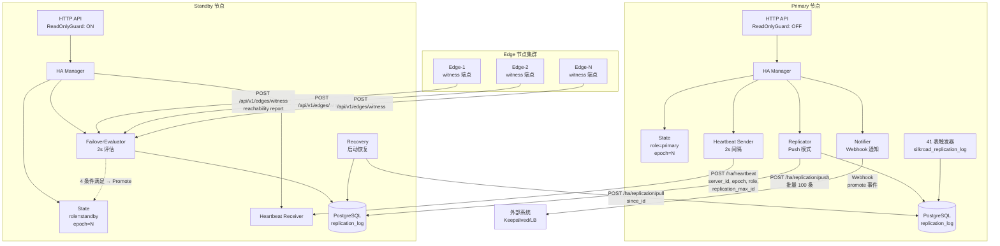

### 2.3 文件职责矩阵

| 文件 | 行数 | 核心职责 | 关键数据结构 |
|------|------|----------|-------------|
| `state.go` | ~189 | 线程安全的状态管理 | `State{serverID, role, epoch, peer*}` |
| `heartbeat.go` | ~105 | 周期性心跳发送 | 心跳请求/响应 JSON |
| `failover.go` | ~126 | 4 条件故障转移评估 | `FailoverEvaluator` |
| `recovery.go` | ~146 | 启动恢复流程 | `CheckAndRecover()` |
| `replicator.go` | ~281 | 异步复制推送引擎 | `Replicator{batch, offset, failures}` |
| `notifier.go` | ~132 | Webhook 事件通知 | `NotifyEvent` |
| `middleware.go` | ~56 | 只读保护中间件 | `ReadOnlyGuard()` |
| `ha_http.go` | ~313 | HTTP 端点注册 | 8 个端点 |

---

## 3. HA 核心模块逐文件分析

### 3.1 state.go — 状态管理核心 (~189 行)

#### 数据结构

```go
type State struct {
    mu                sync.RWMutex
    serverID          string    // 节点唯一标识
    role              string    // "primary" | "standby"
    epoch             int64     // 共识纪元，单调递增
    peerID            string    // 对端节点 ID
    peerAddr          string    // 对端节点地址
    lastPeerHeartbeat time.Time // 最后收到对端心跳时间
    lastPeerMaxID     int64     // 对端最大复制 ID
    lastAppliedID     int64     // 本地最后应用的复制 ID
}
```

#### 关键方法分析

| 方法 | 逻辑 | 线程安全 | 风险点 |
|------|------|----------|--------|
| `Promote(reason)` | epoch++ → role="primary" | 写锁 | **原子性** — epoch 递增和角色切换在同一写锁内完成，安全 |
| `Demote(newEpoch)` | 仅当 newEpoch > 当前 epoch 时才降级 | 写锁 | **安全保护** — 防止旧 epoch 消息导致错误降级 |
| `StatusJSON()` | 生成监控端点 JSON | 读锁 | 无风险 |
| `GetRole()` / `GetEpoch()` | 读取当前角色/纪元 | 读锁 | 无风险 |

#### Epoch 共识机制详解

```
Epoch 共识规则：
  1. 每个 Promote 操作 epoch 自增 1
  2. 收到更高 epoch 的消息 → 无条件降级
  3. epoch 相等时，维持当前状态（不做任何操作）
  4. epoch 是最终仲裁者 — 即使两个节点同时为 primary，
     最终 epoch 高的那个会让 epoch 低的自动降级
```

#### 代码质量评估

| 维度 | 评分 | 说明 |
|------|------|------|
| 线程安全 | ★★★★★ | RWMutex 正确使用，读写分离 |
| 边界处理 | ★★★★☆ | Demote 的 epoch 保护很好，但缺少 epoch 溢出检查 |
| 可测试性 | ★★★☆☆ | 缺少 Mock 接口，强依赖实际 State 实例 |
| 可观测性 | ★★★★☆ | StatusJSON 提供了完整的状态快照 |

### 3.2 heartbeat.go — 心跳机制 (~105 行)

#### 心跳流程

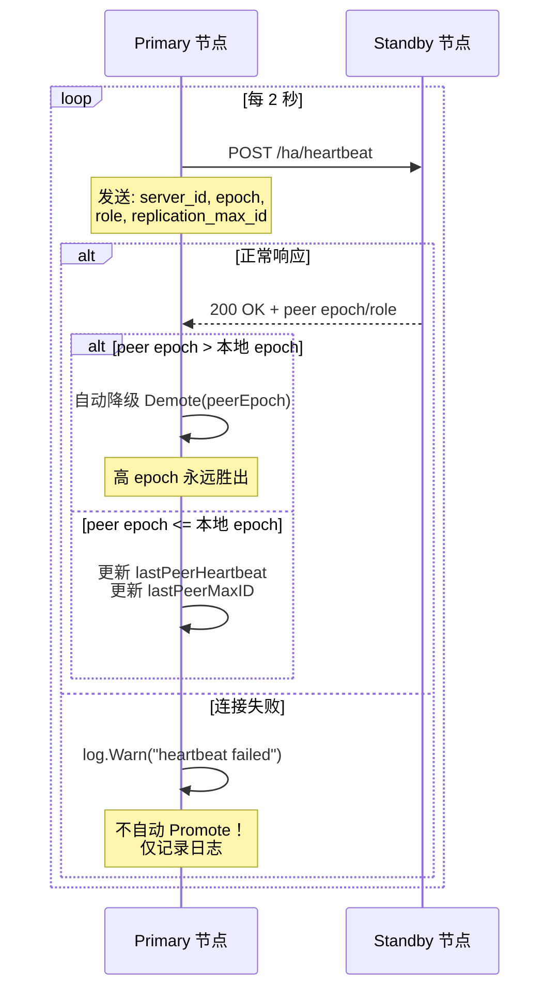

#### 关键设计决策分析

**决策 1: 心跳失败不自动提升**

这是最关键的安全设计。很多 HA 系统在心跳超时后自动提升 Standby，但这会导致网络分区时的脑裂。Silkroad 选择了更安全的路线：

```
心跳失败 → 仅记录日志
真正的故障转移 → 由 FailoverEvaluator 的 4 条件评估决定
```

**决策 2: 双向 epoch 同步**

心跳不仅是存活检测，还是 epoch 同步通道：
- Primary 发送自己的 epoch → Standby 可以发现自己 epoch 过时
- Standby 响应自己的 epoch → Primary 可以发现自己 epoch 过时
- 任何一方发现对端 epoch 更高 → 自动降级

**决策 3: replication_max_id 交换**

心跳中包含双方的 max_id，这为复制引擎提供了关键信息：
- Primary 知道 Standby 的进度 → 可以计算复制延迟
- Standby 知道 Primary 的进度 → 可以判断自己是否落后过多

#### 风险分析

| 风险项 | 严重性 | 说明 |
|--------|--------|------|
| **心跳间隔硬编码** | 低 | 2 秒间隔适中，但不可动态调整 |
| **单次失败无回退** | 低 | 失败后立即重试（2s 后），无指数回退 |
| **无心跳聚合统计** | 中 | 缺少心跳成功率/延迟的 Prometheus 指标 |

### 3.3 failover.go — 故障转移评估器 (~126 行)

#### 四条件评估逻辑

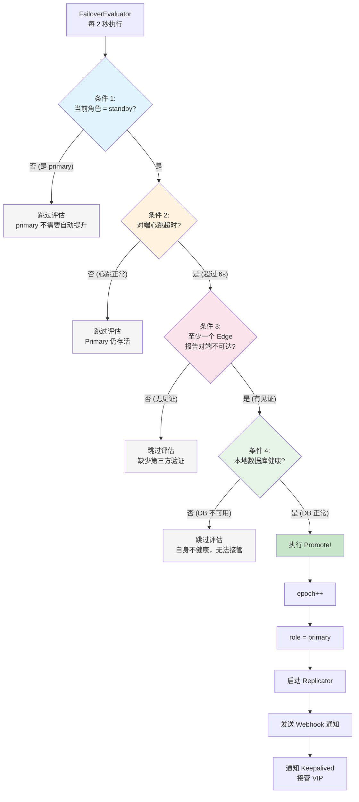

#### 条件详解与工程权衡

| 条件 | 目的 | 超时阈值 | 工程权衡 |
|------|------|----------|----------|
| **C1: 角色检查** | 仅 Standby 可自动提升 | — | Primary 需要手动降级，避免双向自动化导致的混乱 |
| **C2: 心跳超时** | 检测 Primary 失联 | 6s (3 次心跳) | 太短→假阳性，太长→恢复慢；6s 是合理折中 |
| **C3: 边缘见证** | 第三方验证，避免网络分区误判 | — | **关键创新** — 利用工厂中已有的 Edge 节点作为见证者 |
| **C4: 自身健康** | 确保自身有能力接管 | — | 避免"病人救病人"的尴尬局面 |

#### 边缘见证机制深度分析

```
Edge 节点定期向两个 Server 报告可达性：

  POST /api/v1/edges/witness
  {
    "edge_id": "edge-pack-01",
    "primary_reachable": true,
    "standby_reachable": true,
    "timestamp": "2026-09-17T10:30:00Z"
  }

FailoverEvaluator 收集这些报告，判断是否有 Edge 报告 Primary 不可达。

关键问题：
  - Edge 本身的网络视角是否可靠？
  - 如果所有 Edge 都与 Standby 在同一个网段...
  - Edge 到 Primary 的网络中断 ≠ Primary 真正宕机
```

### 3.4 recovery.go — 启动恢复 (~146 行)

#### 恢复流程

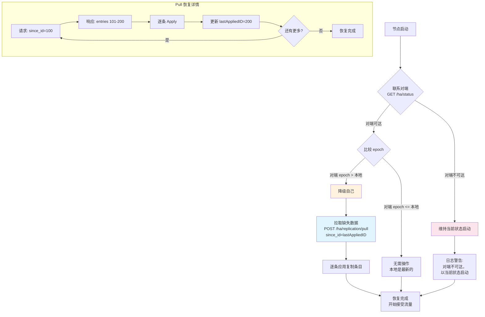

#### 恢复场景分析

| 场景 | 自身状态 | 对端状态 | 恢复动作 |
|------|----------|----------|----------|
| 正常重启 | standby, epoch=5 | primary, epoch=5 | 拉取缺失条目 |
| 故障后重启 | primary, epoch=3 | primary, epoch=5 | 降级 → 拉取 |
| 双节点重启 | primary, epoch=5 | 不可达 | 维持 primary 启动 |
| 长时间离线 | standby, epoch=2 | primary, epoch=8 | 降级 → 拉取（可能需要全量重播） |
| **保留期溢出** | standby, epoch=2 | primary, epoch=8 | **失败！** replication_log 已清理 |

#### 关键风险：保留期溢出

```
场景：Standby 离线时间超过 retention_days

时间线：
  Day 0:  Standby 最后同步 ID = 1000
  Day 1-7: Primary 产生 ID 1001-5000
  Day 7:  Prune 清理 ID < 3000
  Day 8:  Standby 重启，请求 since_id=1000
  
结果：
  Primary 上 ID 1001-2999 已被清理
  Pull 请求返回从 ID 3000 开始的数据
  Standby 缺失 ID 1001-2999 的数据 → 数据不一致！

当前方案：
  需要手动运行 ha-seed 工具进行全量重播
  系统不会自动检测此条件，不会发出告警
```

### 3.5 replicator.go — 复制引擎 (~281 行)

这是 HA 子系统中最复杂、最关键的模块。

#### 复制引擎架构

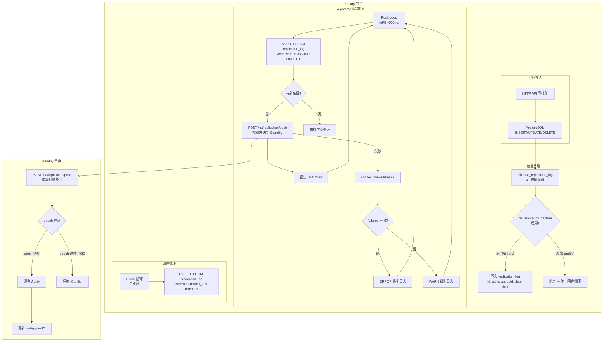

#### ReplicationEntry 数据结构

```go
type ReplicationEntry struct {
    ID         int64     // 自增主键，全局有序
    TableName  string    // 源表名
    Operation  string    // INSERT / UPDATE / DELETE
    RecordUUID string    // 被操作记录的 UUID
    Data       string    // JSON 格式的完整行数据
    CreatedAt  time.Time // 触发器记录时间
}
```

#### 触发器工作原理

```sql
-- 41 表共用的触发器函数 (由 schema.go init() 自动生成)
CREATE OR REPLACE FUNCTION silkroad_replication_log() 
RETURNS TRIGGER AS $$
BEGIN
    -- 检查开关是否启用
    IF NOT EXISTS (
        SELECT 1 FROM ha_replication_capture WHERE enabled = true
    ) THEN
        RETURN NEW;  -- Standby 模式，跳过记录
    END IF;
    
    -- 记录变更
    INSERT INTO replication_log (table_name, operation, record_uuid, data, created_at)
    VALUES (
        TG_TABLE_NAME,
        TG_OP,
        COALESCE(NEW.uuid, OLD.uuid),
        CASE TG_OP
            WHEN 'DELETE' THEN row_to_json(OLD)
            ELSE row_to_json(NEW)
        END,
        now()
    );
    
    RETURN NEW;
END;
$$ LANGUAGE plpgsql;
```

#### 回声循环防护机制

```
问题：Standby 收到 Primary 推送的复制条目并应用（INSERT/UPDATE/DELETE）。
      如果 Standby 的触发器也被启用，这些操作会再次写入 Standby 的 replication_log，
      形成无限循环。

解决方案：ha_replication_capture 开关表
  - Primary: enabled = true  → 触发器记录变更
  - Standby: enabled = false → 触发器跳过记录
  - Promote 时: 启用 capture
  - Demote 时: 禁用 capture

风险评估：
  ✅ 方案简洁有效，开关切换是原子操作
  ⚠️ 如果 Promote/Demote 过程中开关切换失败？
     → Promote 失败（capture 未启用）：主节点不记录变更 → 复制静默失败
     → Demote 失败（capture 未禁用）：备节点产生回声 → 数据膨胀
  建议：Promote/Demote 应检查开关切换结果，失败则回滚操作
```

#### Offset 管理与重置

```
初始化：
  1. Replicator 启动时，查询 Standby 的 lastPeerMaxID (从心跳获取)
  2. 以此为 lastOffset 开始推送
  
重置场景：
  - ResetOffset(): Promote 时调用，清除旧 offset
  - 防止继承前 Primary 的 stale offset 导致重复推送或跳过
  
UpdateConfig():
  - 从 HA 设置 API 调用
  - 热更新推送间隔、批量大小等配置
  - 不中断运行中的推送循环
```

### 3.6 notifier.go — Webhook 通知 (~132 行)

#### 通知事件结构

```go
type NotifyEvent struct {
    ServerID string    `json:"server_id"`
    NewRole  string    `json:"new_role"`
    Epoch    int64     `json:"epoch"`
    Reason   string    `json:"reason"`
    Time     time.Time `json:"time"`
}
```

#### 通知流程

```
Promote 事件触发 → Notifier.Send()
  → POST to configured webhook URL
  → 失败? → 重试 (retry_count 次, 间隔 retry_interval)
  → 最终失败? → 仅记录日志，不阻塞 Promote 操作

典型用途：
  - 通知 Keepalived 切换 VIP
  - 通知负载均衡器更新后端
  - 通知运维监控系统
  - 通知 n8n 自动化流程
```

#### 风险分析

| 风险项 | 严重性 | 说明 |
|--------|--------|------|
| **Webhook 不可靠** | 中 | 如果通知丢失，外部系统不知道角色已切换 |
| **无 ACK 确认** | 中 | 发送成功 ≠ 外部系统已处理 |
| **通知延迟** | 低 | 重试期间外部系统仍指向旧 Primary |

### 3.7 middleware.go — 只读保护 (~56 行)

#### ReadOnlyGuard 逻辑

```go
func ReadOnlyGuard(state *State) gin.HandlerFunc {
    return func(c *gin.Context) {
        if state.GetRole() == "standby" {
            method := c.Request.Method
            if method == "POST" || method == "PUT" || 
               method == "DELETE" || method == "PATCH" {
                // 例外：/ha/ 前缀的端点始终放行
                if !strings.HasPrefix(c.Request.URL.Path, "/ha/") {
                    c.AbortWithStatusJSON(503, gin.H{
                        "error": "node is standby, read-only",
                    })
                    return
                }
            }
        }
        c.Next()
    }
}
```

#### 设计分析

| 决策 | 分析 |
|------|------|
| **503 而非 307 重定向** | 客户端需要自行重试到 Primary；不做自动重定向避免 Standby 成为代理瓶颈 |
| **方法级过滤** | POST/PUT/DELETE/PATCH 被拦截；GET/HEAD/OPTIONS 放行 |
| **/ha/ 例外** | 复制推送（POST /ha/replication/push）必须能到达 Standby |
| **缺少 CORS 处理** | Standby 返回 503 时未设置 CORS 头，前端跨域请求会收到不友好的错误 |

### 3.8 ha_http.go — HTTP 端点 (~313 行)

#### 端点清单与功能

| 方法 | 路径 | 功能 | 权限 |
|------|------|------|------|
| `GET` | `/api/v1/ha/status` | 完整状态查询 | 任何角色 |
| `POST` | `/ha/heartbeat` | 接收心跳 + epoch 同步 | 任何角色 |
| `POST` | `/ha/replication/push` | 接收复制批次 | Standby |
| `POST` | `/ha/replication/pull` | 提供恢复数据 | Primary |
| `POST` | `/ha/promote` | 手动提升 | Standby |
| `POST` | `/ha/demote` | 接受降级 | Primary |
| `GET` | `/api/v1/ha/settings` | 读取 HA 配置 | 任何角色 |
| `PUT` | `/api/v1/ha/settings` | 更新 HA 配置 | Primary |

#### Push Handler 详解

```
POST /ha/replication/push 处理流程：

1. 解析请求体 → []ReplicationEntry + sender_epoch
2. epoch 验证：
   - sender_epoch < 本地 epoch → 返回 409 Conflict (过时的推送)
   - sender_epoch >= 本地 epoch → 继续处理
3. 逐条应用：
   for each entry in batch:
     - 根据 table_name + operation 执行 INSERT/UPDATE/DELETE
     - 失败 → 记录错误但继续处理其余条目
4. 更新 lastAppliedID = 批次最后一条的 ID
5. 返回 200 OK + applied count

关键问题：
  ⚠️ 逐条应用意味着批次中间失败 → 部分应用
  ⚠️ 没有事务包装整个批次 → 批次级原子性缺失
  ⚠️ 如果同一记录在批次中有多次变更，顺序至关重要
```

#### Manual Promote 端点

```
POST /ha/promote 处理流程：

1. 检查当前角色是否为 standby
2. 可选参数：
   - demote_peer: true → 先向对端发送 POST /ha/demote
   - force: true → 即使对端不响应也继续 promote
3. 向对端发送 demote 请求
4. 执行本地 Promote
5. 启动 Replicator
6. 发送 Webhook 通知
7. 返回新状态

竞态窗口：
  Step 3 完成 → Step 4 未完成期间：
  - 对端已降级（不再处理写请求）
  - 本端尚未提升（也不处理写请求）
  = 短暂的"双备"窗口，所有写请求返回 503
  
  更危险的反向情况：
  Step 4 完成 → Step 3 对端慢响应：
  - 本端已提升为 Primary
  - 对端仍为 Primary（尚未收到降级请求）
  = 短暂的"双主"窗口 → 潜在的数据冲突！
```

---

## 4. HA 复制机制深度分析

### 4.1 复制数据流完整图

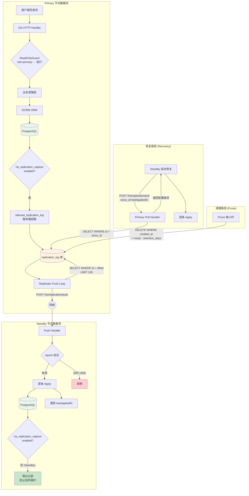

### 4.2 复制一致性模型分析

#### 异步复制的数据丢失窗口

```
时间轴分析：

T=0.000s  客户端写入 → Primary DB commit (成功响应客户端)
T=0.000s  触发器写入 replication_log (同一事务内)
T=0.000s  客户端收到 200 OK → 认为写入完成
T=0.001s  ...
T=0.499s  Replicator 上次推送完毕
T=0.500s  Replicator 发起新一轮查询 → 发现新条目
T=0.510s  推送到 Standby → Standby 应用

最大数据丢失窗口 = 推送间隔 (~500ms) + 网络延迟 + 处理时间
                  ≈ 500ms - 1s

如果 Primary 在 T=0.001s 宕机：
  - 客户端已收到 200 OK（认为成功）
  - 但 Standby 尚未收到此条目
  - 故障转移后此写入丢失！
```

#### 同步复制为何被否决

```
评估结论（在代码注释和设计文档中有记录）：

同步复制 = 每次写入必须等待 Standby 确认
  优点：零数据丢失
  缺点：
    1. Standby 不可用 → Primary 所有写操作阻塞
    2. 网络延迟直接叠加到每次写操作
    3. 化纤工厂场景：PLC 数据采集高频 (数百ms级)，
       同步复制会导致数据采集延迟不可接受
    4. 工厂网络质量参差不齐，抖动大

最终决策：接受 500ms 数据丢失窗口，换取高吞吐低延迟
         通过 HASettings 页面要求用户明确确认此风险
```

### 4.3 41 表触发器机制

```
schema.go init() 自动为以下表类型生成触发器：

业务数据表：
  - production_orders    (生产订单)
  - lots                 (批次)
  - doffings             (落纱记录)
  - bobbins              (丝锭)
  - pallets              (托盘)
  - cartons              (纸箱)
  - warehouse_places     (库位)
  - warehouse_movements  (入出库记录)
  - quality_inspections  (质检记录)
  ... 等约 30+ 业务表

配置表：
  - system_settings
  - edge_configs
  - plc_configs
  - print_templates
  ... 等约 10+ 配置表

排除表 (不做复制)：
  - replication_log      (自身，避免无限递归)
  - ha_replication_capture (开关表)
  - sessions / tokens    (会话数据，不需要复制)
  - audit_logs           (日志数据，可独立)
```

---

## 5. HA 故障转移四条件评估

### 5.1 完整故障转移时序图

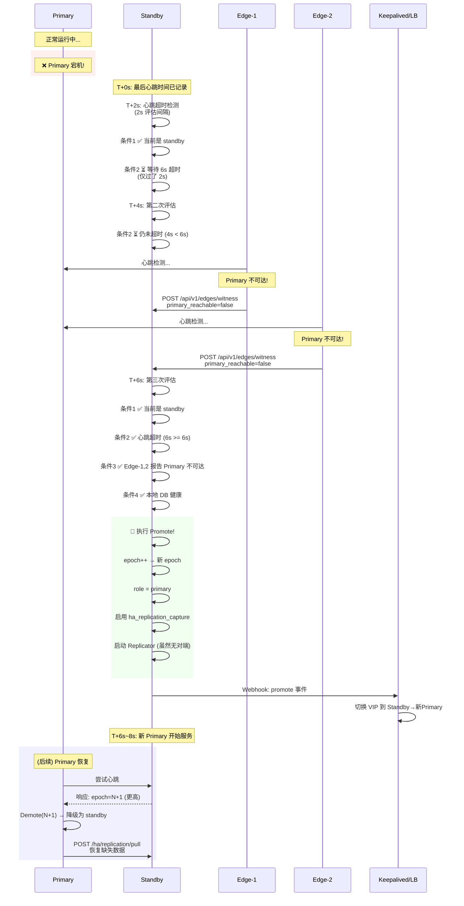

### 5.2 故障场景分类分析

| 场景 | C1 | C2 | C3 | C4 | 结果 | 恢复时间 |
|------|----|----|----|----|------|----------|
| Primary 正常宕机 | ✅ | ✅ 6s | ✅ Edge 报告 | ✅ | **自动故障转移** | ~6-8s |
| Primary 网络分区 | ✅ | ✅ 6s | ⚠️ 取决于 Edge 位置 | ✅ | **可能成功/失败** | 不确定 |
| Standby DB 故障 | ✅ | ✅ 6s | ✅ | ❌ | **不转移** | 需人工 |
| Primary 缓慢 (非宕机) | ✅ | ❌ 心跳仍在 | — | — | **不转移** (正确) | — |
| 所有 Edge 不可达 | ✅ | ✅ 6s | ❌ 无见证 | ✅ | **不转移** | 需人工 |
| 仅 Standby 网络隔离 | ✅ | ✅ 6s | ❌ Edge 报告 Primary 可达 | ✅ | **不转移** (正确) | — |

### 5.3 脑裂场景深度分析

```
网络分区场景 (Split-Brain)：

    ┌────────────────────┐     ┌────────────────────┐
    │   网段 A            │     │   网段 B            │
    │                    │     │                    │
    │   Primary          │  X  │   Standby           │
    │   Edge-1           │  X  │   Edge-3            │
    │   Edge-2           │  X  │   Edge-4            │
    │                    │     │                    │
    └────────────────────┘     └────────────────────┘
                    网络分区
    
分析：
  - Edge-3, Edge-4 报告 Primary 不可达 → 条件3 满足
  - Standby 心跳超时 → 条件2 满足
  → Standby 提升为 Primary (epoch N+1)
  
  - 原 Primary 心跳超时，但它是 Primary 不会自动提升
  - 原 Primary 继续服务网段 A 的 Edge (epoch N)
  
  = 双主状态! 两个 Primary 同时写入各自的数据库
  
分区恢复后：
  - 心跳恢复 → epoch N+1 > N → 原 Primary 降级
  - 但分区期间双方各自产生的写入需要手动调和
  
根本原因：
  双节点架构 (2-node) 无法实现多数派仲裁 (quorum)
  Edge 见证是近似方案，但不等价于 Raft/Paxos
```

---

## 6. HA 已知问题与风险评估

### 6.1 问题清单与严重性矩阵

| # | 问题 | 严重性 | 发生概率 | 影响 | 代码位置 |
|---|------|--------|----------|------|----------|
| HA-1 | **脑裂风险** | 🔴 严重 | 中 | 双主写入数据冲突 | `failover.go` 4 条件 |
| HA-2 | **异步数据丢失窗口** | 🟡 中等 | 高 | 最多丢失 ~500ms 写入 | `replicator.go` 推送间隔 |
| HA-3 | **保留期溢出无检测** | 🔴 严重 | 低 | 恢复不完整，数据不一致 | `recovery.go` + `replicator.go` Prune |
| HA-4 | **Edge 见证可靠性** | 🟡 中等 | 中 | 误判导致错误故障转移 | `failover.go` 条件3 |
| HA-5 | **复制延迟无告警** | 🟡 中等 | 高 | 延迟增长不可见 | `ha_http.go` status 端点 |
| HA-6 | **手动 Promote 竞态** | 🟠 较高 | 低 | 短暂双主窗口 | `ha_http.go` promote 端点 |
| HA-7 | **批次应用非原子** | 🟡 中等 | 低 | 部分应用导致数据不一致 | `ha_http.go` push handler |
| HA-8 | **无自动重播** | 🟡 中等 | 低 | 需人工运行 ha-seed | `recovery.go` |
| HA-9 | **Capture 开关竞态** | 🟠 较高 | 极低 | 回声循环或复制静默失败 | `replicator.go` enable/disable |
| HA-10 | **Standby 503 无 CORS** | 🟢 低 | 高 | 前端错误处理不友好 | `middleware.go` |

### 6.2 重点问题深度分析

#### HA-1: 脑裂风险 (Split-Brain)

**根本原因：** 双节点架构缺乏多数派仲裁

```
传统 Raft/Paxos 的最小集群 = 3 节点 (允许 1 节点故障)
Silkroad HA = 2 节点 → 无法形成多数派

数学证明：
  N=2 节点，需要 majority = ceil(2/2)+1 = 2 票才能达成共识
  1 节点故障 → 只剩 1 票 < 2 → 无法选举
  → 为了可用性，Silkroad 降低了一致性要求
  → CAP 定理中选择了 AP (可用性+分区容忍) 而非 CP (一致性+分区容忍)
```

**缓解措施（已实现）：**
1. Epoch 共识 — 分区恢复后高 epoch 胜出
2. Edge 见证 — 第三方验证降低误判概率
3. HASettings 风险确认 — 用户必须明确接受此风险

**缓解措施（建议追加）：**
1. 引入第三方仲裁节点（etcd/consul 轻量级）
2. 网络分区检测增加多路径探测
3. 自动冲突检测和人工调和工具

#### HA-3: 保留期溢出无检测

**当前行为：**
```
Prune 每小时执行：
  DELETE FROM replication_log WHERE created_at < now() - retention_days

如果 Standby 离线超过 retention_days：
  → Pull 恢复时请求的 since_id 对应的记录已被清理
  → 恢复得到不完整的数据集
  → 静默的数据不一致！
```

**建议修复方案：**
```go
// recovery.go — 增加保留期校验
func (r *Recovery) CheckAndRecover() error {
    // ... 现有逻辑 ...
    
    // 新增：检查请求的 since_id 是否在对端的保留范围内
    peerMinID := peerStatus.MinReplicationID  // 需要新增此字段
    if localLastAppliedID < peerMinID {
        return fmt.Errorf(
            "CRITICAL: replication gap detected! "+
            "local_last=%d, peer_min=%d, "+
            "gap=%d entries lost. Manual ha-seed required",
            localLastAppliedID, peerMinID,
            peerMinID - localLastAppliedID,
        )
    }
    // ... 继续正常恢复 ...
}
```

#### HA-7: 批次应用非原子

**当前行为：**
```
Push Handler 逐条应用 100 条记录：
  entry[0]: INSERT → 成功
  entry[1]: UPDATE → 成功
  ...
  entry[47]: UPDATE → 失败 (外键约束)
  entry[48]: INSERT → 继续尝试
  ...
  entry[99]: UPDATE → 成功

结果：entry[47] 丢失，但其前后的条目都已应用
→ 数据不一致！
```

**建议修复方案：**
```go
// 将整个批次包装在一个数据库事务中
func (h *HAHandler) handlePush(c *gin.Context) {
    // ... 解析和 epoch 验证 ...
    
    tx := h.db.Begin()
    for _, entry := range batch.Entries {
        if err := h.applyEntry(tx, entry); err != nil {
            tx.Rollback()
            c.JSON(500, gin.H{"error": "batch apply failed", "entry_id": entry.ID})
            return
        }
    }
    tx.Commit()
    // ... 更新 lastAppliedID ...
}
```

---

## 7. HA 改进路线建议

### 7.1 短期改进（1-2 周）

| 项目 | 工作量 | 影响 | 描述 |
|------|--------|------|------|
| **保留期溢出检测** | 0.5 天 | 🔴 高 | recovery.go 增加 gap 检测和告警 |
| **批次事务化** | 0.5 天 | 🟡 中 | push handler 用数据库事务包装批次 |
| **复制延迟指标** | 0.5 天 | 🟡 中 | Prometheus gauge: replication_lag_entries |
| **Standby CORS 头** | 0.5 天 | 🟢 低 | middleware.go 503 响应添加 CORS |

### 7.2 中期改进（1-2 月）

| 项目 | 工作量 | 影响 | 描述 |
|------|--------|------|------|
| **自动 Gap 恢复** | 3 天 | 🔴 高 | 检测到 gap 时自动触发 ha-seed |
| **多路径见证** | 2 天 | 🟡 中 | Edge 从多个网络路径检测对端可达性 |
| **手动 Promote 原子化** | 2 天 | 🟠 较高 | 使用分布式锁/两阶段协议 |
| **HA 集成测试套件** | 5 天 | 🔴 高 | 自动化测试所有故障场景 |

### 7.3 长期改进（3+ 月）

| 项目 | 工作量 | 影响 | 描述 |
|------|--------|------|------|
| **第三方仲裁** | 2 周 | 🔴 高 | 引入 etcd 或 consul 实现真正的 quorum |
| **同步复制可选** | 2 周 | 🟡 中 | 针对关键表提供同步复制选项 |
| **冲突调和工具** | 1 周 | 🔴 高 | 脑裂后的自动化数据合并工具 |

---

## 8. PLC 仿真器架构总览

### 8.1 设计定位

PLC 仿真器是 igh-platform 开发和测试的核心基础设施，目标是：

| 目标 | 实现程度 | 评估 |
|------|----------|------|
| 替代真实 PLC 进行开发 | ★★★★☆ | S7 DB 读写基本可用 |
| 模拟完整生产流程 | ★★★☆☆ | 关键状态机有，但细节不足 |
| 故障注入测试 | ★★☆☆☆ | 仅 4 种基本故障类型 |
| 验收测试自动化 | ★★★★☆ | plcsim.yaml 场景覆盖全链路 |
| 真实感知还原 | ★★☆☆☆ | 缺少时序抖动和异常状态 |

### 8.2 PLC 仿真器架构图

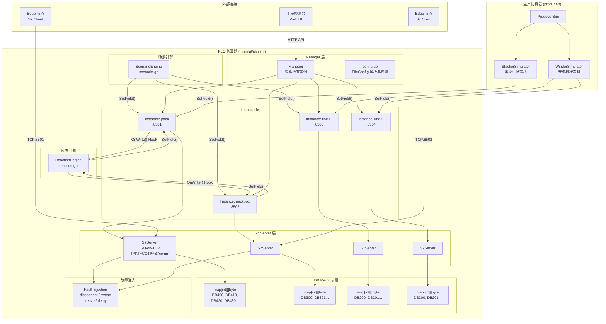

### 8.3 文件职责矩阵

| 文件 | 行数 | 核心职责 | 复杂度 |
|------|------|----------|--------|
| `sim.go` | ~381 | Instance/Manager/DB 内存/故障注入/写 Hook | 高 |
| `s7server.go` | ~316 | ISO-on-TCP S7 协议实现 | 高 |
| `scenario.go` | ~303 | 场景定义/变量展开/步骤执行 | 中高 |
| `reaction.go` | ~124 | 写 Hook 反应/上升沿检测 | 中 |
| `config.go` | ~116 | 配置解析/交叉验证 | 低 |
| `producer/producer.go` | ~168 | 生产线仿真管理 | 中 |
| `producer/winder.go` | ~297 | 卷绕机状态机 | 中高 |
| `producer/warehouse.go` | ~390 | 堆垛机/库位仿真 | 高 |
| `producer/config.go` | ~150 | 生产仿真配置 | 低 |

---

## 9. PLC 仿真器核心模块逐文件分析

### 9.1 sim.go — 仿真器核心 (~381 行)

#### Instance 数据结构

```go
type Instance struct {
    name       string              // 实例名，如 "pack"
    listenAddr string              // 监听地址，如 ":8501"
    dbs        map[int][]byte      // DB 编号 → 字节数组 (模拟 PLC DB 块)
    dbMu       map[int]*sync.Mutex // 每个 DB 独立的互斥锁
    faultCfg   *FaultConfig        // 故障注入配置
    writeHooks []WriteHook         // 写操作回调列表
}
```

#### DB 内存模型分析

```
真实 PLC 的 DB 块：
  - 固定大小，在 PLC 编程时定义
  - 按字节地址访问
  - 支持多种数据类型 (BOOL, BYTE, INT, DINT, REAL, STRING...)
  
仿真器的 DB 模型：
  - map[int][]byte → DB 编号映射到字节切片
  - 字节切片动态增长（写入超出当前长度时自动扩展）
  - 类型解释由调用方负责 (SetField/ReadField 处理类型转换)

差异分析：
  ✅ 字节级兼容 → S7 协议报文完全一致
  ⚠️ 动态增长 → 真实 PLC 写超出范围会返回错误
  ⚠️ 无类型元数据 → 无法验证客户端读写的类型是否正确
  ⚠️ 初始值全零 → 真实 PLC 可能有非零初始值
```

#### SetField / ReadField 方法

```go
// SetField: 由场景引擎和反应引擎调用
func (inst *Instance) SetField(db int, offset int, dataType string, value interface{}) {
    inst.dbMu[db].Lock()
    defer inst.dbMu[db].Unlock()
    
    // 确保 DB 存在且足够大
    // 根据 dataType 编码 value 到字节
    // 写入 dbs[db][offset:offset+size]
    
    // 触发所有 writeHooks
    for _, hook := range inst.writeHooks {
        hook(db, offset, dataType, value)
    }
}
```

#### 故障注入类型

| 类型 | 实现方式 | 模拟场景 |
|------|----------|----------|
| `disconnect` | 关闭 TCP listener | PLC 断电或网络断开 |
| `restart` | 关闭后重新打开 listener | PLC 重启（所有连接断开） |
| `freeze` | 在处理前 sleep 指定时长 | PLC CPU 卡死或过载 |
| `delay` | 每个响应前 sleep 指定时长 | 网络延迟或 PLC 响应慢 |

#### Manager 启动流程

```go
func (m *Manager) Run() error {
    var wg sync.WaitGroup
    errCh := make(chan error, len(m.instances))
    
    for _, inst := range m.instances {
        wg.Add(1)
        go func(i *Instance) {
            defer wg.Done()
            if err := i.Start(); err != nil {
                errCh <- err  // fail-fast: 任一实例启动失败
            }
        }(inst)
    }
    
    // 等待第一个错误或全部启动成功
    // ...
}
```

### 9.2 s7server.go — S7 协议实现 (~316 行)

这是仿真器的协议核心，实现了 ISO-on-TCP 之上的 S7 通信。

#### 协议栈结构

```
                          ISO-on-TCP 协议栈
    ┌──────────────────────────────────────────────┐
    │               S7comm 层                       │
    │  Setup Communication / Read Var / Write Var   │
    ├──────────────────────────────────────────────┤
    │               COTP 层                         │
    │  Connection Request/Confirm / Data Transfer    │
    ├──────────────────────────────────────────────┤
    │               TPKT 层                         │
    │  [version=3][reserved=0][length:2bytes]       │
    ├──────────────────────────────────────────────┤
    │               TCP 层                          │
    │  标准 TCP 连接                                 │
    └──────────────────────────────────────────────┘
```

#### TPKT 头解析

```
TPKT Header (4 bytes):
  Byte 0: Version (固定 0x03)
  Byte 1: Reserved (固定 0x00)
  Byte 2-3: Total Length (大端序，包括 TPKT 头本身)

仿真器实现：
  func readTPKT(conn net.Conn) ([]byte, error) {
      header := make([]byte, 4)
      io.ReadFull(conn, header)
      length := binary.BigEndian.Uint16(header[2:4])
      payload := make([]byte, length-4)
      io.ReadFull(conn, payload)
      return payload, nil
  }
```

#### 支持的 S7 操作

| 操作 | 功能码 | 实现状态 | 说明 |
|------|--------|----------|------|
| COTP Connection Request | 0xE0 | ✅ 完整 | 建立 COTP 连接 |
| COTP Connection Confirm | 0xD0 | ✅ 完整 | 确认 COTP 连接 |
| S7 Setup Communication | 0xF0 | ✅ 完整 | 协商 PDU 大小，maxPDU=480 |
| S7 Read Var | 0x04 | ⚠️ 仅 DB 区域 | 支持多 item 读取 |
| S7 Write Var | 0x05 | ⚠️ 仅 DB 区域 | 支持多 item 写入 |
| S7 Read SZL | — | ❌ 未实现 | 系统状态列表 |
| S7 Block Services | — | ❌ 未实现 | 块操作 |
| S7 CPU Control | — | ❌ 未实现 | 启停 CPU |

#### 多 item 读写处理

```
S7 Read Var 请求格式：
  item_count: N
  items[0]: area=DB, db_number=400, start=0, length=10
  items[1]: area=DB, db_number=410, start=4, length=2
  ...

响应生成：
  for each item:
    if db not exist → return_code=0x0A (NotExist)
    if offset+length > db_size → return_code=0x05 (OutOfRange)
    else → return_code=0xFF (OK) + data bytes
    
    // 偶数字节对齐（S7 协议要求）
    if data_length is odd:
      append padding byte
```

#### applyFault 机制

```go
func (s *S7Server) applyFault() error {
    cfg := s.instance.faultCfg
    if cfg == nil {
        return nil
    }
    
    switch cfg.Type {
    case "disconnect":
        s.listener.Close()  // 关闭监听，所有连接断开
        return errDisconnected
        
    case "restart":
        s.listener.Close()
        time.Sleep(cfg.Duration)
        s.listener, _ = net.Listen("tcp", s.addr)  // 重新监听
        return nil
        
    case "freeze":
        time.Sleep(cfg.Duration)  // 在处理前冻结
        return nil
        
    case "delay":
        time.Sleep(cfg.Delay)  // 每个响应前延迟
        return nil
    }
    return nil
}
```

#### S7 协议实现的局限性分析

```
真实 S7 PLC 支持的内存区域：
  0x81 → I (Input)      ← 未实现
  0x82 → Q (Output)     ← 未实现
  0x83 → M (Merker/Flag) ← 未实现
  0x84 → DB (Data Block) ← ✅ 已实现
  0x1C → C (Counter)     ← 未实现
  0x1D → T (Timer)       ← 未实现

影响评估：
  - igh-platform Edge 端主要通过 DB 块与 PLC 交互 → 影响较小
  - 但某些 PLC 程序可能在 M 区存储中间状态
  - Input/Output 区域在诊断场景中很重要
  - Counter/Timer 在部分自动化逻辑中使用

建议优先级：
  1. M (Merker) — 中等优先级，部分 PLC 程序使用
  2. I/Q — 低优先级，Edge 不直接读写 IO
  3. C/T — 低优先级，化纤场景使用较少
```

---

## 10. S7 协议实现分析

### 10.1 连接建立时序

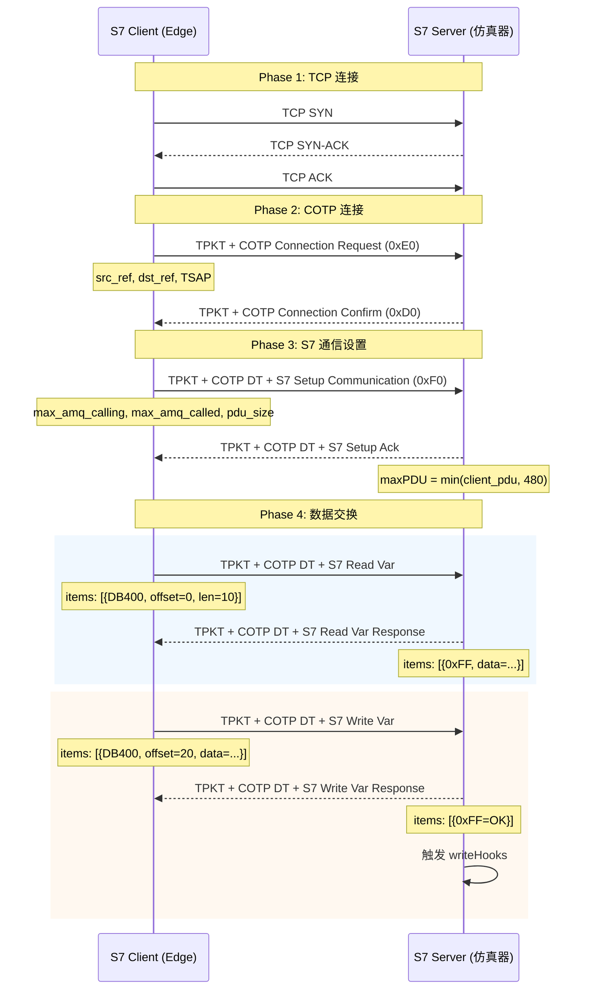

### 10.2 maxPDU = 480 的影响

```
maxPDU (最大协议数据单元) = 480 字节

这意味着：
  - 单次 Read/Write 请求的总数据量不能超过 ~460 字节 (减去协议头)
  - 对于大 DB 块 (如仓库 DB601 可能有数千字节)，需要多次请求
  - 真实 S7-1200/1500 PLC 的 maxPDU = 960 字节
  - 真实 S7-300/400 PLC 的 maxPDU = 240 字节

兼容性分析：
  480 是一个折中值：
  - 大于 S7-300/400 → 如果 Edge 使用 300 的限制，仿真器也能工作
  - 小于 S7-1200/1500 → 如果 Edge 假设 960，可能在仿真器上失败
  
建议：根据实际目标 PLC 型号配置 maxPDU
```

### 10.3 Item Return Codes

```
0xFF (255) → OK: 读写成功
0x0A (10)  → NotExist: 请求的 DB 不存在
0x05 (5)   → OutOfRange: 偏移量/长度超出 DB 范围

真实 PLC 还可能返回：
  0x01 → Hardware error
  0x03 → Accessing object not allowed
  0x06 → Data type not supported
  0x07 → Data type inconsistent
  0x0E → No data
  
仿真器未实现这些错误码 → 无法测试 Edge 对这些错误的处理逻辑
```

---

## 11. 场景引擎与反应引擎分析

### 11.1 场景引擎 (scenario.go ~303 行)

#### ScenarioConfig 结构

```yaml
# plcsim.yaml 中的场景定义示例
scenarios:
  - name: doffer-left-load
    description: "左落纱机装载"
    steps:
      - instance: pack
        db: 400
        fields:
          Doff_No_Byte_2: "$seq"
          Chuck_No: 1
          PackageWeight: "$rand(4500,5500)"
        delay_ms: 100
      - instance: pack
        db: 410
        fields:
          Ack_Status: 1
```

#### 运行时变量系统

| 变量 | 语法 | 功能 | 示例 |
|------|------|------|------|
| `$seq` | `$seq` | 运行计数器，每次场景执行递增 | 1, 2, 3, ... |
| `$rand(a,b)` | `$rand(min,max)` | 随机整数 [min, max] | `$rand(4500,5500)` → 4823 |
| `$repeat(n,expr)` | `$repeat(count,expression)` | 生成数组 | `$repeat(3,$rand(1,10))` → [7,3,9] |
| `$ref(db,field)` | `$ref(db_num,field_name)` | 交叉引用其他 DB 的当前值 | `$ref(400,Doff_No)` → 当前值 |

#### expandRepeat 实现分析

```
$repeat 的解析使用括号深度扫描而非正则表达式：

expandRepeat("$repeat(3,$rand(1,10))"):
  1. 找到 "$repeat("
  2. 从 "3," 开始扫描
  3. 遇到 "(" → 深度 +1
  4. 遇到 ")" → 深度 -1
  5. 深度归零时找到匹配的 ")"
  
这种实现比正则更可靠，能正确处理嵌套表达式：
  $repeat(3,$repeat(2,$rand(1,10)))  → 嵌套 repeat

但不支持：
  ❌ 累加器：$repeat(5,$seq+$prev)  → 无法引用前一个值
  ❌ 条件：$if(condition, then, else) → 无条件逻辑
```

#### 场景执行并发控制

```go
type ScenarioRuntime struct {
    mu      sync.Mutex  // 每个场景一把锁
    running bool
    runSeq  int64
}

func (sr *ScenarioRuntime) Execute(steps []Step) error {
    sr.mu.Lock()
    if sr.running {
        sr.mu.Unlock()
        return ErrAlreadyRunning  // 同一场景不可重入
    }
    sr.running = true
    sr.runSeq++
    sr.mu.Unlock()
    
    defer func() {
        sr.mu.Lock()
        sr.running = false
        sr.mu.Unlock()
    }()
    
    for _, step := range steps {
        // SetField for each field
        // optional delay_ms
    }
    return nil
}
```

**设计分析：**
- 同一场景不可重入 → 防止并发修改同一 DB 区域
- 不同场景可以并行 → 但如果操作同一 DB 区域仍有竞态
- 没有场景间的依赖/排序机制

### 11.2 反应引擎 (reaction.go ~124 行)

#### ReactionConfig 结构

```yaml
# plcsim.yaml 中的反应定义示例
reactions:
  - instance: pack
    db: 400
    watch: Order_Status      # 监视的字段
    trigger_value: 1         # 触发值
    delay_ms: 200            # 模拟 PLC 处理延迟
    set:                     # 触发后设置的字段
      Order_Ack: 1
      Error_Code: 0
```

#### 上升沿检测机制

```go
type Reaction struct {
    config     ReactionConfig
    lastValue  interface{}  // 记录上次读取值
    mu         sync.Mutex
}

func (r *Reaction) onWrite(db int, offset int, dataType string, value interface{}) {
    // 仅关注目标 DB 和字段
    if db != r.config.DB || !r.matchField(offset, dataType) {
        return
    }
    
    r.mu.Lock()
    defer r.mu.Unlock()
    
    // 上升沿检测：仅当值从非触发值变为触发值时触发
    if r.lastValue != r.config.TriggerValue && value == r.config.TriggerValue {
        go r.executeReaction()  // 异步执行
    }
    r.lastValue = value
}

func (r *Reaction) executeReaction() {
    if r.config.DelayMs > 0 {
        time.Sleep(time.Duration(r.config.DelayMs) * time.Millisecond)
    }
    for field, value := range r.config.Set {
        r.instance.SetField(r.config.DB, field, value)
    }
}
```

#### 上升沿检测的局限性

```
当前实现：仅上升沿 (Rising Edge)
  变化: 0 → 1 → 触发 ✅
  变化: 1 → 1 → 不触发 (保持不触发)
  变化: 1 → 0 → 不触发 (下降沿不检测)
  变化: 0 → 0 → 不触发

真实 PLC 中常用的触发模式：
  R_TRIG (上升沿) → ✅ 已实现
  F_TRIG (下降沿) → ❌ 未实现
  Level Hold (电平保持) → ❌ 未实现
  TON (延时接通) → ❌ 未实现
  TOF (延时断开) → ❌ 未实现
  
  AND/OR 条件组合：
    如 "当 Field_A=1 AND Field_B>100 时触发"
    → ❌ 完全未实现，仅支持单字段触发

影响评估：
  化纤包装线的 PLC 程序大量使用下降沿清除 ACK 信号，
  以及 TON 定时器实现超时保护。仿真器无法复现这些行为，
  导致集成测试覆盖度不足。
```

---

## 12. 生产仿真器分析

### 12.1 卷绕机状态机 (winder.go ~297 行)

#### 状态机定义

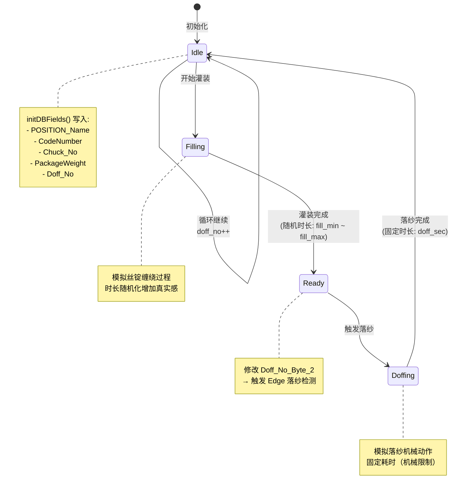

#### 关键实现细节

```go
func (w *WinderSimulator) run() {
    for {
        // Idle → Filling
        w.setState(Idle)
        
        // 写入初始 DB 字段
        w.initDBFields()
        
        // Filling: 随机灌装时间
        fillDuration := w.config.FillMinSec + 
            rand.Intn(w.config.FillMaxSec - w.config.FillMinSec)
        time.Sleep(time.Duration(fillDuration) * time.Second)
        
        w.setState(Filling)
        
        // Ready: 触发落纱信号
        w.setState(Ready)
        w.doffNo++
        w.instance.SetField(w.config.DB, "Doff_No_Byte_2", w.doffNo)
        // ↑ 这个字段变化会被 Edge 的 PLC 轮询检测到
        //   Edge 发现 Doff_No 变化 → 触发落纱业务逻辑
        
        // Doffing: 固定落纱时间
        w.setState(Doffing)
        time.Sleep(time.Duration(w.config.DoffSec) * time.Second)
        
        // 记录循环时间
        w.trackCycleTime(fillDuration + w.config.DoffSec)
    }
}
```

#### 卷绕机仿真的局限性

```
缺失的真实工况状态：

  真实卷绕机状态机 (简化)：
    Idle → Spinning → Winding → Full → Doffing → Idle
    
    + 异常分支：
      Winding → Yarn_Break → Alarm → Manual_Reset → Idle
      Full → Doff_Jam → Alarm → Maintenance → Idle
      * → Emergency_Stop → Manual_Reset → Idle
      * → Power_Loss → Recovery → Idle
    
    + 维护分支：
      Idle → Maintenance_Request → Maintenance → Idle
    
    + 产品切换：
      Idle → Lot_Change → Setup → Idle

  仿真器实现：
    Idle → Filling → Ready → Doffing → Idle (固定循环)
    
    缺失：
    ❌ 断丝 (Yarn Break) — 化纤生产最常见的异常
    ❌ 落纱卡住 (Doff Jam) — 机械故障
    ❌ 紧急停机 — 安全系统触发
    ❌ 维护请求 — 定期维护
    ❌ 批次切换 — 产品规格变更
    ❌ 功率波动 — 影响卷绕速度
    
    这些缺失意味着：
    → Edge 的异常处理逻辑无法在仿真环境中测试
    → 报警系统、恢复流程、人工干预流程未被覆盖
```

### 12.2 堆垛机状态机 (warehouse.go ~390 行)

#### 状态机定义

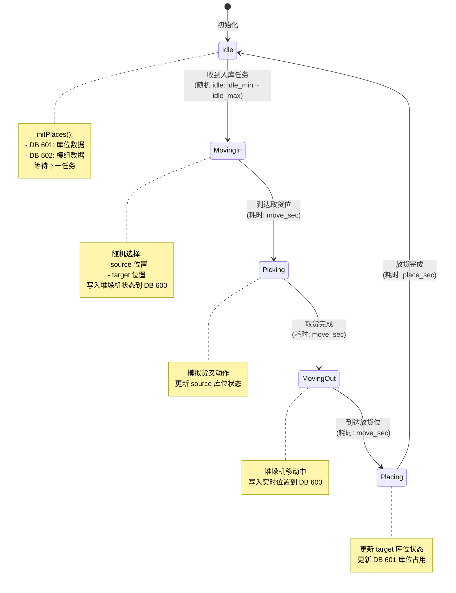

#### DB 布局

```
DB 600 — 堆垛机实时状态
  Offset  Type    Field
  0       INT     stacker_no        (堆垛机编号)
  2       INT     state             (状态码: 0-4)
  4       INT     source_row        (取货行)
  6       INT     source_col        (取货列)
  8       INT     source_level      (取货层)
  10      INT     target_row        (放货行)
  12      INT     target_col        (放货列)
  14      INT     target_level      (放货层)
  16      INT     error_code        (错误码)

DB 601 — 库位状态 (N 个库位)
  每个库位占 16 字节:
  Offset  Type    Field
  +0      INT     place_id
  +2      INT     row
  +4      INT     col
  +6      INT     level
  +8      INT     occupied          (0=空, 1=占用)
  +10     INT     pallet_id         (托盘编号)
  +12     INT     reserved
  +14     INT     reserved

DB 602 — 模组信息
  (用于模组化仓库管理)
```

#### 堆垛机仿真的局限性

```
缺失的真实工况：

1. 障碍物检测：
   真实堆垛机有光幕、编码器、限位开关
   仿真器无任何碰撞/越界检测
   → 无法测试 Edge 的安全联锁逻辑

2. 队列管理：
   真实仓库有任务队列、优先级排序
   仿真器随机选择 source/target
   → 无法测试先进先出 (FIFO)、紧急出库等策略

3. 多堆垛机协调：
   真实仓库可能有 2+ 堆垛机共享巷道
   仿真器各实例独立运行
   → 无法测试避让、交替通行等逻辑

4. 载荷检测：
   真实堆垛机检测货物重量、尺寸
   仿真器无载荷信息
   → 无法测试超重/超尺寸告警

5. 位置精度：
   真实堆垛机有编码器反馈实际位置
   仿真器直接跳转到目标位置
   → 无法测试定位偏差/重试逻辑
```

---

## 13. plcsim.yaml 场景配置分析

### 13.1 配置概览

```
文件大小: ~788 行
PLC 实例: 4 个 (pack, packbox, line-E, line-F)
场景数量: 20+
反应数量: 15+
```

### 13.2 PLC 实例配置

| 实例名 | 端口 | 对应设备 | DB 范围 |
|--------|------|----------|---------|
| `pack` | :8501 | 包装产线 PLC | DB400-430 |
| `packbox` | :8502 | 纸箱产线 PLC | DB300-301 |
| `line-E` | :8503 | E 线卷绕 PLC | DB200-201 |
| `line-F` | :8504 | F 线卷绕 PLC | DB200-201 |

### 13.3 场景覆盖矩阵

| 场景名 | 覆盖业务 | 步骤数 | 复杂度 |
|--------|----------|--------|--------|
| `doffer-left-load` | 左落纱机装载 | 2-3 | 低 |
| `doffer-auto-cycle` | 落纱自动循环 | 4-5 | 中 |
| `doffer-full-chain` | 落纱完整链路 | 8-10 | 高 |
| `pack-order-gate-open` | 订单下达→闸门开启 | 3-4 | 中 |
| `pack2l-pallet-done` | 2 层码垛完成 | 5-6 | 中 |
| `pack3l-box-then-pallet` | 3 层装箱后码垛 | 7-8 | 高 |
| **`pack-full-chain`** | **M5-e 全链路验收** | **12+** | **极高** |

### 13.4 pack-full-chain 场景深度分析

这是最重要的场景——覆盖 M5-e（第五版本边端）的完整验收测试：

```
pack-full-chain 覆盖的 6 个交互环节：

1. 订单派发 (Order Dispatch)
   Server → Edge: 新订单写入 DB400
   Edge 读取订单参数，配置产线

2. 托盘握手 (Pallet Handshake)
   Edge → PLC: 托盘到位信号
   PLC → Edge: 确认信号 (通过 reaction 模拟)

3. 纸箱标签 (Carton Label)
   Edge → 打印机: ZPL 标签数据
   Edge → PLC: 打印完成信号

4. 薄膜标签 (Film Label)
   Edge → 打印机: 薄膜标签数据
   Edge → PLC: 打印完成信号

5. RFID 写入
   Edge → RFID Reader: 写入托盘 RFID
   Edge → PLC: RFID 写入完成

6. 单轨运输 + 进度 + 完成
   Edge → PLC: 运输指令
   PLC → Edge: 运输进度 (通过 reaction 模拟)
   PLC → Edge: 运输完成信号
```

#### 场景-反应协作示意

```
场景 pack-full-chain 执行时的数据流：

Step 1: 场景写入 DB400.Order_Status = 1 (订单下达)
        → Reaction "order-ack" 检测到 → 200ms 后写 DB400.Order_Ack = 1
        
Step 2: 场景等待 delay_ms → 写 DB400.Pallet_Ready = 1 (托盘到位)
        → Reaction "pallet-confirm" 检测到 → 300ms 后写 DB400.Pallet_Confirm = 1

Step 3: 场景写入 DB410.Print_Request = 1 (标签打印请求)
        → Reaction "print-done" 检测到 → 500ms 后写 DB410.Print_Done = 1
        → Reaction "print-clear" 检测到 Print_Done → 清除 Print_Request

... 以此类推，场景和反应交替驱动，模拟 PLC 端的自动响应

关键设计：
  - 场景负责"Edge 端动作的模拟时序"
  - 反应负责"PLC 端逻辑的自动响应"
  - 二者配合 = 完整的通信协议模拟
```

### 13.5 反应配置分析

| 反应名 | 监视字段 | 触发值 | 延迟 | 设置动作 | 模拟目的 |
|--------|----------|--------|------|----------|----------|
| `order-ack` | Order_Status | 1 | 200ms | Order_Ack=1 | PLC 确认收到订单 |
| `pallet-confirm` | Pallet_Ready | 1 | 300ms | Pallet_Confirm=1 | PLC 确认托盘到位 |
| `print-done` | Print_Request | 1 | 500ms | Print_Done=1 | PLC 确认标签打印完成 |
| `print-clear` | Print_Done | 1 | 100ms | Print_Request=0 | PLC 清除打印请求 |
| `rfid-done` | RFID_Write | 1 | 400ms | RFID_Done=1 | PLC 确认 RFID 写入 |
| `transport-progress` | Transport_Start | 1 | 1000ms | Progress=50,100 | 模拟运输进度 |
| `transport-done` | Progress | 100 | 200ms | Transport_Done=1 | 运输完成信号 |

### 13.6 已知场景配置问题

```
plcsim.yaml 中的注释记录了已知限制：

1. "$ref 只能回显最后一个"
   → $ref(400,Doff_No) 读取的是当前时刻的值
   → 如果多个场景并发修改同一字段，结果不可预测

2. 无条件分支
   → pack-full-chain 是线性执行的
   → 无法模拟"如果 PLC 返回错误码则走异常分支"
   → 测试只覆盖 happy path

3. 计时精度
   → delay_ms 使用 time.Sleep，精度受 OS 调度影响
   → 真实 PLC 的定时器精度是 ms 级确定性
   → 仿真器可能出现 10-50ms 的抖动
```

---

## 14. PLC 仿真器已知问题与局限

### 14.1 问题清单与严重性矩阵

| # | 问题 | 严重性 | 影响范围 | 代码位置 |
|---|------|--------|----------|----------|
| SIM-1 | **S7 协议仅支持 DB 区域** | 🟡 中等 | 无法测试使用 M/I/Q 的逻辑 | `s7server.go` |
| SIM-2 | **无状态持久化** | 🟡 中等 | 重启后所有 DB 清零 | `sim.go` Instance |
| SIM-3 | **单线程 S7 处理** | 🟡 中等 | 多 Edge 连接时响应退化 | `s7server.go` 连接处理 |
| SIM-4 | **故障注入类型少** | 🟠 较高 | 无法测试数据损坏等场景 | `sim.go` FaultConfig |
| SIM-5 | **场景无条件分支** | 🟠 较高 | 仅覆盖 happy path | `scenario.go` |
| SIM-6 | **卷绕机无异常状态** | 🔴 严重 | 异常处理逻辑完全未测试 | `producer/winder.go` |
| SIM-7 | **无跨实例通信** | 🟡 中等 | 无法模拟 PLC 间联锁 | `sim.go` Instance 隔离 |
| SIM-8 | **反应仅上升沿** | 🟠 较高 | 缺少下降沿/电平/定时触发 | `reaction.go` |
| SIM-9 | **无热重载状态** | 🟡 中等 | 开发迭代需从头重放 | `sim.go` 全局 |
| SIM-10 | **控制台 UI 基础** | 🟢 低 | 缺少可视化调试工具 | console Web UI |
| SIM-11 | **堆垛机无安全检测** | 🟡 中等 | 碰撞/越界逻辑未覆盖 | `producer/warehouse.go` |
| SIM-12 | **$ref 并发不安全** | 🟡 中等 | 并行场景读取结果不确定 | `scenario.go` expandVariables |

### 14.2 重点问题深度分析

#### SIM-4: 故障注入类型不足

```
当前故障注入能力：

  ┌─────────────────────────────────────────────┐
  │         已实现          │    未实现（建议）      │
  ├─────────────────────────────────────────────┤
  │ ✅ disconnect (断开)    │ ❌ bit-flip (位翻转)   │
  │ ✅ restart (重启)       │ ❌ partial-read (截断) │
  │ ✅ freeze (冻结)        │ ❌ corrupt-data (损坏) │
  │ ✅ delay (延迟)         │ ❌ intermittent (间歇) │
  │                        │ ❌ slow-drain (缓慢)   │
  │                        │ ❌ reorder (乱序)      │
  │                        │ ❌ duplicate (重复)    │
  │                        │ ❌ timeout-at-n (第N次)│
  └─────────────────────────────────────────────┘

真实工厂常见故障：
  1. 电磁干扰 → 个别字节翻转 (bit-flip)
  2. 网线松动 → 间歇性断开 (intermittent)
  3. PLC 过载 → 部分数据返回，部分超时 (partial)
  4. 电源波动 → PLC 重启后状态异常 (corrupt + restart)
```

#### SIM-5: 场景无条件分支

```
当前场景模型：线性步骤列表

  Step 1 → Step 2 → Step 3 → ... → Step N → 结束

无法表达：
  Step 1 → 检查条件 
    → 条件A：Step 2a → Step 3a
    → 条件B：Step 2b → Step 3b
    → 超时：Step Error

实际需求示例：
  场景: pack-with-retry
    1. 写入 Print_Request=1
    2. 等待 Print_Done=1 (最多 5 秒)
    3. 如果超时 → 重试 (最多 3 次)
    4. 如果 3 次都超时 → 写入 Error_Code=PRINT_TIMEOUT
    5. 如果成功 → 继续下一步

建议方案：引入条件节点
  steps:
    - action: set_field
      instance: pack
      db: 410
      fields: { Print_Request: 1 }
    - action: wait_for        # 新增：等待条件
      instance: pack
      db: 410
      field: Print_Done
      value: 1
      timeout_ms: 5000
      on_timeout: retry       # 新增：超时处理
      max_retries: 3
    - action: branch          # 新增：条件分支
      condition: "Print_Done == 1"
      then: [next_step]
      else: [error_step]
```

#### SIM-6: 卷绕机缺少异常状态

这是用户"不够满意"的核心原因之一。

```
化纤生产中的异常频率统计（行业经验值）：

  正常生产周期: ~30 分钟/落纱
  
  异常类型       | 频率          | 影响
  断丝           | ~2-5 次/班次  | 需要人工接丝
  满卷异常       | ~1 次/天      | 卷径超限
  落纱卡住       | ~1-2 次/周    | 机械维修
  批次切换       | ~1-2 次/班次  | 产品换型
  紧急停机       | ~1 次/月      | 安全事件
  
  按比例计算：
    每 100 个正常落纱周期中约有 5-10 个异常事件
    → 仿真器 100% 正常周期 ≠ 真实工况
    → Edge 的异常处理路径完全未被测试

建议：在 WinderSimulator 中增加随机异常注入

  func (w *WinderSimulator) run() {
      for {
          // 在每个阶段增加异常概率
          if rand.Float64() < w.config.YarnBreakProb {  // 如 0.05 = 5%
              w.simulateYarnBreak()
              continue
          }
          
          // ... 正常流程 ...
      }
  }
```

---

## 15. PLC 仿真器改进路线建议

### 15.1 短期改进（1-2 周）

| 项目 | 工作量 | 影响 | 描述 |
|------|--------|------|------|
| **增加 M 区域支持** | 1 天 | 🟡 中 | s7server.go 增加 0x83 Merker 区域 |
| **增加下降沿/电平触发** | 1 天 | 🟠 较高 | reaction.go 扩展触发模式 |
| **增加 intermittent 故障** | 0.5 天 | 🟡 中 | sim.go 增加间歇性断开故障类型 |
| **卷绕机断丝异常** | 1 天 | 🔴 高 | winder.go 增加 YarnBreak 状态 |

### 15.2 中期改进（1-2 月）

| 项目 | 工作量 | 影响 | 描述 |
|------|--------|------|------|
| **场景条件分支** | 3 天 | 🟠 较高 | scenario.go 支持 wait_for/branch |
| **状态持久化** | 2 天 | 🟡 中 | DB 内存可保存/恢复 |
| **多 Edge 并发** | 2 天 | 🟡 中 | s7server.go 改为每连接一 goroutine |
| **跨实例引用** | 2 天 | 🟡 中 | 实例间 S7 读取模拟 |
| **协议追踪器** | 3 天 | 🟢 低 | 记录所有 S7 报文用于调试 |

### 15.3 长期改进（3+ 月）

| 项目 | 工作量 | 影响 | 描述 |
|------|--------|------|------|
| **完整异常状态机** | 2 周 | 🔴 高 | 卷绕机/堆垛机增加全部异常分支 |
| **PLC 编程器集成** | 3 周 | 🟡 中 | 支持 TIA Portal 项目导入 |
| **数字孪生可视化** | 2 周 | 🟢 低 | 3D 可视化工厂状态 |

---

## 16. 综合评估与优先级矩阵

### 16.1 HA 与 PLC 仿真器对比评估

| 维度 | HA 子系统 | PLC 仿真器 |
|------|-----------|------------|
| **代码质量** | ★★★★☆ 良好 | ★★★★☆ 良好 |
| **架构设计** | ★★★★☆ 深思熟虑 | ★★★☆☆ 功能导向 |
| **完成度** | ★★★☆☆ 核心完成，边缘场景未覆盖 | ★★★☆☆ 主流程完成，细节不足 |
| **测试覆盖** | ★★☆☆☆ 关键场景未验证 | ★★★☆☆ 场景覆盖全链路 |
| **生产就绪** | ★★☆☆☆ 需补充验证 | ★★★☆☆ 开发可用，测试不足 |
| **文档质量** | ★★★☆☆ 代码注释充分 | ★★★★☆ plcsim.yaml 注释详细 |

### 16.2 综合优先级矩阵

按"影响 × 紧迫性"排序的 Top 10 改进项：

| 优先级 | 改进项 | 子系统 | 影响 | 紧迫性 | 工作量 |
|--------|--------|--------|------|--------|--------|
| **P0** | HA 集成测试套件 | HA | 🔴 高 | 🔴 高 | 5 天 |
| **P0** | 保留期溢出检测 | HA | 🔴 高 | 🔴 高 | 0.5 天 |
| **P1** | 卷绕机异常状态 | PLC | 🔴 高 | 🟡 中 | 1 天 |
| **P1** | 批次事务化 | HA | 🟡 中 | 🔴 高 | 0.5 天 |
| **P1** | 场景条件分支 | PLC | 🟠 较高 | 🟡 中 | 3 天 |
| **P2** | 反应引擎扩展 | PLC | 🟠 较高 | 🟡 中 | 1 天 |
| **P2** | 复制延迟指标 | HA | 🟡 中 | 🟡 中 | 0.5 天 |
| **P2** | 故障注入扩展 | PLC | 🟡 中 | 🟡 中 | 0.5 天 |
| **P3** | 第三方仲裁 | HA | 🔴 高 | 🟢 低 | 2 周 |
| **P3** | M 区域支持 | PLC | 🟡 中 | 🟢 低 | 1 天 |

### 16.3 HA "未充分验证" 根因总结

```
用户反馈"未充分验证"的技术根因：

1. 缺乏系统化测试
   - 没有 HA 集成测试套件
   - 故障转移场景仅手动测试过
   - 脑裂场景未做过真实网络分区测试
   
2. 边界条件未覆盖
   - 保留期溢出路径未测试
   - 手动 promote 竞态未验证
   - 双节点同时重启恢复未测试
   
3. 数据一致性无保证
   - 批次应用非原子 → 部分应用可能存在
   - 异步复制 → 已知的数据丢失窗口
   - 脑裂后的冲突 → 无自动调和工具
   
4. 监控告警不足
   - 复制延迟无 Prometheus 指标
   - 保留期溢出无告警
   - 心跳成功率/延迟无统计

结论：
  HA 的核心设计是合理的（epoch 共识 + edge 见证），
  但实现和验证的成熟度不足以支撑生产部署。
  需要先补充 P0 级改进，再进行受控环境下的故障注入测试。
```

### 16.4 PLC 仿真器"不够满意"根因总结

```
用户反馈"不够满意"的技术根因：

1. 真实感不足
   - 卷绕机仅正常循环，无异常状态
   - 堆垛机无安全检测、无队列管理
   - 固定时序无抖动，缺乏真实感
   
2. 测试覆盖度不够
   - 场景仅覆盖 happy path
   - 无条件分支 → 无法测试异常分支
   - 故障注入仅 4 种 → 真实故障种类多得多
   
3. 开发效率问题
   - 无状态持久化 → 重启后从头开始
   - 单线程 S7 → 多 Edge 时性能下降
   - 控制台 UI 基础 → 缺少可视化调试
   
4. 协议完整度不足
   - 仅支持 DB 区域 → M/I/Q 区域缺失
   - 仅 3 种错误码 → 真实 PLC 有更多
   - maxPDU 硬编码 → 与目标 PLC 不匹配

结论：
  PLC 仿真器在功能上覆盖了主流程开发需求（M5-e 验收场景完整），
  但在真实性、异常覆盖和开发体验方面有较大提升空间。
  建议优先补充卷绕机异常状态和场景条件分支，
  这两项改进的投入产出比最高。
```

---

## 附录 A: HA 状态转换与故障转移完整生命周期图

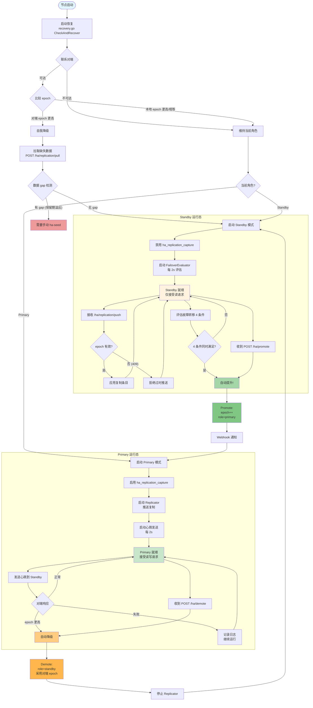

---

## 附录 B: 完整 HA 复制数据流图（含所有路径）

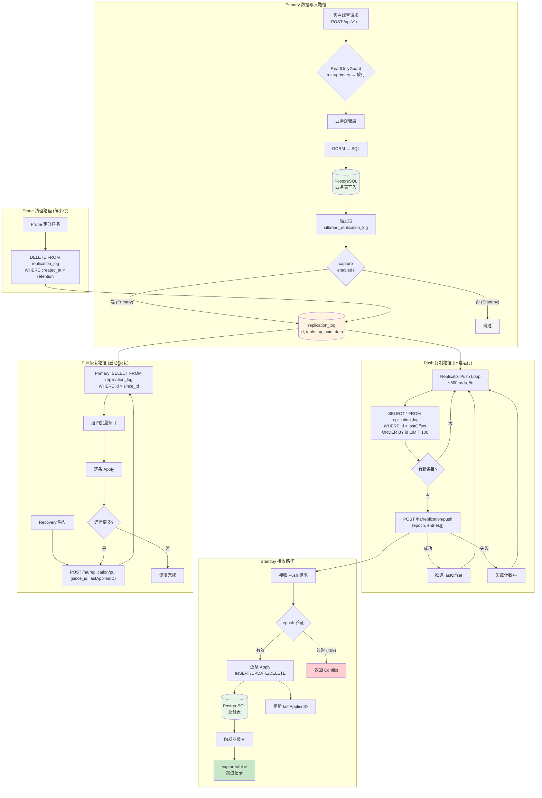

---

> **文档版本:** v1.0 | **最后更新:** 2026-09-17 | **作者:** Claude Code 源码分析
