# 华翔丝路第一版本程序 — 完整源码分析报告

> **分析日期**: 2026-09-17
> **分析范围**: `F:/worktemp/第一版本程序/PC/` 下三个子系统全部 .vb 源码文件
> **方法**: 纯源码逐行解读，不依赖任何文档说明

---

## 目录

1. [技术栈概述](#1-技术栈概述)
2. [系统架构图](#2-系统架构图)
3. [子系统1: Palletizer (码垛机)](#3-子系统1-palletizer-码垛机)
4. [子系统2: TrolleyRobot (小车机器人)](#4-子系统2-trolleyrobot-小车机器人)
5. [子系统3: Sorting (分拣)](#5-子系统3-sorting-分拣)
6. [核心业务流程图](#6-核心业务流程图)
7. [数据流转图](#7-数据流转图)
8. [三个子系统差异对比](#8-三个子系统差异对比)
9. [OPC通信机制详解](#9-opc通信机制详解)
10. [数据库操作模式分析](#10-数据库操作模式分析)
11. [发现的问题和痛点](#11-发现的问题和痛点)

---

## 1. 技术栈概述

| 维度 | 详情 |
|------|------|
| **开发语言** | VB.NET (Visual Basic .NET) |
| **IDE** | Visual Studio Express 2013 for Windows Desktop |
| **目标框架** | .NET Framework 4.0 Client Profile |
| **项目类型** | Windows Forms (WinExe) |
| **平台目标** | x86 (32位) |
| **OPC通信** | OPCAutomation COM 组件 (OPC DA 1.0) + IBH Softec IBHNet 库 |
| **OPC服务器** | IBHSoftec.IBHOPC.DA.1 (IBH Softec S7 OPC Server) |
| **数据库** | Microsoft SQL Server 2012 (通过 ADO.NET SqlClient) |
| **连接方式** | Windows UDL 文件 (OLEDB连接串转SqlConnection) |
| **标签打印** | Zebra ZPL 热敏打印机 (TCP 9100端口 + 串口COM1) |
| **编码选项** | `Option Strict Off` / `Option Explicit On` / `Option Infer On` |
| **命名空间** | `HuaxiangTrolleysLoad` (三个子系统共用) |
| **程序集名** | `Huaxiang TrolleysLoad` (含空格) |
| **代码注释语言** | 意大利语混合英语 (开发者为意大利人) |

### 关键外部依赖

| 依赖 | 说明 |
|------|------|
| `Interop.IBHNETLib.dll` | IBH Softec PLC通信中间件，HintPath为绝对路径 |
| `OPCAutomation` | OPC基金会标准COM组件 (GUID: `{ED6AA78D-...}`) |
| `System.Data.SqlClient` | ADO.NET SQL Server 数据访问 |
| `System.Net.Sockets` | TCP打印机通信 |
| `System.IO.Ports` | 串口打印机通信 |

### 代码量统计

| 子系统 | 非Designer .vb文件行数 | FrmMain.vb行数 | .vb文件数(含Designer) |
|--------|----------------------|----------------|---------------------|
| **Palletizer** (码垛机) | 16,020 | 542 | 57 |
| **Sorting** (分拣) | 8,945 | 3,898 | 34 |
| **TrolleyRobot** (小车机器人) | 14,891 | 576 | 56 |
| **合计** | **39,856** | - | **147** |

---

## 2. 系统架构图

### 2.1 整体物理架构

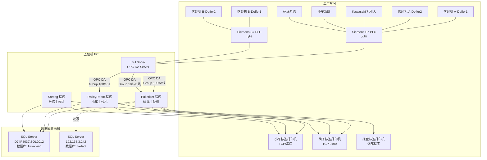

### 2.2 软件模块架构

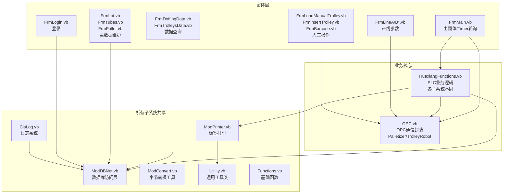

---

## 3. 子系统1: Palletizer (码垛机)

### 3.1 功能定位

码垛机上位机是**纺丝-络筒-码垛产线末端**的控制程序。核心职责：
- 监控A/B两条产线的小车装载状态
- 当PLC发出"小车到达"信号时，从PLC读取产线/络筒机/批号等信息
- 自动生成台车编号、打印台车标签和筒子标签
- 管理托盘出库记录，生成托盘条码
- 向两个数据库服务器（IGH+华翔）**双写**托盘数据
- 每周一自动重置托盘序号计数器

### 3.2 文件清单与职责

| 文件 | 行数 | 职责 |
|------|------|------|
| FrmMain.vb | 542 | 主窗体，OPC初始化，Timer轮询PLC |
| HuaxiangFunctions.vb | 1778 | **核心**：PLC通信业务逻辑、标签打印数据组装 |
| OPC.vb | ~200 | OPC DA通信封装（连接/读/写/断开） |
| Functions.vb | ~50 | 退出程序、字符串补齐、时间戳 |
| ModDBNet.vb | ~130 | 数据库连接和执行封装 |
| ModConvert.vb | ~150 | 字节/字/双字转换（PLC通信辅助） |
| ModPrinter.vb | ~200 | TCP/串口打印机通信+标签模板替换 |
| Utility.vb | ~400 | 安全类型转换、日期格式化 |
| ClsLog.vb | ~100 | 日志类（界面+数据库双重记录） |
| FrmLogin.vb | ~60 | 登录（明文密码） |
| FrmInsertTrolley.vb | 192 | 人工输入台车号和批号（复杂版，含数据库查询） |
| FrmBarcode.vb | ~20 | 手工条码补打 |
| FrmLineADoffer1/2.vb | ~400×2 | A线落纱机1/2参数（OPC读写） |
| FrmLineBDoffer1/2.vb | ~400×2 | B线落纱机1/2参数（OPC读写） |
| FrmLineAPositionDoffer1/2.vb | ~1300×2 | A线落纱机定位坐标参数 |
| FrmLineBPositionDoffer1/2.vb | ~1300×2 | B线落纱机定位坐标参数 |
| FrmLineAWarehouse.vb | ~600 | A线纱库12仓位展示 |
| FrmLineBWarehouse.vb | ~600 | B线纱库12仓位展示 |
| FrmLoadManualTrolley.vb | ~250 | 人工装车-右侧 |
| FrmLoadManualTrolleyLx.vb | ~250 | 人工装车-左侧 |
| FrmSpeedDoffers.vb | ~400 | 落纱机速度参数 |
| FrmLot.vb | ~200 | 批号主数据CRUD |
| FrmTubes.vb | ~150 | 纸管主数据CRUD |
| FrmPallet.vb | ~250 | 托盘信息录入 |
| FrmDoffingData.vb | ~350 | 落纱数据查询统计 |
| FrmTrolleysData.vb | ~300 | 台车历史数据查询+标签补打 |
| FrmInfo.vb | ~5 | 关于信息 |

### 3.3 FrmMain.vb — 主窗体详解

#### 启动流程 (FrmMain_Load)

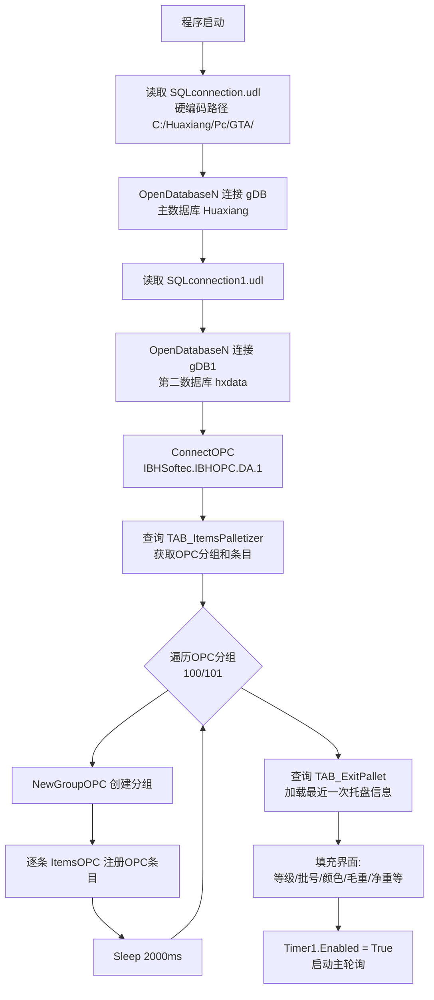

#### Timer1_Tick — PLC轮询主循环

Palletizer的Timer1_Tick与TrolleyRobot不同，处理的是**码垛特有**的业务：

```mermaid
flowchart TD
    START[Timer1_Tick] --> T1_OFF[Timer1.Enabled = False]
    T1_OFF --> READ_COUNT[读取OPC Item 1/2<br/>总筒子数/已下载数]
    READ_COUNT --> DISPLAY[更新界面计数器<br/>LblCounter1/2]

    DISPLAY --> CHECK_LOT_R{右侧小车批号<br/>匹配当前批号?}
    CHECK_LOT_R -->|是| WRITE9[WriteOPC Item9=1<br/>右侧匹配标志]
    CHECK_LOT_R -->|否| WRITE9_0[WriteOPC Item9=0]

    WRITE9 --> CHECK_LOT_L{左侧小车批号<br/>匹配当前批号?}
    WRITE9_0 --> CHECK_LOT_L
    CHECK_LOT_L -->|是| WRITE10[WriteOPC Item10=1]
    CHECK_LOT_L -->|否| WRITE10_0[WriteOPC Item10=0]

    WRITE10 --> CHECK_STATUS_R[读取 Item7<br/>右侧小车状态]
    WRITE10_0 --> CHECK_STATUS_R
    CHECK_STATUS_R -->|状态=0| CLEAR_R[清空右侧批号显示]
    CHECK_STATUS_R --> CHECK_STATUS_L[读取 Item8<br/>左侧小车状态]
    CLEAR_R --> CHECK_STATUS_L
    CHECK_STATUS_L -->|状态=0| CLEAR_L[清空左侧批号显示]

    CHECK_STATUS_L --> CHECK_BC{Item3或4=1<br/>且当前有批号?}
    CLEAR_L --> CHECK_BC
    CHECK_BC -->|是| SHOW_INSERT[弹出FrmInsertTrolley<br/>人工输入台车号]
    CHECK_BC -->|否| CHECK_BC_0{Item3和4都=0?}
    CHECK_BC_0 -->|是| DISPOSE_INSERT[关闭FrmInsertTrolley]

    SHOW_INSERT --> CHECK_PALLET
    DISPOSE_INSERT --> CHECK_PALLET
    CHECK_BC_0 --> CHECK_PALLET

    CHECK_PALLET[读取 Item11/12<br/>托盘完成握手] --> PALLET_CALL{"Item11 &gt; 0<br/>且 Item12 = 0?"}
    PALLET_CALL -->|是| PALLET_END[ComunicationWithPLC_PalletEnd<br/>托盘出库处理]
    PALLET_CALL -->|否| PALLET_RESET{"Item11 = 0<br/>且 Item12 &gt; 0?"}
    PALLET_RESET -->|是| PALLET_CLEAR[WriteOPC Item12=0<br/>复位应答]

    PALLET_END --> CHECK_PRINT
    PALLET_CLEAR --> CHECK_PRINT
    PALLET_RESET --> CHECK_PRINT

    CHECK_PRINT[读取 Item13/14<br/>打印标签握手] --> PRINT_CALL{"Item13 &gt; 0<br/>且 Item14 = 0?"}
    PRINT_CALL -->|是| PALLET_PRINT[ComunicationWithPLC_PalletPrint<br/>托盘标签打印]
    PRINT_CALL -->|否| PRINT_RESET{"Item13 = 0<br/>且 Item14 &gt; 0?"}
    PRINT_RESET -->|是| PRINT_CLEAR[WriteOPC Item14=0]

    PALLET_PRINT --> T1_ON
    PRINT_CLEAR --> T1_ON
    PRINT_RESET --> T1_ON

    T1_ON[Timer1.Enabled = True]
```

### 3.4 HuaxiangFunctions.vb — Palletizer 核心业务

#### 3.4.1 全局变量

```vb
Public gDBString As String = ""      ' 主数据库连接串（IGH服务器）
Public gDB As SqlConnection          ' 主数据库连接
Public gDBString1 As String = ""     ' 第二数据库连接串（华翔服务器）← Palletizer独有
Public gDB1 As SqlConnection         ' 第二数据库连接 ← Palletizer独有
Public gLoginOk As Boolean = False
Public gLevelPassword As Integer = 0
Public gLevelUser As String = ""
Public gErrPrecedente As String = "" ' 错误去重
Public gCounterTimer1/2/3 As Integer = 0  ' 未使用的死变量
Public gTrolleyID/gTrolleyNo As Long = 0  ' 未使用的死变量
```

#### 3.4.2 ComunicationWithPLC_BobbinOnTrolleyA/B (小车装载完成)

这是Palletizer **最核心**的业务函数，当PLC通知"A/B线小车装满"时执行：

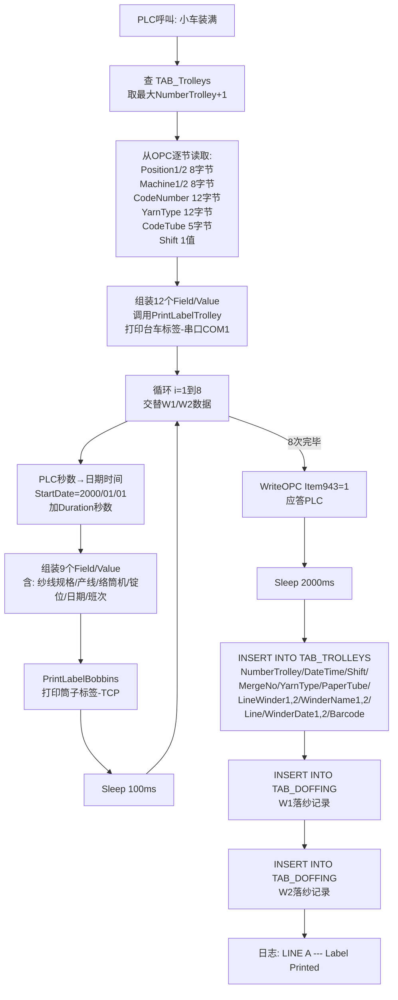

**关键发现**：Palletizer的TAB_TROLLEYS字段集与TrolleyRobot的不同！

| 字段 | Palletizer | TrolleyRobot |
|------|-----------|--------------|
| NumberTrolley | ✅ 自增(max+1) | ✅ PLC写入 |
| Barcode | = CodeNumber | = 自增(max+1), 9位补零 |
| MergeNo/LotNo | MergeNo=CodeNumber | LotNo=OPC读取 |
| ID_DoffingRow1/2/3 | ❌ 无 | ✅ 有 |
| LineWinder1/2 | ✅ 有 | ❌ 无 |
| WinderName1/2 | ✅ 有 | ❌ 无 |
| WinderDate1/2 | ✅ 有 | ❌ 无 |
| Line | ✅ "A"/"B" | ❌ 无 |
| Autodoffing | ❌ 无 | ✅ 有 |
| OperatorCode | ❌ 无 | ✅ 有 |

#### 3.4.3 ComunicationWithPLC_PalletEnd (托盘出库)

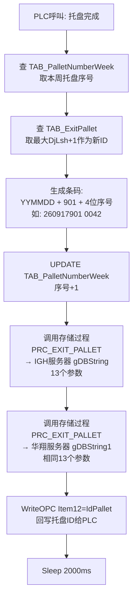

**存储过程 PRC_EXIT_PALLET 参数**:
- `@DjLsh` (Int) — 托盘流水号
- `@TM` (NVarChar 20) — 条码
- `@DJ` (NVarChar 10) — 等级
- `@JZ` (Decimal) — 净重
- `@MZ` (Decimal) — 毛重
- `@GS` (NVarChar 10) — 颜色（纸管颜色）
- `@BB` (NVarChar 10) — 班别
- `@BC` (NVarChar 10) — 班次
- `@RQ` (Date) — 日期（16点后算次日）
- `@BZPH` (NVarChar 20) — 批号
- `@GH` (NVarChar 10) — 工号
- `@XTSJ` (DateTime) — 系统时间
- `@ERPYY` (NVarChar 2) — 固定"N"（ERP原因？未使用）

#### 3.4.4 ComunicationWithPLC_PalletPrint (托盘标签打印)

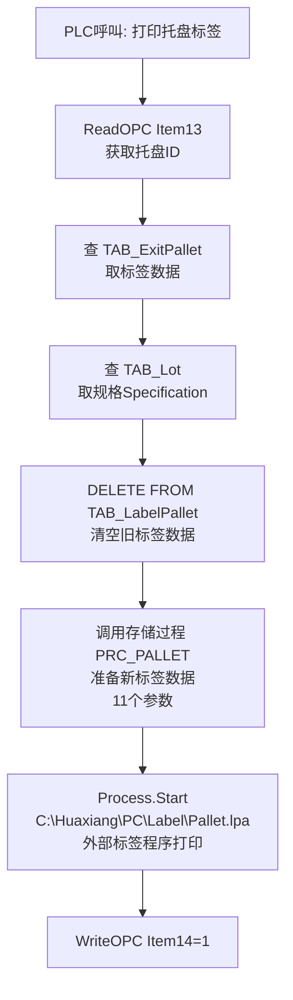

**注意**: 托盘标签使用 `.lpa` 文件（NiceLabel设计文件），通过 `Process.Start` 启动外部程序打印，与筒子/台车标签使用的 ZPL+TCP/串口方式完全不同。

#### 3.4.5 PalletOfWeek (周计数器重置)

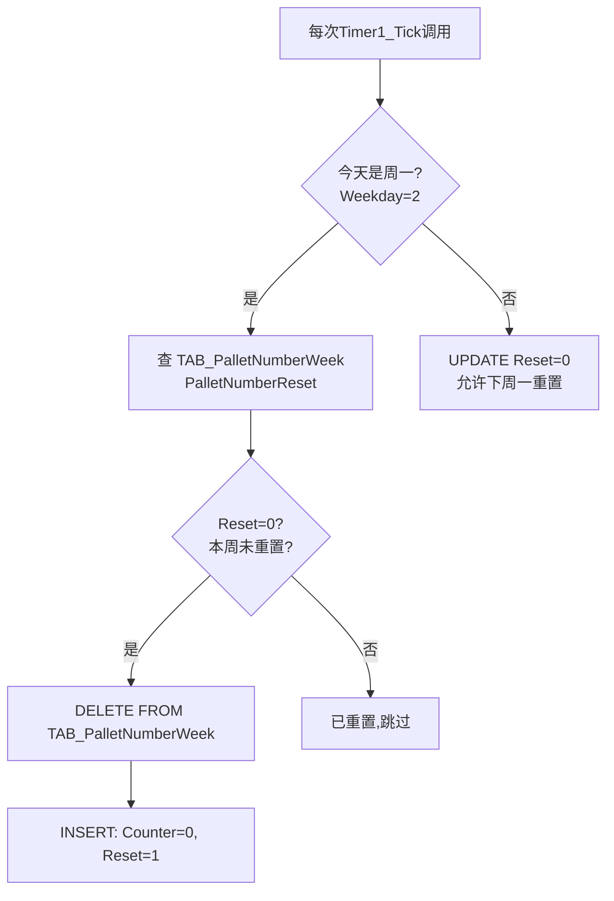

### 3.5 FrmInsertTrolley.vb — Palletizer版（复杂版）

Palletizer的台车录入窗体与TrolleyRobot的截然不同：

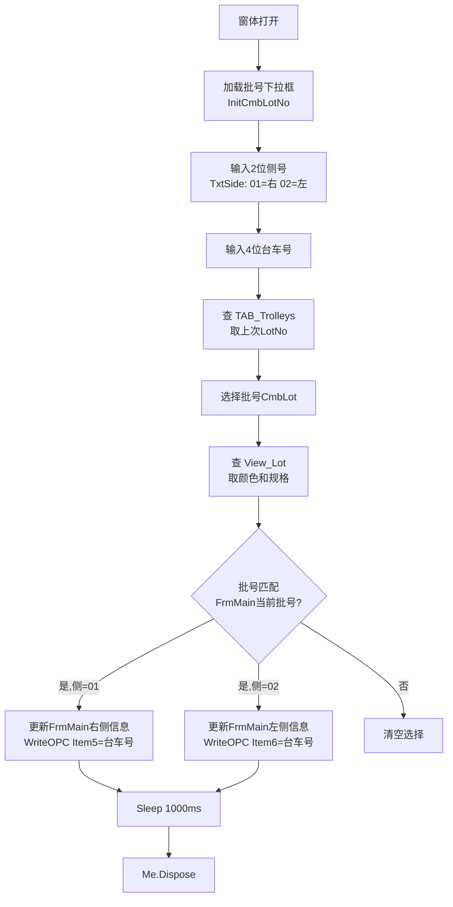

---

## 4. 子系统2: TrolleyRobot (小车机器人)

### 4.1 功能定位

小车机器人上位机管理**落纱→装车→标签打印**的自动化流程。核心职责：
- 监控A/B两条产线的落纱机(Doffer)状态
- 落纱时自动记录落纱数据（批号/规格/产线/络筒机）
- 小车装满时自动生成台车记录和打印标签
- 支持Kawasaki机器人和人工装车两种模式
- 管理落纱机的定位坐标、速度参数（高权限操作）
- 展示纱库12仓位实时状态

### 4.2 FrmMain.vb — Timer1_Tick 轮询逻辑

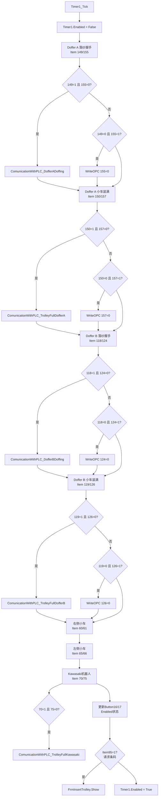

### 4.3 HuaxiangFunctions.vb — TrolleyRobot 核心业务

#### 4.3.1 ComunicationWithPLC_DofferADoffing (落纱记录)

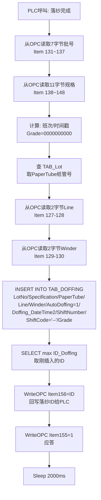

#### 4.3.2 ComunicationWithPLC_TrolleyFullDofferA (Doffer小车装满)

```mermaid
flowchart TD
    START["PLC呼叫: 小车装满"] --> READ["从OPC读取:<br/>小车编号/ID1/ID2/ID3"]
    READ --> ANSWER_FIRST[WriteOPC Item157=1<br/>先应答再处理!]
    ANSWER_FIRST --> QUERY_DOFF[用ID1查TAB_Doffing<br/>取LotNo]
    QUERY_DOFF --> QUERY_LOT[查TAB_Lot<br/>取PaperTube/Specification]
    QUERY_LOT --> GEN_BC[查TAB_Trolleys max(ID_Trolley)+1<br/>生成9位条码]
    GEN_BC --> INSERT[INSERT INTO TAB_TROLLEYS<br/>Barcode/NumberTrolley/LotNo/<br/>Specification/PaperTube/<br/>Autodoffing/ID_DoffingRow1,2,3/<br/>Trolley_DateTime2/ShiftNumber/<br/>OperatorCode]
    INSERT --> GET_ID[取最新ID_Trolley]
    GET_ID --> PRINT[DataForBobbinsLabelDoffer<br/>组装并打印6批×5联标签]
    PRINT --> SLEEP[Sleep 2000ms]
```

### 4.4 产线参数窗体体系

TrolleyRobot（和Palletizer）共有的产线参数管理窗体分为三个层次：

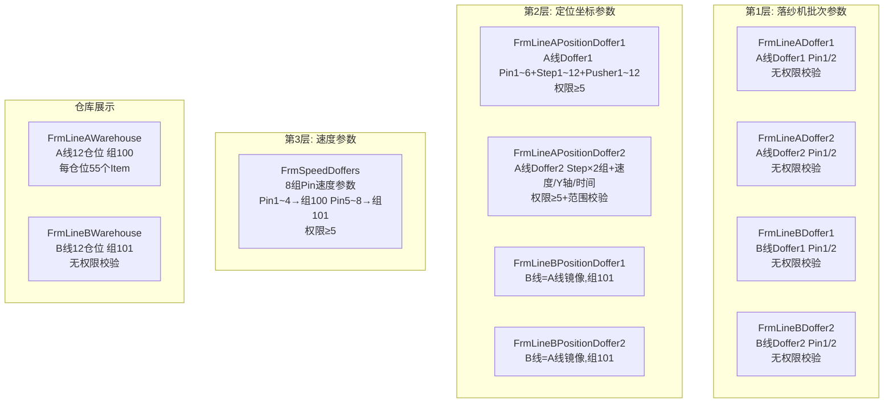

**OPC Item编号分布规律**（每个落纱机两个Pin，Pin间偏移110）：

| 数据类型 | Doffer1起始 | Doffer2起始 | 字节数 |
|---------|-----------|-----------|--------|
| Pin编号 | 690 | 800 | 1 (Int) |
| 工位Position | 661 | 771 | 8 (ASCII) |
| 纱线Yarn | 677 | 787 | 12 (ASCII) |
| 线别Line | 696 | 806 | 8 (ASCII) |
| 代码Code | 704 | 814 | 12 (ASCII) |

### 4.5 FrmInsertTrolley.vb — TrolleyRobot版（简单版）

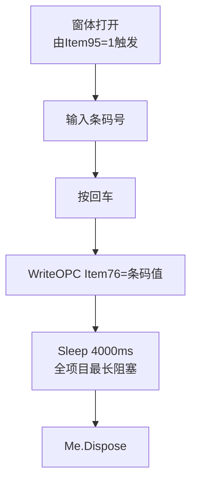

---

## 5. 子系统3: Sorting (分拣)

### 5.1 功能定位

分拣上位机是**纯人工质检工位**的操作程序。核心职责：
- 操作员输入台车号，系统自动关联该台车的3行落纱记录
- 对台车上30只筒子(3排×10只)逐一进行等级评定（AA/A1/A/B/C）
- 标记每只筒子的缺陷代码（20种缺陷）
- 将分拣结果写入数据库
- **没有PLC通信**（无OPC.vb），是唯一的纯软件子系统

### 5.2 独有文件清单

Sorting**没有**的文件（与Palletizer/TrolleyRobot对比）：
- ❌ OPC.vb — 无PLC通信
- ❌ FrmLineADoffer1/2.vb — 无产线参数
- ❌ FrmLineBDoffer1/2.vb
- ❌ FrmLineAPositionDoffer1/2.vb
- ❌ FrmLineBPositionDoffer1/2.vb
- ❌ FrmLineAWarehouse.vb / FrmLineBWarehouse.vb
- ❌ FrmLoadManualTrolley.vb / FrmLoadManualTrolleyLx.vb
- ❌ FrmSpeedDoffers.vb

### 5.3 FrmMain.vb — 分拣主窗体（3898行，三个子系统中最大）

#### 核心业务流程

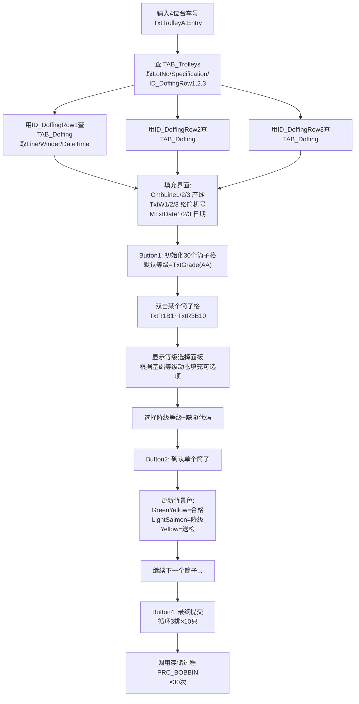

#### 等级降级链

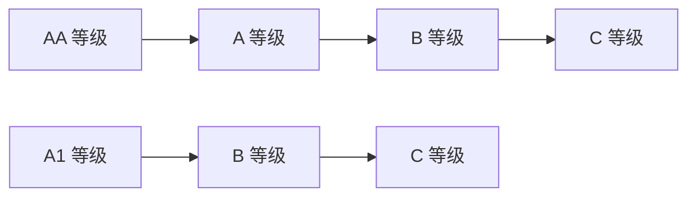

- 基础等级为 AA → 可降为 A/B/C
- 基础等级为 A1 → 可降为 B/C
- 基础等级为 A → 可降为 B/C
- 基础等级为 B → 可降为 C
- 基础等级为 C → 只能选 C

### 5.4 FrmMain.vb 代码结构问题

FrmMain.vb 有 **3898行** 代码，其中约 **2500行**（65%）是30组重复的双击事件+确认赋值代码。

每个筒子格（如 `TxtR1B1`）对应：
1. `TxtR1B1_MouseDoubleClick` — ~35行，弹出评级面板
2. `Button2_Click` 中 `If gBobNumber = 1 Then ... End If` — ~25行，确认评级

总共30个筒子 × (35+25) = **1800行** 纯复制粘贴代码，逻辑完全一致，仅索引（1~30）不同。

**应重构为**: 一个参数化方法 `HandleBobbin(index As Integer)`。

### 5.5 存储过程 PRC_BOBBIN 参数

| 参数 | 类型 | 来源 |
|------|------|------|
| Line | NVarChar | CmbLine1/2/3 |
| Winder | NVarChar | TxtW1/2/3 |
| BobbinNumber | Int | 锭位号 |
| Lot | NVarChar | TxtLot |
| Spec | NVarChar | TxtSpec |
| Grade | NVarChar | 评定等级(AA/A/B/C) |
| Defect | Int | 缺陷代码(0~20) |
| TrolleyNumber | Int | 台车号 |
| IdDoffing | Int | 落纱ID |
| DateSorting | DateTime | 当前时间 |
| DateSorting2 | NVarChar | yyyyMMddHHmm格式 |

### 5.6 FrmDoffingData.vb — 统计报表

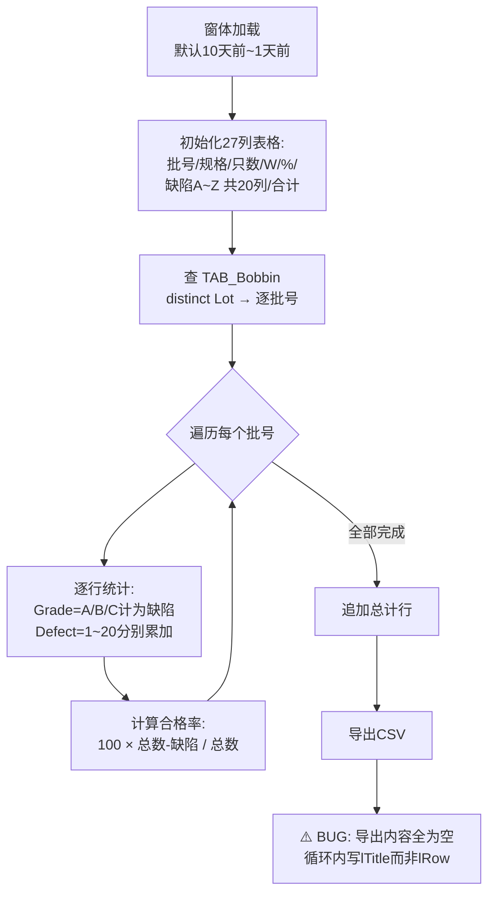

### 5.7 HuaxiangFunctions.vb — Sorting版

与其他子系统的关键差异：
- `DateAndTimeToPlc()` 中所有 `WriteItemsOPC` 调用**被注释掉**
- 没有 `ComunicationWithPLC_*` 系列函数（所有PLC通信代码被删除）
- `gDBString1`/`gDB1` 声明了但未使用（无双写需求）
- `gCounterTimer1/2/3` 声明了但未使用
- `DataForBobbinsLabel()` 保留了标签打印功能

### 5.8 Timer1/Timer2 行为

- **Timer1**: Sorting的Timer1是**空转**的 — 只做 `Enabled=False` → `Enabled=True`，无实际业务逻辑。推测是从有PLC通信的版本复制过来后清空了业务代码，但保留了Timer本身。
- **Timer2**: 登录超时自动登出，与其他子系统行为一致。

---

## 6. 核心业务流程图

### 6.1 纺丝→码垛全链路流程

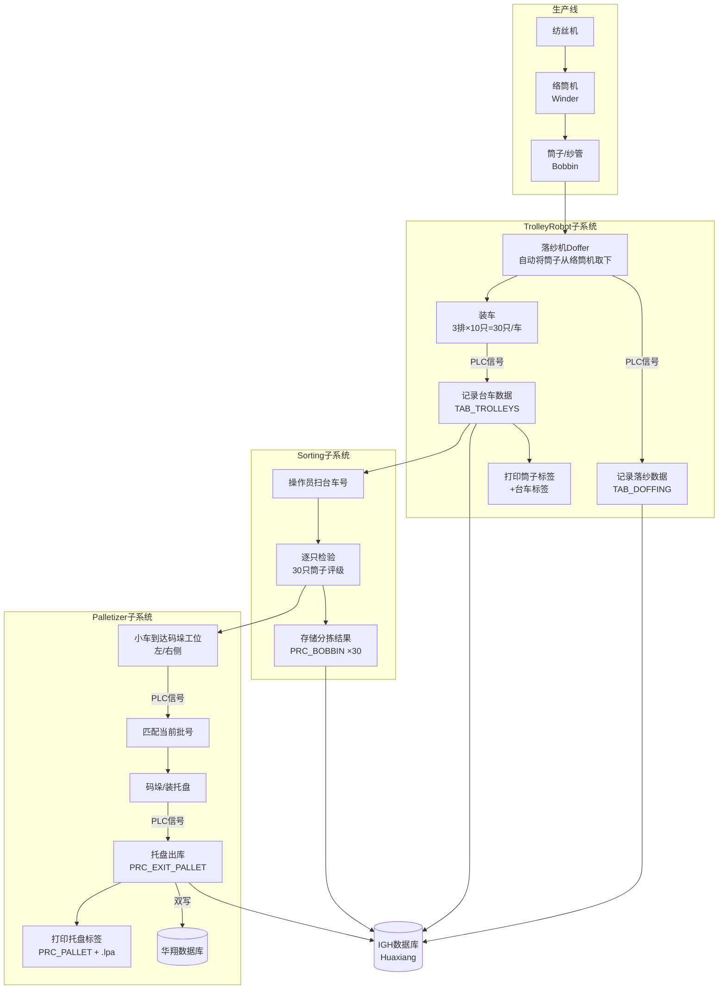

### 6.2 PLC-PC握手协议通用流程

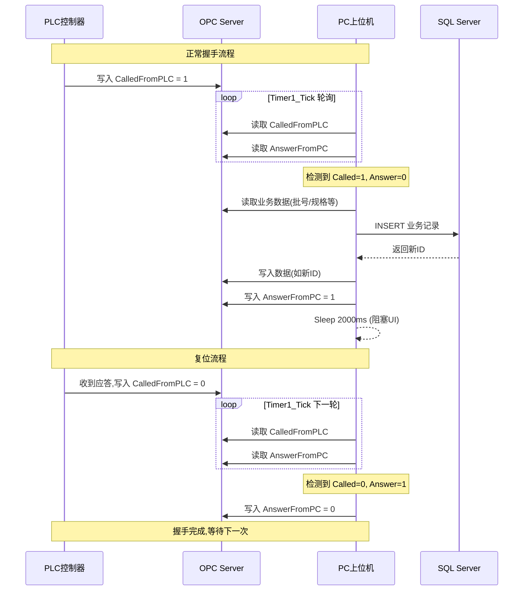

---

## 7. 数据流转图

### 7.1 数据库表关系

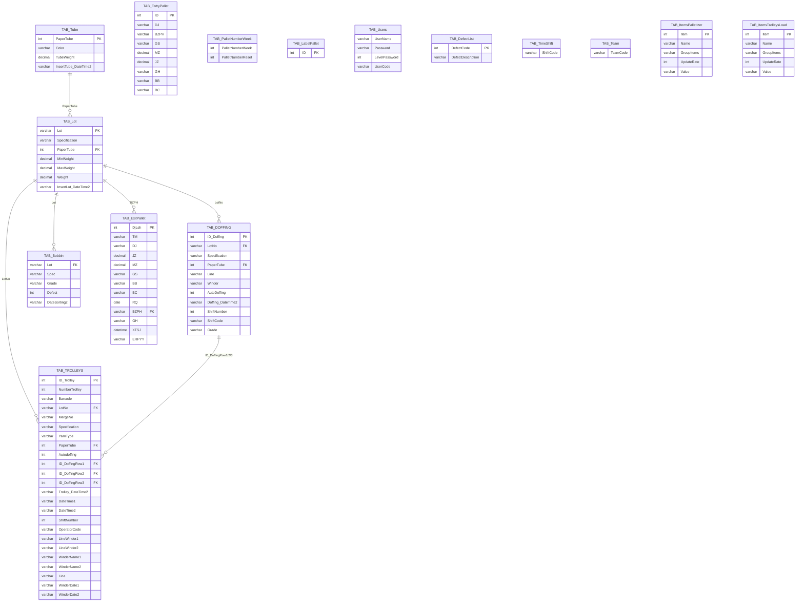

### 7.2 子系统间数据流

```mermaid
flowchart LR
    subgraph TrolleyRobot
        TR_WRITE_D[写入 TAB_DOFFING]
        TR_WRITE_T[写入 TAB_TROLLEYS]
    end

    subgraph Sorting
        S_READ_T[读取 TAB_TROLLEYS]
        S_READ_D[读取 TAB_DOFFING]
        S_WRITE_B[写入 TAB_Bobbin<br/>via PRC_BOBBIN]
    end

    subgraph Palletizer
        P_READ_EP[读取 TAB_ExitPallet<br/>TAB_EntryPallet]
        P_WRITE_EP[写入 TAB_ExitPallet<br/>via PRC_EXIT_PALLET]
        P_WRITE_T[写入 TAB_TROLLEYS]
        P_WRITE_D[写入 TAB_DOFFING]
    end

    TR_WRITE_D -->|ID_DoffingRow| S_READ_D
    TR_WRITE_T -->|台车号| S_READ_T
    S_WRITE_B -.->|质检完成后| P_READ_EP
    P_WRITE_EP -->|双写| DB_HX[(华翔数据库)]
```

### 7.3 打印系统数据流

```mermaid
flowchart TB
    subgraph 数据源
        DB[(数据库)] --> QUERY[查询业务数据]
        OPC_DATA[OPC实时数据] --> QUERY
    end

    subgraph 标签组装
        QUERY --> FIELD["25组 FieldString/ValueString<br/>占位符: %1~%R"]
    end

    subgraph 模板文件
        TPL_T[BarcodeTrolley.txt<br/>台车条码模板]
        TPL_B[BobbinsLabel.txt<br/>筒子标签模板]
        TPL_BD[BobbinsLabelDoffer.txt<br/>Doffer筒子标签]
        TPL_P[Pallet.lpa<br/>托盘标签NiceLabel]
        TPL_PR[Trolley.prn<br/>台车标签]
    end

    subgraph 输出
        FIELD --> REPLACE["逐行Replace<br/>%1→Value1<br/>%2→Value2<br/>..."]
        TPL_T --> REPLACE
        TPL_B --> REPLACE
        TPL_BD --> REPLACE
        REPLACE --> TCP_SEND[TCP_Send<br/>端口9100]

        TPL_PR --> SERIAL[串口COM1<br/>9600bps]

        TPL_P --> PROCESS[Process.Start<br/>外部程序打印]
    end

    subgraph 打印机
        TCP_SEND --> P1[筒子打印机<br/>192.168.3.173/228]
        TCP_SEND --> P2[Doffer筒子打印机<br/>192.168.3.174/232]
        TCP_SEND --> P3[台车打印机<br/>192.168.3.172/227]
        SERIAL --> P4[台车串口打印机<br/>COM1]
        PROCESS --> P5[托盘标签打印机<br/>NiceLabel驱动]
    end
```

---

## 8. 三个子系统差异对比

### 8.1 功能矩阵

| 功能 | Palletizer | TrolleyRobot | Sorting |
|------|:----------:|:------------:|:-------:|
| OPC通信 | ✅ OPC.vb | ✅ OPC.vb | ❌ 无 |
| PLC数据表 | TAB_ItemsPalletizer | TAB_ItemsTrolleysLoad | - |
| Timer1业务 | 托盘+批号匹配 | 落纱+装车6组握手 | 空转 |
| 双数据库 | ✅ gDB + gDB1 | ❌ 仅gDB | ❌ 仅gDB |
| 落纱记录写入 | ✅ BobbinOnTrolleyA/B | ✅ DofferADoffing/B | ❌ 只读 |
| 台车记录写入 | ✅ BobbinOnTrolleyA/B | ✅ TrolleyFullDoffer/Kawasaki | ❌ 只读 |
| 托盘管理 | ✅ PalletEnd/PalletPrint | ❌ | ❌ |
| 质检评级 | ❌ | ❌ | ✅ 30只筒子 |
| 产线参数编辑 | ✅ 8个窗体 | ✅ 8个窗体 | ❌ |
| 仓库展示 | ✅ A/B各1个 | ✅ A/B各1个 | ❌ |
| 人工装车 | ✅ 右/左 | ✅ 右/左 | ❌ |
| 托盘标签 | ✅ .lpa外部打印 | ❌ | ❌ |
| 筒子标签 | ✅ ZPL TCP | ✅ ZPL TCP | ✅ ZPL TCP |
| 台车标签 | ✅ 串口COM1 | ✅ 串口COM1 | ✅ 串口COM1 |
| 周计数器重置 | ✅ PalletOfWeek | ❌ | ❌ |
| 退出确认语言 | 中文"确认退出？" | 英文"ARE YOU SURE TO QUIT?" | 中文"确认退出？" |
| DisconnectOPC | ✅ | ✅ | ❌ (无OPC) |
| FrmPallet窗体 | ✅ | ❌ | ✅ |

### 8.2 共享文件差异总结

| 文件 | 三者是否相同 | 差异说明 |
|------|:----------:|---------|
| ModDBNet.vb | ✅ 完全相同 | 数据库访问层通用 |
| ModConvert.vb | ✅ 完全相同 | 字节转换通用（Sorting中未使用） |
| Utility.vb | ✅ 完全相同 | 工具类通用 |
| ClsLog.vb | ✅ 完全相同 | 日志类通用 |
| Functions.vb | ⚠️ 微小差异 | Palletizer有DisconnectOPC; TrolleyRobot退出提示为英文 |
| ModPrinter.vb | ⚠️ 微小差异 | TrolleyRobot引用BobbinsLabelDoffer.txt |
| HuaxiangFunctions.vb | ❌ 显著不同 | 各子系统核心业务完全不同 |
| OPC.vb | ⚠️ 微小差异 | 表名不同: TAB_ItemsPalletizer vs TAB_ItemsTrolleysLoad |
| FrmMain.vb | ❌ 显著不同 | Timer1逻辑完全不同 |
| FrmInsertTrolley.vb | ❌ 显著不同 | Palletizer版192行含DB查询; TrolleyRobot版23行仅OPC写入; Sorting版含批号选择+OPC写入 |

### 8.3 OPC Item编号使用对比

| 业务 | Palletizer Items | TrolleyRobot Items |
|------|-----------------|-------------------|
| 总筒子数/已下载 | 1, 2 | - |
| 条码请求(右/左) | 3, 4 | - |
| 台车号写入(右/左) | 5, 6 | - |
| 右侧小车状态 | 7 | - |
| 左侧小车状态 | 8 | - |
| 批号匹配(右/左) | 9, 10 | - |
| 托盘完成 | 11(呼叫)/12(应答) | - |
| 标签打印 | 13(呼叫)/14(应答) | - |
| 小车右侧握手 | - | 60(呼叫)/61(应答) |
| 小车左侧握手 | - | 65(呼叫)/66(应答) |
| 人工装车ID写回 | - | 62/63/64(右) 67/68/69(左) |
| Kawasaki装满 | - | 70(呼叫)/75(应答) |
| 条码请求 | - | 95 |
| 条码写回 | - | 76 |
| DofferB落纱 | - | 118(呼叫)/124(应答) |
| DofferB装满 | - | 119(呼叫)/126(应答) |
| DofferB落纱ID回写 | - | 125 |
| DofferA落纱 | - | 149(呼叫)/155(应答) |
| DofferA装满 | - | 150(呼叫)/157(应答) |
| DofferA落纱ID回写 | - | 156 |
| 小车装满(A线) | 882~947 | - |
| 落纱批号(A) | - | 127~148 |
| 落纱批号(B) | - | 96~117 |
| Doffer参数 | 661~815 | 661~815 |
| Position参数 | 952~1104 | 952~1104 |
| Speed参数 | 1078~1089 | 1078~1089 |
| Warehouse | 1~660 | 1~660 |

### 8.4 打印机配置对比

| 打印机 | Palletizer IP | TrolleyRobot IP | Sorting IP |
|--------|-------------|-----------------|-----------|
| 台车打印机 | 192.168.3.172 | 192.168.3.227 | 192.168.3.172 |
| 筒子打印机 | 192.168.3.173 | 192.168.3.228 | 192.168.3.173 |
| Doffer筒子打印机 | 192.168.3.174 | 192.168.3.232 | 192.168.3.174 |
| 端口 | 9100 | 9100 | 9100 |

---

## 9. OPC通信机制详解

### 9.1 OPC架构

```mermaid
graph TB
    subgraph OPC客户端 [PC上位机进程]
        SERVER[OPCAutomation.OPCServer<br/>lPlc]
        GROUP100[OPCGroup 100<br/>A线 / 主数据]
        GROUP101[OPCGroup 101<br/>B线]
        ITEMS100[OPCItem 1~N<br/>逐条注册]
        ITEMS101[OPCItem 1~N<br/>逐条注册]

        SERVER --> GROUP100
        SERVER --> GROUP101
        GROUP100 --> ITEMS100
        GROUP101 --> ITEMS101
    end

    subgraph OPC服务器
        IBH[IBHSoftec.IBHOPC.DA.1<br/>IBH Softec OPC DA Server]
    end

    subgraph PLC
        S7_A[Siemens S7 PLC A线<br/>数据块DB]
        S7_B[Siemens S7 PLC B线<br/>数据块DB]
    end

    SERVER ---|COM/DCOM| IBH
    IBH ---|MPI/Profinet| S7_A
    IBH ---|MPI/Profinet| S7_B
```

### 9.2 OPC Item注册流程

```mermaid
sequenceDiagram
    participant Main as FrmMain_Load
    participant DB as TAB_ItemsPalletizer
    participant OPC as OPC.vb

    Main->>DB: SELECT DISTINCT GroupItems, UpdateRate
    DB-->>Main: 分组100 UpdateRate 1000, 分组101 UpdateRate 1000

    loop 对每个Group
        Main->>OPC: NewGroupOPC(100, 1000)
        Note over OPC: UpdateRate硬编码=1000ms，忽略数据库配置值
        OPC-->>Main: Group创建成功

        Main->>DB: SELECT * WHERE GroupItems=100
        DB-->>Main: Item=1,Name=..., Item=2,...

        loop 对每个Item
            Main->>OPC: ItemsOPC(Name, ItemNumber, 100)
            Note over OPC: ItemNumber = 数据库行序号 = 后续ReadItems/WriteItems的编号
        end

        Main->>Main: Thread.Sleep(2000)
    end
```

### 9.3 ReadItemsOPC 详细流程

```mermaid
flowchart TD
    START[ReadItemsOPC<br/>NumberItem, GroupName] --> GET_ITEM[取出OPCItem<br/>by ClientHandle]
    GET_ITEM --> ACTIVATE[.IsActive = True]
    ACTIVATE --> READ1[.Read 1<br/>Cache读取]
    READ1 --> CHECK_Q{Quality = 192?<br/>GOOD}
    CHECK_Q -->|是| SUCCESS[返回 .Value.ToString]
    CHECK_Q -->|否| RETRY[重试计数 +1]
    RETRY --> CHECK_RETRY{"重试 &lt; 6次?"}
    CHECK_RETRY -->|是| READ2[.Read 2<br/>Device读取]
    READ2 --> SLEEP100[Sleep 100ms]
    SLEEP100 --> CHECK_Q2{Quality = 192?}
    CHECK_Q2 -->|否| RETRY
    CHECK_Q2 -->|是| SUCCESS
    CHECK_RETRY -->|否| ERROR[返回 'Error'<br/>记录日志级别3]

    SUCCESS --> UPDATE_DB[UPDATE TAB_Items*<br/>SET Value = 结果<br/>每次读取都写数据库!]
    ERROR --> UPDATE_DB
    UPDATE_DB --> RETURN[返回结果]
```

**严重性能问题**: 每次 `ReadItemsOPC` 都执行一次 `UPDATE` 数据库操作。Warehouse窗体一次刷新需要读取 ~330 个 Item，意味着一次界面刷新就触发 330 次数据库写入。

### 9.4 A/B线双线设计模式

```mermaid
graph LR
    subgraph OPC Group 100 - A线
        A_D1[Doffer1 Items<br/>661~715]
        A_D2[Doffer2 Items<br/>771~815]
        A_WH[Warehouse Items<br/>1~660]
        A_POS[Position Items<br/>952~1104]
        A_SPD[Speed Items<br/>1078~1089]
    end

    subgraph OPC Group 101 - B线
        B_D1[Doffer1 Items<br/>661~715<br/>相同编号!]
        B_D2[Doffer2 Items<br/>771~815]
        B_WH[Warehouse Items<br/>1~660]
        B_POS[Position Items<br/>952~1104]
        B_SPD[Speed Items<br/>1078~1089]
    end

    A_D1 ---|Item编号完全相同| B_D1
    A_D2 ---|靠GroupName区分| B_D2
```

---

## 10. 数据库操作模式分析

### 10.1 连接管理

```mermaid
graph TB
    subgraph 读操作
        READ[OpenRecordsetN] --> USE_GDB[复用全局 gDB<br/>长连接不关闭]
        USE_GDB --> READER[返回SqlDataReader]
        READER --> CALLER[调用者负责Close]
    end

    subgraph 写操作
        WRITE[ExecSqlN] --> NEW_CONN[每次新建SqlConnection]
        NEW_CONN --> EXEC[ExecuteNonQuery]
        EXEC --> CLOSE[Finally关闭连接]
    end

    subgraph 存储过程
        SP[SqlCommand直接调用] --> NEW_CONN2[手动新建连接]
        NEW_CONN2 --> EXEC2[ExecuteNonQuery]
        EXEC2 --> CLOSE2[手动关闭]
    end
```

**问题**: 读写连接策略不一致。长连接 `gDB` 无重连机制，长期运行可能假死。

### 10.2 SQL构造方式

| 方式 | 使用场景 | 安全性 |
|------|---------|--------|
| 字符串拼接 | SELECT / INSERT / UPDATE / DELETE | ❌ SQL注入风险 |
| 存储过程+参数化 | PRC_EXIT_PALLET / PRC_PALLET | ✅ 安全 |
| 存储过程+参数化 | PRC_BOBBIN / PRC_INS_COLOR | ✅ 安全 |
| 存储过程+参数化 | PRC_INS_TABLOGOPERATION_01 | ✅ 安全 |

**注意**: `Utility.Ap()` 函数提供了SQL转义功能，但**全项目无任何调用**。

### 10.3 ID生成策略

```mermaid
flowchart LR
    NEED[需要新ID] --> QUERY[SELECT * ORDER BY ID DESC]
    QUERY --> READ[读取第一条的ID]
    READ --> CALC[新ID = 旧ID + 1]
    CALC --> INSERT[INSERT新记录]

    QUERY2[SELECT MAX ID] --> CALC

    style NEED fill:#ffcccc
    style CALC fill:#ffcccc
```

**全项目统一使用"取最大值+1"的方式生成流水号**，而非 `SCOPE_IDENTITY()` 或 `@@IDENTITY`。在并发场景下存在竞态条件风险（虽然工控场景并发度极低）。

### 10.4 涉及的存储过程汇总

| 存储过程 | 调用子系统 | 功能 |
|---------|-----------|------|
| `PRC_EXIT_PALLET` | Palletizer | 托盘出库记录（双写） |
| `PRC_PALLET` | Palletizer | 准备托盘标签数据 |
| `PRC_BOBBIN` | Sorting | 写入单只筒子分拣结果 |
| `PRC_INS_COLOR` | Sorting/TrolleyRobot | 插入纸管颜色 |
| `PRC_INS_PALLET` | Sorting | 插入托盘录入记录 |
| `PRC_INS_TABLOGOPERATION_01` | 全部 | 日志写入 |

### 10.5 UDL连接配置

| 文件 | Provider | Database | Server | User | Password |
|------|----------|----------|--------|------|----------|
| Palletizer SQLconnection.udl | SQLOLEDB.1 | Huaxiang | D74P8032\SQL2012 | Huaxiang | Marotta1977 |
| Palletizer SQLconnection1.udl | SQLOLEDB.1 | hxdata | 192.168.3.242 | A1 | Huaxiang123 |
| Sorting SQLconnection.udl | SQLOLEDB.1 | Huaxiang | D74P8032\SQL2012 | Huaxiang | Marotta1977 |
| TrolleyRobot SQLconnection.udl | SQLOLEDB.1 | Huaxiang | D74P8032 | Huaxiang | Marotta1977 |

---

## 11. 发现的问题和痛点

### 11.1 架构级问题

| # | 问题 | 严重度 | 说明 |
|---|------|--------|------|
| A1 | **三个子系统是独立项目，大量复制粘贴代码** | 🔴 高 | ModDBNet/ModConvert/Utility/ClsLog/ModPrinter完全相同，应抽取为共享类库 |
| A2 | **UI线程阻塞式PLC通信** | 🔴 高 | Timer1_Tick中调用Sleep(2000)阻塞主线程，导致界面假死 |
| A3 | **OPC读取每次写数据库** | 🔴 高 | ReadItemsOPC每次调用都UPDATE数据库，严重影响性能 |
| A4 | **无重连机制** | 🟡 中 | gDB长连接无心跳检测和自动重连 |
| A5 | **Option Strict Off** | 🟡 中 | 允许隐式类型转换，掩盖编译期可发现的类型错误 |

### 11.2 安全问题

| # | 问题 | 严重度 | 说明 |
|---|------|--------|------|
| S1 | **密码明文存储和比对** | 🔴 高 | FrmLogin.vb直接SELECT比对Password字段 |
| S2 | **SQL注入风险** | 🟡 中 | 大部分SELECT/INSERT使用字符串拼接，Utility.Ap()未被调用 |
| S3 | **权限校验不一致** | 🟡 中 | PositionDoffer/SpeedDoffers要求权限≥5，Doffer/Warehouse无校验 |
| S4 | **数据库凭证硬编码在UDL文件中** | 🟡 中 | 密码直接写在可读的UDL文件里 |

### 11.3 代码质量问题

| # | 问题 | 严重度 | 说明 |
|---|------|--------|------|
| C1 | **Sorting FrmMain.vb 30组重复代码** | 🔴 高 | ~2500行（65%）纯复制粘贴，仅索引不同 |
| C2 | **A/B线窗体完全复制** | 🟡 中 | 8对窗体仅OPC组名不同，应参数化 |
| C3 | **日期格式化函数重复十几种** | 🟡 中 | Functions.vb/HuaxiangFunctions.vb/Utility.vb三处重复定义 |
| C4 | **补零函数重复** | 🟢 低 | formatzero(Functions.vb) 与 formatZero(Utility.vb) |
| C5 | **大量死代码** | 🟡 中 | ModConvert全部(Sorting)、gCounterTimer/gTrolleyID/gTrolleyNo、DateAndTimeToPlc被注释、Utility大部分方法未调用 |
| C6 | **意大利语/英文/中文混合注释** | 🟢 低 | app.config注释为意大利语，代码混合英文和中文 |

### 11.4 功能性缺陷

| # | 问题 | 文件 | 说明 |
|---|------|------|------|
| F1 | **CSV导出写空内容** | Sorting FrmDoffingData.vb | 循环内写lTitle(空标题)而非lRow(数据行) |
| F2 | **OpenRecordsetN1关闭后读取** | ModDBNet.vb | 返回的DataReader在连接关闭后不可用（当前未调用） |
| F3 | **ClsLog.PathLog类型不匹配** | ClsLog.vb | 属性声明为Boolean但字段为String（未触发） |
| F4 | **Warehouse窗体UI误导** | FrmLineAWarehouse.vb | 允许编辑5个字段但只有1个会被写入OPC |
| F5 | **默认日期范围计算后又清空** | FrmDoffingData/FrmTrolleysData | 计算了默认结束日期然后覆盖为空 |
| F6 | **FrmPallet硬编码重量** | Sorting FrmPallet.vb | 默认值751.34Kg/720.00Kg是测试遗留 |

### 11.5 可维护性问题

| # | 问题 | 说明 |
|---|------|------|
| M1 | **OPC Item编号为魔法数字** | 代码中149/690/952等数字无注释，必须对照TAB_Items*表才知含义 |
| M2 | **硬编码文件路径** | `C:\Huaxiang\Pc\GTA\`、`C:\Huaxiang\PC\Label\` 散布在多个文件 |
| M3 | **硬编码串口参数** | COM1/9600/8/N/1 写死在ModPrinter.vb |
| M4 | **TAB_TROLLEYS字段不统一** | Palletizer和TrolleyRobot对同一张表使用不同的字段集 |
| M5 | **三班倒时间硬编码** | shift()函数中8:00/16:00边界写死 |
| M6 | **IBHNet DLL的绝对路径引用** | HintPath指向特定开发机的绝对路径 |
| M7 | **OPC UpdateRate配置无效** | 代码硬编码1000ms，数据库配置的UpdateRate被忽略 |

### 11.6 性能隐患

| # | 问题 | 影响 |
|---|------|------|
| P1 | ReadItemsOPC每次UPDATE数据库 | Warehouse刷新一次=330次DB写入 |
| P2 | Thread.Sleep阻塞UI线程 | PLC交互期间界面完全无响应(2~4秒) |
| P3 | 标签打印串行+Sleep | 打印6批标签阻塞6~12秒 |
| P4 | FrmMain_Load中Sleep(2000)×分组数 | 启动时卡顿4+秒 |
| P5 | ExecSqlN每次新建连接 | 频繁创建/销毁数据库连接 |

---

## 附录A: 标签模板格式

所有标签模板使用 **Zebra ZPL** (Zebra Programming Language) 格式：

```
^XA              ← 开始标签
^MCY             ← 地图清除
^XZ              ← 结束标签
^XA
^DFR:TEMP_FMT.ZPL   ← 下载临时格式
^LRN             ← 标签反转关闭
^A0N,20,20       ← 字体(scalable,20×20)
^FO16,14         ← 字段原点(x,y)
^FD%1^FS         ← 字段数据=占位符%1
...
^XZ
^XA
^XFR:TEMP_FMT.ZPL   ← 调用格式
^PQ1,0,1,Y       ← 打印数量1
^XZ
```

占位符映射:
- `%1`~`%9` → FieldString1~9 / ValueString1~9
- `%A`~`%R` → FieldString10~25 / ValueString10~25 (16进制风格)

## 附录B: 数据库连接解析流程

```mermaid
flowchart TD
    UDL[.udl文件] --> READ[LeggiStringaDatabase<br/>逐行读取]
    READ --> FIND[找到Provider=开头的行]
    FIND --> SPLIT[按';'拆分]
    SPLIT --> REMOVE[剔除Provider字段]
    REMOVE --> JOIN[重新用';'拼接]
    JOIN --> CONN[SqlConnection连接串<br/>去掉了OLEDB的Provider前缀]
```

**示例**:
- UDL原文: `Provider=SQLOLEDB.1;Password=Marotta1977;Persist Security Info=True;User ID=Huaxiang;Initial Catalog=Huaxiang;Data Source=D74P8032\SQL2012`
- 转换后: `Password=Marotta1977;Persist Security Info=True;User ID=Huaxiang;Initial Catalog=Huaxiang;Data Source=D74P8032\SQL2012`

---

*报告完毕 — 基于对三个子系统共计 39,856 行 VB.NET 源码的逐行分析*
