# O17003 核心架构分析报告

> **分析对象:** `F:/worktemp/第二版本程序/Hive/O17003/extracted_app/`
> **版本:** 2.0.34
> **包名:** `net.hivetechnology.o17003`
> **分析日期:** 2026-09-17
> **分析方法:** 纯源码逐行解读（未参考任何 .md/.docx 文档）

---

## 1. 技术栈详述

### 1.1 运行环境

| 组件 | 技术 | 版本 | 说明 |
|------|------|------|------|
| **运行时** | Electron + Node.js | Electron 4.x 系列 | 桌面应用壳，内嵌 Node.js |
| **HTTP 框架** | Express | ^4.16.4 | RESTful API 服务器 |
| **WebSocket** | ws | ^6.2.0 | 实时数据推送 |
| **数据库** | MySQL (InnoDB) | — | 通过私有库 `net.hivetechnology.db` 封装 |
| **日志** | Winston | ^3.2.1 | 多级别、多文件日志 |
| **认证** | JWT (jsonwebtoken) + bcryptjs | ^8.4.0 / ^2.4.3 | 通过私有库 `net.hivetechnology.auth` 封装 |

### 1.2 依赖清单

**NPM 公开依赖：**

| 包名 | 版本 | 用途 |
|------|------|------|
| `express` | ^4.16.4 | HTTP 框架 |
| `body-parser` | ^1.18.3 | 解析 POST 请求体 (JSON/URL-encoded) |
| `cors` | ^2.8.5 | 跨域资源共享 |
| `morgan` | ^1.9.1 | HTTP 请求日志 |
| `winston` | ^3.2.1 | 应用日志框架 |
| `rotating-file-stream` | ^2.1.1 | 日志文件轮转 |
| `ws` | ^6.2.0 | WebSocket 服务器 |

**Hive 私有依赖（GitLab 托管）：**

| 包名 | 版本范围 | 用途 |
|------|----------|------|
| `net.hivetechnology.auth` | 1.x.x | 用户认证、权限管理、JWT 令牌 |
| `net.hivetechnology.db` | 2.x.x | 数据库连接池、查询封装、binlog 监听 |
| `net.hivetechnology.pagination` | 1.x.x | 分页中间件 |

**`net.hivetechnology.db` 底层依赖：**
- `net.hivetechnology.mysql` — MySQL 驱动封装
- `net.hivetechnology.sqlserver` — SQL Server 驱动封装（双数据库支持能力）

### 1.3 项目目录结构

```
extracted_app/
├── index.js                    # 入口（单行代理）
├── package.json                # 依赖声明
├── setup/
│   └── config.js               # 外部配置文件（端口、数据库、日志路径）
├── src/
│   ├── O17003.js               # 主应用类（Electron + Express 初始化）
│   ├── db.js                   # 数据库单例
│   ├── ws.js                   # WebSocket 服务器单例
│   ├── logger.js               # Winston 日志配置
│   ├── renderer.js             # Electron 渲染进程（空文件）
│   ├── error.js                # 自定义错误类
│   ├── functions.js            # 公共工具函数
│   ├── backupDb.js             # 备份数据库单例
│   ├── tokenUtils.js           # JWT 令牌工具
│   ├── permissionsUtils.js     # 权限校验中间件
│   ├── licenseCheck.js         # 许可证校验中间件
│   ├── icons/                  # 系统托盘图标
│   ├── routes/                 # 52 个路由文件
│   ├── controllers/            # 52 个控制器文件
│   └── queries/                # 52 个数据访问层文件
└── node_modules/               # 依赖
```

---

## 2. 应用启动流程

### 2.1 启动流程图

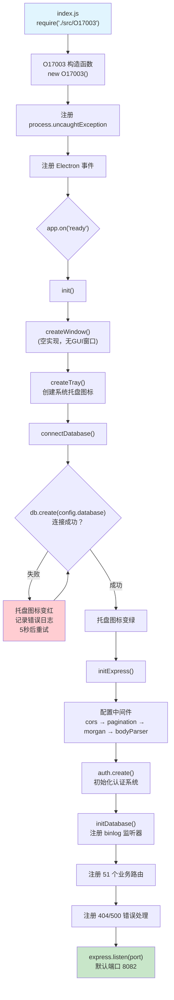

### 2.2 启动流程逐行解析

**阶段 1 — 模块加载 (`index.js`)**
```javascript
module.exports = require('./src/O17003');  // 单行入口，直接代理到主应用
```

**阶段 2 — 构造函数 (`O17003.js` L74-123)**

`O17003` 类在构造函数中完成以下工作：
1. 从 `package.json` 读取应用名和版本号
2. 注册 `uncaughtException` 全局异常处理（记录日志后 `process.exit(1)`）
3. 初始化 `mainWindow = null` 和 `trayIcon = null`
4. 注册 Electron 生命周期事件：
   - `ready` → 调用 `init()` 初始化
   - `window-all-closed` → 退出应用
   - `activate` → macOS 特有的窗口恢复
   - `quit` → 销毁托盘图标、断开通信

**阶段 3 — 数据库连接 (`connectDatabase()`, L212-227)**

使用**递归重试**模式：
- 调用 `db.create(config.database)` 尝试连接
- 成功 → 托盘图标切换为 `icon-active.png`
- 失败 → 托盘图标切换为 `icon-error.png`，记录错误，**5秒后重试**
- 无最大重试次数限制（持续重试直到成功）

**阶段 4 — Express 初始化 (`initExpress()`, L229-343)**

中间件加载顺序：
1. `cors()` — 跨域支持
2. `pagination()` — 分页参数解析到 `req.pagination`
3. `morgan('common', {stream})` — HTTP 日志写文件（轮转，最大 200MB/3 文件）
4. `morgan('dev')` — HTTP 日志输出到控制台
5. `bodyParser.json({limit: '50mb'})` — JSON 请求体（最大 50MB）
6. `bodyParser.urlencoded({limit: '50mb'})` — URL 编码请求体

**阶段 5 — 认证系统初始化 (`auth.create()`, 从 `net.hivetechnology.auth`)**

```javascript
await auth.create({
    db: db,
    express: express,
    authenticationType: 'simple',  // 使用简化认证（MD5密码）
    routesPrefix: '',              // 路由无前缀
});
```

认证系统自动注册以下路由：
- `/users` → 用户管理（使用 `usersSimple` 路由，因为 `authenticationType = 'simple'`）
- `/groups` → 用户组管理
- `/permissions` → 权限定义管理
- `/group-permissions` → 组权限关联管理
- `/auth` → 登录/登出

并自动建表：`auth_groups`, `auth_users`, `auth_users_simple`, `auth_permissions`, `auth_group_permissions`, `auth_users_tokens`

**阶段 6 — 业务路由注册 (L256-305)**

按固定顺序注册 51 个业务路由（详见第 9 节）。

**阶段 7 — 错误处理 (L308-331)**

```javascript
// 404 处理 — Express 不自动处理 404
express.use((req, res, next) => {
    let err = new Error('Not Found');
    err.status = 404;
    next(err);
});

// 全局错误处理
express.use((err, req, res, next) => {
    if (err.status === 404) res.status(404).json({ message: 'Not found' });
    else res.status(500).json({ message: 'Something looks wrong :( !!!' });
});
```

---

## 3. HTTP 服务架构

### 3.1 Express 路由注册全景图

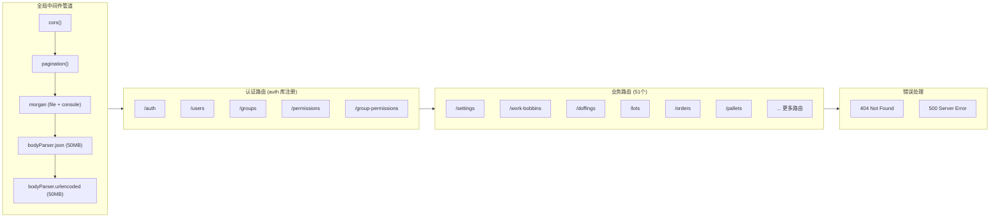

### 3.2 三层架构模式

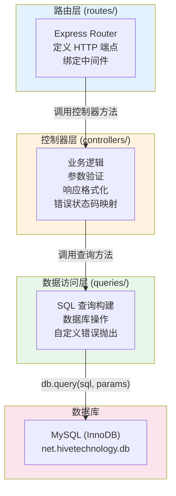

**Route 层典型模式：**
```javascript
const express = require('express');
const router = express.Router();
const controller = require('../controllers/xxx');

router.post('/', controller.create);
router.get('/', controller.getAll);
router.get('/:id', controller.get);
router.put('/:id', controller.update);
router.delete('/:id', controller.delete);

module.exports = router;
```

**Controller 层典型模式：**
```javascript
async createXxx(req, res, next) {
    try {
        let data = { field: req.body.field };
        if (!data.field) return res.status(500).json({ message: 'Compile all required fields.' });
        const insertId = await queries.createXxx(data);
        return res.status(200).json({ insertId });
    } catch (error) {
        switch (error.code) {
            case 'ERR_DUPLICATE': status = 500; break;
            default: status = 500; break;
        }
        return res.status(status).json(error);
    }
}
```

**Query 层典型模式：**
```javascript
async createXxx(data) {
    let sql = `INSERT INTO table SET ?`;
    const rows = await db.query(sql, [data]);
    return rows.insertId;
}
```

### 3.3 请求处理管道数据流

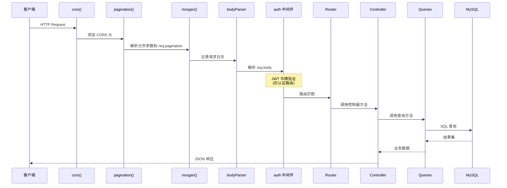

---

## 4. WebSocket 通信机制

### 4.1 WebSocket 服务器 (`src/ws.js`)

```javascript
const WebSocket = require('ws');
const _wss = new WebSocket.Server({ port: config.websocketPort });

_wss.on('connection', ws => {
    ws.id = _wss.clients.length
        ? Math.max(..._wss.clients.map(o => o.id))
        : 0;
});
```

- 独立端口运行（由 `config.websocketPort` 配置，与 HTTP 端口分离）
- 每个连接分配递增 ID（基于当前最大 ID）
- 以全局单例模式导出

### 4.2 Binlog 实时推送机制

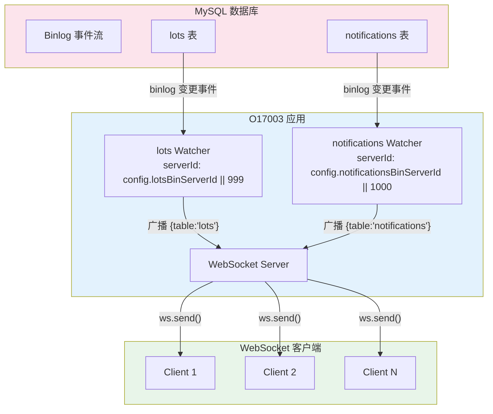

**工作流程：**
1. `db.addWatcher()` 注册 MySQL binlog 监听器
2. 监听 `lots` 和 `notifications` 两张表的 `writerows`、`updaterows`、`deleterows` 事件
3. 过滤掉 `tablemap` 事件（元数据事件）
4. 当数据变更发生时，向所有 WebSocket 客户端广播变更通知
5. 通知格式：`{ table: 'lots' }` 或 `{ table: 'notifications' }`（仅通知表名，不含数据）
6. 客户端收到通知后需自行重新拉取数据

**连接时的初始推送：**
```javascript
wss.on('connection', async ws => {
    ws.send(JSON.stringify({ table: 'lots' }));
    ws.send(JSON.stringify({ table: 'notifications' }));
});
```
新客户端连接后立即收到两个初始化消息，触发前端加载 lots 和 notifications 数据。

---

## 5. 数据库连接和查询模式

### 5.1 数据库连接 (`src/db.js`)

```javascript
const Db = require('net.hivetechnology.db');
const _db = new Db();
module.exports = _db;
```

- `net.hivetechnology.db` 是 Hive 自研的数据库封装库（v2.0.0）
- 支持 MySQL 和 SQL Server 双引擎（底层依赖 `net.hivetechnology.mysql` 和 `net.hivetechnology.sqlserver`）
- 全局单例模式（模块级缓存）
- 连接参数来自 `setup/config.js` 中的 `config.database` 对象

### 5.2 备份数据库 (`src/backupDb.js`)

```javascript
const Db = require('net.hivetechnology.db');
let _db = new Db();
module.exports = _db;
```

- 结构与 `db.js` 完全相同
- 独立的数据库连接实例
- 用于数据库备份操作，避免与主连接竞争

### 5.3 查询模式

**核心 API：**
- `db.query(sql, params)` — 参数化查询（防 SQL 注入）
- `db.transaction(async connection => { ... })` — 事务操作
- `db.addWatcher(callback, errorCallback, config)` — MySQL binlog 监听

**参数化查询示例：**
```javascript
// 对象插入 — MySQL SET 语法
sql = `INSERT INTO settings SET ?`;
await db.query(sql, [setting]);  // setting = { name: 'x', value: 'y' }

// 条件查询
sql = `SELECT * FROM settings WHERE name = ?`;
await db.query(sql, [settingName]);

// 对象更新
sql = `UPDATE settings SET ? WHERE name = ?`;
await db.query(sql, [setting, settingName]);
```

### 5.4 数据库 Schema（由 auth 库自动创建）

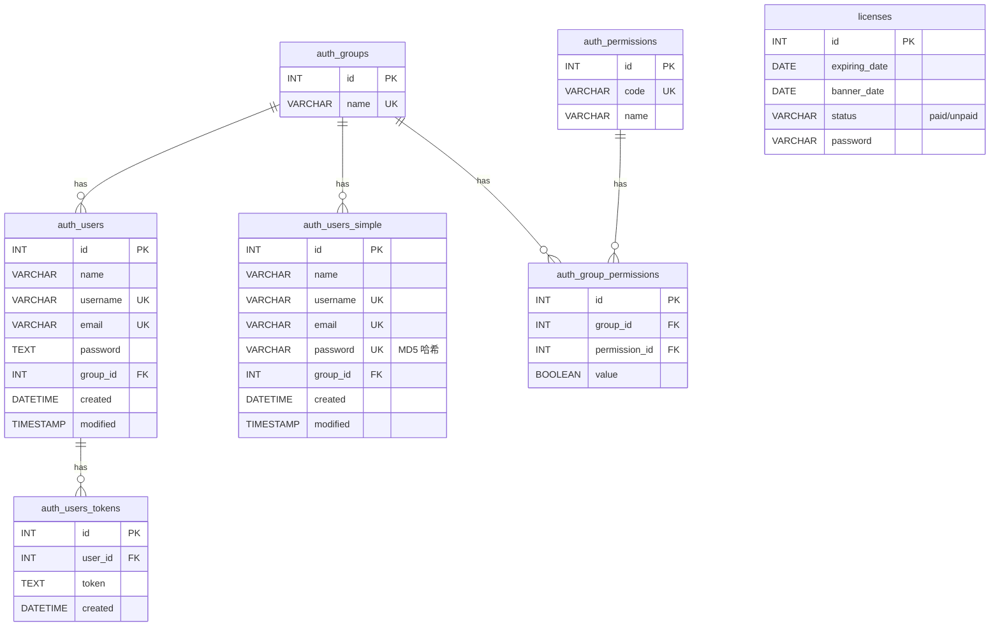

---

## 6. 认证/授权/许可证机制

### 6.1 认证架构总览

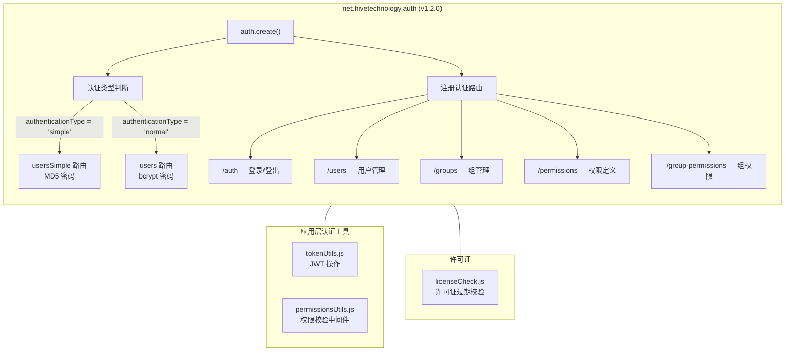

### 6.2 JWT 令牌管理 (`src/tokenUtils.js`)

**四个核心方法：**

| 方法 | 功能 | 细节 |
|------|------|------|
| `verify(req, res, next)` | 校验 JWT 令牌 | 从 `x-access-token` 请求头提取；`rememberMe` 令牌需额外查询 `users_tokens` 表 |
| `generate(req, id, rememberMe)` | 生成 JWT 令牌 | `rememberMe=true` → 无过期时间 + 存入数据库；`rememberMe=false` → 24 小时过期 |
| `remove(id, token)` | 删除单个令牌 | 从 `users_tokens` 表移除指定令牌 |
| `removeAll(id)` | 删除用户所有令牌 | 从 `users_tokens` 表移除该用户的所有令牌 |

**安全注意事项：**
- JWT 密钥硬编码为字符串 `'secretKey'`（`express.set('secretKey', 'secretKey')`）
- `rememberMe` 令牌**无过期时间**，依赖数据库记录来控制有效性
- 非 `rememberMe` 令牌有效期 24 小时

### 6.3 权限校验 (`src/permissionsUtils.js`)

```javascript
function verify(permissionCode) {
    return async function (req, res, next) {
        let userId = req.body.token.id;    // 从已解析的 JWT 中获取用户 ID
        let user = await usersQueries.getUser(userId);
        let groupId = user.group_id;       // 获取用户所属组
        let permission = await groupsQueries.getPermission(groupId, permissionCode);
        if (permission.value === 1) next();  // 权限值为 1 则放行
        else res.status(500).json(error);    // 否则返回权限拒绝
    };
}
```

**权限模型：** `用户 → 组 → 组权限 → 权限代码` (RBAC)

**预置权限代码（19 个）：**
- 组管理：`create-group`, `get-groups`, `get-group-users`, `edit-group`, `delete-group`
- 组权限管理：`get-group-permissions`, `create-group-permission`, `edit-group-permission`, `delete-group-permission`
- 权限定义管理：`create-permission`, `get-permissions`, `edit-permission`, `delete-permission`
- 用户管理：`create-user`, `get-users`, `edit-user`, `delete-user`, `edit-user-page`

### 6.4 许可证校验 (`src/licenseCheck.js`)

```javascript
async function licenseCheckMiddleware(req, res, next) {
    const licenses = await queries.getStatus();
    if (licenses.some(o => o.is_expired == 1))
        throw new Error('License expired');
    next();
}
```

**许可证逻辑：**
- 查询所有 `licenses` 记录
- `is_expired` 计算规则：`expiring_date < CURRENT_TIMESTAMP() AND status = 'unpaid'`
- 任何一个许可证过期且未付款 → 拒绝请求（HTTP 500, "License expired"）
- 许可证激活方式：调用 `PUT /licenses` 接口，传入密码，匹配后将 status 更新为 `'paid'`

**使用位置（仅 3 个路由）：**
- `POST /doffings` — 创建落纱操作
- `POST /pallets` — 创建托盘
- `POST /dty-pallets` — 创建 DTY 托盘

---

## 7. 错误处理策略

### 7.1 自定义错误类 (`src/error.js`)

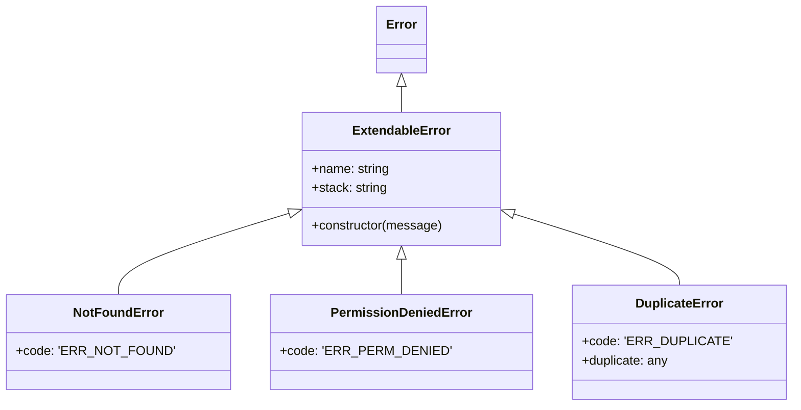

### 7.2 错误处理层级

| 层级 | 位置 | 策略 |
|------|------|------|
| **进程级** | `O17003.js` 构造函数 | `process.on('uncaughtException')` → 日志记录 + `process.exit(1)` |
| **Electron 级** | `app.on('ready')` catch | `dialog.showErrorBox()` → `app.quit()` |
| **Express 全局** | `initExpress()` 尾部 | 404 → `{message: 'Not found'}`; 其他 → `{message: 'Something looks wrong'}` |
| **Controller 级** | 各控制器的 try/catch | `ERR_NOT_FOUND` → 404; `ERR_DUPLICATE` → 500; 默认 → 500 |
| **Query 级** | 各查询方法 | MySQL `ER_DUP_ENTRY` → 转换为 `DuplicateError`; 无结果 → `NotFoundError` |

### 7.3 错误传播流程

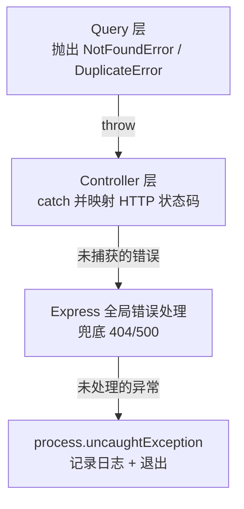

---

## 8. 日志和备份机制

### 8.1 日志系统 (`src/logger.js`)

**四个日志文件：**

| 文件 | 内容 | 大小限制 | 轮转 |
|------|------|----------|------|
| `error.log` | 仅 error 级别 | 10MB × 3 文件 | 尾部追加模式 |
| `combine.log` | 所有级别 | 10MB × 3 文件 | 尾部追加模式 |
| `actions.log` | 业务操作日志 | 10MB × 3 文件 | 尾部追加模式 |
| `morgan.log` | HTTP 请求日志 | 200MB × 3 文件 | rotating-file-stream |

**日志格式：**
```
// error.log / combine.log 格式:
2026-09-17 10:30:15 error: [src/controllers/settings.js:22] "Error message"

// actions.log 格式:
2026-09-17 10:30:15: "Action message"

// 控制台输出: 彩色格式
```

**调用者信息追踪：**

`logger.js` 实现了自动调用者追踪（类似 Java 的 Log4j）：
- 通过 `new Error().stack` 获取调用栈
- 解析栈帧提取文件路径和行号
- 自动附加到日志的 `label` 字段
- 导出 `debug/log`、`info`、`warn`、`error` 四个方法

**`Date.prototype.toLocalTimestamp` 扩展：**
- 将 UTC 时间转换为本地时间
- 格式化为 MySQL 格式 `YYYY-MM-DD HH:mm:ss`

### 8.2 日志路径

- 默认：`{process.cwd()}/logs/`
- 可通过 `config.logsPath` 自定义
- 启动时自动创建目录（自实现递归 `mkdirp`，兼容 Electron 4.x 的旧 Node.js）

---

## 9. 完整 API 路由清单

### 9.1 认证系统路由（auth 库自动注册）

| 路径前缀 | 来源 | 用途 |
|----------|------|------|
| `/auth` | net.hivetechnology.auth | 登录/登出/令牌管理 |
| `/users` | net.hivetechnology.auth (simple 模式) | 用户 CRUD（MD5 密码） |
| `/groups` | net.hivetechnology.auth | 用户组 CRUD |
| `/permissions` | net.hivetechnology.auth | 权限定义 CRUD |
| `/group-permissions` | net.hivetechnology.auth | 组-权限关联管理 |

### 9.2 业务路由清单（51 个路由模块）

#### 🏭 纺丝/落纱域 (Spinning & Doffing)

| 路由前缀 | 文件 | 端点数 | 中间件 | 核心操作 |
|----------|------|--------|--------|----------|
| `/spinnings` | spinnings.js | 5 | — | 纺丝机 CRUD |
| `/spinning-sides` | spinningSides.js | 8 | — | 纺丝面管理 + 统计 + 重置 |
| `/spinning-lines` | spinningLines.js | 2 | — | 纺丝线查询（含客户线） |
| `/winders` | winders.js | 2 | — | 卷绕机查询 |
| `/winders-check` | windersCheck.js | 7 | — | 卷绕机检查 + 规则管理 |
| `/doffings` | doffings.js | 6 | **licenseCheck(POST /)** | 落纱操作管理 + 小时产量 |
| `/work-bobbins` | workBobbins.js | 21 | — | 丝饼管理（核心复杂模块） |
| `/pre-defect-bobbins` | preDefectBobbins.js | 5 | — | 预缺陷丝饼 CRUD |

#### 📦 包装/码垛域 (Packaging & Palletizing)

| 路由前缀 | 文件 | 端点数 | 中间件 | 核心操作 |
|----------|------|--------|--------|----------|
| `/modules` | modules.js | 20 | — | 模块管理（打印、追踪、等级） |
| `/trolleys` | trolleys.js | 8 | — | 推车管理（当前/历史/打印） |
| `/palletizers` | palletizers.js | 7 | — | 码垛机 CRUD + 统计重置 |
| `/pallets` | pallets.js | 12 | **licenseCheck(POST /)** | 托盘管理 + 追踪 + 打印 + RFID |
| `/orders` | orders.js | 15 | — | 包装订单全生命周期 |
| `/order-grades` | orderGrades.js | 5 | — | 订单等级 CRUD |
| `/orders-queue` | ordersQueue.js | 6 | — | 订单队列管理 |
| `/print-servers` | printServers.js | 5 | — | 打印服务器 CRUD |

#### 🏢 仓库/物流域 (Warehouse & Logistics)

| 路由前缀 | 文件 | 端点数 | 中间件 | 核心操作 |
|----------|------|--------|--------|----------|
| `/warehouses` | warehouses.js | 10 | — | 仓库管理 + 模块状态 + 读取状态 |
| `/movements` | movements.js | 2 | — | 物料移动记录 |
| `/monorails` | monorails.js | 2 | — | 单轨运输查询 |
| `/positions` | positions.js | 5 | — | 仓位 CRUD |
| `/position-types` | positionTypes.js | 5 | — | 仓位类型 CRUD |

#### 🔬 分拣/称重/检测域 (Sorting & Weighing & Inspection)

| 路由前缀 | 文件 | 端点数 | 中间件 | 核心操作 |
|----------|------|--------|--------|----------|
| `/sortings` | sortings.js | 7 | — | 分拣工位管理 + 统计重置 |
| `/sorting-grades` | sortingGrades.js | 5 | — | 分拣等级 CRUD |
| `/weight-grades` | weightGrades.js | 5 | — | 称重等级 CRUD |
| `/final-grades` | finalGrades.js | 5 | — | 最终等级 CRUD |
| `/weighing-rules` | weighingRules.js | 5 | — | 称重规则 CRUD |
| `/defects` | defects.js | 5 | — | 缺陷类型 CRUD |
| `/vision-grades` | visionGrades.js | 5 | — | 视觉检测等级 CRUD |

#### 🧵 批次/产量域 (Lot & Production)

| 路由前缀 | 文件 | 端点数 | 中间件 | 核心操作 |
|----------|------|--------|--------|----------|
| `/lots` | lots.js | 10 | — | 批次管理 + 锁定/结束/可见性 |
| `/lot-prefixes` | lotPrefixes.js | 5 | — | 批次前缀 CRUD |
| `/daily-bobbins-amounts` | dailyBobbinsAmounts.js | 1 | — | 日产量统计查询 |
| `/paper-tube-colors` | paperTubeColors.js | 5 | — | 纸管颜色 CRUD |

#### 🔗 ERP 集成域 (ERP Integration)

| 路由前缀 | 文件 | 端点数 | 中间件 | 核心操作 |
|----------|------|--------|--------|----------|
| `/erp-pallets` | erpPallets.js | 5 | — | ERP 托盘数据 CRUD |
| `/erp-bobbins` | erpBobbins.js | 1 | — | ERP 丝饼数据查询 |

#### 🧶 DTY 域 (Draw Textured Yarn)

| 路由前缀 | 文件 | 端点数 | 中间件 | 核心操作 |
|----------|------|--------|--------|----------|
| `/dty` | dty.js | 1 | — | DTY 查询 |
| `/dty-orders` | dtyOrders.js | 14 | — | DTY 包装订单全生命周期 |
| `/dty-boxes` | dtyBoxes.js | 4 | — | DTY 箱管理 + 称重 + 打印 |
| `/dty-bobbins` | dtyBobbins.js | 0 | — | **空路由**（已导入控制器但未注册端点） |
| `/dty-pallets` | dtyPallets.js | 4 | **licenseCheck(POST /)** | DTY 托盘管理 |
| `/dty-warehouse-orders` | dtyWarehouseOrders.js | 8 | — | DTY 仓库订单管理 |

#### ⚙️ 系统/配置域 (System & Configuration)

| 路由前缀 | 文件 | 端点数 | 中间件 | 核心操作 |
|----------|------|--------|--------|----------|
| `/settings` | settings.js | 5 | — | 系统设置 CRUD |
| `/licenses` | licenses.js | 7 | — | 许可证管理 + 激活 + 状态查询 |
| `/status` | status.js | 12 | — | 设备状态/报警（纺丝/仓库/码垛） |
| `/modules-status` | modulesStatus.js | 6 | — | 模块状态汇总 + 针织/DTY 分组 |
| `/cycles` | cycles.js | 12 | — | 设备周期记录（落纱/仓库/码垛） |
| `/clients-supervision-settings` | clientsSupervisionSettings.js | 4 | — | 客户端监控配置 |
| `/notifications` | notifications.js | 3 | — | 通知管理 |

#### 🧶 针织域 (Knitting) — 未在主注册中引用但存在文件

| 路由前缀 | 文件 | 端点数 | 中间件 | 核心操作 |
|----------|------|--------|--------|----------|
| `/knitting-orders` | knittingOrders.js | 8 | — | 针织订单全生命周期 |
| `/knittings` | knittings.js | 1 | — | 针织工位查询 |
| `/knitting-grades` | knittingGrades.js | 5 | — | 针织等级 CRUD |

### 9.3 端点统计

| 统计项 | 数量 |
|--------|------|
| 路由文件总数 | 52 |
| O17003.js 中注册的路由 | 51 |
| 有效端点总数 | **约 280+** |
| 使用 licenseCheck 中间件的路由 | 3 (doffings, pallets, dty-pallets) |
| 空路由（无端点） | 1 (dtyBobbins) |
| 未在主文件注册的路由文件 | 2 (lotWeights, dtyWorkBobbins) |

---

## 10. 公共工具函数

### 10.1 `functions.js` — 命名转换

```javascript
function toCamelCase(str) {
    return str.replace(/_([a-z])/g, (match, letter) => letter.toUpperCase());
}

function convertObjectKeysToCamelCase(obj) {
    // 递归处理：数组 → map；对象 → 键名转换；Date 保持原样
}
```

**用途：** 将 MySQL 的 `snake_case` 字段名转换为 JavaScript 的 `camelCase`。

---

## 11. 系统架构总图

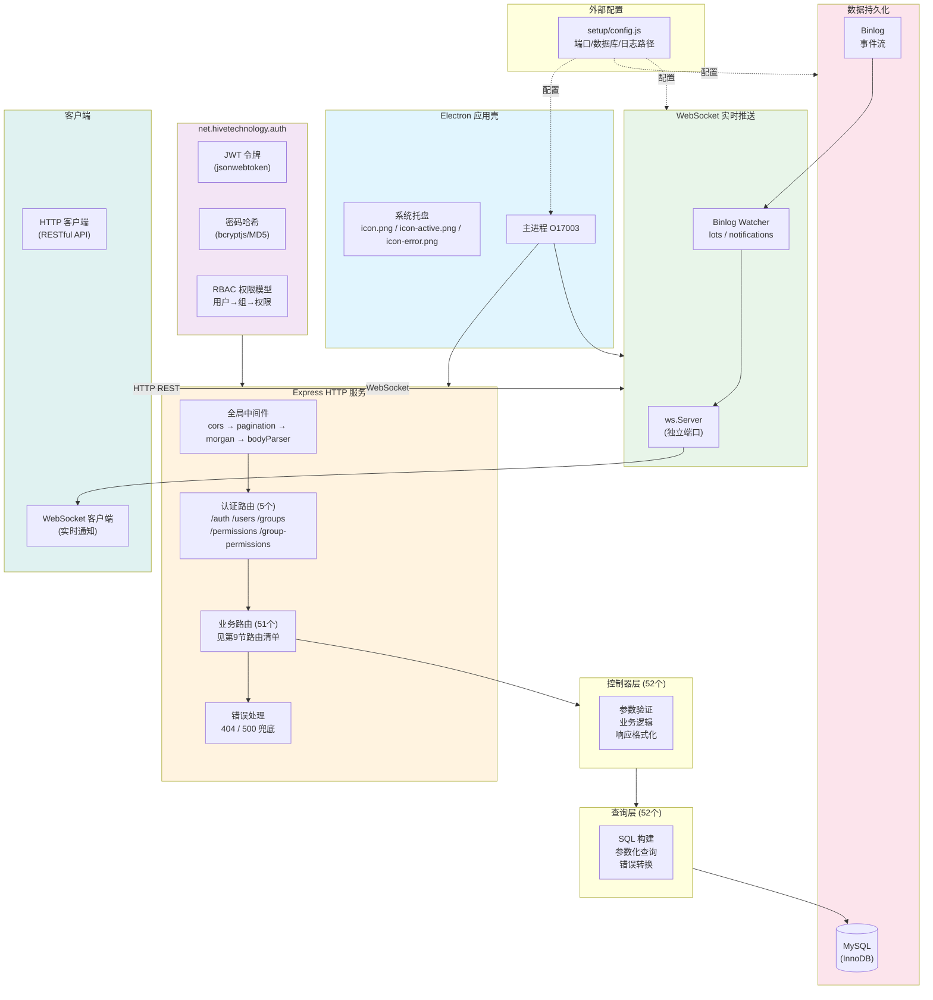

---

## 12. 关键发现与架构特征总结

### 12.1 架构特征

| 特征 | 描述 |
|------|------|
| **应用类型** | Electron 桌面应用壳 + Express REST API 服务 |
| **GUI** | 无 GUI 窗口（`createWindow()` 为空实现），仅系统托盘图标 |
| **架构模式** | 经典三层架构：Route → Controller → Query |
| **数据库访问** | 参数化 SQL 查询，无 ORM |
| **实时通信** | MySQL binlog → WebSocket 广播（仅通知表名，不含数据） |
| **认证** | JWT + MD5 简化认证（`authenticationType: 'simple'`） |
| **权限** | RBAC 模型，但**绝大多数业务路由未应用权限中间件** |
| **许可证** | 仅保护 3 个创建端点（doffings/pallets/dty-pallets） |

### 12.2 设计注意事项

1. **JWT 密钥硬编码** — `express.set('secretKey', 'secretKey')` 使用了固定字符串作为签名密钥
2. **认证覆盖不完整** — 51 个业务路由中，无一使用 `auth.verify` 或 `permissions.verify` 中间件保护（认证仅在 auth 库内部路由生效）
3. **许可证保护范围有限** — 仅 3 个创建端点受许可证保护
4. **数据库连接无限重试** — `connectDatabase()` 无最大重试次数，失败时无指数退避
5. **错误状态码统一 500** — Controller 层对不同错误类型统一返回 HTTP 500
6. **空路由文件** — `dtyBobbins.js` 引入了控制器但未注册任何端点
7. **未注册的路由文件** — `lotWeights.js` 和 `dtyWorkBobbins.js` 存在于 routes 目录但未在 `O17003.js` 中注册
8. **全局 Date.prototype 修改** — `logger.js` 扩展了 `Date.prototype.toLocalTimestamp`，存在原型污染风险

### 12.3 业务域划分

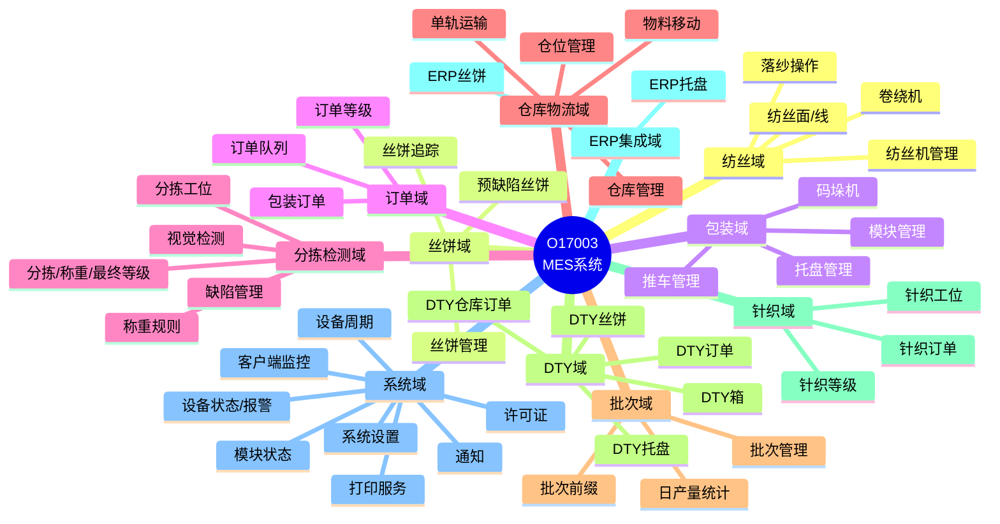

---

*报告结束。此报告为纯源码分析结果，覆盖了 O17003 的全部 13 个基础架构文件和 52 个路由文件。*
