# O17003 生产管理业务模块 - 深度源码分析报告

> **分析范围：** `F:/worktemp/第二版本程序/Hive/O17003/extracted_app/src/`  
> **架构模式：** Controllers / Queries / Routes 三层架构  
> **技术栈：** Node.js + Express + MySQL  
> **分析方法：** 纯源码逐行解读（未读取任何 .md 文档）  
> **生成时间：** 2026-09-17  

---

## 目录

1. [系统架构总览](#1-系统架构总览)
2. [模块详细分析](#2-模块详细分析)
   - [2.1 Orders 订单管理](#21-orders-订单管理)
   - [2.2 OrdersQueue 订单队列](#22-ordersqueue-订单队列)
   - [2.3 OrderGrades 订单等级](#23-ordergrades-订单等级)
   - [2.4 Lots 批次管理](#24-lots-批次管理)
   - [2.5 LotPrefixes 批次前缀](#25-lotprefixes-批次前缀)
   - [2.6 LotWeights 批次重量](#26-lotweights-批次重量)
   - [2.7 Cycles 周期管理](#27-cycles-周期管理)
   - [2.8 Doffings 落纱管理](#28-doffings-落纱管理)
   - [2.9 DailyBobbinsAmounts 每日纱锭统计](#29-dailybobbinsamounts-每日纱锭统计)
   - [2.10 Modules 模组管理](#210-modules-模组管理)
   - [2.11 ModulesStatus 模组状态](#211-modulesstatus-模组状态)
   - [2.12 Spinnings 纺丝机管理](#212-spinnings-纺丝机管理)
   - [2.13 SpinningLines 纺丝线管理](#213-spinninglines-纺丝线管理)
   - [2.14 SpinningSides 纺丝侧管理](#214-spinningsides-纺丝侧管理)
   - [2.15 Winders 卷绕机管理](#215-winders-卷绕机管理)
   - [2.16 WindersCheck 卷绕机检查](#216-winderscheck-卷绕机检查)
   - [2.17 WorkBobbins 工作纱锭管理](#217-workbobbins-工作纱锭管理)
3. [生产管理总流程](#3-生产管理总流程)
4. [订单→批次→周期→落纱 业务链](#4-订单批次周期落纱-业务链)
5. [发现的问题与设计模式](#5-发现的问题与设计模式)

---

## 1. 系统架构总览

### 1.1 三层架构说明

```
routes/          → Express 路由定义层（URL 映射、中间件挂载）
controllers/     → 业务逻辑控制层（参数处理、分页、事务编排）
queries/         → 数据访问层（SQL 构建、数据库交互）
```

### 1.2 通用技术模式

| 模式 | 说明 |
|------|------|
| **分页** | `net.hivetechnology.pagination` 库：`makePagination` + `makeFiltersQuery` + `getFilters` |
| **窗口计数** | `COUNT(*) OVER() AS total_count` 替代两次查询 |
| **命名转换** | API 层 camelCase ↔ DB 层 snake_case |
| **错误处理** | 自定义 `NotFoundError` / `DuplicateError` |
| **事务** | `db.transaction(async (trx) => {...})` 保证原子性 |
| **时区** | 数据库 UTC 存储，查询时 `CONVERT_TZ` 或 `+08:00` 转换 |
| **双语** | `specification_china` / `specification_export` / `chinese_name` 字段 |

### 1.3 模块依赖全景图

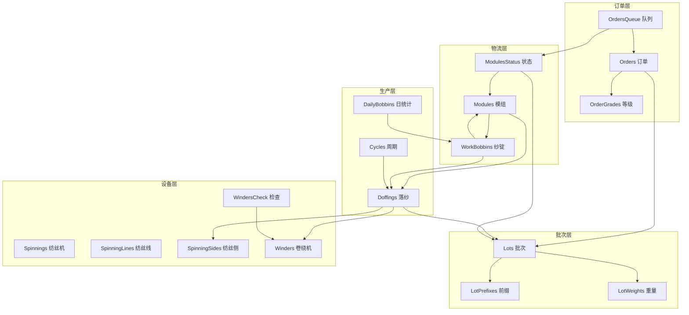

---

## 2. 模块详细分析

---

### 2.1 Orders 订单管理

**文件：** `controllers/orders.js` | `queries/orders.js` | `routes/orders.js`

#### 功能概述

Orders 模块是生产管理的顶层业务实体，管理客户订单的全生命周期。核心职责包括：
- 订单 CRUD 操作
- 打包订单（packing orders）子系统管理
- 订单关闭与状态流转
- 模组分配与同步
- 纱锭数量计算公式：`bobbins_amount = pallets * pallet_level * 9`

#### API 端点列表

| 方法 | 路径 | 控制器方法 | 功能 |
|------|------|-----------|------|
| POST | `/` | `createOrder` | 创建订单 |
| GET | `/` | `getAllOrders` | 获取所有订单（分页） |
| GET | `/packing-orders` | `getPackingOrders` | 获取打包订单列表 |
| GET | `/packing-orders-availability` | `getPackingOrdersAvailability` | 查询打包可用性 |
| GET | `/:orderId` | `getOrder` | 获取单个订单 |
| PUT | `/:orderId` | `updateOrder` | 更新订单 |
| DELETE | `/:orderId` | `deleteOrder` | 删除订单 |
| PUT | `/:orderId/close` | `closeOrder` | 关闭订单 |
| POST | `/packing-orders` | `createPackingOrder` | 创建打包订单 |
| PUT | `/packing-orders/:packingOrderId` | `updatePackingOrder` | 更新打包订单 |
| DELETE | `/packing-orders/:packingOrderId` | `deletePackingOrder` | 删除打包订单 |
| POST | `/packing-orders/:packingOrderId/modules` | `addModulesToPackingOrder` | 添加模组到打包订单 |
| PUT | `/packing-orders/:packingOrderId/sync` | `syncPackingOrder` | 同步打包订单 |
| DELETE | `/packing-orders/:packingOrderId/modules/:moduleId` | `removeModuleFromPackingOrder` | 从打包订单移除模组 |

#### SQL 分析

**关键查询 — getPackingOrdersAvailability（打包可用性 CTE）：**

```sql
WITH AvailableModules AS (
    SELECT ms.module_number, ms.lot_id, ms.warehouse_id,
           l.code AS lot_code, l.order_code,
           ptc.color1, ptc.color2,
           w.name AS warehouse_name,
           m.name AS monorail_name
    FROM modules_status AS ms
    JOIN lots AS l ON ms.lot_id = l.id
    JOIN paper_tube_colors AS ptc ON l.paper_tube_color_id = ptc.id
    LEFT JOIN warehouses AS w ON ms.warehouse_id = w.id
    LEFT JOIN monorails AS m ON ms.monorail_id = m.id
    WHERE ms.after_knitting_confirm = 1
      AND ms.status = 2
      AND l.packing_lock = 0
)
```

此 CTE 查询筛选条件：
- `after_knitting_confirm = 1`：已完成针织确认
- `status = 2`：模组在仓库中
- `packing_lock = 0`：批次未锁定打包

**订单创建事务：**
1. 插入 `orders` 表
2. 计算 `bobbins_amount = pallets * pallet_level * 9`
3. 关联 `palletizers` 和 `lots`

**closeOrder 逻辑：**
- 更新 `orders.status = 'completed'`
- 同时更新所有关联 `doffings` 的状态

#### 业务流程图

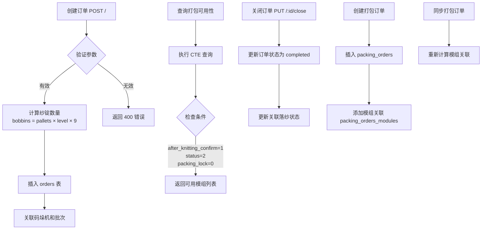

#### 数据流图

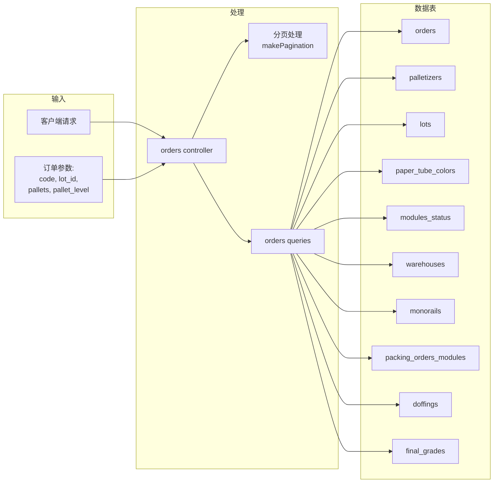

#### 推断表结构

**orders 表：**

| 字段 | 类型 | 说明 |
|------|------|------|
| id | INT PK | 主键 |
| code | VARCHAR | 订单编码 |
| lot_id | INT FK | 批次ID |
| palletizer_id | INT FK | 码垛机ID |
| pallets | INT | 托盘数 |
| pallet_level | INT | 托盘层数 |
| bobbins_amount | INT | 纱锭总数（计算值） |
| status | ENUM | 'to-start' / 'started' / 'completed' |
| order_grade_id | INT FK | 订单等级ID |
| created | DATETIME | 创建时间 |
| modified | DATETIME | 修改时间 |

---

### 2.2 OrdersQueue 订单队列

**文件：** `controllers/ordersQueue.js` | `queries/ordersQueue.js` | `routes/ordersQueue.js`

#### 功能概述

OrdersQueue 是订单的预排队系统，在正式创建订单前，先将模组分配到队列中。队列条目可以链接到实际订单，实现从计划到执行的过渡。

#### API 端点列表

| 方法 | 路径 | 控制器方法 | 功能 |
|------|------|-----------|------|
| POST | `/` | `createOrderQueue` | 创建队列条目 |
| GET | `/` | `getAllOrdersQueue` | 获取所有队列（分页） |
| GET | `/:orderQueueId` | `getOrderQueue` | 获取单个队列条目 |
| PUT | `/:orderQueueId` | `updateOrderQueue` | 更新队列条目 |
| DELETE | `/:orderQueueId` | `deleteOrderQueue` | 删除队列条目 |
| PUT | `/:orderQueueId/link-order` | `linkOrderToQueue` | 链接订单到队列 |

#### SQL 分析

**创建队列事务（三步操作）：**

```sql
-- 步骤1: 插入队列主记录
INSERT INTO orders_queue SET ?

-- 步骤2: 批量插入队列模组关联
INSERT INTO orders_queue_modules (order_queue_id, module_number) VALUES ?

-- 步骤3: 更新模组状态的 to_be_taken 标志
UPDATE modules_status SET to_be_taken = 1
WHERE module_number IN (?)
```

**getAllOrdersQueue 查询：**
- JOIN `orders_queue` + `warehouses` + `orders_queue_modules`
- 使用 `GROUP_CONCAT(oqm.module_number)` 聚合模组编号
- `COUNT(*) OVER()` 实现分页计数

#### 业务流程图

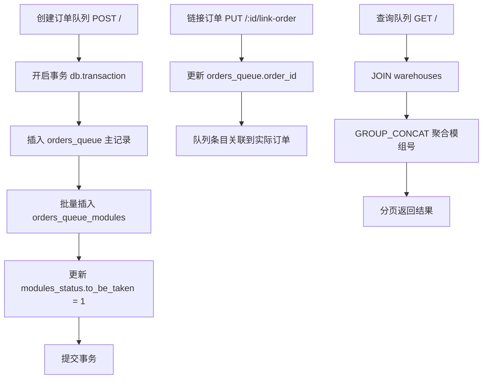

#### 数据流图

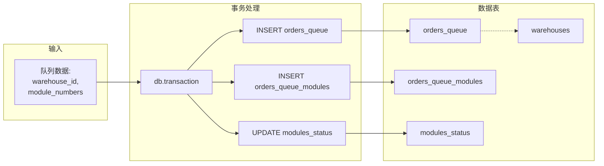

#### 推断表结构

**orders_queue 表：**

| 字段 | 类型 | 说明 |
|------|------|------|
| id | INT PK | 主键 |
| warehouse_id | INT FK | 仓库ID |
| order_id | INT FK | 关联订单ID（可为NULL） |
| created | DATETIME | 创建时间 |

**orders_queue_modules 表：**

| 字段 | 类型 | 说明 |
|------|------|------|
| id | INT PK | 主键 |
| order_queue_id | INT FK | 队列ID |
| module_number | INT | 模组编号 |

---

### 2.3 OrderGrades 订单等级

**文件：** `controllers/orderGrades.js` | `queries/orderGrades.js` | `routes/orderGrades.js`

#### 功能概述

OrderGrades 管理订单等级的定义数据。这是一个简单的 CRUD 模块，为订单提供等级分类（如 AA、A、B 等），每个等级关联一个颜色用于 UI 显示。

#### API 端点列表

| 方法 | 路径 | 控制器方法 | 功能 |
|------|------|-----------|------|
| POST | `/` | `createOrderGrade` | 创建等级 |
| GET | `/` | `getAllOrderGrades` | 获取所有等级（分页） |
| GET | `/:orderGradeId` | `getOrderGrade` | 获取单个等级 |
| PUT | `/:orderGradeId` | `updateOrderGrade` | 更新等级 |
| DELETE | `/:orderGradeId` | `deleteOrderGrade` | 删除等级 |

#### SQL 分析

标准 CRUD 操作：
- `INSERT INTO order_grades SET ?`
- `SELECT * FROM order_grades WHERE id = ?`
- `SELECT *, COUNT(*) OVER() AS total_count FROM order_grades ${filtersQuery}`
- `UPDATE order_grades SET ? WHERE id = ?`
- `DELETE FROM order_grades WHERE id = ?`

异常处理：`ER_DUP_ENTRY` → `DuplicateError`

#### 业务流程图

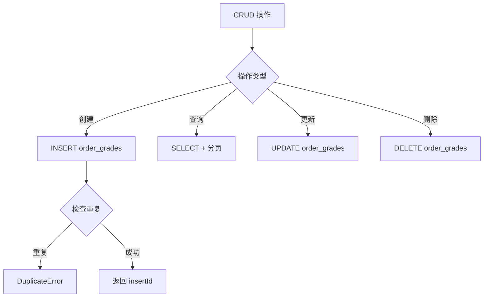

#### 推断表结构

**order_grades 表：**

| 字段 | 类型 | 说明 |
|------|------|------|
| id | INT PK | 主键 |
| code | VARCHAR UK | 等级编码 |
| name | VARCHAR | 等级名称 |
| chinese_name | VARCHAR | 中文名称 |
| description | VARCHAR | 描述 |
| color | VARCHAR | 显示颜色（十六进制） |

---

### 2.4 Lots 批次管理

**文件：** `controllers/lots.js` | `queries/lots.js` | `routes/lots.js`

#### 功能概述

Lots 是生产管理的核心模块之一，管理生产批次的全生命周期。每个批次关联一个纸管颜色，包含多个重量定义和等级范围。批次支持可见性控制、锁定/解锁、结束等操作。批次类型分为 FDY（全拉伸丝）和 POY（预取向丝）。

#### API 端点列表

| 方法 | 路径 | 控制器方法 | 功能 |
|------|------|-----------|------|
| POST | `/` | `createLot` | 创建批次（事务） |
| GET | `/` | `getAllLots` | 获取所有批次（分页） |
| GET | `/total-current-data` | `getTotalCurrentData` | 获取当前汇总数据 |
| GET | `/:lotId` | `getLot` | 获取单个批次 |
| PUT | `/:lotId` | `updateLot` | 更新批次（事务） |
| DELETE | `/:lotId` | `deleteLot` | 删除批次 |
| PUT | `/:lotId/visibility` | `changeVisibility` | 切换可见性 |
| GET | `/:lotId/lot-weights-by-doffing` | `getLotWeightsByDoffing` | 按落纱获取重量 |
| PUT | `/:lotId/lock` | `lockUnlockLot` | 锁定/解锁批次 |
| PUT | `/:lotId/end-lot` | `endLot` | 结束批次 |

#### SQL 分析

**创建批次事务（三步）：**

```sql
-- 步骤1: 插入批次主记录
INSERT INTO lots SET ?

-- 步骤2: 批量插入/更新重量定义（ON DUPLICATE KEY UPDATE）
INSERT INTO lot_weights (lot_id, level, gross, net) VALUES ?
ON DUPLICATE KEY UPDATE gross = VALUES(gross), net = VALUES(net)

-- 步骤3: 批量插入/更新等级范围（ON DUPLICATE KEY UPDATE）
INSERT INTO lot_grades_ranges (lot_id, weight_grade_id, min_value, max_value) VALUES ?
ON DUPLICATE KEY UPDATE min_value = VALUES(min_value), max_value = VALUES(max_value)
```

**getLot 查询（多表 JOIN）：**
```sql
SELECT l.*, ptc.color1, ptc.color2,
       ptc.specification_china, ptc.specification_export
FROM lots AS l
LEFT JOIN paper_tube_colors AS ptc ON l.paper_tube_color_id = ptc.id
WHERE l.id = ?
```

**getTotalCurrentData 统计查询：**
- 统计 `work_bobbins` 中各批次当前纱锭数
- JOIN `doffings` + `positions` + `lots`
- 按 lot_id 分组聚合

**getLotWeightsByDoffing 重量关联查询：**
- 从 `lot_weights` 获取批次重量定义
- 关联 `weight_grades` 获取等级信息
- 按 `level` 排序

#### 业务流程图

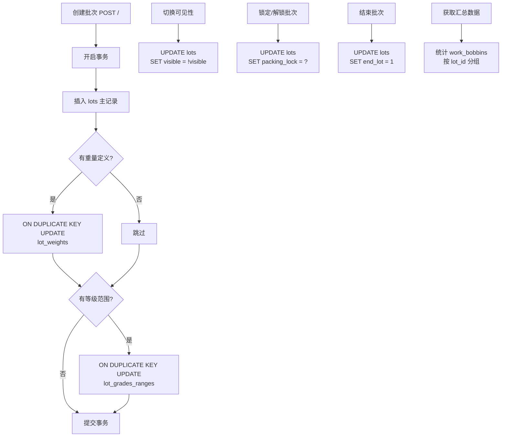

#### 数据流图

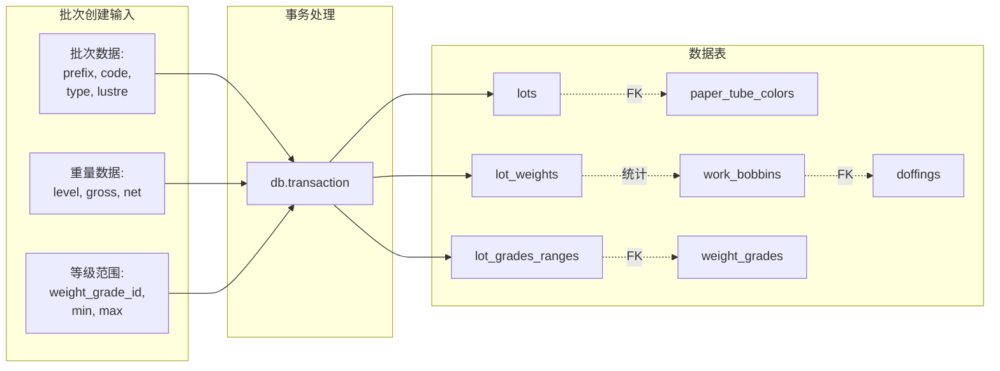

#### 推断表结构

**lots 表：**

| 字段 | 类型 | 说明 |
|------|------|------|
| id | INT PK | 主键 |
| prefix | VARCHAR | 批次前缀 |
| code | VARCHAR UK | 批次编码 |
| order_code | VARCHAR | 订单编码 |
| order_code_aa1 | VARCHAR | AA1级订单编码 |
| order_code_aa2 | VARCHAR | AA2级订单编码 |
| order_code_a | VARCHAR | A级订单编码 |
| paper_tube_color_id | INT FK | 纸管颜色ID |
| specification_china | VARCHAR | 中文规格 |
| specification_export | VARCHAR | 出口规格 |
| type | ENUM | 'fdy' / 'poy' |
| lustre | VARCHAR | 光泽度 |
| default_pallet_level | INT | 默认托盘层数 |
| default_destination | VARCHAR | 默认目的地 |
| default_pallet_size | INT | 默认托盘尺寸 |
| minimum_pallets_for_order | INT | 最小托盘数 |
| maximum_pallets_for_order | INT | 最大托盘数 |
| wait_time | INT | 等待时间 |
| twist | VARCHAR | 加捻方式 |
| box_weight | DECIMAL | 箱重 |
| packing_lock | TINYINT | 打包锁定标志 |
| end_lot | TINYINT | 批次结束标志 |
| visible | TINYINT | 可见性标志 |
| created | DATETIME | 创建时间 |
| modified | DATETIME | 修改时间 |

---

### 2.5 LotPrefixes 批次前缀

**文件：** `controllers/lotPrefixes.js` | `queries/lotPrefixes.js` | `routes/lotPrefixes.js`

#### 功能概述

LotPrefixes 是一个简单的参考数据管理模块，维护批次编码的前缀字典。前缀用于标识不同产品线或生产区域。

#### API 端点列表

| 方法 | 路径 | 控制器方法 | 功能 |
|------|------|-----------|------|
| POST | `/` | `createLotPrefix` | 创建前缀 |
| GET | `/` | `getAllLotPrefixes` | 获取所有前缀（分页） |
| GET | `/:lotPrefixId` | `getLotPrefix` | 获取单个前缀 |
| PUT | `/:lotPrefixId` | `updateLotPrefix` | 更新前缀 |
| DELETE | `/:lotPrefixId` | `deleteLotPrefix` | 删除前缀 |

#### SQL 分析

标准 CRUD 模式：
- 使用 `COUNT(*) OVER()` 实现分页
- `ER_DUP_ENTRY` → `DuplicateError`
- 不存在记录 → `NotFoundError`

#### 推断表结构

**lot_prefixes 表：**

| 字段 | 类型 | 说明 |
|------|------|------|
| id | INT PK | 主键 |
| prefix | VARCHAR UK | 前缀编码（唯一） |

---

### 2.6 LotWeights 批次重量

**文件：** `controllers/lotWeights.js` | `queries/lotWeights.js` | `routes/lotWeights.js`

#### 功能概述

LotWeights 管理批次按层级的重量定义。每个批次可有多层重量标准（gross/net），用于生产中的称重质检。

#### API 端点列表

| 方法 | 路径 | 控制器方法 | 功能 |
|------|------|-----------|------|
| POST | `/` | `createLotWeight` | 创建重量定义 |
| GET | `/` | `getAllLotWeights` | 获取所有重量（分页） |
| GET | `/:lotWeightId` | `getLotWeight` | 获取单个重量 |
| PUT | `/:lotWeightId` | `updateLotWeight` | 更新重量 |
| DELETE | `/:lotWeightId` | `deleteLotWeight` | 删除重量 |

#### SQL 分析

```sql
SELECT lw.*, l.code AS lot_code, COUNT(*) OVER() AS total_count
FROM lot_weights AS lw
LEFT JOIN lots AS l ON lw.lot_id = l.id
${filtersQuery}
```

> ⚠️ **代码问题：** queries 文件中函数命名错误 — `createLot` 应为 `createLotWeight`，`getLot` 应为 `getLotWeight` 等。功能正常但命名不规范。

#### 推断表结构

**lot_weights 表：**

| 字段 | 类型 | 说明 |
|------|------|------|
| id | INT PK | 主键 |
| lot_id | INT FK | 批次ID |
| level | INT | 层级 |
| gross | DECIMAL | 毛重 |
| net | DECIMAL | 净重 |

---

### 2.7 Cycles 周期管理

**文件：** `controllers/cycles.js` | `queries/cycles.js` | `routes/cycles.js`

#### 功能概述

Cycles 模块管理三套并行的周期追踪系统，分别追踪落纱机（doffer）、仓库（warehouse）和码垛机（palletizer）的运行周期数据。每个系统都有独立的周期值记录和定义维度。

#### API 端点列表

| 方法 | 路径 | 控制器方法 | 功能 |
|------|------|-----------|------|
| **落纱机周期** |
| POST | `/doffers` | `createDoffersCycle` | 创建落纱周期 |
| GET | `/doffers` | `getDoffersCycleRecords` | 获取落纱周期记录 |
| GET | `/doffers/all` | `getAllDoffersCycleRecords` | 获取所有落纱周期 |
| GET | `/doffers/last-cycles` | `getDoffersLastCycles` | 获取最近20个周期 |
| **仓库周期** |
| POST | `/warehouses` | `createWarehousesCycle` | 创建仓库周期 |
| GET | `/warehouses` | `getWarehousesCycleRecords` | 获取仓库周期记录 |
| GET | `/warehouses/all` | `getAllWarehousesCycleRecords` | 获取所有仓库周期 |
| GET | `/warehouses/last-cycles` | `getWarehousesLastCycles` | 获取最近20个周期 |
| **码垛机周期** |
| POST | `/palletizers` | `createPalletizersCycle` | 创建码垛周期 |
| GET | `/palletizers` | `getPalletizersCycleRecords` | 获取码垛周期记录 |
| GET | `/palletizers/all` | `getAllPalletizersCycleRecords` | 获取所有码垛周期 |
| GET | `/palletizers/last-cycles` | `getPalletizersLastCycles` | 获取最近20个周期 |

#### SQL 分析

**周期值 Upsert 模式（三套系统通用）：**

```sql
INSERT INTO doffers_cycles (spinning_side_id, doffers_cycles_definition_id, value)
VALUES ?
ON DUPLICATE KEY UPDATE value = VALUES(value)
```

**周期聚合查询：**

```sql
SELECT dcd.*, MIN(dc.value) AS min_value, AVG(dc.value) AS avg_value
FROM doffers_cycles_definition AS dcd
LEFT JOIN doffers_cycles AS dc ON dc.doffers_cycles_definition_id = dcd.id
WHERE dc.spinning_side_id = ?
GROUP BY dcd.id
```

**最近20个周期查询（子查询分页）：**

```sql
SELECT dc.*, dcd.name AS definition_name
FROM doffers_cycles AS dc
JOIN doffers_cycles_definition AS dcd ON dc.doffers_cycles_definition_id = dcd.id
WHERE dc.spinning_side_id = ?
  AND dc.doffers_cycles_definition_id = ?
ORDER BY dc.id DESC
LIMIT 20
```

#### 业务流程图

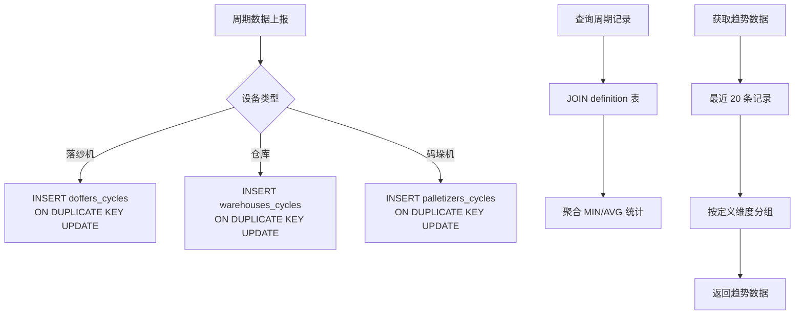

#### 数据流图

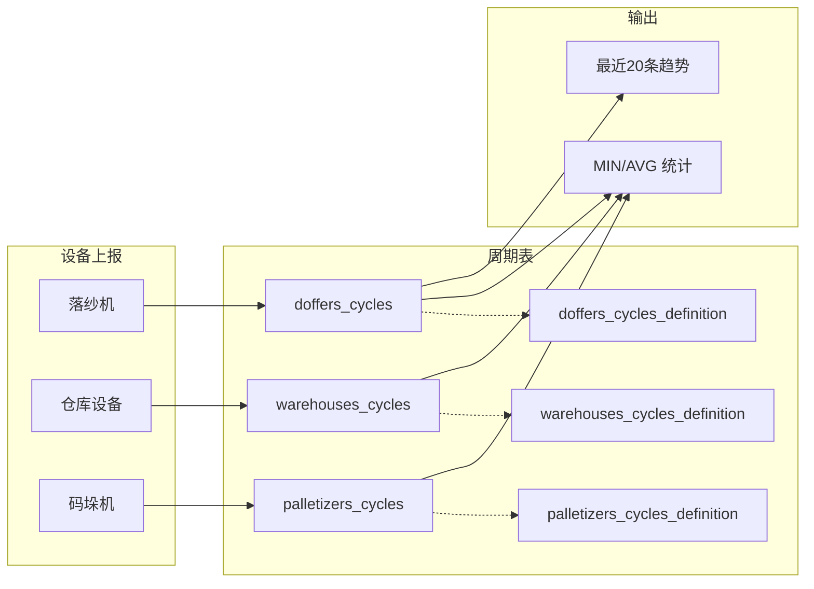

#### 推断表结构

**doffers_cycles 表（warehouses_cycles / palletizers_cycles 同结构）：**

| 字段 | 类型 | 说明 |
|------|------|------|
| id | INT PK | 主键 |
| spinning_side_id | INT FK | 纺丝侧ID |
| doffers_cycles_definition_id | INT FK | 周期定义ID |
| value | DECIMAL | 周期值 |
| created | DATETIME | 创建时间 |

**doffers_cycles_definition 表：**

| 字段 | 类型 | 说明 |
|------|------|------|
| id | INT PK | 主键 |
| name | VARCHAR | 定义名称 |

---

### 2.8 Doffings 落纱管理

**文件：** `controllers/doffings.js` | `queries/doffings.js` | `routes/doffings.js`

#### 功能概述

Doffings 管理落纱（doffing）操作——即从卷绕机上取下已完成的纱锭筒。这是生产过程中的核心步骤。模块特点：
- 创建落纱时调用存储过程 `manage_doffing`
- 创建端点受 **license 检查中间件** 保护
- 支持纱锭上架操作（putBobbinsOnWarehouse）
- 支持小时产量统计

#### API 端点列表

| 方法 | 路径 | 控制器方法 | 功能 |
|------|------|-----------|------|
| POST | `/` | `createDoffing` | 创建落纱（需 license） |
| GET | `/` | `getAllDoffings` | 获取所有落纱（分页） |
| GET | `/hourly-production` | `getHourlyProduction` | 获取小时产量 |
| GET | `/:doffingId` | `getDoffing` | 获取单个落纱 |
| PUT | `/:doffingId` | `updateDoffing` | 更新落纱 |
| PUT | `/put-on-warehouse` | `putBobbinsOnWarehouse` | 纱锭上架 |

#### SQL 分析

**创建落纱（存储过程调用）：**

```sql
CALL manage_doffing(
    @winder_name, @spinning_line_name, @spinning_side_id,
    @doff_no, @end_time, @yarn_type, @order_code,
    @code_number, @winder_number, @warehouse_pin_number,
    @lot_id, @winder_id, @plant_area_code,
    @team_turn, @shift_doff_no, @created
)
```

**putBobbinsOnWarehouse（上架操作）：**

```sql
-- 更新纱锭位置层级
UPDATE work_bobbins
SET position_id = (
    SELECT p.id FROM positions AS p
    WHERE p.spinning_warehouse_pin = ?
      AND p.spinning_warehouse = ?
      AND p.position_code = ?
)
WHERE bobbin_id = ?
```

此操作建立三级位置层级：`spinningWarehousePin → spinningWarehouse → position_code`

**getAllDoffings 查询（多表 JOIN）：**

```sql
SELECT d.*, l.code AS lot_code,
       ptc.color1, ptc.color2,
       w.winder_name,
       ss.name AS spinning_side_name,
       COUNT(*) OVER() AS total_count
FROM doffings AS d
LEFT JOIN lots AS l ON d.lot_id = l.id
LEFT JOIN paper_tube_colors AS ptc ON l.paper_tube_color_id = ptc.id
LEFT JOIN winders AS w ON d.winder_id = w.id
LEFT JOIN spinning_sides AS ss ON d.spinning_side_id = ss.id
${filtersQuery}
```

**小时产量查询：**

```sql
SELECT * FROM doffings_hourly_production
WHERE spinning_side_id = ?
ORDER BY hour ASC
```

#### 业务流程图

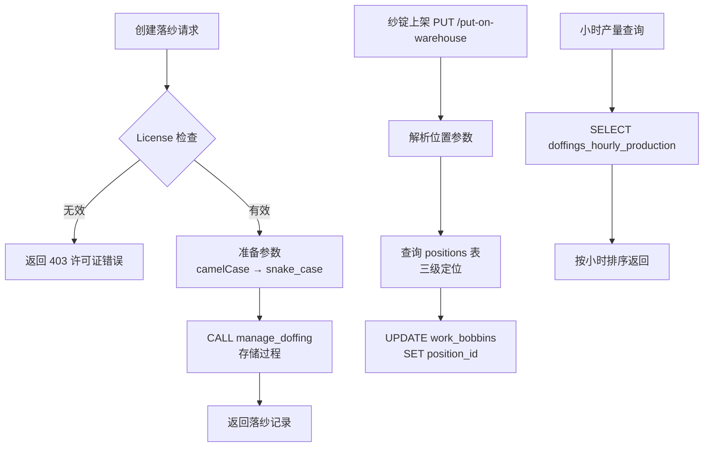

#### 数据流图

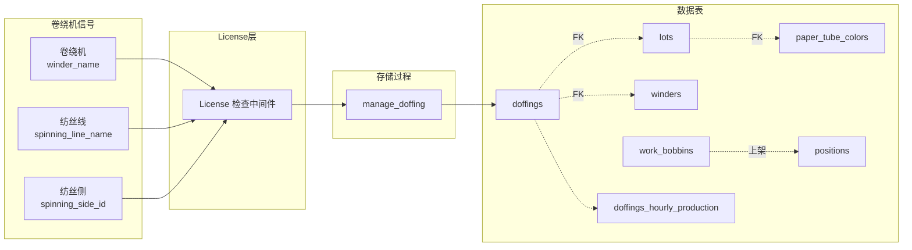

#### 推断表结构

**doffings 表：**

| 字段 | 类型 | 说明 |
|------|------|------|
| id | INT PK | 主键 |
| winder_name | VARCHAR | 卷绕机名称 |
| spinning_line_name | VARCHAR | 纺丝线名称 |
| spinning_side_id | INT FK | 纺丝侧ID |
| doff_no | INT | 落纱编号 |
| end_time | DATETIME | 结束时间 |
| yarn_type | VARCHAR | 纱线类型 |
| order_code | VARCHAR | 订单编码 |
| code_number | VARCHAR | 编码号 |
| winder_number | INT | 卷绕机编号 |
| warehouse_pin_number | INT | 仓库针位号 |
| lot_id | INT FK | 批次ID |
| winder_id | INT FK | 卷绕机ID |
| plant_area_code | VARCHAR | 厂区编码 |
| team_turn | VARCHAR | 班组轮次 |
| shift_doff_no | INT | 班次落纱号 |
| created | DATETIME | 创建时间 |

---

### 2.9 DailyBobbinsAmounts 每日纱锭统计

**文件：** `controllers/dailyBobbinsAmounts.js` | `queries/dailyBobbinsAmounts.js` | `routes/dailyBobbinsAmounts.js`

#### 功能概述

DailyBobbinsAmounts 是一个只读统计模块，通过 UNION 查询合并 `bobbins` 和 `work_bobbins` 两张表的数据，按天统计纱锭总量和已取纱锭量。

#### API 端点列表

| 方法 | 路径 | 控制器方法 | 功能 |
|------|------|-----------|------|
| GET | `/` | `getDailyBobbinsAmounts` | 获取每日纱锭统计 |

#### SQL 分析

**核心 UNION 查询：**

```sql
SELECT
    DATE(CONVERT_TZ(created, '+00:00', '+08:00')) AS day,
    COUNT(*) AS total,
    SUM(CASE WHEN taken = 1 THEN 1 ELSE 0 END) AS taken
FROM (
    SELECT created, 0 AS taken FROM bobbins
    WHERE spinning_side_id = ${spinningSideId}  -- ⚠️ SQL注入风险
    UNION ALL
    SELECT created, 0 AS taken FROM work_bobbins AS wb
    JOIN doffings AS d ON wb.doffing_id = d.id
    WHERE d.spinning_side_id = ${spinningSideId}
) AS combined
GROUP BY day
ORDER BY day DESC
```

**时区处理：**
- 数据库存储 UTC 时间
- 查询时 `CONVERT_TZ(created, '+00:00', '+08:00')` 转为东八区
- 按转换后的日期分组

> ⚠️ **严重安全问题：** `spinningSideId` 使用字符串插值直接拼入 SQL，存在 **SQL 注入漏洞**。应改用参数化查询 `?` 占位符。

#### 业务流程图

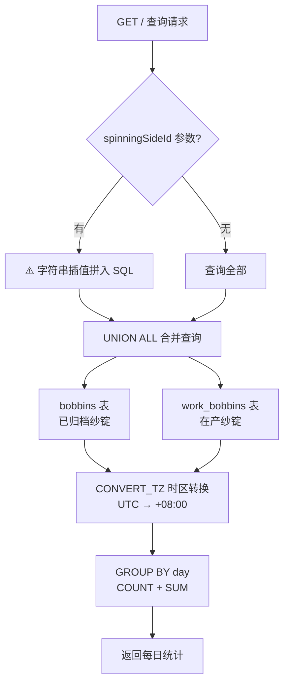

#### 数据流图

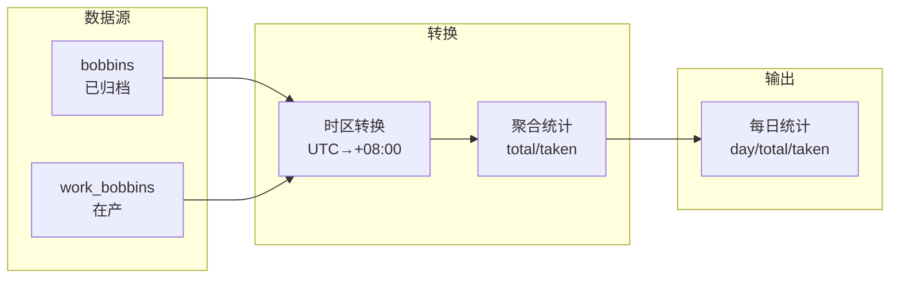

---

### 2.10 Modules 模组管理

**文件：** `controllers/modules.js` | `queries/modules.js` | `routes/modules.js`

#### 功能概述

Modules 是生产管理中**最复杂**的业务模块，管理物理模组容器（每个模组承载24个纱锭）的全生命周期。涵盖：
- 模组等级更新（批量更新24个纱锭的分拣/针织等级）
- 模组打印（双查询策略：按 containerId 或 moduleNumber+spinningSideId）
- 仓库模组视图（含降级统计）
- 单轨追踪系统（自动创建单轨区段）
- 码垛机模组管理
- 负落纱（negative doffing）占位记录
- 小时产量统计

#### API 端点列表

| 方法 | 路径 | 控制器方法 | 功能 |
|------|------|-----------|------|
| POST | `/` | `createModule` | 创建模组 |
| GET | `/` | `getAllModules` | 获取所有模组（分页） |
| GET | `/current` | `getCurrentModules` | 获取当前活跃模组 |
| GET | `/warehouse` | `getModulesInWarehouse` | 获取仓库模组视图 |
| GET | `/palletizer` | `getPalletizerModules` | 获取码垛机模组 |
| GET | `/hourly-production` | `getHourlyProduction` | 获取小时产量 |
| GET | `/bobbin-weights` | `getBobbinWeights` | 获取纱锭重量 |
| GET | `/:moduleId` | `getModule` | 获取单个模组 |
| PUT | `/:moduleId` | `updateModule` | 更新模组 |
| DELETE | `/:moduleId` | `deleteModule` | 删除模组 |
| PUT | `/update-grade` | `updateModuleGrade` | 批量更新模组等级 |
| PUT | `/update-single-grade` | `updateSingleModuleGrade` | 更新单个模组等级 |
| GET | `/:moduleId/history` | `getModuleHistory` | 获取模组历史 |
| POST | `/print` | `printModule` | 打印模组标签 |
| POST | `/tracking` | `createTrackingRecord` | 创建追踪记录 |
| GET | `/tracking/:moduleNumber` | `getTrackingRecords` | 获取追踪记录 |
| POST | `/palletizer-last-module` | `savePalletizerLastModule` | 保存码垛机最后模组 |
| POST | `/negative-doffing` | `createNegativeDoffing` | 创建负落纱 |
| GET | `/sortings-hourly-production` | `getSortingsHourlyProduction` | 分拣小时产量 |

#### SQL 分析

**updateSingleModuleGrade（批量纱锭等级更新）：**

控制器遍历 24 个纱锭位置，为每个纱锭调用：

```sql
UPDATE work_bobbins
SET knitting_grade_id = ?, sorting_grade_id = ?
WHERE bobbin_id = ?
```

此操作在一次请求中可能执行24次 UPDATE。

**printModule（双查询策略）：**

```sql
-- 策略1: 按 containerId
SELECT m.*, wb.*, d.*, l.*, ptc.*,
       lbs.loading_bobbins_sequence
FROM modules AS m
JOIN work_bobbins AS wb ON wb.doffing_id IN (m.doffing1_id, m.doffing2_id)
LEFT JOIN loading_bobbins_sequence AS lbs ON lbs.place = wb.place
JOIN doffings AS d ON wb.doffing_id = d.id
JOIN lots AS l ON d.lot_id = l.id
JOIN paper_tube_colors AS ptc ON l.paper_tube_color_id = ptc.id
WHERE m.id = ?

-- 策略2: 按 moduleNumber + spinningSideId
-- 同结构，WHERE 改为 m.number = ? AND d.spinning_side_id = ?
```

**getModulesInWarehouse（仓库降级视图）：**

```sql
SELECT ms.*, l.code AS lot_code,
       ptc.color1, ptc.color2,
       w.name AS warehouse_name,
       -- 等级计数子查询
       (SELECT COUNT(*) FROM work_bobbins AS wb
        JOIN doffings AS d ON wb.doffing_id = d.id
        WHERE wb.sorting_grade_id != (SELECT id FROM sorting_grades WHERE code = 1)
          AND d.spinning_side_id = ms.spinning_side_id) AS degraded_count
FROM modules_status AS ms
JOIN lots AS l ON ms.lot_id = l.id
JOIN paper_tube_colors AS ptc ON l.paper_tube_color_id = ptc.id
LEFT JOIN warehouses AS w ON ms.warehouse_id = w.id
```

**createTrackingRecord（自动创建单轨区段）：**

```sql
-- 检查区段是否存在
SELECT id FROM monorail_sections
WHERE monorail_id = ? AND name = ?

-- 不存在则自动创建
INSERT INTO monorail_sections (monorail_id, name) VALUES (?, ?)

-- 插入追踪记录
INSERT INTO modules_tracking SET ?
```

**createNegativeDoffing（存储过程调用）：**

```sql
CALL manage_negative_doffing(
    @spinning_side_id, @lot_id, @winder_id,
    @doff_no, @yarn_type, @order_code
)
```

#### 业务流程图

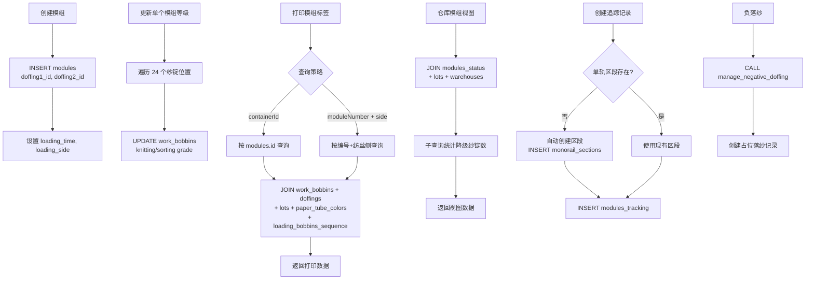

#### 数据流图

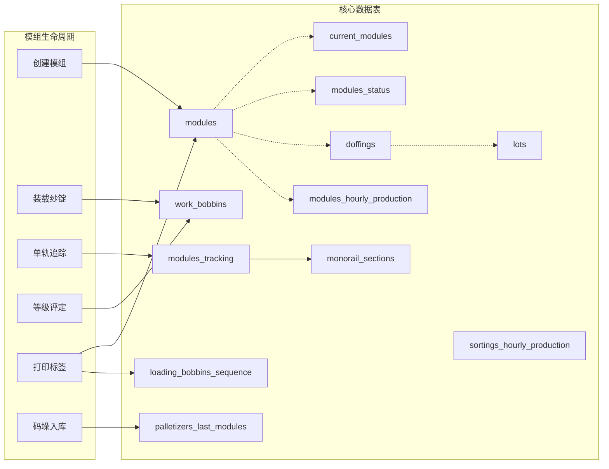

#### 推断表结构

**modules 表：**

| 字段 | 类型 | 说明 |
|------|------|------|
| id | INT PK | 主键 |
| number | INT | 模组编号 |
| doffing1_id | INT FK | 落纱1 ID |
| doffing2_id | INT FK | 落纱2 ID |
| loading_time | DATETIME | 装载时间 |
| loading_side | VARCHAR | 装载侧 |
| spinning_side_id | INT FK | 纺丝侧ID |
| reprint_time | DATETIME | 重印时间 |
| knitting_insert_time | DATETIME | 针织插入时间 |
| knitting_result_time | DATETIME | 针织结果时间 |
| knitting_order_id | INT FK | 针织订单ID |
| sorting_id | INT FK | 分拣ID |
| sorting_start_time | DATETIME | 分拣开始时间 |
| sorting_end_time | DATETIME | 分拣结束时间 |
| grade_of_module | VARCHAR | 模组等级 |

**modules_tracking 表：**

| 字段 | 类型 | 说明 |
|------|------|------|
| id | INT PK | 主键 |
| module_number | INT | 模组编号 |
| monorail_section_id | INT FK | 单轨区段ID |
| timestamp | DATETIME | 追踪时间戳 |

---

### 2.11 ModulesStatus 模组状态

**文件：** `controllers/modulesStatus.js` | `queries/modulesStatus.js` | `routes/modulesStatus.js`

#### 功能概述

ModulesStatus 追踪模组在仓库中的状态，支持按 FDY/POY 类型分组显示。核心功能包括：
- 针织后模组分组（with wait_time check）
- DTY 仓库模组分组
- FDY/POY 类型区分
- 模组位置管理（row, column, place）

#### API 端点列表

| 方法 | 路径 | 控制器方法 | 功能 |
|------|------|-----------|------|
| POST | `/` | `createModuleStatus` | 创建状态记录 |
| GET | `/` | `getAllModulesStatus` | 获取所有状态（分页） |
| GET | `/after-knitting` | `getModulesAfterKnitting` | 获取针织后模组 |
| GET | `/dty-warehouse` | `getDtyWarehouseModules` | 获取DTY仓库模组 |
| GET | `/:moduleStatusId` | `getModuleStatus` | 获取单个状态 |
| PUT | `/:moduleStatusId` | `updateModuleStatus` | 更新状态 |

#### SQL 分析

**getModulesAfterKnitting（针织后分组 CTE）：**

```sql
WITH KnittingModules AS (
    SELECT ms.module_number, ms.lot_id, ms.warehouse_id,
           ms.timestamp, ms.row, ms.column, ms.place,
           l.code AS lot_code, l.wait_time,
           ptc.color1, ptc.color2,
           w.name AS warehouse_name,
           -- 等待时间检查
           CASE WHEN TIMESTAMPDIFF(MINUTE, ms.timestamp, NOW()) >= l.wait_time
                THEN 1 ELSE 0 END AS ready
    FROM modules_status AS ms
    JOIN lots AS l ON ms.lot_id = l.id
    JOIN paper_tube_colors AS ptc ON l.paper_tube_color_id = ptc.id
    LEFT JOIN warehouses AS w ON ms.warehouse_id = w.id
    WHERE ms.after_knitting = 1
      AND ms.after_knitting_confirm = 0
      AND l.type = 'fdy'
      AND ms.status = 2
)
```

**关键筛选条件：**
- `after_knitting = 1`：已经过针织工序
- `after_knitting_confirm = 0`：尚未确认
- `l.type = 'fdy'`：仅 FDY 类型
- `status = 2`：在仓库中
- `wait_time` 检查：通过 `TIMESTAMPDIFF` 计算是否已达到等待时间

**getDtyWarehouseModules（DTY 仓库 CTE）：**

```sql
-- 类似结构但使用不同条件
WHERE ms.to_be_taken = 0
  AND ms.place_disabled = 0
  AND l.type = 'poy'
  AND ms.status = 2
-- 关联 dty_warehouse_orders 和 knitting_orders
```

#### 业务流程图

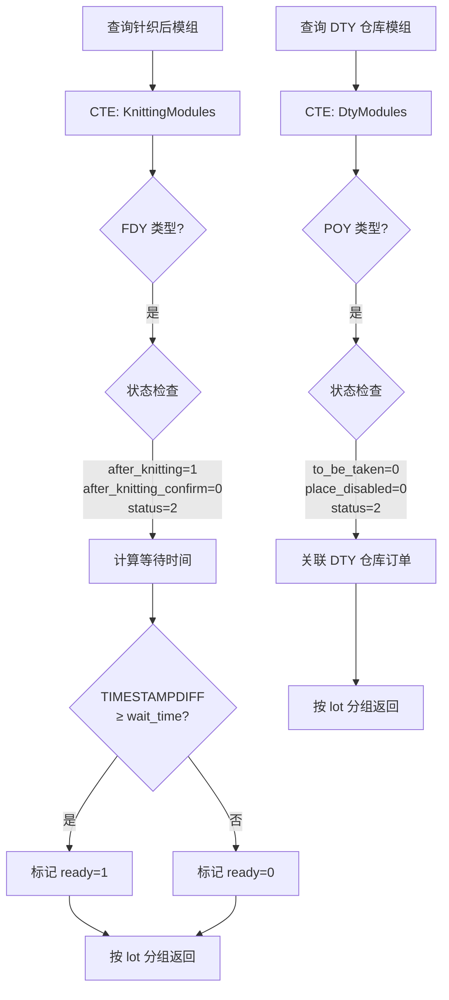

#### 推断表结构

**modules_status 表：**

| 字段 | 类型 | 说明 |
|------|------|------|
| id | INT PK | 主键 |
| module_number | INT UK | 模组编号 |
| status | INT | 状态码（2=在仓库） |
| lot_id | INT FK | 批次ID |
| warehouse_id | INT FK | 仓库ID |
| timestamp | DATETIME | 状态更新时间 |
| row | INT | 仓库行 |
| column | INT | 仓库列 |
| place | INT | 仓库位置 |
| to_be_taken | TINYINT | 待取标志 |
| after_knitting | TINYINT | 针织后标志 |
| after_knitting_confirm | TINYINT | 针织确认标志 |
| doffing1_id | INT FK | 落纱1 ID |
| doffing2_id | INT FK | 落纱2 ID |
| monorail_id | INT FK | 单轨ID |
| place_disabled | TINYINT | 位置禁用标志 |

---

### 2.12 Spinnings 纺丝机管理

**文件：** `controllers/spinnings.js` | `queries/spinnings.js` | `routes/spinnings.js`

#### 功能概述

Spinnings 管理纺丝机设备的基础信息，提供标准 CRUD 操作。

#### API 端点列表

| 方法 | 路径 | 控制器方法 | 功能 |
|------|------|-----------|------|
| POST | `/` | `createSpinning` | 创建纺丝机 |
| GET | `/` | `getAllSpinnings` | 获取所有纺丝机（分页） |
| GET | `/:spinningId` | `getSpinning` | 获取单个纺丝机 |
| PUT | `/:spinningId` | `updateSpinning` | 更新纺丝机 |
| DELETE | `/:spinningId` | `deleteSpinning` | 删除纺丝机 |

#### SQL 分析

标准 CRUD 模式。

> ⚠️ **代码问题：** 控制器中存在 `spinning.host` 和 `spinning.port` 的验证逻辑，但这些字段在数据对象中并不存在，属于残留代码。

#### 推断表结构

**spinnings 表：**

| 字段 | 类型 | 说明 |
|------|------|------|
| id | INT PK | 主键 |
| name | VARCHAR UK | 纺丝机名称 |
| description | VARCHAR | 描述 |

---

### 2.13 SpinningLines 纺丝线管理

**文件：** `controllers/spinningLines.js` | `queries/spinningLines.js` | `routes/spinningLines.js`

#### 功能概述

SpinningLines 是只读模块，提供纺丝线和客户纺丝线的列表查询。数据来源于纺丝侧的关联数据。

#### API 端点列表

| 方法 | 路径 | 控制器方法 | 功能 |
|------|------|-----------|------|
| GET | `/` | `getAllSpinningLines` | 获取所有纺丝线 |
| GET | `/customer` | `getCustomerSpinningLines` | 获取客户纺丝线 |

#### SQL 分析

```sql
-- 纺丝线查询
SELECT DISTINCT sl.spinning_side_id, sl.name
FROM spinning_lines AS sl
ORDER BY sl.name

-- 客户纺丝线查询
SELECT DISTINCT csl.customer_line_name
FROM customer_spinning_lines AS csl
ORDER BY csl.customer_line_name
```

#### 推断表结构

**spinning_lines 表：**

| 字段 | 类型 | 说明 |
|------|------|------|
| spinning_side_id | INT FK | 纺丝侧ID |
| name | VARCHAR | 纺丝线名称 |

**customer_spinning_lines 表：**

| 字段 | 类型 | 说明 |
|------|------|------|
| customer_line_name | VARCHAR | 客户纺丝线名称 |

---

### 2.14 SpinningSides 纺丝侧管理

**文件：** `controllers/spinningSides.js` | `queries/spinningSides.js` | `routes/spinningSides.js`

#### 功能概述

SpinningSides 管理纺丝机的左右侧（side），每侧有独立的设备统计数据（最大模组产能、最大落纱产能）。支持统计重置功能。

#### API 端点列表

| 方法 | 路径 | 控制器方法 | 功能 |
|------|------|-----------|------|
| POST | `/` | `createSpinningSide` | 创建纺丝侧 |
| GET | `/` | `getAllSpinningSides` | 获取所有纺丝侧（分页） |
| GET | `/statistics` | `getSpinningSideStatistics` | 获取统计数据 |
| GET | `/:spinningSideId` | `getSpinningSide` | 获取单个纺丝侧 |
| PUT | `/:spinningSideId` | `updateSpinningSide` | 更新纺丝侧 |
| DELETE | `/:spinningSideId` | `deleteSpinningSide` | 删除纺丝侧 |
| POST | `/reset/:spinningSideId` | `resetStatistics` | 重置单个统计 |
| POST | `/reset-all` | `resetAllStatistics` | 重置所有统计 |

#### SQL 分析

**统计重置：**

```sql
-- 单个重置
UPDATE spinning_sides
SET max_modules_per_day_shift = NULL,
    max_modules_per_night_shift = NULL,
    modules_record_time = NULL
WHERE id = ?

-- 全部重置
UPDATE spinning_sides
SET max_modules_per_day_shift = NULL,
    max_modules_per_night_shift = NULL,
    modules_record_time = NULL
-- 无 WHERE 条件，影响所有记录
```

**查询关联：**

```sql
SELECT ss.*, s.name AS spinning_name, s.description AS spinning_description
FROM spinning_sides AS ss
LEFT JOIN spinnings AS s ON ss.spinning_id = s.id
```

> ⚠️ **代码问题：** `createSpinningSide` 中 `catch` 块内部重新声明了 `let error`，导致外层 `error` 变量被遮蔽（variable shadowing），可能影响非重复键错误的处理。

#### 业务流程图

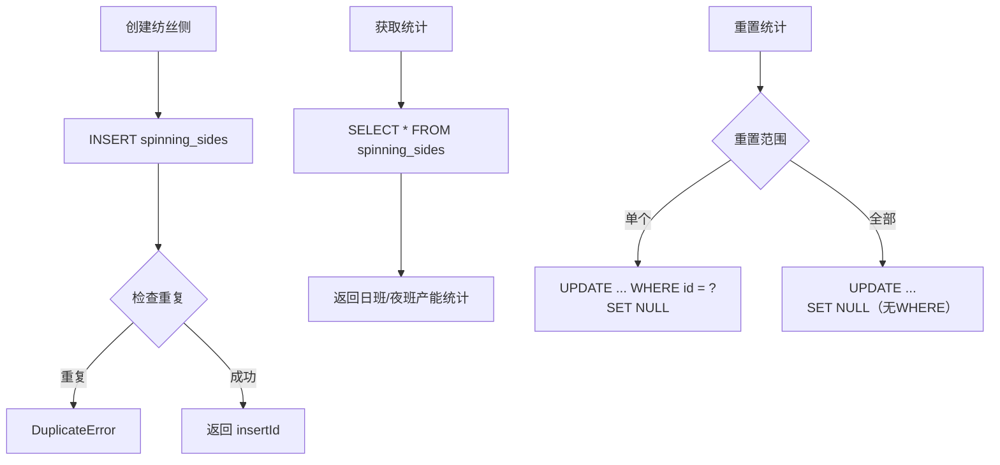

#### 推断表结构

**spinning_sides 表：**

| 字段 | 类型 | 说明 |
|------|------|------|
| id | INT PK | 主键 |
| name | VARCHAR UK | 纺丝侧名称 |
| description | VARCHAR | 描述 |
| spinning_id | INT FK | 所属纺丝机ID |
| settings | JSON | 设置 |
| position_code | VARCHAR | 位置编码 |
| loading_side | VARCHAR | 装载侧 |
| max_modules_per_day_shift | INT | 日班最大模组数 |
| max_modules_per_night_shift | INT | 夜班最大模组数 |
| modules_record_time | DATETIME | 统计记录时间 |
| max_doffings_per_day_shift | INT | 日班最大落纱数 |
| max_doffings_per_night_shift | INT | 夜班最大落纱数 |

---

### 2.15 Winders 卷绕机管理

**文件：** `controllers/winders.js` | `queries/winders.js` | `routes/winders.js`

#### 功能概述

Winders 是只读模块，提供卷绕机列表查询。特别的是，为卷绕机检查系统提供了复杂的字符串解析查询，从卷绕机名称中提取纺丝线前缀。

#### API 端点列表

| 方法 | 路径 | 控制器方法 | 功能 |
|------|------|-----------|------|
| GET | `/` | `getAllWinders` | 获取所有卷绕机 |
| GET | `/for-winder-check` | `getWindersForWinderCheck` | 获取用于检查的卷绕机 |

#### SQL 分析

**getWindersForWinderCheck（复杂字符串解析）：**

```sql
SELECT w.*,
       SUBSTR(w.spinning_line_name, 1,
              LOCATE('-', REPLACE(w.spinning_line_name,
                  SUBSTR(w.spinning_line_name, 1,
                      LOCATE('-', w.spinning_line_name)),
                  '')) +
              LOCATE('-', w.spinning_line_name) - 1
       ) AS line_prefix
FROM winders AS w
WHERE w.spinning_side_id = ?
ORDER BY w.winder_name
```

此查询从 `spinning_line_name` 中提取前缀（第二个 `-` 之前的部分），用于卷绕机检查的分组过滤。

#### 推断表结构

**winders 表：**

| 字段 | 类型 | 说明 |
|------|------|------|
| id | INT PK | 主键 |
| winder_name | VARCHAR | 卷绕机名称 |
| spinning_line_name | VARCHAR | 纺丝线名称 |
| loading_side | VARCHAR | 装载侧 |
| spinning_side_id | INT FK | 纺丝侧ID |

---

### 2.16 WindersCheck 卷绕机检查

**文件：** `controllers/windersCheck.js` | `queries/windersCheck.js` | `routes/windersCheck.js`

#### 功能概述

WindersCheck 实现基于时间段的卷绕机质量检查系统。系统通过时间段（time slot）控制检查窗口，通过规则系统（rules）控制检查行为。当检查规则触发时，纱锭的分拣等级被设为 AAA（code=10）。

#### API 端点列表

| 方法 | 路径 | 控制器方法 | 功能 |
|------|------|-----------|------|
| POST | `/` | `createWinderCheck` | 创建检查记录 |
| GET | `/` | `getAllWinderChecks` | 获取所有检查（分页） |
| GET | `/time-slots` | `getTimeSlots` | 获取时间段 |
| GET | `/rules` | `getRules` | 获取检查规则 |
| PUT | `/rules/:ruleId` | `updateRule` | 更新规则 |
| GET | `/count` | `getWinderCheckCount` | 获取15分钟窗口检查计数 |
| DELETE | `/:winderCheckId` | `deleteWinderCheck` | 删除检查记录 |

#### SQL 分析

**创建检查记录：**

```sql
INSERT INTO winders_check (winders_check_time_slot_id, winder_id, module_number, check_time)
VALUES (?, ?, ?, ?)
```

**时间段匹配查询：**

```sql
SELECT * FROM winders_check_time_slot
WHERE ? BETWEEN start_time AND end_time
```

**15分钟窗口计数（频率限制）：**

```sql
SELECT COUNT(*) AS check_count
FROM winders_check
WHERE winder_id = ?
  AND check_time >= DATE_SUB(NOW(), INTERVAL 15 MINUTE)
```

**规则触发等级更新：**

```sql
-- 当 check_all 或 check_next 规则触发时
UPDATE work_bobbins
SET sorting_grade_id = (SELECT id FROM sorting_grades WHERE code = 10)  -- AAA
WHERE bobbin_id = ?
```

#### 业务流程图

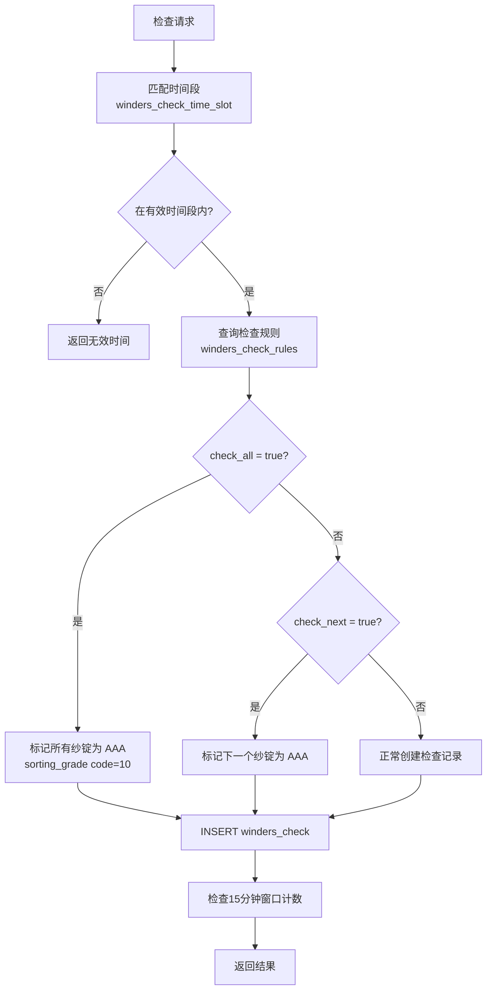

#### 数据流图

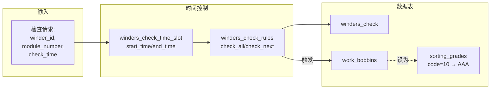

#### 推断表结构

**winders_check 表：**

| 字段 | 类型 | 说明 |
|------|------|------|
| id | INT PK | 主键 |
| winders_check_time_slot_id | INT FK | 时间段ID |
| winder_id | INT FK | 卷绕机ID |
| module_number | INT | 模组编号 |
| check_time | DATETIME | 检查时间 |

**winders_check_time_slot 表：**

| 字段 | 类型 | 说明 |
|------|------|------|
| id | INT PK | 主键 |
| start_time | TIME | 开始时间 |
| end_time | TIME | 结束时间 |

**winders_check_rules 表：**

| 字段 | 类型 | 说明 |
|------|------|------|
| id | INT PK | 主键 |
| winder_id | INT FK | 卷绕机ID |
| check_all | TINYINT | 全检标志 |
| check_next | TINYINT | 检下一个标志 |

---

### 2.17 WorkBobbins 工作纱锭管理

**文件：** `controllers/workBobbins.js` | `queries/workBobbins.js` | `routes/workBobbins.js`

#### 功能概述

WorkBobbins 是**数据最复杂**的业务模块，管理单个纱锭的完整生命周期——从生产到装载、分拣、称重、码垛、降级、追踪。每个纱锭关联多个等级维度（分拣等级、重量等级、最终等级、视觉等级、针织等级）和缺陷记录。

#### API 端点列表

| 方法 | 路径 | 控制器方法 | 功能 |
|------|------|-----------|------|
| POST | `/` | `createBobbin` | 创建纱锭 |
| GET | `/` | `getAllBobbins` | 获取所有纱锭（分页） |
| GET | `/get-by-module` | `getBobbinsByModule` | 按模组获取纱锭 |
| GET | `/get-bobbins-for-weighting` | `getBobbinsForWeighting` | 获取待称重纱锭 |
| GET | `/get-bobbins-by-lot` | `workBobbinsPerLot` | 按批次获取纱锭 |
| GET | `/tracking/:bobbinId` | `getWorkBobbinTrackingData` | 纱锭全生命周期追踪 |
| GET | `/:bobbinId` | `getBobbin` | 获取单个纱锭 |
| PUT | `/:bobbinId` | `updateBobbin` | 更新纱锭 |
| DELETE | `/:bobbinId` | `deleteBobbin` | 删除纱锭 |
| POST | `/loadingBobbins` | `updateLoadingBobbin` | FDY 装载纱锭 |
| POST | `/load-dty-bobbins` | `loadDtyBobbins` | DTY 装载纱锭 |
| POST | `/changeBobbinGrade` | `changeBobbinsGrade` | 修改纱锭等级 |
| GET | `/changeBobbinGrade` | `getBobbinsGradeToModify` | 获取待修改等级纱锭 |
| POST | `/print-by-trolley` | `printBobbinsByTrolley` | 按推车打印 |
| GET | `/:bobbinId/print` | `printBobbin` | 打印单个纱锭 |
| GET | `/:doffingId/print-by-doffing` | `printBobbinsByDoffing` | 按落纱打印 |
| POST | `/update-after-sorting` | `updateAfterSorting` | 分拣后更新 |
| POST | `/print-by-module` | `printBobbinsByModule` | 按模组打印 |
| POST | `/print-by-module-zebra` | `printBobbinsByModuleZebra` | 按模组打印（Zebra 格式） |
| POST | `/update-after-scales` | `updateAfterScales` | 称重后更新 |
| POST | `/update-after-weighting` | `updateAfterWeighting` | 加权后更新 |
| POST | `/put-on-pallet` | `putBobbinsOnPallet` | 纱锭上托盘 |
| PUT | `/degrade-bobbins` | `degradeBobbins` | 降级纱锭 |

#### SQL 分析

**updateLoadingBobbin（FDY 装载 — 存储过程）：**

```sql
CALL load_bobbins(
    @module_number, @doffing_id, @loading_side,
    @spinning_side_id, @bobbin_data_json
)
```

**loadDtyBobbins（DTY 装载 — 同一存储过程）：**

```sql
CALL load_bobbins(
    @module_number, @doffing_id, @loading_side,
    @spinning_side_id, @bobbin_data_json
)
```

**updateAfterSorting（分拣后批量更新 — 24 位置）：**

控制器遍历 24 个位置，每个位置执行：

```sql
-- 更新分拣等级
UPDATE work_bobbins
SET sorting_grade_id = ?, defect_id = ?
WHERE bobbin_id = ?

-- 更新预缺陷纱锭
INSERT INTO pre_defect_bobbins (bobbin_id, defect_id) VALUES (?, ?)
ON DUPLICATE KEY UPDATE defect_id = VALUES(defect_id)

-- 更新模组分拣结束时间
UPDATE modules SET sorting_end_time = NOW() WHERE id = ?
```

**updateAfterScales（称重后更新 — statusPins 逻辑）：**

```javascript
for (const pin of statusPins) {
    if (pin.status === 0) {
        // 删除纱锭（不合格）
        await queries.deleteBobbin(pin.bobbin_id);
    } else if (pin.status === 1) {
        // 更新纱锭等级和重量
        await queries.updateBobbinAfterScales(pin);
    }
}
```

```sql
-- status=1 时更新
UPDATE work_bobbins
SET sorting_grade_id = ?, vision_grade_id = ?,
    defect_id = ?, vision_defect_id = ?,
    weight = ?, to_weight = 0
WHERE bobbin_id = ?
```

**putBobbinsOnPallet（上托盘 — 两步操作）：**

```sql
-- 步骤1: 移入托盘表
INSERT INTO pallet_bobbins (bobbin_id, pallet_id, position, ...)
SELECT bobbin_id, ?, place, ...
FROM work_bobbins
WHERE bobbin_id IN (?)

-- 步骤2: 从工作表删除
DELETE FROM work_bobbins WHERE bobbin_id IN (?)
```

**getWorkBobbinTrackingData（全生命周期追踪 — 大型 UNION 查询）：**

```sql
-- 从 work_bobbins UNION bobbins 合并查找纱锭
-- JOIN modules, doffings, lots, paper_tube_colors, winders
-- JOIN pallets, orders, sortings, warehouse_movements
-- 完整追踪从生产到出库的每个节点
SELECT wb.*, m.number AS module_number,
       d.winder_name, d.spinning_line_name,
       l.code AS lot_code,
       ptc.color1, ptc.color2,
       p.code AS pallet_code,
       o.code AS order_code,
       s.name AS sorting_name,
       wm.movement_type, wm.timestamp AS movement_time
FROM (
    SELECT * FROM work_bobbins WHERE bobbin_id = ?
    UNION ALL
    SELECT * FROM bobbins WHERE bobbin_id = ?
) AS wb
LEFT JOIN modules AS m ON ...
LEFT JOIN doffings AS d ON wb.doffing_id = d.id
LEFT JOIN lots AS l ON d.lot_id = l.id
LEFT JOIN paper_tube_colors AS ptc ON l.paper_tube_color_id = ptc.id
LEFT JOIN winders AS w ON d.winder_id = w.id
LEFT JOIN pallets AS p ON ...
LEFT JOIN orders AS o ON ...
LEFT JOIN sortings AS s ON ...
LEFT JOIN warehouse_movements AS wm ON ...
```

**printBobbinsByModule（模组打印 — 装载顺序）：**

```sql
SELECT wb.*, lbs.loading_bobbins_sequence,
       m.number AS module_number,
       d.winder_name, l.code AS lot_code,
       ptc.color1, ptc.color2,
       ptc.specification_china, ptc.specification_export
FROM work_bobbins AS wb
JOIN modules AS m ON wb.doffing_id IN (m.doffing1_id, m.doffing2_id)
LEFT JOIN loading_bobbins_sequence AS lbs ON lbs.place = wb.place
JOIN doffings AS d ON wb.doffing_id = d.id
JOIN lots AS l ON d.lot_id = l.id
JOIN paper_tube_colors AS ptc ON l.paper_tube_color_id = ptc.id
WHERE m.number = ?
ORDER BY lbs.loading_bobbins_sequence
```

#### 业务流程图

```mermaid
flowchart TD
    A[纱锭生产] --> B[创建纱锭记录<br>POST /]
    B --> C[FDY/DTY 装载<br>CALL load_bobbins]

    C --> D[分拣工序<br>POST /update-after-sorting]
    D --> E[遍历 24 个位置]
    E --> F[更新 sorting_grade_id<br>+ defect_id]
    F --> G[更新 pre_defect_bobbins]
    G --> H[更新 modules.sorting_end_time]

    H --> I[称重工序<br>POST /update-after-scales]
    I --> J{statusPins 状态}
    J -->|status=0| K[删除不合格纱锭]
    J -->|status=1| L[更新等级和重量]

    L --> M[加权计算<br>POST /update-after-weighting]

    M --> N[码垛上盘<br>POST /put-on-pallet]
    N --> O[INSERT pallet_bobbins]
    O --> P[DELETE work_bobbins]

    Q[降级操作<br>PUT /degrade-bobbins] --> R[批量更新<br>final_grade_id]

    S[生命周期追踪<br>GET /tracking/:id] --> T[UNION work_bobbins + bobbins]
    T --> U[多表 JOIN 完整追踪链]
```

#### 数据流图

```mermaid
flowchart LR
    subgraph 纱锭生命周期
        Create[创建]
        Load[装载]
        Sort[分拣]
        Scale[称重]
        Weight[加权]
        Pallet[码垛]
        Archive[归档]
    end

    subgraph 等级系统
        SG[sorting_grades 分拣等级]
        WG[weight_grades 重量等级]
        FG[final_grades 最终等级]
        VG[vision_grades 视觉等级]
        KG[knitting_grades 针织等级]
    end

    subgraph 数据表
        WB[work_bobbins]
        BB[bobbins]
        PB[pallet_bobbins]
        DF[doffings]
        MD[modules]
        LT[lots]
        PTC[paper_tube_colors]
        DEF[defects]
        PDB[pre_defect_bobbins]
        LBS[loading_bobbins_sequence]
        PLT[pallets]
        TRL[trolleys]
    end

    Create --> WB
    Load --> WB
    Sort --> WB
    Sort --> PDB
    Scale --> WB
    Weight --> WB
    Pallet --> PB
    Pallet -.->|DELETE| WB
    Archive --> BB

    WB -.-> SG
    WB -.-> WG
    WB -.-> FG
    WB -.-> VG
    WB -.-> KG
    WB -.-> DEF
    WB -.-> DF
    DF -.-> LT
    LT -.-> PTC
    WB -.-> MD
    PB -.-> PLT
```

#### 推断表结构

**work_bobbins 表：**

| 字段 | 类型 | 说明 |
|------|------|------|
| bobbin_id | VARCHAR PK | 纱锭ID（主键） |
| bobbin_id_plc | VARCHAR | PLC 纱锭ID |
| doffing_id | INT FK | 落纱ID |
| position_id | INT FK | 位置ID |
| place | INT | 位置号 |
| place_in_winder | INT | 卷绕机内位置 |
| sorting_grade_id | INT FK | 分拣等级ID |
| weight_grade_id | INT FK | 重量等级ID |
| final_grade_id | INT FK | 最终等级ID |
| vision_grade_id | INT FK | 视觉等级ID |
| knitting_grade_id | INT FK | 针织等级ID |
| defect_id | INT FK | 缺陷ID |
| vision_defect_id | INT FK | 视觉缺陷ID |
| to_weight | TINYINT | 待称重标志 |
| weight | DECIMAL | 重量值 |
| plant_area_code | VARCHAR | 厂区编码 |
| created | DATETIME | 创建时间 |
| modified | DATETIME | 修改时间 |

---

## 3. 生产管理总流程

### 3.1 总流程图

```mermaid
flowchart TB
    subgraph 1_订单计划["① 订单计划"]
        OG[OrderGrades<br>定义等级] --> O[Orders<br>创建订单]
        OQ[OrdersQueue<br>排队预分配] --> O
    end

    subgraph 2_批次配置["② 批次配置"]
        LP[LotPrefixes<br>前缀字典] --> L[Lots<br>创建批次]
        LW[LotWeights<br>重量标准] --> L
        L --> |type: fdy/poy| TypeSplit{FDY / POY}
    end

    subgraph 3_设备管理["③ 设备准备"]
        SP[Spinnings<br>纺丝机] --> SS[SpinningSides<br>纺丝侧]
        SL[SpinningLines<br>纺丝线] --> SS
        W[Winders<br>卷绕机] --> SS
    end

    subgraph 4_生产执行["④ 生产执行"]
        SS --> DF[Doffings<br>落纱操作]
        L --> DF
        DF --> CY[Cycles<br>周期追踪]
        DF --> DA[DailyBobbins<br>日统计]
    end

    subgraph 5_物流处理["⑤ 物流处理"]
        DF --> WB[WorkBobbins<br>纱锭管理]
        WB --> MD[Modules<br>模组管理]
        MD --> MS[ModulesStatus<br>状态追踪]
        WB --> |分拣| Sort[分拣工序]
        Sort --> |称重| Scale[称重工序]
        Scale --> |码垛| Pallet[码垛入库]
    end

    subgraph 6_质量控制["⑥ 质量控制"]
        WC[WindersCheck<br>卷绕机检查] --> WB
        Sort --> |等级评定| Grade[多维等级系统]
    end

    O --> L
    TypeSplit --> |FDY| FDY_Flow[FDY 全拉伸丝流程]
    TypeSplit --> |POY| POY_Flow[POY 预取向丝流程]
    FDY_Flow --> DF
    POY_Flow --> DF
    MS --> OQ
```

### 3.2 系统数据表关系全景

```mermaid
erDiagram
    orders ||--o{ lots : "关联"
    orders }o--|| order_grades : "等级"
    orders }o--|| palletizers : "码垛机"
    orders_queue }o--|| orders : "链接"
    orders_queue ||--o{ orders_queue_modules : "包含"
    orders_queue_modules }o--|| modules_status : "引用"

    lots ||--o{ lot_weights : "重量定义"
    lots ||--o{ lot_grades_ranges : "等级范围"
    lots }o--|| paper_tube_colors : "纸管颜色"
    lots }o--|| lot_prefixes : "前缀"

    doffings }o--|| lots : "属于"
    doffings }o--|| winders : "卷绕机"
    doffings }o--|| spinning_sides : "纺丝侧"

    modules }o--|| doffings : "doffing1_id"
    modules }o--|| doffings : "doffing2_id"
    modules ||--o{ modules_tracking : "追踪"
    modules_tracking }o--|| monorail_sections : "区段"

    modules_status }o--|| modules : "编号"
    modules_status }o--|| lots : "批次"
    modules_status }o--|| warehouses : "仓库"
    modules_status }o--|| monorails : "单轨"

    work_bobbins }o--|| doffings : "落纱"
    work_bobbins }o--|| positions : "位置"
    work_bobbins }o--|| sorting_grades : "分拣等级"
    work_bobbins }o--|| weight_grades : "重量等级"
    work_bobbins }o--|| final_grades : "最终等级"
    work_bobbins }o--|| vision_grades : "视觉等级"
    work_bobbins }o--|| knitting_grades : "针织等级"
    work_bobbins }o--|| defects : "缺陷"

    spinning_sides }o--|| spinnings : "纺丝机"
    winders }o--|| spinning_sides : "纺丝侧"
    winders_check }o--|| winders : "卷绕机"
    winders_check }o--|| winders_check_time_slot : "时间段"
    winders_check_rules }o--|| winders : "卷绕机"

    pallet_bobbins }o--|| pallets : "托盘"
```

---

## 4. 订单→批次→周期→落纱 业务链

### 4.1 完整业务链流程图

```mermaid
flowchart TB
    subgraph 订单层_Order["订单层 (Order)"]
        O1[创建订单 Orders]
        O2[定义等级 OrderGrades]
        O3[排队预分配 OrdersQueue]
        O1 ---|"bobbins = pallets × level × 9"| O4[计算纱锭需求]
    end

    subgraph 批次层_Lot["批次层 (Lot)"]
        L1[创建批次 Lots]
        L2[设置前缀 LotPrefixes]
        L3[定义重量 LotWeights]
        L4[设置等级范围 lot_grades_ranges]
        L1 --> L5{批次类型}
        L5 -->|FDY| L6[全拉伸丝批次]
        L5 -->|POY| L7[预取向丝批次]
    end

    subgraph 周期层_Cycle["周期层 (Cycle)"]
        C1[落纱机周期 doffers_cycles]
        C2[仓库周期 warehouses_cycles]
        C3[码垛机周期 palletizers_cycles]
        C4[MIN/AVG 统计分析]
        C1 --> C4
        C2 --> C4
        C3 --> C4
    end

    subgraph 落纱层_Doffing["落纱层 (Doffing)"]
        D1[License 校验]
        D2[manage_doffing 存储过程]
        D3[创建落纱记录]
        D4[纱锭上架 putBobbinsOnWarehouse]
        D5[小时产量统计 hourly_production]
        D1 --> D2 --> D3
        D3 --> D4
        D3 --> D5
    end

    subgraph 纱锭层_Bobbin["纱锭层 (WorkBobbin)"]
        B1[load_bobbins 存储过程]
        B2[分拣 updateAfterSorting]
        B3[称重 updateAfterScales]
        B4[加权 updateAfterWeighting]
        B5[码垛 putBobbinsOnPallet]
        B6[降级 degradeBobbins]
        B7[追踪 trackingData]
        B1 --> B2 --> B3 --> B4 --> B5
    end

    O1 --> L1
    O4 --> L1
    L6 --> D2
    L7 --> D2
    D3 --> B1
    D3 --> C1
    B5 --> |"移入 pallet_bobbins<br>删除 work_bobbins"| Archive[纱锭归档]
```

### 4.2 业务链数据流

```mermaid
flowchart LR
    subgraph 订单数据
        OrderCode[order_code]
        BobbinsAmt[bobbins_amount]
        OrderGrade[order_grade_id]
    end

    subgraph 批次数据
        LotCode[lot_code]
        LotType[type: fdy/poy]
        PaperTube[paper_tube_color]
        WaitTime[wait_time]
        PackingLock[packing_lock]
    end

    subgraph 落纱数据
        DoffNo[doff_no]
        WinderName[winder_name]
        YarnType[yarn_type]
        TeamTurn[team_turn]
    end

    subgraph 纱锭数据
        BobbinId[bobbin_id]
        SortGrade[sorting_grade]
        WeightGrade[weight_grade]
        FinalGrade[final_grade]
        VisionGrade[vision_grade]
        KnittingGrade[knitting_grade]
        Weight[weight]
        Defect[defect_id]
    end

    OrderCode --> LotCode
    BobbinsAmt --> LotCode
    OrderGrade --> LotCode
    LotCode --> DoffNo
    LotType --> DoffNo
    PaperTube --> DoffNo
    DoffNo --> BobbinId
    WinderName --> BobbinId
    YarnType --> BobbinId
```

### 4.3 状态流转细节

**订单状态：**
```
to-start → started → completed
```

**批次控制：**
```
visible: 0/1 （可见性）
packing_lock: 0/1 （打包锁定）
end_lot: 0/1 （批次结束）
```

**模组状态码：**
```
status = 2 → 在仓库
after_knitting = 1 → 已经过针织
after_knitting_confirm = 1 → 针织已确认
to_be_taken = 1 → 待取用
place_disabled = 1 → 位置禁用
```

**纱锭生命周期：**
```
work_bobbins（在产） → pallet_bobbins（已码垛） → bobbins（已归档）
```

---

## 5. 发现的问题与设计模式

### 5.1 安全问题

| 严重程度 | 位置 | 问题 | 说明 |
|----------|------|------|------|
| 🔴 **高危** | `queries/dailyBobbinsAmounts.js` | **SQL 注入漏洞** | `spinningSideId` 使用字符串插值 `${spinningSideId}` 直接拼入 SQL，未使用参数化查询 `?` 占位符。攻击者可通过该参数注入恶意 SQL。 |
| 🟡 **中等** | 多处 controllers | **filtersQuery 注入风险** | `makeFiltersQuery` 生成的 SQL 片段直接拼入查询字符串，若过滤器验证不严格可能导致 SQL 注入。 |

### 5.2 代码质量问题

| 严重程度 | 位置 | 问题 | 说明 |
|----------|------|------|------|
| 🟡 | `queries/lotWeights.js` | **函数命名错误** | `createLot` 应为 `createLotWeight`，`getLot` 应为 `getLotWeight` 等，7个函数命名不规范。 |
| 🟡 | `controllers/spinnings.js` | **残留代码** | 控制器验证 `spinning.host` 和 `spinning.port`，但数据对象中不含这些字段。 |
| 🟡 | `queries/spinningSides.js` | **变量遮蔽** | `catch` 块内 `let error = new DuplicateError(...)` 遮蔽了外层的 `error` 参数，非重复键错误会丢失原始错误信息。 |
| 🟢 | `controllers/modules.js` | **N+1 查询** | `updateSingleModuleGrade` 在循环中对24个纱锭逐个执行 UPDATE，应使用批量 UPDATE。 |
| 🟢 | `controllers/workBobbins.js` | **N+1 查询** | `updateAfterSorting` 同样在循环中对24个位置逐个执行 UPDATE。 |

### 5.3 架构设计模式

| 模式 | 应用位置 | 说明 |
|------|----------|------|
| **存储过程封装** | Doffings, WorkBobbins, Modules | `manage_doffing`、`manage_negative_doffing`、`load_bobbins` 将复杂的业务逻辑封装在数据库层 |
| **ON DUPLICATE KEY UPDATE** | Lots, Cycles | 实现 upsert 语义，避免先查后插的竞态条件 |
| **CTE (WITH 子句)** | Orders, ModulesStatus | 使用 CTE 简化复杂的多条件筛选查询 |
| **窗口函数分页** | 全部模块 | `COUNT(*) OVER() AS total_count` 避免额外的 COUNT 查询 |
| **事务编排** | Lots, OrdersQueue | 控制器层使用 `db.transaction` 保证多表操作的原子性 |
| **UNION 合并查询** | DailyBobbins, WorkBobbins | 合并在产表和归档表的数据 |
| **双查询策略** | Modules.printModule | 同一功能提供两种查询路径（按ID / 按组合键） |
| **License 中间件** | Doffings | 生产关键操作受 license 保护 |
| **自定义错误类** | 全部模块 | `NotFoundError` 和 `DuplicateError` 提供语义化错误处理 |
| **camelCase ↔ snake_case** | 全部模块 | API 层和数据库层的命名规范转换 |

### 5.4 业务特色

| 特色 | 说明 |
|------|------|
| **纸管颜色系统** | 通过 `color1` + `color2` 双色组合标识产品类型，纸管颜色关联到批次、反映在 UI 和打印标签上 |
| **多维等级体系** | 5 个等级维度（sorting, weight, final, vision, knitting）独立评定，支持精细的质量控制 |
| **FDY/POY 双轨制** | 全拉伸丝和预取向丝使用不同的生产流程和仓库管理逻辑 |
| **24 位纱锭模组** | 每个模组固定承载 24 个纱锭，分拣和称重都按 24 位批量处理 |
| **单轨追踪系统** | 通过 monorail + sections 追踪模组在工厂内的物理移动路径 |
| **时间段检查系统** | 卷绕机检查限制在特定时间段内，15 分钟窗口频率限制，支持全检/跳检规则 |
| **装载顺序系统** | `loading_bobbins_sequence` 定义纱锭在模组中的装载物理顺序 |
| **三套并行周期** | doffer/warehouse/palletizer 各自独立的周期定义和统计 |

### 5.5 改进建议

1. **紧急修复 SQL 注入：** `dailyBobbinsAmounts.js` 中的 `${spinningSideId}` 必须改为参数化查询 `?`
2. **批量 UPDATE 优化：** `updateSingleModuleGrade` 和 `updateAfterSorting` 应使用 `CASE WHEN` 批量更新替代循环 UPDATE
3. **函数命名修正：** `lotWeights.js` 中的函数名应与模块名一致
4. **移除残留代码：** `spinnings.js` 中的 host/port 验证逻辑应清理
5. **修复变量遮蔽：** `spinningSides.js` 中 catch 块的 error 重声明应改为不同变量名
6. **统一错误处理：** 部分模块的 catch 仅 `throw error`，无附加信息，可简化
7. **增加输入验证：** 多处端点缺乏对输入参数的类型和范围验证

---

> **分析总结：** O17003 生产管理模块涵盖了从订单计划到纱锭归档的完整生产链路，17 个模块共 51 个源文件、约 100+ 个 API 端点。系统采用 Node.js + Express + MySQL 技术栈，通过存储过程封装核心业务逻辑，窗口函数优化分页查询。FDY/POY 双轨制和多维等级体系反映了化纤纺织行业的特殊业务需求。主要风险点在于 SQL 注入漏洞和 N+1 查询性能问题。
