# O17003 物流·质检·DTY 业务模块深度源码分析

> **分析对象:** 第二版本 O17003 应用 — `extracted_app/src/` 下 35 个业务模块
> **分析日期:** 2026-09-17
> **分析范围:** controllers + queries + routes 三层源码逐行解读
> **技术栈:** Node.js + Express + MySQL (MariaDB) + Electron 桌面壳

---

## 目录

- [一、架构概览](#一架构概览)
- [二、物流仓储模块](#二物流仓储模块)
  - [2.1 pallets - 托盘管理](#21-pallets---托盘管理)
  - [2.2 palletizers - 码垛机](#22-palletizers---码垛机)
  - [2.3 positions - 位置管理](#23-positions---位置管理)
  - [2.4 positionTypes - 位置类型](#24-positiontypes---位置类型)
  - [2.5 movements - 物料移动](#25-movements---物料移动)
  - [2.6 monorails - 单轨运输](#26-monorails---单轨运输)
  - [2.7 trolleys - 小车管理](#27-trolleys---小车管理)
  - [2.8 warehouses - 仓库管理](#28-warehouses---仓库管理)
- [三、质量检测模块](#三质量检测模块)
  - [3.1 defects - 缺陷管理](#31-defects---缺陷管理)
  - [3.2 preDefectBobbins - 预检缺陷筒子](#32-predefectbobbins---预检缺陷筒子)
  - [3.3 sortings - 分拣配置](#33-sortings---分拣配置)
  - [3.4 sortingGrades - 分拣等级](#34-sortinggrades---分拣等级)
  - [3.5 finalGrades - 最终等级](#35-finalgrades---最终等级)
  - [3.6 visionGrades - 视觉检测等级](#36-visiongrades---视觉检测等级)
  - [3.7 weightGrades - 重量等级](#37-weightgrades---重量等级)
  - [3.8 weighingRules - 称重规则](#38-weighingrules---称重规则)
  - [3.9 knittings - 针织检测](#39-knittings---针织检测)
  - [3.10 knittingGrades - 针织等级](#310-knittinggrades---针织等级)
  - [3.11 knittingOrders - 针织订单](#311-knittingorders---针织订单)
- [四、DTY后处理模块](#四dty后处理模块)
  - [4.1 dty - DTY总控](#41-dty---dty总控)
  - [4.2 dtyBobbins - DTY筒子](#42-dtybobbins---dty筒子)
  - [4.3 dtyBoxes - DTY箱子](#43-dtyboxes---dty箱子)
  - [4.4 dtyOrders - DTY订单](#44-dtyorders---dty订单)
  - [4.5 dtyPallets - DTY托盘](#45-dtypallets---dty托盘)
  - [4.6 dtyWarehouseOrders - DTY仓库订单](#46-dtywarehouseorders---dty仓库订单)
  - [4.7 dtyWorkBobbins - DTY工作筒子](#47-dtyworkbobbins---dty工作筒子)
- [五、其他支撑模块](#五其他支撑模块)
  - [5.1 erpBobbins - ERP筒子集成](#51-erpbobbins---erp筒子集成)
  - [5.2 erpPallets - ERP托盘集成](#52-erppallets---erp托盘集成)
  - [5.3 paperTubeColors - 纸管颜色](#53-papertubecolors---纸管颜色)
  - [5.4 printServers - 打印服务](#54-printservers---打印服务)
  - [5.5 notifications - 通知](#55-notifications---通知)
  - [5.6 clientsSupervisionSettings - 客户监控设置](#56-clientssupervisionsettings---客户监控设置)
  - [5.7 licenses - 许可证](#57-licenses---许可证)
  - [5.8 settings - 系统设置](#58-settings---系统设置)
  - [5.9 status - 状态管理](#59-status---状态管理)
- [六、汇总流程图](#六汇总流程图)
  - [6.1 物流总流程图](#61-物流总流程图)
  - [6.2 质检总流程图](#62-质检总流程图)
  - [6.3 DTY后处理总流程图](#63-dty后处理总流程图)
  - [6.4 ERP集成流程图](#64-erp集成流程图)
- [七、发现的问题和模式](#七发现的问题和模式)

---

## 一、架构概览

### 应用架构

O17003 是一个 **Electron 桌面应用 + Express REST API 服务** 的混合体，运行在工厂现场服务器上。

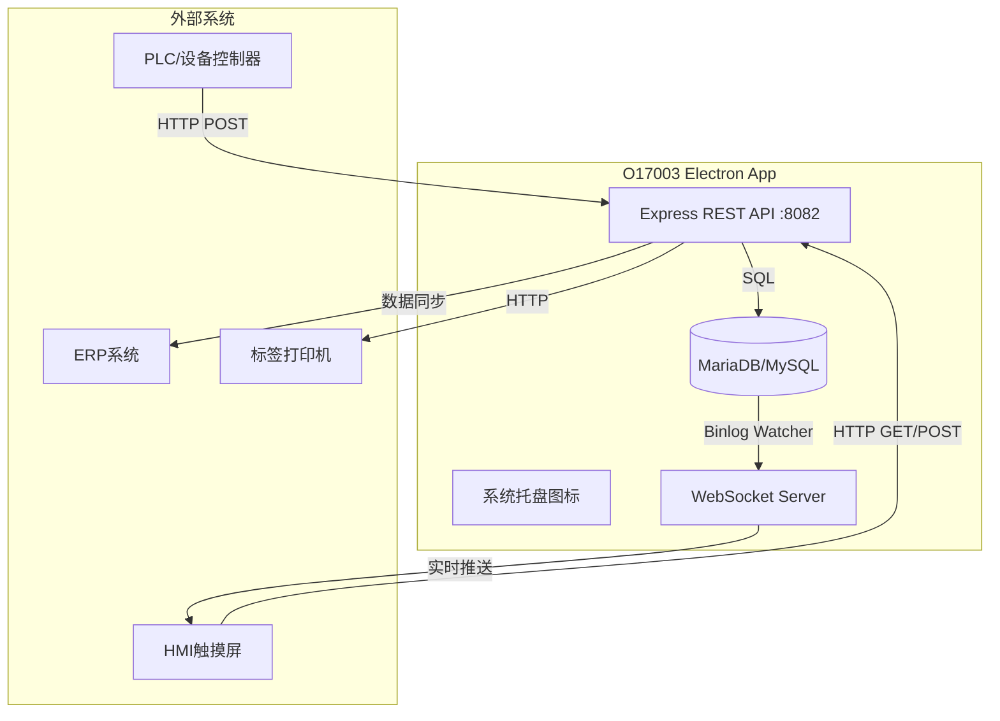
```mermaid
graph TB
    subgraph "O17003 Electron App"
        TRAY[系统托盘图标]
        EXPRESS[Express REST API :8082]
        WSS[WebSocket Server]
        DB[(MariaDB/MySQL)]
    end

    subgraph "外部系统"
        PLC[PLC/设备控制器]
        ERP[ERP系统]
        PRINT[标签打印机]
        HMI[HMI触摸屏]
    end

    PLC -->|HTTP POST| EXPRESS
    HMI -->|HTTP GET/POST| EXPRESS
    EXPRESS -->|SQL| DB
    DB -->|Binlog Watcher| WSS
    WSS -->|实时推送| HMI
    EXPRESS -->|HTTP| PRINT
    EXPRESS -->|数据同步| ERP
```

### 路由挂载映射

| 路由前缀 | 模块 | 业务域 |
|----------|------|--------|
| `/pallets` | pallets | 物流仓储 |
| `/palletizers` | palletizers | 物流仓储 |
| `/positions` | positions | 物流仓储 |
| `/position-types` | positionTypes | 物流仓储 |
| `/movements` | movements | 物流仓储 |
| `/monorails` | monorails | 物流仓储 |
| `/trolleys` | trolleys | 物流仓储 |
| `/warehouses` | warehouses | 物流仓储 |
| `/defects` | defects | 质量检测 |
| `/pre-defect-bobbins` | preDefectBobbins | 质量检测 |
| `/sortings` | sortings | 质量检测 |
| `/sorting-grades` | sortingGrades | 质量检测 |
| `/final-grades` | finalGrades | 质量检测 |
| `/vision-grades` | visionGrades | 质量检测 |
| `/weight-grades` | weightGrades | 质量检测 |
| `/weighing-rules` | weighingRules | 质量检测 |
| `/knittings` | knittings | 质量检测 |
| `/knitting-grades` | knittingGrades | 质量检测 |
| `/knitting-orders` | knittingOrders | 质量检测 |
| `/dty` | dty | DTY后处理 |
| `/dty-bobbins` | dtyBobbins | DTY后处理 |
| `/dty-boxes` | dtyBoxes | DTY后处理 |
| `/dty-orders` | dtyOrders | DTY后处理 |
| `/dty-pallets` | dtyPallets | DTY后处理 |
| `/dty-warehouse-orders` | dtyWarehouseOrders | DTY后处理 |
| `/erp-bobbins` | erpBobbins | ERP集成 |
| `/erp-pallets` | erpPallets | ERP集成 |
| `/paper-tube-colors` | paperTubeColors | 基础数据 |
| `/print-servers` | printServers | 基础设施 |
| `/notifications` | notifications | 基础设施 |
| `/clients-supervision-settings` | clientsSupervisionSettings | 基础设施 |
| `/licenses` | licenses | 基础设施 |
| `/settings` | settings | 基础设施 |
| `/status` | status | 设备监控 |

### 通用技术模式

- **数据库:** 使用 `net.hivetechnology.db` 封装的 MySQL 连接池，支持事务 (`db.transaction`)
- **分页:** 使用 `net.hivetechnology.pagination` 中间件，SQL 中用 `COUNT(*) OVER()` 窗口函数获取总数
- **认证:** 使用 `net.hivetechnology.auth` 的 simple 认证模式
- **错误处理:** 自定义 `NotFoundError` / `DuplicateError` / `PermissionDeniedError`
- **WebSocket:** 监听 `lots` 和 `notifications` 表的 MySQL binlog，实时推送变更事件
- **字段映射:** snake_case (DB) → camelCase (API) 手动映射

---

## 二、物流仓储模块

### 2.1 pallets - 托盘管理

**功能概述:** 管理丝饼码垛后的托盘全生命周期：创建、RFID绑定、标签打印、丝饼明细查询、码垛机产量统计，以及托盘在码垛机各分段工位的流转追踪记录。

**API接口清单:**

| Method | Path | Description |
|--------|------|-------------|
| POST | `/` | 创建托盘（需许可证校验） |
| POST | `/tracking` | 创建托盘流转追踪记录 |
| GET | `/` | 分页获取所有托盘 |
| GET | `/tracking` | 分页获取所有流转追踪记录 |
| GET | `/printed` | 分页获取已打印标签的托盘 |
| GET | `/hourly-production` | 获取码垛机每小时产量统计 |
| GET | `/:palletId` | 获取单个托盘详情 |
| PUT | `/:palletId/rfid` | 修改托盘RFID |
| PUT | `/:palletId` | 更新托盘 |
| DELETE | `/:palletId` | 删除托盘 |
| GET | `/:palletId/print` | 获取打印标签信息（刷新贴标时间） |
| GET | `/:palletId/bobbins` | 获取托盘上的丝饼明细 |

**SQL查询分析:**

| 操作 | SQL | 涉及表 | JOIN关系 |
|------|-----|--------|----------|
| 创建 | `INSERT INTO pallets SET ?` | pallets | 无 |
| 幂等处理 | `SELECT id FROM pallets WHERE order_id=? AND pallet_of_order=?` | pallets | 无 |
| 详情查询 | 5表JOIN + 班次子查询 + GET_PALLET_CODE() | pallets, orders, palletizers, lots, paper_tube_colors, order_grades, team_turns | LEFT JOIN |
| 改RFID | 事务: UPDATE pallets + INSERT erp_pallets ON DUPLICATE KEY | pallets, erp_pallets | 无 |
| 打印 | 事务: UPDATE labeling_time + 多表查询 + lot_weights | pallets, orders, lots, paper_tube_colors, order_grades, lot_weights | LEFT JOIN |
| 丝饼明细 | pallet_bobbins LEFT JOIN bobbins LEFT JOIN sorting_grades | pallet_bobbins, bobbins, sorting_grades | LEFT JOIN |
| 产量统计 | palletizers_hourly_production LEFT JOIN palletizers | palletizers_hourly_production, palletizers | LEFT JOIN |
| 流转记录 | pallets_tracking + palletizers_sections + palletizers | pallets_tracking, palletizers_sections, palletizers, pallets, orders, lots | LEFT JOIN |

**业务流程图:**

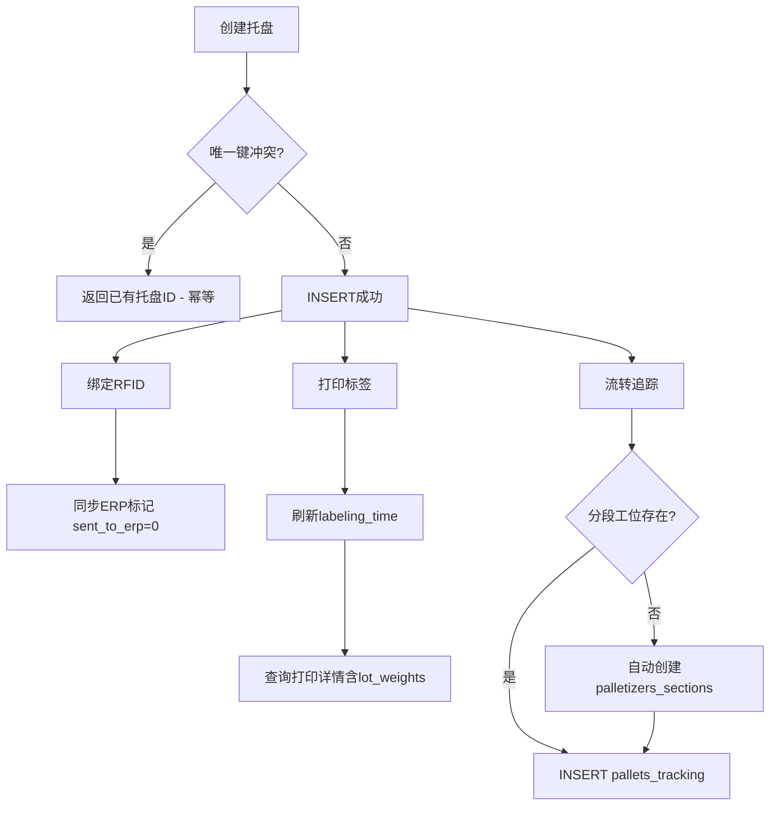
```mermaid
flowchart TD
    A[创建托盘] --> B{唯一键冲突?}
    B -->|是| C[返回已有托盘ID - 幂等]
    B -->|否| D[INSERT成功]
    D --> E[绑定RFID]
    E --> F[同步ERP标记 sent_to_erp=0]
    D --> G[打印标签]
    G --> H[刷新labeling_time]
    H --> I[查询打印详情含lot_weights]
    D --> J[流转追踪]
    J --> K{分段工位存在?}
    K -->|否| L[自动创建palletizers_sections]
    K -->|是| M[INSERT pallets_tracking]
    L --> M
```

**数据流转图:**

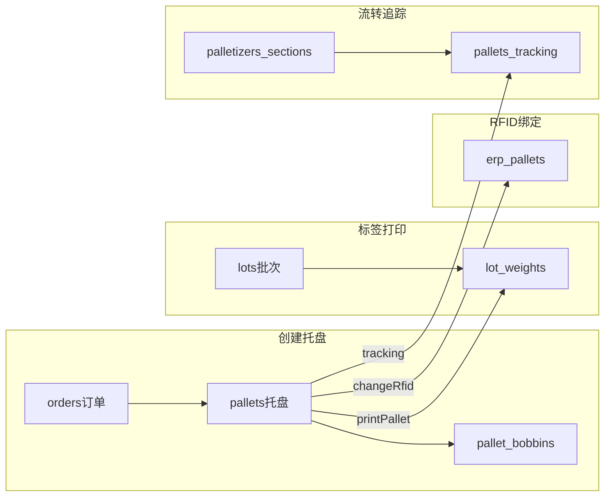
```mermaid
graph LR
    subgraph "创建托盘"
        ORDER[orders订单] --> PALLET[pallets托盘]
        PALLET --> PALLET_BOBBIN[pallet_bobbins]
    end
    subgraph "RFID绑定"
        PALLET --> |changeRfid| ERP_PALLET[erp_pallets]
    end
    subgraph "标签打印"
        PALLET --> |printPallet| LOT_W[lot_weights]
        LOTS[lots批次] --> LOT_W
    end
    subgraph "流转追踪"
        PALLET --> |tracking| TRACK[pallets_tracking]
        PALLETIZER_SEC[palletizers_sections] --> TRACK
    end
```

**关键字段:** `order_id`(订单), `pallet_of_order`(序号), `bobbins_amount`(丝饼数), `rfid`, `labeling_time`(贴标时间), `daily_id`, `team_turn`(班次), `product_date`

---

### 2.2 palletizers - 码垛机

**功能概述:** 码垛机设备主数据CRUD，以及生产统计数据的重置。

**API接口清单:**

| Method | Path | Description |
|--------|------|-------------|
| POST | `/` | 创建码垛机 |
| GET | `/` | 分页获取所有码垛机 |
| GET | `/:palletizerId` | 获取单台码垛机 |
| PUT | `/:palletizerId` | 更新码垛机 |
| DELETE | `/:palletizerId` | 删除码垛机 |
| POST | `/reset/:palletizerId` | 重置单台统计数据 |
| POST | `/reset-all` | 重置所有码垛机统计数据 |

**SQL查询分析:**

| 操作 | SQL | 涉及表 |
|------|-----|--------|
| CRUD | 标准单表操作 | palletizers |
| 重置统计 | `UPDATE SET max_pallets_per_day_shift=NULL, max_pallets_per_night_shift=NULL, pallets_record_time=NULL` | palletizers |

**业务流程图:**

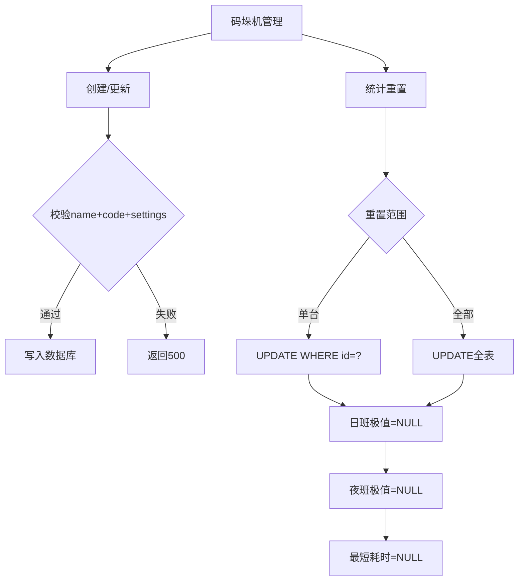
```mermaid
flowchart TD
    A[码垛机管理] --> B[创建/更新]
    A --> C[统计重置]
    B --> D{校验name+code+settings}
    D -->|通过| E[写入数据库]
    D -->|失败| F[返回500]
    C --> G{重置范围}
    G -->|单台| H[UPDATE WHERE id=?]
    G -->|全部| I[UPDATE全表]
    H --> J[日班极值=NULL]
    I --> J
    J --> K[夜班极值=NULL]
    K --> L[最短耗时=NULL]
```

**关键字段:** `code`, `name`, `settings`(JSON配置), `max_pallets_per_day_shift`, `max_pallets_per_night_shift`, `pallets_record_time`, `section`, `monorail_id`, `type`

---

### 2.3 positions - 位置管理

**功能概述:** 全系统通用的位置抽象实体表，通过自关联字段 `position_id` 构建树状层级，支持仓库-货位、小车-锭位等多级位置建模。

**API接口清单:**

| Method | Path | Description |
|--------|------|-------------|
| POST | `/` | 创建位置 |
| GET | `/` | 分页获取所有位置（含position_type信息） |
| GET | `/:positionId` | 获取单个位置 |
| PUT | `/:positionId` | 更新位置 |
| DELETE | `/:positionId` | 删除位置 |

**SQL查询分析:**

| 操作 | SQL | 涉及表 | JOIN关系 |
|------|-----|--------|----------|
| 列表 | `positions p LEFT JOIN position_types pt ON pt.code=p.position_type_code` | positions, position_types | LEFT JOIN ON code |
| 其他 | 标准单表操作 | positions | 无 |

**数据流转图:**

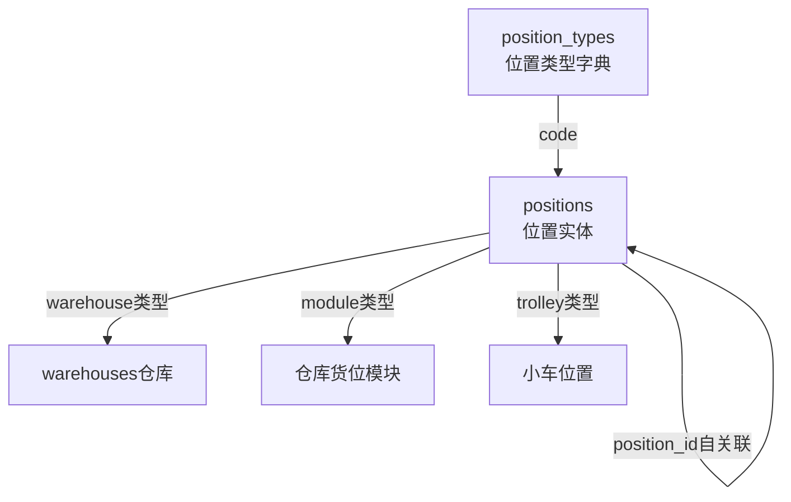
```mermaid
graph TD
    PT[position_types<br/>位置类型字典] -->|code| POS[positions<br/>位置实体]
    POS -->|position_id自关联| POS
    POS -->|warehouse类型| WH[warehouses仓库]
    POS -->|module类型| MOD[仓库货位模块]
    POS -->|trolley类型| TRL[小车位置]
```

**关键字段:** `position_type_code`(类型), `code`, `name`, `places_amount`(容量), `position_id`(父级自关联), `place`/`place_x`/`place_y`/`place_z`(坐标)

---

### 2.4 positionTypes - 位置类型

**功能概述:** `positions.position_type_code` 的字典表，定义系统中存在的位置类型（warehouse, module, trolley 等）。

**API接口清单:**

| Method | Path | Description |
|--------|------|-------------|
| POST | `/` | 创建位置类型 |
| GET | `/` | 分页获取所有位置类型 |
| GET | `/:code` | 获取单个位置类型 |
| PUT | `/:code` | 更新位置类型 |
| DELETE | `/:code` | 删除位置类型 |

**SQL查询分析:** 标准单表CRUD，以 `code` 为业务主键（非自增id）。

**⚠️ 已发现Bug:** `getPositionType`/`deletePositionType` 读取 `req.params.positionTypeCode`，但路由参数名是 `code`，恒为 `undefined`。

---

### 2.5 movements - 物料移动

**功能概述:** 记录丝饼在系统内位置/等级/重量状态变化时的完整快照（old→new），用于追溯与实时监控大屏。仅提供查询接口。

**API接口清单:**

| Method | Path | Description |
|--------|------|-------------|
| GET | `/` | 分页获取所有移动记录 |
| POST | `/last` | 按纺纱线获取最近N条移动记录 |

**SQL查询分析:**

| 操作 | SQL | 涉及表 | JOIN关系 |
|------|-----|--------|----------|
| 全量列表 | `SELECT *, COUNT(*) OVER() FROM movements` | movements | 无JOIN（宽表设计） |
| 最近记录 | 多表JOIN + 四层子查询按纺纱线过滤 | movements, positions×2, defects×2, sorting_grades×2, final_grades×2, weight_grades×2 | LEFT JOIN (old/new各一套) |

**数据流转图:**

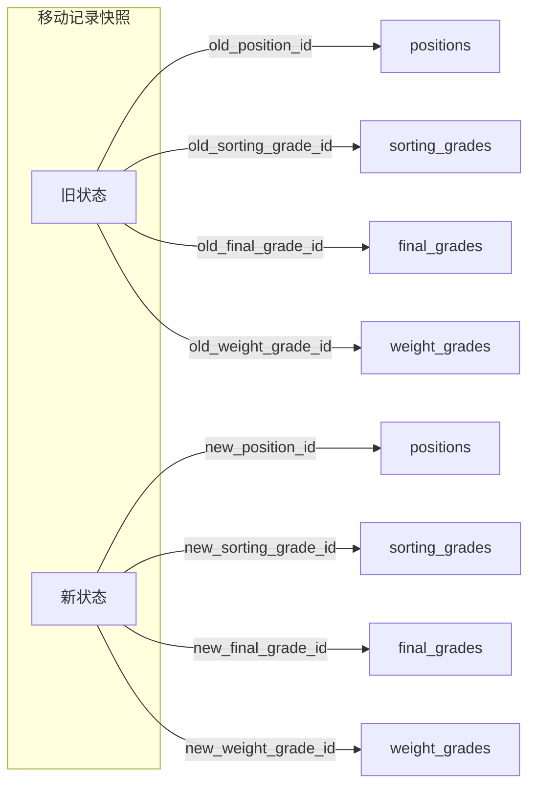
```mermaid
graph LR
    subgraph "移动记录快照"
        OLD[旧状态]
        NEW[新状态]
    end
    OLD --> |old_position_id| POS1[positions]
    NEW --> |new_position_id| POS2[positions]
    OLD --> |old_sorting_grade_id| SG1[sorting_grades]
    NEW --> |new_sorting_grade_id| SG2[sorting_grades]
    OLD --> |old_final_grade_id| FG1[final_grades]
    NEW --> |new_final_grade_id| FG2[final_grades]
    OLD --> |old_weight_grade_id| WG1[weight_grades]
    NEW --> |new_weight_grade_id| WG2[weight_grades]
```

**关键字段:** `bobbin_id`, `timestamp`, `old_*/new_*`(位置/等级/缺陷/重量的前后快照)

---

### 2.6 monorails - 单轨运输

**功能概述:** 空中输送轨道设备主数据的只读查询模块，数据由其他途径维护。

**API接口清单:**

| Method | Path | Description |
|--------|------|-------------|
| GET | `/` | 分页获取所有轨道 |
| GET | `/:monorailId` | 获取单条轨道详情 |

**SQL查询分析:** 单表 `monorails` 查询。`settings` 字段存储 JSON 配置。

**⚠️ 已发现Bug:** `getMonorail` 中 SQL 别名错误（`SELECT s.*` 应为 `SELECT m.*`），该接口当前不可用。

---

### 2.7 trolleys - 小车管理

**功能概述:** 管理丝饼运输小车的全流程：当前在场车辆状态、历史装载记录、标签打印与补打。每辆小车最多同时装载两个落纱记录（A/B两个锭位）。

**API接口清单:**

| Method | Path | Description |
|--------|------|-------------|
| GET | `/currents` | 获取当前在场小车 |
| GET | `/currents/:number` | 获取单个当前小车状态 |
| GET | `/currents/:number/bobbins` | 获取当前小车上的丝饼明细 |
| GET | `/history` | 分页获取小车历史记录 |
| GET | `/printed` | 分页获取已打印标签的小车 |
| GET | `/history/:number` | 获取指定车号的历史记录 |
| PUT | `/reprint-update/:trolleyId` | 标记补打时间 |
| POST | `/print` | 获取打印标签所需信息 |

**SQL查询分析:**

| 操作 | 涉及表 | 特殊逻辑 |
|------|--------|----------|
| 当前小车 | current_trolleys, lots, paper_tube_colors | 实时快照表 |
| 历史记录 | trolleys, doffings×2, winders×2, lots, paper_tube_colors | 双落纱JOIN（A/B面） |
| 小车丝饼 | current_trolleys, work_bobbins, positions, defects, sorting/final/weight_grades | 小车=position(type=trolley) |
| 标签打印 | trolleys | 支持按ID或车号+纺纱侧两种查询模式 |

**业务流程图:**

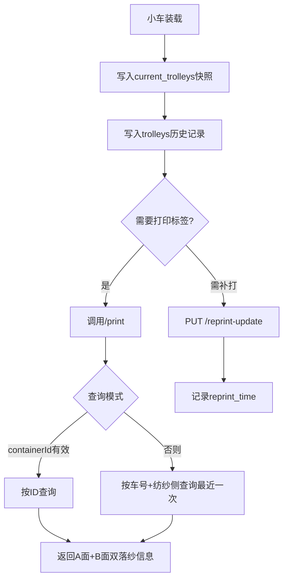
```mermaid
flowchart TD
    A[小车装载] --> B[写入current_trolleys快照]
    B --> C[写入trolleys历史记录]
    C --> D{需要打印标签?}
    D -->|是| E[调用/print]
    E --> F{查询模式}
    F -->|containerId有效| G[按ID查询]
    F -->|否则| H[按车号+纺纱侧查询最近一次]
    G --> I[返回A面+B面双落纱信息]
    H --> I
    D -->|需补打| J[PUT /reprint-update]
    J --> K[记录reprint_time]
```

**⚠️ 已发现Bug:** `getTrolleyHistory` 中有 `d1.ON` 等SQL语法错误（多余的点号），该接口当前不可用。

---

### 2.8 warehouses - 仓库管理

**功能概述:** 立体仓库主数据管理，核心是仓库内"货位模块(module)"的占用/释放操作，支持三维坐标(row, column, place)定位。

**API接口清单:**

| Method | Path | Description |
|--------|------|-------------|
| POST | `/` | 创建仓库 |
| GET | `/` | 分页获取所有仓库 |
| GET | `/warehouse-modules-status` | 获取所有被占用的仓库货位总览 |
| GET | `/get-warehouses-read-status` | 获取仓库告警已读状态 |
| GET | `/:warehouseId` | 获取单个仓库 |
| PUT | `/:warehouseId` | 更新仓库 |
| DELETE | `/:warehouseId` | 删除仓库 |
| PUT | `/:warehouseId/reset-warehouse-module` | 释放/复位货位 |
| PUT | `/:warehouseId/update-warehouse-module` | 占用/更新货位 |
| PUT | `/:warehouseId/set-warehouse-read-status` | 设置告警已读状态 |

**SQL查询分析:**

| 操作 | SQL | 涉及表 | 特殊逻辑 |
|------|-----|--------|----------|
| 释放货位 | 事务: UPDATE positions (坐标归零+解绑) + UPDATE modules_status | positions(自JOIN), modules_status | INNER JOIN positions ON position_id 树状查询 |
| 占用货位 | 事务: UPDATE positions (绑定仓库+写坐标) + 清旧坐标 + 写入完整状态 | positions, modules_status | 含子查询取warehouse.position_code |
| 货位总览 | work_bobbins LEFT JOIN positions×2 | work_bobbins, positions | 两级position树(module→warehouse) |

**业务流程图:**

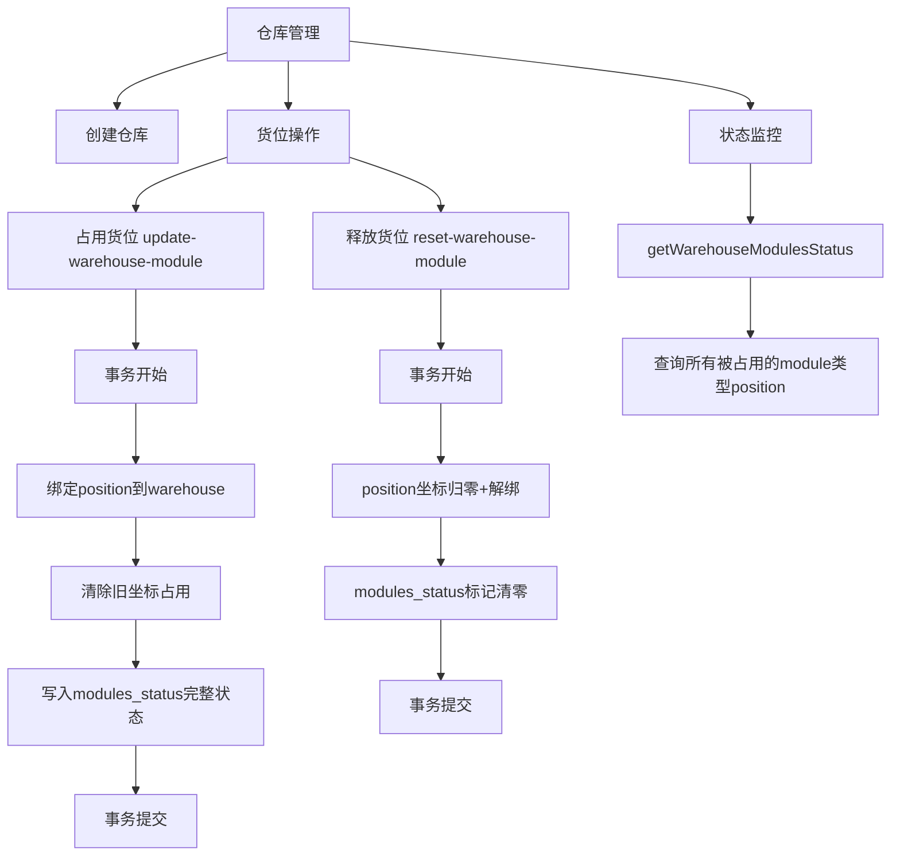
```mermaid
flowchart TD
    A[仓库管理] --> B[创建仓库]
    A --> C[货位操作]
    A --> D[状态监控]

    C --> E[占用货位 update-warehouse-module]
    C --> F[释放货位 reset-warehouse-module]

    E --> G[事务开始]
    G --> H[绑定position到warehouse]
    H --> I[清除旧坐标占用]
    I --> J[写入modules_status完整状态]
    J --> K[事务提交]

    F --> L[事务开始]
    L --> M[position坐标归零+解绑]
    M --> N[modules_status标记清零]
    N --> O[事务提交]

    D --> P[getWarehouseModulesStatus]
    P --> Q[查询所有被占用的module类型position]
```

**数据流转图:**

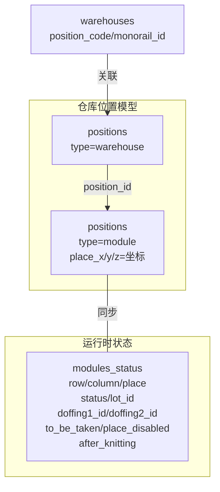
```mermaid
graph TD
    subgraph "仓库位置模型"
        WH_POS[positions<br/>type=warehouse] -->|position_id| MOD_POS[positions<br/>type=module<br/>place_x/y/z=坐标]
    end
    subgraph "运行时状态"
        MS[modules_status<br/>row/column/place<br/>status/lot_id<br/>doffing1_id/doffing2_id<br/>to_be_taken/place_disabled<br/>after_knitting]
    end
    WH[warehouses<br/>position_code/monorail_id] -->|关联| WH_POS
    MOD_POS ---|同步| MS
```

**关键字段:** `position_code`(关联positions.code), `monorail_id`, `modules_status.*`(运行时状态冗余)

---

## 三、质量检测模块

### 3.1 defects - 缺陷管理

**功能概述:** 最基础的字典表，维护疵点类型编码（如断头、毛丝、油污等），供 `preDefectBobbins` 等模块外键引用。

**API接口清单:**

| Method | Path | Description |
|--------|------|-------------|
| POST | `/` | 创建疵点 |
| GET | `/` | 分页获取疵点列表 |
| GET | `/:defectId` | 获取单个疵点详情 |
| PUT | `/:defectId` | 更新疵点 |
| DELETE | `/:defectId` | 删除疵点 |

**SQL查询分析:** 标准单表 `defects` CRUD，创建时校验 `code` 非空。

**关键字段:** `code`(疵点编码，唯一约束), `name`, `description`

---

### 3.2 preDefectBobbins - 预检缺陷筒子

**功能概述:** 记录络丝阶段每个筒管在落纱前的预分级等级及关联疵点，用于追踪次品筒管。核心是五表JOIN追溯链路：分级等级→疵点字典→络丝机→工作筒管→工位→落纱记录。

**API接口清单:**

| Method | Path | Description |
|--------|------|-------------|
| POST | `/` | 创建预疵点筒管记录 |
| GET | `/` | 分页获取列表（支持 `?current=1` 过滤当前记录） |
| GET | `/:preDefectBobbinId` | 获取单条详情（含关联对象） |
| PUT | `/:preDefectBobbinId` | 更新 |
| DELETE | `/:preDefectBobbinId` | 删除 |

**SQL查询分析:**

| 操作 | 涉及表 | JOIN关系 |
|------|--------|----------|
| 详情/列表 | pre_defect_bobbins, sorting_grades, defects, winders, work_bobbins, positions, doffings | 5表LEFT JOIN追溯链 |

**业务流程图:**

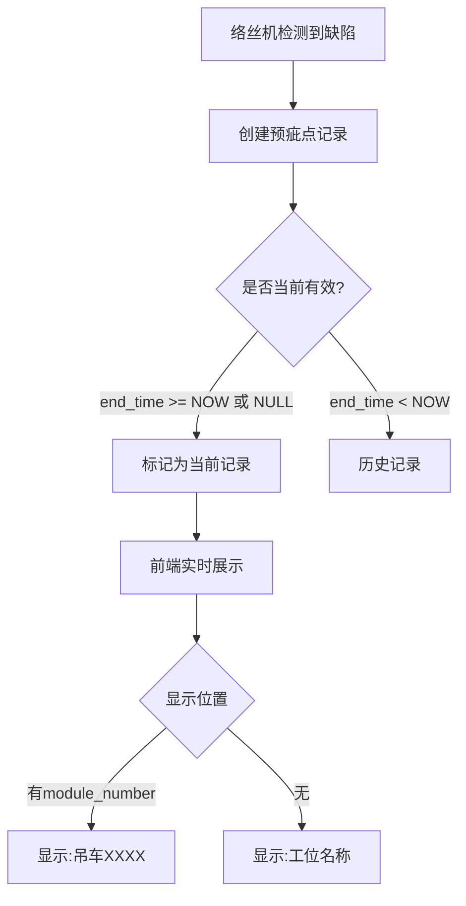
```mermaid
flowchart TD
    A[络丝机检测到缺陷] --> B[创建预疵点记录]
    B --> C{是否当前有效?}
    C -->|end_time >= NOW 或 NULL| D[标记为当前记录]
    C -->|end_time < NOW| E[历史记录]
    D --> F[前端实时展示]
    F --> G{显示位置}
    G -->|有module_number| H["显示:吊车XXXX"]
    G -->|无| I["显示:工位名称"]
```

**关键字段:** `winder_id`, `bobbin_number`, `sorting_grade_id`, `defect_id`, `start_time`/`end_time`, `doffing_id`, `after_sorting`

---

### 3.3 sortings - 分拣配置

**功能概述:** 配置分拣站的基础信息与统计参数（每班次最大处理模块数、模块登记最短时间等），`settings` 存储JSON格式的自定义配置。

**API接口清单:**

| Method | Path | Description |
|--------|------|-------------|
| POST | `/` | 创建分拣配置 |
| GET | `/` | 分页获取列表 |
| GET | `/:sortingId` | 获取详情（含settings JSON解析） |
| PUT | `/:sortingId` | 更新 |
| DELETE | `/:sortingId` | 删除 |
| POST | `/reset/:sortingId` | 重置单条统计数据 |
| POST | `/reset-all` | 重置全部统计数据 |

**SQL查询分析:** 单表 `sortings` CRUD + 统计重置（`max_modules_per_day_shift`/`max_modules_per_night_shift`/`modules_record_time` 置NULL）。

**⚠️ 已发现Bug:** `createSorting` 中 `sorting.settings - JSON.stringify(sorting.settings)` 使用了减号而非等号赋值，是无效表达式。

---

### 3.4 sortingGrades - 分拣等级

**功能概述:** 分拣环节的等级字典（如A/B/C级），供 `preDefectBobbins` 等模块的 `sorting_grade_id` 外键引用。

**API接口清单:** 标准CRUD五接口（POST/GET/GET:id/PUT/DELETE）。

**SQL查询分析:** 单表 `sorting_grades`，创建后 `code` 不可修改（更新接口已注释掉code校验）。

**关键字段:** `code`(唯一), `name`, `chinese_name`, `color`, `description`

---

### 3.5 finalGrades - 最终等级

**功能概述:** 成品/最终检验环节的质量等级字典，结构与 `sortingGrades` 完全一致。

**API接口清单:** 标准CRUD五接口。

**SQL查询分析:** 单表 `final_grades`。更新接口无任何字段校验。

---

### 3.6 visionGrades - 视觉检测等级

**功能概述:** 机器视觉检测环节的质量等级字典。

**API接口清单:** 标准CRUD五接口。

**SQL查询分析:** 单表 `vision_grades`。代码从 `sortingGrades` 复制而来。

---

### 3.7 weightGrades - 重量等级

**功能概述:** 称重环节的重量等级字典，配合 `weighingRules` 使用。

**API接口清单:** 标准CRUD五接口。

**SQL查询分析:** 单表 `weight_grades`。更新接口无任何字段校验。

---

### 3.8 weighingRules - 称重规则

**功能概述:** 配置络丝机在特定时间区间的称重规则生效范围（按纺丝线+络丝机+起止时间），关联落纱记录追溯称重后的等级。

**API接口清单:**

| Method | Path | Description |
|--------|------|-------------|
| POST | `/` | 创建称重规则 |
| GET | `/` | 分页获取列表（支持 `?current=1`） |
| GET | `/:weighingRuleId` | 获取详情 |
| PUT | `/:weighingRuleId` | 更新 |
| DELETE | `/:weighingRuleId` | 删除 |

**SQL查询分析:**

| 操作 | 涉及表 | 特殊逻辑 |
|------|--------|----------|
| 详情 | weighing_rules, winders, work_bobbins, positions, doffings | 含相关子查询ON条件 |

**业务流程图:**

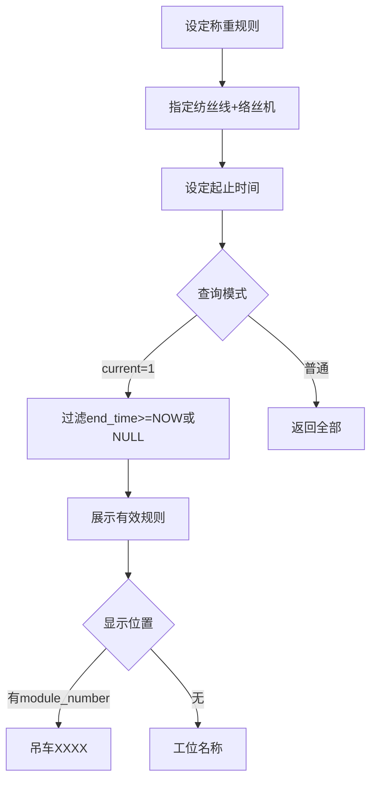
```mermaid
flowchart TD
    A[设定称重规则] --> B[指定纺丝线+络丝机]
    B --> C[设定起止时间]
    C --> D{查询模式}
    D -->|current=1| E[过滤end_time>=NOW或NULL]
    D -->|普通| F[返回全部]
    E --> G[展示有效规则]
    G --> H{显示位置}
    H -->|有module_number| I["吊车XXXX"]
    H -->|无| J["工位名称"]
```

---

### 3.9 knittings - 针织检测

**功能概述:** 最简单的只读字典模块，提供针织/织造工艺类型查询。**无创建/更新/删除接口**。

**API接口清单:**

| Method | Path | Description |
|--------|------|-------------|
| GET | `/` | 分页获取织造类型列表 |

**SQL查询分析:** `SELECT * FROM knittings`，**缺少 `COUNT(*) OVER() AS total_count`**（分页总数字段缺失）。

---

### 3.10 knittingGrades - 针织等级

**功能概述:** 织造检验环节的质量等级字典。代码从 `sortingGrades` 复制，内部变量名仍沿用 `sortingGrade`。

**API接口清单:** 标准CRUD五接口。

**SQL查询分析:** 单表 `knitting_grades`。

---

### 3.11 knittingOrders - 针织订单

**功能概述:** 本组最复杂的模块，管理织造订单全生命周期：创建订单→从仓库拉取满足条件的模块→出库确认→同步状态→关闭订单。涉及存储过程、事务、跨表状态机。

**API接口清单:**

| Method | Path | Description |
|--------|------|-------------|
| POST | `/` | 创建织造订单（调用存储过程） |
| GET | `/` | 分页获取订单列表 |
| PUT | `/add-module` | 将模块加入订单（触发出库） |
| POST | `/confirm` | 确认模块已被取走 |
| POST | `/sync` | 同步订单-模块关联（幂等） |
| PUT | `/:id/close` | 关闭订单 |
| GET | `/:id/sent` | 获取已发送模块列表 |
| POST | `/get-module` | 查询可分配的模块候选 |

**SQL查询分析:**

| 操作 | SQL | 涉及表 | 特殊逻辑 |
|------|-----|--------|----------|
| 创建 | `CALL create_knitting_order(?,?,?)` | 存储过程 | lot_id, number_of_modules, knitting_id |
| 列表 | 3表JOIN | knitting_orders, lots, knittings, paper_tube_colors | LEFT JOIN |
| 加模块 | 事务4步 | knitting_orders, modules_status, modules, knitting_orders_modules | 原子操作 |
| 候选模块 | **核心业务规则查询** | modules_status, lots, paper_tube_colors, warehouses | 7个过滤条件 |

**核心业务规则 — 可分配模块筛选条件:**

```sql
WHERE TIMESTAMPDIFF(HOUR, timestamp, NOW()) >= l.wait_time  -- 静置时间达标
  AND ms.after_knitting = 0                                   -- 未织造
  AND ms.to_be_taken = 0                                      -- 未被预定
  AND ms.row > 0 AND ms.column > 0 AND ms.place > 0          -- 有效仓位坐标
  AND ms.warehouse_id = ?                                     -- 指定仓库
  AND ms.place_disabled = 0                                   -- 货位未禁用
  AND ms.status = 2                                           -- 已入库可用
  AND l.type = 'fdy'                                          -- 仅FDY工艺
  AND lot_id = (SELECT lot_id FROM knitting_orders WHERE id=?) -- 同批次
```

**业务流程图:**

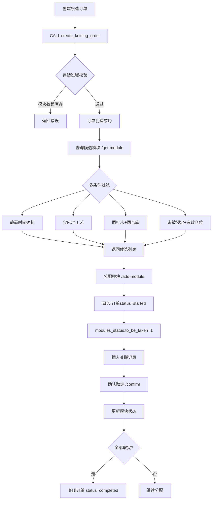
```mermaid
flowchart TD
    A[创建织造订单] --> B[CALL create_knitting_order]
    B --> C{存储过程校验}
    C -->|模块数超库存| D[返回错误]
    C -->|通过| E[订单创建成功]
    E --> F[查询候选模块 /get-module]
    F --> G{多条件过滤}
    G --> H[静置时间达标]
    G --> I[仅FDY工艺]
    G --> J[同批次+同仓库]
    G --> K[未被预定+有效仓位]
    H & I & J & K --> L[返回候选列表]
    L --> M[分配模块 /add-module]
    M --> N[事务:订单status=started]
    N --> O[modules_status.to_be_taken=1]
    O --> P[插入关联记录]
    P --> Q[确认取走 /confirm]
    Q --> R[更新模块状态]
    R --> S{全部取完?}
    S -->|是| T[关闭订单 status=completed]
    S -->|否| U[继续分配]
```

**数据流转图:**

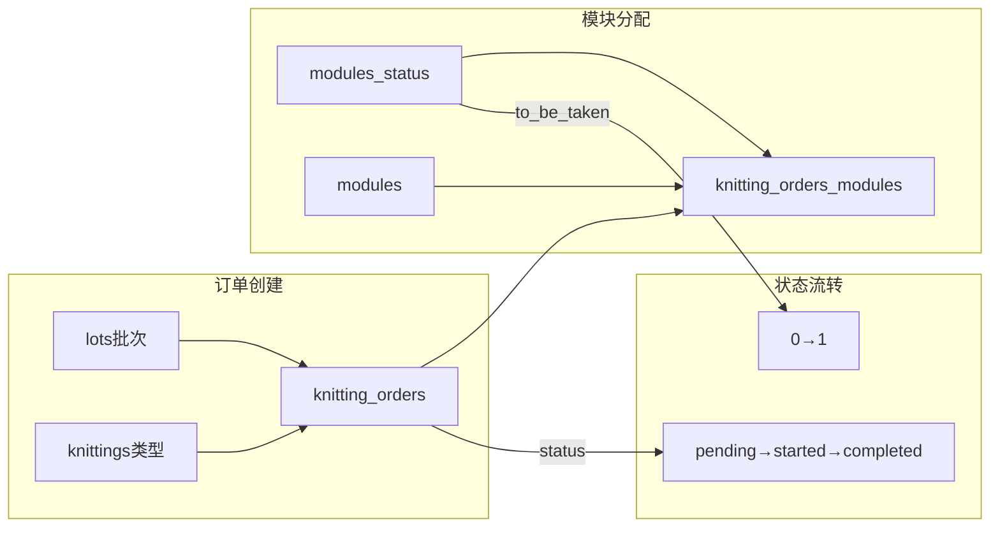
```mermaid
graph LR
    subgraph "订单创建"
        LOT[lots批次] --> KO[knitting_orders]
        KNIT[knittings类型] --> KO
    end
    subgraph "模块分配"
        KO --> KOM[knitting_orders_modules]
        MS[modules_status] --> KOM
        MOD[modules] --> KOM
    end
    subgraph "状态流转"
        KO -->|status| ST["pending→started→completed"]
        MS -->|to_be_taken| TK["0→1"]
    end
```

**订单状态机:**

```mermaid
statediagram-v2
    [*] --> pending: 创建订单
    pending --> started: 首次分配模块
    started --> started: 继续分配
    started --> completed: 关闭订单
    completed --> [*]
```

---

## 四、DTY后处理模块

### 4.1 dty - DTY总控

**功能概述:** DTY（假捻变形丝）加工机台的基础字典查询接口，供其他模块外键引用。

**API接口清单:**

| Method | Path | Description |
|--------|------|-------------|
| GET | `/` | 分页查询所有DTY机台 |

**SQL查询分析:** 单表 `dty`，无JOIN。

---

### 4.2 dtyBobbins - DTY筒子

**功能概述:** **空壳模块** — controller和query都是空对象 `module.exports = {}`，没有实现任何接口。

**⚠️ 注意:** `dty_bobbins` 表在 `dtyBoxes` 的 query 中被引用（UPDATE操作），说明数据表存在且被使用，但本模块未暴露CRUD接口。

---

### 4.3 dtyBoxes - DTY箱子

**功能概述:** 管理DTY丝饼装箱流程：创建箱子（可选绑定卷装bobbin）、分页查询箱子列表、获取打印标签信息（记录贴标时间）、更新称重。

**API接口清单:**

| Method | Path | Description |
|--------|------|-------------|
| POST | `/` | 创建装箱记录 |
| GET | `/` | 分页查询所有箱子 |
| GET | `/:id/print` | 获取打印信息（写入贴标时间） |
| PUT | `/:id/weight` | 更新箱子称重 |

**SQL查询分析:**

| 操作 | SQL | 涉及表 | 特殊逻辑 |
|------|-----|--------|----------|
| 创建 | 事务: INSERT dty_boxes ON DUPLICATE KEY + UPDATE dty_bobbins | dty_boxes, dty_bobbins | 幂等创建 |
| 列表 | 多表JOIN + GET_BOX_CODE() | dty_boxes, dty_orders, order_grades, dty_pallets_boxes, lots, paper_tube_colors | 净重=毛重-箱重 |
| 打印 | 事务: UPDATE labeling_time + 多表查询 | dty_boxes, dty_orders, lots, order_grades | 副作用写入 |

**⚠️ 已发现严重Bug:**
1. `UPDATE dty_bobbins SET dty_order_id = ? AND dty_box_id = ?` — `AND` 应为逗号，导致 `dty_box_id` 不会被更新
2. `bobbinsIds.map('?')` — `map` 需要函数而非字符串，运行时必然抛异常

**业务流程图:**

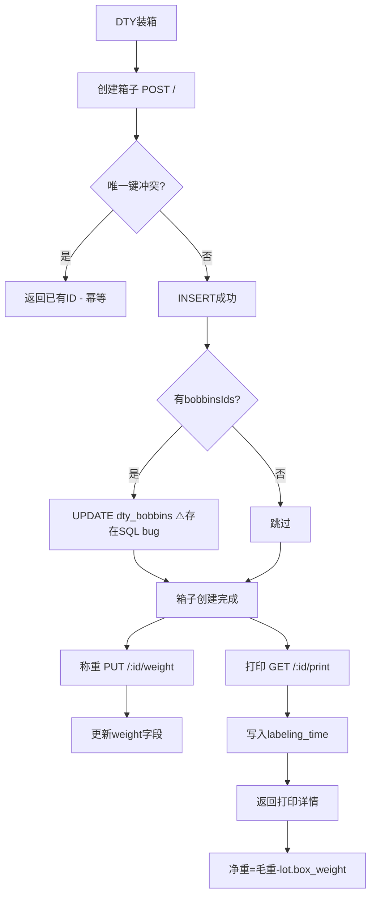
```mermaid
flowchart TD
    A[DTY装箱] --> B[创建箱子 POST /]
    B --> C{唯一键冲突?}
    C -->|是| D[返回已有ID - 幂等]
    C -->|否| E[INSERT成功]
    E --> F{有bobbinsIds?}
    F -->|是| G["UPDATE dty_bobbins ⚠️存在SQL bug"]
    F -->|否| H[跳过]
    G --> I[箱子创建完成]
    H --> I
    I --> J[称重 PUT /:id/weight]
    J --> K[更新weight字段]
    I --> L[打印 GET /:id/print]
    L --> M[写入labeling_time]
    M --> N[返回打印详情]
    N --> O["净重=毛重-lot.box_weight"]
```

---

### 4.4 dtyOrders - DTY订单

**功能概述:** DTY打包订单全生命周期管理：创建→查询可用批次/模块→分配模块→领取确认→状态同步→关闭订单。是DTY模块中最复杂的核心模块。

**API接口清单:**

| Method | Path | Description |
|--------|------|-------------|
| POST | `/` | 创建打包订单 |
| GET | `/` | 分页查询所有订单 |
| GET | `/:orderId` | 查询单个订单详情 |
| DELETE | `/:orderId` | 删除订单 |
| POST | `/:orderId/add-pallets` | 追加托盘数量 |
| PUT | `/update-order-module` | 更新订单绑定的模块 |
| PUT | `/:orderId` | 更新订单 |
| GET | `/available/:palletizerId` | 查询可打包批次及卷装 |
| GET | `/:id/sent` | 查询已发送模块 |
| POST | `/get-module-for-order` | 获取可用模块 |
| POST | `/confirm` | 确认模块领取 |
| POST | `/sync` | 同步订单模块数据（幂等） |
| PUT | `/:id/close` | 关闭订单 |
| POST | `/get-packing-order-modules` | 获取订单的所有模块记录 |

**SQL查询分析:**

| 操作 | SQL | 涉及表 | 特殊逻辑 |
|------|-----|--------|----------|
| 创建 | INSERT INTO dty_orders SET ? | dty_orders | 必填6字段校验 |
| 追加托盘 | UPDATE SET pallets_amount+=?, bobbins_amount+=?*24 | dty_orders | 1托盘=24卷装 |
| 可用批次 | CTE复杂查询 | modules_status, lots, dty_modules, dty_work_bobbins, monorails | 排除已占用+多条件过滤 |
| 模块分配 | 事务: UPDATE modules_status + INSERT关联 | modules_status, dty_modules, dty_packing_orders_modules | to_be_taken=1 |
| 同步 | 事务: 幂等检查+按等级过滤卷装数 | dty_packing_orders_modules, dty_modules, work_bobbins | final_grade_id匹配 |

**核心业务 — 可打包判断条件:**

```sql
WHERE ms.after_knitting_confirm = 1  -- 已过针织确认
  AND ms.row > 0 AND ms.column > 0 AND ms.place > 0  -- 在库
  AND l.packing_lock = 0             -- 未锁定
  AND ms.place_disabled = 0          -- 库位未禁用
  AND ms.to_be_taken = 0             -- 未被预定
  AND ms.status = 2                  -- 在库状态
  AND m.type = 'dty'                 -- 轨道类型为DTY
```

**等级分桶（硬编码魔法数字）:**

| final_grade_id | 等级含义 |
|----------------|----------|
| 1 | 合格品 |
| 3 | AA1 |
| 5 | AA2 |
| 7 | A |

**业务流程图:**

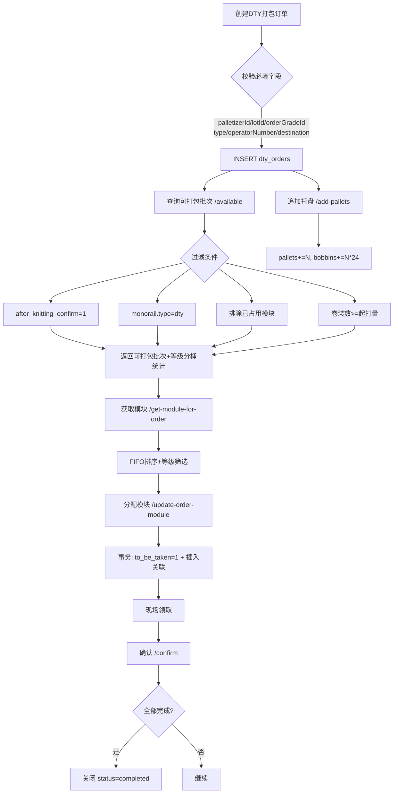
```mermaid
flowchart TD
    A[创建DTY打包订单] --> B{校验必填字段}
    B -->|palletizerId/lotId/orderGradeId<br/>type/operatorNumber/destination| C[INSERT dty_orders]
    C --> D[查询可打包批次 /available]
    D --> E{过滤条件}
    E --> F[after_knitting_confirm=1]
    E --> G[monorail.type=dty]
    E --> H[排除已占用模块]
    E --> I[卷装数>=起打量]
    F & G & H & I --> J[返回可打包批次+等级分桶统计]
    J --> K[获取模块 /get-module-for-order]
    K --> L[FIFO排序+等级筛选]
    L --> M[分配模块 /update-order-module]
    M --> N[事务: to_be_taken=1 + 插入关联]
    N --> O[现场领取]
    O --> P[确认 /confirm]
    P --> Q{全部完成?}
    Q -->|是| R[关闭 status=completed]
    Q -->|否| S[继续]

    C --> T[追加托盘 /add-pallets]
    T --> U["pallets+=N, bobbins+=N*24"]
```

**数据流转图:**

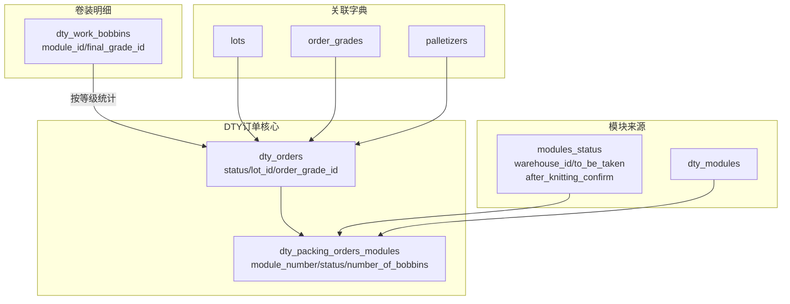
```mermaid
graph TD
    subgraph "DTY订单核心"
        DO[dty_orders<br/>status/lot_id/order_grade_id] --> DPOM[dty_packing_orders_modules<br/>module_number/status/number_of_bobbins]
    end
    subgraph "模块来源"
        MS[modules_status<br/>warehouse_id/to_be_taken<br/>after_knitting_confirm] --> DPOM
        DM[dty_modules] --> DPOM
    end
    subgraph "卷装明细"
        DWB[dty_work_bobbins<br/>module_id/final_grade_id] --> |按等级统计| DO
    end
    subgraph "关联字典"
        LOT[lots] --> DO
        OG[order_grades] --> DO
        PTZ[palletizers] --> DO
    end
```

**⚠️ 已发现Bug:**
1. `confirmModuleTaken` 表名 `packing_orders_modules` 缺少 `dty_` 前缀
2. `updateOrder` 中未传字段直接 `.length` 会抛 `TypeError`
3. `addPallets` 中 `boxes_amount = ? * 20` 是覆盖赋值而非累加

---

### 4.5 dtyPallets - DTY托盘

**功能概述:** 管理装箱后的DTY托盘：创建（可绑定多个箱子）、查询列表（聚合毛重/净重）、更新RFID、查询卷装明细。

**API接口清单:**

| Method | Path | Description |
|--------|------|-------------|
| POST | `/` | 创建托盘（需许可证校验） |
| GET | `/` | 分页查询所有托盘 |
| PUT | `/:palletId` | 更新托盘（仅RFID） |
| GET | `/:palletId/boxes` | 查询托盘下卷装明细 |

**SQL查询分析:**

| 操作 | SQL | 涉及表 | 特殊逻辑 |
|------|-----|--------|----------|
| 创建 | 事务: INSERT dty_pallets + 循环INSERT dty_pallets_boxes ON DUPLICATE KEY | dty_pallets, dty_pallets_boxes | 幂等 |
| 列表 | 多表JOIN + 二次查询聚合重量 | dty_pallets, dty_orders, order_grades, lots, palletizers, paper_tube_colors, team_turns, dty_pallets_boxes, dty_boxes | 班次判定+重量聚合 |

**业务流程图:**

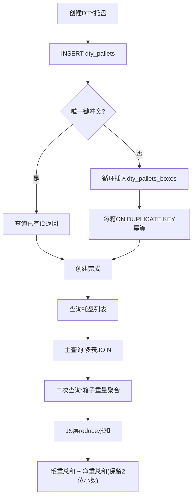
```mermaid
flowchart TD
    A[创建DTY托盘] --> B[INSERT dty_pallets]
    B --> C{唯一键冲突?}
    C -->|是| D[查询已有ID返回]
    C -->|否| E[循环插入dty_pallets_boxes]
    E --> F[每箱ON DUPLICATE KEY幂等]
    D --> G[创建完成]
    F --> G
    G --> H[查询托盘列表]
    H --> I[主查询:多表JOIN]
    I --> J[二次查询:箱子重量聚合]
    J --> K[JS层reduce求和]
    K --> L["毛重总和 + 净重总和(保留2位小数)"]
```

**⚠️ 已发现Bug:** `createPallet` 事务内混用 `db.query` 和 `connection.query`，事务一致性不完整。

---

### 4.6 dtyWarehouseOrders - DTY仓库订单

**功能概述:** 管理"针织后仓库→DTY车间"的模块调拨领料订单：创建（调用存储过程校验库存）、逐模块添加、领取确认、状态同步、关闭订单、时段统计。

**API接口清单:**

| Method | Path | Description |
|--------|------|-------------|
| POST | `/` | 创建仓库领料订单（存储过程） |
| GET | `/` | 分页查询所有仓库订单 |
| PUT | `/add-module` | 向订单添加模块 |
| POST | `/confirm` | 确认模块领取 |
| POST | `/sync` | 同步订单模块数据 |
| PUT | `/:id/close` | 关闭订单 |
| GET | `/:id/sent` | 查询已发送模块 |
| POST | `/get-modules-count-by-timestamp` | 按时间段统计 |

**SQL查询分析:**

| 操作 | SQL | 涉及表 | 特殊逻辑 |
|------|-----|--------|----------|
| 创建 | `CALL create_dty_warehouse_order(?,?,?)` | 存储过程 | lot_id, number_of_modules, dty_id |
| 添加模块 | 事务5步 | dty_warehouse_orders, modules_status, modules, work_bobbins, dty_warehouse_orders_modules | 即时计算合格品重量 |
| 时段统计 | GROUP BY + SUM | dty_warehouse_orders_modules, dty_warehouse_orders, lots, paper_tube_colors | COUNT/SUM聚合 |

**业务流程图:**

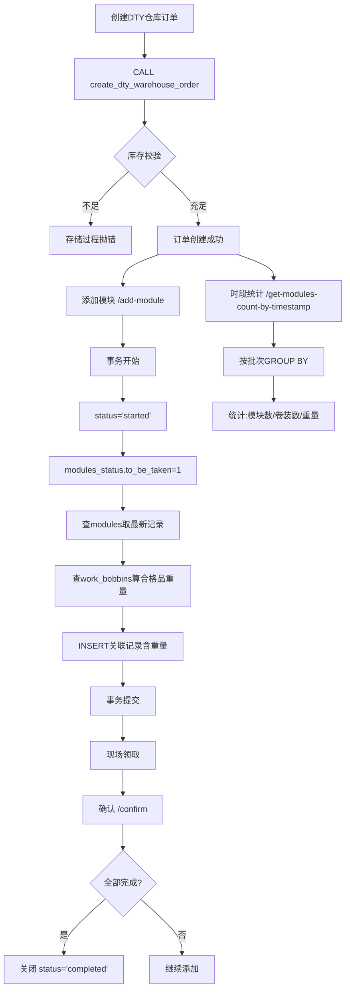
```mermaid
flowchart TD
    A[创建DTY仓库订单] --> B[CALL create_dty_warehouse_order]
    B --> C{库存校验}
    C -->|不足| D[存储过程抛错]
    C -->|充足| E[订单创建成功]
    E --> F[添加模块 /add-module]
    F --> G[事务开始]
    G --> H["status='started'"]
    H --> I[modules_status.to_be_taken=1]
    I --> J[查modules取最新记录]
    J --> K[查work_bobbins算合格品重量]
    K --> L[INSERT关联记录含重量]
    L --> M[事务提交]
    M --> N[现场领取]
    N --> O[确认 /confirm]
    O --> P{全部完成?}
    P -->|是| Q["关闭 status='completed'"]
    P -->|否| R[继续添加]

    E --> S[时段统计 /get-modules-count-by-timestamp]
    S --> T["按批次GROUP BY"]
    T --> U["统计:模块数/卷装数/重量"]
```

**数据流转图:**

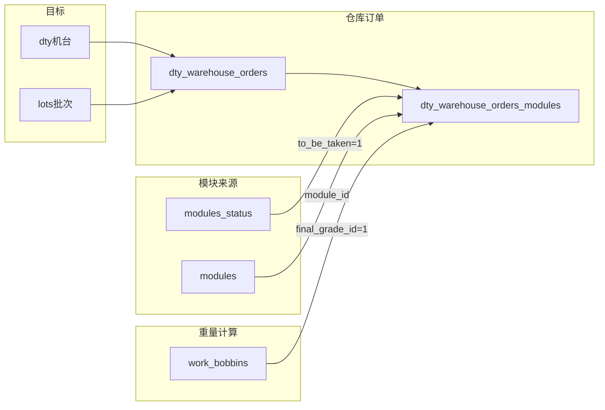
```mermaid
graph LR
    subgraph "仓库订单"
        DWO[dty_warehouse_orders] --> DWOM[dty_warehouse_orders_modules]
    end
    subgraph "模块来源"
        MS[modules_status] -->|to_be_taken=1| DWOM
        MODULES[modules] -->|module_id| DWOM
    end
    subgraph "重量计算"
        WB[work_bobbins] -->|final_grade_id=1| DWOM
    end
    subgraph "目标"
        DTY_MACHINE[dty机台] --> DWO
        LOT[lots批次] --> DWO
    end
```

---

### 4.7 dtyWorkBobbins - DTY工作筒子

**功能概述:** 管理DTY落卷（暂存卷装）明细数据：查询详情（含五套等级体系）、分页查询、装载卷装（调用存储过程）。

**API接口清单:**

| Method | Path | Description |
|--------|------|-------------|
| GET | `/` | 分页查询所有落卷 |
| GET | `/:bobbinId` | 查询单个落卷详情 |
| POST | `/loadingBobbins` | 装载卷装（调用存储过程） |

**SQL查询分析:**

| 操作 | SQL | 涉及表 | 特殊逻辑 |
|------|-----|--------|----------|
| 详情 | 7表JOIN | dty_work_bobbins, sorting/weight/final_grades, defects, positions, lots, paper_tube_colors | 缺vision/knitting_grades JOIN |
| 列表 | 9表JOIN | 上述+vision_grades, knitting_grades | 完整五套等级 |
| 装载 | `CALL load_dty_bobbins(?,?,?,?,?,?,?)` | 存储过程 | 返回containerId |

**五套等级体系:**

```mermaid
graph TD
    BOBBIN[dty_work_bobbins<br/>一条卷装记录] --> SG[sorting_grade<br/>分拣等级]
    BOBBIN --> WG[weight_grade<br/>重量等级]
    BOBBIN --> FG[final_grade<br/>最终等级]
    BOBBIN --> VG[vision_grade<br/>视觉检测等级]
    BOBBIN --> KG[knitting_grade<br/>针织检测等级]
```

**⚠️ 已发现严重Bug:** `controllers/dtyWorkBobbins.js` 第1行引用 `require('../queries/workBobbins')` 而非 `require('../queries/dtyWorkBobbins')`，导致 `queries/dtyWorkBobbins.js` 实际是死代码。

---

## 五、其他支撑模块

### 5.1 erpBobbins - ERP筒子集成

**功能概述:** 提供面向ERP的筒子数据只读查询接口，将 `erp_bobbins` 表数据（含分拣等级名称）以分页方式输出。

**API接口清单:**

| Method | Path | Description |
|--------|------|-------------|
| GET | `/` | 分页获取ERP筒子列表 |

**SQL查询分析:**

```sql
SELECT COUNT(*) OVER() AS total_count, eb.*, sg.name
FROM erp_bobbins AS eb
LEFT JOIN sorting_grades AS sg ON sg.code = eb.grade
```

**数据流转图:**

```mermaid
graph LR
    EB[erp_bobbins] -->|grade=code| SG[sorting_grades]
    EB --> API["/erp-bobbins GET"]
    API --> ERP[ERP系统]
```

**关键字段:** `bobbin_id`, `doffing_id`, `doffing_creation_date`, `module_number`, `lot_code`, `specification`, `winder_name`, `spinning_line_name`, `position`, `grade`, `defect`, `weight`, `write_date`

---

### 5.2 erpPallets - ERP托盘集成

**功能概述:** ERP托盘同步记录的完整CRUD管理，通过 `request_time` 记录同步请求时间。

**API接口清单:**

| Method | Path | Description |
|--------|------|-------------|
| POST | `/` | 创建ERP托盘记录 |
| GET | `/` | 分页获取所有ERP托盘 |
| GET | `/:erpPalletId` | 获取单个ERP托盘 |
| PUT | `/:erpPalletId` | 更新ERP托盘 |
| DELETE | `/:erpPalletId` | 删除ERP托盘 |

**SQL查询分析:**

| 操作 | SQL |
|------|-----|
| 创建 | `INSERT INTO erp_pallets SET ? ON DUPLICATE KEY UPDATE request_time = current_timestamp()` |
| 查询 | `SELECT *, COUNT(*) OVER() FROM erp_pallets` |
| 更新/删除 | 标准单表操作 |

**业务流程图:**

```mermaid
flowchart TD
    A[托盘RFID变更] --> B[pallets.changeRfid]
    B --> C["INSERT erp_pallets<br/>ON DUPLICATE KEY<br/>UPDATE sent_to_erp=0"]
    C --> D[ERP同步进程读取]
    D --> E{sent_to_erp=0?}
    E -->|是| F[同步到ERP]
    F --> G[更新sent_to_erp=1]
    E -->|否| H[跳过]
```

---

### 5.3 paperTubeColors - 纸管颜色

**功能概述:** 纸管颜色字典的完整CRUD，支持双色配置（color1/color2）和中文标签名。纸管颜色通过 `lots.paper_tube_color_id` 关联到批次，用于在整个系统中标识批次的视觉特征。

**API接口清单:**

| Method | Path | Description |
|--------|------|-------------|
| POST | `/` | 创建纸管颜色 |
| GET | `/` | 分页获取所有纸管颜色 |
| GET | `/:paperTubeColorId` | 获取单个纸管颜色 |
| PUT | `/:paperTubeColorId` | 更新纸管颜色 |
| DELETE | `/:paperTubeColorId` | 删除纸管颜色 |

**SQL查询分析:** 标准单表 `paper_tube_colors` CRUD。

**关键字段:** `name`(英文名), `chinese_name`(中文名), `label_name`(标签名), `color1`(主色), `color2`(辅色)

---

### 5.4 printServers - 打印服务

**功能概述:** 标签打印服务器配置的完整CRUD，记录打印服务器的网络连接信息。

**API接口清单:**

| Method | Path | Description |
|--------|------|-------------|
| POST | `/` | 创建打印服务器 |
| GET | `/` | 分页获取所有打印服务器 |
| GET | `/:printServerId` | 获取单个打印服务器 |
| PUT | `/:printServerId` | 更新打印服务器 |
| DELETE | `/:printServerId` | 删除打印服务器 |

**SQL查询分析:** 标准单表 `print_servers` CRUD。

**关键字段:** `name`, `description`, `host`(IP/主机名), `port`(端口)

---

### 5.5 notifications - 通知

**功能概述:** 通知消息管理，支持创建、查询和确认（acknowledge）。通知内容以JSON字符串存储，通过MySQL binlog watcher实时推送到WebSocket客户端。

**API接口清单:**

| Method | Path | Description |
|--------|------|-------------|
| GET | `/` | 分页获取所有通知 |
| POST | `/` | 创建通知 |
| PUT | `/:id` | 更新通知（确认/修改） |

**SQL查询分析:**

| 操作 | SQL |
|------|-----|
| 创建 | `INSERT INTO notifications (data, type) VALUES (?,?) ON DUPLICATE KEY UPDATE id = id` |
| 查询 | `SELECT n.*, COUNT(*) OVER() FROM notifications AS n` |
| 更新 | `UPDATE notifications SET ? WHERE id = ?` |

**数据流转图:**

```mermaid
graph LR
    PLC[PLC/设备] -->|POST /notifications| API[Express API]
    API --> DB[(notifications表)]
    DB -->|MySQL Binlog| WATCHER[Binlog Watcher]
    WATCHER --> WSS[WebSocket Server]
    WSS -->|实时推送| HMI[HMI触摸屏]
    HMI -->|PUT /notifications/:id| API
```

**关键字段:** `data`(JSON字符串), `type`(通知类型), `acknowledge`(确认标记), `timestamp`

---

### 5.6 clientsSupervisionSettings - 客户监控设置

**功能概述:** 按客户端IP地址存储和管理HMI监控界面的个性化配置（如显示哪些设备、布局偏好等），自动识别请求来源IP。

**API接口清单:**

| Method | Path | Description |
|--------|------|-------------|
| POST | `/` | 创建/覆盖当前IP的设置 |
| GET | `/` | 分页获取所有客户端设置 |
| GET | `/my-settings` | 获取当前IP的设置 |
| PUT | `/` | 更新当前IP的设置 |

**SQL查询分析:**

| 操作 | SQL |
|------|-----|
| 创建 | `INSERT INTO clients_supervision_settings (ip_address, settings) VALUES (?,?) ON DUPLICATE KEY UPDATE settings = ?` |
| 查询本机 | `SELECT * FROM clients_supervision_settings WHERE ip_address = ?` |
| 更新 | `UPDATE clients_supervision_settings SET settings = ? WHERE ip_address = ?` |

**业务逻辑:** IP地址从 `x-forwarded-for` 或 `socket.remoteAddress` 获取，自动去除IPv6前缀 `::ffff:`。使用 `ON DUPLICATE KEY UPDATE` 实现 UPSERT 语义。

---

### 5.7 licenses - 许可证

**功能概述:** 软件许可证管理，支持创建、查询（含过期/展示banner的计算字段）、通过密码激活付费。

**API接口清单:**

| Method | Path | Description |
|--------|------|-------------|
| GET | `/status` | 获取整体许可状态（ok/need/banner/expired） |
| POST | `/` | 创建许可证 |
| GET | `/` | 分页获取所有许可证 |
| PUT | `/` | 密码激活（全局） |
| GET | `/:licenseId` | 获取单个许可证 |
| PUT | `/:licenseId` | 更新许可证 |
| DELETE | `/:licenseId` | 删除许可证 |

**SQL查询分析:**

| 操作 | SQL | 特殊逻辑 |
|------|-----|----------|
| 查询 | 含3个计算字段 | `out_of_time`: 到期判断; `is_expired`: 到期且未付费; `show_banner`: banner日期已过且未付费 |
| 激活 | `UPDATE licenses SET status='paid' WHERE expiring_date <= (子查询取MD5密码匹配的最大到期日)` | MD5密码验证 |
| 状态 | 遍历所有许可证 | 优先级: expired > banner > need > ok |

**业务流程图:**

```mermaid
flowchart TD
    A[许可证状态检查] --> B[查询所有licenses]
    B --> C{any is_expired=1?}
    C -->|是| D["status='expired'"]
    C -->|否| E{any show_banner=1?}
    E -->|是| F["status='banner'"]
    E -->|否| G{any status='unpaid'?}
    G -->|是| H["status='need'"]
    G -->|否| I["status='ok'"]

    J[密码激活] --> K["UPDATE SET status='paid'"]
    K --> L{WHERE条件}
    L --> M["expiring_date <= MAX(同密码的到期日)"]
    M --> N{affectedRows?}
    N -->|0| O[密码不匹配]
    N -->|>0| P[激活成功]
```

**关键字段:** `expiring_date`(到期日), `banner_date`(banner显示日), `password`(MD5加密), `status`(paid/unpaid)

---

### 5.8 settings - 系统设置

**功能概述:** 通用键值对系统配置管理，以 `name` 为业务主键。

**API接口清单:**

| Method | Path | Description |
|--------|------|-------------|
| POST | `/` | 创建设置项 |
| GET | `/` | 获取所有设置项 |
| GET | `/:settingName` | 获取单个设置项 |
| PUT | `/:settingName` | 更新设置项 |
| DELETE | `/:settingName` | 删除设置项 |

**SQL查询分析:** 标准单表 `settings` CRUD，以 `name` 定位（非自增id）。

---

### 5.9 status - 状态管理

**功能概述:** 设备运行状态和告警管理的统一入口，覆盖三类设备：纺纱机（doffer）、仓库（warehouse/stacker）、码垛机（palletizer）。每类设备都提供状态记录、告警记录、状态查询、告警查询四个接口。

**API接口清单:**

| Method | Path | Description |
|--------|------|-------------|
| POST | `/spinnings` | 创建纺纱机状态记录 |
| POST | `/spinnings/alarms` | 创建纺纱机告警 |
| GET | `/spinnings/alarms` | 获取纺纱机告警列表 |
| GET | `/spinnings/status` | 获取纺纱机状态历史 |
| POST | `/warehouses` | 创建仓库状态记录 |
| POST | `/warehouses/alarms` | 创建仓库告警 |
| GET | `/warehouses/alarms` | 获取仓库告警列表 |
| GET | `/warehouses/status` | 获取仓库状态历史 |
| POST | `/palletizers` | 创建码垛机状态记录 |
| POST | `/palletizers/alarms` | 创建码垛机告警 |
| GET | `/palletizers/alarms` | 获取码垛机告警列表 |
| GET | `/palletizers/status` | 获取码垛机状态历史 |

**SQL查询分析:**

| 设备类型 | 状态表 | 告警表 | 告警定义表 |
|----------|--------|--------|------------|
| 纺纱机 | doffers_status | doffers_alarms | doffers_alarms_definition |
| 仓库 | warehouses_status | warehouses_alarms | warehouses_alarms_definition |
| 码垛机 | palletizers_status | palletizers_alarms | palletizers_alarms_definition |

**告警记录逻辑:**

```sql
INSERT INTO xxx_alarms (device_id, alarm_id, device_number)
VALUES (?, (SELECT id FROM xxx_alarms_definition WHERE word = ? AND bit = ?), ?)
```

告警通过PLC的 `word`+`bit` 编码映射到告警定义表的具体告警类型。

**状态查询逻辑:** 除返回时间区间内的状态记录外，还额外查询"起始时间之前各设备的最后一条状态"（`lastStatus`），用于前端时间轴展示的起点状态。

**业务流程图:**

```mermaid
flowchart TD
    subgraph "PLC上报"
        PLC1[纺纱机PLC] -->|POST /status/spinnings| API
        PLC2[仓库堆垛机PLC] -->|POST /status/warehouses| API
        PLC3[码垛机PLC] -->|POST /status/palletizers| API
    end
    subgraph "告警上报"
        PLC1 -->|POST /status/spinnings/alarms| API
        PLC2 -->|POST /status/warehouses/alarms| API
        PLC3 -->|POST /status/palletizers/alarms| API
    end
    API[Express API] --> DB[(MySQL)]
    subgraph "告警解析"
        DB --> DEF[xxx_alarms_definition<br/>word+bit → alarm_id]
        DEF --> NAME[name + chinese_name]
    end
    subgraph "状态查询"
        HMI[HMI大屏] -->|GET /status/xxx/status| API
        API --> HIST[历史状态 + lastStatus]
    end
```

**数据流转图:**

```mermaid
graph TD
    subgraph "三类设备统一模式"
        STATUS_IN[设备状态上报] --> STATUS_T[xxx_status表<br/>status/device_number/device_id/timestamp]
        ALARM_IN[设备告警上报] --> ALARM_T[xxx_alarms表<br/>alarm_id/device_number/timestamp]
        ALARM_DEF[xxx_alarms_definition<br/>word/bit/name/chinese_name] -->|word+bit映射| ALARM_T
    end
```

---

## 六、汇总流程图

### 6.1 物流总流程图

```mermaid
flowchart TB
    subgraph "1️⃣ 纺丝下机"
        SPIN[纺纱机Spinning] --> WB[work_bobbins<br/>丝饼/筒子]
    end

    subgraph "2️⃣ 小车运输"
        WB --> TROLLEY[trolleys小车<br/>A/B双面装载]
        TROLLEY --> CT[current_trolleys<br/>实时快照]
    end

    subgraph "3️⃣ 分拣检测"
        TROLLEY --> SORTING[sortings分拣站]
        SORTING --> |分级| SG[sorting_grades]
        SORTING --> |缺陷| DEF[defects]
        SORTING --> |预检| PDB[pre_defect_bobbins]
    end

    subgraph "4️⃣ 码垛打包"
        SORTING --> PTZ[palletizers码垛机]
        PTZ --> PALLET[pallets托盘]
        PALLET --> |RFID绑定| RFID[rfid标签]
        PALLET --> |标签打印| LABEL[labeling_time]
        PTZ --> |流转追踪| TRACK[pallets_tracking]
    end

    subgraph "5️⃣ 入库存储"
        PALLET --> |单轨运输| MONO[monorails轨道]
        MONO --> WH[warehouses仓库]
        WH --> MS[modules_status<br/>三维坐标(row/col/place)]
        WH --> POS[positions<br/>warehouse→module树]
    end

    subgraph "6️⃣ 物料追溯"
        WB --> MOV[movements<br/>old→new完整快照]
    end

    subgraph "7️⃣ ERP同步"
        PALLET --> |changeRfid| ERP_P[erp_pallets]
        WB --> ERP_B[erp_bobbins]
    end
```

### 6.2 质检总流程图

```mermaid
flowchart TB
    subgraph "1️⃣ 络丝阶段预检"
        WINDER[络丝机] --> PDB[pre_defect_bobbins<br/>预检缺陷记录]
        PDB --> SG[sorting_grade<br/>分拣等级]
        PDB --> DEF[defects<br/>疵点类型]
    end

    subgraph "2️⃣ 视觉检测"
        BOBBIN[丝饼/筒子] --> VG[vision_grades<br/>视觉检测等级]
    end

    subgraph "3️⃣ 称重分级"
        BOBBIN --> WR[weighing_rules<br/>称重规则<br/>纺丝线+络丝机+时间区间]
        WR --> WG[weight_grades<br/>重量等级]
    end

    subgraph "4️⃣ 针织检测"
        BOBBIN --> KO[knitting_orders<br/>织造订单]
        KO --> |CALL存储过程| CREATE[创建订单]
        KO --> |候选模块筛选| FILTER[7条件过滤]
        FILTER --> MODULE[模块分配+出库]
        MODULE --> KG[knitting_grades<br/>针织等级]
    end

    subgraph "5️⃣ 最终定级"
        SG & VG & WG & KG --> FG[final_grades<br/>最终等级<br/>综合各检测结果]
    end

    subgraph "等级字典体系"
        SG_D[sorting_grades字典]
        VG_D[vision_grades字典]
        WG_D[weight_grades字典]
        KG_D[knitting_grades字典]
        FG_D[final_grades字典]
    end
```

### 6.3 DTY后处理总流程图

```mermaid
flowchart TB
    subgraph "1️⃣ 针织后仓库调拨"
        WH[针织后仓库] --> DWO[dtyWarehouseOrders<br/>仓库领料订单]
        DWO --> |CALL存储过程| CHECK[库存校验]
        CHECK --> |通过| ASSIGN[逐模块分配]
        ASSIGN --> |to_be_taken=1| PICKUP[现场领取确认]
    end

    subgraph "2️⃣ DTY车间暂存"
        PICKUP --> DWB[dty_work_bobbins<br/>DTY落卷明细]
        DWB --> |五套等级| GRADE[sorting/vision/weight<br/>knitting/final_grade]
    end

    subgraph "3️⃣ 打包订单"
        DWB --> DO[dtyOrders<br/>DTY打包订单]
        DO --> |可用批次查询| AVAIL[getPackingOrdersAvailability]
        AVAIL --> |after_knitting_confirm=1<br/>monorail.type=dty| FILTER[过滤可打包模块]
        FILTER --> |FIFO+等级匹配| GET_MOD[获取模块]
        GET_MOD --> |事务分配| PACK[打包分配]
    end

    subgraph "4️⃣ 装箱"
        PACK --> BOX[dtyBoxes<br/>DTY装箱]
        BOX --> |ON DUPLICATE KEY| CREATE[幂等创建]
        BOX --> |称重| WEIGHT[更新weight]
        BOX --> |打印| PRINT[贴标labeling_time]
    end

    subgraph "5️⃣ 码托"
        BOX --> DP[dtyPallets<br/>DTY托盘]
        DP --> |多箱绑定| DPB[dty_pallets_boxes]
        DP --> |RFID| RFID_TAG[rfid标签]
        DP --> |毛重/净重聚合| WT[重量计算]
    end

    subgraph "6️⃣ 状态流转"
        DO --> |status| ST["to-start → started → completed"]
        DWO --> |status| ST2["(初始) → started → completed"]
    end
```

### 6.4 ERP集成流程图

```mermaid
flowchart LR
    subgraph "O17003 系统"
        subgraph "数据源"
            WB[work_bobbins<br/>丝饼数据]
            PALLET[pallets<br/>托盘数据]
        end

        subgraph "ERP中间表"
            ERP_B[erp_bobbins<br/>筒子同步表]
            ERP_P[erp_pallets<br/>托盘同步表]
        end

        WB --> |数据写入| ERP_B
        PALLET --> |RFID变更触发| ERP_P
    end

    subgraph "ERP系统"
        ERP_SYS[ERP]
    end

    ERP_B --> |GET /erp-bobbins<br/>只读查询| ERP_SYS
    ERP_P --> |CRUD /erp-pallets<br/>sent_to_erp标记| ERP_SYS

    subgraph "同步机制"
        SYNC1["erp_bobbins: 单向只读<br/>LEFT JOIN sorting_grades取等级名"]
        SYNC2["erp_pallets: UPSERT机制<br/>ON DUPLICATE KEY UPDATE<br/>request_time/sent_to_erp"]
    end
```

---

## 七、发现的问题和模式

### 7.1 严重Bug（🔴 影响业务功能）

| # | 模块 | 问题 | 影响 |
|---|------|------|------|
| 1 | dtyBoxes | `bobbinsIds.map('?')` — map需要函数而非字符串 | 运行时TypeError，只要传非空bobbinsIds必崩溃 |
| 2 | dtyBoxes | `SET dty_order_id = ? AND dty_box_id = ?` — AND应为逗号 | dty_box_id永远不会被更新 |
| 3 | dtyWorkBobbins | controller引用 `queries/workBobbins` 而非 `queries/dtyWorkBobbins` | dtyWorkBobbins的query文件实际是死代码 |
| 4 | trolleys | `getTrolleyHistory` 中 `d1.ON` 等SQL语法错误 | 接口当前不可用 |
| 5 | monorails | `getMonorail` SQL别名 `SELECT s.*` 应为 `SELECT m.*` | 接口当前不可用 |
| 6 | positionTypes | `getPositionType`/`deletePositionType` 读 `req.params.positionTypeCode` 但路由参数为 `code` | 两接口恒返回undefined |

### 7.2 中等Bug（🟠 特定场景触发）

| # | 模块 | 问题 | 影响 |
|---|------|------|------|
| 7 | dtyOrders | `confirmModuleTaken` 表名 `packing_orders_modules` 缺少 `dty_` 前缀 | 确认领取功能可能不生效 |
| 8 | dtyOrders | `updateOrder` 未传字段直接 `.length` | 部分更新场景TypeError |
| 9 | dtyOrders | `addPallets` 中 `boxes_amount = ?*20` 覆盖赋值而非累加 | 多次追加托盘时箱数被覆盖 |
| 10 | pallets | `changeRfid` catch中 `status` 变量未声明 | 异常时ReferenceError掩盖原错误 |
| 11 | pallets | 班次判定逻辑在详情/列表/打印三接口中互相矛盾 | 同一托盘可能显示不同班次 |
| 12 | warehouses | `updateWarehouseModule` 坐标值为0时被 `||''` 误判为空 | 合法边界值无法通过校验 |
| 13 | positionTypes | `createPositionType` catch分支无return res | 异常请求会挂起直到超时 |

### 7.3 低风险问题（🟡 代码质量/不一致）

| # | 模块 | 问题 |
|---|------|------|
| 14 | sortings | `createSorting` 中 `sorting.settings - JSON.stringify(...)` 减号无效表达式 |
| 15 | knittingGrades | queries层变量名残留 `sortingGrade` |
| 16 | knittings | `getAllKnittings` SQL缺少 `COUNT(*) OVER() AS total_count` |
| 17 | preDefectBobbins | `getPreDefectBobbin` 详情接口name/chineseName字段赋值反转 |
| 18 | dtyPallets | `createPallet` 事务内混用 `db.query` 和 `connection.query` |
| 19 | dtyPallets | `getPalletBoxes` 查通用 `pallet_bobbins` 表而非DTY专属表 |
| 20 | dtyBobbins | 模块完全空实现（三层空壳） |
| 21 | movements | `getLastMovements` 中 `spinningIds`/`amount` 未参数化直接拼接SQL |
| 22 | monorails | `.map` 回调内变量 `m` 未声明隐式全局变量 |
| 23 | dtyOrders | 等级分桶使用魔法数字 1/3/5/7 硬编码 |
| 24 | dtyOrders | `addPallets`(×24) 与 `getAvailability`(×9) 每托盘卷装数换算不一致 |

### 7.4 架构模式总结

**统一模式:**
- **三层架构:** route(路由注册) → controller(请求处理/字段映射) → query(SQL执行)
- **分页:** `COUNT(*) OVER()` + `net.hivetechnology.pagination` 中间件
- **错误处理:** `NotFoundError`(404) / `DuplicateError`(500) / 默认(500)
- **幂等创建:** 多个关键模块使用 `INSERT ... ON DUPLICATE KEY UPDATE` 防重复提交
- **事务:** 涉及多表操作时使用 `db.transaction` 包装
- **存储过程:** 核心业务规则（订单创建、库存校验、卷装装载）下沉到数据库存储过程

**字典表同构模式:**
6个等级字典表（sorting/final/vision/weight/knitting_grades + defects）使用完全相同的 `code/name/chinese_name/description/color` 结构和几乎一致的CRUD代码，大量复制粘贴。

**位置抽象模式:**
通过 `positions` 表的 `position_type_code` + `position_id` 自关联实现多级位置建模（warehouse→module, trolley→place），是系统中最核心的空间抽象设计。

**双表状态模式:**
运行时状态（如 `modules_status`, `current_trolleys`）与历史/主数据表（如 `positions`, `trolleys`）分离，运行时表冗余存储坐标/状态用于设备实时通信，避免频繁JOIN。

**状态机模式:**
订单类模块（knittingOrders, dtyOrders, dtyWarehouseOrders）共享相同的状态流转：`pending/to-start → started → completed`，模块分配类共享 `to_be_taken` 标记位。
