# O17007 仓库/DTY 自动化系统 — 源码深度解读

> **分析版本**: 1.1.11 (`net.hivetechnology.o17007`)
> **分析日期**: 2026-09-17
> **分析范围**: DTY_1 / WAREHOUSE_1 实例源码 + 全部6个实例配置差异
> **代码共享**: 所有6个实例（DTY_1/2, WAREHOUSE_1/2/3/4）使用**完全相同的源码**，仅 `config.js` 不同

---

## 目录

1. [系统概述和技术栈](#1-系统概述和技术栈)
2. [应用启动和初始化流程](#2-应用启动和初始化流程)
3. [与O17003后端的HTTP通信机制](#3-与o17003后端的http通信机制)
4. [StatusManager 状态轮询](#4-statusmanager-状态轮询)
5. [WarehouseManager 仓库操作](#5-warehousemanager-仓库操作)
6. [DTYWarehouseManager DTY仓库操作](#6-dtywarehousemanager-dty仓库操作)
7. [KnittingOrdersManager 针织订单处理](#7-knittingordersmanager-针织订单处理)
8. [PackingOrdersManager 打包订单处理（FDY）](#8-packingordersmanager-打包订单处理fdy)
9. [DTYPackingOrdersManager 打包订单处理（DTY）](#9-dtypackingordersmanager-打包订单处理dty)
10. [DTYOrdersManager DTY订单处理](#10-dtyordersmanager-dty订单处理)
11. [EndLotManager 批次结束处理](#11-endlotmanager-批次结束处理)
12. [数据流转总图](#12-数据流转总图)
13. [DTY实例 vs WAREHOUSE实例差异分析](#13-dty实例-vs-warehouse实例差异分析)
14. [多实例部署模式分析](#14-多实例部署模式分析)
15. [发现的问题和设计模式](#15-发现的问题和设计模式)

---

## 1. 系统概述和技术栈

### 1.1 系统定位

O17007 是一个**PLC/设备级自动化控制程序**，运行在 Electron 桌面环境中，作为西门子 S7 PLC 与 O17003 后端系统之间的**桥接中间件**。它的核心职责是：

1. **仓库位置同步** — 从PLC读取仓库每个仓位的模组状态，同步到O17003后端数据库
2. **订单调度执行** — 从O17003获取订单指令，将模组调度命令写入PLC
3. **状态监控上报** — 监控堆垛机状态和报警，上报后端

### 1.2 技术栈

| 层级 | 技术 | 版本/说明 |
|------|------|-----------|
| **运行时** | Electron (Node.js) | 桌面GUI壳（实际无窗口，仅系统托盘） |
| **PLC通信** | `net.hivetechnology.communication` + `net.hivetechnology.step7` | 私有库，S7协议通信 |
| **WebSocket** | `net.hivetechnology.ws` | 私有WS库（未在当前代码中使用） |
| **HTTP客户端** | axios ^0.18.0 | 与O17003 REST API通信 |
| **日志** | winston ^3.2.1 | 三级日志（error/combine/actions） |
| **配置** | `setup/config.js` | 每实例独立配置 |

### 1.3 依赖关系图

```
package.json 依赖:
├── axios ^0.18.0                              → HTTP 客户端
├── net.hivetechnology.communication (3.x.x)   → PLC 通信核心库
├── net.hivetechnology.step7 (1.x.x)           → Siemens S7 协议实现
├── net.hivetechnology.ws (1.x.x)              → WebSocket（未使用）
└── winston ^3.2.1                             → 日志系统
```

### 1.4 文件结构

```
extracted_app/
├── index.js                    → 入口（1行，直接 require O17007.js）
├── package.json                → 包定义 v1.1.11
└── src/
    ├── O17007.js               → 主控类：Electron生命周期 + PLC变量初始化
    ├── variables.js            → PLC DB区变量映射定义（数据块结构）
    ├── http.js                 → Axios实例 + 多URL故障转移
    ├── logger.js               → Winston日志配置
    ├── Warehouse.js            → 仓库实例：Manager工厂 + 调度入口
    ├── WarehouseManager.js     → FDY仓库位置读写
    ├── DTYWarehouseManager.js  → DTY仓库位置读写（模组号偏移2000）
    ├── StatusManager.js        → 堆垛机状态/报警/周期监控
    ├── KnittingOrdersManager.js → 针织订单调度
    ├── PackingOrdersManager.js  → FDY打包订单调度
    ├── DTYPackingOrdersManager.js → DTY打包订单调度
    ├── DTYOrdersManager.js      → DTY出库订单调度
    └── EndLotManager.js         → 结束批次模组清退
```

---

## 2. 应用启动和初始化流程

### 2.1 index.js（1行）

```javascript
module.exports = require('./src/O17007');
```

- 纯粹的入口转发，将模块导出指向 `src/O17007.js`
- Electron 的 `main` 字段指向此文件

### 2.2 O17007.js 主控类逐行分析

#### 2.2.1 模块导入（第1-21行）

```javascript
const logger = require('./logger');                           // 日志（首先加载）
process.on('uncaughtException', error => { ... });            // 全局异常捕获→退出
const { app, Menu, MenuItem, Tray, dialog, shell } = require('electron');  // Electron API
const config = require(path.join(process.cwd(), 'setup', 'config.js'));    // 运行时配置
const axios = require('./http');                              // HTTP客户端
const Communication = require('net.hivetechnology.communication');        // PLC通信
const variables = require('./variables.js');                  // PLC变量映射
const Warehouse = require('./Warehouse');                     // 仓库工厂
global.URLSearchParams = require('url').URLSearchParams;      // polyfill
```

**关键点**: `config.js` 路径基于 `process.cwd()`（工作目录），不是 `__dirname`。这意味着必须从包含 `setup/` 子目录的目录启动程序。

#### 2.2.2 辅助函数（第23-39行）

```javascript
// makeAddress: 将变量定义对象转换为S7地址字符串
// 例: {dataBlock:'DB560', dataType:'INT', byteOffset:'2'} → "DB560,INT2"
const makeAddress = o => { ... };

// isEnabled: 安全检查对象属性是否存在且非false
const isEnabled = (obj, attr) => { ... };
```

#### 2.2.3 构造函数（第43-94行）

```javascript
class O17007 {
    constructor() {
        this.APPLICATION_NAME = pkg.name;     // "net.hivetechnology.o17007"
        this.APPLICATION_VERSION = pkg.version; // "1.1.11"
        this.autoStart = true;                 // 默认自动启动调度
        this.operations = [];                  // 操作队列（未使用）
        this.warehousesObjects = {};           // 仓库运行时数据容器

        app.on('ready', async _ => {
            await this.init();                 // 初始化: UI + HTTP + PLC
            this.warehouses = this.warehousesData.map(o =>
                new Warehouse(o, this.operations, this.communication, this.modules, this.warehousesObjects[o.id])
            );
            for (let i = 0; i < this.warehouses.length; i++) {
                await this.warehouses[i].init(); // 初始化每个仓库的Manager
            }
            this.start();                      // 启动调度循环
        });
    }
}
const o17007 = new O17007(); // 文件加载时立即实例化
```

#### 2.2.4 init() 初始化链（第647-655行）

```javascript
async init() {
    this.createWindow();       // 空函数，不创建窗口
    this.createTray();         // 创建系统托盘图标
    await this.getMonorails(); // GET /monorails → 过滤出config中的monorailIds
    await this.getWarehouses();// GET /warehouses → 过滤出config中的warehouseIds, 解析settings JSON
    this.initVariables();      // 构建PLC变量标签映射
    await this.initConnections(); // 创建Communication实例，建立PLC连接
}
```

#### 2.2.5 initVariables() 核心变量初始化（第117-531行）

这是整个系统最核心的初始化方法，逐行分析：

**第一段：单轨线模组标签初始化（第122-169行）**

```javascript
this.monorails.forEach(monorail => {
    // 1. 创建PLC连接定义
    const connection = {
        name: `monorail${monorail.id}`,
        type: monorail.settings.plc.type,    // PLC型号
        host: monorail.settings.plc.host,    // PLC IP
        port: monorail.settings.plc.port,    // PLC端口
        slot: monorail.settings.plc.slot || 2,
        rack: monorail.settings.plc.rack || 0,
    };

    // 2. 遍历模组DB块，为每个模组生成标签
    let moduleDbData = monorail.settings.plc.dbs.modules;
    for (i = 0...(end-start)) {
        for (j = 0...count) {
            // 根据仓库类型选择变量集:
            // FDY: variables.moduleData (size=340, 24锭子)
            // DTY: variables.DTYModuleData (size=1124, 96锭子)
            modulesVariables.variables.forEach(variable => {
                // 将变量定义转换为带DB号和偏移量的标签
                tag = { name: `monorail1.Module[1].ModuleID`, address: "DB100,DINT4" }
            });
        }
    }
});
```

**第二段：仓库位置标签初始化（第171-530行）**

```javascript
this.warehousesData.forEach(warehouse => {
    // 1. 初始化运行时容器
    this.warehousesObjects[warehouse.id] = {
        places: [],              // 仓位数组
        warehousesCycles: [],    // 堆垛机周期数据
        knittingOrders: [],      // 针织订单PLC标签
        knittingOrdersBuffer: [],// 针织订单缓冲区标签
        packingOrders: [],       // 打包订单PLC标签
        packingOrdersBuffer: [], // 打包订单缓冲区标签
        dtyOrders: [],           // DTY订单PLC标签
        dtyOrdersBuffer: [],     // DTY订单缓冲区标签
    };

    // 2. 创建仓库PLC连接
    const connection = { name: `warehouse${warehouse.id}`, ... };

    // 3. 遍历仓位定义，为 [列,行,位] 三维空间的每个位置创建标签
    warehousesDb.forEach(warehouseDb => {
        for (x = 1..columns) {
            for (y = 1..rows) {
                for (z = 1..places) {
                    place = {
                        column, row, place, warehouseId,
                        prefix: `warehouse1.Place[1,1,1].`,
                        oldValues: { moduleNumber: null, status: null, disabled: null }
                    };
                    // FDY仓位: variables.warehouse (size=90)
                    // DTY仓位: variables.DTYWarehouse (size=48)
                }
            }
        }
    });

    // 4. plcPc 接口标签（PC↔PLC握手区）
    // FDY: variables.plcPc (size=18) → Enabled[4], ModuleNo, Status, KnittingOrderId, PackingOrderId, DTYOrderId
    // DTY: variables.DTYPlcPc (size=14) → Enabled[2], KnittingDisabled[1-3], ModuleNo, Status, KnittingOrderId, PackingOrderId

    // 5. 堆垛机周期DB（可选）
    // cyclesData: ActualStatus, Alarms[20 WORD], Cycle[1-15].ID, Cycle[1-15].LastTime

    // 6. 针织订单DB（可选）→ knittingOrder变量 + Buffer
    // 7. 打包订单DB（可选）→ packingOrder变量 + Buffer
    // 8. DTY订单DB（可选）→ dtyOrder变量 + Buffer
});
```

### 2.3 应用启动流程图

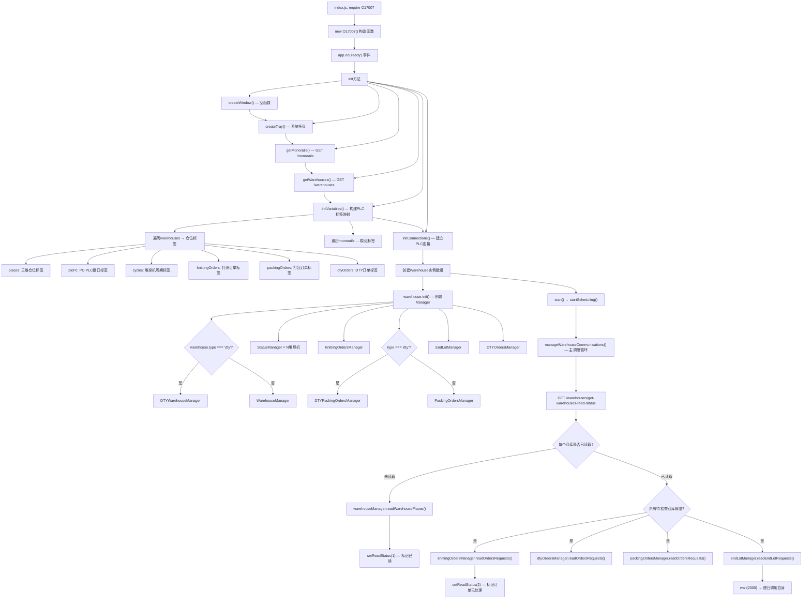

### 2.4 manageWarehouseCommunications() 主调度循环详解（第569-628行）

这是V2版本的核心调度模式，取代了V1中各Manager独立的 `setTimeout` 调度：

```javascript
async manageWarehouseCommunications() {
    // 1. 获取所有仓库读取状态
    let response = await axios.get('/warehouses/get-warehouses-read-status');
    const warehouseReadStatus = response.data.data.reduce((acc, curr) => {
        // 按类型(fdy/dty)聚合: 所有同类型仓库都已读取时才为true
        if (!acc.hasOwnProperty(curr.type)) acc[curr.type] = curr.isRead;
        else acc[curr.type] = Boolean(acc[curr.type] && curr.isRead);
        // 按仓库ID: 直接存状态值
        acc[curr.warehouseId] = curr.isRead;
        return acc;
    }, {});

    // 2. 仓位读取阶段 — 未读取的仓库执行位置同步
    for (let i = 0; i < this.warehouses.length; i++) {
        if (!warehouseReadStatus[warehouse.warehouseId]) {
            const hasErrors = await warehouse.warehouseManager.readWarehousePlaces();
            if (!hasErrors) await warehouse.warehouseManager.setReadStatus(1); // 标记为已读取
        }
    }

    // 3. 检查warehousesToCheck中的仓库是否全部就绪
    const warehousesToCheckStatus = config.warehousesToCheck.reduce((acc, curr) => {
        if (warehouseReadStatus[curr] == 1 || warehouseReadStatus[curr] == 0) acc = false;
        return acc;
    }, true);

    // 4. 订单处理阶段 — 仅在类型级别和仓库级别都就绪时执行
    for (let i = 0; i < this.warehouses.length; i++) {
        const condition = (
            (warehouse.type === 'fdy' && warehouseReadStatus.fdy) ||
            (warehouse.type === 'dty' && warehouseReadStatus.dty)
        ) && warehouseReadStatus[warehouse.warehouseId] === 1
          && warehousesToCheckStatus;

        if (condition) {
            // 顺序执行：针织订单 → DTY订单 → 打包订单 + 结束批次
            await warehouse.knittingOrdersManager.readOrdersRequests();
            await warehouse.knittingOrdersManager.readModuleConfirmRequest();
            await warehouse.dtyOrdersManager.readOrdersRequests();
            await warehouse.dtyOrdersManager.readModuleConfirmRequest();
            await warehouse.packingOrdersManager.readOrdersRequests();
            await warehouse.packingOrdersManager.readModuleConfirmRequest();
            await warehouse.endLotManager.readEndLotRequests();
            // 标记订单已处理
            await warehouse.warehouseManager.setReadStatus(2);
        }
    }

    // 5. 等待2秒后递归调用
    await wait(2000);
    this.manageWarehouseCommunications(); // 注意: 无await，不会堆栈溢出（但无错误处理）
}
```

**readStatus 状态机**:
- `0` → 初始/未读取 → 需要执行仓位读取
- `1` → 仓位已读取 → 可以处理订单
- `2` → 订单已处理 → 下一轮开始时被后端重置为0

---

## 3. 与O17003后端的HTTP通信机制

### 3.1 http.js 逐行分析

#### 3.1.1 Axios实例创建（第1-19行）

```javascript
const urls = config.restApiServerUrl;  // 字符串数组，如 ['http://localhost:8092']

let axiosConfig = {
    timeout: 60000,                    // 60秒超时
    httpAgent: new http.Agent({ keepAlive: true }),   // HTTP长连接
    httpsAgent: new https.Agent({ keepAlive: true }), // HTTPS长连接
    maxContentLength: 50 * 1000 * 1000,               // 50MB最大响应
    baseURL: config.restApiServerUrl[0],              // 首选URL
};

const _axios = axios.create(axiosConfig);
_axios.defaults.adapter = require('axios/lib/adapters/http'); // 强制使用Node HTTP适配器
delete process.env['http_proxy'];   // 清除代理环境变量
delete process.env['HTTP_PROXY'];
delete process.env['https_proxy'];
delete process.env['HTTPS_PROXY'];
```

#### 3.1.2 故障转移拦截器（第27-72行）

```javascript
// 响应拦截器: 错误时触发故障转移
_axios.interceptors.response.use(
    response => response,
    error => nextAxios(error, 0)  // 失败时调用nextAxios
);

async function nextAxios(error, index) {
    // 仅在无响应（网络错误）且配置了多URL时触障转移
    if (!error.config || error.response != null) throw error;
    if (!Array.isArray(config.restApiServerUrl)) throw error;

    // 轮转到下一个URL
    currentUrlIndex = currentUrlIndex >= urls.length - 1 ? 0 : currentUrlIndex + 1;
    error.config.url = error.config.url.replace(errorUrl, currentUrl);
    error.config.baseURL = currentUrl;
    _axios.defaults.baseURL = currentUrl;

    await wait(1000);  // 等1秒
    logger.info(`Switching to ${currentUrl}`);

    try {
        return await axios.request(error.config); // 重试请求
    } catch (error) {
        return nextAxios(error, index + 1);       // 递归重试
    }
}
```

**注意**: `index` 参数递增但**从未用于限制重试次数**（被注释掉了），所以会无限重试直到成功或收到HTTP响应。

### 3.2 API端点全表

通过源码中所有 `axios.get/post/put` 调用提取的完整API表：

| 模块 | 方法 | 端点 | 用途 |
|------|------|------|------|
| **O17007** | GET | `/monorails` | 获取单轨线列表 |
| **O17007** | GET | `/warehouses` | 获取仓库列表 |
| **WarehouseManager** | GET | `/warehouses/get-warehouses-read-status` | 仓库读取状态 |
| **WarehouseManager** | PUT | `/warehouses/{id}/update-warehouse-module` | 更新仓位模组 |
| **WarehouseManager** | PUT | `/warehouses/{id}/reset-warehouse-module` | 重置空仓位 |
| **WarehouseManager** | PUT | `/warehouses/{id}/set-warehouse-read-status` | 设置读取状态 |
| **WarehouseManager** | POST | `/work-bobbins/loadingBobbins` | 创建模组（FDY） |
| **WarehouseManager** | POST | `/work-bobbins/update-after-scales` | 称重后更新锭子 |
| **DTYWarehouseManager** | GET | `/lots?filters[...]` | 按编码查询批次 |
| **DTYWarehouseManager** | POST | `/work-bobbins/load-dty-bobbins` | 创建模组（DTY） |
| **KnittingOrdersManager** | GET | `/knitting-orders?filters[...]` | 查询针织订单 |
| **KnittingOrdersManager** | GET | `/knitting-orders/{id}/sent` | 已发送模组 |
| **KnittingOrdersManager** | POST | `/knitting-orders/sync` | 同步订单状态 |
| **KnittingOrdersManager** | POST | `/knitting-orders/get-module` | 查找可用模组 |
| **KnittingOrdersManager** | POST | `/knitting-orders/confirm` | 确认模组到达 |
| **KnittingOrdersManager** | PUT | `/knitting-orders/add-module` | 添加模组到订单 |
| **KnittingOrdersManager** | PUT | `/knitting-orders/{id}/close` | 强制关闭订单 |
| **PackingOrdersManager (FDY)** | GET | `/orders?filters[...]` | 查询FDY打包订单 |
| **PackingOrdersManager (FDY)** | GET | `/orders/{id}/sent` | 已发送模组 |
| **PackingOrdersManager (FDY)** | GET | `/orders/available/{packingNumber}` | 可用物料 |
| **PackingOrdersManager (FDY)** | POST | `/orders/sync` | 同步订单 |
| **PackingOrdersManager (FDY)** | POST | `/orders/get-module-for-order` | 查找模组 |
| **PackingOrdersManager (FDY)** | POST | `/orders/confirm` | 确认模组 |
| **PackingOrdersManager (FDY)** | POST | `/orders` | 创建新订单 |
| **PackingOrdersManager (FDY)** | PUT | `/orders/update-order-module` | 更新订单模组 |
| **PackingOrdersManager (FDY)** | PUT | `/orders/{id}/close` | 关闭订单 |
| **DTYPackingOrdersManager** | GET | `/dty-orders?filters[...]` | 查询DTY打包订单 |
| **DTYPackingOrdersManager** | GET | `/dty-orders/{id}/sent` | 已发送模组 |
| **DTYPackingOrdersManager** | GET | `/dty-orders/available/{packingNumber}` | DTY可用物料 |
| **DTYPackingOrdersManager** | POST | `/dty-orders/sync` | 同步DTY订单 |
| **DTYPackingOrdersManager** | POST | `/dty-orders/get-module-for-order` | 查找DTY模组 |
| **DTYPackingOrdersManager** | POST | `/dty-orders` | 创建DTY订单 |
| **DTYPackingOrdersManager** | PUT | `/dty-orders/update-order-module` | 更新DTY订单模组 |
| **DTYPackingOrdersManager** | PUT | `/dty-orders/{id}/close` | 关闭DTY订单 |
| **DTYOrdersManager** | GET | `/dty-warehouse-orders?filters[...]` | 查询DTY出库订单 |
| **DTYOrdersManager** | GET | `/dty-warehouse-orders/{id}/sent` | 已发送模组 |
| **DTYOrdersManager** | POST | `/dty-warehouse-orders/sync` | 同步出库订单 |
| **DTYOrdersManager** | POST | `/dty-warehouse-orders/confirm` | 确认出库 |
| **DTYOrdersManager** | PUT | `/dty-warehouse-orders/add-module` | 添加出库模组 |
| **DTYOrdersManager** | PUT | `/dty-warehouse-orders/{id}/close` | 关闭出库订单 |
| **EndLotManager** | GET | `/modules-status?filters[...]` | 查询结束批次模组 |
| **EndLotManager** | PUT | `/modules-status/to-be-taken` | 标记待取 |
| **StatusManager** | POST | `/status/warehouses` | 上报堆垛机状态 |
| **StatusManager** | POST | `/status/warehouses/alarms` | 上报报警 |
| **StatusManager** | POST | `/cycles/warehouses-cycles` | 上报周期数据 |

### 3.3 HTTP通信流程图

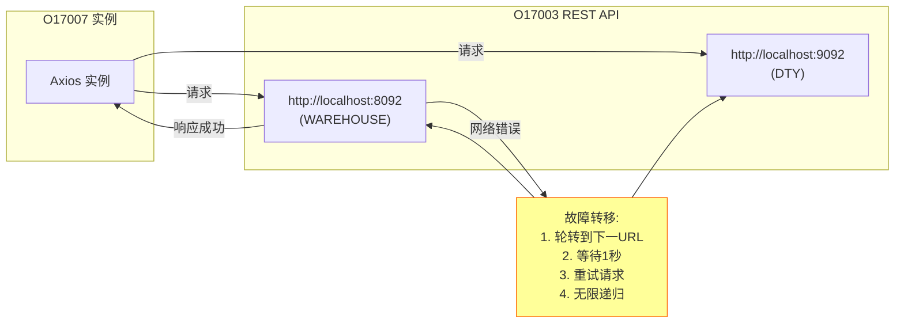

---

## 4. StatusManager 状态轮询

### 4.1 逐行分析

`StatusManager` 负责监控堆垛机（Stacker）的实时状态，每个堆垛机对应一个 StatusManager 实例。

#### 4.1.1 构造函数（第6-15行）

```javascript
constructor(communication, warehouseCycle, warehouseId) {
    this.communication = communication;    // PLC通信实例
    this.warehouseCycle = warehouseCycle;   // 堆垛机标签集合 {stackerNumber, prefix, tags[]}
    this.oldValues = {};                   // 状态变化检测缓存
    this.oldAlarms = {};                   // 报警变化检测缓存
    this.warehouseId = warehouseId;        // 仓库ID
}
```

#### 4.1.2 readData()（第47-61行）

```javascript
async readData() {
    // 过滤出需要读取的标签: ID类 + ActualStatus + Alarms
    const tags = this.warehouseCycle.tags.filter(o =>
        o.name.includes('ID') || o.name.includes('ActualStatus') || o.name.includes('Alarms')
    );
    const variables = await this.communication.readVariable(tagsNames);

    // 分发到三个处理方法
    await this.manageStatus(variables.find(o => o.name.includes('ActualStatus')));
    await this.manageAlarms(variables.find(o => o.name.includes('Alarms')));
    await this.manageCycles(variables.filter(o => o.name.includes('ID')));
}
```

#### 4.1.3 manageStatus() — 状态变化检测（第63-75行）

```javascript
async manageStatus(statusVariable) {
    // 仅在值变化时上报
    if (statusVariable.value != this.oldValues[statusVariable.name]) {
        logger.info(`status change oldStatus: ${old}, newStatus: ${new}`);
        await axios.post('/status/warehouses', {
            status: statusVariable.value,
            stackerNumber: this.warehouseCycle.stackerNumber,
            warehouseId: this.warehouseId
        });
        this.oldValues[statusVariable.name] = statusVariable.value;
    }
}
```

#### 4.1.4 manageAlarms() — 位级报警检测（第77-98行）

```javascript
async manageAlarms(alarmVariable) {
    // Alarms 是 20个WORD (16位)，共 320 个报警位
    const alarmsWords = alarmVariable.value.map(o => o.toString(2).padStart(16, '0'));

    for (let i = 0; i < 20; i++) {       // 遍历20个WORD
        for (let k = 0; k < 16; k++) {   // 遍历每个位
            if (Number(alarmsWords[i][k]) != this.oldAlarms[`word${i+1}.bit${k}`]) {
                if (Number(alarmsWords[i][k]) == 1) {
                    // 仅在报警位从0→1时上报
                    await axios.post('/status/warehouses/alarms', {
                        word: i + 1, bit: k,
                        warehouseId, stackerNumber
                    });
                }
                this.oldAlarms[`word${i+1}.bit${k}`] = Number(alarmsWords[i][k]);
            }
        }
    }
}
```

#### 4.1.5 manageCycles() — 周期完成检测（第100-126行）

```javascript
async manageCycles(variables) {
    for (let i = 0; i < 15; i++) {  // 15个周期槽位
        const cycleId = variables.find(o => o.name.includes(`Cycle[${i+1}].ID`));

        if (cycleId.value != this.oldValues[cycleId.name] && cycleId.value != 0) {
            // 周期ID变化且非零 → 读取周期时间
            const dropValue = await this.communication.readVariable(`...Cycle[${i+1}].LastTime`);

            await axios.post('/cycles/warehouses-cycles', {
                warehouseId,
                number: this.warehouseCycle.stackerNumber,
                cycleId: i + 1,        // 槽位号
                dropId: cycleId.value,  // 放货ID
                dropValue: dropValue.value  // 周期时间
            });
            this.oldValues[cycleId.name] = cycleId.value;
        }
    }
}
```

### 4.2 StatusManager 流程图

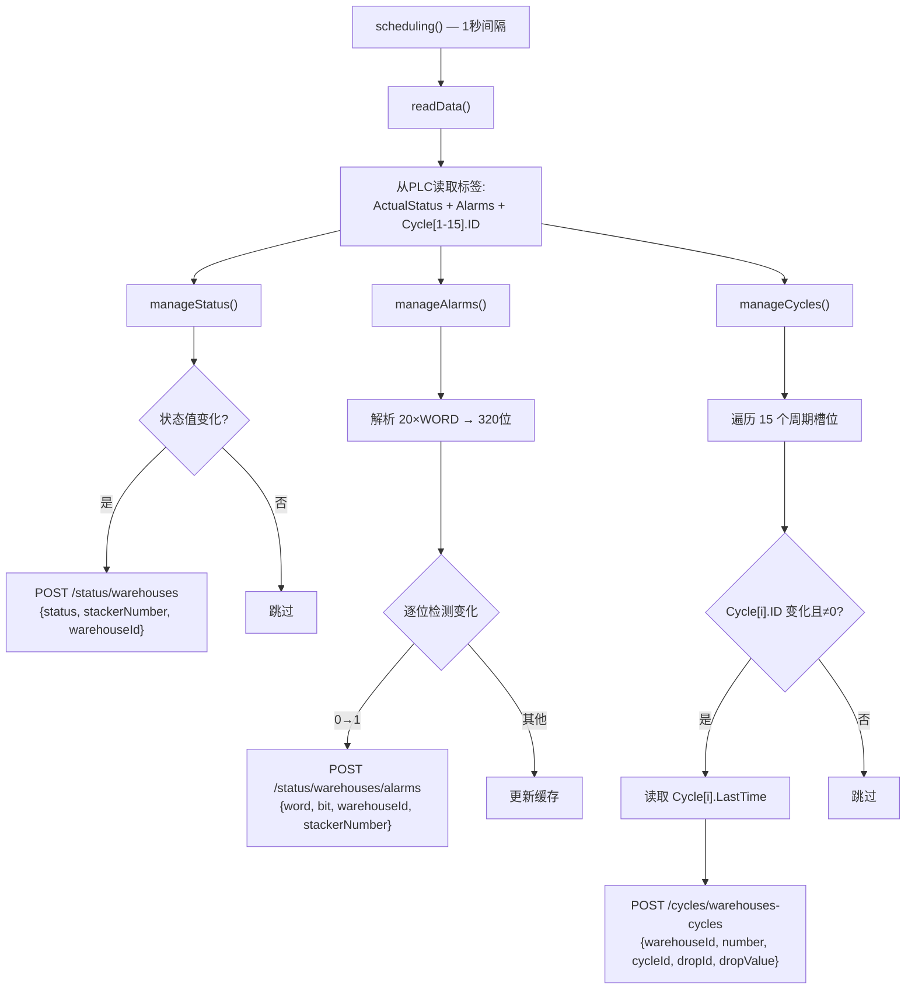

---

## 5. WarehouseManager 仓库操作（FDY）

### 5.1 逐行分析

`WarehouseManager` 是 **FDY类型仓库**的位置同步管理器。

#### 5.1.1 managePlaces()（第50-83行）

```javascript
async managePlaces() {
    this.hasErrors = false;
    for (let i = 0; i < this.places.filter(o => !o.comInProgress).length; i++) {
        const place = this.places[i];
        try {
            place.comInProgress = true;  // 通信锁

            // 读取3个核心变量
            let variables = await this.communication.readVariable([
                `${place.prefix}ModuleNo`,         // 模组号
                `${place.prefix}ModuleStatus`,      // 模组状态 (0空/1满)
                `${place.prefix}PositionStatus`     // 位置状态 (1正常/2禁用/3错误)
            ]);

            const moduleNumber = variables.find(o => o.name.includes('ModuleNo'));
            const placeStatus = variables.find(o => o.name.includes('ModuleStatus'));
            let disabled = variables.find(o => o.name.includes('PositionStatus')).value;
            disabled = disabled != 1 ? 1 : 0;  // 反转逻辑: 1=正常→disabled=0

            // 变化检测 — 仅值变化时执行写入
            if (!(oldModuleNumber == moduleNumber && oldStatus == placeStatus && oldDisabled == disabled)) {
                await this.writeBobbinsData(place, placeNewValues);
                place.oldValues = { ...placeNewValues };
            }
        } finally {
            place.comInProgress = false;  // 释放通信锁
        }
    }
}
```

#### 5.1.2 writeBobbinsData() — FDY版（第85-201行）

核心逻辑按模组号分支：

**模组号 > 0 — 有模组的仓位**:

```javascript
if (number > 0) {
    // 1. 读取模组的 ModuleID 和 DoffingId
    let variables = await this.communication.readVariable([
        `Module[n].ModuleID`,   // 模组数据库ID
        `Module[n].DoffingId`   // 落纱ID（2个）
    ]);

    // 2. 如果 ModuleID < 0 → 模组未创建，需要创建
    if (idModule < 0) {
        // POST /work-bobbins/loadingBobbins
        // 参数: id1(落纱1), id2(落纱2), number(模组号), containerType='module', sortingId=1
        let response = await axios.post('/work-bobbins/loadingBobbins', params);
        const containerId = response.data.containerId;

        // 将数据库ID写回PLC
        await this.communication.writeVariable([{
            name: `Module[n].ModuleID`, value: containerId
        }]);
    }

    // 3. 读取模组详细数据（逐个读取防止ECONNRESET）
    // KnittingDone, SortingGrade[24], SortingDefect[24], SortingWeight[24],
    // Status[24], VisionGrade[24], VisionDefect[24], KnittingGrade[24], Lot

    // 4. ModuleID > 0 → 更新锭子数据
    if (idModule > 0) {
        // POST /work-bobbins/update-after-scales
        // 发送: statusPins[], sortingGrades[], defects[], weights[],
        //       visionGrades[], visionDefects[], knittingGrades[], moduleNumber, doffingId1/2
    }

    // 5. 更新仓位记录
    // PUT /warehouses/{id}/update-warehouse-module
    // 参数: column, row, place, moduleNumber, doffing1, doffing2,
    //       status, lotCode, disabled, afterKnitting
}
```

**模组号 == 0 — 空仓位**:

```javascript
if (number == 0) {
    // PUT /warehouses/{id}/reset-warehouse-module
    // 参数: column, row, place
}
```

### 5.2 WarehouseManager 流程图

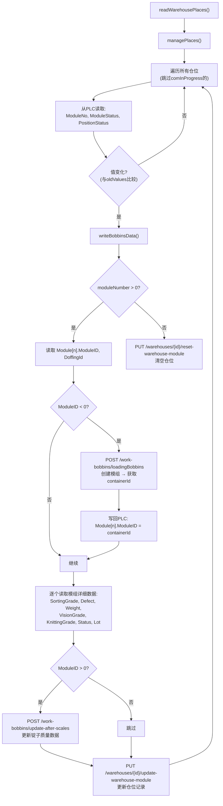

### 5.3 setReadStatus()（第203-209行）

```javascript
async setReadStatus(status) {
    await axios.put(`warehouses/${id}/set-warehouse-read-status`, { isRead: status });
}
```

注意: URL缺少前导 `/`（`warehouses/...` 而非 `/warehouses/...`），但因为 axios 的 baseURL 拼接机制，这仍然能工作。

---

## 6. DTYWarehouseManager DTY仓库操作

### 6.1 与WarehouseManager的关键差异

`DTYWarehouseManager` 继承了完全相同的类结构，但有以下差异：

| 特性 | WarehouseManager (FDY) | DTYWarehouseManager |
|------|------------------------|---------------------|
| **模组号偏移** | `modules[number - 1]` | `modules[number - 2001]` |
| **模组号阈值** | `number > 0` | `number > 2000` |
| **创建模组API** | `POST /work-bobbins/loadingBobbins` | `POST /work-bobbins/load-dty-bobbins` |
| **创建参数** | `id1, id2, number, containerType, sortingId` | `number, sortingId, lotId` |
| **批次查询** | 不需要 | `GET /lots?filters[code][eq]=...&filters[machine_code][eq]=...` |
| **Lot解析** | 直接传 `lotCode` | `lotCode.substring(0,16)` = 批次码, `lotCode.substring(17,21)` = 机器码 |
| **更新后参数** | 传 `doffingId1, doffingId2` | 传 `idModule` |
| **仓位更新参数** | 传 `doffing1, doffing2` | 传 `moduleId` |

### 6.2 DTY模组号偏移2000的含义

DTY仓库使用模组号 2001+ 来区分DTY模组和FDY模组：
- FDY模组号: 1 ~ 2000
- DTY模组号: 2001+ → 实际索引 = moduleNumber - 2001

### 6.3 DTY模组创建流程

```javascript
if (idModule < 0) {
    // 1. 从Lot编码解析: "ABCDEFGHIJKLMNOP_WXYZ..."
    const code = lotCode.substring(0, 16).trim();      // 前16字符 = 批次码
    const machineCode = lotCode.substring(17, 21);      // 17-20字符 = 机器码

    // 2. 查询批次ID
    let response = await axios.get(`/lots?filters[l.code][eq]=${code}&filters[l.machine_code][eq]=${machineCode}`);
    const lotId = response.data.data[0].id;

    // 3. 创建DTY模组
    response = await axios.post('/work-bobbins/load-dty-bobbins', { number, sortingId: 1, lotId });
    const containerId = response.data.containerId;

    // 4. 写回PLC
    await this.communication.writeVariable([{ name: `Module[n].ModuleID`, value: containerId }]);
}
```

### 6.4 DTYWarehouseManager 流程图

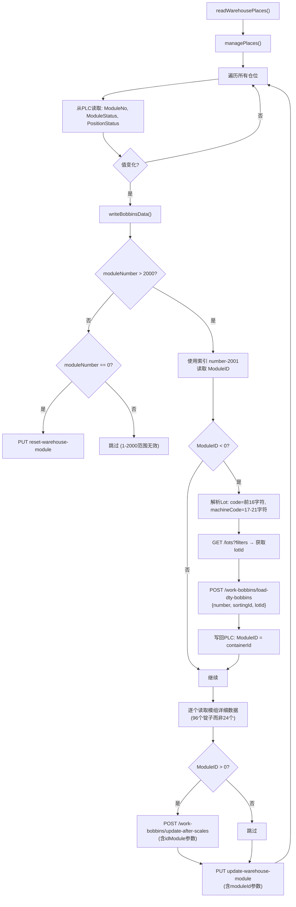

---

## 7. KnittingOrdersManager 针织订单处理

### 7.1 逐行分析

`KnittingOrdersManager` 管理**针织订单**的PLC调度 — 从仓库取模组送往针织机。

#### 7.1.1 readOrdersRequests()（第46-65行）

```javascript
async readOrdersRequests() {
    // 1. 读取PLC Enabled标志位数组
    const enabledTag = this.plcPc.tags.find(k => k.name === `${this.plcPc.prefix}Enabled`);
    const enabled = (await this.communication.readVariable(enabledTag)).value;

    // 2. 检查当前仓库是否启用（基于warehouseId的数组索引）
    if (this.comInProgress || !enabled[this.warehouse.id - 1]) return;

    // 3. 遍历所有针织通道
    await this.manageOrdersRequests(enabled);
}
```

#### 7.1.2 manageOrdersRequests()（第67-92行）

```javascript
async manageOrdersRequests(enabled) {
    for (let i = 0; i < this.knittingOrders.length; i++) {
        // 读取当前针织通道的PLC标签
        const variables = await this.communication.readVariable(tagsNames);

        // 同步缓冲区数据
        await this.syncOrder(knittingBuffer);

        // 检查DTY类型仓库的KnittingDisabled标志
        if (warehouse.type === 'dty')
            knittingDisabled = (await this.communication.readVariable(`KnittingDisabled[${i+1}]`)).value;

        // ModuleNo == 0 → PLC准备接收新模组
        if (moduleNumber == 0) {
            await this.findKnittingOrder(knitting, enabled, knittingDisabled);
        }
    }
}
```

#### 7.1.3 syncOrder() — 同步机制（第143-159行）

```javascript
async syncOrder(knittingBuffer) {
    // 读取4个标签: Buffer中的ModuleNo和OrderId + plcPc中的ModuleNo和KnittingOrderId
    const bufferModuleNumber = ...;
    const bufferKnittingOrderId = ...;
    const confirmModuleNumber = ...;
    const knittingOrderId = ...;

    // 如果缓冲区有数据 → 同步到数据库
    if (bufferModuleNumber > 0 && bufferKnittingOrderId > 0) {
        await axios.post('/knitting-orders/sync', { orderId, moduleNumber });
    }
    // 如果确认区有数据 → 同步到数据库
    if (confirmModuleNumber > 0 && knittingOrderId > 0) {
        await axios.post('/knitting-orders/sync', { orderId, moduleNumber });
    }
}
```

**同步目的**: 防止PLC写入成功但数据库更新失败造成的不一致。每次循环先检查PLC中的缓冲数据是否在数据库中。

#### 7.1.4 findKnittingOrder() — 核心调度逻辑（第94-141行）

```javascript
async findKnittingOrder(knitting, enabled, knittingDisabled) {
    // 1. 查询活跃订单（started 或 to-start）
    let response = await axios.get(`/knitting-orders?filters[status][eq]=started&filters[status][eq]=to-start&filters[knitting_id][eq]=${knittingNumber}`);
    const knittingOrders = response.data.data.sort((a, b) => new Date(a.timestamp) - new Date(b.timestamp));

    // 2. 优先选择已开始的订单，其次是待开始的（如果针织未禁用）
    const startedOrders = knittingOrders.filter(o => o.status === 'started');
    const ordersToStart = knittingOrders.filter(o => o.status === 'to-start');

    if (startedOrders.length) selectedOrder = startedOrders[0];
    if (!selectedOrder && ordersToStart.length && !knittingDisabled) selectedOrder = ordersToStart[0];

    // 3. 检查已发送模组数量
    if (selectedOrder) {
        response = await axios.get(`/knitting-orders/${selectedOrder.id}/sent`);
        modulesOnTheWay = response.data.data.length;

        // 4. 未满员 → 从当前仓库查找模组
        if (modulesOnTheWay < selectedOrder.total) {
            moduleFound = await this.findModuleToSend(selectedOrder, this.warehouse.id);
        }
    }

    // 5. 当前仓库没找到 → 搜索其他仓库
    if (selectedOrder && !moduleFound && modulesOnTheWay < selectedOrder.total) {
        const warehousesToCheck = allWarehouses.filter(o => o.id !== this.warehouse.id);
        for (let i = 0; i < warehousesToCheck.length; i++) {
            if (enabled[warehousesToCheck[i].id - 1])
                moduleFromAnotherWarehouse = await this.findModuleToSend(selectedOrder, warehousesToCheck[i].id);
            if (moduleFromAnotherWarehouse) break;
        }

        // 6. 所有仓库都没有 → 强制关闭订单
        if (!moduleFromAnotherWarehouse) {
            await this.closeOrder(selectedOrder);
        }
    } else if (moduleFound) {
        // 7. 找到模组 → 写入PLC + 更新数据库
        await this.sendModuleToPlc(moduleFound, selectedOrder, knitting, modulesOnTheWay);
        await this.updateSelectedOrder(selectedOrder, moduleFound, knitting);
    }
}
```

#### 7.1.5 findModuleToSend()（第161-169行）

```javascript
async findModuleToSend(order, warehouseId) {
    // 调用后端API查找匹配订单的可用模组
    const response = await axios.post('/knitting-orders/get-module', { orderId: order.id, warehouseId });
    const modules = response.data.data.sort((a, b) => new Date(a.timestamp) - new Date(b.timestamp));
    return modules.length ? modules[0] : null;  // 按时间排序取最早的
}
```

#### 7.1.6 sendModuleToPlc()（第171-196行）

```javascript
async sendModuleToPlc(moduleData, orderData, knitting, modulesOnTheWay) {
    const variablesToWrite = [
        { name: `knitting1.ModuleNo`, value: moduleData.number },
        { name: `knitting1.Data.ID`, value: orderData.id },
        { name: `knitting1.Data.ModuleSequenceNo`, value: modulesOnTheWay + 1 },
        { name: `knitting1.Data.TotalModules`, value: orderData.total },
    ];
    let response = await this.communication.writeVariable(variablesToWrite);
    if (response.some(o => !o.writeOk)) throw new Error('Error while writing');
}
```

**PLC写入的含义**:
- `ModuleNo` → 告诉堆垛机取第N号模组
- `Data.ID` → 订单ID（用于后续确认）
- `Data.ModuleSequenceNo` → 这是订单的第几个模组
- `Data.TotalModules` → 订单总共需要多少个模组

#### 7.1.7 readModuleConfirmRequest()（第207-242行）

```javascript
async readModuleConfirmRequest() {
    // 读取PLC确认区: ModuleNo, KnittingOrderId, PackingOrderId, DTYOrderId, Status
    const moduleNumber = ...;
    const knittingOrderId = ...;
    const packingOrderId = ...;
    const status = ...;

    // 条件: knitting > 0 且 packing == 0 且 dty == 0 → 这是一个针织确认
    if (knittingOrderId > 0 && packingOrderId == 0 && DTYOrderId == 0 && moduleNumber > 0 && status > 0) {
        // 通知后端: 模组已被堆垛机取出
        await axios.post('/knitting-orders/confirm', { orderId, status, moduleNumber });

        // 向PLC回写 DataReceived = 1 → 表示PC已收到确认
        await this.communication.writeVariable([{ name: `plcPc.DataReceived`, value: 1 }]);
    }
}
```

### 7.2 KnittingOrdersManager 流程图

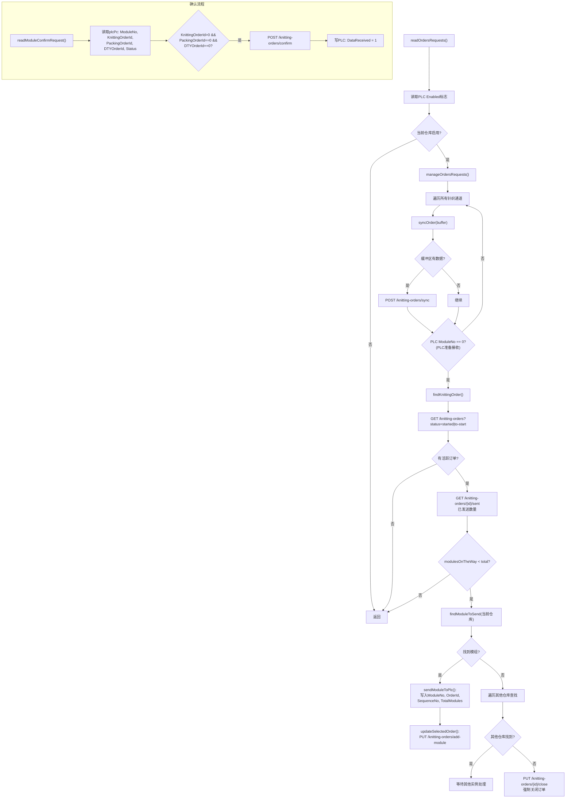

---

## 8. PackingOrdersManager 打包订单处理（FDY）

### 8.1 逐行分析

`PackingOrdersManager` 管理 **FDY打包订单** — 从仓库取模组送往打包机。与KnittingOrdersManager结构类似，但增加了**自动创建订单**和**锭子级别计数**的能力。

#### 8.1.1 findPackingOrder() — 核心调度（第96-165行）

```javascript
async findPackingOrder(packing, enabled) {
    // 1. 查询活跃订单 — 使用 /orders 端点（FDY专用）
    let response = await axios.get(`/orders?filters[type][eq]=automatic&filters[status][eq]=started&filters[status][eq]=to-start&filters[palletizer_id][eq]=${packing.packingNumber}`);

    // 2. 已发送锭子计数（而非模组计数）
    response = await axios.get(`/orders/${selectedOrder.id}/sent`);
    bobbinsOnTheWay = modulesOnTheWay.reduce((acc, curr) => {
        acc += curr.numberOfBobbins;  // 按锭子数量累计
        return acc;
    }, 0);

    // 3. 查找逻辑: 本仓库 → 其他仓库 → 无法完成则关闭
    if (bobbinsOnTheWay < selectedOrder.bobbinsAmount) {
        moduleFound = await this.findModuleToSend(selectedOrder, this.warehouse.id);
        // ... 其他仓库搜索 ...
    }

    // 4. 分支处理
    if (moduleFound) {
        await this.sendModuleToPlc(moduleFound, selectedOrder, packing);
        await this.updateSelectedOrder(selectedOrder, moduleFound, packing);
    } else if (!selectedOrder) {
        // 无订单 → 自动创建
        if (!config.createOrders) return;  // 配置控制开关
        await this.createNewOrder(packing, enabled);
    } else if (selectedOrder && !moduleFound && bobbinsOnTheWay < selectedOrder.bobbinsAmount && !moduleFromAnotherWarehouse) {
        // 有订单但无可用模组且其他仓库也没有 → 强制关闭
        await this.closeOrder(selectedOrder);
    }
}
```

#### 8.1.2 createNewOrder() — 自动订单创建（第239-353行）

这是PackingOrdersManager独有的复杂功能：

```javascript
async createNewOrder(packing, enabled) {
    // 1. 检查已有活跃订单的批次，排除重复
    let response = await axios.get('/orders?filters[type][eq]=automatic&filters[status][eq]=started|to-start');
    const orderLots = response.data.data.map(o => o.lot.id);

    // 构建排除过滤器
    let filters = '';
    orderLots.forEach(o => { filters += `&filters[lot_id][neq]=${o}`; });

    // 2. 查询可用物料
    response = await axios.get(`/orders/available/${packing.packingNumber}?${filters}`);
    let availables = response.data.data.map(o => ({
        ...o,
        bobbinsDifference: o.bobbinsAvailable % o.lot.minimumBobbins,
        bobbinsDifferenceAA1: o.bobbinsAvailableAA1 % o.lot.minimumBobbins,
        bobbinsDifferenceAA2: o.bobbinsAvailableAA2 % o.lot.minimumBobbins,
        bobbinsDifferenceA: o.bobbinsAvailableA % o.lot.minimumBobbins,
    }));

    // 3. 如果某些仓库被禁用，扣除对应锭子数
    if (enabled.some(o => o == 0)) {
        for (warehousesToCheck) {
            if (!enabled[w.id - 1]) availables = await this.removeBobbinsCount(availables, w.id);
        }
    }

    // 4. 选择最早的模组，确定其品级
    const allModules = availables.map(o => o.modules).flat()
        .sort((a, b) => new Date(a.moduleStatusTimestamp) - new Date(b.moduleStatusTimestamp));

    for (module of allModules) {
        // 找到模组所属批次，根据锭子品级确定订单品级
        gradeId = findLowestValue(bobbins, 'finalGradeId');
        // 品级映射: 1=A, 3=AA1, 5=AA2, 7=A等级
        if (bobbinsAvailable >= tempOrder.lot.minimumBobbins) {
            selectedOrder = tempOrder; break;
        }
    }

    // 5. 计算订单数量
    const bobbinsAmount = Math.min(
        bobbinsAvailable - bobbinsDifference,  // 取整到minimumBobbins的倍数
        selectedOrder.maximumBobbins            // 不超过最大值
    );

    // 6. 创建订单
    const orderData = {
        lotId, bobbinsAmount,
        palletsAmount: bobbinsAmount / (palletLevel * 9),   // FDY: 每层9个锭子
        palletLevel, destination, palletizerId: packing.packingNumber,
        operatorNumber: '30003508',  // 硬编码操作员号
        type: 'automatic',
        palletSize: selectedOrder.lot.defaultPalletSize,
        orderGradeId: gradeId,
    };
    response = await axios.post('/orders', orderData);
}
```

#### 8.1.3 removeBobbinsCount() — 禁用仓库锭子扣除（第186-237行）

```javascript
async removeBobbinsCount(availables, warehouseId) {
    // 对每个可用批次，移除指定仓库的模组和对应锭子计数
    // 按品级分类扣除: 1(A), 3(AA1), 5(AA2), 7(A级)
    // 扣除后重新计算余数和最小数量判断
}
```

#### 8.1.4 sendModuleToPlc() — FDY打包写入（第367-427行）

```javascript
const variablesToWrite = [
    { name: `packing1.Data.ID`, value: orderData.id },
    { name: `packing1.Data.ModuleSequenceNo`, value: bobbinsSent + bobbinsToPallet },  // 累计锭子数
    { name: `packing1.Data.TotalModules`, value: 0 },                                 // FDY不用模组计数
    { name: `packing1.Data.BobbinsToPallet`, value: bobbinsToPallet },                 // 本次锭子数
    { name: `packing1.Data.TotalBobbins`, value: orderData.bobbinsAmount },            // 订单总锭子
    { name: `packing1.Data.OrderGrade`, value: orderData.orderGrade.code },
    { name: `packing1.Data.PalletH`, value: orderData.lot.defaultPalletLevel },
    { name: `packing1.Data.PalletType`, value: palletSize == 1050 ? 1 : 2 },
    { name: `packing1.Data.LabelType`, value: orderData.lot.defaultDestination },
    { name: `packing1.ModuleNo`, value: moduleData.moduleNumber },
];

// 注意: 逐个写入（不是批量），防止通信溢出
for (let i = 0; i < variablesToWrite.length; i++) {
    const writeData = await this.communication.writeVariable(variablesToWrite[i]);
    response.push(writeData);
}
```

#### 8.1.5 readModuleConfirmRequest() — FDY打包确认（第441-484行）

```javascript
// 条件: packingOrderId > 0 && knittingOrderId == 0 && DTYOrderId == 0
if (knittingOrderId == 0 && packingOrderId > 0 && DTYOrderId == 0 && moduleNumber > 0 && status > 0) {
    await axios.post('/orders/confirm', { orderId: packingOrderId, status, moduleNumber });
    await this.communication.writeVariable([{ name: 'DataReceived', value: 1 }]);
}

// 特殊: packingOrderId < 0 → EndLot确认（不记录，只回写DataReceived）
else if (knittingOrderId == 0 && packingOrderId < 0 && DTYOrderId == 0 && moduleNumber > 0 && status > 0) {
    await this.communication.writeVariable([{ name: 'DataReceived', value: 1 }]);
}
```

### 8.2 PackingOrdersManager 流程图

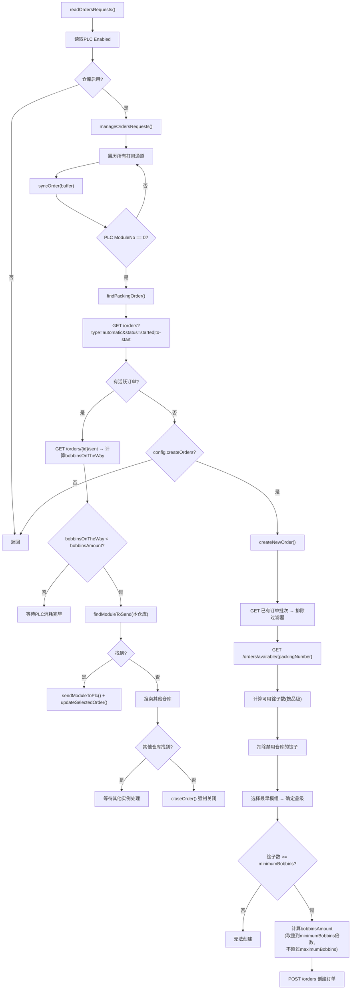

---

## 9. DTYPackingOrdersManager 打包订单处理（DTY）

### 9.1 与PackingOrdersManager (FDY)的关键差异

`DTYPackingOrdersManager` 是DTY类型仓库专用的打包管理器，结构与FDY版本高度相似，主要差异：

| 特性 | PackingOrdersManager (FDY) | DTYPackingOrdersManager |
|------|---------------------------|-------------------------|
| **订单API** | `/orders` | `/dty-orders` |
| **同步API** | `/orders/sync` | `/dty-orders/sync` |
| **创建API** | `POST /orders` | `POST /dty-orders` |
| **查找模组API** | `POST /orders/get-module-for-order` | `POST /dty-orders/get-module-for-order` |
| **更新API** | `PUT /orders/update-order-module` | `PUT /dty-orders/update-order-module` |
| **确认API** | `POST /orders/confirm` | 无confirm（注释掉） |
| **可用物料API** | `GET /orders/available/{id}` | `GET /dty-orders/available/{id}` |
| **托盘计算** | `bobbinsAmount / (palletLevel × 9)` | `bobbinsAmount / (palletLevel × 30)` |
| **包装数量** | 无 | `boxesNumber: bobbinsAmount / 6` |
| **仓库类型过滤** | `filters[type][eq]=fdy` | `filters[type][eq]=dty` |
| **品级映射** | 1(A), 3(AA1), 5(AA2), 7(A) — 4级 | 1(A), 3(AA), 5(AA1), 7(AA2), 9(A1) — 5级 |
| **锭子过滤** | 按 `doffingId` 过滤 | 按 `moduleId` 过滤 |
| **确认行为** | 写confirm + DataReceived | 仅写DataReceived（confirm被注释） |

### 9.2 DTY打包独有逻辑

**品级体系差异**:
- FDY品级: 1(A), 3(AA1), 5(AA2), 7(A级) — 4个
- DTY品级: 1(A), 3(AA), 5(AA1), 7(AA2), 9(A1) — 5个

**订单创建参数差异**:
```javascript
// DTY版
const orderData = {
    boxesNumber: bobbinsAmount / 6,                    // DTY有包装箱数
    palletsAmount: bobbinsAmount / (palletLevel * 30),  // 每层30个（FDY是9个）
    // ... 其余相同
};
```

### 9.3 DTYPackingOrdersManager 流程图

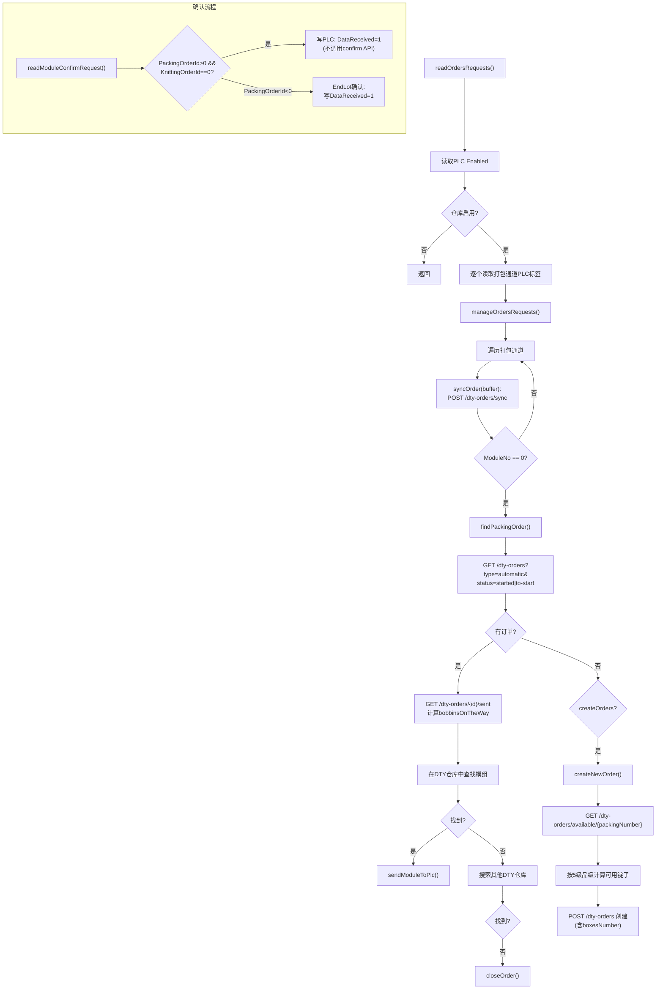

---

## 10. DTYOrdersManager DTY订单处理

### 10.1 系统定位

`DTYOrdersManager` 处理 **DTY出库订单** — 将模组从POY仓库转移到DTY加工区域。这不是打包订单，而是仓库间的物料转移。

### 10.2 逐行分析

#### 10.2.1 findDtyOrder()（第90-138行）

```javascript
async findDtyOrder(dty, enabled) {
    // 1. 查询DTY出库订单
    let response = await axios.get(`/dty-warehouse-orders?filters[status][eq]=started&filters[status][eq]=to-start&filters[dty_id][eq]=${dtyNumber}`);

    // 2. 选择订单（优先started）
    if (startedOrders.length) selectedOrder = startedOrders[0];
    if (!selectedOrder && ordersToStart.length) selectedOrder = ordersToStart[0];

    // 3. 检查已发送模组
    if (selectedOrder) {
        response = await axios.get(`/dty-warehouse-orders/${selectedOrder.id}/sent`);
        modulesOnTheWay = response.data.data.length;  // 按模组数量计数（不是锭子）
    }

    // 4. 查找可用模组
    if (modulesOnTheWay < selectedOrder.total) {
        moduleFound = await this.findModuleToSend(selectedOrder, this.warehouse.id);
    }

    // 5. 跨仓库搜索 — 搜索FDY类型仓库
    if (!moduleFound) {
        response = await axios.get('/warehouses?filters[type][eq]=fdy');  // 注意: 搜索FDY仓库!
        for (warehousesToCheck) {
            if (enabled[w.id - 1]) moduleFromAnotherWarehouse = await this.findModuleToSend(selectedOrder, w.id);
        }
    }

    // 6. 写入PLC + 更新数据库
    if (moduleFound) {
        await this.sendModuleToPlc(moduleFound, selectedOrder, dty, modulesOnTheWay);
        await this.updateSelectedOrder(selectedOrder, moduleFound, dty);
    }
}
```

**关键差异**: DTY出库会从 **FDY仓库** (`filters[type][eq]=fdy`) 中搜索模组，实现**跨仓库类型的物料转移**。

#### 10.2.2 findModuleToSend()（第158-165行）

```javascript
async findModuleToSend(order, warehouseId) {
    // 直接使用模组状态API，按批次和仓位状态过滤
    const response = await axios.get(
        `/modules-status?filters[warehouse_id][eq]=${warehouseId}` +
        `&filters[place_disabled][eq]=0` +     // 仓位未禁用
        `&filters[to_be_taken][eq]=0` +         // 未被标记为待取
        `&filters[status][eq]=2` +              // 状态=2（可用）
        `&filters[lot_id][eq]=${order.lot.id}` + // 匹配批次
        `&filters[row][!lte]=0` +               // 有效行号
        `&filters[column][!lte]=0` +            // 有效列号
        `&filters[place][!lte]=0`               // 有效位号
    );
    return modules.length ? modules[0] : null;
}
```

**与KnittingOrdersManager.findModuleToSend的区别**: DTY使用直接的 `/modules-status` 查询而非专用API，过滤条件更多。

#### 10.2.3 sendModuleToPlc()（第167-191行）

```javascript
const variablesToWrite = [
    { name: `dty1.ModuleNo`, value: moduleData.number },
    { name: `dty1.Data.ID`, value: orderData.id },
    { name: `dty1.Data.ModuleSequenceNo`, value: modulesOnTheWay + 1 },
    { name: `dty1.Data.TotalModules`, value: orderData.total },
];
```

与KnittingOrder格式完全相同——4个字段批量写入PLC。

#### 10.2.4 readModuleConfirmRequest()（第202-234行）

```javascript
// 确认条件: DTYOrderId > 0 && KnittingOrderId == 0 && PackingOrderId == 0
if (knittingOrderId == 0 && packingOrderId == 0 && DTYOrderId > 0 && moduleNumber > 0 && status > 0) {
    await axios.post('/dty-warehouse-orders/confirm', { orderId: DTYOrderId, status, moduleNumber });
    await this.communication.writeVariable([{ name: 'DataReceived', value: 1 }]);
}
```

### 10.3 DTYOrdersManager 流程图

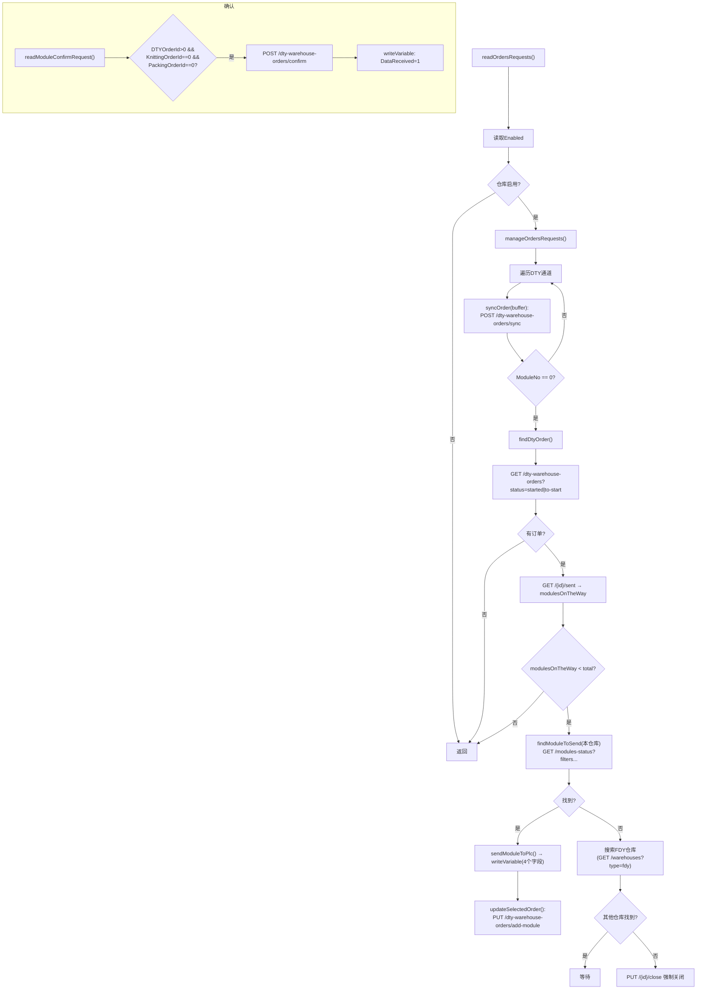

---

## 11. EndLotManager 批次结束处理

### 11.1 逐行分析

`EndLotManager` 处理 **批次结束** 场景 — 当一个批次被标记为"结束批次"(`end_lot=1`)时，将该批次剩余的模组从仓库中清退出去。

#### 11.1.1 readEndLotRequests()（第45-68行）

```javascript
async readEndLotRequests() {
    // 与PackingOrdersManager相同的启用检查
    const enabled = (await this.communication.readVariable(enabledTag)).value;
    if (!enabled[this.warehouse.id - 1]) return;

    // 逐个读取打包通道标签
    for (tagsNames) {
        const readData = await this.communication.readVariable(tagsNames[i]);
        variables.push(readData);
    }

    await this.manageEndLot(variables, enabled);
}
```

#### 11.1.2 manageEndLot()（第70-85行）

```javascript
async manageEndLot(variables) {
    for (let i = 0; i < this.packingOrders.length; i++) {
        const moduleNumber = variables.find(o => o.name === `${prefix}ModuleNo`);
        // 仅在打包通道空闲时（ModuleNo == 0）查找结束批次模组
        if (moduleNumber.value == 0) {
            await this.lookForEndLotModules(packing);
        }
    }
}
```

#### 11.1.3 lookForEndLotModules()（第87-98行）

```javascript
async lookForEndLotModules(packing) {
    // 查询结束批次的可用模组
    const response = await axios.get(
        `/modules-status?` +
        `filters[place_disabled][eq]=0` +   // 仓位未禁用
        `&filters[place][gte]=1` +          // 有效仓位
        `&filters[status][eq]=2` +          // 状态=2 可用
        `&filters[to_be_taken][eq]=0` +     // 未标记待取
        `&filters[l.end_lot][eq]=1` +       // ★ 核心: 批次已结束
        `&filters[warehouse_id][eq]=${this.warehouse.id}` // 当前仓库
    );

    if (endLotModules.length > 0) {
        const moduleToSend = endLotModules[0];  // 取第一个
        await this.sendModuleToPlc(packing, moduleToSend);
        await this.updateModulesStatus(moduleToSend);
    }
}
```

#### 11.1.4 sendModuleToPlc() — EndLot特殊写入（第100-151行）

```javascript
const variablesToWrite = [
    { name: `packing1.Data.ID`, value: -1 },           // ★ ID = -1 表示EndLot
    { name: `packing1.Data.ModuleSequenceNo`, value: 1 },
    { name: `packing1.Data.TotalModules`, value: 1 },
    { name: `packing1.Data.BobbinsToPallet`, value: 1 },
    { name: `packing1.Data.TotalBobbins`, value: 1 },
    { name: `packing1.Data.OrderGrade`, value: 1 },
    { name: `packing1.Data.PalletH`, value: 1 },
    { name: `packing1.Data.PalletType`, value: 1 },
    { name: `packing1.Data.LabelType`, value: 1 },
    { name: `packing1.ModuleNo`, value: moduleData.number },
];
```

**关键设计**: `Data.ID = -1` 是EndLot的标志。PLC收到后知道这是清退操作而非正常订单。对应的确认处理在 `PackingOrdersManager.readModuleConfirmRequest()` 中通过 `packingOrderId < 0` 条件匹配。

#### 11.1.5 updateModulesStatus()（第153-155行）

```javascript
async updateModulesStatus(moduleData) {
    await axios.put('/modules-status/to-be-taken', {
        moduleNumber: moduleData.number,
        warehouseId: moduleData.warehouseId
    });
}
```

标记模组为"待取"状态，防止其他订单再次选中。

### 11.2 EndLotManager 流程图

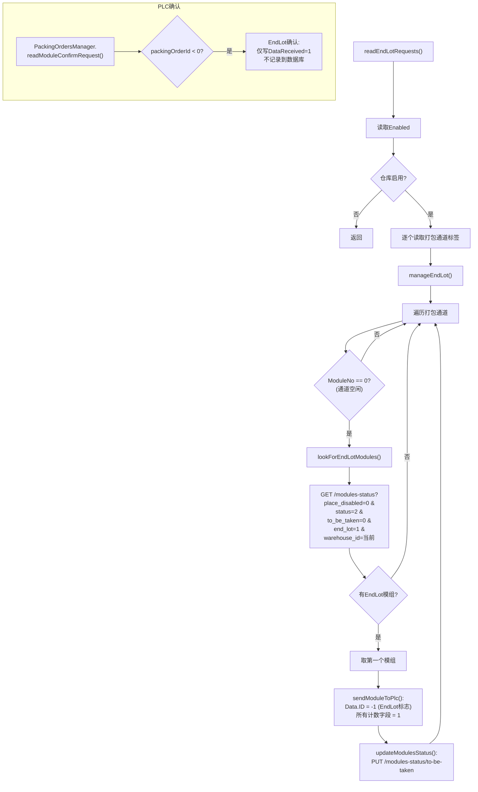

---

## 12. 数据流转总图

### 12.1 完整数据流架构

```mermaid
flowchart TB
    subgraph PLC["西门子 S7 PLC"]
        subgraph DB_Modules["模组数据 DB"]
            MD["Module[1..N]:<br/>ModuleID, Lot, DoffingId,<br/>Status[24/96], Grade[24/96],<br/>Weight[24/96], KnittingDone"]
        end

        subgraph DB_Warehouse["仓位数据 DB"]
            WH["Place[col,row,place]:<br/>ModuleNo, ModuleStatus,<br/>PositionStatus"]
        end

        subgraph DB_PlcPc["PC-PLC接口 DB"]
            PP["plcPc:<br/>Enabled[], ModuleNo,<br/>Status, KnittingOrderId,<br/>PackingOrderId, DTYOrderId,<br/>DataReceived"]
        end

        subgraph DB_Orders["订单指令 DB"]
            KO["knitting[1..N]:<br/>ModuleNo, Data.ID,<br/>ModuleSequenceNo,<br/>TotalModules"]
            PO["packing[1..N]:<br/>ModuleNo, Data.ID,<br/>BobbinsToPallet,<br/>TotalBobbins, Grade, etc."]
            DO["dty[1..N]:<br/>ModuleNo, Data.ID,<br/>ModuleSequenceNo,<br/>TotalModules"]
        end

        subgraph DB_Cycles["堆垛机状态 DB"]
            SC["stacker[1..N]:<br/>ActualStatus,<br/>Alarms[20 WORD],<br/>Cycle[1..15].ID/LastTime"]
        end
    end

    subgraph O17007["O17007 程序"]
        WM["WarehouseManager/<br/>DTYWarehouseManager"]
        SM["StatusManager"]
        KM["KnittingOrdersManager"]
        PM["PackingOrdersManager/<br/>DTYPackingOrdersManager"]
        DM["DTYOrdersManager"]
        EM["EndLotManager"]
    end

    subgraph REST["O17003 REST API"]
        WA["仓库API:<br/>/warehouses/*"]
        OA["订单API:<br/>/orders, /knitting-orders,<br/>/dty-orders, /dty-warehouse-orders"]
        SA["状态API:<br/>/status/warehouses,<br/>/cycles/warehouses-cycles"]
        MA["模组API:<br/>/work-bobbins/*,<br/>/modules-status"]
    end

    subgraph Database["MySQL 数据库"]
        DB[(仓位表, 模组表,<br/>订单表, 锭子表,<br/>批次表, 状态表)]
    end

    %% 读取流
    WH -->|"读取仓位"| WM
    MD -->|"读取模组详情"| WM
    SC -->|"读取状态"| SM
    PP -->|"读取Enabled"| KM
    PP -->|"读取Enabled"| PM
    PP -->|"读取Enabled"| DM
    PP -->|"读取确认"| KM
    PP -->|"读取确认"| PM
    PP -->|"读取确认"| DM
    KO -->|"读取ModuleNo"| KM
    PO -->|"读取ModuleNo"| PM
    DO -->|"读取ModuleNo"| DM

    %% 写入流
    WM -->|"写ModuleID"| MD
    KM -->|"写订单指令"| KO
    PM -->|"写订单指令"| PO
    DM -->|"写订单指令"| DO
    EM -->|"写EndLot指令"| PO
    KM -->|"写DataReceived"| PP
    PM -->|"写DataReceived"| PP
    DM -->|"写DataReceived"| PP

    %% HTTP流
    WM -->|"POST/PUT"| WA
    WM -->|"POST"| MA
    SM -->|"POST"| SA
    KM -->|"GET/POST/PUT"| OA
    PM -->|"GET/POST/PUT"| OA
    DM -->|"GET/POST/PUT"| OA
    EM -->|"GET/PUT"| MA

    WA --> DB
    OA --> DB
    SA --> DB
    MA --> DB

    style PLC fill:#e8f4e8
    style O17007 fill:#e8e8f4
    style REST fill:#f4e8e8
    style Database fill:#f4f4e8
```

### 12.2 读写方向汇总

```
┌─────────────────────────────────────────────────────────────┐
│                     数据流转方向                             │
├─────────────────────────────────────────────────────────────┤
│                                                             │
│  PLC → O17007 (读取):                                       │
│    • 仓位状态 (ModuleNo, ModuleStatus, PositionStatus)      │
│    • 模组数据 (ModuleID, Lot, Grade, Weight, Defect...)     │
│    • 启用标志 (Enabled[])                                   │
│    • 订单通道状态 (knitting/packing/dty ModuleNo)           │
│    • 确认数据 (ModuleNo, OrderId, Status)                   │
│    • 堆垛机状态 (ActualStatus, Alarms, Cycles)              │
│                                                             │
│  O17007 → PLC (写入):                                       │
│    • 新模组ID (ModuleID = containerId)                      │
│    • 订单指令 (ModuleNo, Data.ID, SequenceNo, TotalModules) │
│    • 打包详情 (BobbinsToPallet, Grade, PalletH/Type/Label)  │
│    • 确认回执 (DataReceived = 1)                            │
│                                                             │
│  O17007 → O17003 (HTTP):                                    │
│    • 仓位更新 (update-warehouse-module / reset-warehouse-module)│
│    • 模组创建 (loadingBobbins / load-dty-bobbins)           │
│    • 锭子数据更新 (update-after-scales)                     │
│    • 订单同步 (sync)                                        │
│    • 模组确认 (confirm)                                     │
│    • 订单操作 (add-module / close)                          │
│    • 状态上报 (status, alarms, cycles)                      │
│    • 读取状态 (set-warehouse-read-status)                   │
│                                                             │
│  O17003 → O17007 (HTTP响应):                                │
│    • 仓库/单轨线配置                                        │
│    • 活跃订单列表                                           │
│    • 可用模组查询结果                                       │
│    • 可用物料（锭子品级统计）                               │
│    • 新建模组ID / 订单ID                                    │
│    • 仓库读取状态                                           │
│                                                             │
└─────────────────────────────────────────────────────────────┘
```

---

## 13. DTY实例 vs WAREHOUSE实例差异分析

### 13.1 源码差异

**所有6个实例使用完全相同的源码**（通过 `diff` 验证）。行为差异完全由 `config.js` 和后端返回的 `warehouse.type` 字段控制。

### 13.2 运行时分支逻辑

源码中通过 `warehouse.type === 'dty'` 进行的分支：

| 位置 | 分支效果 |
|------|---------|
| `O17007.initVariables()` 第149行 | 选择 `DTYModuleData`(1124字节/96锭子) vs `moduleData`(340字节/24锭子) |
| `O17007.initVariables()` 第221行 | 选择 `DTYWarehouse`(48字节) vs `warehouse`(90字节) |
| `O17007.initVariables()` 第252行 | 选择 `DTYPlcPc`(含KnittingDisabled) vs `plcPc`(含DTYOrderId) |
| `Warehouse.init()` 第41行 | 使用 `DTYWarehouseManager` vs `WarehouseManager` |
| `Warehouse.init()` 第57行 | 使用 `DTYPackingOrdersManager` vs `PackingOrdersManager` |
| `KnittingOrdersManager` 第81行 | 读取 `KnittingDisabled[n]` 标志（仅DTY） |
| `KnittingOrdersManager` 第219行 | 跳过 `DTYOrderId` 读取（DTY无此字段） |
| `PackingOrdersManager` 第453行 | 跳过 `DTYOrderId` 读取（DTY无此字段） |

### 13.3 PLC变量结构差异

```
┌─────────────────────────────────────────────────────────────────┐
│                    PLC变量结构对比                                │
├──────────────────────────────┬──────────────────────────────────┤
│  FDY (WAREHOUSE实例)          │  DTY (DTY实例)                   │
├──────────────────────────────┼──────────────────────────────────┤
│  plcPc (size=18):            │  DTYPlcPc (size=14):             │
│    Enabled[4] (4个仓库)      │    Enabled[2] (2个DTY仓库)       │
│    ModuleNo                  │    KnittingDisabled[1] ★         │
│    Status                    │    KnittingDisabled[2] ★         │
│    KnittingOrderId           │    KnittingDisabled[3] ★         │
│    PackingOrderId            │    ModuleNo                      │
│    DTYOrderId ★              │    Status                        │
│                              │    KnittingOrderId               │
│                              │    PackingOrderId                │
│                              │    (无DTYOrderId)                │
├──────────────────────────────┼──────────────────────────────────┤
│  moduleData (size=340):      │  DTYModuleData (size=1124):      │
│    24个锭子数据              │    96个锭子数据                   │
│    含ModuleType字段          │    无ModuleType字段               │
│    DoffingId[2]              │    无DoffingId                    │
│    Lot: CHAR[12]             │    Lot: CHAR[21]                 │
│    含Knitting/Packing/DTY    │    无订单关联字段                 │
│    订单关联字段               │                                  │
│    含Location/Warehouse定位   │                                  │
│    含Priority                │                                  │
├──────────────────────────────┼──────────────────────────────────┤
│  warehouse (size=90):        │  DTYWarehouse (size=48):         │
│    ModuleNo, ModuleStatus,   │    ModuleNo, ModuleStatus,       │
│    PositionStatus            │    PositionStatus                │
│    + 3×knittingOrder变量     │    (仅3个基础字段)               │
│    + 1×packingOrder变量      │                                  │
├──────────────────────────────┼──────────────────────────────────┤
│  模组号范围: 1~N             │  模组号范围: 2001+                │
│  索引偏移: number - 1        │  索引偏移: number - 2001         │
└──────────────────────────────┴──────────────────────────────────┘
```

### 13.4 API端点差异

```
┌──────────────────────────────────────────────────────────────┐
│                     API端点对比                               │
├───────────────────────────┬──────────────────────────────────┤
│  FDY/WAREHOUSE实例         │  DTY实例                         │
├───────────────────────────┼──────────────────────────────────┤
│  /orders/*                │  /dty-orders/*                   │
│  /orders/confirm          │  (confirm被注释)                 │
│  /orders/available/{id}   │  /dty-orders/available/{id}      │
│  /orders/get-module-for-  │  /dty-orders/get-module-for-     │
│   order                   │   order                          │
│  /work-bobbins/loading-   │  /work-bobbins/load-dty-         │
│   Bobbins                 │   bobbins                        │
│  /orders/sync             │  /dty-orders/sync                │
│                           │  /lots?filters (DTY独有)         │
│  每托盘: palletLevel × 9  │  每托盘: palletLevel × 30        │
│  无boxesNumber            │  boxesNumber = bobbins / 6       │
│  palletSize字段           │  无palletSize字段                │
├───────────────────────────┼──────────────────────────────────┤
│  REST API端口: 8092       │  REST API端口: 9092              │
└───────────────────────────┴──────────────────────────────────┘
```

---

## 14. 多实例部署模式分析

### 14.1 配置文件对比

| 配置项 | DTY_1 | DTY_2 | WH_1 | WH_2 | WH_3 | WH_4 |
|--------|-------|-------|------|------|------|------|
| `warehouseIds` | [1] | [2] | [1] | [2] | [3] | [4] |
| `monorailIds` | [1] | [1] | [1] | [1] | [1] | [1] |
| `packingNumbers` | [1] | [1] | [1,2] | [1,2] | [1,2] | [1,2] |
| `createOrders` | true | false | true | false | false | false |
| `warehousesToCheck` | [] | [1] | [] | [1] | [1,2] | [1,2,3] |
| `restApiServerUrl` | localhost:9092 | localhost:9092 | localhost:8092 | localhost:8092 | localhost:8092 | localhost:8092 |

### 14.2 部署模式解析

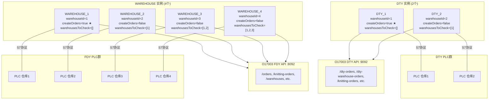

### 14.3 多实例协调机制

#### 14.3.1 createOrders 控制

- **只有1号实例可以创建新订单** (`createOrders: true`)
- 2/3/4号实例只能处理已创建的订单

#### 14.3.2 warehousesToCheck 依赖链

控制仓位读取阶段的**等待逻辑**：

```
WAREHOUSE_1: warehousesToCheck = []       → 不等待任何人
WAREHOUSE_2: warehousesToCheck = [1]      → 等待仓库1完成读取
WAREHOUSE_3: warehousesToCheck = [1,2]    → 等待仓库1和2完成读取
WAREHOUSE_4: warehousesToCheck = [1,2,3]  → 等待仓库1、2、3完成读取
```

这形成了一个**瀑布式的顺序协调**：

```
时间 → ────────────────────────────────────────────────────
WH_1: [读仓位] → [处理订单] → [setReadStatus(2)]
WH_2:            等待WH_1... → [读仓位] → [处理订单]
WH_3:            等待WH_1,2...           → [读仓位] → [处理订单]
WH_4:            等待WH_1,2,3...                      → [读仓位] → [处理订单]
```

#### 14.3.3 Enabled标志位的多仓库含义

`plcPc.Enabled` 是一个位数组，索引对应仓库ID（`warehouseId - 1`）。PLC可以通过这个标志控制哪些仓库可以参与物料调度。

FDY: `Enabled[4]` → 可控制4个FDY仓库
DTY: `Enabled[2]` → 可控制2个DTY仓库

### 14.4 packingNumbers 差异

- DTY实例: `packingNumbers: [1]` → 1台DTY打包机
- WAREHOUSE实例: `packingNumbers: [1, 2]` → 2台FDY打包机

### 14.5 REST API双端口架构

```
O17003 后端双端口部署:
├── :8092 → FDY专用 (WAREHOUSE实例连接)
│           /orders, /warehouses, /knitting-orders, etc.
└── :9092 → DTY专用 (DTY实例连接)
            /dty-orders, /dty-warehouse-orders, etc.
```

---

## 15. 发现的问题和设计模式

### 15.1 设计模式

| 模式 | 应用位置 | 说明 |
|------|---------|------|
| **桥接模式** | 整体架构 | O17007作为PLC和后端之间的桥梁 |
| **工厂方法** | `Warehouse.init()` | 根据type创建不同的Manager实例 |
| **变化检测** | 所有Manager的oldValues | 仅在值变化时执行操作 |
| **标签抽象** | `variables.js` + `makeAddress()` | 将PLC地址映射为命名标签 |
| **通信锁** | `comInProgress` 标志 | 防止并发PLC通信 |
| **故障转移** | `http.js` nextAxios | URL轮转重试 |
| **序列化协调** | `warehousesToCheck` | 多实例按顺序执行 |
| **状态机** | `readStatus` 0→1→2→0 | 协调读取和处理阶段 |

### 15.2 发现的问题

#### P1: HTTP重试无限循环（严重）

**文件**: `http.js:45-72`

```javascript
async function nextAxios(error, index) {
    // index被传入但从未用于限制重试
    // 被注释掉的代码: if (index == urls.length) throw error;
    // 结果: 如果所有URL都不可达，会无限重试
}
```

**影响**: 如果O17003后端完全宕机，O17007将陷入无限HTTP重试循环，不会抛出错误也不会停止。

#### P2: 递归调用无await可能导致未捕获异常（中等）

**文件**: `O17007.js:627`

```javascript
this.manageWarehouseCommunications(); // 没有 await
```

如果这个递归调用中抛出异常，不会被捕获，会触发 `uncaughtException` 导致进程退出。

#### P3: 变量共享引用问题（中等）

**文件**: `variables.js:404-437`

```javascript
for (let i = 0; i < 3; i++) {
    const vars = [{ name: 'ID', byteOffset: 2 }, ...];
    vars.forEach(v => {
        const t = v;
        t.byteOffset = v.byteOffset + i * size;  // 修改了原始对象!
        variables.warehouse.variables.push(t);
    });
}
```

`const t = v` 不是深拷贝，`t` 和 `v` 指向同一个对象。这意味着在第二次循环时，`v.byteOffset` 已经是上一次修改后的值。最终偏移量会是累加的而非预期的固定偏移。

**计算结果**:
- i=0: byteOffset = 2 + 0 = 2
- i=1: byteOffset = 2(已变为2) + 10 = 12 (预期应为12)
- i=2: byteOffset = 12(已变为12) + 20 = 32 (预期应为22)

第三次循环的偏移量错误（32 vs 预期22）。但因为只有3个knittingOrder槽位且实际使用中可能只用到前几个，这个bug可能没有被发现。

#### P4: moduleData中的偏移量重叠（中等）

**文件**: `variables.js:667-700`

```javascript
// Knitting.OrderId 偏移 294
{name: 'Knitting.ModuleSequenceNo', byteOffset: '302'},  // 294+8=302
{name: 'Knitting.TotalModules', byteOffset: '304'},       // OK

// Packing.OrderId 也是偏移 302 ← 与 Knitting.ModuleSequenceNo 重叠!
{name: 'Packing.OrderId', byteOffset: '302'},
```

`Knitting.ModuleSequenceNo` (INT, 2字节, 偏移302) 和 `Packing.OrderId` (DINT, 4字节, 偏移302) 占用相同的内存地址。这可能是有意设计（共用内存区域用于不同阶段），也可能是偏移计算错误。

#### P5: 创建窗口函数为空但引用createWindow（低）

**文件**: `O17007.js:84, 657-659`

```javascript
app.on('activate', _ => {
    if (this.mainWindow === null) createWindow();  // 引用不存在的函数
});

createWindow() { return; }  // 方法名正确但是空函数
```

`app.on('activate')` 回调中调用 `createWindow()`（全局函数），而非 `this.createWindow()`（方法）。不过由于 `createWindow` 是空函数且 activate 事件在托盘应用中几乎不触发，影响不大。

#### P6: URLSearchParams的使用不一致（低）

部分API调用使用 `URLSearchParams` 序列化参数（旧风格），部分使用JSON对象。这是代码演进的痕迹，不影响功能但降低可维护性。

#### P7: 硬编码操作员号（低）

**文件**: `PackingOrdersManager.js:346, DTYPackingOrdersManager.js:339`

```javascript
operatorNumber: '30003508',  // 硬编码的操作员号
```

所有自动创建的订单使用同一个硬编码的操作员号。

#### P8: Date.prototype 污染（低）

**文件**: `logger.js:93`

```javascript
Date.prototype.toLocalTimestamp = function () { ... };
```

修改了全局 `Date` 原型，可能与其他库冲突。

### 15.3 系统架构总结

```
┌────────────────────────────────────────────────────────────────┐
│                O17007 系统架构总结                               │
├────────────────────────────────────────────────────────────────┤
│                                                                │
│  角色: PLC ↔ 后端 桥接中间件                                    │
│  运行: Electron桌面应用（系统托盘,无窗口）                       │
│  部署: 6个实例 (2 DTY + 4 FDY)，共享同一代码库                  │
│                                                                │
│  核心循环: manageWarehouseCommunications()                      │
│    Phase 1: 仓位同步（PLC→后端）                                │
│    Phase 2: 订单调度（后端→PLC）                                │
│    Phase 3: 确认回写（PLC→后端→PLC）                            │
│                                                                │
│  协调机制:                                                      │
│    • readStatus状态机 (0→1→2→0) 实现多实例串行                   │
│    • warehousesToCheck 实现依赖等待                              │
│    • createOrders 控制订单创建权限                               │
│    • Enabled[] PLC标志位控制仓库参与度                           │
│                                                                │
│  数据量:                                                        │
│    FDY: 模组340字节×N + 仓位90字节×(cols×rows×places)            │
│    DTY: 模组1124字节×N + 仓位48字节×(cols×rows×places)           │
│                                                                │
└────────────────────────────────────────────────────────────────┘
```

---

## 附录: variables.js PLC数据块映射表

### A.1 plcPc (FDY, DB560, size=18)

| 字段 | 类型 | 偏移 | 说明 |
|------|------|------|------|
| Enabled | BIT×4 | 0.0 | 4个仓库启用标志 |
| ModuleNo | INT | 2 | 确认模组号 |
| Status | BYTE | 4 | 确认状态 |
| KnittingOrderId | DINT | 6 | 针织订单ID |
| PackingOrderId | DINT | 10 | 打包订单ID |
| DTYOrderId | DINT | 14 | DTY订单ID |

### A.2 DTYPlcPc (DTY, size=14)

| 字段 | 类型 | 偏移 | 说明 |
|------|------|------|------|
| Enabled | BIT×2 | 0.0 | 2个DTY仓库启用标志 |
| KnittingDisabled[1] | BIT | 2.0 | 针织机1禁用 |
| KnittingDisabled[2] | BIT | 4.0 | 针织机2禁用 |
| KnittingDisabled[3] | BIT | 6.0 | 针织机3禁用 |
| ModuleNo | INT | 8 | 确认模组号 |
| Status | BYTE | 10 | 确认状态 |
| KnittingOrderId | DINT | 12 | 针织订单ID |
| PackingOrderId | DINT | 16 | 打包订单ID |

### A.3 moduleData (FDY, size=340)

| 字段 | 类型 | 偏移 | 长度 | 说明 |
|------|------|------|------|------|
| ModuleNo | INT | 0 | 1 | 模组号 |
| ModuleType | BYTE | 2 | 1 | 模组类型 |
| ModuleID | DINT | 4 | 1 | 数据库ID |
| Lot | CHAR | 8 | 12 | 批次编码 |
| DoffingId | DINT | 20 | 2 | 落纱ID×2 |
| LineNo | BYTE | 28 | 1 | 线号 |
| KnittingDone | BIT | 29.0 | 1 | 针织完成标志 |
| Status | BYTE | 30 | 24 | 锭子状态 |
| Grade | BYTE | 54 | 24 | 品级 |
| SortingGrade | BYTE | 78 | 24 | 分拣品级 |
| VisionGrade | BYTE | 102 | 24 | 视觉品级 |
| KnittingGrade | BYTE | 126 | 24 | 针织品级 |
| SortingDefect | BYTE | 150 | 24 | 分拣缺陷 |
| VisionDefect | BYTE | 174 | 24 | 视觉缺陷 |
| SortingWeight | INT | 198 | 24 | 分拣重量 |
| KnittingWeight | INT | 246 | 24 | 针织重量 |
| Knitting.OrderId | DINT | 294 | 1 | 针织订单ID |
| Knitting.ModuleSequenceNo | INT | 302 | 1 | 模组序号 |
| Knitting.TotalModules | INT | 304 | 1 | 总模组数 |
| Packing.OrderId | DINT | 302 | 1 | 打包订单ID ★重叠 |
| Packing.* | ... | 306-318 | | 打包订单详情 |
| DTY.OrderId | DINT | 320 | 1 | DTY订单ID |
| DTY.* | ... | 324-326 | | DTY订单详情 |
| Location | INT | 328 | 1 | 位置 |
| WarehouseColumn | INT | 330 | 1 | 仓库列号 |
| WarehouseRow | INT | 332 | 1 | 仓库行号 |
| WarehousePlace | INT | 334 | 1 | 仓库位号 |
| Priority | DINT | 338 | 1 | 优先级 |

### A.4 DTYModuleData (DTY, size=1124)

与FDY版本结构类似，但：
- 锭子数量: 96个（FDY为24个）
- Lot字段: CHAR[21]（FDY为CHAR[12]）
- 无ModuleType、DoffingId、订单关联、Location等字段
- 仅包含基础的锭子质量数据

### A.5 cyclesData (堆垛机)

| 字段 | 类型 | 偏移 | 说明 |
|------|------|------|------|
| ActualStatus | DINT | 0 | 当前状态 |
| Cycle[1-15].ID | DINT | 6+i×14 | 周期放货ID |
| Cycle[1-15].LastTime | DINT | 16+i×14 | 周期时间 |
| Alarms | WORD×20 | 216 | 320位报警 |
