# 05 - 设备级自动化子系统深度源码分析

> 基于纯源码逐行解读，覆盖 O19018、O19033、O17006 三个子系统及其 DTY 变体。

---

## 目录

1. [总体架构概览](#1-总体架构概览)
2. [O19018 - 设备通信程序](#2-o19018---设备通信程序)
3. [O19033 - 小车/码垛管理程序](#3-o19033---小车码垛管理程序)
4. [O17006 - 分拣/视觉检测程序](#4-o17006---分拣视觉检测程序)
5. [DTY 变体差异分析](#5-dty-变体差异分析)
6. [系统间协作与数据流总图](#6-系统间协作与数据流总图)
7. [问题发现与设计模式总结](#7-问题发现与设计模式总结)

---

## 1. 总体架构概览

三个子系统均为 **Electron 托盘应用**（无窗口模式），通过系统托盘图标提供 Start/Stop/Restart/Exit 控制。它们协同构成设备层自动化的完整链路：

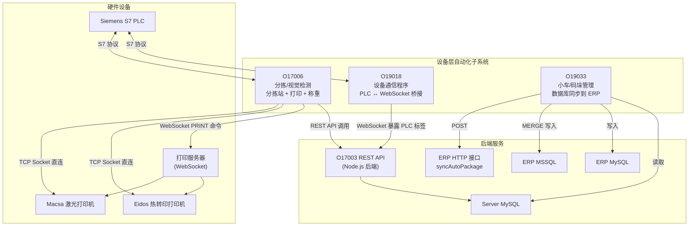

### 技术栈对比

| 维度 | O19018 (v1.0.16) | O19033 (v2.0.9) | O17006 (v2.1.5) |
|------|---------|---------|---------|
| PLC 通信 | `net.hivetechnology.communication` v3.x | 无 | `net.hivetechnology.communication` v3.x |
| S7 协议 | `net.hivetechnology.step7` v1.x | 无 | `net.hivetechnology.step7` v1.x |
| 数据库 | 无 | `net.hivetechnology.db` v2.x + `mssql` | 无 |
| WebSocket | 无（由 Communication 库处理） | `ws` v6.2（服务端） | `net.hivetechnology.ws` v2.x（客户端） |
| HTTP | axios | axios | axios |
| 日志 | winston（3文件轮转） | winston（3文件轮转） | winston（3文件轮转） |
| 单实例锁 | 无 | 无（注释掉） | 有 |

---

## 2. O19018 - 设备通信程序

### 2.1 程序定位与职责

O19018 是 **PLC 数据桥接服务**，核心功能：
- 从 REST API 获取码垛机(palletizer)、仓库(warehouse)、单轨车(monorail)的配置信息
- 根据配置构建 PLC 连接参数和标签(tag)映射表
- 通过 `net.hivetechnology.communication` 库建立与多台 Siemens S7 PLC 的连接
- 将 PLC 数据变量通过 WebSocket 暴露给上层应用（如 O17003）

### 2.2 启动初始化流程

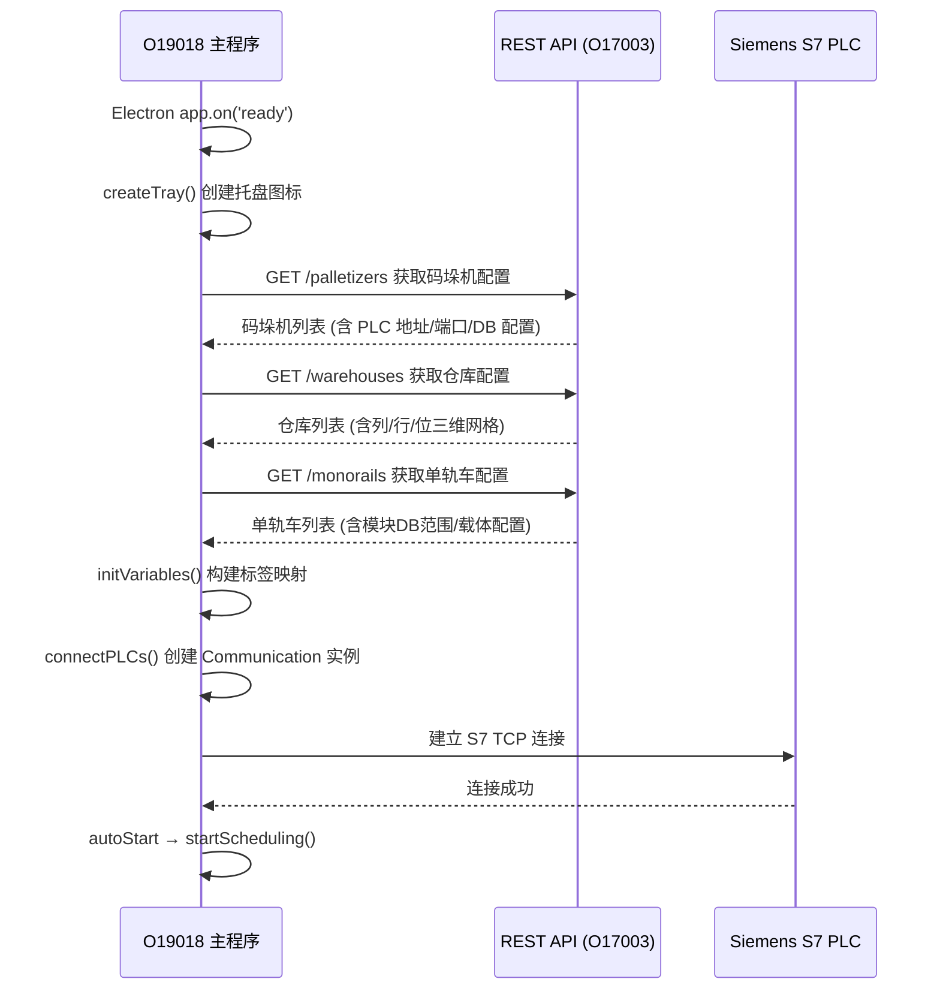

### 2.3 核心类: O19018.js

**文件**: `src/O19018.js`

#### 构造函数与生命周期

```
constructor()
├── 注册 uncaughtException 处理 → process.exit(1)
├── app.on('ready') → init() → start()
├── app.on('window-all-closed') → close()
└── app.on('quit') → 销毁托盘 + 断开 PLC
```

#### API 配置获取（重试机制）

三个 `get*()` 方法使用相同的重试模式：

```javascript
// 通用重试模式（以 getPalletizers 为例）
getPalletizers() {
    return new Promise((resolve, reject) => {
        const timeout = async () => {
            try {
                const response = await axios.get('/palletizers');
                resolve(response.data.data);
            } catch (error) {
                logger.error(error);
                setTimeout(timeout, 5000); // 5秒后重试，永不放弃
            }
        };
        setTimeout(timeout, 0);
    });
}
```

**设计特点**：无限重试直到成功，无最大重试次数限制。这确保了在后端服务暂时不可用时程序不会崩溃。

#### 标签映射构建: initVariables()

`initVariables()` 是核心方法，将 REST API 返回的设备配置转换为 PLC 标签地址列表。

**地址构造函数 `makeAddress()`**：

```javascript
const makeAddress = o => {
    let rst = '';
    if (o.dataBlock) rst += `${o.dataBlock},`;    // 如 "DB100,"
    if (o.memoryArea) rst += `${o.memoryArea}`;    // 如 "M" (标记区)
    if (o.dataType) rst += `${o.dataType}`;        // 如 "INT", "DINT", "BYTE"
    if (o.byteOffset) rst += `${o.byteOffset}`;   // 如 "0"
    if (o.bitOffset) rst += `.${o.bitOffset}`;     // 如 ".0"
    if (o.arrayLength) rst += `.${o.arrayLength}`; // 如 ".24" (24元素数组)
    return rst;
    // 最终示例: "DB100,INT0" 或 "DB200,BYTE30.24"
};
```

**仓库标签构建**（三维网格映射）：

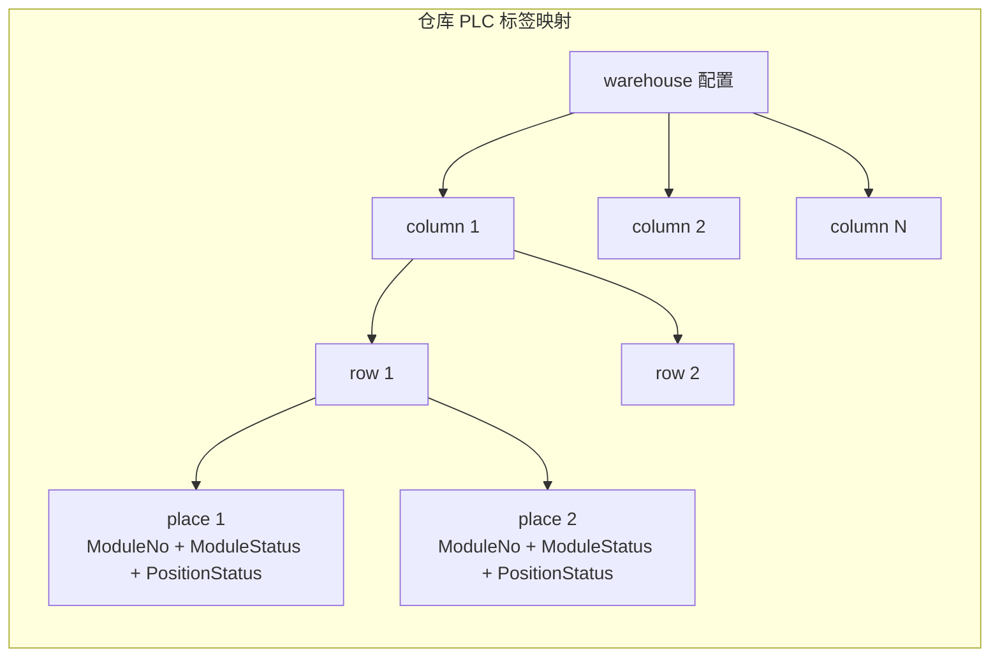

每个仓库位的标签命名格式：`palletizer{id}.Warehouse[{col},{row},{place}].{变量名}`

**码垛机标签构建**（5种 DB 类型）：

| DB 类型 | 变量定义 | 用途 |
|---------|---------|------|
| `ProductDataForPalOrder` | moduleData (340字节) | 模块数据，含24位丝锭质量/状态/重量数组 |
| `Pc` | Pc 变量集 | 订单管理器、机器人状态 |
| `monorailOrder` | moduleData | 单轨车订单模块数据 |
| `DTYPalletInterface` | dtyPalletInterface | DTY 码垛接口（含 RFID） |
| `ManualBox` | manualBox | 手动装箱接口 |

**单轨车标签构建**（模块+载体）：

```javascript
// 模块标签
for (let i = 0; i <= moduleDbData.end - moduleDbData.start; i++) {
    for (let j = 0; j < moduleDbData.count; j++) {
        const index = i * moduleDbData.count + j;
        // 标签前缀: monorail{id}.Module[{index+1}].
        // 字节偏移: variable.byteOffset + j * moduleData.size(340)
    }
}

// 载体标签
for (let i = 0; i < carriersDbData.count; i++) {
    // 标签前缀: monorail{id}.Carrier[{i+1}].
    // 字节偏移: variable.byteOffset + i * carriers.size(82)
}
```

### 2.4 PLC 变量定义: variables.js

#### moduleData（标准模块数据块，340字节）

```
偏移    类型        名称               说明
──────────────────────────────────────────────
0       INT         ModuleNo           模块编号
2       BYTE        ModuleType         模块类型
4       DINT        ModuleID           模块数据库ID
8       CHAR[12]    Lot                批次号
20      DINT[2]     DoffingId          落纱ID (2个)
28      BYTE        LineNo             生产线号
29      X(bit)      KnittingDone       织造完成标志
30      BYTE[24]    Status             24位丝锭状态
54      BYTE[24]    Grade              24位丝锭等级
78      BYTE[24]    SortingGrade       24位分拣等级
102     BYTE[24]    VisionGrade        24位视觉等级
126     BYTE[24]    KnittingGrade      24位织造等级
150     BYTE[24]    SortingDefect      24位分拣缺陷
174     BYTE[24]    VisionDefect       24位视觉缺陷
198     INT[24]     SortingWeight      24位分拣重量
246     INT[24]     KnittingWeight     24位织造重量
294     DINT        Knitting.OrderId   织造订单ID
302     INT         Knitting.ModuleSeq 织造模块序号
304     INT         Knitting.TotalMod  织造总模块数
302     DINT        Packing.OrderId    打包订单ID
306-318             Packing.*          打包订单详情
320     DINT        DTY.OrderId        DTY订单ID
324-326             DTY.*              DTY订单详情
328-338             Location/Warehouse 仓库位置信息
```

> **注意**：`Packing.OrderId` 偏移302与 `Knitting.ModuleSequenceNo` 偏移302重叠，这可能是设计上的共用体(union)或源码中的偏移错误。

#### DTYModuleData（DTY模块数据块，1124字节）

与标准版本结构相同，关键差异：
- 数组长度从 24 扩展到 **96**（DTY 每模块96个丝锭位）
- `Lot` 字段长度从 12 扩展到 **21** 字符
- 总块大小从 340 字节扩展到 **1124** 字节

#### warehouse（标准仓库位数据，90字节）

```
偏移    类型    名称            说明
────────────────────────────────────
0       DINT    ModuleNo        仓库位中的模块编号
10      BYTE    ModuleStatus    模块状态 (0=空, 1=已装载)
11      BYTE    PositionStatus  位置状态 (1=正常, 2=禁用, 3=故障)
```

#### Pc（PC 控制接口变量）

```
OrderManager 组:
  DataReady, OrderID, BobbinsNo, PalletH, PalletType, LabelType,
  OrderGrade, TotalModules, ModuleSequenceNo, TotalBobbins, OrderType

RobotLoadDisk 组:
  LoadDisk, DiskState, DiskOk, RobotEnabled

RobotLoadPallet 组:
  LoadPallet, PalletState, PalletOk, RobotEnabled
```

#### carriers（载体/小车数据，82字节）

```
偏移    类型        名称              说明
───────────────────────────────────────────
0       INT         ActualPosition    当前位置
2       INT         ActualSpeed       当前速度
4       INT         SectionNo         区段编号
6       INT         ModuleNo          携带的模块编号
8       DINT        Destination1ID    目的地1 ID
...（共5组 Destination）
50      BYTE[24]    Destination1Grade 目的地1的24位等级
...
```

### 2.5 HTTP 客户端: http.js

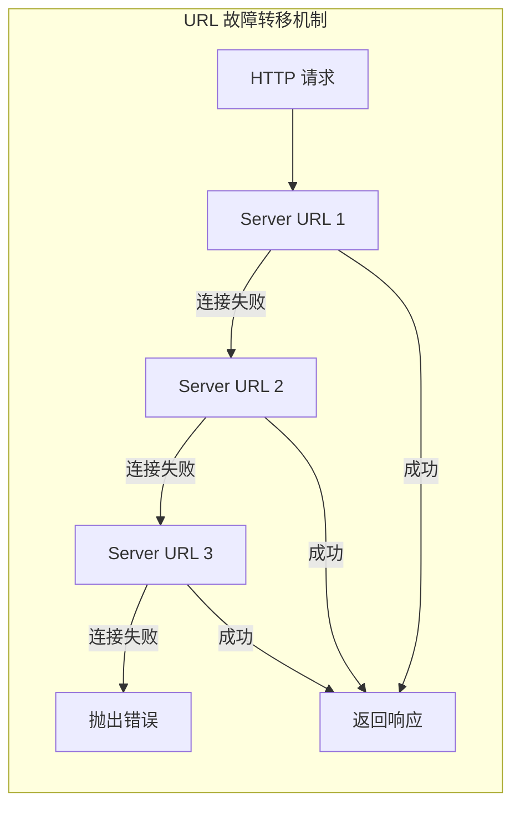

关键配置：
- **超时**: 60秒
- **Keep-Alive**: HTTP/HTTPS 长连接
- **最大内容**: 50MB
- **代理**: 强制删除 `http_proxy`/`HTTP_PROXY` 等环境变量
- **故障转移**: 在 `config.restApiServerUrl[]` 数组中循环尝试

`nextAxios()` 递归函数在无响应（连接级错误）时依次尝试下一个 URL，有响应（HTTP 错误码）时直接抛出。

### 2.6 日志系统: logger.js

三个文件传输通道：

| 文件 | 级别 | 大小限制 | 轮转数 |
|------|------|---------|-------|
| error.log | error | 2MB | 3 |
| combine.log | all | 2MB | 3 |
| actions.log | action | 2MB | 3 |

特殊实现：
- **Electron 4.x 兼容**：自实现 `mkdirp` 递归目录创建（因 Node.js 版本不支持 `recursive: true`）
- **调用者追踪**：每条日志自动解析堆栈获取 `文件:行号` 信息
- **时间戳扩展**：`Date.prototype.toLocalTimestamp` 输出 MySQL 格式本地时间

### 2.7 O19018 数据流总图

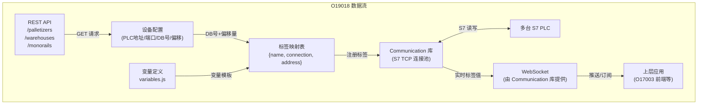

---

## 3. O19033 - 小车/码垛管理程序

### 3.1 程序定位与职责

O19033 是 **ERP 数据同步桥接服务**，核心功能：
- 从 Server MySQL 数据库读取生产数据（码垛、丝锭、落纱、小车、模块）
- 将数据同步到 ERP 系统（MySQL 或 MSSQL 数据库，或 HTTP 接口）
- 通过 WebSocket 广播同步状态
- 接受 WebSocket 命令触发手动发送

### 3.2 启动初始化流程

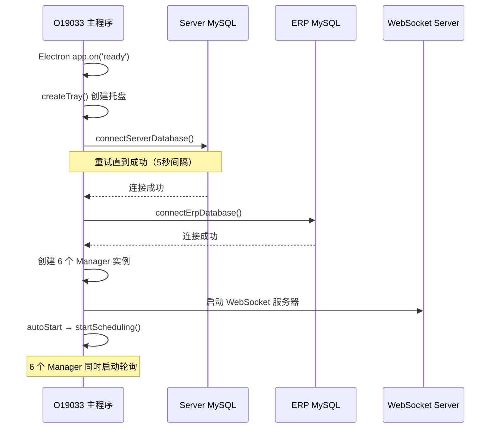

### 3.3 核心类: O19033.js

**6 个 Manager 实例化**：

```javascript
this.palletsManager = new PalletsManager(this.serverDb);
this.dtyPalletsManager = new DTYPalletsManager(this.serverDb);
this.bobbinsManager = new BobbinsManager(this.serverDb);
this.doffingsManager = new DoffingsManager(this.serverDb, this.erpDb);
this.trolleysManager = new TrolleysManager(this.serverDb, this.erpDb);
this.modulesManager = new ModulesManger(this.serverDb, this.erpDb);
```

**WebSocket 命令处理**：

```javascript
switch (msg.command) {
    case 'SEND_ALL_PALLETS':     // 发送所有待处理托盘
        this.palletsManager.sendAllPallets();
        break;
    case 'SEND_SELECTED_PALLETS': // 发送指定ID的托盘
        this.palletsManager.sendSelectedPallets(msg.ids);
        break;
}
```

### 3.4 Manager 通用调度模式

所有 6 个 Manager 共享相同的调度架构：

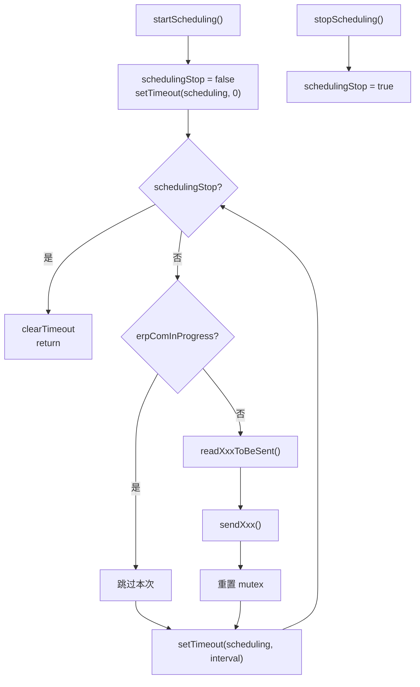

**关键设计**：
- 使用 `setTimeout` 递归实现轮询（非 `setInterval`），确保上次操作完成后才开始计时
- `erpComInProgress` 互斥锁防止并发写入
- 每个 Manager 独立运行，互不干扰

### 3.5 PalletsManager（标准托盘管理器）

**文件**: `src/palletsManager.js` | **轮询间隔**: 5秒

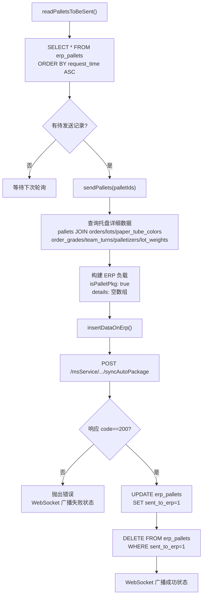

**ERP 数据负载结构**：

```javascript
{
    orderNo: order_code,          // 订单号
    barcode: GET_PALLET_CODE(),   // 托盘条码（MySQL函数生成）
    batchNo: lot_code截断至'-',   // 批次号
    specification: specification_china,  // 中文规格
    grade: order_grade,           // 等级名称
    pipeColor: paper_tube_color_name,    // 纸管颜色
    netWeight: lot_weights.net,   // 净重（来自lot_weights表）
    grossWeight: lot_weights.gross, // 毛重
    amount: bobbins_amount,       // 丝锭数量
    classGroup: "X班",            // 班组
    shift: "白班/夜班",           // 班次（00:00-12:00=白班）
    employeeCode: padStart(8,'0'), // 员工编号（8位补零）
    productTime: pallet_created,  // 生产时间
    lineType: palletizer_line,    // 码垛线
    palletCode: rfid,             // RFID
    isPalletPkg: true,            // 标记为托盘级包装
    details: [],                  // 空详情（托盘无子包装）
}
```

### 3.6 DTYPalletsManager（DTY 托盘管理器）

**文件**: `src/dtyPalletsManager.js` | **轮询间隔**: 5秒

与标准版关键差异：

| 对比项 | PalletsManager | DTYPalletsManager |
|--------|---------------|-------------------|
| 源表 | `erp_pallets` | `erp_dty_pallets` |
| 关联表 | `pallets/orders/lots` | `dty_pallets/dty_orders` |
| 重量来源 | `lot_weights` 表 | 各箱重量累加 |
| 数量来源 | `bobbins_amount` 字段 | 各箱丝锭数累加 |
| `isPalletPkg` | `true` | `false` |
| `details` | 空数组 `[]` | 箱级详情数组 |

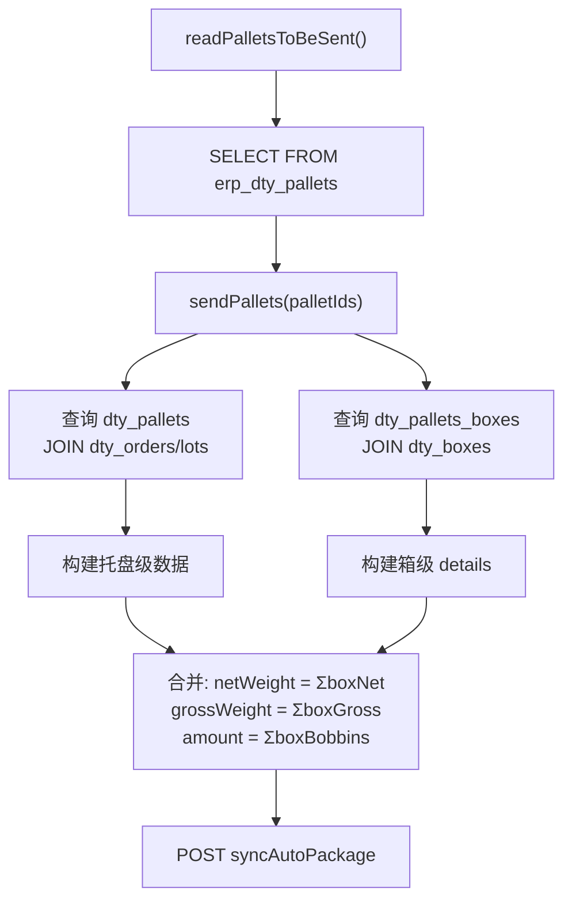

**箱级 details 结构**：

```javascript
details: boxes.filter(k => k.dty_pallet_id == palletId).map(k => ({
    pkgCode: GET_BOX_CODE(box.id),  // 箱码
    netWeight: weight - (boxWeight + lotBoxWeight * bobbinsAmount),  // 净重公式
    grossWeight: weight,             // 毛重
    amount: bobbins_amount,          // 箱内丝锭数
}))
```

### 3.7 BobbinsManager（丝锭管理器）

**文件**: `src/bobbinsManager.js` | **轮询间隔**: 30秒

> ⚠️ **重要发现**：`readBobbinsToBeSent()` 方法首行为 `return;`，整个丝锭同步功能被**完全禁用**。

```javascript
async readBobbinsToBeSent() {
    return; // ← 此行导致后续所有代码不可达
    try {
        // ... MSSQL MERGE 逻辑（永远不会执行）
    }
}
```

> ⚠️ **命名不一致**：文件名为 `bobbinsManager.js`，但导出的类名为 `PalletsManager`。

如果启用，该 Manager 的工作流程为：

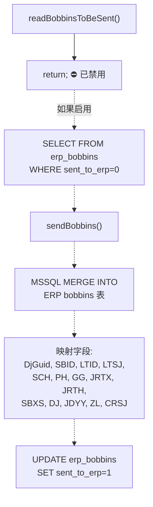

**ERP 字段映射**（中文 ERP 系统）：

| 源字段 | ERP字段 | 含义 |
|--------|---------|------|
| bobbin_id | SBID | 丝锭ID |
| doffing_id | LTID | 落纱ID |
| doffing_creation_date | LTSJ | 落纱时间 |
| module_number | SCH | 模块号 |
| lot_code | PH | 批号 |
| specification | GG | 规格 |
| winder_name | JRTX | 卷绕头型号 |
| spinning_line_name | JRTH | 卷绕头号 |
| position | SBXS | 丝锭序号 |
| grade | DJ | 等级 |
| defect | JDYY | 缺陷原因 |
| weight | ZL | 重量 |

### 3.8 DoffingsManager（落纱管理器）

**文件**: `src/doffingsManager.js` | **轮询间隔**: 30秒

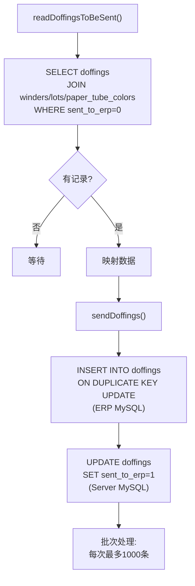

**同步字段**: id, lot_code, order_code, specification, line_name, winder_name, created, paper_tube

### 3.9 ModulesManager（模块管理器）

**文件**: `src/modulesManager.js` | **轮询间隔**: 30秒

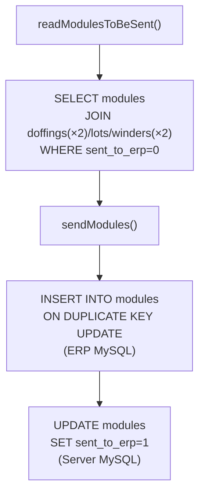

**数据结构**：每个模块关联 2 个 doffing（上下两半侧），因此 JOIN 两次 doffings 和 winders：

```sql
LEFT JOIN doffings AS d1 ON d1.id = m.doffing1_id
LEFT JOIN doffings AS d2 ON d2.id = m.doffing2_id
LEFT JOIN winders AS w1 ON w1.id = d1.winder_id
LEFT JOIN winders AS w2 ON w2.id = d2.winder_id
```

### 3.10 TrolleysManager（小车管理器）

**文件**: `src/trolleysManager.js` | **轮询间隔**: 30秒

与 ModulesManager 结构几乎相同，区别仅在于表名（trolleys vs modules）和字段名（trolley_number vs module_number）。

### 3.11 WebSocket 服务器: ws.js

极简实现：

```javascript
const _wss = new WebSocket.Server({ port: config.websocketPort });
_wss.on('connection', ws => {
    ws.id = _wss.clients.length
        ? Math.max(..._wss.clients.map(o => o.id))
        : 0;
});
```

**广播模式**：各 Manager 在同步成功/失败时，通过 `wss.clients.forEach(client => client.send(...))` 广播状态更新：

```javascript
{
    command: 'UPDATE_STATUS',
    address: '',
    status: true/false,          // 同步成功/失败
    name: 'PALLET_MANAGER_ERP',  // Manager 标识
    lastChecked: '',
    lastAnswered: '',
    category: 'SERVERS'
}
```

### 3.12 O19033 数据流总图

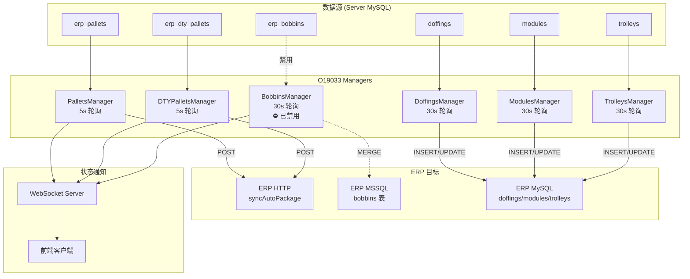

---

## 4. O17006 - 分拣/视觉检测程序

### 4.1 程序定位与职责

O17006 是 **分拣工位自动化控制程序**，核心功能：
- 管理多个分拣站（Sorting Station），每站可包含入口分拣、打印分拣、称重、视觉检测等工位
- 与 PLC 进行双向通信：读取启动信号、写入分拣结果
- 与 REST API 交互：获取丝锭数据、提交分拣/称重结果
- 控制标签打印机（Eidos 热转印 / Macsa 激光）
- 通过 WebSocket 连接打印服务器发送打印命令

### 4.2 启动初始化流程

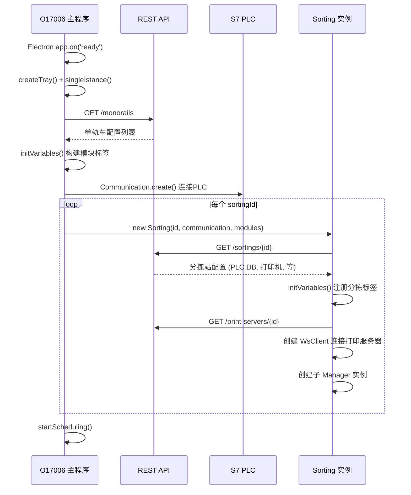

### 4.3 核心类: O17006.js

**变量初始化 `initVariables()`**：

与 O19018 共享相同的模块标签构建逻辑，但仅处理模块数据（无仓库/码垛机/载体）：

```javascript
this.monorails.forEach(monorail => {
    // 构建 PLC 连接配置
    const connection = {
        name: `monorail${monorail.id}`,
        type: monorail.settings.plc.type,
        host: monorail.settings.plc.host,
        // ...
    };

    // 为每个 DB 中的每个模块槽位创建标签映射
    for (let i = 0; i <= end - start; i++) {
        for (let j = 0; j < count; j++) {
            const index = i * count + j;
            // prefix: "monorail{id}.Module[{index+1}]."
            // 每个变量地址 = DB{start+i}, byteOffset + j * 340
        }
    }
});
```

**连接状态检查**：托盘菜单中为每个 REST API URL 创建 radio 按钮，每秒检查当前活跃 URL 并更新选中状态。

### 4.4 分拣站编排器: Sorting.js

每个 Sorting 实例管理一个完整的分拣工位，包含最多 **5 个子 Manager**：

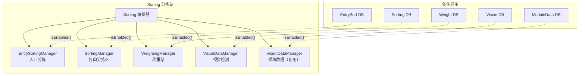

**`isEnabled()` 辅助函数**：

```javascript
const isEnabled = (obj, attr) => {
    if (obj && obj.hasOwnProperty(attr) && obj[attr] != false) {
        return true;
    }
    return false;
};
```

**PLC 标签初始化**（以 EntrySort 为例）：

```javascript
const entrySortDb = this.sorting.settings.plc.dbs.EntrySort.number;   // DB号
const entrySortOffset = this.sorting.settings.plc.dbs.EntrySort.offset; // 字节偏移

variables.entrySort.variables.forEach(variable => {
    const o = {
        ...variable,
        dataBlock: `DB${entrySortDb}`,
        byteOffset: '' + (parseInt(variable.byteOffset) + Number(entrySortOffset)),
    };
    const tag = {
        name: `${connection.name}.entrySort${sortingId}.${variable.name}`,
        connection: connection.name,
        address: makeAddress(o),
    };
});
```

**打印机布局动态加载**：根据 `printersAmount` 配置（4/6/12/16）加载对应的打印机位置映射文件。

### 4.5 EntrySortingManager（入口分拣管理器）

**文件**: `src/EntrySortingManager.js` | **轮询间隔**: 2秒

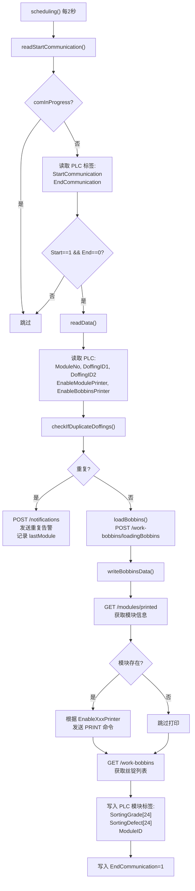

**打印命令发送**（通过 WebSocket）：

```javascript
// 模块标签打印
printModuleLabel(containerId, spinningSideId) {
    this.wsc.send({
        command: 'PRINT',
        type: 'MODULE',
        containerId,
        spinningSideId,
    });
}

// 丝锭标签打印
printBobbinsLabel(containerId, spinningSideId) {
    this.wsc.send({
        command: 'PRINT',
        type: 'MODULE_BOBBINS',
        containerId,
        spinningSideId,
        printerNumber: this.sortingId,
    });
}
```

**重复落纱检测**：

```javascript
async checkIfDuplicateDoffings(doffing1, doffing2) {
    // 检查 doffing1_id 和 doffing2_id 是否已在已打印模块中存在
    let response = await axios.get(`modules/printed?filters[doffing1_id][eq]=${doffing1}&filters[doffing1_id][eq]=${doffing2}`);
    if (response.data.data.length > 0) return true;
    response = await axios.get(`modules/printed?filters[doffing2_id][eq]=${doffing1}&filters[doffing2_id][eq]=${doffing2}`);
    if (response.data.data.length > 0) return true;
    return false;
}
```

### 4.6 SortingManager（打印分拣管理器）

**文件**: `src/SortingManager.js` | **轮询间隔**: 2秒

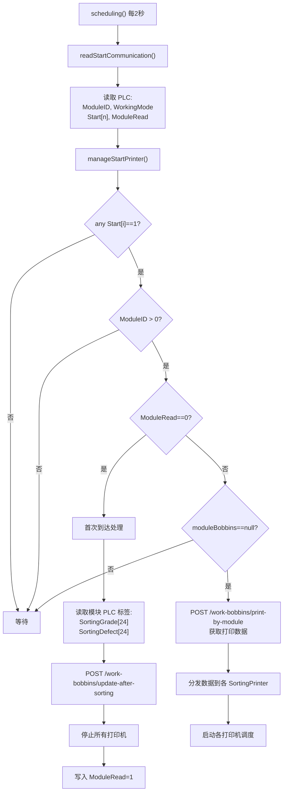

**关键设计**：
- `ModuleRead=0` 触发一次性数据处理（读取分拣结果、提交API、获取打印数据）
- `ModuleRead=1` 后各打印机独立消费打印数据
- `moduleBobbins` 缓存确保打印数据只获取一次

### 4.7 SortingPrinter（分拣打印机控制器）

**文件**: `src/SortingPrinter.js` | **轮询间隔**: 1.5秒

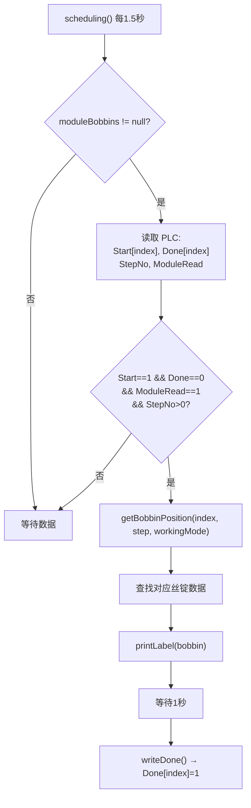

**标签打印数据格式**：

```javascript
const variables = [
    { name: '0', value: lotCode截断至'-' },      // 批次号
    { name: '4', value: specificationChina },      // 中文规格
    { name: '3', value: endDate + endTime },       // 日期时间
    { name: '5', value: winderNo-place  A/B },     // 卷绕机-位置 班组
];
```

**打印机类型选择**：

```javascript
this.printer = this.sort.printerType === 'macsa'
    ? new MacsaPrinter(printerSettings)
    : new EidosPrinter(printerSettings);
```

**空丝锭处理**：当 `bobbin==null` 时，使用空白字符填充所有标签字段。

### 4.8 WeightingManager（称重管理器）

**文件**: `src/WeightingManager.js` | **轮询间隔**: 2秒

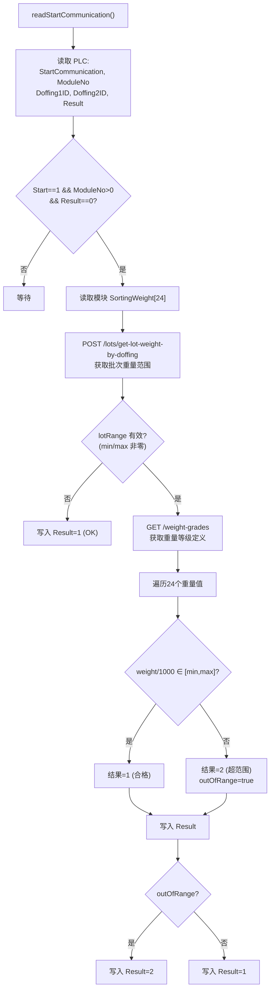

> **注意**：`await axios.post('work-bobbins/update-after-weighting', ...)` 被注释掉，称重结果仅写入PLC，未持久化到API。

**重量单位转换**：PLC 中重量值以克(g)存储（INT类型），比较时除以1000转换为千克(kg)。

### 4.9 VisionDataManager（视觉数据管理器）

**文件**: `src/VisionDataManager.js` | **轮询间隔**: 2秒

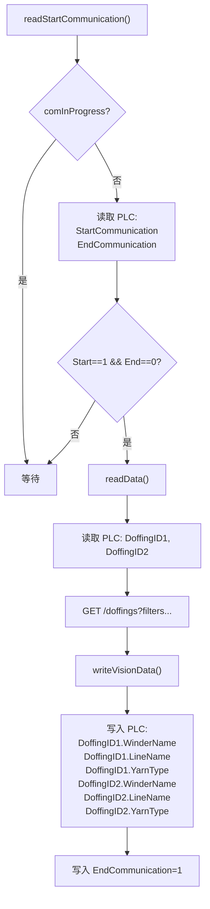

**源码注释**: `//NO UTILITY FOR US, CLIENT WANTS IT` — 视觉检测功能是客户要求但非核心需求。

此 Manager 被 **复用两次**：一次用于 Vision DB，一次用于 ModuleData DB，两者使用相同的变量定义（`variables.visionData`）但不同的 PLC 数据块。

### 4.10 KnittingManager（织造管理器）

**文件**: `src/KnittingManager.js` | **状态**: 已注释禁用

```javascript
// 在 O17006.js 中被注释掉：
//const KnittingManager = require('./KnittingManager');
//this.knittingManagers = this.monorails.map(monorail => new KnittingManager(...));
```

**源码注释**: `//NON SERVE PER ORA MA PREDISPOSTO IN CASO DI NECESSITA'` — "目前不需要，但已预留以备不时之需"。

如果启用，其功能为：遍历所有 knitting 单元，当检测到 `Start=1 && End=0` 时，直接写入 `EndCommunication=1` 和 `KnittingDone=1`。即简单的握手应答，无业务逻辑。

### 4.11 打印机驱动

#### EidosPrinter（Eidos 热转印打印机）

**通信协议**: TCP Socket，文本命令

```
发送流程:
^@ (重置)
^A{emptyLabel} (清除旧标签)
^@ (重置)
^A{labelName} (选择标签模板)
^|i{name}{value} (设置变量值，可多个)
^V (验证)
^! (开始打印)

状态查询:
^?df → 响应格式: $markingStatus,x,onError,errorCode,printOk,printErrorCode,...

打印应答:
等待 'W' → 2秒超时
等待 'R' → 10秒超时
```

**操作队列**：使用 `this.operations[]` 数组实现打印任务串行化，避免并发打印冲突。

#### MacsaPrinter（Macsa 激光打印机）

**通信协议**: TCP Socket，二进制 Hex 协议

```
标签选择:
|0x02|0x16|0x2D|0x00|MODE|COPIES|BATCH|8字节文件名|0x03|

变量发送:
|0x02|0x04|0x41|0x01|数据长度|选项|字段号1|ASCII文本1|0x00|字段号2|...|0x03|

状态查询:
|0x02|0x02|0x70|0x00|0x03|
响应含: 打印计数、告警码、打印时间、标签名等
```

**辅助函数**:
- `hexStringToArray(text)` — Hex 字符串转字节数组
- `stringToHexString(text)` — 文本转 Hex 字符串
- `bufferToResponse(buffer)` — Buffer 转可读格式

### 4.12 公共函数: functions.js

```javascript
async function loadBobbins(id1, id2, number, containerType, sortingId) {
    let moduleNumber = Number(number);
    if (config.lineType === 'FDY') {
        moduleNumber += 2000; // FDY 产线模块号偏移
    }
    // POST /work-bobbins/loadingBobbins
    // 参数: id1, id2, number, containerType, sortingId
    // 返回: containerId
}
```

### 4.13 PLC 变量定义: variables.js

```
variables.entrySort (30字节/站):
  StartCommunication(INT), ModuleNo(INT), DoffingID1(DINT),
  DoffingID2(DINT), EnableModulePrinter(INT), EnableBobbinsPrinter(INT),
  EndCommunication(INT), ModuleID(DINT)

variables.moduleData (340字节/模块):
  ModuleNo, ModuleType, ModuleID, Lot[12], DoffingId[2], LineNo,
  KnittingDone(bit), Status[24], Grade[24], SortingGrade[24],
  VisionGrade[24], KnittingGrade[24], SortingDefect[24],
  VisionDefect[24], SortingWeight[24], KnittingWeight[24],
  Knitting.*, Packing.*, DTY.*, Location, Warehouse*, Priority

variables.weight (16字节):
  StartCommunication(bit), ModuleNo(INT), Doffing1ID(DINT),
  Doffing2ID(DINT), Result(INT)

variables.visionData:
  StartCommunication(bit), ModuleNo(INT), DoffingID1(DINT),
  DoffingID2(DINT), EndCommunication(bit),
  DoffingID1.WinderName[8], DoffingID1.LineName[8], DoffingID1.YarnType[12],
  DoffingID2.WinderName[8], DoffingID2.LineName[8], DoffingID2.YarnType[12]

variables.knitting (32字节):
  StartCommunication(INT), ModuleNo(INT), DoffingID1(DINT),
  DoffingID2(DINT), OrderID(DINT), EndCommunication(INT),
  ActualOrderID(DINT), KnittingDone(bit)
```

### 4.14 O17006 数据流总图

```mermaid
graph TB
    subgraph "PLC 设备层"
        ENTRY_PLC["入口分拣 PLC DB<br/>(EntrySort)"]
        SORT_PLC["打印分拣 PLC DB<br/>(Sorting)"]
        WEIGHT_PLC["称重站 PLC DB<br/>(Weight)"]
        VISION_PLC["视觉检测 PLC DB<br/>(Vision/ModuleData)"]
        MODULE_PLC["模块数据 PLC DB<br/>(moduleData)"]
    end

    subgraph "O17006 Managers"
        ESM["EntrySortingManager<br/>2s 轮询"]
        SM["SortingManager<br/>2s 轮询"]
        WM["WeightingManager<br/>2s 轮询"]
        VDM["VisionDataManager<br/>2s 轮询"]
    end

    subgraph "打印系统"
        SP["SortingPrinter<br/>1.5s 轮询"]
        EP["EidosPrinter<br/>TCP Socket"]
        MP["MacsaPrinter<br/>TCP Socket"]
        PS["打印服务器<br/>WebSocket"]
    end

    subgraph "后端服务"
        API["REST API (O17003)"]
    end

    ENTRY_PLC <-->|"Start/End 握手"| ESM
    ESM -->|"loadBobbins"| API
    ESM -->|"PRINT 命令"| PS
    ESM -->|"写回 SortingGrade/Defect"| MODULE_PLC

    SORT_PLC <-->|"ModuleID/Start/Done"| SM
    SM -->|"update-after-sorting"| API
    SM -->|"print-by-module"| API
    SM --> SP
    SP -->|"打印标签"| EP
    SP -->|"打印标签"| MP
    SP <-->|"Start/Done 握手"| SORT_PLC

    WEIGHT_PLC <-->|"Start/Result"| WM
    WM -->|"get-lot-weight"| API
    WM -->|"读取 SortingWeight"| MODULE_PLC

    VISION_PLC <-->|"Start/End"| VDM
    VDM -->|"GET /doffings"| API
    VDM -->|"写回 WinderName/LineName/YarnType"| VISION_PLC
```

---

## 5. DTY 变体差异分析

### 5.1 O19018_DTY vs O19018

| 维度 | O19018 (v1.0.16) | O19018_DTY (v1.0.17) |
|------|---------|-------------|
| 版本 | 1.0.16 | 1.0.17 |
| 模块编号 | `index + 1` | `index + 1 + config.startingNumber` |
| 其他文件 | — | 完全相同 |

**唯一差异**：DTY 版本在模块编号计算时加入 `startingNumber` 偏移量，用于避免 DTY 和 FDY 模块编号冲突。

### 5.2 O19033_DTY vs O19033

```mermaid
graph LR
    subgraph "O19033 (v2.0.9)"
        M1["PalletsManager"]
        M2["DTYPalletsManager"]
        M3["BobbinsManager"]
        M4["DoffingsManager"]
        M5["ModulesManager"]
        M6["TrolleysManager"]
    end

    subgraph "O19033_DTY (v2.0.7)"
        D1["PalletsManager ✅"]
        D2["DTYPalletsManager ✅"]
        D3["BobbinsManager ✅"]
        D4["DoffingsManager ❌ 不存在"]
        D5["ModulesManager ❌ 不存在"]
        D6["TrolleysManager ❌ 不存在"]
    end
```

| 维度 | O19033 (v2.0.9) | O19033_DTY (v2.0.7) |
|------|---------|-------------|
| 版本 | 2.0.9 | 2.0.7（更低） |
| Managers | 6 个 | 3 个（仅 pallets, dtyPallets, bobbins） |
| ERP DB 连接 | Hive Db 库(MySQL)，init中调用 | mssql.ConnectionPool，**已注释掉** |
| 仓库 DB | 已注释掉 | 已注释掉 |
| 缺失文件 | — | doffingsManager.js, modulesManager.js, trolleysManager.js |
| 共享文件 | — | bobbinsManager.js, dtyPalletsManager.js, palletsManager.js, http.js, logger.js, ws.js（完全相同） |

**DTY 版本精简原因**：DTY 产线不需要落纱(doffing)、模块(module)、小车(trolley)的 ERP 同步，因为这些实体在 DTY 生产流程中由不同的管理系统处理。

### 5.3 O17006_DTY vs O17006

O17006 的 DTY 变体差异最大，新增了专用的 DTY 管理器类：

#### 新增文件

| 文件 | 说明 |
|------|------|
| `DTYEntrySortingManager.js` | DTY 入口分拣管理器（无落纱ID，基于批次号） |
| `DTYWeightingManager.js` | DTY 称重管理器（基于模块ID，按等级分组称重） |

#### 变量定义扩展

| 变量集 | 标准版 | DTY 版 |
|--------|--------|--------|
| `moduleData` | 340字节, 24位数组 | — |
| `DTYModuleData` | — | 1124字节, 96位数组 |
| `entrySort` | 30字节, 含 DoffingID | — |
| `DTYEntrySort` | — | 26字节, 无 DoffingID |
| `weight` | 16字节, 按 DoffingID | — |
| `DTYWeight` | — | 按 ModuleID |

#### DTYEntrySortingManager 核心差异

```mermaid
flowchart LR
    subgraph "FDY EntrySortingManager"
        F1["读取 DoffingID1, DoffingID2"]
        F2["checkIfDuplicateDoffings()"]
        F3["loadBobbins(id1, id2, number)"]
        F4["写回 SortingGrade/SortingDefect"]
        F5["打印模块/丝锭标签"]
        F1 --> F2 --> F3 --> F4 --> F5
    end

    subgraph "DTY DTYEntrySortingManager"
        D1["读取 ModuleNo"]
        D2["读取 PLC 模块 Lot 字段"]
        D3["从Lot解析: lotCode + machineCode"]
        D4["GET /lots 查找 lotId"]
        D5["loadDTYBobbins(number, sortingId, lotId)"]
        D6["仅写入 ModuleID + EndCommunication"]
        D1 --> D2 --> D3 --> D4 --> D5 --> D6
    end
```

关键差异：
1. **无落纱识别**：DTY 不使用 DoffingID，而是从 PLC 读取 Lot 字符串，解析出批次号和机器代码
2. **无重复检测**：移除了 `checkIfDuplicateDoffings()`
3. **不同的 API 端点**：`/work-bobbins/load-dty-bobbins` vs `/work-bobbins/loadingBobbins`
4. **不写回分拣数据**：不写 SortingGrade/SortingDefect 到模块 PLC 标签
5. **无打印功能**：DTY 入口不触发标签打印
6. **更慢的轮询**：5秒 vs 2秒

#### DTYWeightingManager 核心差异

```mermaid
flowchart LR
    subgraph "FDY WeightingManager"
        F1["按 Doffing1ID + Doffing2ID 识别"]
        F2["get-lot-weight-by-doffing"]
        F3["单一重量范围 [min, max]"]
        F4["统一判定合格/超范围"]
    end

    subgraph "DTY DTYWeightingManager"
        D1["按 ModuleID 识别"]
        D2["get-lot-weight-by-module"]
        D3["按等级分组的重量范围<br/>weightRanges[gradeId]"]
        D4["查询 work-bobbins 获取每个丝锭的等级"]
        D5["每个丝锭用对应等级的范围判定"]
        D1 --> D2 --> D3 --> D4 --> D5
    end
```

关键差异：
1. **模块ID识别**：用 ModuleID 替代 DoffingID 对
2. **分级重量范围**：每个分拣等级有独立的 min/max 范围
3. **逐锭精细判定**：每个丝锭根据其分拣等级查找对应重量范围
4. **优雅降级**：无有效重量范围的丝锭默认为合格

#### Sorting.js DTY 扩展

DTY 版的 Sorting.js 新增两个 DB 初始化块和对应的 Manager：

```javascript
// DTYEntrySort DB 初始化
if (isEnabled(dbs, 'DTYEntrySort')) {
    // prefix: connection.sorting{id}.DTYEntrySort.
    this.dtyEntrySortingManager = new DTYEntrySortManager(...)
}

// DTYWeight DB 初始化
if (isEnabled(dbs, 'DTYWeight')) {
    // prefix: connection.sorting{id}.DTYWeight.
    this.dtyWeightingManager = new DTYWeightingManager(...)
}
```

> **注意**：DTY 版的 `initPrintServer()` 调用被注释掉，即 DTY 分拣站不连接打印服务器。

---

## 6. 系统间协作与数据流总图

### 6.1 三系统协作关系

```mermaid
graph TB
    subgraph "生产设备层"
        PLC_PAL["码垛机 PLC"]
        PLC_MON["单轨车 PLC"]
        PLC_SORT["分拣站 PLC"]
        PRINTER["工业打印机"]
    end

    subgraph "设备自动化层"
        O19018["O19018<br/>PLC 数据桥<br/>━━━━━━━━━━<br/>连接码垛机/仓库/单轨车 PLC<br/>暴露标签到 WebSocket"]
        O17006["O17006<br/>分拣自动化<br/>━━━━━━━━━━<br/>管理分拣/称重/视觉<br/>控制打印机"]
        O19033["O19033<br/>ERP 数据同步<br/>━━━━━━━━━━<br/>同步生产数据到 ERP"]
    end

    subgraph "应用服务层"
        O17003["O17003<br/>REST API 后端<br/>━━━━━━━━━━<br/>业务逻辑 + 数据库操作"]
        ServerDB["Server MySQL<br/>核心生产数据库"]
    end

    subgraph "企业系统层"
        ERP["ERP 系统<br/>(MySQL + MSSQL + HTTP)"]
    end

    PLC_PAL <-->|"S7"| O19018
    PLC_MON <-->|"S7"| O19018
    PLC_SORT <-->|"S7"| O17006
    PLC_MON <-->|"S7 (模块数据)"| O17006
    PRINTER <-->|"TCP"| O17006

    O19018 <-->|"WebSocket"| O17003
    O17006 -->|"REST API"| O17003
    O17003 <--> ServerDB
    O19033 -->|"读取"| ServerDB
    O19033 -->|"同步"| ERP
```

### 6.2 数据生命周期

```mermaid
sequenceDiagram
    participant PLC as PLC 设备
    participant O19018 as O19018 (通信桥)
    participant O17003 as O17003 (后端)
    participant DB as Server MySQL
    participant O17006 as O17006 (分拣)
    participant O19033 as O19033 (ERP同步)
    participant ERP as ERP 系统

    Note over PLC,ERP: 阶段1: 模块数据采集
    PLC->>O19018: 模块/载体/仓库实时数据
    O19018->>O17003: WebSocket 推送标签值
    O17003->>DB: 存储模块/落纱/丝锭数据

    Note over PLC,ERP: 阶段2: 分拣处理
    PLC->>O17006: StartCommunication=1
    O17006->>O17003: loadBobbins (加载丝锭)
    O17003->>DB: 创建 work_bobbins 记录
    O17006->>PLC: SortingGrade/SortingDefect
    O17006->>PLC: EndCommunication=1

    Note over PLC,ERP: 阶段3: 称重检测
    PLC->>O17006: StartCommunication=1
    O17006->>O17003: get-lot-weight (获取重量范围)
    O17006->>PLC: Result=1(OK)/2(超范围)

    Note over PLC,ERP: 阶段4: 标签打印
    O17006->>O17003: print-by-module (获取打印数据)
    O17006->>PLC: 打印机 Start/Done 握手
    Note right of O17006: 直接 TCP 或通过打印服务器

    Note over PLC,ERP: 阶段5: 码垛出库
    PLC->>O19018: 码垛完成信号
    O17003->>DB: 创建 erp_pallets 记录

    Note over PLC,ERP: 阶段6: ERP 同步
    O19033->>DB: 轮询 erp_pallets/doffings/modules/trolleys
    O19033->>ERP: POST/INSERT 同步数据
    O19033->>DB: 标记 sent_to_erp=1
```

### 6.3 与 O17003 的交互模式

| 子系统 | 交互方式 | 关键 API 端点 |
|--------|---------|--------------|
| O19018 | WebSocket (双向) | 由 Communication 库管理 |
| O17006 | REST API (请求-响应) | `/monorails`, `/sortings/{id}`, `/work-bobbins/*`, `/doffings`, `/lots/*`, `/weight-grades`, `/modules/printed`, `/notifications` |
| O19033 | 直接数据库访问 | 无 API 调用，直连 Server MySQL |

---

## 7. 问题发现与设计模式总结

### 7.1 发现的问题

#### 🔴 严重问题

| # | 问题 | 位置 | 影响 |
|---|------|------|------|
| 1 | `readBobbinsToBeSent()` 首行 `return;` 导致丝锭同步**完全禁用** | O19033 `bobbinsManager.js:56` | 所有丝锭数据无法同步到 ERP |
| 2 | 类名不一致：`bobbinsManager.js` 导出 `PalletsManager` | O19033 `bobbinsManager.js` | 代码可读性差，维护风险 |
| 3 | `dtyPalletsManager.js` 同样导出 `PalletsManager` | O19033 `dtyPalletsManager.js` | 三个不同文件导出同名类 |

#### 🟡 潜在问题

| # | 问题 | 位置 | 影响 |
|---|------|------|------|
| 4 | PLC 变量偏移冲突：`Packing.OrderId`(302) 与 `Knitting.ModuleSequenceNo`(302) 重叠 | O19018/O17006 `variables.js` | 可能是 union 设计，但缺乏注释 |
| 5 | 称重结果未持久化：`update-after-weighting` API 调用被注释 | O17006 `WeightingManager.js:110` | 称重数据仅存于 PLC，服务器无记录 |
| 6 | `sendAllPallets()` 方法为空 `return;` | O19033 `palletsManager.js`, `dtyPalletsManager.js` | 托盘菜单"Send all pallets"功能无效 |
| 7 | SQL 注入风险：直接拼接字符串构建 SQL | O19033 所有 Manager 的 `sendXxx()` 方法 | 若数据包含特殊字符可能导致查询失败或注入 |
| 8 | 无限重试无退避：所有 API 获取方法固定5秒重试 | O19018, O17006 | 后端故障时产生大量无效请求 |

#### 🟢 设计建议

| # | 建议 | 说明 |
|---|------|------|
| 9 | KnittingManager 代码保留但未启用 | 建议移除或启用，避免维护死代码 |
| 10 | DTY 和标准版本大量代码重复 | 建议使用配置驱动或继承机制统一代码库 |
| 11 | Utils 对象定义但从未使用 | O19033 `palletsManager.js` 和 `dtyPalletsManager.js` 中的 Utils 是死代码 |

### 7.2 共性设计模式

#### 模式1: setTimeout 递归轮询

所有 Manager 使用 `setTimeout` 而非 `setInterval`，确保：
- 上一次操作完成后才开始下一次倒计时
- 长时间操作不会导致任务堆积

```javascript
async scheduling() {
    if (this.schedulingStop) { clearTimeout(this.schedulingTimeout); return; }
    try { await this.doWork(); }
    catch (error) { logger.error(error); }
    finally { this.mutex = false; }
    this.schedulingTimeout = setTimeout(this.scheduling.bind(this), interval);
}
```

#### 模式2: PLC 握手协议

所有 PLC 通信使用标准的**请求-应答握手**模式：

```
PLC 发起: StartCommunication = 1, EndCommunication = 0
PC 处理: 读取数据 → 业务逻辑 → 写回结果
PC 应答: EndCommunication = 1
PLC 确认: StartCommunication = 0
```

#### 模式3: HTTP URL 故障转移

三个子系统共享相同的 `http.js` 实现（仅配置不同），提供透明的 URL 轮换故障转移。

#### 模式4: Electron 托盘应用

统一的无窗口 Electron 架构：
- `createWindow()` 返回空（无GUI）
- `createTray()` 创建系统托盘
- 右键菜单提供 Start/Stop/Restart/Logs/Exit
- 退出时 `dialog.showMessageBox` 二次确认

#### 模式5: Winston 日志标准化

三个子系统使用完全相同的日志配置：
- 3个文件传输（error/combine/actions）
- 2MB × 3文件轮转
- 调用者文件:行号追踪
- MySQL 格式本地时间戳

---

*文档生成时间: 2026-09-17*
*基于源码版本: O19018 v1.0.16/v1.0.17, O19033 v2.0.9/v2.0.7, O17006 v2.1.5/v2.1.10*
