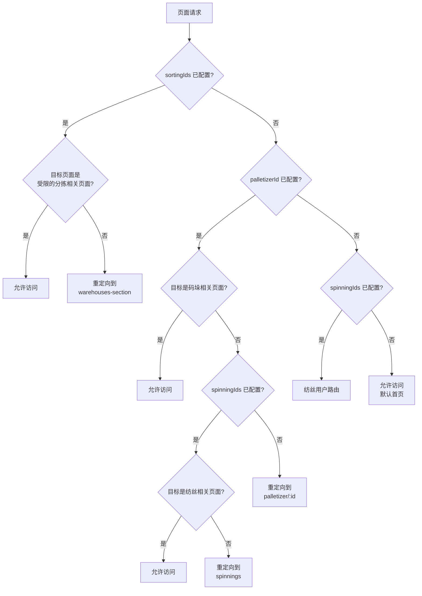
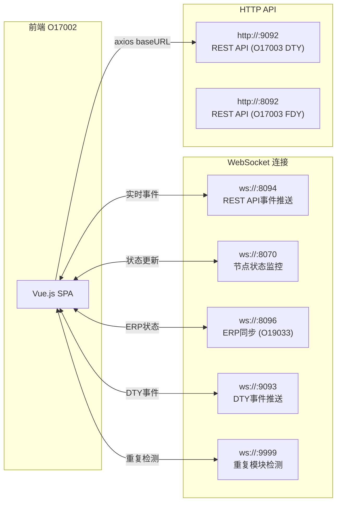
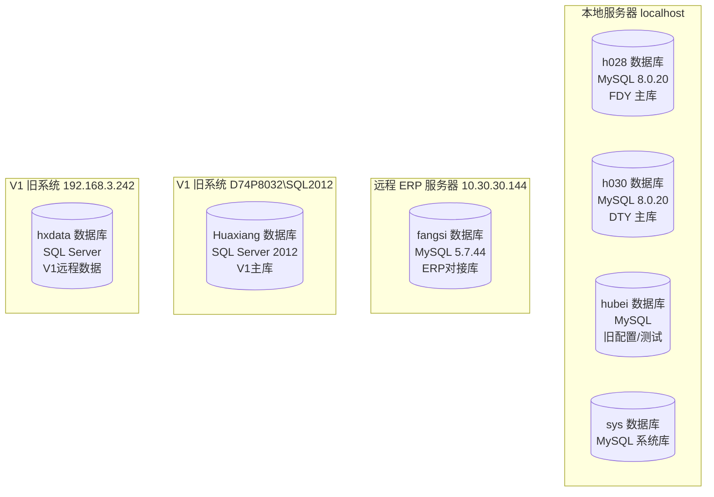
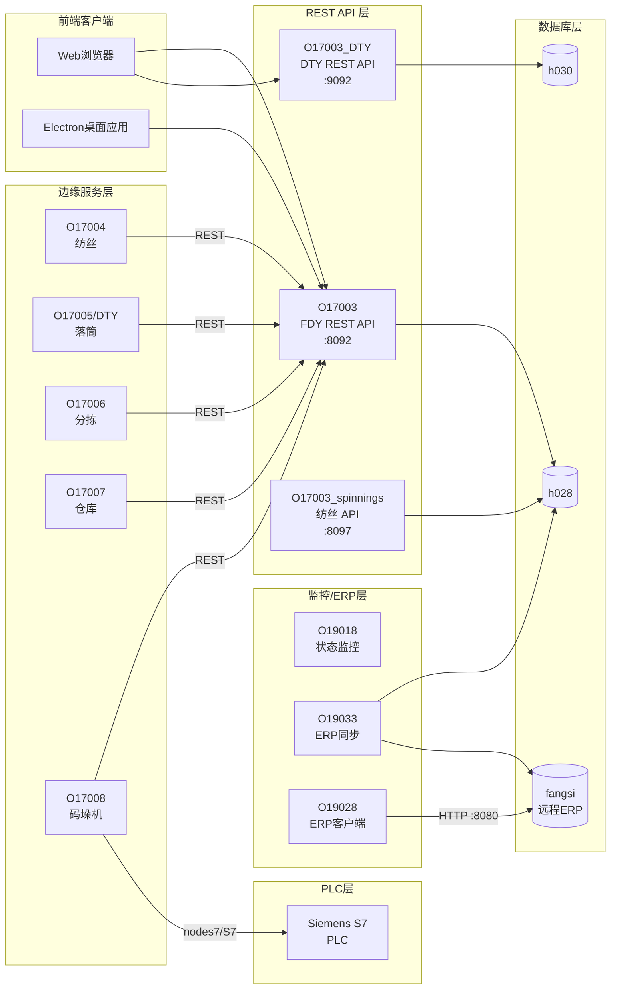
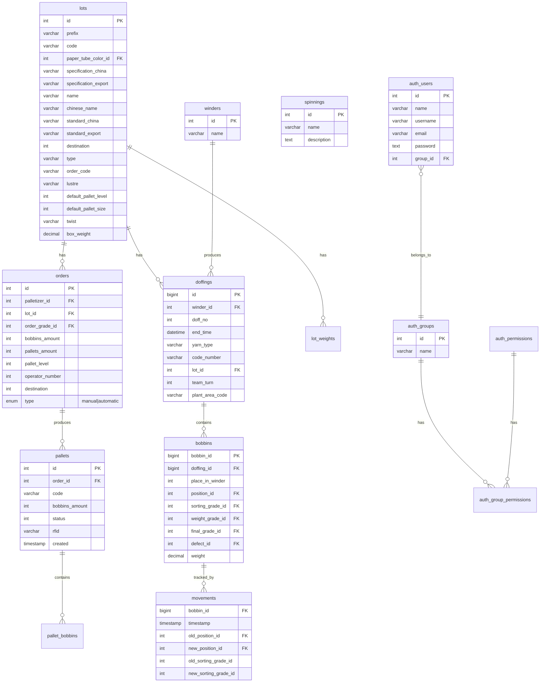
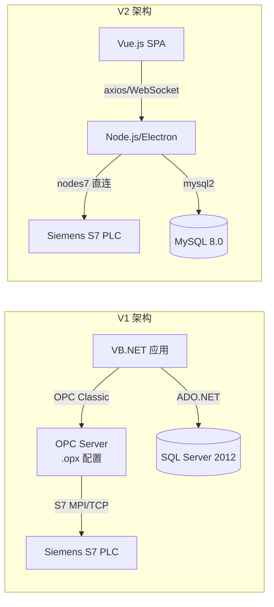

# 前端Web界面与数据库分析报告

> 基于纯源码解读 — 禁止引用任何 .md 文档
> 分析日期：2026-09-17

---

## 1. 前端技术栈

### 1.1 核心框架

| 技术 | 版本/详情 | 来源 |
|------|-----------|------|
| **Vue.js** | Vue 2.x（使用 `_self._c` render 函数、`Vue.Ay.use()`） | `app.*.js` 编译产物 |
| **Vue Router** | Vue Router 3.x（路由守卫 `beforeRouteEnter`） | 路由定义提取 |
| **Vuex** | 集成使用 `$store.dispatch` / `$store.getters` | app.js 代码分析 |
| **Axios** | HTTP 客户端（`axios.create()` 含拦截器） | app.js / http.js |
| **vue-i18n** | 多语言支持（en-US, it-IT, zh-CN） | i18n 初始化代码 |
| **Electron** | 桌面客户端打包（O17008 等后端服务） | O17008.js 源码 |
| **Node.js + Express** | 后端 REST API 服务器 | package.json (O17003) |

### 1.2 构建工具

| 工具 | 证据 |
|------|------|
| **Webpack (Vue CLI)** | chunk 命名模式 `chunk-vendors.*.js`、`app.*.js`、数字ID chunk |
| **PWA 支持** | `manifest.json`、Service Worker 注册代码、`apple-mobile-web-app-capable` |
| **代码分割** | 70+ 个 JS chunk 文件（懒加载路由组件） |

### 1.3 UI 框架

| 框架 | 版本 | 用途 |
|------|------|------|
| **Font Awesome Free** | 5.14.0 | 图标库（fas/far/fab 全套） |
| **Milligram** | — | 轻量级 CSS 框架 |
| **Normalize.css** | — | CSS 重置 |
| **自定义 CSS** | `colors.css` + `main.css` | 主题色和布局 |
| **FlatPickr** | — | 日期选择器（支持中/英/意语言切换） |

### 1.4 应用元数据

从编译后 JS 中提取的硬编码配置：

```javascript
APPLICATION: {
  CODE: "O17002",
  VERSION: "2.0.42",
  SERVER_1_IP: "192.168.4.98",
  SERVER_2_IP: "192.168.4.99",
  PLANT_NAME: "HuBei"     // 湖北工厂
}
```

### 1.5 前端部署矩阵

Programmi 目录下有两套前端构建：

| 目录 | 内容 | 区别 |
|------|------|------|
| `O17002/` | FDY+DTY 合并前端 | `app.538af34c.js` |
| `DTY/O17002/` | DTY 专用前端 | `app.d4b8f3e9.js` |

两套前端路由完全一致（经对比确认），仅 app hash 不同，说明是同一代码库的不同编译。

其他目录（O17003–O19033）均为 **Electron 后端服务**，不含 Web 前端页面：
- `O17003` — REST API 服务器（Express）
- `O17004` — 纺丝端服务（Spinning）
- `O17005/DTY` — 落筒端服务（Doffing DTY）
- `O17006` — 分拣端服务（Sorting）
- `O17007` — 仓库端服务（Warehouse）
- `O17008` — 码垛机端服务（Palletizer，Electron桌面应用）
- `O19018` — 单轨/仓库监控服务
- `O19028` — ERP对接客户端
- `O19033` — ERP同步服务

---

## 2. 前端路由和页面结构

### 2.1 完整路由表

从编译后 `app.*.js` 中提取的所有路由路径：

| 路径 | 分类 | 说明 |
|------|------|------|
| `/` | 首页 | Home |
| `/settings` | 系统 | 设置页 |
| `/diagnostics` | 系统 | 诊断页 |
| `/advanced` | 系统 | 高级管理 |
| `/logs` | 系统 | 日志查看 |
| `/notifications` | 系统 | 通知中心 |
| `/users` | 权限 | 用户管理 |
| `/groups` | 权限 | 用户组管理 |
| `/groups/:id/` | 权限 | 用户组详情（子路由：`users`, `permissions`） |
| `/lots` | 生产 | 批次管理 |
| `/hidden-lots` | 生产 | 隐藏批次 |
| `/current-lots-status` | 生产 | 当前批次状态 |
| `/paper-tube-colors` | 生产 | 纸管颜色配置 |
| `/spinnings` | 纺丝 | 纺丝线总览 |
| `/spinnings-statistics` | 统计 | 纺丝统计 |
| `/doffings` | 落筒 | 落筒记录 |
| `/trolleys` | 运输 | 丝车列表 |
| `/trolleys/:number` | 运输 | 丝车详情 |
| `/printed-trolleys` | 运输 | 已打印丝车 |
| `/modules` | 模块 | 模块列表 |
| `/modules/:number` | 模块 | 模块详情 |
| `/printed-modules` | 模块 | 已打印模块 |
| `/weight-modules` | 模块 | 称重模块 |
| `/current-modules` | 模块 | 当前模块 |
| `/duplicate-modules` | 模块 | 重复模块 |
| `/modules-tracking` | 模块 | 模块追踪 |
| `/bobbins` | 筒子 | 筒子管理 |
| `/work-bobbins` | 筒子 | 工作筒子 |
| `/pre-defect-bobbins` | 质量 | 预缺陷筒子（子路由：`current-pre-defects`, `all-pre-defects`）|
| `/defects` | 质量 | 缺陷管理 |
| `/sorting-grades` | 质量 | 分拣等级 |
| `/weight-grades` | 质量 | 重量等级 |
| `/final-grades` | 质量 | 最终等级 |
| `/order-grades` | 质量 | 订单等级 |
| `/weighing-rules` | 质量 | 称重规则（子路由：`current-weighting-rules`, `all-weighting-rules`）|
| `/winders-check` | 质量 | 卷绕头检查（子路由：`winders-check-lines`, `winders-check-rules`）|
| `/palletizers` | 码垛 | 码垛机列表 |
| `/palletizers/:id` | 码垛 | 码垛机详情（子路由：`status`, `orders`, `queue`, `pallets`, `printed-pallets`, `lots`, `pallets-tracking`, `modules-confirm`） |
| `/palletizers-statistics` | 统计 | 码垛机统计 |
| `/pallets` | 托盘 | 托盘列表 |
| `/pallets/:palletId/bobbins` | 托盘 | 托盘筒子详情 |
| `/carriers` | 运输 | 载具管理 |
| `/positions` | 系统 | 位置管理 |
| `/position-types` | 系统 | 位置类型 |
| `/warehouses` | 仓库 | 仓库管理 |
| `/warehouses-section` | 仓库 | 仓库区段（子路由：`warehouse-status`）|
| `/cycles` | 设备 | 设备周期 |
| `/statistics` | 统计 | 统计总览 |
| `/statistics-summary` | 统计 | 统计摘要 |
| `/sortings-statistics` | 统计 | 分拣统计 |
| `/dty` | DTY | DTY管理（子路由：`dty-orders`, `dty-orders-create-list`, `dty-orders-status`, `boxes`, `degrade`, `packing-orders-status`）|
| `/knitting` | 织造 | 织造管理（子路由：`knitting-orders`, `knitting-orders-create-list`, `knitting-orders-status`, `knitting-results`）|
| `*` | 系统 | 404 兜底 |

### 2.2 页面结构图

```mermaid
graph TB
    subgraph "布局层"
        DL[default-layout<br/>主布局 - Header/Footer/Menu]
        FL[fullscreen-layout<br/>全屏布局]
    end

    subgraph "Header 组件"
        DL --> LOGO_IGH[IGH Logo]
        DL --> LOGO_HIVE[Hive Logo]
        DL --> VER[版本号 O17002 V2.0.42]
        DL --> SRV[双服务器状态指示灯<br/>192.168.4.98 / .99]
        DL --> AUTH[登录/登出]
        DL --> TIME[日期时间]
        DL --> MENU[主菜单按钮]
    end

    subgraph "告警栏"
        DL --> ALERT_LIC[许可证过期告警]
        DL --> ALERT_LOT[批次未完成告警]
        DL --> ALERT_NTF[通知告警]
        DL --> ALERT_ERP[ERP服务器错误告警]
        DL --> ALERT_DUP[重复模块告警]
    end

    subgraph "主页面区"
        DL --> RV[router-view]
        RV --> HOME[首页 /]
        RV --> PROD[生产管理]
        RV --> QUALITY[质量管理]
        RV --> PAL[码垛管理]
        RV --> WH[仓库管理]
        RV --> DTY_M[DTY管理]
        RV --> KNIT[织造管理]
        RV --> STAT[统计分析]
        RV --> SYS[系统设置]
    end

    subgraph "Footer 组件"
        DL --> BTN_HOME[Home按钮]
        DL --> BTN_NTF[Notifications按钮]
        DL --> BTN_NAV[导航按钮组<br/>返回/上级/刷新]
        DL --> BTN_SET[Settings按钮]
    end
```



### 2.3 前端权限路由逻辑

从 `beforeRouteEnter` 守卫中提取的访问控制逻辑：



---

## 3. 前端与后端API调用关系

### 3.1 网络通信架构



### 3.2 已识别的 REST API 端点

从编译后 JS 提取的 axios 调用：

| 方法 | 端点 | 功能 |
|------|------|------|
| GET | `/clients-supervision-settings/my-settings` | 获取客户端监控设置 |
| POST | `/clients-supervision-settings` | 保存客户端设置 |
| GET | `/licenses` | 获取许可证列表 |
| GET | `/licenses/status` | 获取许可证状态 |
| GET | `/lots?filters[visible][eq]=1&...` | 查询可见批次 |
| GET | `/notifications?filters[acknowledge][eq]=0` | 查询未确认通知 |
| GET | `/palletizers/{id}` | 获取码垛机详情 |
| GET | `/print-servers/{id}` | 获取打印服务器配置 |
| POST | `/movements/last` | 获取最近的移动记录 |

### 3.3 WebSocket 消息类型

| 端口 | 来源 | 命令 | 功能 |
|------|------|------|------|
| 8094 | O17003 | `movements` | 移动事件推送 |
| 8094 | O17003 | `lots` | 批次变更推送 |
| 8094 | O17003 | `notifications` | 通知推送 |
| 8070 | O19018 | `UPDATE_STATUS` | 设备状态更新 |
| 8096 | O19033 | `UPDATE_STATUS` | ERP同步状态 |
| 8096 | O19033 | `SEND_ALL_PALLETS` | 发送全部托盘到ERP |
| 8096 | O19033 | `SEND_SELECTED_PALLETS` | 发送选定托盘到ERP |
| 9999 | 未知 | `UPDATE_DUPLICATES` | 重复模块告警更新 |

### 3.4 打印服务 WebSocket

前端通过 WebSocket 连接打印服务器，发送以下打印命令：

| 命令 | 参数 | 功能 |
|------|------|------|
| `PRINT` type=`BOBBIN` | bobbin id | 打印单个筒子标签 |
| `PRINT` type=`DOFFING_BOBBINS` | doffing id | 打印落筒批次标签 |
| `PRINT` type=`TROLLEY` | number, spinningSideId | 打印丝车标签 |
| `PRINT` type=`TROLLEY_BOBBINS` | number, spinningSideId | 打印丝车筒子标签 |
| `PRINT` type=`MODULE` | number, spinningSideId | 打印模块标签 |
| `PRINT` type=`MODULE_BOBBINS` | number, spinningSideId | 打印模块筒子标签 |
| `PRINT` type=`LOT_CODE` | lotId, copies | 打印批次条码 |

---

## 4. 数据库类型和版本

### 4.1 数据库技术栈

| 组件 | 版本 | 环境 |
|------|------|------|
| **MySQL** | 8.0.20 | 本地工厂数据库 (h028, h030) |
| **MySQL** | 5.7.44 | ERP远程数据库 (fangsi, 10.30.30.144) |
| **Microsoft SQL Server** | SQL Server 2012 | V1 第一版本程序 |
| **DBeaver** | Community Edition | 数据库管理工具（随系统部署） |

### 4.2 数据库实例分布



---

## 5. 数据库连接配置分析

### 5.1 后端服务配置汇总

| 服务 | 端口 | 数据库 | DB主机 | WS端口 |
|------|------|--------|--------|--------|
| **O17003** (FDY API) | 8092 | h028 | localhost | 8094 |
| **O17003_DTY** (DTY API) | 9092 | h030 | localhost | 9094 |
| **O17003_spinnings** | 8097 | h028 | localhost | 8099 |
| **O17004** (Spinning) | — | — | 通过 REST API | — |
| **O17005/DTY** (Doffing) | — | — | 通过 REST API | — |
| **O17006** (Sorting) | — | — | 通过 REST API | — |
| **O17007** (Warehouse) | — | — | 通过 REST API | — |
| **O17008** (Palletizer) | — | — | 通过 REST API | — |
| **O19018** (监控) | 8093 | — | 通过 REST API | — |
| **O19018_DTY** | 9093 | — | 通过 REST API | — |
| **O19028** (ERP客户端) | — | — | baseUrl: :8080 | — |
| **O19033** (ERP同步) | — | h028 + fangsi | localhost + 10.30.30.144 | 8196 |
| **O19033** (Programmi) | — | h028 + fangsi | localhost + 10.30.30.144 | 8096 |

### 5.2 数据库凭据

| 数据库 | 用户名 | 密码 | 字符集 |
|--------|--------|------|--------|
| h028 | `ht_user` | `8918` | utf8mb4 |
| h030 | `ht_user` | `8918` | utf8mb4 |
| hubei | `ht_user` | `8918` | utf8mb4 |
| fangsi (ERP) | `fangsi_user` | `Sn@fangsi` | utf8mb4 |
| Huaxiang (V1) | `Huaxiang` | `Marotta1977` | — |
| hxdata (V1) | `A1` | `Huaxiang123` | — |

### 5.3 服务间通信拓扑



---

## 6. 核心数据表结构 (V2)

### 6.1 h028/h030 数据库 — 97 张表

从 SQL dump 提取的完整表清单（两个库结构基本相同）：

**认证模块 (5张)**：`auth_group_permissions`, `auth_groups`, `auth_permissions`, `auth_users`, `auth_users_simple`, `auth_users_tokens`

**生产管理 (核心)**：`lots`, `orders`, `orders_queue`, `orders_queue_modules`, `doffings`, `doffings_hourly_production`, `spinnings`, `spinning_sides`, `team_turns`

**筒子/丝车管理**：`bobbins`, `work_bobbins`, `trolleys`, `modules`, `modules_hourly_production`, `modules_status`, `modules_tracking`

**质量管理**：`defects`, `sorting_grades`, `weight_grades`, `final_grades`, `vision_grades`, `knitting_grades`, `order_grades`, `pre_defect_bobbins`, `weighing_rules`, `lot_grades_ranges`

**码垛管理**：`palletizers`, `palletizers_alarms`, `palletizers_alarms_definition`, `palletizers_cycles`, `palletizers_cycles_definition`, `palletizers_hourly_production`, `palletizers_last_modules`, `palletizers_sections`, `palletizers_status`, `pallets`, `pallet_bobbins`, `pallet_boxes`, `printed_pallets`, `pallets_tracking`

**DTY管理**：`dty`, `dty_bobbins`, `dty_boxes`, `dty_module_bobbins`, `dty_modules`, `dty_orders`, `dty_pallets`, `dty_pallets_boxes`, `dty_warehouse_orders`, `dty_warehouse_orders_modules`, `dty_packing_orders_modules`

**仓库管理**：`warehouses`, `warehouses_alarms`, `warehouses_alarms_definition`, `warehouses_cycles`, `warehouses_cycles_definition`, `warehouses_read_status`, `warehouses_status`, `warehouse_movements`

**落筒机管理**：`doffers_alarms`, `doffers_alarms_definition`, `doffers_cycles`, `doffers_cycles_definition`, `doffers_status`

**ERP对接**：`erp_bobbins`, `erp_dty_pallets`, `erp_pallets`

**其他**：`movements`, `notifications`, `settings`, `licenses`, `print_servers`, `winders`, `winders_check`, `winders_check_rules`, `winders_check_time_slot`, `loading_bobbins_sequence`, `lot_prefixes`, `lot_weights`, `monorail_sections`, `monorails`, `paper_tube_colors`, `plant_areas`, `position_types`, `positions`, `knitting_orders`, `knitting_orders_modules`, `knittings`, `packing_orders_modules`, `box_bobbins`, `clients_supervision_settings`, `sortings`, `sortings_hourly_production`

### 6.2 ER 图 — 核心业务关系



### 6.3 fangsi 数据库 — ERP对接库

连接信息：`10.30.30.144:3306`，MySQL 5.7.44

| 表名 | 列 | 中文注释 |
|------|------|------|
| `doffings` | id, lot_code, order_code, specification, line_name, winder_name, created, paper_tube | 流水号, 批号, 工单编号, 规格, 落筒线, 卷绕头名称, 创建时间, 纸管 |
| `modules` | id, module_number, loading_time, lot_code, order_code, doffing_1_id, doffing_2_id, line_name_1/2, winder_name_1/2 | 流水号, 吊车号, 装载时间, 批号, 工单编号, 落筒线, 卷绕头名称 |
| `trolleys` | id, trolley_number, loading_time, lot_code, order_code, doffing_1_id, doffing_2_id, line_name_1/2, winder_name_1/2 | 流水号, 丝车号, 装载时间, 批号, 工单编号, 落筒线, 卷绕头名称 |

**特点**：fangsi 库是客户方（恒邦纺丝）的 ERP 数据库的简化镜像，仅包含 3 张表，用于将 Hive 系统的生产数据（落筒、吊车、丝车）同步给客户方 MES/ERP。字段名采用英文但附带中文 COMMENT 注释。

---

## 7. V1 数据库结构分析

### 7.1 数据库备份文件

| 文件 | 类型 | 大小 |
|------|------|------|
| `20151106` | SQL Server NTbackup 归档（`.bak`） | SQL Server 2012 备份 |
| `20160824` | SQL Server NTbackup 归档（`.bak`） | SQL Server 2012 备份 |

这些是 SQL Server 的原生备份文件，无法直接读取内容。从文件名推断分别是 2015年11月6日 和 2016年8月24日 的数据库快照。

### 7.2 V1 连接配置

**SQLconnection.udl** — 主连接：
```
Provider=SQLOLEDB.1
Data Source=D74P8032\SQL2012
Initial Catalog=Huaxiang
User ID=Huaxiang
Password=Marotta1977
Persist Security Info=True
```

**SQLconnection1.udl** — 远程连接：
```
Provider=SQLOLEDB.1
Data Source=192.168.3.242
Initial Catalog=hxdata
User ID=A1
Password=Huaxiang123
Persist Security Info=True
```

### 7.3 V1 技术栈

| 组件 | 技术 |
|------|------|
| **数据库** | Microsoft SQL Server 2012 |
| **前端/桌面应用** | VB.NET (Visual Basic .NET) |
| **数据访问** | System.Data.SqlClient (ADO.NET) |
| **OPC 通信** | OPC Classic（.opx 配置文件） |
| **PLC 通信** | Siemens S7 TCP/IP 协议 |
| **打印** | 热敏标签打印机（TCP 9100端口） |
| **标签模板** | NiceLabel .lpa 文件 |

### 7.4 V1 Source 代码结构

VB.NET 项目 `HengbangTunnel`（恒邦隧道窑/码垛控制）：

| 文件 | 功能 |
|------|------|
| `HuaxiangFunctions.vb` | 核心业务函数（OPC读写、DB操作） |
| `ModDBNet.vb` | 数据库连接/查询封装 |
| `FrmPallet.vb` | 托盘窗体（称重、标签打印） |
| `FrmTubes.vb` | 纸管/筒子窗体 |
| `FrmBarcode.vb` | 条码窗体 |
| `FrmDoffingData.vb` | 落筒数据窗体 |
| `FrmInfo.vb` | 信息窗体 |
| `ClsLog.vb` | 日志类 |
| `app.config` | 应用配置（打印机IP等） |

**V1 打印机配置**：
- 丝车打印机：`192.168.3.172:9100`
- 筒子打印机：`192.168.3.173:9100`
- 落筒机筒子打印机：`192.168.3.174:9100`

---

## 8. OPC 配置和 PLC 连接分析

### 8.1 V1 OPC 配置（OPC Classic）

**Palletizer.opx** — 码垛机 OPC 配置：

| 参数 | 值 |
|------|------|
| PLC协议 | S7 TCP/IP |
| PLC IP | 192.168.0.1 |
| MPI地址 | 2 |
| Rack/Slot | 0/2 |
| Step7项目路径 | `C:\Huaxiang\PLC\TrolleysLoad\` |

**DB40 (DB_KAWA_Data)**：
| 地址 | 名称 | 类型 |
|------|------|------|
| DB40.DBW6 | TrolleyRightStatus | INT |
| DB40.DBW8 | TrolleyLeftStatus | INT |
| DB40.DBW12 | BobbinsQuantity | INT |
| DB40.DBW14 | BobbinsDownloaded | INT |

**DB50 (DB_PcInterface)**：
| 结构 | 地址 | 名称 | 类型 |
|------|------|------|------|
| PlcToPc | DB50.DBW0 | RightSideOk | INT |
| PlcToPc | DB50.DBW2 | LeftSideOk | INT |
| PlcToPc | DB50.DBW4 | PalletReady | INT |
| PlcToPc | DB50.DBW6 | PalletReadyForLabelling | INT |
| PlcToPc | DB50.DBD8 | IdPallet | DINT |
| PcToPlc | DB50.DBW20 | TrolleyNumberRight | INT |
| PcToPlc | DB50.DBW22 | TrolleyNumberLeft | INT |
| PcToPlc | DB50.DBW24 | PalletReadyOk | INT |
| PcToPlc | DB50.DBD26 | IdPallet | DINT |
| PcToPlc | DB50.DBW30 | PalletReadyForLabelOk | INT |
| PcToPlc | DB50.DBW32 | TrolleyOkSideRight | INT |
| PcToPlc | DB50.DBW34 | TrolleyOkSideLeft | INT |

### 8.2 V2 PLC 通信（nodes7 / S7 TCP/IP）

V2 使用 `nodes7` npm 包 (v0.3.16) 直接通过 S7 TCP/IP 协议连接 PLC，取代了 V1 的 OPC Classic。

**nodes7 测试配置**：
```javascript
host: '192.168.5.16',
port: 102,
rack: 0, slot: 1
```

**O17008 PLC 数据块映射**（从 variables.js 提取）：

| 数据块 | 功能模块 | 主要变量 |
|--------|----------|----------|
| Pc DB | 订单/托盘管理 | Order_Manager (PC↔PLC), Pallet_Create_Manager (PLC→PC, PC→PLC) |
| Printer DB | 标签打印 | Label_Create_Manager (首标签/尾标签, 状态, 条码) |
| RFID DB | RFID读写 | RFID读写控制 (Start/End, PalletID) |
| PalConfig DB | 码垛配置 | BobbinID 数组 (81个) |
| Tracking DB | 托盘追踪 | PalletId × 100个段位 |
| UnloadData DB | 卸料控制 | DoffingId, BobbinID, StartCommunication |
| Cycles DB | 设备周期 | ActualStatus, Alarms, Cycle[n].ID/LastTime |
| dtyPallet DB | DTY托盘 | PalletID, OrderID, BobbinsNo, BoxesNo, RFID, BoxID[25] |
| dtyBox DB | DTY纸箱 | BoxID, OrderID, BobbinsNo, BobbinID[6] |
| dtyPrinter DB | DTY打印 | StartPrint, EndPrint, BoxID, Weight |

### 8.3 V1→V2 PLC通信演进



---

## 9. 数据库设计模式和问题

### 9.1 设计模式

**1. 自定义 RBAC 权限系统**
- `auth_groups` → `auth_group_permissions` → `auth_permissions` 三表结构
- 权限粒度到功能级（create-group, edit-lot, warehouse 等）
- 双用户表设计：`auth_users`（bcrypt加密密码）和 `auth_users_simple`（MD5密码用于 PLC/HMI 简单认证）
- 预定义用户组：`hivetechnology`（超级管理员）、`IGH`（集成商）、`TK`（操作员）

**2. 事件溯源模式 (Event Sourcing)**
- `movements` 表记录每个筒子的全部状态变迁历史
- 追踪：位置变更、等级变更、缺陷变更、重量变更
- 支持完整的筒子生命周期回溯

**3. 设备状态模式**
- `*_status` 表：实时设备状态快照
- `*_cycles` 表：设备周期/节拍记录
- `*_alarms` 表：报警记录
- `*_alarms_definition` 表：报警定义（配置与数据分离）
- `*_hourly_production` 表：小时产量统计

**4. 双端口双库分离**
- FDY 线（h028 库，:8092 端口）和 DTY 线（h030 库，:9092 端口）完全隔离
- 共享相同的表结构但独立运行
- 前端通过动态 baseURL 切换连接

**5. 高可用双服务器**
- 前端 axios 拦截器实现自动故障转移（`nextAxios` 函数）
- 配置双服务器 IP（192.168.4.98 / 192.168.4.99）
- 前端 Header 显示双服务器状态指示灯

### 9.2 发现的问题

**⚠️ 安全风险**

1. **硬编码凭据**：数据库用户名密码直接写在 `config.js` 中（`ht_user / 8918`），且密码过于简单
2. **MD5 密码存储**：`auth_users_simple` 使用 MD5 无盐哈希（varchar(32)），且 password 字段设为 UNIQUE 意味着不同用户不能有相同密码
3. **V1 连接字符串明文**：`.udl` 文件中密码明文存储
4. **前端暴露服务器IP**：编译后 JS 中硬编码了内网 IP 地址
5. **bcrypt 与 MD5 并存**：`auth_users` 用 bcrypt，`auth_users_simple` 用 MD5，双系统增加攻击面

**⚠️ 架构问题**

1. **无外键的 movements 表**：`movements` 表缺少主键，仅有索引，在高并发下可能有性能问题
2. **h028 与 h030 完全重复**：两个库的表结构几乎完全相同（仅 `dty_packing_orders_modules` 表在 h030 中多出），违反 DRY 原则
3. **fangsi 库字段冗余**：使用 `line_name` / `winder_name` 文本字段而非 ID 引用，数据一致性难以保证
4. **混合时区处理**：前端 `functions.js` 中有大量注释掉的时区转换代码，说明时区处理曾经是一个痛点

**⚠️ 维护问题**

1. **97张表无文档**：表数量庞大但无注释（除 fangsi 库外），字段含义需要推断
2. **前端代码完全编译**：无可用源码（O17002 前端），调试和修改困难
3. **版本管理缺失**：前端版本号（2.0.42）硬编码在 JS 中
4. **多重 WebSocket 端口**：前端连接 5 个不同的 WebSocket 端口，增加了运维复杂度

### 9.3 V1→V2 演进对照

| 维度 | V1 (第一版本) | V2 (第二版本) |
|------|--------------|--------------|
| **数据库** | SQL Server 2012 | MySQL 8.0.20 |
| **前端** | VB.NET WinForms | Vue.js 2 SPA + PWA |
| **后端** | VB.NET 单体应用 | Node.js 微服务集群 |
| **PLC通信** | OPC Classic (COM) | nodes7 直连 (TCP) |
| **部署** | 单机 Windows 应用 | Electron + Web 双端 |
| **打印** | 本地打印机直连 | WebSocket 打印服务 |
| **数据规模** | 单库 | 双库分离 (FDY/DTY) |
| **ERP对接** | 无 | MySQL 远程同步 |
| **高可用** | 无 | 双服务器自动切换 |
| **多语言** | 无 | 中/英/意 三语 |
| **权限** | 无 | RBAC 角色权限控制 |

---

*报告由源码分析自动生成，所有数据均提取自实际代码文件和 SQL dump。*
