# 07 - O17003 DTY 变体深度源码分析

> 基于纯源码逐行解读，对比 O17003 FDY 主版本与 DTY 变体的差异。

---

## 目录

1. [版本概览与文件差异统计](#1-版本概览与文件差异统计)
2. [配置差异分析](#2-配置差异分析)
3. [核心架构变更：Doffing 关联模型 → Module 直连模型](#3-核心架构变更doffing-关联模型--module-直连模型)
4. [DTY 专有模块：dtyModules 完整分析](#4-dty-专有模块dtymodules-完整分析)
5. [FDY 专有模块：dtyBobbins 与 dtyWorkBobbins](#5-fdy-专有模块dtybobbins-与-dtyworkbobbins)
6. [共通模块差异点分析](#6-共通模块差异点分析)
   - 6.1 [workBobbins 工作丝锭模块](#61-workbobbins-工作丝锭模块)
   - 6.2 [modules 模组管理模块](#62-modules-模组管理模块)
   - 6.3 [modulesStatus 模组状态模块](#63-modulesstatus-模组状态模块)
   - 6.4 [dtyOrders DTY 订单模块](#64-dtyorders-dty-订单模块)
   - 6.5 [dtyBoxes DTY 箱管理模块](#65-dtyboxes-dty-箱管理模块)
   - 6.6 [dtyPallets DTY 栈板模块](#66-dtypallets-dty-栈板模块)
   - 6.7 [knittingOrders 编织订单模块](#67-knittingorders-编织订单模块)
   - 6.8 [lots 批次模块](#68-lots-批次模块)
   - 6.9 [warehouses 仓库模块](#69-warehouses-仓库模块)
   - 6.10 [其他模块微调](#610-其他模块微调)
7. [数据库 Schema 差异推断](#7-数据库-schema-差异推断)
8. [问题发现与架构建议](#8-问题发现与架构建议)

---

## 1. 版本概览与文件差异统计

### 1.1 版本信息

| 属性 | FDY 主版本 | DTY 变体 |
|------|-----------|----------|
| 包名 | net.hivetechnology.o17003 | net.hivetechnology.o17003 |
| 版本号 | 2.0.34 | 2.0.43 |
| 入口文件 | index.js → src/O17003.js | index.js → src/O17003.js |
| 默认端口 | 8082 | 8082 |
| 依赖项 | 完全相同 | 完全相同 |

> DTY 变体版本号高出 9 个小版本，说明 DTY 是在 FDY 基础上持续迭代的更新版本。

### 1.2 文件差异统计

**总源码文件数（排除 node_modules 和 logs）：**
- FDY 主版本：167 个文件
- DTY 变体：164 个文件

**文件级别差异：**

| 差异类型 | 文件 | 说明 |
|---------|------|------|
| FDY 独有 | `src/controllers/dtyBobbins.js` | 空壳模块（空导出） |
| FDY 独有 | `src/queries/dtyBobbins.js` | 空壳模块（空导出） |
| FDY 独有 | `src/routes/dtyBobbins.js` | 空壳路由（无端点） |
| FDY 独有 | `src/controllers/dtyWorkBobbins.js` | DTY 工作丝锭控制器 |
| FDY 独有 | `src/queries/dtyWorkBobbins.js` | 查询 `dty_work_bobbins` 表 |
| FDY 独有 | `src/routes/dtyWorkBobbins.js` | 3 个 API 端点 |
| DTY 独有 | `src/controllers/dtyModules.js` | DTY 模组管理（760 行） |
| DTY 独有 | `src/queries/dtyModules.js` | DTY 模组查询层（526 行） |
| DTY 独有 | `src/routes/dtyModules.js` | 16 个 API 端点 |
| 完全相同 | 全部 SQL 文件 | 存储过程、触发器、脚本无差异 |
| 完全相同 | `src/controllers/dty.js` | DTY 核心控制器无差异 |
| 完全相同 | `src/queries/dty.js` | DTY 核心查询无差异 |
| 完全相同 | `src/routes/dty.js` | DTY 核心路由无差异 |

**有差异的共享文件（20 个）：**

| 文件 | 差异程度 |
|------|---------|
| `src/O17003.js` | 路由注册变更 |
| `src/controllers/workBobbins.js` | **重大差异** — 新增端点+数据模型重构 |
| `src/queries/workBobbins.js` | **重大差异** — 查询逻辑完全重构 |
| `src/routes/workBobbins.js` | 新增路由 |
| `src/controllers/modules.js` | **重大差异** — 参数+循环逻辑变更 |
| `src/queries/modules.js` | **重大差异** — SQL 全面重构 |
| `src/controllers/modulesStatus.js` | **重大差异** — 数据模型重构 |
| `src/queries/modulesStatus.js` | **重大差异** — 查询逻辑完全重构 |
| `src/controllers/dtyOrders.js` | **重大差异** — 新端点+等级体系变更 |
| `src/queries/dtyOrders.js` | **重大差异** — 表名+查询逻辑重构 |
| `src/routes/dtyOrders.js` | 新增路由 |
| `src/controllers/dtyBoxes.js` | 净重计算变更 |
| `src/queries/dtyBoxes.js` | **重大差异** — 箱丝锭关联逻辑重写 |
| `src/controllers/dtyPallets.js` | 新增 RFID 功能 |
| `src/queries/dtyPallets.js` | 净重计算+RFID 操作 |
| `src/routes/dtyPallets.js` | 新增路由 |
| `src/controllers/lots.js` | 新增模组重量查询+字段 |
| `src/queries/lots.js` | 新增查询+JOIN 变更 |
| `src/routes/lots.js` | 新增路由 |
| `src/controllers/knittingOrders.js` | 模组查找方式变更 |
| `src/queries/knittingOrders.js` | SQL 重构 |
| `src/controllers/warehouses.js` | 参数变更 |
| `src/queries/warehouses.js` | 仓库更新逻辑重构 |
| `src/queries/pallets.js` | ERP 字段名变更 |
| `src/queries/settings.js` | INSERT 改为 UPSERT |

### 1.3 路由注册差异

**FDY 注册但 DTY 未注册：**
```
/dty-bobbins → dtyBobbinsRoute（空壳）
```

**DTY 注册但 FDY 未注册：**
```
/dty-modules → dtyModulesRoute（全新功能模块）
```

---

## 2. 配置差异分析

### 2.1 package.json 对比

唯一差异是版本号：

```
FDY: "version": "2.0.34"
DTY: "version": "2.0.43"
```

依赖库完全一致，技术栈相同：Express + MySQL + WebSocket + Electron。

### 2.2 O17003.js 入口文件差异

路由导入和注册的差异：

| 操作 | FDY | DTY |
|------|-----|-----|
| 导入 dtyBobbins 路由 | 有 | 无 |
| 注册 `/dty-bobbins` | 有 | 无 |
| 导入 dtyModules 路由 | 无 | 有 |
| 注册 `/dty-modules` | 无 | 有 |

**所有其他路由注册完全一致。** initDatabase、WebSocket watcher、Electron 框架代码无任何差异。

---

## 3. 核心架构变更：Doffing 关联模型 → Module 直连模型

这是 FDY 与 DTY 之间最根本的系统级架构差异。DTY 版本实施了一次贯穿整个应用的数据模型迁移。

### 3.1 FDY 的 Doffing 关联模型

FDY 版本中，丝锭（bobbin）与模组（module）之间通过 **doffing（落筒）** 间接关联：

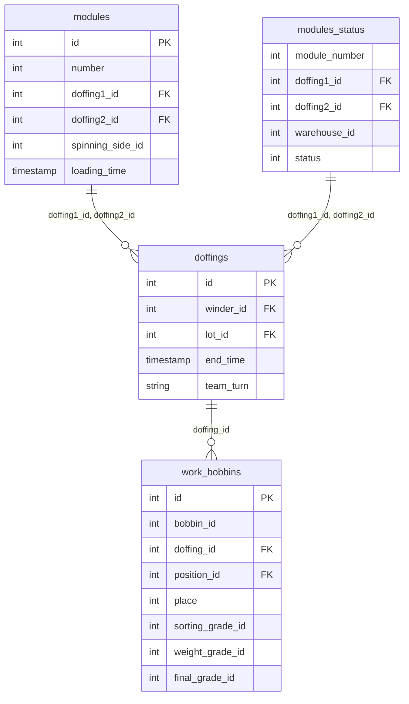

FDY 查询丝锭时，需要通过双 doffing ID 进行多路 JOIN：

```sql
-- FDY 典型查询模式
WHERE wb.doffing_id = ms.doffing1_id OR wb.doffing_id = ms.doffing2_id

-- FDY 查找最新模组
SELECT MAX(id) AS id, number FROM modules GROUP BY number
```

### 3.2 DTY 的 Module 直连模型

DTY 版本将 `module_id` 直接嵌入 `work_bobbins` 表，消除了通过 doffing 的间接查找：

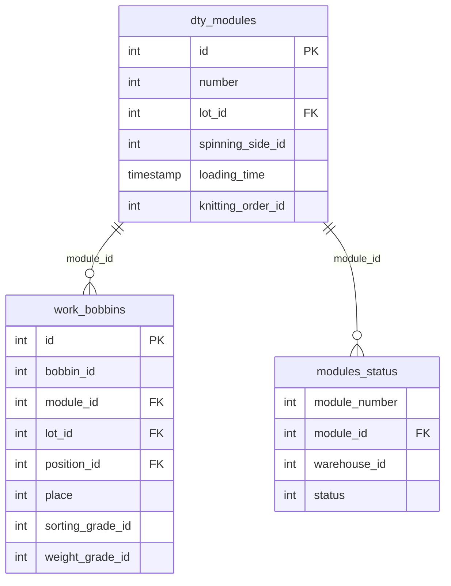

DTY 查询模式简化为：

```sql
-- DTY 典型查询模式
WHERE wb.module_id = ?

-- DTY 直接关联
LEFT JOIN dty_modules AS dm ON dm.id = wb.module_id
```

### 3.3 架构变更影响对比

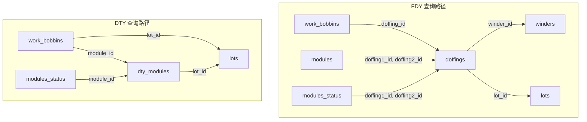

**关键对比：**

| 维度 | FDY | DTY |
|------|-----|-----|
| 丝锭→模组查找 | 通过 doffing 间接关联 | module_id 直连 |
| 丝锭→批次查找 | doffing → lot_id | work_bobbins.lot_id 直连 |
| 模组唯一性 | MAX(id) GROUP BY number | dty_modules.id 唯一 |
| 模组→丝锭 | OR 双 doffing_id 查询 | 单 module_id 查询 |
| 批次过滤 | `l.type = 'fdy'` | 无类型过滤 |
| 每模组位置数 | 24 | 96 |
| 模组表 | modules | dty_modules |

### 3.4 位置数变更的含义

FDY 每模组 24 个丝锭位置，DTY 每模组 96 个位置。这反映了 DTY（拉伸变形丝）工艺中模组的物理尺寸差异——DTY 模组承载的丝锭数量是 FDY 的 4 倍。

**源码证据：**

```javascript
// FDY modules.js 查询层
for (let i = 0; i < 24; i++) {
    sql += `UPDATE work_bobbins SET ... WHERE (doffing_id = ? OR doffing_id = ?) AND place = ?;`;
}

// DTY dtyModules.js 查询层
for (let i = 0; i < 96; i++) {
    sql += `UPDATE work_bobbins SET ... WHERE module_id = ? AND place = ?;`;
}
```

---

## 4. DTY 专有模块：dtyModules 完整分析

DTY 变体新增的 dtyModules 是最核心的差异模块，提供 16 个 API 端点，涵盖模组全生命周期管理。

### 4.1 路由定义（routes/dtyModules.js）

| HTTP 方法 | 路径 | 控制器方法 | 功能 |
|-----------|------|-----------|------|
| GET | `/currents/` | getAllCurrentsModules | 获取所有当前模组 |
| GET | `/currents/:moduleNumber` | getCurrentModule | 获取指定当前模组 |
| GET | `/currents/:moduleNumber/bobbins` | getCurrentModuleBobbins | 获取当前模组丝锭 |
| GET | `/history` | getAllModules | 获取模组历史 |
| GET | `/printed` | getAllPrintedModules | 获取已打印模组 |
| GET | `/history/:number` | getModuleHistory | 获取指定模组历史 |
| GET | `/spinning-hourly-production` | getSpinningModulesHourlyProduction | 纺丝每小时产量 |
| GET | `/sorting-hourly-production` | getSortingModulesHourlyProduction | 分拣每小时产量 |
| GET | `/tracking` | getAllTrackingRecords | 获取追踪记录 |
| POST | `/print` | printModule | 打印模组标签 |
| POST | `/tracking` | createTrackingRecord | 创建追踪记录 |
| GET | `/modules-in-warehouse` | getModulesInWarehouse | 仓库内模组查询 |
| PUT | `/reprint-update/:moduleId` | updateModuleReprint | 更新重打印时间 |
| PUT | `/grade` | updateModuleGrade | 批量更新模组等级 |
| PUT | `/single-grade` | updateSingleModuleGrade | 单个模组等级更新 |
| POST | `/palletizer-last-modules` | insertPalletizerModule | 码垛机模组记录 |
| GET | `/palletizer-last-modules/:palletizerId` | getPalletizerLastModules | 码垛机最近模组 |
| POST | `/create-placeholder-doffing` | createPlaceholderDoffing | 创建占位落筒 |
| GET | `/:moduleNumber/get-module-data` | getModuleData | 获取模组 PLC 数据 |
| GET | `/bobbins-weights` | getModulesBobbinsWeights | 模组丝锭重量 |

### 4.2 模组等级更新流程

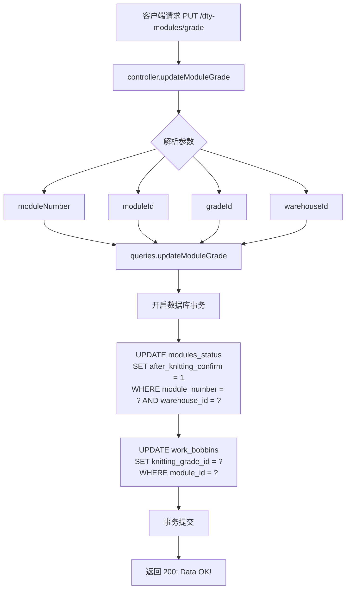

### 4.3 单模组等级更新流程（96 位置循环）

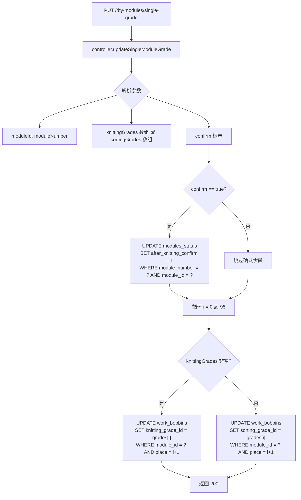

### 4.4 模组打印流程

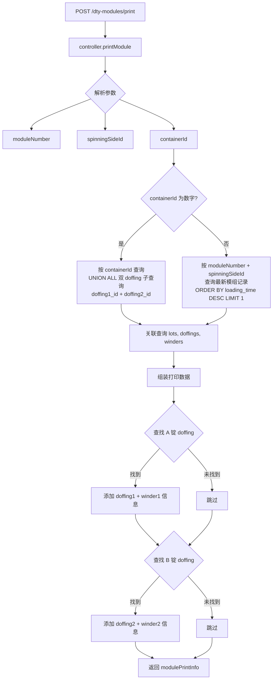

### 4.5 仓库模组查询与等级聚合

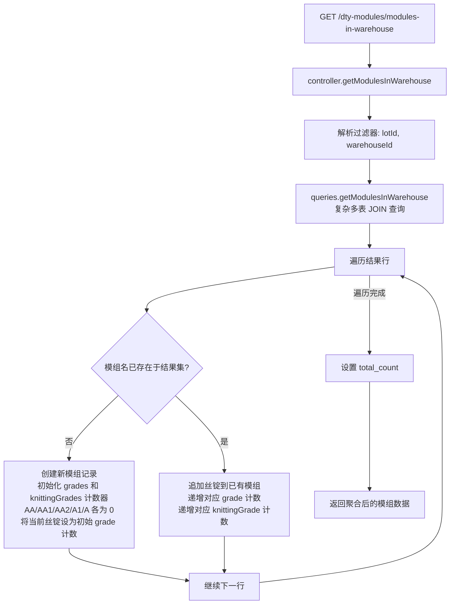

### 4.6 单轨追踪记录流程

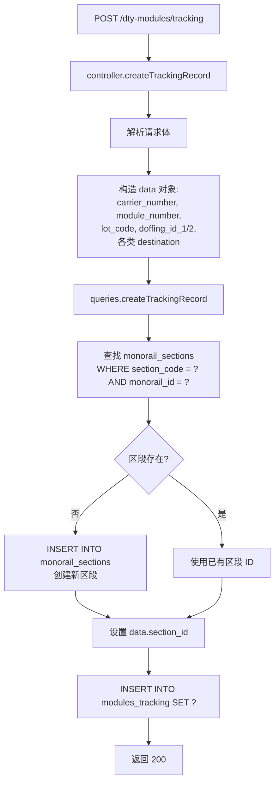

### 4.7 模组丝锭重量查询数据流

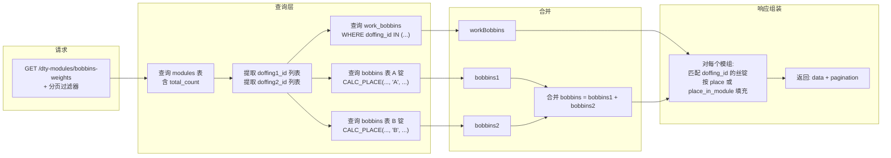

### 4.8 码垛机模组监控

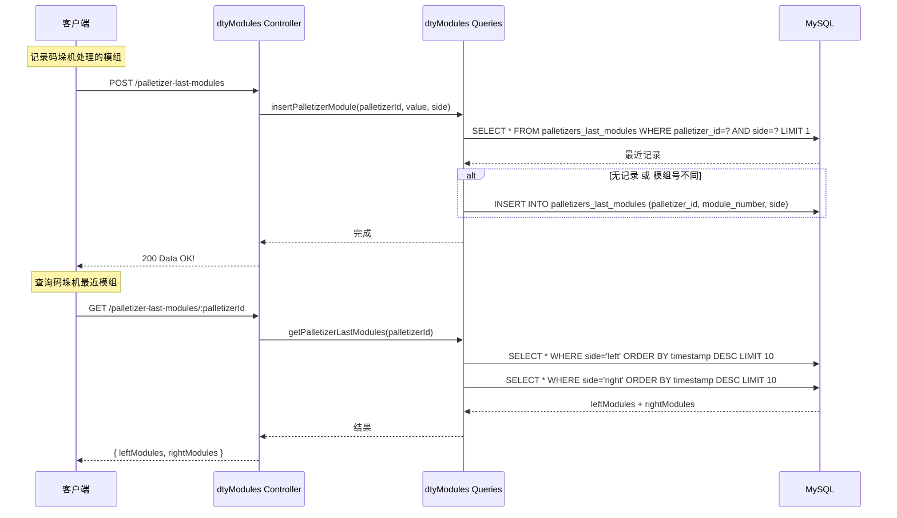

---

## 5. FDY 专有模块：dtyBobbins 与 dtyWorkBobbins

### 5.1 dtyBobbins（空壳模块）

FDY 版本中 `dtyBobbins` 的控制器、查询和路由均为空壳：

```javascript
// controllers/dtyBobbins.js
module.exports = {};

// queries/dtyBobbins.js
module.exports = {};

// routes/dtyBobbins.js
const router = express.Router();
module.exports = router; // 无任何端点
```

这是一个预留但未实现的模块占位符。

### 5.2 dtyWorkBobbins（FDY 专有，DTY 已移除）

#### 路由定义

| HTTP 方法 | 路径 | 功能 |
|-----------|------|------|
| GET | `/` | 获取所有 DTY 工作丝锭 |
| GET | `/:bobbinId` | 获取单个丝锭详情 |
| POST | `/loadingBobbins` | 更新装载丝锭 |

#### 关键特征

1. **查询独立表 `dty_work_bobbins`**：FDY 有独立的 DTY 工作丝锭表
2. **调用存储过程 `load_dty_bobbins`**：用于丝锭装载
3. **数据模型包含 `winder` 关联**：通过 doffing 获取卷绕机信息
4. **包含完整的等级体系**：sorting/weight/final/vision/knitting 五级评分

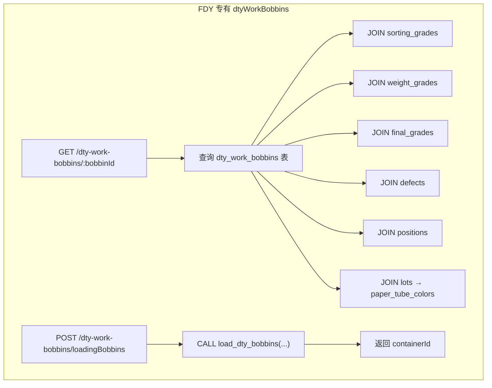

**DTY 变体中此模块被移除的原因**：DTY 版本将 `dty_work_bobbins` 表的功能合并到了 `work_bobbins` 表中，通过 `module_id` 外键直接关联，不再需要独立的 DTY 工作丝锭表。

---

## 6. 共通模块差异点分析

### 6.1 workBobbins 工作丝锭模块

这是差异最大的共享模块，DTY 版本进行了数据模型重构和功能扩展。

#### 6.1.1 getAllBobbins 数据模型变更

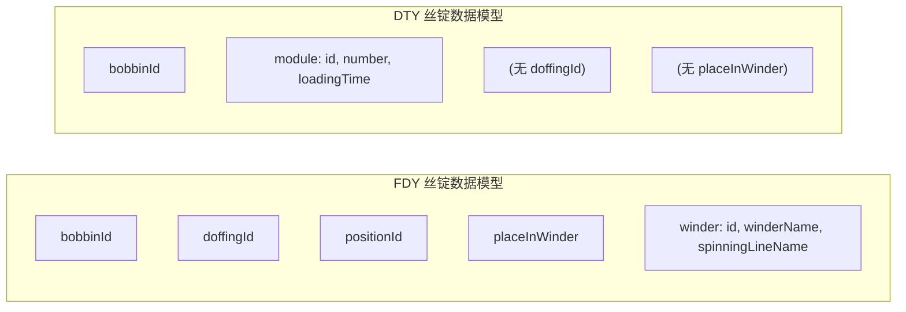

**FDY** 通过 doffing 获取 winder 信息；**DTY** 直接获取 module 信息，移除了 doffing 和 winder 的关联。

**FDY SQL 关联路径：**
```sql
LEFT JOIN winders AS w ON w.id = (SELECT winder_id FROM doffings WHERE id = wb.doffing_id)
LEFT JOIN lots AS l ON l.id = (SELECT lot_id FROM doffings WHERE id = wb.doffing_id)
```

**DTY SQL 关联路径：**
```sql
LEFT JOIN lots AS l ON l.id = wb.lot_id
LEFT JOIN dty_modules AS dm ON dm.id = wb.module_id
```

#### 6.1.2 DTY 新增端点：getFullBobbinsOnModule

DTY 新增了 `GET /work-bobbins/all` 端点，使用 **UNION ALL** 同时查询 `work_bobbins` 和 `bobbins` 两张表：

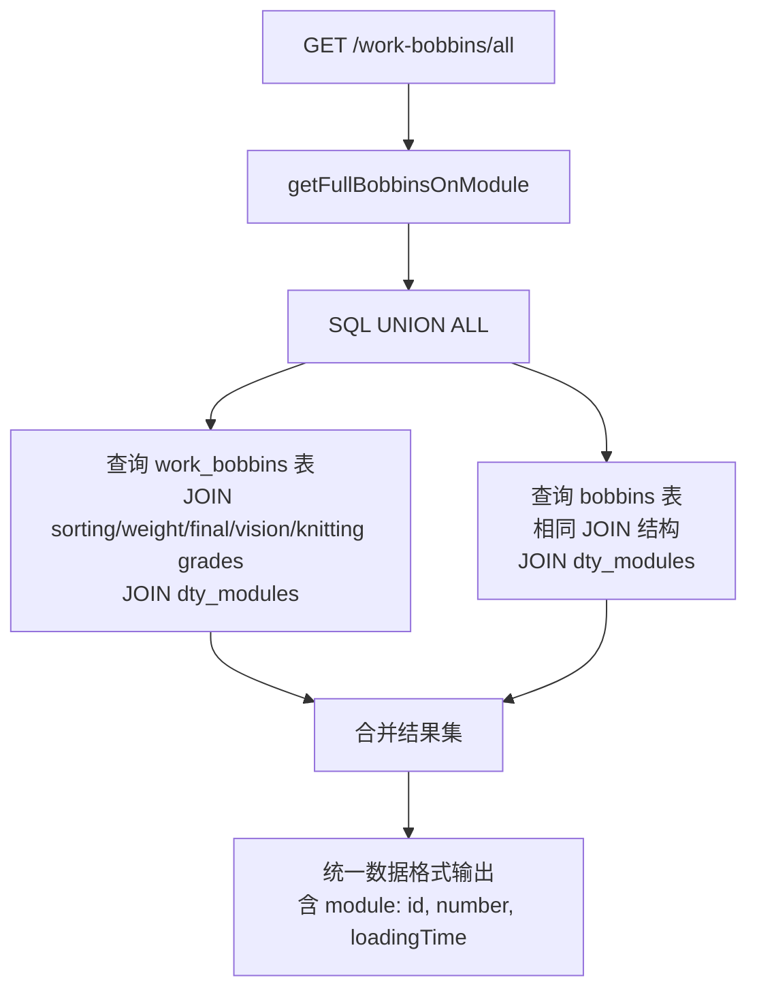

#### 6.1.3 updateLoadingBobbin 存储过程变更

```
FDY: CALL load_bobbins(...)
DTY: CALL load_dty_bobbins(...)
```

#### 6.1.4 updateAfterScales 参数变更

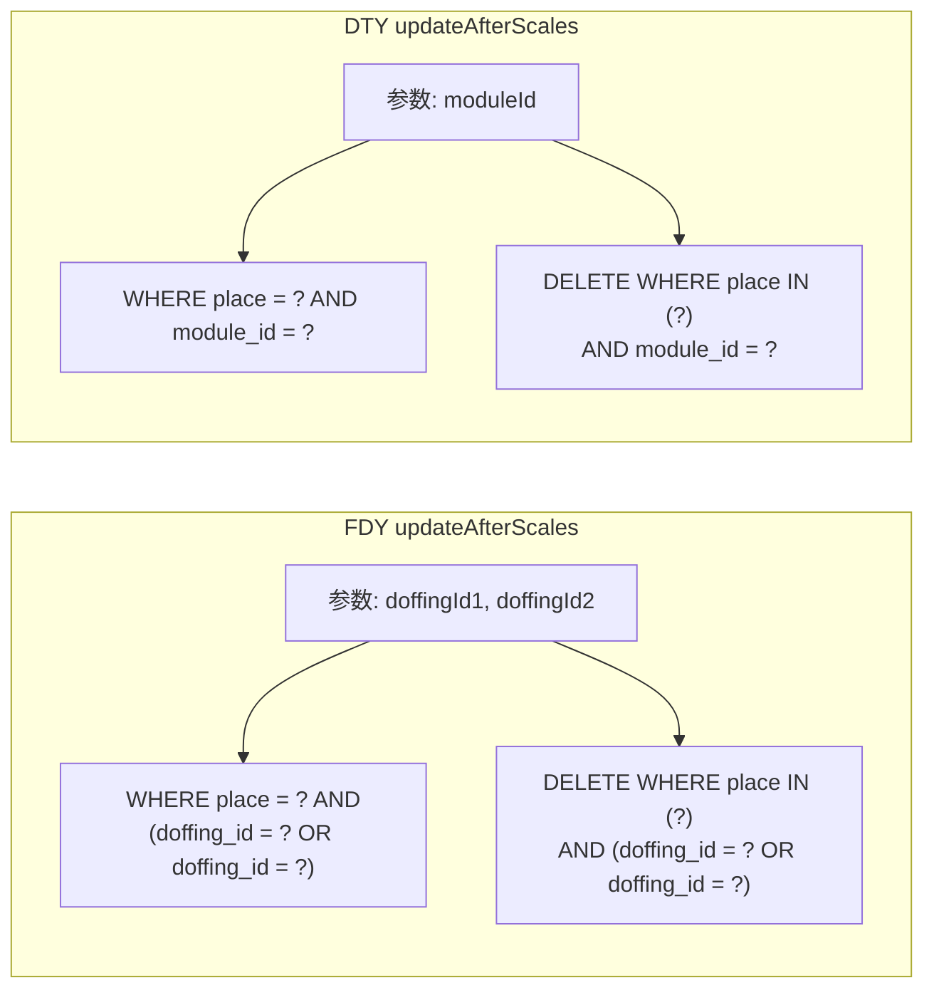

#### 6.1.5 updateAfterWeighting 参数变更

**FDY：** 使用 `(doffing_id = ? OR doffing_id = ?)` 双条件

**DTY：** 使用 `module_id = ?` 单条件

另一个关键差异：FDY 的循环中 `results[0]` 在每次迭代中使用相同值（可能是 bug），DTY 正确使用 `results[i]`。

### 6.2 modules 模组管理模块

#### 6.2.1 updateModuleGrade 查询变更

**FDY：** 使用子查询从 modules 表获取 doffing IDs
```sql
UPDATE work_bobbins SET knitting_grade_id = ? WHERE doffing_id IN (
    SELECT doffing1_id FROM modules WHERE id = ?
    UNION
    SELECT doffing2_id FROM modules WHERE id = ?
)
```

**DTY：** 直接使用 module_id
```sql
UPDATE work_bobbins SET knitting_grade_id = ? WHERE module_id = ?
```

#### 6.2.2 updateSingleModuleGrade 签名和逻辑变更

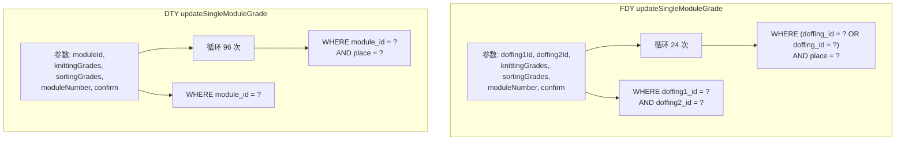

#### 6.2.3 getModulesInWarehouse 查询变更

| 变更点 | FDY | DTY |
|--------|-----|-----|
| 丝锭→批次 | `doffings → lots` | `work_bobbins.lot_id → lots` |
| 模组状态关联 | `modules_status.doffing1_id OR doffing2_id` | `modules_status.module_id` |
| 等级初始化 | AA/AA1/AA2/A1/A | AAA/AA/AA1/AA2/A1/A (新增 AAA) |
| 模组标识 | doffing1Id/doffing2Id | moduleId |
| 创建日期 | `d.created` (from doffings) | 已移除 |
| 卷绕机信息 | `w.winder_name, w.spinning_line_name` | 已移除 |

### 6.3 modulesStatus 模组状态模块

#### 6.3.1 查询层重构

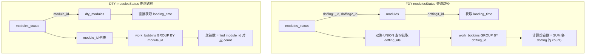

**FDY 计算丝锭数：**
```javascript
// 合并多个 doffing 的丝锭计数
const moduleBobbins = bobbins.filter(o => o.doffing_id == m.doffing1_id || o.doffing_id == m.doffing2_id);
const bobbinsCount = moduleBobbins.reduce((acc, curr) => {
    acc += curr.number_of_bobbins;
    return acc;
}, 0);
```

**DTY 计算丝锭数：**
```javascript
// 直接按 module_id 查找
let moduleBobbins = bobbins.find(o => o.module_id === m.module_id);
const bobbinsCount = moduleBobbins ? moduleBobbins.number_of_bobbins : 0;
```

#### 6.3.2 编织订单关联查询重构

FDY 使用三层 CTE（Common Table Expressions）来关联模组与编织订单：

```sql
-- FDY: 三层 CTE
WITH t AS (
    SELECT m.number, id AS module_id, knitting_order_id
    FROM modules m JOIN (SELECT number, MAX(id) FROM modules GROUP BY number) ...
), t1 AS (
    SELECT ... FROM modules_status LEFT JOIN t ON t.number = ms.module_number ...
    WHERE l.type = 'fdy' AND ms.status = 2
), t2 AS (
    SELECT knitting_order_id, id AS t2_module_id FROM modules WHERE id IN (SELECT t.module_id FROM t)
)
SELECT ... FROM t1 LEFT JOIN t LEFT JOIN t2 LEFT JOIN knitting_orders ...
```

DTY 简化为单层 CTE：

```sql
-- DTY: 单层 CTE
WITH t AS (
    SELECT ... FROM modules_status
    LEFT JOIN dty_modules AS mo ON mo.id = ms.module_id
    WHERE ms.status = 2
)
SELECT ... FROM t LEFT JOIN knitting_orders AS ko ON ko.id = t.knitting_order_id
```

#### 6.3.3 模组状态数据模型差异

| 字段 | FDY | DTY |
|------|-----|-----|
| moduleId | 无 | 有 |
| doffing1Id | 有 | 无 |
| doffing2Id | 有 | 无 |
| knittingLocked | 有（位置1） | 有（位置2） |
| loadingTime | 有 | 通过 timestamp 替代 |
| doffingCreationDate | 有 | 无 |

### 6.4 dtyOrders DTY 订单模块

#### 6.4.1 订单列表查询变更

DTY 新增了栈板数量的实际计算：

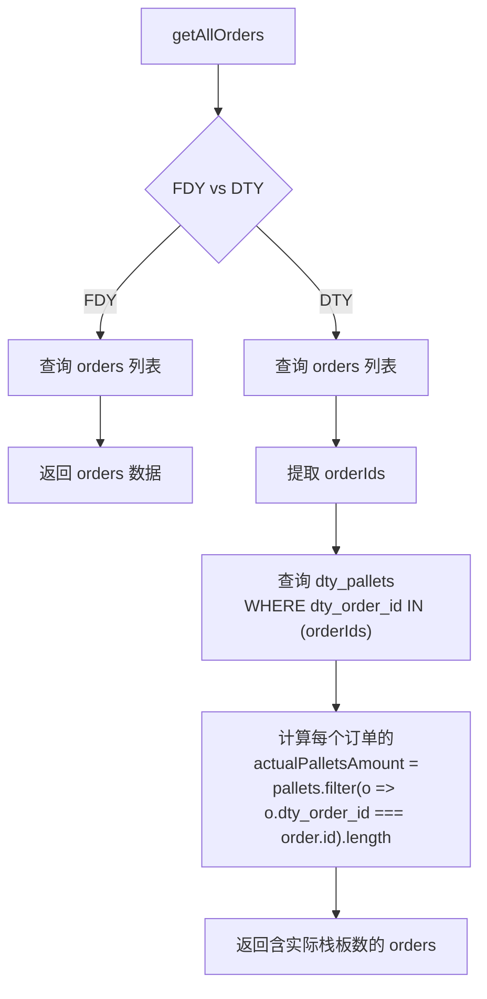

DTY 版本额外返回以下字段：
- `actualPalletsAmount`：实际栈板数量
- `defaultPalletLevel`：默认栈板层数
- `defaultDestination`：默认目的地

#### 6.4.2 等级名称体系变更

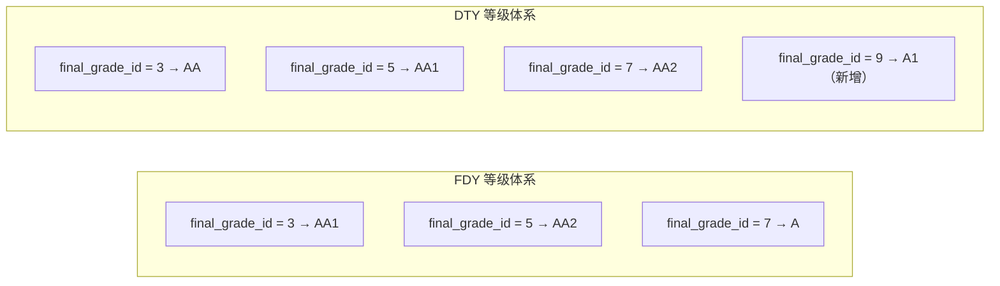

这反映了 DTY 工艺有不同的质量等级划分体系。

#### 6.4.3 每栈板丝锭数变更

```
FDY: minimum_pallets * default_pallet_level * 9   = 最少丝锭数
DTY: minimum_pallets * default_pallet_level * 30  = 最少丝锭数
```

每层从 9 个丝锭增加到 30 个，反映 DTY 丝锭尺寸更小、每层可放更多。

#### 6.4.4 表名和列名变更

| FDY | DTY |
|-----|-----|
| `packing_order_id` | `dty_packing_order_id` |
| `module_id` | `dty_module_id` |
| `packing_orders_modules` | `dty_packing_orders_modules` |
| `dty_work_bobbins` | `work_bobbins` |

#### 6.4.5 模组查找方式

```
FDY: SELECT * FROM dty_modules WHERE number = ? ORDER BY id DESC LIMIT 1
     → 然后用返回的 moduleId
DTY: 直接使用客户端传入的 moduleId
```

#### 6.4.6 新增端点

**confirmModuleOnPacking**（DTY 独有）：

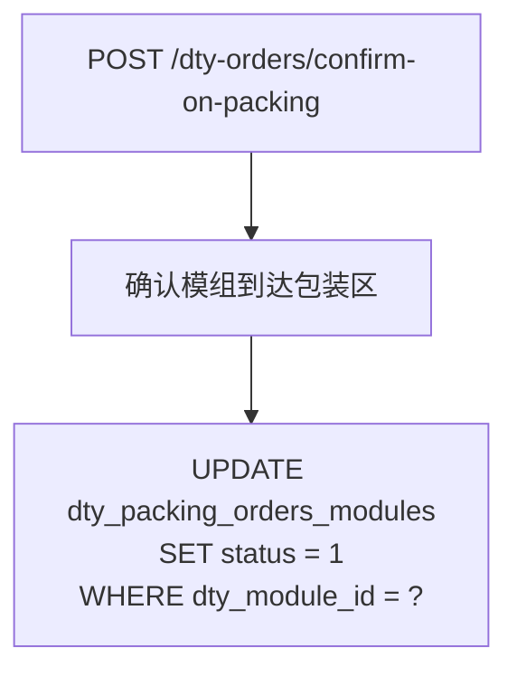

**createOrderFromBox**（DTY 独有）：

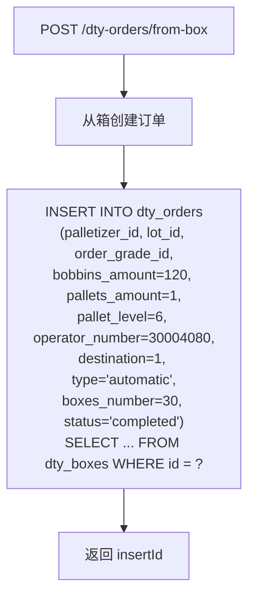

#### 6.4.7 包装模组查询数据流

```mermaid
flowchart TD
    A["getModulesOnPacking"] --> B["查询包装区模组列表"]

    subgraph FDY_Path ["FDY 数据关联路径"]
        C1["dty_modules<br/>INNER JOIN (MAX id GROUP BY number)"]
        C1 --> D1["LEFT JOIN modules_status<br/>ON m.number = ms.module_number"]
        D1 --> E1["work_bobbins 过滤:<br/>doffing_id = doffing1_id<br/>OR doffing_id = doffing2_id"]
    end

    subgraph DTY_Path ["DTY 数据关联路径"]
        C2["dty_modules"]
        C2 --> D2["LEFT JOIN modules_status<br/>ON m.id = ms.module_id"]
        D2 --> E2["work_bobbins 过滤:<br/>module_id = o.module_id"]
    end

    B --> FDY_Path
    B --> DTY_Path
```

### 6.5 dtyBoxes DTY 箱管理模块

#### 6.5.1 净重计算公式变更

```mermaid
flowchart LR
    subgraph FDY_Weight ["FDY 净重公式"]
        A1["net_weight = weight - box_weight"]
        B1["box_weight 来自 lots 表"]
    end

    subgraph DTY_Weight ["DTY 净重公式"]
        A2["net_weight = weight - (tube_weight * bobbins_amount) - box_weight"]
        B2["tube_weight 来自 lots 表（原 box_weight 字段）"]
        C2["box_weight 来自 settings 表<br/>WHERE name = 'boxWeight'"]
    end
```

**DTY 拆分了"箱重"概念：**
- `tube_weight`（纸管重量）= lots 表的 box_weight 字段 * 丝锭数量
- `box_weight`（箱体自重）= settings 表的 boxWeight 配置值

#### 6.5.2 箱丝锭关联逻辑重写

**FDY 创建箱：**
```sql
UPDATE dty_bobbins SET dty_order_id = ? AND dty_box_id = ? WHERE id IN (...)
```

**DTY 创建箱：**
```sql
-- 1. 过滤掉无效 ID
const filtered = bobbinsIds.filter(o => o > 0);

-- 2. 更新 work_bobbins 的 place 为箱 ID
UPDATE work_bobbins SET place = ? WHERE bobbin_id IN (...)

-- 3. 插入 box_bobbins 关联表（带 UPSERT）
INSERT INTO box_bobbins (box_id, dty_bobbin_id) VALUES (?, ?), ...
ON DUPLICATE KEY UPDATE box_id = box_id

-- 4. 清理：删除已装箱的 work_bobbins
DELETE FROM work_bobbins WHERE place = ?
```

```mermaid
flowchart TD
    A["创建 DTY 箱"] --> B["过滤有效丝锭 ID<br/>(id &gt; 0)"]
    B --> C["UPDATE work_bobbins<br/>SET place = boxId<br/>WHERE bobbin_id IN (filtered)"]
    C --> D["INSERT INTO box_bobbins<br/>(box_id, dty_bobbin_id)<br/>ON DUPLICATE KEY UPDATE"]
    D --> E["DELETE FROM work_bobbins<br/>WHERE place = boxId"]
    E --> F["箱创建完成<br/>丝锭从工作区移出"]
```

#### 6.5.3 箱查询的批次关联变更

```
FDY: LEFT JOIN lots AS l ON l.id = do.lot_id  (通过订单获取批次)
DTY: LEFT JOIN lots AS l ON l.id = db.lot_id  (通过箱直接获取批次)
```

### 6.6 dtyPallets DTY 栈板模块

#### 6.6.1 新增 RFID 变更功能

DTY 新增了 `PUT /:palletId/rfid` 端点：

```mermaid
flowchart TD
    A["PUT /dty-pallets/:palletId/rfid"] --> B["controller.changeRfid"]
    B --> C["开启事务"]
    C --> D["UPDATE dty_pallets<br/>SET rfid = ?<br/>WHERE id = ?"]
    D --> E["INSERT INTO erp_dty_pallets<br/>(dty_pallet_id) VALUES (?)<br/>ON DUPLICATE KEY UPDATE sent_to_erp = 0"]
    E --> F["事务提交"]
    F --> G["返回 200"]
```

RFID 更新同时触发 ERP 同步标记重置（`sent_to_erp = 0`），确保下次 ERP 同步时更新该栈板数据。

#### 6.6.2 净重计算变更

与 dtyBoxes 一致，栈板净重计算也拆分了箱重和管重：

```
FDY: net_weight = weight - l.box_weight
DTY: net_weight = weight - (l.box_weight * db.bobbins_amount) - settings.boxWeight
```

### 6.7 knittingOrders 编织订单模块

#### 6.7.1 addModuleToOrder 模组查找变更

```mermaid
flowchart TD
    subgraph FDY_KO ["FDY 添加模组到编织订单"]
        A1["接收 moduleNumber"] --> B1["SELECT * FROM modules<br/>WHERE number = ?<br/>ORDER BY id DESC LIMIT 1"]
        B1 --> C1["获取 moduleId = rows[0].id"]
    end

    subgraph DTY_KO ["DTY 添加模组到编织订单"]
        A2["接收 moduleNumber + moduleId"] --> B2["直接使用传入的 moduleId"]
    end
```

**DTY 中重复编织的模组查找也有变更：**

```
FDY: SELECT * FROM modules WHERE number = ? ORDER BY id DESC LIMIT 1
DTY: SELECT * FROM modules_status WHERE module_number = ?
```

#### 6.7.2 过滤条件变更

```
FDY: AND l.type = 'fdy' — 仅限 FDY 类型批次
DTY: 无类型过滤 — 适用于所有批次类型
```

### 6.8 lots 批次模块

#### 6.8.1 新增字段 machineCode

DTY 在批次的增、改、查中新增了 `machine_code` 字段：

```javascript
// DTY 创建/更新批次
{
    machine_code: req.body.machineCode || null,
}

// DTY 查询结果
{
    machineCode: lot.machine_code,
}
```

#### 6.8.2 新增端点：getLotWeightsByModule

```mermaid
flowchart TD
    A["POST /lots/get-lot-weight-by-module"] --> B["controller.getLotWeightsByModule"]
    B --> C["queries.getLotWeightsByModule(moduleId)"]
    C --> D["SELECT * FROM lot_grades_ranges<br/>WHERE lot_id =<br/>(SELECT lot_id FROM dty_modules WHERE id = ?)"]
    D --> E{"有结果?"}
    E -->|是| F["返回 { lotId, weightGrades: [{weightGradeId, min, max}] }"]
    E -->|否| G["返回空对象"]
```

#### 6.8.3 在库批次丝锭统计变更

```
FDY: LEFT JOIN doffings AS d ON d.id = wb.doffing_id
     LEFT JOIN lots AS l ON l.id = d.lot_id
DTY: LEFT JOIN lots AS l ON l.id = wb.lot_id
```

DTY 利用 `work_bobbins` 上的直连 `lot_id`，不再需要通过 doffings 间接获取。

### 6.9 warehouses 仓库模块

#### 6.9.1 模组入库更新逻辑

```mermaid
flowchart TD
    subgraph FDY_WH ["FDY 仓库模组更新"]
        A1["参数: doffing1Id, doffing2Id"] --> B1["UPDATE modules_status<br/>SET lot_id = (SELECT lot_id<br/>FROM doffings WHERE id = doffing1Id),<br/>doffing1_id = ?, doffing2_id = ?"]
    end

    subgraph DTY_WH ["DTY 仓库模组更新"]
        A2["参数: moduleId"] --> B2["SELECT lot_id<br/>FROM dty_modules WHERE id = moduleId"]
        B2 --> C2["UPDATE modules_status<br/>SET lot_id = lotId,<br/>module_id = ?"]
    end
```

DTY 先查 `dty_modules` 获取 `lot_id`，再用明确值更新 `modules_status`，而 FDY 使用子查询内联获取。

### 6.10 其他模块微调

#### settings 设置模块

```
FDY: INSERT INTO settings SET ?          — 纯插入，重复键报错
DTY: INSERT INTO settings SET ?
     ON DUPLICATE KEY UPDATE value = values(value)  — UPSERT 模式
```

#### pallets ERP 集成

```
FDY: INSERT INTO erp_pallets (pallet_id)
DTY: INSERT INTO erp_pallets (dty_pallet_id)
```

字段名从 `pallet_id` 更改为 `dty_pallet_id`，表明 DTY 版本使用了独立的 ERP 栈板关联表或字段。

#### dtyWarehouseOrders 仓库订单

```
FDY: WHERE dwo.timestamp >= ? AND dwo.timestamp <= ?
DTY: WHERE dwom.timestamp >= ? AND dwom.timestamp <= ?
```

别名修正：从 `dwo`（主表）更正为 `dwom`（关联表），这可能是一个 bug 修复。

---

## 7. 数据库 Schema 差异推断

基于源码中的 SQL 语句，可以推断出以下数据库表结构差异：

### 7.1 DTY 新增/变更的表

| 表名 | 说明 |
|------|------|
| `dty_modules` | 替代 FDY 的 `modules` 表，增加 `lot_id`、`knitting_order_id` 直连字段 |
| `box_bobbins` | DTY 新增，箱与丝锭的关联表（box_id, dty_bobbin_id） |
| `erp_dty_pallets` | DTY 新增，DTY 栈板的 ERP 同步表 |

### 7.2 work_bobbins 表结构差异

| 字段 | FDY | DTY |
|------|-----|-----|
| doffing_id | 有（主要关联键） | 可能保留但不作为主关联 |
| module_id | 无 | 有（新增，主要关联键） |
| lot_id | 无 | 有（新增，直连批次） |
| plant_area_code | 无 | 有（区域代码标识） |

### 7.3 modules_status 表结构差异

| 字段 | FDY | DTY |
|------|-----|-----|
| doffing1_id | 有 | 可能保留但不作为主关联 |
| doffing2_id | 有 | 可能保留但不作为主关联 |
| module_id | 无 | 有（新增，主要关联键） |
| knitting_locked | 有 | 有（位置不同） |
| timestamp | 未使用 | 有（替代 loadingTime） |

### 7.4 dty_packing_orders_modules 表

| 字段 | FDY | DTY |
|------|-----|-----|
| packing_order_id | 有 | 无（改为 dty_packing_order_id） |
| module_id | 有 | 无（改为 dty_module_id） |
| dty_packing_order_id | 无 | 有 |
| dty_module_id | 无 | 有 |

### 7.5 lots 表新增字段

| 字段 | 说明 |
|------|------|
| machine_code | 机台代码，DTY 新增 |
| default_pallet_level | 默认栈板层数（查询中新增返回） |
| default_destination | 默认目的地（查询中新增返回） |

### 7.6 dty_pallets 表新增字段

| 字段 | 说明 |
|------|------|
| rfid | RFID 标签，DTY 新增 |

### 7.7 settings 表用途扩展

DTY 新增配置项 `boxWeight`（箱体自重），用于净重计算。

---

## 8. 问题发现与架构建议

### 8.1 已发现的代码问题

#### 问题 1：FDY updateAfterWeighting 的潜在 Bug

```javascript
// FDY workBobbins.js 查询层
for (let i = 0; i < 24; i++) {
    sql += `UPDATE ... SET weight_grade_id = ? WHERE ... AND place = ?;`;
    values.push(results[0], doffingId1, doffingId2, i + 1);
    //          ^^^^^^^^^^
    // 始终使用 results[0]，应为 results[i]
}

// DTY 已修正
values.push(results[i], moduleId, i + 1);
```

FDY 版本中，每个位置的重量等级都被设置为 `results[0]`（第一个结果），而不是对应位置的 `results[i]`。DTY 已修正此问题。

#### 问题 2：dtyModules 查询层的 SQL 语法错误

```sql
-- queries/dtyModules.js getModuleHistory 方法
LEFT JOIN doffings AS d1.ON d1.id = m.doffing1_id
--                    ^ 句号应为空格
LEFT JOIN winders AS w1.ON w1.id = d1.winder_id
--                    ^ 同上
```

JOIN 子句中表别名与 ON 关键字之间有错误的句点（`.`），这会导致 SQL 执行失败。

#### 问题 3：变量重声明 (dtyModules createPlaceholderDoffing)

```javascript
// 查询层 createPlaceholderDoffing
if (error.code === 'ER_DUP_ENTRY') {
    let matches = error.message.match(...);
    let error = new DuplicateError(...); // 重声明 error 变量
    throw error;
}
```

在 catch 块中重新声明了 `error` 变量，在严格模式下可能导致引用错误。FDY 的 `dtyWorkBobbins` 中也存在完全相同的问题。

#### 问题 4：dtyPallets changeRfid 中引用未定义变量

```javascript
// controllers/dtyPallets.js
async changeRfid(req, res, next) {
    try {
        // ...
    } catch (error) {
        return res.status(status).json(error);
        //                  ^^^^^^ status 未定义，应为 500
    }
}
```

### 8.2 架构差异评估

| 维度 | FDY | DTY | 评估 |
|------|-----|-----|------|
| 数据模型复杂度 | 高（双 doffing 间接关联） | 低（module_id 直连） | DTY 更优 |
| 查询性能 | 子查询+UNION+MAX GROUP BY | 直接 JOIN | DTY 更优 |
| 代码可维护性 | 复杂的双条件 OR 查询 | 简洁的单条件查询 | DTY 更优 |
| 功能完整性 | dtyBobbins 为空壳 | dtyModules 功能完整 | DTY 更优 |
| 净重计算精度 | 简单的 weight - box_weight | 区分管重*数量+箱体自重 | DTY 更精确 |
| RFID 支持 | 无 | 有 | DTY 新增 |
| ERP 集成 | erp_pallets | erp_dty_pallets | 各自适配 |
| 等级体系 | 3 级 | 4 级（新增 AAA/A1） | DTY 更细分 |

### 8.3 架构建议

1. **SQL 语法修复**：dtyModules 的 `getModuleHistory` 中的 JOIN 句点错误需要立即修复。

2. **变量重声明修复**：`createPlaceholderDoffing` 中的 error 重声明问题应修复，建议使用 `const dupError = new DuplicateError(...)` 避免冲突。

3. **changeRfid 错误处理**：`status` 变量未定义，需要添加 `let status = 500` 或直接使用 `res.status(500)`。

4. **建议统一表命名**：DTY 版本中 `dty_packing_orders_modules` 的列名前缀 `dty_` 与 FDY 版本的 `packing_order_id` 不一致，建议制定统一的命名规范。

5. **净重公式文档化**：DTY 的净重计算涉及三个来源（毛重、管重*数量、箱体自重），建议在代码注释或文档中明确公式。

6. **FDY 反向移植**：FDY 的 `updateAfterWeighting` 中 `results[0]` 的 bug（如果确认是 bug）应该反向修复到 FDY 版本。
