# 08 - O17003 纺纱变体深度源码分析

> 基于纯源码逐行解读，对比 O17003 FDY 主版本与纺纱(spinnings)变体的差异。
> 主版本路径: `Hive/DataBase/Programmi/O17003/resources/extracted_app/`
> 纺纱变体路径: `Hive/O17003_spinnings/extracted_app/`

---

## 目录

- [1. 版本概览与文件差异统计](#1-版本概览与文件差异统计)
- [2. 配置与入口差异分析](#2-配置与入口差异分析)
- [3. 主版本独有模块分析](#3-主版本独有模块分析)
  - [3.1 DTY 主数据模块](#31-dty-主数据模块)
  - [3.2 DTY 仓库订单模块](#32-dty-仓库订单模块)
  - [3.3 DTY 工作丝饼模块](#33-dty-工作丝饼模块)
  - [3.4 通知模块](#34-通知模块)
- [4. 共通模块差异点分析](#4-共通模块差异点分析)
  - [4.1 批次管理 (lots)](#41-批次管理-lots)
  - [4.2 DTY 箱管理 (dtyBoxes)](#42-dty-箱管理-dtyboxes)
  - [4.3 DTY 订单 (dtyOrders)](#43-dty-订单-dtyorders)
  - [4.4 DTY 托盘 (dtyPallets)](#44-dty-托盘-dtypallets)
  - [4.5 订单与打包 (orders)](#45-订单与打包-orders)
  - [4.6 模组状态 (modulesStatus)](#46-模组状态-modulesstatus)
  - [4.7 仓库管理 (warehouses)](#47-仓库管理-warehouses)
  - [4.8 工作丝饼 (workBobbins)](#48-工作丝饼-workbobbins)
  - [4.9 针织订单 (knittingOrders)](#49-针织订单-knittingorders)
  - [4.10 模组与托盘等次要差异](#410-模组与托盘等次要差异)
- [5. 数据库表结构差异推断](#5-数据库表结构差异推断)
- [6. 问题发现与架构建议](#6-问题发现与架构建议)

---

## 1. 版本概览与文件差异统计

### 1.1 版本信息

| 属性 | 纺纱变体 (Spinnings) | 主版本 (Main/FDY) |
|------|----------------------|---------------------|
| 包名 | `net.hivetechnology.o17003` | `net.hivetechnology.o17003` |
| 版本 | **2.0.10** | **2.0.34** |
| 依赖 | 完全一致 | 完全一致 |
| 默认端口 | 8082 | 8082 |
| SQL存储过程 | 完全一致 | 完全一致 |

### 1.2 文件清单统计

| 类别 | 纺纱变体 | 主版本 | 差异 |
|------|---------|--------|------|
| 总源码文件数 | 169 | 181 | +12 |
| 控制器 (controllers) | 55 | **59** | +4 |
| 查询 (queries) | 55 | **59** | +4 |
| 路由 (routes) | 55 | **59** | +4 |
| SQL存储过程 | 7 | 7 | 0 |
| 共有但内容不同的文件 | — | — | **35** |

### 1.3 仅主版本存在的文件（12个）

```
src/controllers/dty.js                    # DTY 主数据控制器
src/controllers/dtyWarehouseOrders.js     # DTY 仓库订单控制器
src/controllers/dtyWorkBobbins.js         # DTY 工作丝饼控制器
src/controllers/notifications.js          # 通知控制器
src/queries/dty.js                        # DTY 主数据查询
src/queries/dtyWarehouseOrders.js         # DTY 仓库订单查询
src/queries/dtyWorkBobbins.js             # DTY 工作丝饼查询
src/queries/notifications.js              # 通知查询
src/routes/dty.js                         # DTY 主数据路由
src/routes/dtyWarehouseOrders.js          # DTY 仓库订单路由
src/routes/dtyWorkBobbins.js              # DTY 工作丝饼路由 (含 load_dty_bobbins 存储过程)
src/routes/notifications.js               # 通知路由
```

仅纺纱变体存在的文件: **0** (纺纱变体是主版本的严格子集)

### 1.4 共有但内容不同的文件（35个）

**控制器层（12个）:**
`doffings`, `dtyBoxes`, `dtyOrders`, `dtyPallets`, `knittingOrders`, `lots`, `modules`, `modulesStatus`, `orders`, `pallets`, `warehouses`, `workBobbins`

**查询层（13个）:**
`doffings`, `dtyBoxes`, `dtyOrders`, `dtyPallets`, `knittingOrders`, `lots`, `modules`, `modulesStatus`, `orders`, `pallets`, `preDefectBobbins`, `warehouses`, `workBobbins`

**路由层（9个）:**
`dtyBoxes`, `dtyOrders`, `knittingOrders`, `lots`, `modulesStatus`, `orders`, `pallets`, `warehouses`, `workBobbins`

**配置文件（1个）:** `package.json`

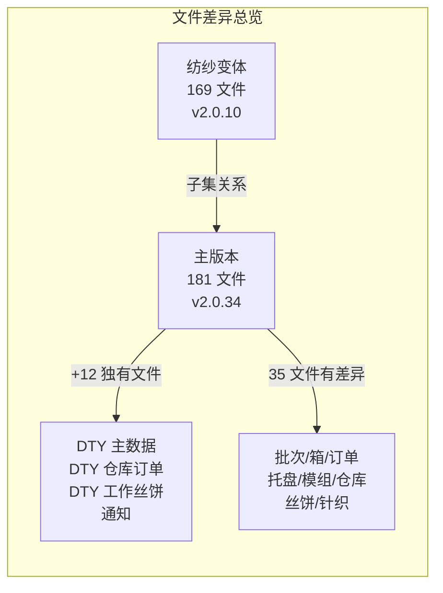

---

## 2. 配置与入口差异分析

### 2.1 应用入口 (O17003.js)

两版本在应用入口的差异集中在三个方面:

#### 差异 1: 路由注册

纺纱变体注册 **43** 个路由，主版本注册 **46** 个路由。主版本额外注册:

```javascript
// 仅主版本
express.use('/dty-warehouse-orders', dtyWarehouseOrdersRoute);
express.use('/dty', dtyRoute);
express.use('/notifications', notificationsRoute);
```

#### 差异 2: MySQL Binlog 监听器

**纺纱变体** - 仅监听 `lots` 表:
```javascript
// 配置: lotsBinServerId || 999
db.addWatcher(/* lots watcher */);
// WebSocket 连接时推送: lots, movements
```

**主版本** - 监听 `lots` + `notifications` 两张表:
```javascript
// lots 配置: lotsBinServerId || 999
db.addWatcher(/* lots watcher */);
// notifications 配置: notificationsBinServerId || 1000
db.addWatcher(/* notifications watcher */);  // 新增
// WebSocket 连接时推送: lots, notifications (移除了 movements)
```

#### 差异 3: 注释代码

纺纱变体保留了一段完整的 movements binlog 监听器注释代码（`serverId: 998`），主版本中该段已被移除。

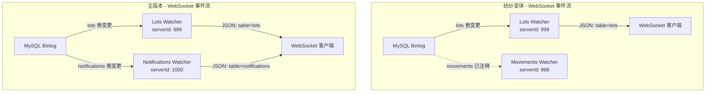

---

## 3. 主版本独有模块分析

### 3.1 DTY 主数据模块

**文件:** `controllers/dty.js`, `queries/dty.js`, `routes/dty.js`

功能极简，仅一个列表查询接口:

| HTTP | 路径 | 功能 | 查询表 |
|------|------|------|--------|
| GET | `/dty` | 获取所有 DTY 设备列表 | `dty` |

**查询 SQL:**
```sql
SELECT * FROM dty ${filtersQuery}
```

**数据流:** 请求 → 分页过滤 → 返回 `{id, name, code}` 列表。

### 3.2 DTY 仓库订单模块

**文件:** `controllers/dtyWarehouseOrders.js`, `queries/dtyWarehouseOrders.js`, `routes/dtyWarehouseOrders.js`

这是主版本新增的**核心业务模块**，管理从 FDY 仓库向 DTY 车间转移丝饼模组的订单流程。

#### API 路由

| HTTP | 路径 | 功能 |
|------|------|------|
| POST | `/dty-warehouse-orders/` | 创建 DTY 仓库订单 |
| GET | `/dty-warehouse-orders/` | 获取所有 DTY 仓库订单 |
| PUT | `/dty-warehouse-orders/add-module` | 添加模组到订单 |
| POST | `/dty-warehouse-orders/confirm` | 确认模组取走 |
| POST | `/dty-warehouse-orders/sync` | 同步订单状态 |
| PUT | `/dty-warehouse-orders/:id/close` | 关闭订单 |
| GET | `/dty-warehouse-orders/:id/sent` | 查看已发送模组 |
| POST | `/dty-warehouse-orders/get-modules-count-by-timestamp` | 按时间段统计模组转移数据 |

#### 核心业务逻辑

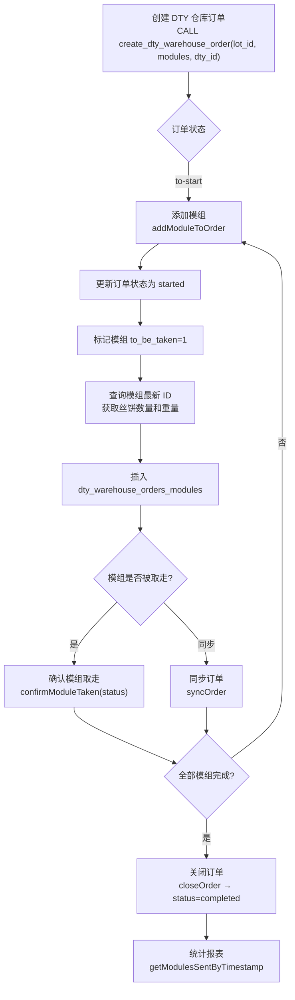

#### 关键查询分析

**addModuleToOrder** (事务操作):
1. 更新订单状态 → `started`
2. 标记模组状态 → `to_be_taken = 1`
3. 获取模组最新记录的丝饼信息 (仅 `final_grade_id = 1` 的A等品)
4. 计算丝饼总重量
5. 插入 `dty_warehouse_orders_modules` 记录

**getModulesSentByTimestamp** - 按时间段统计转移数据:
```sql
SELECT COUNT(*) AS number_of_modules,
       SUM(number_of_bobbins) AS number_of_bobbins,
       SUM(total_bobbins_weight) AS total_bobbins_weight
FROM dty_warehouse_orders_modules AS dwom
LEFT JOIN dty_warehouse_orders AS dwo ON dwo.id = dwom.dty_warehouse_order_id
LEFT JOIN lots AS l ON l.id = dwo.lot_id
LEFT JOIN paper_tube_colors AS ptc ON ptc.id = l.paper_tube_color_id
WHERE dwo.timestamp >= ? AND dwo.timestamp <= ? AND dwom.status = 1
GROUP BY dwo.lot_id
```

#### 数据流图

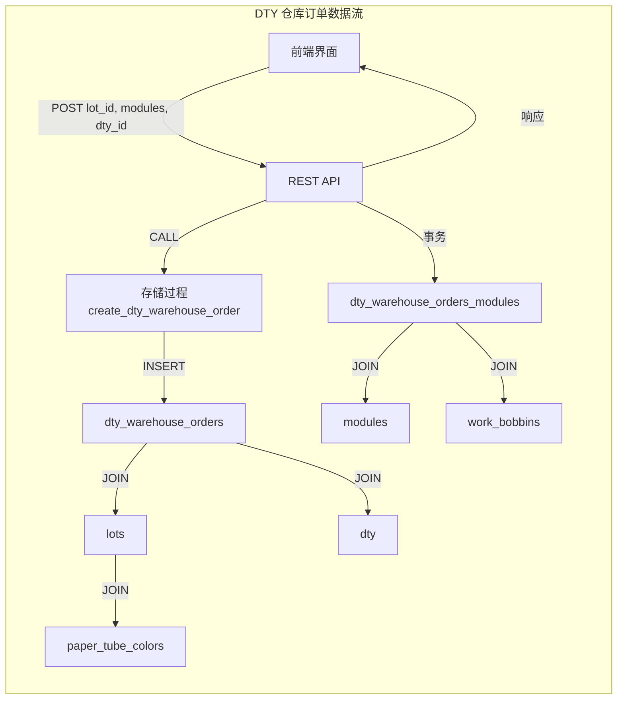

### 3.3 DTY 工作丝饼模块

**文件:** `controllers/dtyWorkBobbins.js`, `queries/dtyWorkBobbins.js`, `routes/dtyWorkBobbins.js`

管理 DTY 专用丝饼的查询和装载操作。

#### API 路由

| HTTP | 路径 | 功能 |
|------|------|------|
| GET | `/dty-work-bobbins/` | 获取所有 DTY 丝饼 |
| GET | `/dty-work-bobbins/:bobbinId` | 获取单个 DTY 丝饼详情 |
| POST | `/dty-work-bobbins/loadingBobbins` | 装载丝饼 (调用 `load_dty_bobbins` 存储过程) |

#### 关键技术细节

- 查询 `dty_work_bobbins` 表（非 `work_bobbins`）
- 装载操作调用 `CALL load_dty_bobbins(spinningSideId, id1, id2, number, containerType, sortingId, rfid)` 存储过程
- 丝饼详情包含完整的等级信息链: 分拣等级 → 重量等级 → 最终等级 → 视觉等级 → 针织等级

### 3.4 通知模块

**文件:** `controllers/notifications.js`, `queries/notifications.js`, `routes/notifications.js`

#### API 路由

| HTTP | 路径 | 功能 |
|------|------|------|
| GET | `/notifications/` | 获取所有通知（分页） |
| POST | `/notifications/` | 创建通知（幂等，ON DUPLICATE KEY） |
| PUT | `/notifications/:id` | 更新通知（acknowledge 等） |

#### WebSocket 实时推送

配合 O17003.js 中的 binlog watcher，当 `notifications` 表发生变更时，通过 WebSocket 向所有客户端推送 `{table: 'notifications'}` 事件，触发前端刷新。

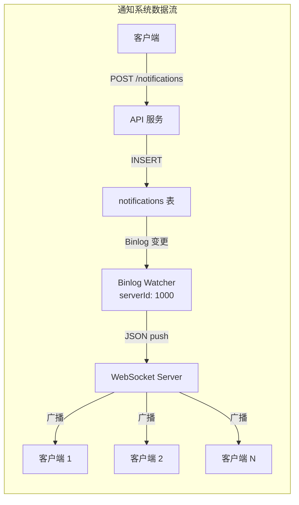

---

## 4. 共通模块差异点分析

### 4.1 批次管理 (lots)

**影响文件:** `controllers/lots.js`, `queries/lots.js`, `routes/lots.js`

这是差异最大的共通模块，主版本大幅扩展了批次的数据模型和操作。

#### 数据模型扩展

| 字段 | 纺纱变体 | 主版本 | 说明 |
|------|---------|--------|------|
| `pallet_size` | 1200 | — | 纺纱用固定托盘尺寸 |
| `default_pallet_level` | — | 9 | 每托盘默认层数 |
| `default_destination` | — | 1 | 默认目的地 |
| `default_pallet_size` | — | 1200 | 默认托盘尺寸（取代 pallet_size） |
| `minimum_pallets_for_order` | — | 1 | 订单最小托盘数 |
| `wait_time` | — | 16 (小时) | 针织前等待时间 |
| `twist` | — | '' | 捻度参数 |
| `box_weight` | — | 0 | 箱子空重（用于净重计算） |
| `order_code_aa1` | — | null | AA1 等级对应订单号 |
| `order_code_aa2` | — | null | AA2 等级对应订单号 |
| `order_code_a` | — | null | A 等级对应订单号 |
| `type` | — | 'fdy' | 批次类型: fdy/poy |
| `packing_lock` | — | 0 | 打包锁定状态 |
| `end_lot` | — | 0 | 批次结束标记 |

#### 主版本新增 API

| HTTP | 路径 | 功能 |
|------|------|------|
| GET | `/lots/total-current-data` | 获取当前批次汇总数据 |
| POST | `/lots/lock` | 锁定/解锁批次打包 |
| POST | `/lots/end` | 标记批次结束 |

#### 锁定/结束批次流程

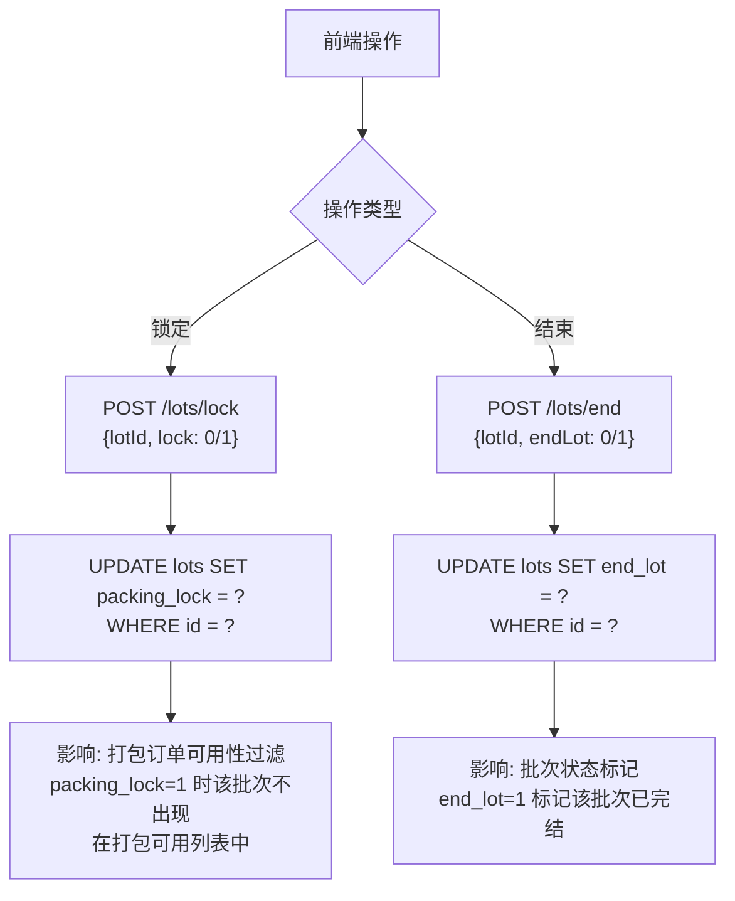

#### 当前数据汇总查询 (getTotalCurrentData)

主版本新增的 CTE 查询，统计当前模组上的丝饼分布:

```sql
WITH t AS (
    SELECT l.id AS lot_id, l.code AS lot_code, l.order_code,
        l.type AS lot_type, ptc.color1, ptc.color2,
        COUNT(*) AS total_bobbins,
        COUNT(DISTINCT p.id) AS total_modules
    FROM work_bobbins AS wb
    LEFT JOIN doffings AS d ON d.id = wb.doffing_id
    LEFT JOIN lots AS l ON l.id = d.lot_id
    LEFT JOIN paper_tube_colors AS ptc ON ptc.id = l.paper_tube_color_id
    LEFT JOIN positions AS p ON p.id = wb.position_id
    WHERE p.position_type_code = 'module'
    GROUP BY l.id
)
SELECT *, COUNT(*) OVER() AS total_count FROM t ${filtersQuery}
```

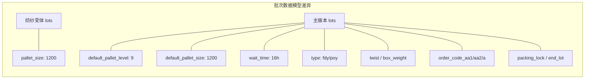

### 4.2 DTY 箱管理 (dtyBoxes)

**影响文件:** `controllers/dtyBoxes.js`, `queries/dtyBoxes.js`, `routes/dtyBoxes.js`

主版本对 DTY 箱模块进行了根本性重构。

#### 函数重命名与接口变更

| 变更项 | 纺纱变体 | 主版本 |
|--------|---------|--------|
| 创建函数名 | `createOrder` | `createBox` |
| 列表函数名 | `getAllOrders` | `getAllBoxes` |
| 创建参数 | `dtyOrderId, dtyBobbinsIds, boxOfOrder, bobbinsAmount` | + `orderGradeId, lotId, palletizerId` |
| INSERT 策略 | 简单 INSERT | `ON DUPLICATE KEY UPDATE id = LAST_INSERT_ID(id)` |
| 获取箱信息 | `req.body.boxId` (Body) | `req.params.id` (URL参数) |
| 箱号生成 | 无 | `GET_BOX_CODE(id)` 函数 |

#### 新增路由

| HTTP | 路径 | 功能 |
|------|------|------|
| PUT | `/dty-boxes/:id/weight` | 更新箱重量 |

#### 箱列表查询重构

**纺纱变体** - 基于 `dty_orders` 表:
```sql
SELECT o.*, ptz.*, l.*, ptc.*, og.*
FROM dty_orders AS o
LEFT JOIN palletizers / lots / paper_tube_colors / order_grades
```

**主版本** - 基于 `dty_boxes` 表，引入子查询和函数:
```sql
SELECT t.*, GET_BOX_CODE(t.id) AS box_code FROM (
    SELECT db.id, db.loading_time, db.labeling_time,
        db.weight AS gross_weight, db.weight - l.box_weight AS net_weight,
        og.*, ptc.*, l.order_code, l.specification_china, l.code AS lot_code
    FROM dty_boxes AS db
    LEFT JOIN dty_orders / order_grades / dty_pallets_boxes / lots / paper_tube_colors
) AS t
```

#### 获取箱标签信息重构

纺纱变体返回原始数据库字段，主版本返回结构化的业务对象:

```javascript
// 主版本响应结构
{
    order: { destination },
    lot: { specificationChina, specificationExport, code, lustre, twist,
           boxWeight, standardChina, standardExport },
    weight, code, bobbinsAmount, productDate,
    orderGrade: { name }
}
```

#### DTY 箱业务流程

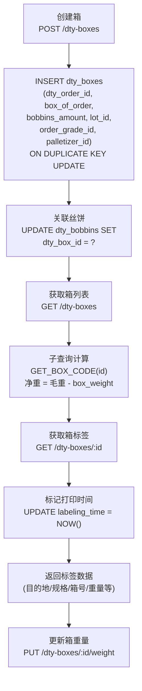

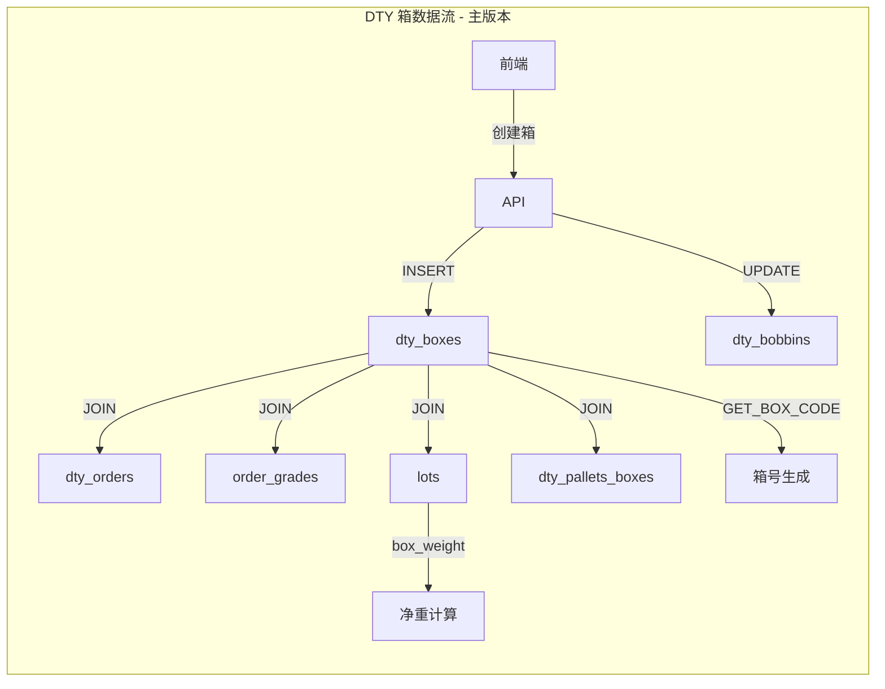

### 4.3 DTY 订单 (dtyOrders)

**影响文件:** `controllers/dtyOrders.js`, `queries/dtyOrders.js`, `routes/dtyOrders.js`

主版本在 DTY 订单模块新增了**完整的打包订单子系统**。

#### 数据库计算差异

**纺纱变体 - 更新托盘丝饼数:**
```sql
UPDATE dty_orders SET pallets_amount = pallets_amount + ?,
    bobbins_amount = bobbins_amount + (? * pallet_level * 5 * 6) WHERE id = ?
```

**主版本 - 更新托盘丝饼数:**
```sql
UPDATE dty_orders SET pallets_amount = pallets_amount + ?,
    bobbins_amount = bobbins_amount + (? * 4 * 6),
    boxes_amount = ? * 20 WHERE id = ?
```

**差异分析:**
- 纺纱: 使用 `pallet_level * 5 * 6`（动态层数 x 5 x 6）
- 主版本: 固定 `4 * 6`（4层 x 6 = 24 丝饼/托盘），新增 `boxes_amount = pallets * 20`

#### 主版本新增打包订单 API

| HTTP | 路径 | 功能 |
|------|------|------|
| PUT | `/dty-orders/update-order-module` | 更新打包订单模组 |
| GET | `/dty-orders/available/:palletizerId` | 获取打包订单可用批次 |
| POST | `/dty-orders/get-module-for-order` | 获取订单可用模组 |
| GET | `/dty-orders/:id/sent` | 查看已发送模组 |
| POST | `/dty-orders/confirm` | 确认模组取走 |
| POST | `/dty-orders/sync` | 同步订单状态 |
| PUT | `/dty-orders/:id/close` | 关闭订单 |
| POST | `/dty-orders/get-packing-order-modules` | 获取打包订单模组 |

#### DTY 打包订单完整流程

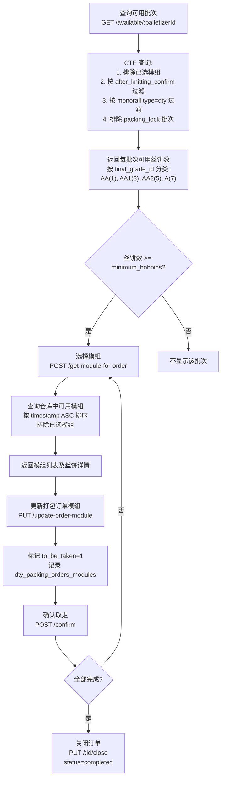

#### 打包可用性查询数据流

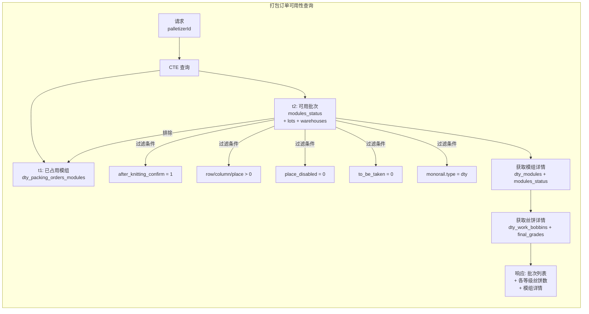

### 4.4 DTY 托盘 (dtyPallets)

**影响文件:** `controllers/dtyPallets.js`, `queries/dtyPallets.js`

#### 表名与字段重构

| 维度 | 纺纱变体 | 主版本 |
|------|---------|--------|
| 创建表 | `pallets` | `dty_pallets` |
| 更新表 | `pallets` | `dty_pallets` |
| 订单外键 | `order_id` | `dty_order_id` |
| RFID 默认值 | `''` (空串) | `null` |
| 箱关联 | 无 | `dty_pallets_boxes` 中间表 |
| 重复处理 | 无 | `ER_DUP_ENTRY` → 返回已存在 ID |
| 重量计算 | 无 | 从箱聚合 gross_weight / net_weight |

#### 创建托盘流程差异

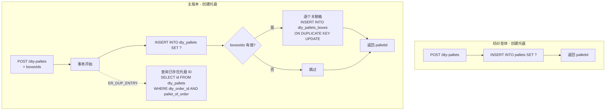

#### 列表查询重构

**纺纱变体** - 查 `pallets` + `orders`:
```sql
SELECT t.*, GET_PALLET_CODE(t.id) AS code FROM (
    SELECT p.*, o.*, l.*, ptc.*, og.*
    FROM pallets AS p LEFT JOIN orders AS o ON o.id = p.order_id ...
) AS t
```

**主版本** - 查 `dty_pallets` + `dty_orders`，额外查箱重量:
```sql
SELECT p.id AS pallet_id, ... FROM dty_pallets AS p
LEFT JOIN dty_orders AS o ON o.id = p.dty_order_id ...

-- 额外查询箱重量
SELECT weight AS gross_weight, weight - l.box_weight AS net_weight
FROM dty_pallets_boxes AS dpb
LEFT JOIN dty_pallets / dty_boxes / lots
WHERE dty_pallet_id IN (...)
```

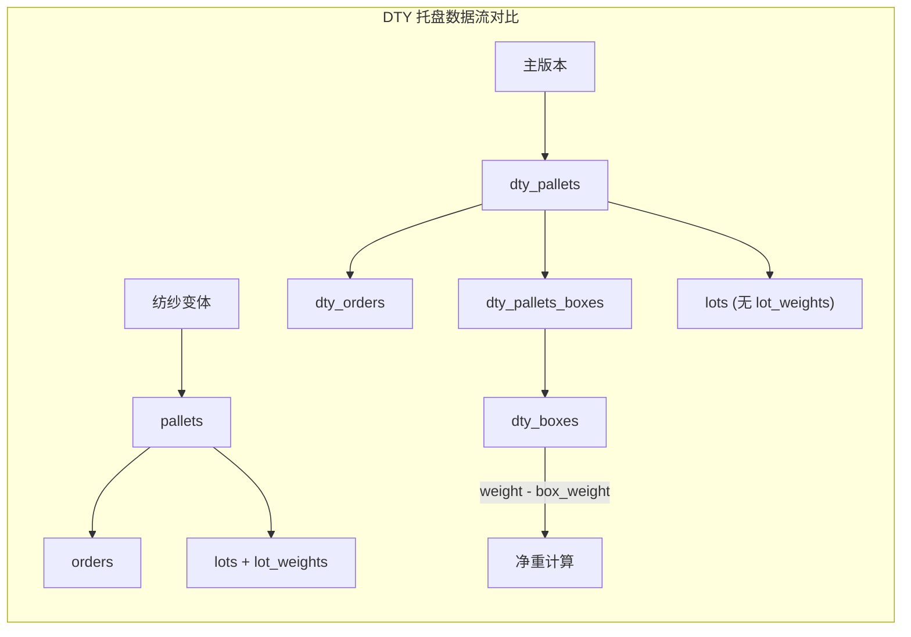

### 4.5 订单与打包 (orders)

**影响文件:** `controllers/orders.js`, `queries/orders.js`, `routes/orders.js`

#### 等级过滤扩展

**纺纱变体** - 仅按 A 等品（`final_grade_id = 1`）过滤:
```javascript
data = data.filter(o => o.bobbinsAvailable >= o.lot.minimumBobbins);
```

**主版本** - 支持多等级过滤 (AA/AA1/AA2/A):
```javascript
bobbinsAvailableAA1: workBobbins.filter(k => k.lot_id === o.lot_id && k.final_grade_id == 3).length,
bobbinsAvailableAA2: workBobbins.filter(k => k.lot_id === o.lot_id && k.final_grade_id == 5).length,
bobbinsAvailableA:   workBobbins.filter(k => k.lot_id === o.lot_id && k.final_grade_id == 7).length,

// 任何一个等级满足最小数量即可
data = data.filter(o => {
    if (o.bobbinsAvailable >= o.lot.minimumBobbins) return true;     // AA
    if (o.bobbinsAvailableAA1 >= o.lot.minimumBobbins) return true;  // AA1
    if (o.bobbinsAvailableAA2 >= o.lot.minimumBobbins) return true;  // AA2
    if (o.bobbinsAvailableA >= o.lot.minimumBobbins) return true;    // A
    return false;
});
```

#### 仓库过滤条件变化

**纺纱变体:**
```sql
AND w.type = 'after-knitting'    -- 硬编码仓库类型过滤
```

**主版本:**
```sql
AND ms.after_knitting = 1        -- 使用模组状态标志位
-- AND w.type = 'after-knitting'  -- 已注释
AND ms.after_knitting_confirm = 1
```

#### 新增路由

| HTTP | 路径 | 功能 |
|------|------|------|
| POST | `/orders/get-packing-order-modules` | 获取打包订单模组列表 |

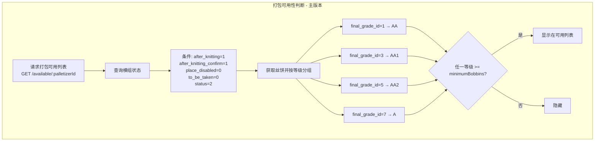

### 4.6 模组状态 (modulesStatus)

**影响文件:** `controllers/modulesStatus.js`, `queries/modulesStatus.js`, `routes/modulesStatus.js`

这是差异最为复杂的模块之一，主版本大幅扩展了模组状态管理。

#### 基础查询扩展

**纺纱变体** - 仅查 `modules_status`:
```sql
SELECT *, COUNT(*) OVER() AS total_count FROM modules_status AS ms ${filtersQuery}
```

**主版本** - 关联批次和纸管颜色，增加锁定逻辑:
```sql
SELECT ms.*, l.code AS lot_code, l.order_code,
    TIMESTAMPDIFF(HOUR, ms.timestamp, CURRENT_TIMESTAMP()) < l.wait_time AS knitting_locked,
    ptc.color1, ptc.color2,
    COUNT(*) OVER() AS total_count
FROM modules_status AS ms
LEFT JOIN lots AS l ON l.id = ms.lot_id
LEFT JOIN paper_tube_colors AS ptc ON ptc.id = l.paper_tube_color_id
```

`knitting_locked` 字段表示模组是否仍在等待时间内（基于批次的 `wait_time` 参数）。

#### 主版本新增 API

| HTTP | 路径 | 功能 |
|------|------|------|
| GET | `/modules-status/with-bobbins` | 获取模组状态含丝饼计数 |
| GET | `/modules-status/dty` | 获取 DTY 模组分组状态 |
| PUT | `/modules-status/to-be-taken` | 标记模组待取 |

#### 针织分组查询重构

**纺纱变体 - 等待时间硬编码:**
```sql
WHERE timestamp < CURRENT_TIMESTAMP() - INTERVAL 16 HOUR
AND w.type = 'pre-knitting' AND ms.to_be_taken = 0
```

**主版本 - 动态等待时间:**
```sql
WHERE TIMESTAMPDIFF(HOUR, timestamp, CURRENT_TIMESTAMP()) >= l.wait_time
AND ms.after_knitting = 0 AND ms.to_be_taken = 0
```

**关键变化:**
- 等待时间从硬编码 16 小时 → 从批次配置 `l.wait_time` 动态读取
- 仓库类型判断从 `w.type = 'pre-knitting'` → `ms.after_knitting = 0` 状态标志

#### DTY 模组分组状态 (主版本独有)

```sql
WITH t AS (
    SELECT ms.*, COUNT(lot_id) AS total_modules,
        l.code AS lot_code, ptc.color1, ptc.color2, l.order_code
    FROM modules_status AS ms
    LEFT JOIN lots AS l ON l.id = ms.lot_id
    LEFT JOIN paper_tube_colors / warehouses
    WHERE timestamp < CURRENT_TIMESTAMP() - INTERVAL l.wait_time HOUR
    AND ms.to_be_taken = 0
    AND ms.place_disabled = 0 AND ms.status = 2 AND l.type = 'poy'  -- POY 类型
    GROUP BY lot_id
)
```

注意 DTY 分组使用 `l.type = 'poy'`，而针织分组使用 `l.type = 'fdy'`。

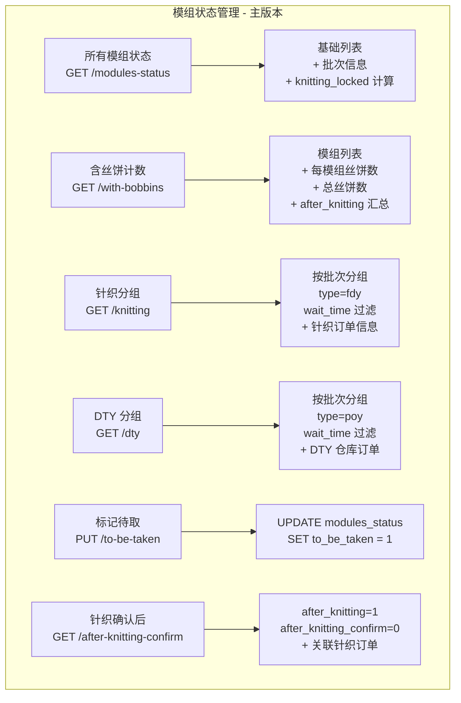

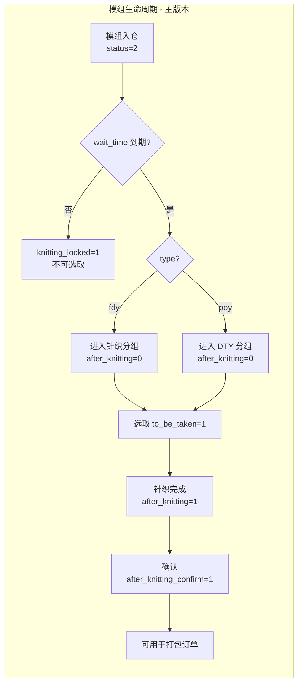

### 4.7 仓库管理 (warehouses)

**影响文件:** `controllers/warehouses.js`, `queries/warehouses.js`, `routes/warehouses.js`

#### 模组更新扩展

**纺纱变体:**
```javascript
await queries.updateWarehouseModule(warehouseId, moduleToUpdate, status, lotCode, doffing1Id, doffing2Id, disabled);
```

**主版本:**
```javascript
const afterKnitting = req.body.afterKnitting || 0;  // 新增参数
await queries.updateWarehouseModule(warehouseId, moduleToUpdate, status, lotCode, doffing1Id, doffing2Id, disabled, afterKnitting);
```

主版本在模组 UPSERT 前**先清空目标位置**:
```sql
-- 主版本新增: 先清空
UPDATE modules_status SET `row` = 0, `column` = 0, place = 0
WHERE warehouse_id = ? AND `row` = ? AND `column` = ? AND place = ?
-- 再 UPSERT (增加 after_knitting 字段)
```

#### 主版本新增 API

| HTTP | 路径 | 功能 |
|------|------|------|
| GET | `/warehouses/get-warehouses-read-status` | 获取仓库读取状态 |
| PUT | `/warehouses/:warehouseId/set-warehouse-read-status` | 设置仓库读取状态 |

涉及新表 `warehouses_read_status`，用于跟踪仓库数据的读取同步状态。

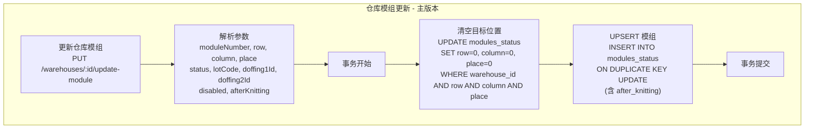

### 4.8 工作丝饼 (workBobbins)

**影响文件:** `controllers/workBobbins.js`, `queries/workBobbins.js`, `routes/workBobbins.js`

#### 主版本新增 DTY 丝饼装载

| HTTP | 路径 | 功能 |
|------|------|------|
| POST | `/work-bobbins/load-dty-bobbins` | 装载 DTY 丝饼 |

```javascript
async loadDtyBobbins(req, res, next) {
    let loadingBobbin = {
        moduleNumber: req.body.moduleNumber || 0,
        sortingId: req.body.sortingId || 0,
        lotId: req.body.lotId || 0,
    };
    const containerId = await queries.loadDtyBobbins(loadingBobbin);
    return res.status(200).json({ containerId });
}
```

调用存储过程 `CALL load_bobbins(moduleNumber, sortingId, lotId)`。

#### 绕线机名称处理差异

**纺纱变体** - 截取子串:
```sql
SUBSTRING(w.winder_name, 5) AS winder_number
```

**主版本** - 直接使用:
```sql
winder_name AS winder_number
```

此差异出现在 5 处查询中，说明两个版本的绕线机命名规范不同:
- 纺纱: 前缀+编号格式（如 `WIN-001`，取第5字符起）
- 主版本: 直接编号格式

### 4.9 针织订单 (knittingOrders)

**影响文件:** `controllers/knittingOrders.js`, `queries/knittingOrders.js`, `routes/knittingOrders.js`

#### 主版本新增获取针织可用模组

| HTTP | 路径 | 功能 |
|------|------|------|
| POST | `/knitting-orders/get-module` | 获取针织订单可用模组 |

```sql
SELECT ms.*, l.code AS lot_code, ptc.color1, ptc.color2, l.order_code
FROM modules_status AS ms
LEFT JOIN lots AS l ON l.id = ms.lot_id
LEFT JOIN paper_tube_colors AS ptc ON ptc.id = l.paper_tube_color_id
LEFT JOIN warehouses AS w ON w.id = ms.warehouse_id
WHERE TIMESTAMPDIFF(HOUR, timestamp, CURRENT_TIMESTAMP()) >= l.wait_time
AND ms.after_knitting = 0
AND ms.to_be_taken = 0
AND ms.`row` > 0 AND ms.`column` > 0 AND ms.place > 0
AND ms.warehouse_id = ?
AND ms.place_disabled = 0 AND ms.status = 2 AND l.`type` = 'fdy'
AND lot_id = (SELECT lot_id FROM knitting_orders WHERE id = ?)
```

**关键过滤条件:**
- 等待时间到期 (`TIMESTAMPDIFF >= wait_time`)
- 未经过针织 (`after_knitting = 0`)
- 未被选取 (`to_be_taken = 0`)
- 有效仓位 (`row/column/place > 0`)
- FDY 类型批次 (`l.type = 'fdy'`)

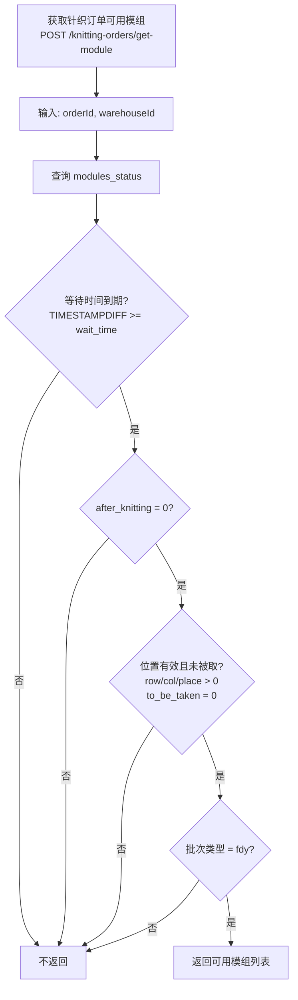

### 4.10 模组与托盘等次要差异

#### 模组 (modules) - 等级体系变化

**纺纱变体:**
```javascript
{ AA: 0, B: 0, C: 0, D: 0 }  // 4级: AA, B, C, D
```

**主版本:**
```javascript
{ AA: 0, AA1: 0, AA2: 0, A1: 0 }  // 4级: AA, AA1, AA2, A1
```

等级体系从 AA/B/C/D 变为 AA/AA1/AA2/A1，反映了更精细的质量分类。

主版本还新增了字段:
- `knittingInsertTime`: 针织插入时间
- `knittingResultTime`: 针织结果时间

#### 托盘 (pallets) - RFID 管理

**主版本新增:**

| HTTP | 路径 | 功能 |
|------|------|------|
| PUT | `/pallets/:palletId/rfid` | 更新托盘 RFID |

```javascript
async changeRfid(palletId, rfid) {
    await db.transaction(async connection => {
        await connection.query(`UPDATE pallets SET rfid = ? WHERE id = ?`, [rfid, palletId]);
        // 触发 ERP 同步
        await connection.query(`INSERT INTO erp_pallets (pallet_id) VALUES (?)
            ON DUPLICATE KEY UPDATE sent_to_erp = 0`, [palletId]);
    });
}
```

RFID 变更会自动触发 ERP 重新同步（`sent_to_erp = 0`）。

**主版本还新增了 pallets 创建的重复处理:**
```javascript
if (error.code == 'ER_DUP_ENTRY') {
    const rows = await db.query(`SELECT id FROM pallets WHERE order_id = ? AND pallet_of_order = ?`,
        [pallet.order_id, pallet.pallet_of_order]);
    return rows[0].id;  // 返回已存在的 ID
}
```

#### 落纱 (doffings) - 中国规格

主版本在落纱查询中新增 `l.specification_china` 字段。

#### 预缺陷丝饼 (preDefectBobbins) - 微小重构

仅将两行代码合并为一行（无功能变化）:
```javascript
// 纺纱: let error = new DuplicateError(...); throw error;
// 主版本: throw new DuplicateError(...);
```

---

## 5. 数据库表结构差异推断

基于源码中的 SQL 语句，推断主版本新增/修改的数据库表:

### 5.1 主版本新增表

| 表名 | 用途 | 推断字段 |
|------|------|----------|
| `dty` | DTY 设备主数据 | id, name, code |
| `dty_pallets` | DTY 专用托盘 | id, dty_order_id, pallet_of_order, rfid, team_turn, product_date, created |
| `dty_pallets_boxes` | 托盘-箱关联 | dty_pallet_id, dty_box_id |
| `dty_modules` | DTY 模组记录 | id, number, doffing1_id, doffing2_id |
| `dty_packing_orders_modules` | DTY 打包订单模组 | packing_order_id, module_number, module_id, number_of_bobbins, status, timestamp |
| `dty_warehouse_orders` | DTY 仓库订单 | id, lot_id, number_of_modules, dty_id, status, modules_sent, timestamp |
| `dty_warehouse_orders_modules` | DTY 仓库订单模组 | dty_warehouse_order_id, module_number, module_id, number_of_bobbins, total_bobbins_weight, status |
| `dty_work_bobbins` | DTY 工作丝饼 | 类似 work_bobbins，含 module_id, plant_area_code 等 |
| `notifications` | 通知 | id, data, type, acknowledge, timestamp |
| `warehouses_read_status` | 仓库读取状态 | warehouse_id, is_read |
| `team_turns` | 班组/班次主数据 | code, name |

### 5.2 主版本修改的现有表

| 表名 | 新增字段 |
|------|----------|
| `lots` | type, default_pallet_level, default_destination, default_pallet_size, minimum_pallets_for_order, wait_time, twist, box_weight, order_code_aa1, order_code_aa2, order_code_a, packing_lock, end_lot |
| `modules_status` | after_knitting, after_knitting_confirm, monorail_id, place_disabled |
| `dty_boxes` | lot_id, order_grade_id, palletizer_id, weight, labeling_time, product_date |
| `dty_orders` | boxes_amount |
| `modules` | knitting_insert_time, knitting_result_time |
| `doffings` (查询) | specification_china (来自 lots 表 JOIN) |

### 5.3 主版本新增数据库函数

| 函数 | 用途 |
|------|------|
| `GET_BOX_CODE(id)` | 根据箱 ID 生成箱号 |
| `create_dty_warehouse_order(lot_id, modules, dty_id)` | 创建 DTY 仓库订单（存储过程） |
| `load_dty_bobbins(...)` | 装载 DTY 丝饼（存储过程） |

---

## 6. 问题发现与架构建议

### 6.1 发现的问题

#### P1: 纺纱变体是过时的分支快照

纺纱变体 v2.0.10 是主版本 v2.0.34 的一个**历史快照**，而非独立分支。它缺少主版本后续 24 个版本迭代中新增的:
- DTY 仓库订单完整子系统
- DTY 专用丝饼管理
- 通知系统
- 多等级质量分类 (AA/AA1/AA2/A)
- 批次锁定/结束控制
- 仓库读取状态监控
- 动态等待时间配置

#### P2: DTY 箱查询方向不一致

纺纱变体的 `dtyBoxes` 模块函数命名为 `createOrder`/`getAllOrders`，但操作的是箱(box)数据，存在命名混淆。主版本已修正为 `createBox`/`getAllBoxes`。

#### P3: 仓库类型判断方式不一致

纺纱变体使用 `w.type = 'after-knitting'` 硬编码判断仓库类型，主版本改为 `ms.after_knitting = 1` 状态标志位。代码中可见多处注释掉的旧条件:
```sql
-- AND w.type = 'after-knitting'  -- 已注释
```
这表明架构从**仓库类型分类**转向**模组状态流转**。

#### P4: 等待时间硬编码 vs 动态配置

纺纱变体: `INTERVAL 16 HOUR` 硬编码
主版本: `TIMESTAMPDIFF(HOUR, timestamp, CURRENT_TIMESTAMP()) >= l.wait_time` 动态配置

#### P5: 等级体系不兼容

纺纱变体使用 AA/B/C/D 四级分类，主版本使用 AA/AA1/AA2/A1。如果两个版本操作同一数据库，将出现等级定义冲突。

#### P6: 绕线机命名规范不一致

纺纱变体用 `SUBSTRING(winder_name, 5)` 提取编号，主版本直接用 `winder_name`。说明底层数据格式已变化。

#### P7: DTY 托盘指向不同表

纺纱变体 `dtyPallets` 查询操作 `pallets` 表（通用托盘表），主版本操作 `dty_pallets` 表（DTY 专用托盘表）。这是一个重要的数据模型分离。

### 6.2 架构建议

1. **废弃纺纱变体**: 纺纱变体是一个过时快照，应该废弃并使用主版本。主版本通过 `lots.type` 字段 (`fdy`/`poy`) 已经原生支持不同纱线类型的差异化处理。

2. **统一部署**: 主版本已具备完整的 FDY + DTY 业务链路，无需维护独立的纺纱变体。

3. **数据迁移注意**: 如果纺纱变体有独立数据库实例，迁移时需注意:
   - 等级映射: B→AA1, C→AA2, D→A1 (需确认业务对应关系)
   - 托盘数据: 从 `pallets` 迁移到 `dty_pallets`
   - 绕线机名称: 可能需要去除前缀

4. **代码质量**: 主版本中存在一些遗留的注释代码（如 `-- AND w.type = 'after-knitting'`），建议清理。

---

> 分析完成。纺纱变体是主版本 v2.0.10 时期的快照副本，主版本在后续 24 次迭代中新增了 DTY 仓库订单管理、通知系统、多等级质量分类、动态等待时间等关键功能，并重构了 DTY 箱/托盘的数据模型和仓库状态管理机制。两个版本不存在反向差异——纺纱变体中没有任何主版本不具备的功能。
