# V2 新发现项目深度源码分析

> 纯源码逐行分析，不依赖任何已有文档

## 目录

- [1. O17008 码垛机管理系统](#1-o17008-码垛机管理系统)
  - [1.1 项目概览](#11-项目概览)
  - [1.2 系统架构](#12-系统架构)
  - [1.3 PLC 变量映射](#13-plc-变量映射)
  - [1.4 FDY 模式业务流程](#14-fdy-模式业务流程)
  - [1.5 DTY 模式业务流程](#15-dty-模式业务流程)
  - [1.6 通用模块](#16-通用模块)
- [2. O17008 DTY 变体差异分析](#2-o17008-dty-变体差异分析)
- [3. O17004 纺丝侧管理系统](#3-o17004-纺丝侧管理系统)
  - [3.1 项目概览](#31-项目概览)
  - [3.2 系统架构](#32-系统架构)
  - [3.3 PLC 变量映射](#33-plc-变量映射)
  - [3.4 业务流程](#34-业务流程)
- [4. O19028 监控查看器](#4-o19028-监控查看器)
  - [4.1 项目概览](#41-项目概览)
  - [4.2 系统架构](#42-系统架构)

---

## 1. O17008 码垛机管理系统

### 1.1 项目概览

| 属性 | 值 |
|------|-----|
| 包名 | `net.hivetechnology.o17008` |
| 版本 | v1.0.30 |
| 运行环境 | Electron 桌面应用（系统托盘模式） |
| 核心依赖 | axios, net.hivetechnology.communication, net.hivetechnology.step7, winston |
| 入口 | `index.js` → `src/O17008.js` |

**核心职责：** 码垛机（Palletizer）与 PLC 的数据桥接，管理 FDY（全拉伸丝）和 DTY（拉伸变形丝）两种产品模式下的订单创建、托盘/箱体管理、标签打印、RFID 追踪、单轨运输系统对接。

### 1.2 系统架构

#### 1.2.1 总体架构图

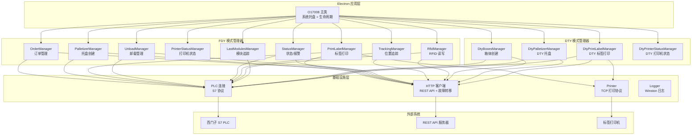

#### 1.2.2 初始化流程

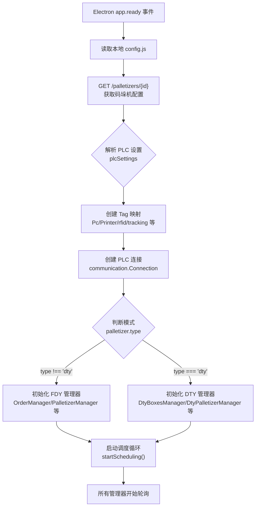

#### 1.2.3 HTTP 故障转移机制

源码位置：`src/http.js`

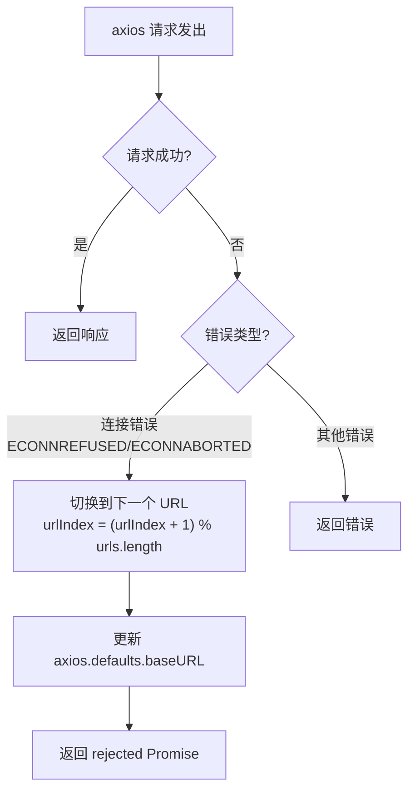

**实现细节：**
- 配置文件提供多个 `restApiServerUrl`
- axios 响应拦截器检测 `ECONNREFUSED`、`ECONNABORTED` 等连接错误
- 自动轮换到下一个 URL（取模循环）
- 超时设置 60 秒，启用 HTTP keepAlive

### 1.3 PLC 变量映射

源码位置：`src/variables.js`（840 行）

#### 1.3.1 DB 块一览

| DB 名称 | 用途 | 关键字段 |
|---------|------|---------|
| Pc | 订单+托盘创建 | Order_Manager (DataReady, OrderID 等), Pallet_Creator (RequestData, BobbinsNr 等) |
| Printer | 标签打印 | firstPrinter + lastPrinter[] 数组 |
| rfid | RFID 标签 | StartCommunication, IdPallet, RFID(BYTE[4]) |
| tracking | 位置追踪 | 100 个区段，每段含 PalletId, StartCommunication, ConfirmData |
| PalConfig | 托盘配置 | BobbinID(DINT) x 81 个 |
| ProductDataForPalOrder | 标签数据 | Specification, Grade, Lustre, Lot, Weight, QRCode URL 等 |
| unloadData | 卸载数据 | DoffingId1, DoffingId2, BobbinID x 24 |
| cyclesData | 周期/报警 | ActualStatus, Alarms(WORD x 20 = 320 位), 15 个 Cycle ID |
| dtyMonorail | DTY 单轨 | DTY 专用 |
| dtyOrder | DTY 订单 | DTY 专用 |
| dtyPallet | DTY 托盘 | OrderID, RFID, BoxesNo, BoxID x 25, BobbinsNo, PalletOfOrder |
| dtyBox | DTY 箱体 | OrderID, BoxOfOrder, BoxesNo, BobbinID x 6 |
| dtyPrinter | DTY 打印 | StartPrint, BoxID, Weight |

#### 1.3.2 FDY 订单管理变量 (Pc DB - Order_Manager)

| 变量名 | 数据类型 | 字节偏移 | 方向 |
|--------|---------|---------|------|
| DataReady | INT | 0 | PLC→PC |
| NewOrderEnable | INT | 2 | PLC→PC |
| OrderID | DINT | 4 | PLC→PC |
| LotCode | CHAR[20] | 8 | PLC→PC |
| Destination | INT | 28 | PLC→PC |
| BobbinsPerPallet | INT | 30 | PLC→PC |
| IdOrder | DINT | 32 | PC→PLC |
| IdLot | DINT | 36 | PC→PLC |
| ConfirmData | INT | 40 | PC→PLC |

#### 1.3.3 FDY 托盘创建变量 (Pc DB - Pallet_Creator)

| 变量名 | 数据类型 | 字节偏移 | 方向 |
|--------|---------|---------|------|
| RequestData | INT | 42 | PLC→PC |
| OrderID | DINT | 44 | PLC→PC |
| PalletOfOrder | INT | 48 | PLC→PC |
| BobbinsNr | INT | 50 | PLC→PC |
| IdPallet | DINT | 52 | PC→PLC |
| ConfirmData | INT | 56 | PC→PLC |

#### 1.3.4 标签打印变量

Printer DB 定义了 `firstPrinter` 和 `lastPrinter` 数组（最多 4 个），每个打印机包含：

| 变量名 | 数据类型 | 说明 |
|--------|---------|------|
| StartPrint | INT | 启动打印信号 |
| EndPrint | INT | 结束打印信号 |
| IdPallet | DINT | 托盘 ID |
| Status | INT | 打印机状态 |
| Barcode | BYTE[8] | 条码数据（int64 编码） |

#### 1.3.5 RFID 变量

| 变量名 | 数据类型 | 字节偏移 |
|--------|---------|---------|
| StartCommunication | INT | 0 |
| IdPallet | DINT | 2 |
| RFID | BYTE[4] | 6 |
| ConfirmData | INT | 10 |

#### 1.3.6 Tracking 变量（100 个区段）

每个区段包含：

| 变量名 | 数据类型 | 说明 |
|--------|---------|------|
| PalletId | DINT | 区段内托盘 ID |
| StartCommunication | INT | 通信启动 |
| ConfirmData | INT | 确认数据 |

### 1.4 FDY 模式业务流程

#### 1.4.1 订单管理流程

源码位置：`src/orderManager.js`（214 行）

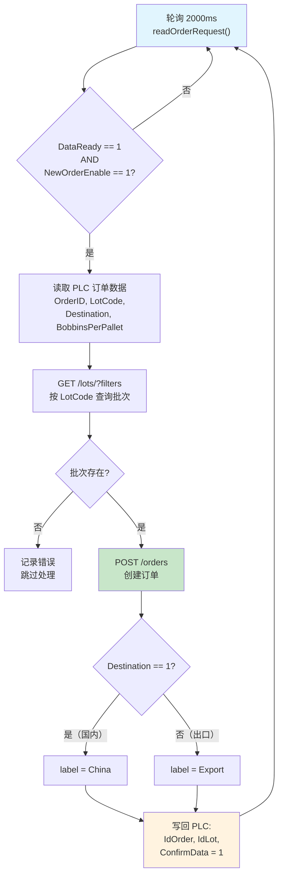

**数据流图：**

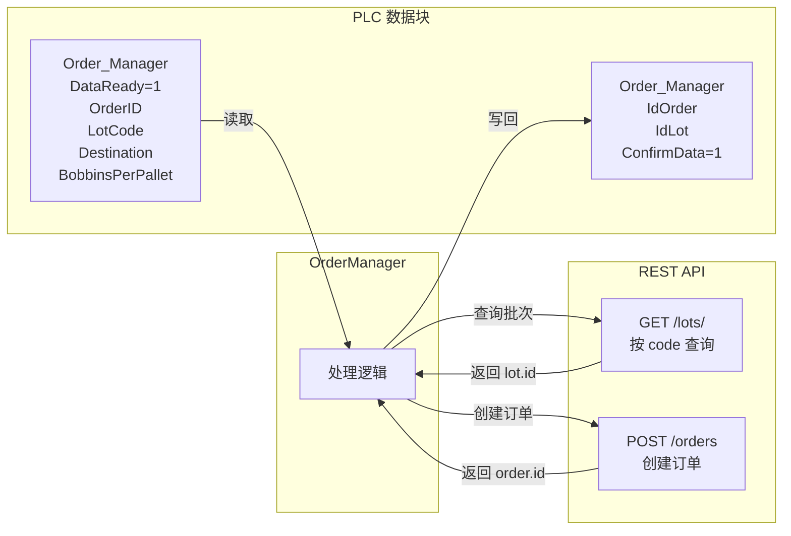

#### 1.4.2 托盘创建流程

源码位置：`src/palletizerManager.js`（153 行）

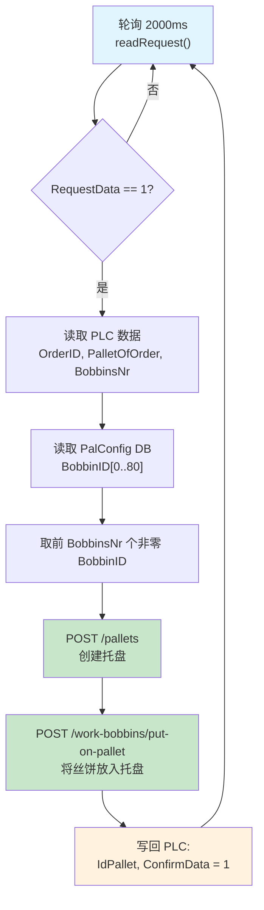

**数据流图：**

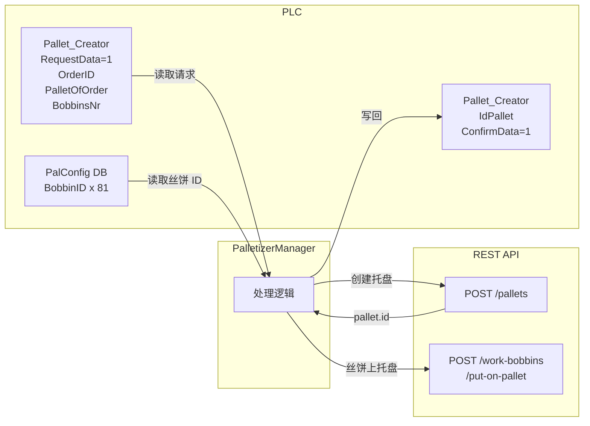

#### 1.4.3 标签打印流程

源码位置：`src/printLabelManager.js`（206 行）、`src/printer.js`（359 行）

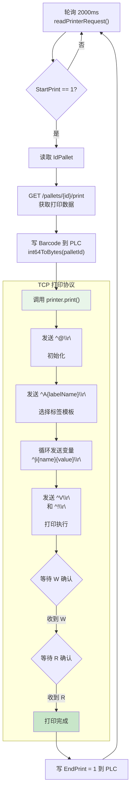

**打印变量映射（ProductDataForPalOrder DB）：**

| PLC 变量 | 打印标签变量 | 说明 |
|---------|------------|------|
| Specification | Specification | 产品规格 |
| Grade | Grade | 等级 |
| Lustre | Lustre | 光泽度 |
| Lot | Lot | 批次 |
| GrossWeight | GrossWeight | 毛重 |
| NetWeight | NetWeight | 净重 |
| PalletWeight | PalletWeight | 托盘重量 |
| BobbinsNr | BobbinsNr | 丝饼数量 |
| QRCodeURL | QRCodeURL | 二维码链接 |

**二维码 URL 格式：** `https://code.hb30.com/fangsi/{code}`

**打印机状态管理（printerStatusManager.js）：** 每 5 秒检查 Status == 2，发送 `^?df\r\n` 查询打印机状态，成功后重置 Status = 1。

#### 1.4.4 RFID 管理流程

源码位置：`src/rfidManager.js`（82 行）

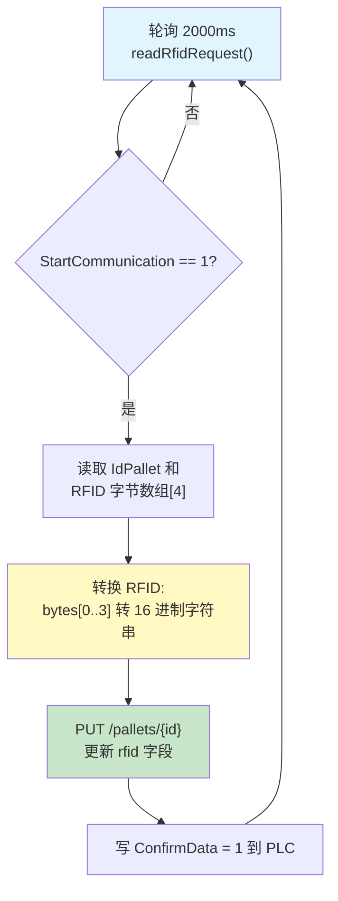

**RFID 转换逻辑：**
- 读取 4 字节数组 `[b0, b1, b2, b3]`
- 每个字节转为 2 位 16 进制字符串
- 拼接得到 8 字符 RFID 标识符

#### 1.4.5 位置追踪流程

源码位置：`src/trackingManager.js`（65 行）

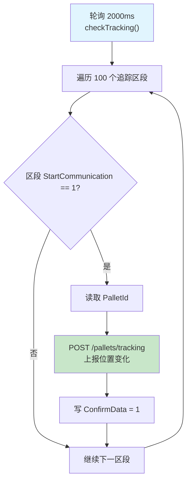

**数据流图：**

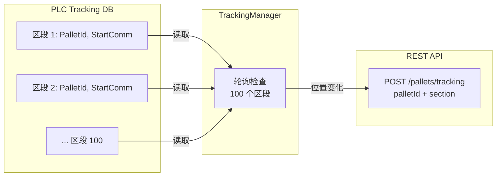

#### 1.4.6 卸载管理流程

源码位置：`src/unloadManager.js`（115 行）

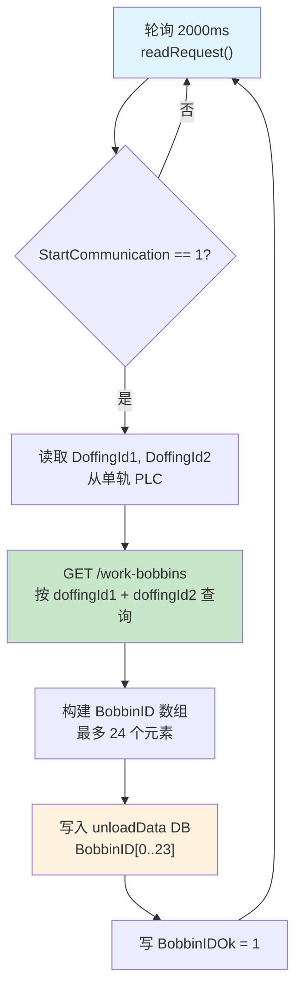

#### 1.4.7 状态与报警管理

源码位置：`src/statusManager.js`（129 行）

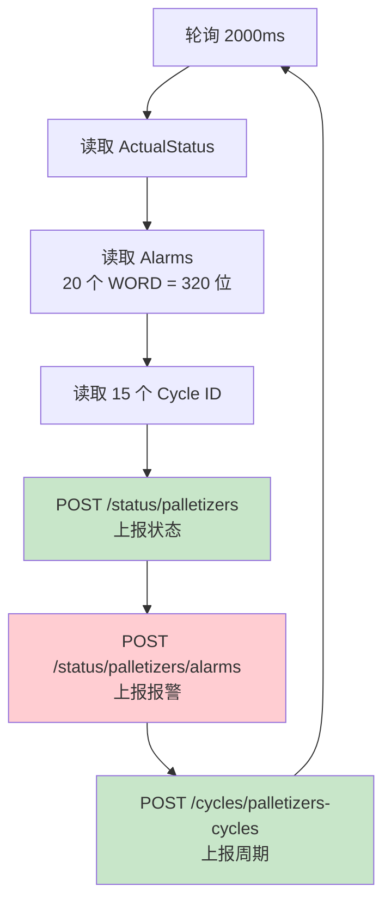

#### 1.4.8 最近模块追踪

源码位置：`src/lastModulesManager.js`（84 行）

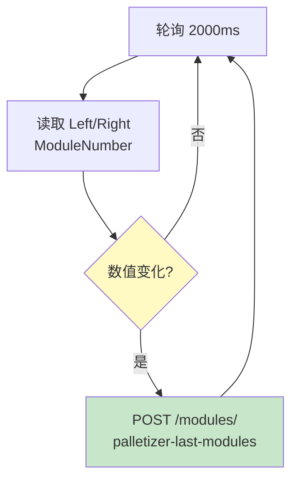

### 1.5 DTY 模式业务流程

#### 1.5.1 DTY 箱体创建流程

源码位置：`src/DTY/dtyBoxesManager.js`（132 行）

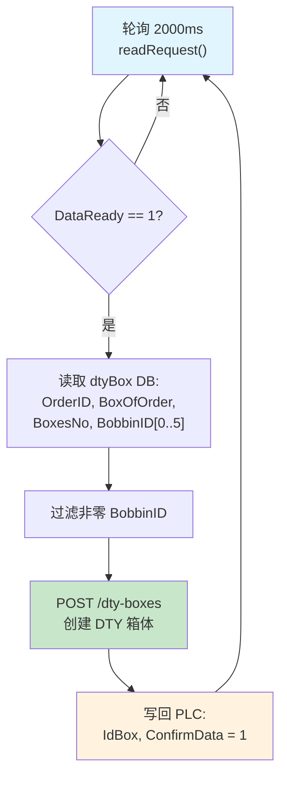

**数据流图：**

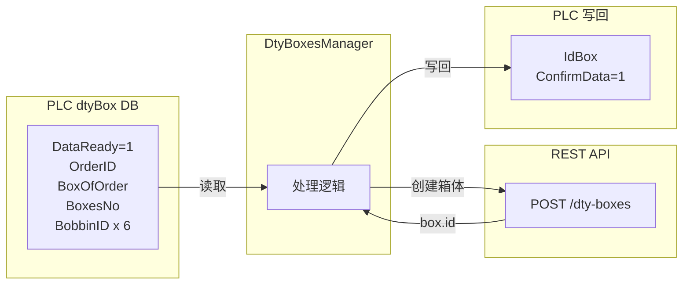

#### 1.5.2 DTY 托盘创建流程

源码位置：`src/DTY/dtyPalletizerManager.js`（134 行）

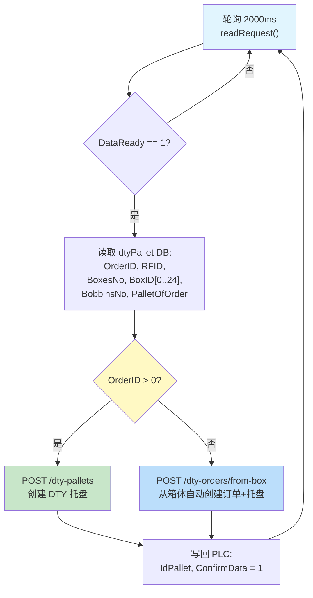

**关键逻辑：** 当 `OrderID > 0` 时正常创建托盘；当 `OrderID <= 0` 时通过 `/dty-orders/from-box` 接口从箱体自动反推创建订单和托盘。

#### 1.5.3 DTY 标签打印流程

源码位置：`src/DTY/dtyPrintLabelManager.js`（127 行）

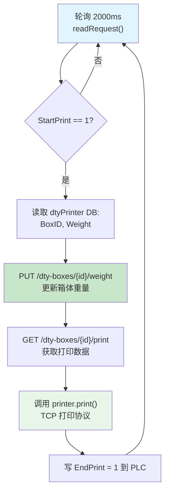

### 1.6 通用模块

#### 1.6.1 TCP 打印机协议

源码位置：`src/printer.js`（359 行）

**协议命令表：**

| 命令 | 格式 | 说明 |
|------|------|------|
| 初始化 | `^@\r\n` | 重置打印机状态 |
| 选择模板 | `^A{labelName}\r\n` | 加载标签模板 |
| 设置变量 | `^｜i{name}{value}\r\n` | 填入标签变量 |
| 执行打印 | `^V\r\n` | 启动打印 |
| 结束 | `^!\r\n` | 结束打印会话 |
| 状态查询 | `^?df\r\n` | 查询打印机就绪状态 |
| W 响应 | (打印机→PC) | 确认收到打印任务 |
| R 响应 | (打印机→PC) | 确认打印完成 |

**打印操作队列：** Printer 类维护一个操作队列（`operationQueue`），保证同一时间只有一个打印任务在执行。通过 `setTimeout` 超时机制防止打印机无响应造成的死锁。

#### 1.6.2 数据转换函数

源码位置：`src/functions.js`（31 行）

| 函数 | 用途 |
|------|------|
| `int64ToBytes(value)` | 将 BigInt 转为 8 字节数组（用于 Barcode） |
| `bytesToInt32(bytes)` | 4 字节数组转 32 位整数 |
| `int32ToBytes(value)` | 32 位整数转 4 字节数组 |
| `bytesToInt64(bytes)` | 8 字节数组转 BigInt |

---

## 2. O17008 DTY 变体差异分析

源码位置：`/worktemp/第二版本程序/Hive/DataBase/Programmi/DTY/O17008/extracted_app/`

### 2.1 差异概览

| 对比项 | 主版本 | DTY 变体 |
|--------|--------|----------|
| dtyUnloadManager.js | **不存在** | **存在** |
| unloadManager.js | DoffingId1/DoffingId2 | DoffingId1/DoffingId2 |
| DTY 卸载数据源 | 无 | ModuleId |
| DTY 丝饼数组大小 | 无 | 96 个 |
| O17008.js DTY 初始化 | 无 DTYUnloadManager | 有 DTYUnloadManager |

### 2.2 DTY 卸载管理器（独有）

源码位置：`src/DTY/dtyUnloadManager.js`（仅 DTY 变体中存在）

这是 DTY 变体的核心差异 — 一个完全独立的卸载管理器，专门处理 DTY 产品线的模块卸载。

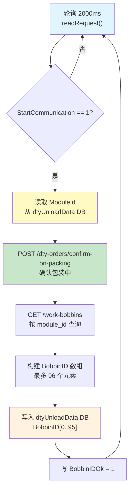

**与 FDY UnloadManager 的对比数据流图：**

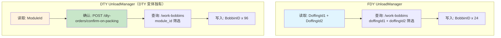

### 2.3 DTY 变体 PLC 变量差异

**dtyUnloadData DB（仅 DTY 变体）：**

| 变量名 | 数据类型 | 字节偏移 | 说明 |
|--------|---------|---------|------|
| ModuleId | DINT | 0 | 模块 ID（非 DoffingId） |
| StartCommunication | INT | 4 | 通信启动 |
| BobbinIDOk | INT | 6 | 确认标志 |
| BobbinID | DINT | 8 | 96 个元素的丝饼 ID 数组 |

### 2.4 初始化差异

DTY 变体的 `O17008.js` 在 `type === 'dty'` 分支中额外实例化 `DTYUnloadManager`：

```
// DTY 变体独有
this.dtyUnloadManager = new DTYUnloadManager(connection, tags.dtyUnloadData, axios);
```

主版本中无此初始化逻辑。

---

## 3. O17004 纺丝侧管理系统

### 3.1 项目概览

| 属性 | 值 |
|------|-----|
| 包名 | `net.hivetechnology.o17004` |
| 版本 | v2.0.9 |
| 运行环境 | Electron 桌面应用（系统托盘模式） |
| 核心依赖 | axios, net.hivetechnology.communication, net.hivetechnology.step7, net.hivetechnology.ws, winston |
| 入口 | `index.js` → `src/O17004.js` |

**核心职责：** 管理纺丝侧（Spinning Side）设备数据采集，包括卷绕机（Winder）落丝数据采集、仓库管理、装载打印、批次完整性检查、卷绕机状态检查。支持 TMT 和 BARMAG 两种卷绕机类型，支持双卷绕机（Twin Winder，Left/Right）配置。

### 3.2 系统架构

#### 3.2.1 总体架构图

```mermaid
graph TB
    subgraph "Electron 应用层"
        APP["O17004 主类<br/>系统托盘 + 多纺丝侧管理"]
    end

    subgraph "纺丝侧实例（SpinningSide）"
        SS["SpinningSide<br/>核心调度器"]
        WM["WindersManager<br/>卷绕机数据采集"]
        WHM["WarehouseManager<br/>仓库管理"]
        D1M["Doffer1Manager<br/>落丝机1管理（可选）"]
        CLM["CompleteLotManager<br/>批次完整性检查"]
        LM["LoadingManager<br/>装载+打印"]
        WCM["WindersCheckManager<br/>卷绕机状态检查（可选）"]
        SM_O4["StatusManager<br/>状态/报警"]
    end

    subgraph "PLC 连接"
        MAIN_PLC["主 PLC 连接"]
        MONO_PLC["单轨 PLC 连接<br/>（可选）"]
    end

    subgraph "外部系统"
        S7_M["西门子 S7 PLC<br/>（主设备）"]
        S7_R["西门子 S7 PLC<br/>（单轨系统）"]
        API_O4["REST API 服务器"]
        WS["WebSocket 打印服务器"]
    end

    APP -->|"多实例"| SS
    SS --> WM & WHM & D1M & CLM & LM & WCM & SM_O4
    WM & WHM & D1M & CLM & SM_O4 --> MAIN_PLC
    WCM --> MONO_PLC
    LM --> MAIN_PLC
    LM -->|"打印命令"| WS
    MAIN_PLC --> S7_M
    MONO_PLC --> S7_R
    WM & WHM & D1M & CLM & LM & WCM & SM_O4 --> API_O4
    WS --> WS
```

#### 3.2.2 SpinningSide 初始化流程

源码位置：`src/SpinningSide.js`（456 行）

```mermaid
flowchart TD
    A["读取 config.spinningSideIds"] --> B["创建 SpinningSide 实例"]
    B --> C["GET /spinning-sides/{id}<br/>获取纺丝侧配置"]
    C --> D["解析 PLC 设置<br/>主 PLC + 单轨 PLC"]
    D --> E["确定卷绕机类型<br/>TMT 或 BARMAG"]
    E --> F["创建卷绕机变量映射<br/>getWinderVariables()"]
    F --> G["创建仓库位变量映射<br/>getWarehousePinVariables()"]
    G --> H["建立主 PLC 连接"]
    H --> I{"有单轨 PLC?"}
    I -->|"是"| J["建立单轨 PLC 连接"]
    I -->|"否"| K["跳过"]
    J --> L["初始化所有管理器"]
    K --> L
    L --> M["WindersManager<br/>（每个卷绕机 DB）"]
    L --> N["WarehouseManager<br/>（每个仓库位 DB）"]
    L --> O{"有 doffer1?"}
    O -->|"是"| P["Doffer1Manager<br/>（doffer1 DB）"]
    O -->|"否"| Q["跳过"]
    L --> R["CompleteLotManager"]
    L --> S["LoadingManager"]
    L --> T{"有单轨?"}
    T -->|"是"| U["WindersCheckManager<br/>（单轨 PLC）"]
    T -->|"否"| V["跳过"]
    L --> W["StatusManager<br/>（每个 doffer cycle DB）"]

    style E fill:#fff9c4
    style I fill:#fff9c4
    style O fill:#fff9c4
    style T fill:#fff9c4
```

#### 3.2.3 卷绕机类型支持

**TMT 卷绕机变量结构（92 字节）：**

源码位置：`src/udtTMT.js`

| 变量名 | 数据类型 | 字节偏移 | 说明 |
|--------|---------|---------|------|
| POSITION_Name | CHAR[8] | 0 | 位号名称 |
| Doff_No | WORD | 8 | 落丝号 |
| EndTimeOfPack | DWORD | 10 | 包装结束时间 |
| Merge_No | CHAR[9] | 14 | 合并号 |
| Yarn_Type | CHAR[12] | 24 | 纱线类型 |
| MachineName | CHAR[8] | 36 | 机台名称 |
| CodeNumber | CHAR[12] | 44 | 编码号 |
| ... | ... | ... | 其余控制字段 |

**BARMAG 卷绕机变量结构（128 字节）：**

源码位置：`src/udtBarmag.js`

| 变量名 | 数据类型 | 字节偏移 | 说明 |
|--------|---------|---------|------|
| MachineNo | CHAR[4] | 0 | 机台号 |
| PositionNo | CHAR[4] | 4 | 位号 |
| ProductionData | CHAR[28] | 8 | 生产数据（含批次/规格/订单号） |
| PositionID | INT | 36 | 位置 ID |
| EndTime1/EndTime2 | DWORD | 38/42 | 结束时间 |
| DoffTime1/DoffTime2 | DWORD | 46/50 | 落丝时间 |
| DoffNo | INT | 54 | 落丝号 |
| CalculateNetWeight | REAL | 56 | 计算净重 |
| Quality 字段 | ... | 60+ | 质量等级信息 |

**双卷绕机（Twin Winder）：** 当配置为 `twinWinder: true` 时，系统会为同一卷绕机创建 Left 和 Right 两套变量映射，偏移量自动计算。

### 3.3 PLC 变量映射

源码位置：`src/variables.js`（283 行）

#### 3.3.1 仓库位变量（动态计算）

每个仓库位由 `卷绕机数据 + 控制字段` 组成：

| 变量名 | 数据类型 | 偏移（相对卷绕机尾部） | 方向 |
|--------|---------|---------------------|------|
| BobbinsData.* | (卷绕机结构) | 0 | PLC→PC |
| Id_doffing | DINT | winderSize + 28 | 双向 |
| WinderNr | INT | winderSize + 32 | PLC→PC |
| EndLot | INT | winderSize + 34 | PLC→PC |
| DataLotComplete | INT | winderSize + 36 | 双向 |

#### 3.3.2 卷绕机状态检查变量 (stockModuleCheck)

| 变量名 | 数据类型 | 字节偏移 | 方向 |
|--------|---------|---------|------|
| PLC_TO_PC.enabled | X (bit) | 0.0 | PLC→PC |
| PLC_TO_PC.startCommunication | INT | 2 | PLC→PC |
| PLC_TO_PC.ModuleNumber | INT | 4 | PLC→PC |
| PLC_TO_PC.DoffingID1 | DINT | 6 | PLC→PC |
| PLC_TO_PC.DoffingID2 | DINT | 10 | PLC→PC |
| PC_TO_PLC.EndCommunication | INT | 14 | PC→PLC |
| PC_TO_PLC.StockStatus | INT | 16 | PC→PLC |

#### 3.3.3 装载变量 (plcPc)

| 变量名 | 数据类型 | 字节偏移 | 方向 |
|--------|---------|---------|------|
| Loading.EndLoading | INT | 0 | PLC→PC |
| Loading.Number | DINT | 2 | PLC→PC |
| Loading.ID1 | DINT | 6 | PLC→PC |
| Loading.ID2 | DINT | 10 | PLC→PC |
| Loading.PrinterTrolleyEnabled | INT | 14 | PLC→PC |
| Loading.PrinterBobbinsEnabled | INT | 16 | PLC→PC |
| Loading.ContainerType | INT | 18 | PLC→PC |
| Loading.RFIDTrolleyData | BYTE[8] | 22 | PLC→PC |
| Loading.Ok_Data | INT | 30 | PC→PLC |

### 3.4 业务流程

#### 3.4.1 卷绕机数据采集流程

源码位置：`src/windersManager.js`（153 行）

```mermaid
flowchart TD
    A["轮询 5000ms<br/>每个卷绕机 DB"] --> B["读取当前 DoffNo"]
    B --> C{"DoffNo 变化?"}
    C -->|"否"| A
    C -->|"是"| D["读取完整落丝数据"]
    D --> E{"卷绕机类型?"}
    E -->|"TMT"| F["直接使用字段<br/>MachineName, POSITION_Name 等"]
    E -->|"BARMAG"| G["解析 ProductionData<br/>提取 lot/specification/orderCode"]
    F --> H["POST /doffings<br/>创建落丝记录"]
    G --> H
    H --> I["更新本地 DoffNo 缓存"]
    I --> A

    style C fill:#fff9c4
    style E fill:#fff9c4
    style H fill:#c8e6c9
```

**BARMAG ProductionData 解析逻辑：**

源码位置：`src/functions.js` - `getLotAndSpecification()`

```mermaid
flowchart LR
    PD["ProductionData 字符串<br/>28 字符"] --> PARSE["解析逻辑"]
    PARSE --> LOT["lot = 前段字符"]
    PARSE --> SPEC["specification = 中段字符"]
    PARSE --> OC["orderCode = 末段字符"]
```

**数据流图：**

```mermaid
flowchart LR
    subgraph "PLC 卷绕机 DB"
        W_DB["DoffNo（变化触发）<br/>完整卷绕机数据<br/>TMT: 92 字节<br/>BARMAG: 128 字节"]
    end

    subgraph "WindersManager"
        WM_PROC["检测 DoffNo 变化<br/>读取完整数据<br/>解析字段"]
    end

    subgraph "REST API"
        DOFF_API["POST /doffings<br/>创建落丝记录"]
    end

    W_DB -->|"轮询读取"| WM_PROC
    WM_PROC -->|"创建记录"| DOFF_API
```

#### 3.4.2 仓库管理流程

源码位置：`src/warehouseManager.js`（186 行）

```mermaid
flowchart TD
    A["轮询 2000ms<br/>每个仓库位"] --> B["读取 Id_doffing"]
    B --> C{"Id_doffing &lt; 0?"}
    C -->|"否"| A
    C -->|"是"| D["读取仓库位完整数据<br/>BobbinsData + WinderNr + EndLot"]
    D --> E["POST /doffings/byWarehouse<br/>按仓库位创建/关联落丝"]
    E --> F{"创建成功?"}
    F -->|"是"| G["写回 PLC:<br/>Id_doffing = response.id<br/>DataLotComplete = response.value"]
    F -->|"否，落丝未找到"| H["先 POST /doffings 创建落丝<br/>再重新 POST /doffings/byWarehouse"]
    H --> G
    G --> A

    style C fill:#fff9c4
    style E fill:#c8e6c9
    style H fill:#ffcdd2
```

**关键逻辑：** `Id_doffing < 0` 表示 PLC 请求 PC 处理该仓库位的落丝数据。成功后将数据库返回的落丝 ID 和批次完成状态写回 PLC。

#### 3.4.3 Doffer1 管理流程

源码位置：`src/doffer1Manager.js`（181 行）

```mermaid
flowchart TD
    A["轮询 2000ms<br/>2 个 spindle"] --> B["读取 Id_doffing<br/>和 WinderNr"]
    B --> C{"doffingId &lt; 0<br/>AND winderNr &gt; 0?"}
    C -->|"否"| A
    C -->|"是"| D["读取 spindle 完整数据<br/>BobbinsData"]
    D --> E["POST /doffings/byWarehouse<br/>按仓库位创建/关联落丝"]
    E --> F{"创建成功?"}
    F -->|"是"| G["写回 PLC:<br/>Id_doffing = response.id"]
    F -->|"否"| H["创建落丝后重试"]
    H --> G
    G --> A

    style C fill:#fff9c4
    style E fill:#c8e6c9
```

**与 WarehouseManager 的区别：** Doffer1Manager 管理 2 个 spindle（纺锤），而 WarehouseManager 管理多个仓库位。触发条件增加了 `winderNr > 0` 的判断。

#### 3.4.4 装载与打印流程

源码位置：`src/loadingManager.js`（196 行）

```mermaid
flowchart TD
    A["轮询 2000ms<br/>readRequest()"] --> B{"EndLoading == 1?"}
    B -->|"否"| A
    B -->|"是"| C["读取装载数据:<br/>Number, ID1, ID2,<br/>ContainerType,<br/>RFIDTrolleyData,<br/>PrinterTrolleyEnabled,<br/>PrinterBobbinsEnabled"]
    C --> D["POST /work-bobbins/loadingBobbins<br/>上报装载信息"]
    D --> E{"PrinterTrolleyEnabled == 1?"}
    E -->|"是"| F["WebSocket 发送打印命令"]
    E -->|"否"| G["跳过打印"]

    F --> H{"ContainerType?"}
    H -->|"1 (小推车)"| I["type = TROLLEY"]
    H -->|"其他 (模块)"| J["type = MODULE"]

    I --> K{"PrinterBobbinsEnabled == 1?"}
    J --> K
    K -->|"是"| L["追加丝饼标签打印<br/>TROLLEY_BOBBINS / MODULE_BOBBINS"]
    K -->|"否"| M["仅容器标签"]

    L --> N["写 Ok_Data = 1 到 PLC"]
    M --> N
    G --> N
    N --> A

    style B fill:#fff9c4
    style D fill:#c8e6c9
    style F fill:#bbdefb
    style H fill:#fff9c4
```

**WebSocket 打印命令类型：**

| 类型 | 含义 | 触发条件 |
|------|------|---------|
| TROLLEY | 小推车标签 | ContainerType == 1 且 PrinterTrolleyEnabled == 1 |
| MODULE | 模块标签 | ContainerType != 1 且 PrinterTrolleyEnabled == 1 |
| TROLLEY_BOBBINS | 小推车丝饼标签 | TROLLEY + PrinterBobbinsEnabled == 1 |
| MODULE_BOBBINS | 模块丝饼标签 | MODULE + PrinterBobbinsEnabled == 1 |

**数据流图：**

```mermaid
flowchart LR
    subgraph "PLC plcPc DB"
        LOAD_IN["EndLoading=1<br/>Number, ID1, ID2<br/>ContainerType<br/>RFIDTrolleyData<br/>PrinterTrolleyEnabled<br/>PrinterBobbinsEnabled"]
    end

    subgraph "LoadingManager"
        LM_PROC["处理逻辑"]
    end

    subgraph "REST API"
        LOAD_API["POST /work-bobbins<br/>/loadingBobbins"]
    end

    subgraph "WebSocket 打印服务器"
        WS_PRINT["打印命令<br/>TROLLEY/MODULE/<br/>TROLLEY_BOBBINS/<br/>MODULE_BOBBINS"]
    end

    subgraph "PLC 写回"
        LOAD_OUT["Ok_Data = 1"]
    end

    LOAD_IN -->|"读取"| LM_PROC
    LM_PROC -->|"上报装载"| LOAD_API
    LM_PROC -->|"发送打印"| WS_PRINT
    LM_PROC -->|"写回"| LOAD_OUT
```

#### 3.4.5 批次完整性检查流程

源码位置：`src/completeLotManager.js`（140 行）

```mermaid
flowchart TD
    A["轮询 2000ms"] --> B["遍历所有仓库位<br/>和 doffer1 spindle"]
    B --> C{"DataLotComplete == 1?"}
    C -->|"否"| D["继续下一位"]
    C -->|"是"| E["POST /doffings/byWarehouse<br/>检查批次是否被修改"]
    E --> F{"批次已编辑?<br/>response.isLotEdited"}
    F -->|"是"| G["写 DataLotComplete = 2"]
    F -->|"否"| H["保持不变"]
    G --> D
    H --> D
    D --> B

    style C fill:#fff9c4
    style F fill:#fff9c4
    style G fill:#fff3e0
```

**功能说明：** 当仓库位上的 `DataLotComplete == 1` 时，表示 PLC 询问该落丝的批次信息是否被后台系统修改过。如果已修改，PC 写回 `DataLotComplete = 2` 通知 PLC 更新数据。

#### 3.4.6 卷绕机状态检查流程

源码位置：`src/windersCheckManager.js`（107 行）

```mermaid
flowchart TD
    A["轮询 2000ms<br/>通过单轨 PLC"] --> B["读取 stockModuleCheck"]
    B --> C{"enabled == true<br/>AND startCommunication == 1<br/>AND DoffingID1 或 DoffingID2 &gt; 0?"}
    C -->|"否"| A
    C -->|"是"| D["POST /winders-check/by-doffings<br/>发送 DoffingID1/DoffingID2"]
    D --> E["写 StockStatus = response.status"]
    E --> F["写 EndCommunication = 1"]
    F --> A

    style C fill:#fff9c4
    style D fill:#c8e6c9
    style E fill:#fff3e0
```

**数据流图：**

```mermaid
flowchart LR
    subgraph "单轨 PLC"
        SMC_IN["stockModuleCheck DB<br/>enabled, startCommunication<br/>ModuleNumber<br/>DoffingID1, DoffingID2"]
        SMC_OUT["StockStatus<br/>EndCommunication"]
    end

    subgraph "WindersCheckManager"
        WCM_PROC["处理逻辑"]
    end

    subgraph "REST API"
        WC_API["POST /winders-check<br/>/by-doffings"]
    end

    SMC_IN -->|"读取"| WCM_PROC
    WCM_PROC -->|"查询状态"| WC_API
    WC_API -->|"stock status"| WCM_PROC
    WCM_PROC -->|"写回"| SMC_OUT
```

**关键细节：** 此管理器连接的是 **单轨系统 PLC**（monorail PLC），而非主 PLC。它通过落丝 ID 查询卷绕机当前的库存状态。

#### 3.4.7 状态与报警管理

源码位置：`src/statusManager.js`（130 行）

```mermaid
flowchart TD
    A["轮询 2000ms"] --> B["读取 ActualStatus"]
    B --> C["读取 Alarms<br/>20 个 WORD = 320 位"]
    C --> D["读取 15 个 Cycle ID"]
    D --> E["POST /status/spinnings<br/>上报纺丝侧状态"]
    E --> F["POST /status/spinnings/alarms<br/>上报报警"]
    F --> G["POST /cycles/doffers-cycles<br/>上报落丝机周期"]
    G --> A

    style E fill:#c8e6c9
    style F fill:#ffcdd2
    style G fill:#c8e6c9
```

**与 O17008 的区别：**
- API 端点使用 `/status/spinnings` 而非 `/status/palletizers`
- 周期端点使用 `/cycles/doffers-cycles` 而非 `/cycles/palletizers-cycles`
- 支持多个 doffer cycle DB（每个 doffer 有独立的状态 DB）

#### 3.4.8 辅助函数

源码位置：`src/utilityFunctions.js`

| 函数 | 用途 |
|------|------|
| `getTimestamp(daysFrom1992)` | 将从 1992 年起的天数转为日期 |
| `sanitizeString(str)` | 去除 null 字符（\x00）和反斜杠 |
| `getTMTEndTime(seconds)` | 从 2000-01-01 起算，加中国时区偏移 |

---

## 4. O19028 监控查看器

### 4.1 项目概览

| 属性 | 值 |
|------|-----|
| 包名 | `net.hivetechnology.o19028` |
| 版本 | v1.1.2 |
| 运行环境 | Electron 桌面应用（窗口模式） |
| 核心依赖 | winston（仅日志） |
| 入口 | `index.js` → `src/O19028.js` |

**核心职责：** 纯粹的 Web 页面查看器。无 PLC 通信、无 REST API 调用、无业务逻辑。仅负责在 Electron 窗口中加载 IGH 监控系统 Web 界面。

### 4.2 系统架构

源码位置：`src/O19028.js`（200 行）

```mermaid
graph TB
    subgraph "Electron 应用"
        APP_V["O19028<br/>IGH supervision viewer"]
        BW["BrowserWindow<br/>全屏 Web 视图"]
    end

    subgraph "外部系统"
        WEB1["Web 服务器 URL 1"]
        WEB2["Web 服务器 URL 2"]
        WEB3["Web 服务器 URL N..."]
    end

    APP_V --> BW
    BW -->|"加载 URL（带故障转移）"| WEB1
    BW -.->|"连接失败时切换"| WEB2
    BW -.->|"继续失败时切换"| WEB3
```

#### 4.2.1 Web 加载与故障转移

```mermaid
flowchart TD
    A["应用启动<br/>app.ready"] --> B["创建 BrowserWindow<br/>标题: O19028 IGH supervision viewer"]
    B --> C["加载第一个 URL<br/>urlIndex = 0"]
    C --> D{"页面加载成功?"}
    D -->|"是"| E["显示监控界面"]
    D -->|"否"| F{"错误类型?"}
    F -->|"ERR_CONNECTION_REFUSED<br/>ERR_ADDRESS_UNREACHABLE<br/>ERR_CONNECTION_TIMED_OUT"| G["urlIndex++<br/>切换到下一个 URL"]
    F -->|"其他错误"| H["记录日志<br/>等待重试"]
    G --> I{"还有可用 URL?"}
    I -->|"是"| C
    I -->|"否"| J["urlIndex 重置为 0<br/>从头重试"]
    J --> C

    E --> K["监听 ipcMain<br/>host-unreachable 事件"]
    K --> L{"收到不可达通知?"}
    L -->|"是"| G

    style D fill:#fff9c4
    style F fill:#fff9c4
    style G fill:#ffcdd2
```

**数据流图：**

```mermaid
flowchart LR
    subgraph "O19028 应用"
        VIEWER["Electron BrowserWindow"]
        IPC["ipcMain 事件监听"]
    end

    subgraph "Web 服务器（多个备选）"
        URL1["服务器 1 - 主"]
        URL2["服务器 2 - 备"]
        URLN["服务器 N - 备"]
    end

    VIEWER -->|"loadURL()"| URL1
    URL1 -.->|"连接失败"| URL2
    URL2 -.->|"连接失败"| URLN
    URLN -.->|"全部失败"| URL1
    IPC -->|"host-unreachable"| VIEWER
```

**无业务逻辑特征：**
- 无 PLC 通信库依赖（无 `net.hivetechnology.communication`）
- 无 HTTP 客户端依赖（无 `axios`）
- 无任何管理器类
- 仅依赖 `winston` 记录日志
- 创建 `BrowserWindow` 窗口而非系统托盘

---

## 5. 项目对比总结

### 5.1 功能矩阵

| 功能 | O17008 (FDY) | O17008 (DTY) | O17008 DTY 变体 | O17004 | O19028 |
|------|:---:|:---:|:---:|:---:|:---:|
| PLC 通信 | ✅ | ✅ | ✅ | ✅ | ❌ |
| REST API | ✅ | ✅ | ✅ | ✅ | ❌ |
| WebSocket | ❌ | ❌ | ❌ | ✅ | ❌ |
| TCP 打印机 | ✅ | ✅ | ✅ | ❌ | ❌ |
| Web 查看器 | ❌ | ❌ | ❌ | ❌ | ✅ |
| 订单管理 | ✅ | ✅ | ✅ | ❌ | ❌ |
| 托盘管理 | ✅ | ✅ | ✅ | ❌ | ❌ |
| 箱体管理 | ❌ | ✅ | ✅ | ❌ | ❌ |
| 标签打印 | ✅ | ✅ | ✅ | ✅(WS) | ❌ |
| RFID | ✅ | ✅ | ✅ | ✅ | ❌ |
| 位置追踪 | ✅ | ✅ | ✅ | ❌ | ❌ |
| 卸载管理 | ✅(24饼) | ✅(24饼) | ✅(96饼) | ❌ | ❌ |
| 卷绕机采集 | ❌ | ❌ | ❌ | ✅ | ❌ |
| 仓库管理 | ❌ | ❌ | ❌ | ✅ | ❌ |
| 批次检查 | ❌ | ❌ | ❌ | ✅ | ❌ |
| 状态/报警 | ✅ | ✅ | ✅ | ✅ | ❌ |
| DTY 卸载 | ❌ | ❌ | ✅ | ❌ | ❌ |
| 故障转移 | HTTP | HTTP | HTTP | HTTP | URL |

### 5.2 PLC 通信模式

| 模式 | 使用项目 | 说明 |
|------|---------|------|
| 单 PLC | O17008 | 一个 PLC 连接管理所有 DB |
| 双 PLC | O17004 | 主 PLC + 单轨 PLC 独立连接 |
| 无 PLC | O19028 | 纯 Web 查看器 |

### 5.3 轮询间隔

| 管理器 | 间隔 | 项目 |
|--------|------|------|
| 订单/托盘/RFID/追踪/装载/仓库 | 2000ms | O17008, O17004 |
| 卷绕机数据采集 | 5000ms | O17004 |
| 打印机状态检查 | 5000ms | O17008 |
| 批次完整性检查 | 2000ms | O17004 |

### 5.4 REST API 端点汇总

| 端点 | 方法 | 使用者 | 说明 |
|------|------|--------|------|
| `/palletizers/{id}` | GET | O17008 | 获取码垛机配置 |
| `/spinning-sides/{id}` | GET | O17004 | 获取纺丝侧配置 |
| `/lots/?filters[code][0][eq]=` | GET | O17008 | 按代码查询批次 |
| `/orders` | POST | O17008 | 创建订单 |
| `/pallets` | POST | O17008 | 创建托盘 |
| `/pallets/{id}` | PUT | O17008 | 更新托盘 RFID |
| `/pallets/{id}/print` | GET | O17008 | 获取打印数据 |
| `/pallets/tracking` | POST | O17008 | 上报位置追踪 |
| `/work-bobbins/put-on-pallet` | POST | O17008 | 丝饼上托盘 |
| `/work-bobbins/loadingBobbins` | POST | O17004 | 上报装载 |
| `/doffings` | POST | O17004 | 创建落丝记录 |
| `/doffings/byWarehouse` | POST | O17004 | 按仓库位创建/关联落丝 |
| `/dty-boxes` | POST | O17008-DTY | 创建 DTY 箱体 |
| `/dty-boxes/{id}/weight` | PUT | O17008-DTY | 更新箱体重量 |
| `/dty-boxes/{id}/print` | GET | O17008-DTY | 获取箱体打印数据 |
| `/dty-pallets` | POST | O17008-DTY | 创建 DTY 托盘 |
| `/dty-orders/from-box` | POST | O17008-DTY | 从箱体自动创建订单 |
| `/dty-orders/confirm-on-packing` | POST | O17008-DTY变体 | 确认包装中 |
| `/status/palletizers` | POST | O17008 | 码垛机状态上报 |
| `/status/palletizers/alarms` | POST | O17008 | 码垛机报警上报 |
| `/status/spinnings` | POST | O17004 | 纺丝侧状态上报 |
| `/status/spinnings/alarms` | POST | O17004 | 纺丝侧报警上报 |
| `/cycles/palletizers-cycles` | POST | O17008 | 码垛机周期上报 |
| `/cycles/doffers-cycles` | POST | O17004 | 落丝机周期上报 |
| `/modules/palletizer-last-modules` | POST | O17008 | 最近模块上报 |
| `/winders-check/by-doffings` | POST | O17004 | 卷绕机状态检查 |
