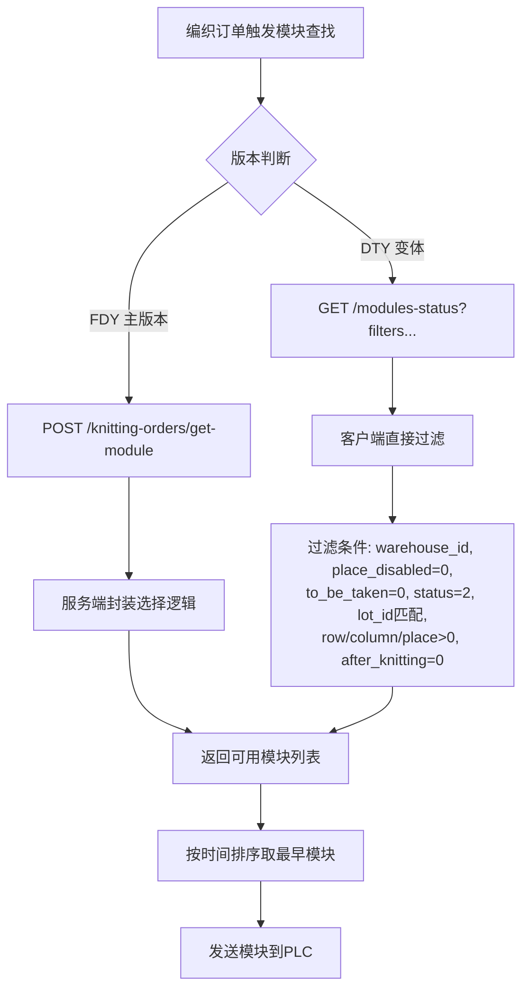
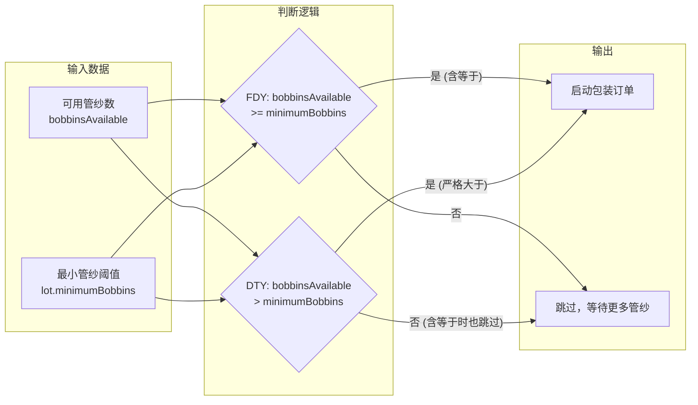
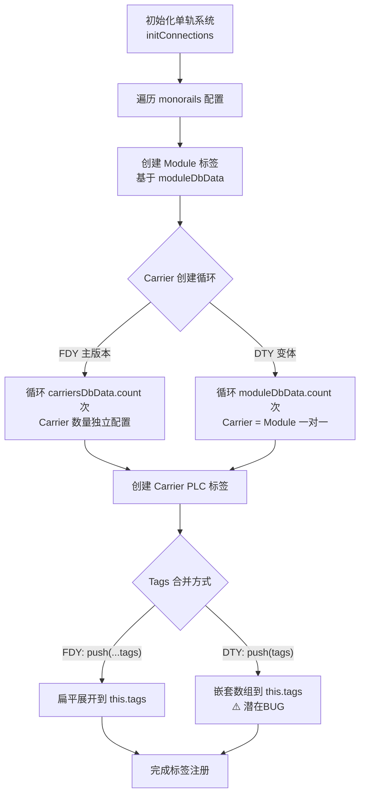
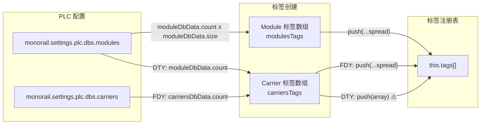
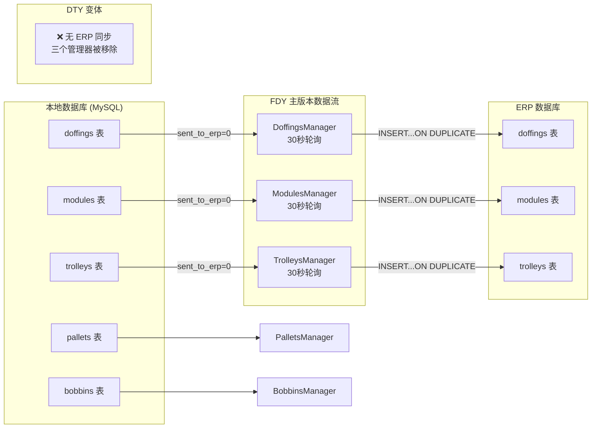
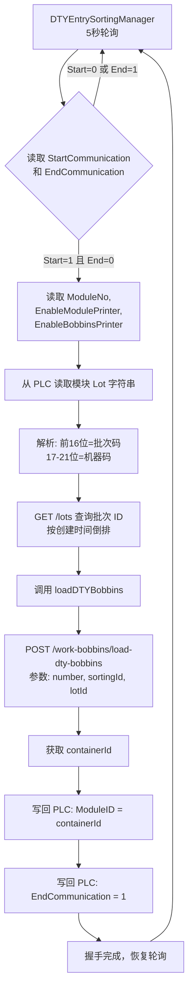
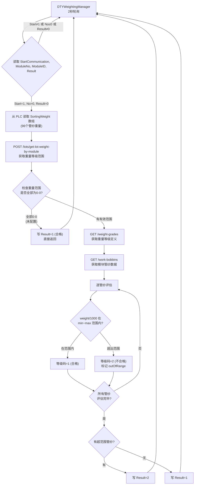
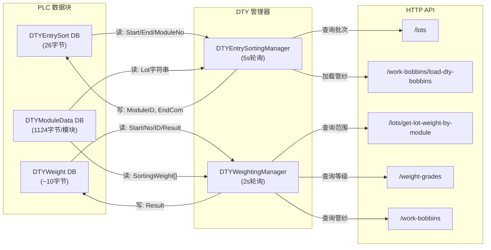
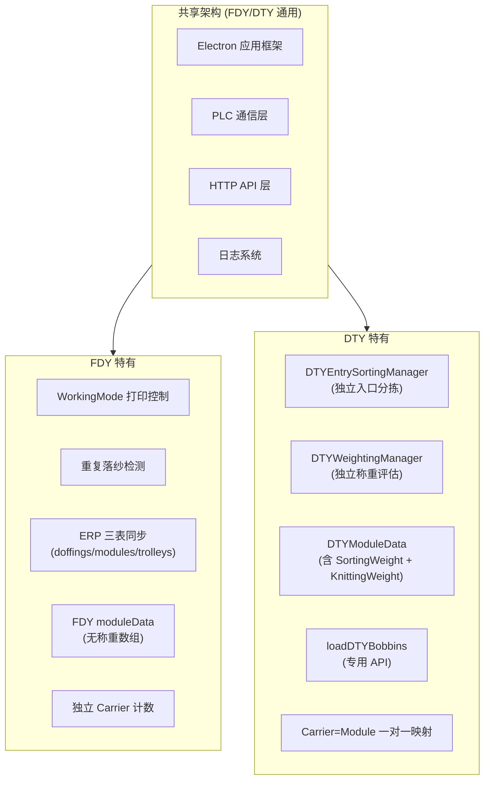
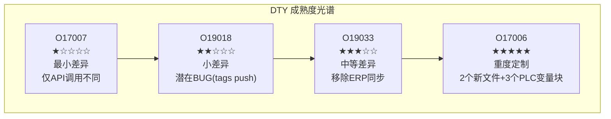

# 10 - DTY 变体深度差异分析 (O17007/O19018/O19033/O17006)

> 基于纯源码逐行解读，深度对比 FDY 主版本与 DTY 变体。

---

## 1. O17007 DTY 变体分析（仓库管理系统）

### 1.1 文件差异统计

| 维度 | 主版本 (FDY) | DTY 变体 | 差异 |
|------|-------------|----------|------|
| JS 文件数 | 13 | 13 | 相同 |
| package.json 版本 | 1.1.11 | 1.1.9 | DTY 版本更低 |
| index.js | 相同 | 相同 | 无差异 |

**文件清单完全一致：** variables.js, http.js, logger.js, O17007.js, StatusManager.js, EndLotManager.js, KnittingOrdersManager.js, PackingOrdersManager.js, DTYOrdersManager.js, DTYPackingOrdersManager.js, DTYWarehouseManager.js, Warehouse.js, WarehouseManager.js

**有差异的文件（3个）：**

| 文件 | 差异性质 | 影响等级 |
|------|---------|---------|
| KnittingOrdersManager.js | 模块查找方式不同 | 高 |
| PackingOrdersManager.js | 最小管纱判断条件不同 | 中 |
| DTYPackingOrdersManager.js | 最小管纱判断条件不同 | 中 |

### 1.2 配置差异

仅 `package.json` 版本号不同：
- 主版本：`1.1.11`（更高，说明主版本开发活跃度更高）
- DTY 变体：`1.1.9`

### 1.3 DTY 仓库管理核心差异

#### 1.3.1 模块查找方式差异 (KnittingOrdersManager.js)

**主版本 (FDY)** — 使用 POST 请求委托服务器端选择模块：
```javascript
const response = await axios.post('/knitting-orders/get-module', {
  orderId: order.id, warehouseId
});
```

**DTY 变体** — 使用 GET 请求直接带查询参数过滤模块：
```javascript
const response = await axios.get(
  `/modules-status?filters[ms.warehouse_id][eq]=${warehouseId}&filters[ms.place_disabled][eq]=0&filters[ms.to_be_taken][eq]=0&filters[ms.status][eq]=2&filters[ms.lot_id][eq]=${order.lot.id}&filters[ms.row][!lte]=0&filters[ms.column][!lte]=0&filters[ms.place][!lte]=0&filters[ms.after_knitting][eq]=0`
);
```

**分析：** 主版本将模块选择逻辑封装到了服务器端 API (`/knitting-orders/get-module`)，而 DTY 变体仍在客户端通过详细的过滤条件直接查询 `modules-status`。主版本的注释掉了旧 GET 方式，说明这是一个演进过程 —— 主版本升级到了更新的 API，DTY 变体尚未跟进。

#### 1.3.2 最小管纱数判断条件差异 (PackingOrdersManager.js / DTYPackingOrdersManager.js)

**主版本 (FDY)：** `>=`（大于等于）
```javascript
if (bobbinsAvailable >= tempOrder.lot.minimumBobbins) {
```

**DTY 变体：** `>`（严格大于）
```javascript
if (bobbinsAvailable > tempOrder.lot.minimumBobbins) {
```

**分析：** 主版本允许"刚好等于最小管纱数"时启动包装订单，DTY 变体要求必须"超过"最小管纱数。这意味着 DTY 的管纱可用性判断更严格 —— 在边界情况下不会启动包装。这是一个业务逻辑差异，可能是 DTY 丝的管纱更大、更重，需要更高的冗余安全阈值。

#### 1.3.3 O17007 DTY 模块查找流程图



#### 1.3.4 O17007 DTY 包装订单数据流图



---

## 2. O19018 DTY 变体分析（单轨系统/码垛控制）

### 2.1 文件差异统计

| 维度 | 主版本 (FDY) | DTY 变体 | 差异 |
|------|-------------|----------|------|
| JS 文件数 | 4 | 4 | 相同 |
| package.json 版本 | 1.0.16 | 1.0.15 | DTY 版本更低 |
| index.js | 相同 | 相同 | 无差异 |

**文件清单完全一致：** O19018.js, http.js, logger.js, variables.js

**有差异的文件（1个）：** O19018.js

| 差异点 | 行号 | 性质 |
|--------|------|------|
| singleIstance 调用 | 75 | DTY 启用 / 主版本注释掉 |
| 调试代码块 | 155-161 | 主版本有调试代码 / DTY 无 |
| carrier 循环计数器 | 444 | 使用不同的变量名 |
| tags push 方式 | 474 | 展开操作符 vs 直接 push |

### 2.2 PLC 标签映射差异

#### 2.2.1 单实例锁 (singleIstance)

**主版本 (FDY)：** 注释掉了单实例锁
```javascript
//this.singleIstance();
```

**DTY 变体：** 启用了单实例锁
```javascript
this.singleIstance();
```

**分析：** DTY 变体启用了 Electron 应用的单实例锁（`app.requestSingleInstanceLock()`），防止同时运行多个实例。主版本可能在调试时禁用了此功能。

#### 2.2.2 调试代码遗留

主版本在第 155-161 行包含一段被注释掉的调试代码：
```javascript
/* const tag = `monorail1.Carrier[99].ModuleNo`;
   const temp = this.tags.find(o => o.name === tag);
   console.log(temp);
   const tag2 = `palletizer1.PLC_to_PC.ContinueOrder`;
   const readVariable = await this.communication.readVariable(tag2);
   console.log(readVariable); */
```

DTY 变体不包含此调试代码，代码更干净。

#### 2.2.3 Carrier 循环计数器 BUG

**主版本 (FDY)：** 使用 `carriersDbData.count` 作为循环上界
```javascript
for (let i = 0; i < carriersDbData.count; i++) {
```

**DTY 变体：** 使用 `moduleDbData.count` 作为循环上界
```javascript
for (let i = 0; i < moduleDbData.count; i++) {
```

**分析：** 这是一个关键差异。主版本用 Carrier 自身的计数来决定创建多少个 Carrier 标签，DTY 变体用 Module 的计数来决定。这反映了 DTY 产线的物理拓扑差异：DTY 的 Carrier 数量与 Module 数量相等（一对一映射），而 FDY 的 Carrier 可以有独立的数量配置。

#### 2.2.4 Tags Push 方式差异

**主版本 (FDY)：** 使用展开操作符
```javascript
this.tags.push(...carriersTags);
```

**DTY 变体：** 直接 push 数组（可能是 BUG）
```javascript
this.tags.push(carriersTags);
```

**分析：** DTY 变体的写法会将整个数组作为单个元素 push 进 `this.tags`，而非展开各个 tag。这**可能是一个 BUG** —— `this.tags` 中会包含一个嵌套数组而非扁平的标签对象。但如果下游代码做了 `flat()` 处理或特殊处理，也可能不影响功能。

#### 2.2.5 O19018 DTY PLC 标签映射流程图



#### 2.2.6 O19018 DTY 数据流图



---

## 3. O19033 DTY 变体分析（卷绕/落纱/码垛管理）

### 3.1 文件差异统计

| 维度 | 主版本 (FDY) | DTY 变体 | 差异 |
|------|-------------|----------|------|
| JS 文件数 | 10 | 7 | DTY 少 3 个文件 |
| package.json 版本 | 2.0.9 | 2.0.7 | DTY 版本更低 |
| index.js | 相同 | 相同 | 无差异 |

**文件对比：**

| 文件 | 主版本 | DTY 变体 | 说明 |
|------|--------|----------|------|
| O19033.js | ✅ | ✅ | 有差异 |
| bobbinsManager.js | ✅ | ✅ | 相同 |
| doffingsManager.js | ✅ | ❌ | **DTY 删除** |
| dtyPalletsManager.js | ✅ | ✅ | 相同 |
| http.js | ✅ | ✅ | 相同 |
| logger.js | ✅ | ✅ | 相同 |
| modulesManager.js | ✅ | ❌ | **DTY 删除** |
| palletsManager.js | ✅ | ✅ | 相同 |
| trolleysManager.js | ✅ | ❌ | **DTY 删除** |
| ws.js | ✅ | ✅ | 相同 |

### 3.2 DTY 设备同步差异

#### 3.2.1 被移除的三个 ERP 同步模块

DTY 变体删除了三个负责向 ERP 系统同步数据的管理器：

| 模块 | 行数 | 功能 | 同步内容 |
|------|------|------|---------|
| **doffingsManager.js** | 105 | 落纱数据同步到 ERP | 落纱 ID、批次规格、订单号、纺纱线名、络纬机名、纸管颜色 |
| **modulesManager.js** | 119 | 模块数据同步到 ERP | 模块编号、装载时间、批次号、两个落纱 ID、两条线名和络纬机名 |
| **trolleysManager.js** | 119 | 小车数据同步到 ERP | 小车编号、装载时间、批次号、两个落纱 ID、两条线名和络纬机名 |

**三个模块的共同模式：**
1. 定时轮询（每 30 秒）查询 `sent_to_erp = 0` 的记录
2. 批量（每次最多 1000 条）`INSERT ... ON DUPLICATE KEY UPDATE` 到 ERP 数据库
3. 写入成功后更新本地 `sent_to_erp = 1` 标志

**DTY 不需要这些模块的原因：** DTY 产线不需要将落纱、模块、小车数据同步到 ERP 数据库。这表明 DTY 的 ERP 集成方案不同于 FDY —— 可能 DTY 有独立的 ERP 通道，或者 DTY 的业务流程中不需要这些数据的 ERP 报送。

#### 3.2.2 ERP 数据库连接方式差异

**主版本 (FDY)：** 使用自定义 `Db` 类连接
```javascript
this.erpDb = new Db();
await this.erpDb.create(config.erpServerDatabase);
```

**DTY 变体：** 使用 `mssql.ConnectionPool` 直连
```javascript
this.erpDb = await new mssql.ConnectionPool(config.erpDatabase).connect();
```

**关键区别：**
- 主版本使用 `config.erpServerDatabase`（自定义 MySQL Db 封装）
- DTY 变体使用 `config.erpDatabase`（直接 MSSQL 连接池）
- DTY 变体注释掉了 `await this.connectErpDatabase()` 调用，实际**不连接 ERP**

**分析：** DTY 变体虽然保留了 ERP 连接代码并改用了 MSSQL 驱动，但实际初始化时注释掉了连接调用。这意味着 DTY O19033 实际运行时不连接 ERP 数据库，与移除三个 ERP 同步模块一致。

#### 3.2.3 DTY dtyPalletsManager 停止调度的差异

主版本的 `stopScheduling()` 包含停止 `dtyPalletsManager`：
```javascript
this.doffingsManager.stopScheduling();
this.dtyPalletsManager.stopScheduling();  // 主版本有，DTY无
this.trolleysManager.stopScheduling();
this.modulesManager.stopScheduling();
```

DTY 变体移除了所有四行，因为对应的管理器要么被删除（doffings/trolleys/modules），要么不再由 O19033 管理（dtyPallets 的 stop 可能由外部控制）。

#### 3.2.4 O19033 DTY 架构差异流程图


#### 3.2.5 O19033 ERP 数据流对比图



---

## 4. O17006 DTY 变体分析（分拣系统）

### 4.1 文件差异统计

| 维度 | 主版本 (FDY) | DTY 变体 | 差异 |
|------|-------------|----------|------|
| JS 文件数 | 14 | 16 | **DTY 多 2 个文件** |
| package.json 版本 | 2.1.5 | 2.1.10 | **DTY 版本更高！** |
| index.js | 相同 | 相同 | 无差异 |

**注意：** 这是唯一一个 DTY 版本号高于主版本的程序，说明 DTY O17006 开发活跃度高于 FDY。

**文件对比：**

| 文件 | 主版本 | DTY 变体 | 差异说明 |
|------|--------|----------|---------|
| DTYEntrySortingManager.js | ❌ | ✅ | **DTY 新增** |
| DTYWeightingManager.js | ❌ | ✅ | **DTY 新增** |
| variables.js | ✅ | ✅ | DTY 增加 219 行（3个新 PLC 变量定义） |
| functions.js | ✅ | ✅ | DTY 增加 loadDTYBobbins 函数，移除 FDY 偏移 |
| O17006.js | ✅ | ✅ | DTY 按 monorail.type 选择变量定义 |
| Sorting.js | ✅ | ✅ | DTY 增加 DTYEntrySort + DTYWeight 子系统 |
| SortingManager.js | ✅ | ✅ | DTY 移除 WorkingMode |
| SortingPrinter.js | ✅ | ✅ | DTY 移除 workingMode 参数 |
| EntrySortingManager.js | ✅ | ✅ | DTY 移除重复落纱检测 |
| WeightingManager.js | ✅ | ✅ | DTY 移除 functions/config 导入 |
| EidosPrinter.js | ✅ | ✅ | 相同 |
| MacsaPrinter.js | ✅ | ✅ | 相同 |
| KnittingManager.js | ✅ | ✅ | 相同 |
| VisionDataManager.js | ✅ | ✅ | 相同 |
| http.js | ✅ | ✅ | 相同 |
| logger.js | ✅ | ✅ | 相同 |

### 4.2 DTY 分拣/打印差异

#### 4.2.1 DTY 新增 PLC 变量定义 (variables.js)

DTY 变体新增了三套 PLC 数据块变量定义（共 219 行）：

**① `variables.DTYEntrySort` — DTY 入口分拣数据块（size: 26 字节）**

| 变量名 | 数据类型 | 偏移量 | 用途 |
|--------|---------|--------|------|
| StartCommunication | INT | 0 | 通信握手开始 |
| ModuleNo | INT | 2 | 模块编号 |
| EnableModulePrinter | INT | 8 | 启用模块打印机 |
| EnableBobbinsPrinter | INT | 10 | 启用管纱打印机 |
| EndCommunication | INT | 16 | 通信握手结束 |
| ModuleID | DINT | 18 | 模块数据库 ID |

> 注：原始代码中偏移量 4 的 ModuleID (DINT) 被注释掉，改为偏移量 18。

**② `variables.DTYWeight` — DTY 称重站数据块（size: 0，仅4个变量）**

| 变量名 | 数据类型 | 偏移量 | 用途 |
|--------|---------|--------|------|
| StartCommunication | X (BIT) | 0.0 | 称重通信开始（位信号） |
| ModuleNo | INT | 2 | 模块编号 |
| ModuleID | DINT | 4 | 模块数据库 ID |
| Result | INT | 8 | 称重结果 |

> 注：DTYWeight 的 StartCommunication 用 `X` 类型（位地址），而 DTYEntrySort 用 `INT` 类型。

**③ `variables.DTYModuleData` — DTY 模块数据块（size: 1124 字节）**

| 变量名 | 数据类型 | 偏移量 | 数组长度 | 用途 |
|--------|---------|--------|---------|------|
| ModuleNo | INT | 0 | - | 模块编号 |
| ModuleID | DINT | 2 | - | 模块 ID |
| Lot | CHAR | 6 | 21 | 批次号（含机器码） |
| LineNo | BYTE | 28 | - | 线号 |
| KnittingDone | X | 29.0 | - | 编织完成标志 |
| Status | BYTE | 30 | 96 | 管纱状态数组 |
| Grade | BYTE | 126 | 96 | 等级数组 |
| SortingGrade | BYTE | 222 | 96 | 分拣等级数组 |
| VisionGrade | BYTE | 318 | 96 | 视觉等级数组 |
| KnittingGrade | BYTE | 414 | 96 | 编织等级数组 |
| SortingDefect | BYTE | 510 | 96 | 分拣缺陷数组 |
| VisionDefect | BYTE | 606 | 96 | 视觉缺陷数组 |
| SortingWeight | INT | 702 | 96 | 分拣重量数组 |
| KnittingWeight | INT | 894 | 96 | 编织重量数组 |

**对比主版本 `moduleData`：** DTY 版本包含了 SortingWeight 和 KnittingWeight 两个称重数组（各 96 个 INT = 192 字节），这是 FDY moduleData 中没有的。DTY 的模块数据块比 FDY 更大（1124 vs 约 700 字节），因为 DTY 需要在 PLC 级别存储称重数据。

#### 4.2.2 DTY 新增文件: DTYEntrySortingManager.js（150行）

这是一个全新的 DTY 专用入口分拣管理器，功能是在 DTY 分拣线入口处对模块进行扫描和管纱加载。

**核心流程：**

1. **轮询启动通信**（5秒间隔）：读取 `StartCommunication` 和 `EndCommunication` 信号
2. **读取模块数据**：当 Start=1 且 End=0 时，读取 ModuleNo、EnableModulePrinter、EnableBobbinsPrinter
3. **批次匹配**：从模块的 PLC 数据中读取 Lot 字符串（前 16 位为批次码，17-21 位为机器码），查询 API 获取批次 ID
4. **加载 DTY 管纱**：调用 `/work-bobbins/load-dty-bobbins`（DTY 专用 API）
5. **回写 PLC**：将容器 ID 写回 `ModuleID`，设置 `EndCommunication=1` 完成握手

**关键代码特征：**
- 模块编号偏移: `this.modules[number - 2001]` — DTY 模块编号从 2001 开始
- Lot 字符串解析: `substring(0,16)` 为批次码, `substring(17,21)` 为机器码
- 使用 `loadDTYBobbins` 函数（functions.js 新增）而非 FDY 的 `loadBobbins`

#### 4.2.3 DTY 新增文件: DTYWeightingManager.js（140行）

DTY 专用称重管理器，在分拣过程中对模块中的管纱进行重量评估。

**核心流程：**

1. **轮询通信**（2秒间隔）：读取 StartCommunication、ModuleNo、ModuleID、Result
2. **触发条件**：StartCommunication=1 且 ModuleNo>0 且 Result=0
3. **读取重量**：从 PLC 读取模块的 `SortingWeight` 数组
4. **获取批次重量范围**：调用 `/lots/get-lot-weight-by-module` 获取各等级的重量上下限
5. **逐管纱评估**：
   - 如果所有重量范围都是 0-0（未配置），直接写 Result=1（合格）返回
   - 对每个管纱，查找其分拣等级对应的重量范围
   - 重量在范围内 → 等级码 1（合格），超出范围 → 等级码 2（不合格）
6. **写回结果**：有任何超范围 → Result=2，全部合格 → Result=1

**关键计算逻辑：**
```javascript
if (weight / 1000 >= weightRanges[gradeId].min &&
    weight / 1000 <= weightRanges[gradeId].max) {
    results.push(weightGrades.find(o => o.code == 1).id); // 合格
} else {
    outOfRange = true;
    results.push(weightGrades.find(o => o.code == 2).id); // 不合格
}
```

> 注：PLC 中的重量单位为克（整数），API 中的范围单位为千克，因此 `weight / 1000` 做了单位转换。

#### 4.2.4 functions.js 差异

**主版本 (FDY) 独有：** FDY 类型的模块编号偏移
```javascript
if (config.lineType === 'FDY') {
    moduleNumber += 2000;
}
```

**DTY 变体新增：** `loadDTYBobbins` 函数
```javascript
async function loadDTYBobbins(number, sortingId, lotId) {
    const params = new URLSearchParams();
    params.append('number', moduleNumber);
    params.append('sortingId', sortingId);
    params.append('lotId', lotId);
    const response = await axios.post('/work-bobbins/load-dty-bobbins', params);
    return response.data.containerId;
}
module.exports = { loadBobbins, loadDTYBobbins };
```

**分析：** FDY 的 `loadBobbins` 使用 `/work-bobbins/load-bobbins` 并自动加 2000 偏移；DTY 的 `loadDTYBobbins` 使用 `/work-bobbins/load-dty-bobbins` 且不加偏移但额外需要 `sortingId` 和 `lotId` 参数。

#### 4.2.5 O17006.js 模块变量选择

DTY 变体增加了按 `monorail.type` 动态选择模块变量定义：

```javascript
let modulesVariables = variables.moduleData;
if (monorail.type === 'dty') modulesVariables = variables.DTYModuleData;
```

这意味着同一个 O17006 程序可以同时支持 FDY 和 DTY 单轨，通过配置中的 `monorail.type` 字段区分。

#### 4.2.6 WorkingMode 移除

主版本在分拣管理中使用 `WorkingMode` 变量来控制打印机行为：

**主版本 SortingManager.js：**
```javascript
let tagsNames = ['PLC_to_PC.Printer.ModuleID', 'PLC_to_PC.Printer.WorkingMode',
                 'PLC_to_PC.Printer.Start', 'PC_to_PLC.Printer.ModuleRead'];
// ...
const workingMode = variables.find(o => o.name === tagName);
// ...
this.printers.forEach(o => {
    o.moduleBobbins = this.moduleBobbins;
    o.workingMode = workingMode;
});
```

**DTY SortingManager.js：**
```javascript
let tagsNames = ['PLC_to_PC.Printer.ModuleID',
                 'PLC_to_PC.Printer.Start', 'PC_to_PLC.Printer.ModuleRead'];
// ...（无 WorkingMode）
this.printers.forEach(o => (o.moduleBobbins = this.moduleBobbins));
```

**影响传递：** SortingPrinter.js 的构造函数和打印逻辑也相应移除了 `workingMode` 参数：
- 主版本：`getBobbinPosition(this.index, step.value, this.workingMode.value)`
- DTY：`getBobbinPosition(this.index, step.value)`

**分析：** FDY 有多种工作模式（可能是不同的管纱排列方式），打印时需要根据 WorkingMode 计算管纱位置。DTY 只有一种标准排列方式，不需要此参数。

#### 4.2.7 重复落纱检测移除 (EntrySortingManager.js)

**主版本独有逻辑：** 检测重复落纱并发送通知
```javascript
this.lastModule = null;
// ...
const isDuplicate = await this.checkIfDuplicateDoffings(id1, id2);
if (isDuplicate && this.lastModule !== number) {
    await axios.post('/notifications', {
        type: 'modules',
        data: JSON.stringify({ id1, id2, moduleNumber: number })
    });
    this.lastModule = number;
    return;
}
this.lastModule = null;
```

`checkIfDuplicateDoffings` 方法查询 `modules/printed` API 检查是否有相同落纱 ID 的已打印模块。

**DTY 变体：** 完全移除了此逻辑（无 `lastModule` 属性、无 `checkIfDuplicateDoffings` 方法、无通知发送）。

**分析：** FDY 需要检测重复落纱（同一个落纱装入了两个模块），因为 FDY 的模块共享落纱时可能产生冲突。DTY 的落纱不存在此共享问题，因此不需要重复检测。

#### 4.2.8 WeightingManager.js 精简

DTY 变体移除了 `functions.js` 和 `config.js` 的导入：
```diff
- const { loadBobbins } = require('./functions');
- const path = require('path');
- const config = require(path.join(process.cwd(), 'setup', 'config.js'));
```

**分析：** DTY 有独立的 `DTYWeightingManager.js` 处理 DTY 称重，原 `WeightingManager.js` 中不再需要 DTY 相关的函数引用。

#### 4.2.9 DTY O17006 入口分拣流程图



#### 4.2.10 DTY O17006 称重评估流程图



#### 4.2.11 DTY O17006 数据流图



---

## 5. DTY 变体统一架构总结

### 5.1 DTY vs FDY 差异全景

| 维度 | FDY 主版本 | DTY 变体 | 差异来源 |
|------|-----------|----------|---------|
| **模块编号范围** | 通常需要 +2000 偏移 | 原始编号，从 2001 开始 | DTY 物理编号方案不同 |
| **管纱阈值** | `>=` (含等于) | `>` (严格大于) | DTY 管纱更大，需要更高安全裕量 |
| **工作模式** | 支持多种 WorkingMode | 单一模式，无 WorkingMode | DTY 管纱排列固定 |
| **模块查找 API** | POST 封装式 API | GET 直接过滤查询 | DTY 未跟进 API 升级 |
| **ERP 同步** | 完整的三表同步 | 移除 ERP 同步 | DTY 有独立 ERP 方案 |
| **称重系统** | 共用 WeightingManager | 独立 DTYWeightingManager | DTY 有专用称重逻辑 |
| **入口分拣** | 共用 EntrySortingManager | 独立 DTYEntrySortingManager | DTY 有专用入口分拣 |
| **重复落纱检测** | 有检测+通知 | 无检测 | DTY 不存在落纱共享 |
| **PLC 数据块** | moduleData | DTYModuleData (含称重数组) | DTY 模块数据更大更丰富 |
| **Carrier 映射** | 独立数量配置 | 与 Module 一对一 | DTY 产线物理拓扑不同 |

### 5.2 DTY 变体架构模式



### 5.3 各程序 DTY 改动量统计

| 程序 | 改动文件数 | 新增文件 | 删除文件 | 新增代码行 | 改动性质 |
|------|-----------|---------|---------|-----------|---------|
| **O17007** | 3/13 | 0 | 0 | ~5 | 微调：API 方式 + 阈值条件 |
| **O19018** | 1/4 | 0 | 0 | ~5 | 微调：计数器 + 单实例锁 |
| **O19033** | 1/10 | 0 | 3 | 0 (净删除) | 精简：移除 ERP 同步 |
| **O17006** | 8/14 | 2 | 0 | ~530 | **重度定制**：专用子系统 |

### 5.4 DTY 变体成熟度评估



---

## 6. 问题发现

### 6.1 确认的 BUG

| 编号 | 程序 | 文件 | 问题 | 严重级别 |
|------|------|------|------|---------|
| BUG-1 | O19018 DTY | O19018.js:467 | `this.tags.push(carriersTags)` 应为 `this.tags.push(...carriersTags)`，当前会将数组作为单个元素 push 而非展开 | **高** |

### 6.2 潜在问题

| 编号 | 程序 | 文件 | 问题 | 建议 |
|------|------|------|------|------|
| WARN-1 | O17007 DTY | KnittingOrdersManager.js | 使用旧式 GET 过滤 API，主版本已升级为 POST 封装 | 建议统一升级到 POST API |
| WARN-2 | O17007 | PackingOrdersManager.js | FDY 用 `>=`、DTY 用 `>`，管纱阈值语义不一致 | 确认是否为有意设计差异 |
| WARN-3 | O19033 DTY | O19033.js | ERP 连接代码保留但注释掉，且连接方式从 MySQL Db 改为 MSSQL ConnectionPool | 建议彻底移除无用代码 |
| WARN-4 | O17006 DTY | DTYWeightingManager.js:14 | `this.modules = modules;` 重复赋值两次（第11行和第14行） | 冗余代码，建议删除一处 |
| WARN-5 | O17006 DTY | DTYEntrySortingManager.js | 大量管纱数据写回代码被注释掉（SortingGrade/SortingDefect 写入），只写 ModuleID | 确认是否为待实现功能 |
| WARN-6 | O17006 DTY | DTYWeightingManager.js | `axios.post('work-bobbins/update-after-weighting', ...)` 被注释掉 | 称重结果未写回数据库，仅写回 PLC |

### 6.3 版本同步问题

| 程序 | FDY 版本 | DTY 版本 | 状态 |
|------|---------|---------|------|
| O17007 | 1.1.11 | 1.1.9 | DTY 落后 2 个版本 |
| O19018 | 1.0.16 | 1.0.15 | DTY 落后 1 个版本 |
| O19033 | 2.0.9 | 2.0.7 | DTY 落后 2 个版本 |
| O17006 | 2.1.5 | 2.1.10 | **DTY 领先 5 个版本** |

**关键洞察：** O17006 是 DTY 变体开发重心所在，DTY 版本远高于 FDY，包含最多的专有逻辑（入口分拣 + 称重评估）。其他三个程序的 DTY 变体都落后于 FDY 主版本，存在版本同步风险。

### 6.4 架构改进建议

1. **统一 API 模式：** O17007 DTY 应升级到 POST `/knitting-orders/get-module`，与主版本保持一致
2. **修复 O19018 BUG：** `this.tags.push(carriersTags)` → `this.tags.push(...carriersTags)`
3. **清理死代码：** O19033 DTY 中保留的 ERP 连接代码应彻底移除
4. **完成 O17006 DTY 功能：** 被注释掉的管纱数据写回和称重结果更新可能是未完成的功能
5. **建立分支策略：** 考虑通过配置 (`monorail.type`) 统一 FDY/DTY 代码，而非维护独立副本（O17006 已部分实现此模式）
