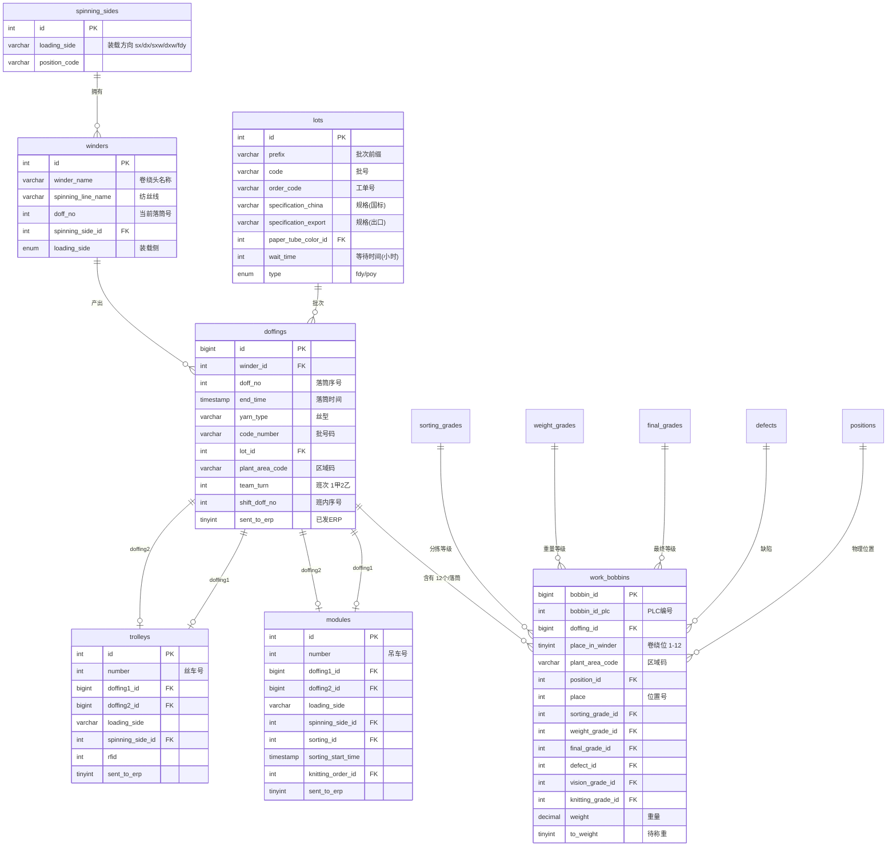
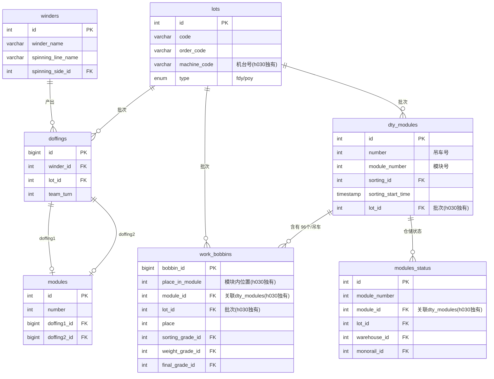
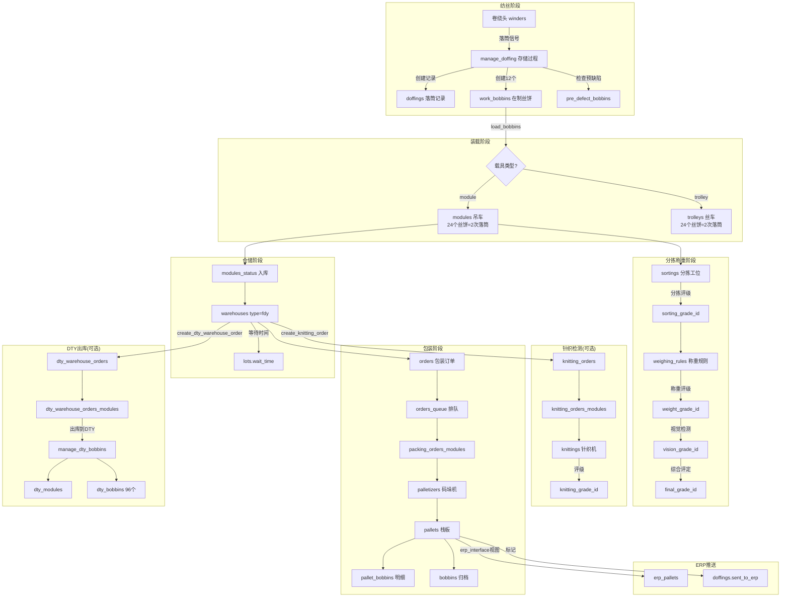
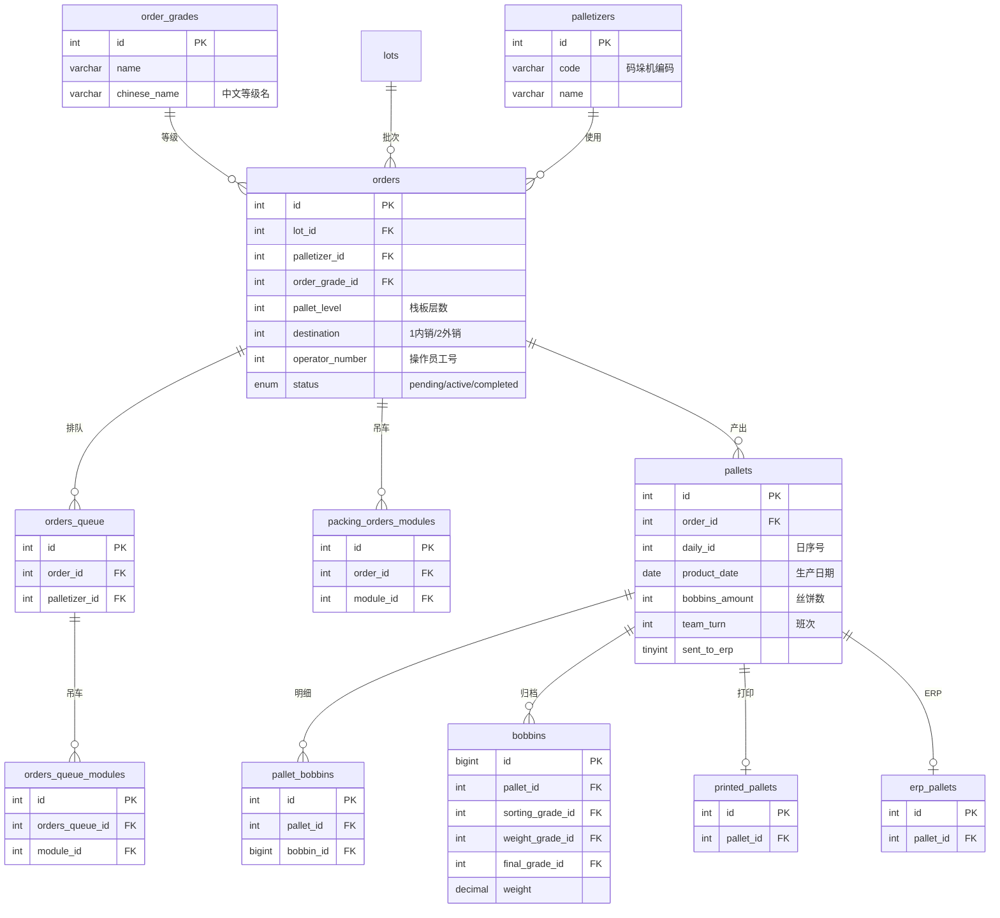
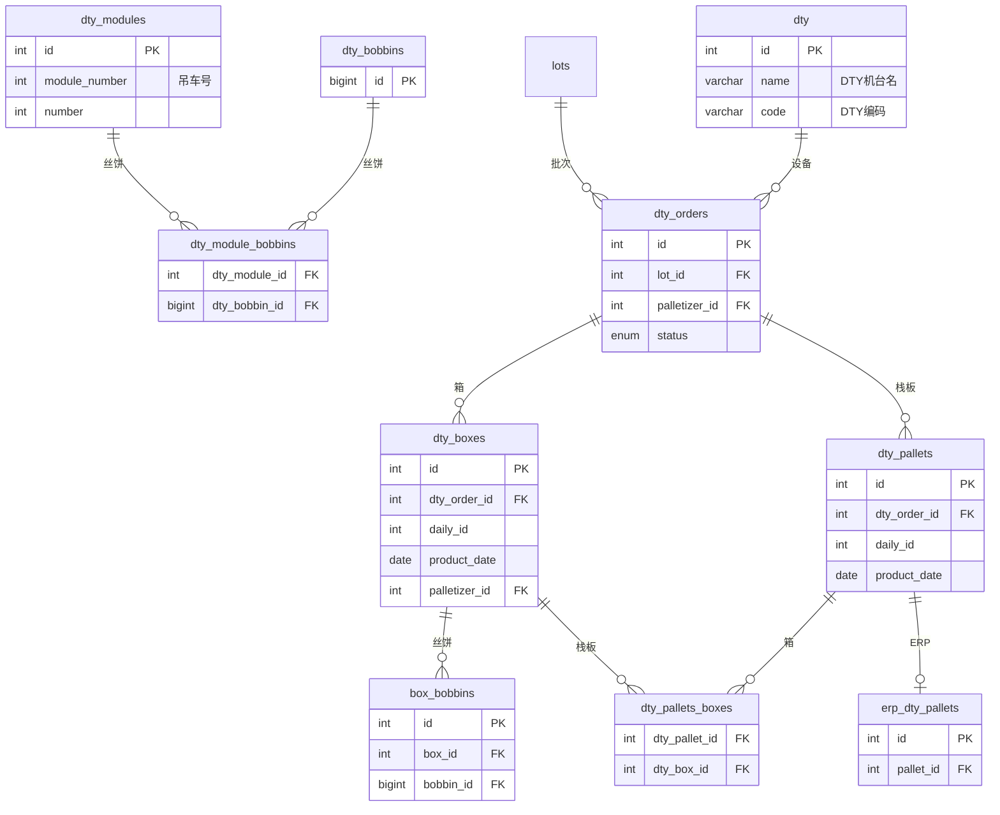
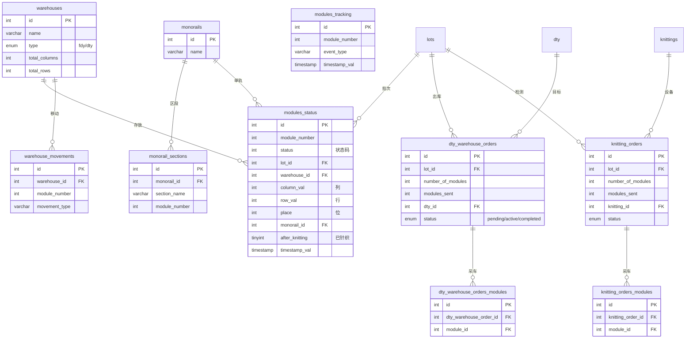
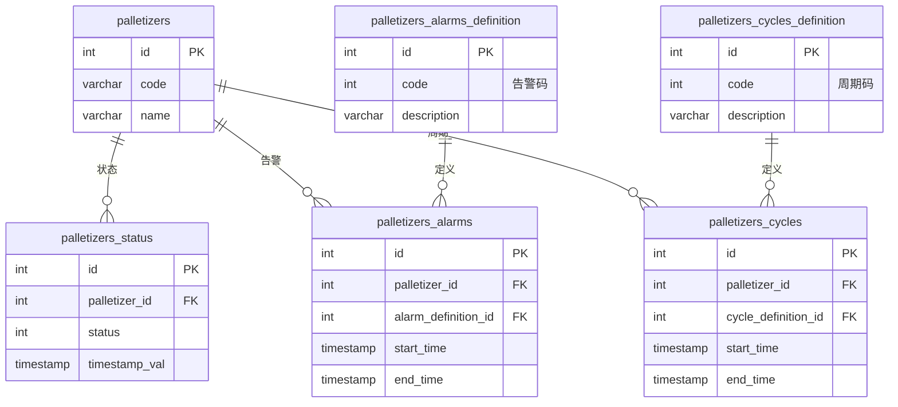
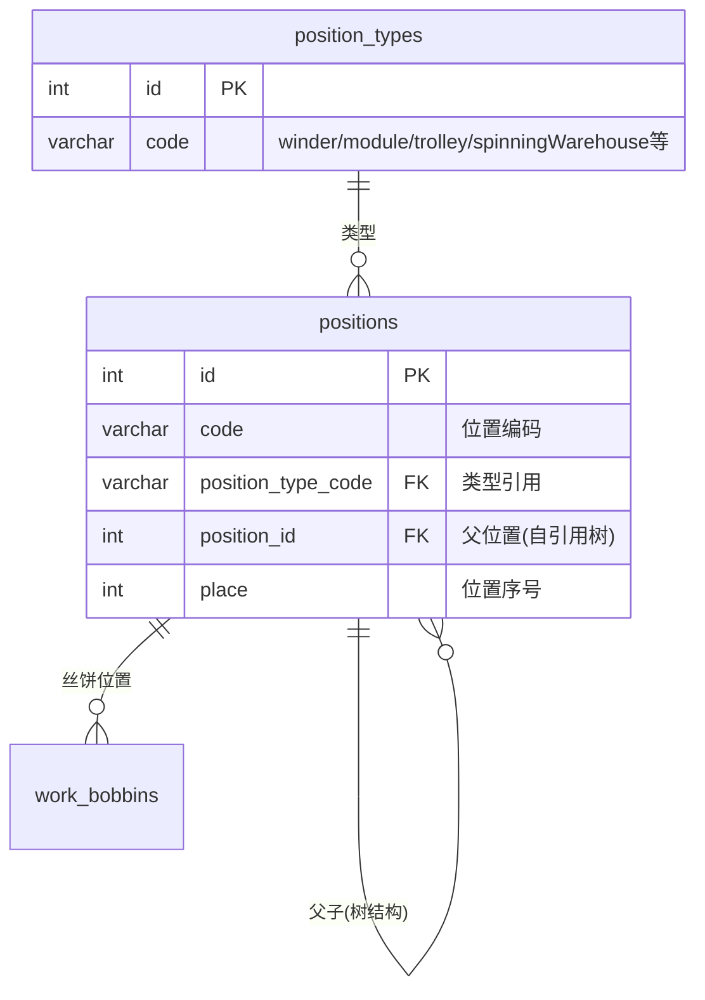
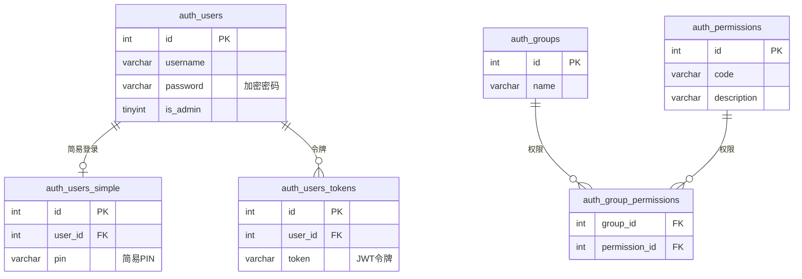
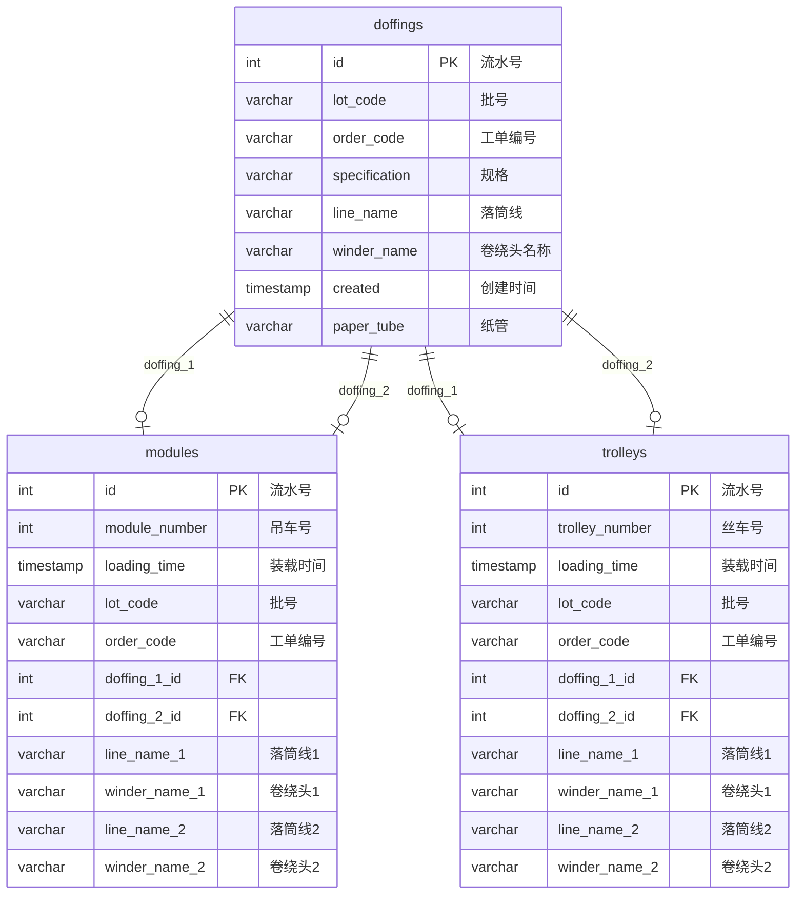

# V2 系统 MySQL 数据库架构深度分析

> **分析范围**: h028 (FDY主库, 98表), h030 (DTY主库, 99表), fangsi (纺丝交换库, 3表)
>
> **分析方法**: 纯DDL/存储过程源码分析
>
> **数据库引擎**: MySQL 8.0, InnoDB, utf8mb4

---

## 目录

1. [数据库总览](#1-数据库总览)
2. [业务域分组](#2-业务域分组)
3. [核心业务域 ER 图与数据流](#3-核心业务域-er-图与数据流)
4. [存储过程与函数分析](#4-存储过程与函数分析)
5. [h028 与 h030 差异对比](#5-h028-与-h030-差异对比)
6. [视图分析](#6-视图分析)
7. [fangsi 纺丝交换库分析](#7-fangsi-纺丝交换库分析)
8. [数据架构问题与优化建议](#8-数据架构问题与优化建议)

---

## 1. 数据库总览

### 1.1 三库定位

| 数据库 | 用途 | 表数量 | 视图 | 函数 | 存储过程 |
|--------|------|--------|------|------|----------|
| **h028** | FDY主生产库 | 98 | 5 | 9 | 6 |
| **h030** | DTY主生产库 | 99 | 3 | 9 | 8 |
| **fangsi** | 纺丝数据交换库 | 3 | 0 | 0 | 0 |

### 1.2 h028 完整表清单 (98表)

| 序号 | 表名 | 业务域 |
|------|------|--------|
| 1 | auth_group_permissions | 系统-权限 |
| 2 | auth_groups | 系统-权限 |
| 3 | auth_permissions | 系统-权限 |
| 4 | auth_users | 系统-权限 |
| 5 | auth_users_simple | 系统-权限 |
| 6 | auth_users_tokens | 系统-权限 |
| 7 | bobbins | 丝饼-归档 |
| 8 | box_bobbins | DTY-装箱 |
| 9 | clients_supervision_settings | 系统-监控 |
| 10 | defects | 质量-缺陷 |
| 11 | doffers_alarms | 设备-落筒机告警 |
| 12 | doffers_alarms_definition | 设备-告警定义 |
| 13 | doffers_cycles | 设备-落筒周期 |
| 14 | doffers_cycles_definition | 设备-周期定义 |
| 15 | doffers_status | 设备-落筒状态 |
| 16 | doffings | 生产-落筒记录 |
| 17 | doffings_hourly_production | 生产-落筒产量 |
| 18 | dty | DTY-设备 |
| 19 | dty_bobbins | DTY-丝饼 |
| 20 | dty_boxes | DTY-箱 |
| 21 | dty_module_bobbins | DTY-吊车丝饼关联 |
| 22 | dty_modules | DTY-吊车 |
| 23 | dty_orders | DTY-订单 |
| 24 | dty_pallets | DTY-栈板 |
| 25 | dty_pallets_boxes | DTY-栈板箱关联 |
| 26 | dty_warehouse_orders | 仓库-DTY出库单 |
| 27 | dty_warehouse_orders_modules | 仓库-DTY出库吊车 |
| 28 | erp_bobbins | ERP-丝饼接口 |
| 29 | erp_dty_pallets | ERP-DTY栈板接口 |
| 30 | erp_pallets | ERP-栈板接口 |
| 31 | final_grades | 质量-最终等级 |
| 32 | knitting_grades | 质量-针织等级 |
| 33 | knitting_orders | 质量-针织订单 |
| 34 | knitting_orders_modules | 质量-针织吊车 |
| 35 | knittings | 质量-针织机 |
| 36 | licenses | 系统-许可证 |
| 37 | loading_bobbins_sequence | 生产-装载序列 |
| 38 | lot_grades_ranges | 批次-等级范围 |
| 39 | lot_prefixes | 批次-前缀 |
| 40 | lot_weights | 批次-重量标准 |
| 41 | lots | 批次-主表 |
| 42 | modules | 载具-吊车 |
| 43 | modules_hourly_production | 生产-吊车产量 |
| 44 | modules_status | 仓库-吊车状态 |
| 45 | modules_tracking | 物流-吊车追踪 |
| 46 | monorail_sections | 物流-单轨区段 |
| 47 | monorails | 物流-单轨 |
| 48 | movements | 物流-移动记录 |
| 49 | notifications | 系统-通知 |
| 50 | order_grades | 包装-订单等级 |
| 51 | orders | 包装-订单 |
| 52 | orders_queue | 包装-队列 |
| 53 | orders_queue_modules | 包装-队列吊车 |
| 54 | packing_orders_modules | 包装-订单吊车 |
| 55 | pallet_bobbins | 包装-栈板丝饼 |
| 56 | pallet_boxes | 包装-栈板箱 |
| 57 | palletizers | 设备-码垛机 |
| 58 | palletizers_alarms | 设备-码垛告警 |
| 59 | palletizers_alarms_definition | 设备-码垛告警定义 |
| 60 | palletizers_cycles | 设备-码垛周期 |
| 61 | palletizers_cycles_definition | 设备-码垛周期定义 |
| 62 | palletizers_hourly_production | 生产-码垛产量 |
| 63 | palletizers_last_modules | 设备-码垛最后吊车 |
| 64 | palletizers_sections | 设备-码垛区段 |
| 65 | palletizers_status | 设备-码垛状态 |
| 66 | pallets | 包装-栈板 |
| 67 | pallets_tracking | 物流-栈板追踪 |
| 68 | paper_tube_colors | 基础-纸管颜色 |
| 69 | plant_areas | 基础-工厂区域 |
| 70 | position_types | 基础-位置类型 |
| 71 | positions | 基础-位置 |
| 72 | pre_defect_bobbins | 质量-预缺陷丝饼 |
| 73 | print_servers | 系统-打印服务器 |
| 74 | printed_pallets | 包装-已打印栈板 |
| 75 | settings | 系统-设置 |
| 76 | sorting_grades | 质量-分拣等级 |
| 77 | sortings | 设备-分拣工位 |
| 78 | sortings_hourly_production | 生产-分拣产量 |
| 79 | spinning_sides | 基础-纺丝侧 |
| 80 | spinnings | 基础-纺丝线 |
| 81 | team_turns | 基础-班次 |
| 82 | trolleys | 载具-丝车 |
| 83 | vision_grades | 质量-外观等级 |
| 84 | warehouse_movements | 仓库-移动 |
| 85 | warehouses | 仓库-仓库 |
| 86 | warehouses_alarms | 设备-仓库告警 |
| 87 | warehouses_alarms_definition | 设备-仓库告警定义 |
| 88 | warehouses_cycles | 设备-仓库周期 |
| 89 | warehouses_cycles_definition | 设备-仓库周期定义 |
| 90 | warehouses_read_status | 仓库-读取状态 |
| 91 | warehouses_status | 仓库-仓库状态 |
| 92 | weighing_rules | 质量-称重规则 |
| 93 | weight_grades | 质量-重量等级 |
| 94 | winders | 基础-卷绕头 |
| 95 | winders_check | 质量-卷绕检查 |
| 96 | winders_check_rules | 质量-检查规则 |
| 97 | winders_check_time_slot | 质量-检查时间段 |
| 98 | work_bobbins | 生产-在制丝饼 |

### 1.3 h030 独有表

h030 比 h028 多 1 张表:

| 表名 | 用途 |
|------|------|
| **dty_packing_orders_modules** | DTY 包装订单与吊车的关联表 |

---

## 2. 业务域分组

### 2.1 业务域划分 (8大域)

```
┌─────────────────────────────────────────────────────────────────┐
│                    V2 系统数据库业务域                            │
├───────────┬───────────┬───────────┬──────────┬─────────────────┤
│ 生产域     │ 质量域     │ 仓储物流域 │ 包装域    │ DTY加工域       │
│ (13表)    │ (14表)    │ (13表)     │ (14表)   │ (12表)          │
├───────────┼───────────┼───────────┼──────────┼─────────────────┤
│ 基础数据域  │ 设备监控域  │ ERP接口域  │ 系统域    │                │
│ (12表)    │ (22表)    │ (3表)     │ (11表)   │                │
└───────────┴───────────┴───────────┴──────────┴─────────────────┘
```

### 2.2 生产域 (13表)

核心生产过程的数据记录。

| 表名 | 说明 | 关键字段 |
|------|------|----------|
| doffings | 落筒记录 | winder_id, doff_no, lot_id, yarn_type |
| work_bobbins | 在制丝饼(核心) | doffing_id(h028)/module_id(h030), place, grades |
| loading_bobbins_sequence | 装载顺序映射 | spindle_place, spindle, tunnel_side, new_place |
| modules | 吊车(FDY载具) | number, doffing1_id, doffing2_id, sorting_id |
| trolleys | 丝车(FDY载具) | number, doffing1_id, doffing2_id, rfid |
| lots | 批次主表 | prefix, code, order_code, specification, type |
| lot_prefixes | 批次前缀 | prefix |
| lot_weights | 批次重量标准 | lot_id, level, net, gross |
| lot_grades_ranges | 批次等级范围 | lot_id, grade ranges |
| doffings_hourly_production | 落筒小时产量 | timestamp, winder stats |
| modules_hourly_production | 吊车小时产量 | timestamp, module stats |
| sortings_hourly_production | 分拣小时产量 | timestamp, sorting stats |
| palletizers_hourly_production | 码垛小时产量 | timestamp, palletizer stats |

### 2.3 质量域 (14表)

多维质量评估体系。

| 表名 | 说明 |
|------|------|
| sorting_grades | 分拣等级 (A/B/C/废品) |
| weight_grades | 重量等级 |
| final_grades | 最终等级 (综合评定) |
| vision_grades | 外观等级 (视觉检测) |
| knitting_grades | 针织等级 (织样检测) |
| defects | 缺陷类型定义 |
| pre_defect_bobbins | 预缺陷丝饼标记 |
| knittings | 针织检测机 |
| knitting_orders | 针织检测订单 |
| knitting_orders_modules | 针织订单吊车关联 |
| weighing_rules | 称重规则 |
| winders_check | 卷绕头检查记录 |
| winders_check_rules | 检查规则 |
| winders_check_time_slot | 检查时间段 |

### 2.4 仓储物流域 (13表)

仓库管理与物料追踪。

| 表名 | 说明 |
|------|------|
| warehouses | 仓库定义 (type: fdy/dty) |
| warehouse_movements | 仓库移动记录 |
| warehouses_read_status | 仓库读取状态 |
| warehouses_status | 仓库实时状态 |
| modules_status | 吊车仓储状态 (核心) |
| modules_tracking | 吊车追踪记录 |
| pallets_tracking | 栈板追踪记录 |
| monorails | 单轨系统 |
| monorail_sections | 单轨区段 |
| movements | 移动记录 |
| dty_warehouse_orders | DTY出库订单 |
| dty_warehouse_orders_modules | DTY出库吊车关联 |
| plant_areas | 工厂区域定义 |

### 2.5 包装域 (14表)

打包、码垛、栈板管理。

| 表名 | 说明 |
|------|------|
| orders | 包装订单 (FDY) |
| order_grades | 订单等级 |
| orders_queue | 包装队列 |
| orders_queue_modules | 队列吊车关联 |
| packing_orders_modules | 包装订单吊车关联 |
| pallets | FDY栈板 |
| pallet_bobbins | 栈板丝饼明细 |
| pallet_boxes | 栈板箱关联 |
| printed_pallets | 已打印栈板标签 |
| paper_tube_colors | 纸管颜色 |
| bobbins | 丝饼归档(已入栈板) |
| sortings | 分拣工位 |
| palletizers_sections | 码垛机区段 |
| palletizers_last_modules | 码垛最后处理吊车 |

### 2.6 DTY 加工域 (12表)

DTY 特有的加工、包装流程。

| 表名 | 说明 |
|------|------|
| dty | DTY加工机定义 |
| dty_modules | DTY吊车 |
| dty_bobbins | DTY丝饼 |
| dty_module_bobbins | DTY吊车丝饼关联 |
| dty_orders | DTY包装订单 |
| dty_boxes | DTY箱 |
| dty_pallets | DTY栈板 |
| dty_pallets_boxes | DTY栈板箱关联 |
| box_bobbins | 箱丝饼明细 |
| dty_packing_orders_modules | DTY包装订单吊车 (仅h030) |

### 2.7 设备监控域 (22表)

设备状态、告警、运行周期。

| 设备类型 | 状态表 | 告警表 | 告警定义 | 周期表 | 周期定义 |
|----------|--------|--------|----------|--------|----------|
| 落筒机 doffers | doffers_status | doffers_alarms | doffers_alarms_definition | doffers_cycles | doffers_cycles_definition |
| 码垛机 palletizers | palletizers_status | palletizers_alarms | palletizers_alarms_definition | palletizers_cycles | palletizers_cycles_definition |
| 仓库 warehouses | warehouses_status | warehouses_alarms | warehouses_alarms_definition | warehouses_cycles | warehouses_cycles_definition |

> 每种设备都遵循统一的监控模式: **status + alarms + alarms_definition + cycles + cycles_definition**

### 2.8 ERP 接口域 (3表)

| 表名 | 方向 | 说明 |
|------|------|------|
| erp_bobbins | 出 | 丝饼信息推送到ERP |
| erp_pallets | 出 | FDY栈板信息推送到ERP |
| erp_dty_pallets | 出 | DTY栈板信息推送到ERP |

### 2.9 系统域 (11表)

| 表名 | 说明 |
|------|------|
| auth_users | 用户 |
| auth_users_simple | 简化用户 |
| auth_users_tokens | 用户令牌 |
| auth_groups | 用户组 |
| auth_group_permissions | 组权限关联 |
| auth_permissions | 权限定义 |
| settings | 系统配置 (键值对) |
| licenses | 许可证 |
| notifications | 通知 |
| print_servers | 打印服务器 |
| clients_supervision_settings | 客户端监控设置 |

### 2.10 基础数据域 (12表)

| 表名 | 说明 |
|------|------|
| winders | 卷绕头 |
| spinning_sides | 纺丝侧 |
| spinnings | 纺丝线 |
| positions | 位置 (通用位置树) |
| position_types | 位置类型 |
| team_turns | 班次 |
| palletizers | 码垛机 |

---

## 3. 核心业务域 ER 图与数据流

### 3.1 生产核心 - 落筒与丝饼生命周期 (h028 FDY)



### 3.2 生产核心 - 落筒与丝饼生命周期 (h030 DTY)



### 3.3 FDY 丝饼生命周期数据流



### 3.4 包装与栈板域 ER 图



### 3.5 DTY 加工域 ER 图



### 3.6 仓储与物流域 ER 图



### 3.7 设备监控域 ER 图



> 落筒机(doffers)和仓库(warehouses)采用完全相同的监控表模式。

### 3.8 位置管理域 ER 图



> positions 表采用**自引用树结构**，构建层级: 纺丝侧 &gt; 纺丝仓库 &gt; 仓库位 &gt; 卷绕位/模块位

### 3.9 认证与权限 ER 图



---

## 4. 存储过程与函数分析

### 4.1 函数清单 (两库共享9个)

| 函数名 | 参数 | 返回 | 用途 |
|--------|------|------|------|
| `calc_place` | old_place, spindle, tunnel_side, container_side | INT | 根据装载序列表计算丝饼新位置 |
| `calc_team_turn` | timestamp | INT (1/2) | 根据日期和时间计算班次(甲=1/乙=2) |
| `date_from_local_date` | datetime | DATETIME | 本地时间转UTC |
| `DATE_TO_LOCAL_DATE` | datetime | DATETIME | UTC转本地时间 |
| `date_to_shift_date` | datetime, shift_time | DATETIME | 按班次时区转换时间 |
| `GET_BOX_CODE` | box_id | VARCHAR(20) | 生成DTY箱编码 |
| `GET_DTY_PALLET_CODE` | pallet_id | VARCHAR(20) | 生成DTY栈板编码 |
| `GET_PALLET_CODE` | pallet_id | VARCHAR(20) | 生成FDY栈板编码 |
| `winder_timestamp_to_datetime` | timestamp(INT) | DATETIME | 卷绕头时间戳转日期(基准2000-01-01) |

### 4.2 `calc_team_turn` - 班次计算逻辑

这是系统中最复杂的业务规则之一，实现了两班制(甲/乙)的轮换:

```
月度轮换规则:
  1日-14日:
    08:00-20:00 → 甲班(1)
    20:00-08:00 → 乙班(2)
    特殊: 1日00:00-08:00 → 乙班
    特殊: 15日08:00-16:00 → 甲班, 16:00-24:00 → 乙班

  16日-月末:
    08:00-20:00 → 乙班(2)
    20:00-08:00 → 甲班(1)
    特殊: 16日00:00-08:00 → 甲班
    特殊: 月末08:00-16:00 → 乙班, 16:00-24:00 → 甲班
```

> 注意: UTC+8时区硬编码 (`IN_timestamp + INTERVAL 8 HOUR`)

### 4.3 编码生成规则 (GET_PALLET_CODE / GET_DTY_PALLET_CODE / GET_BOX_CODE)

```
编码格式: [工厂码][日期YYMMDD][码垛机编码][日序号4位]
示例: HT250715A0001
```

- 工厂码: 来自 `settings.palletPlantCode`
- 日期: 栈板/箱的 `product_date` 格式化为 `YYMMDD`
- 码垛机编码: 通过 palletizers 表获取
- 日序号: `daily_id` 补零到4位

### 4.4 h028 存储过程 (6个)

#### 4.4.1 `manage_doffing` - 落筒管理(核心)

**触发时机**: 卷绕头完成一次落筒时PLC调用

**执行流程**:
1. 查找或创建 winder 记录 (按 spinning_side_id + spinning_line_name + winder_name)
2. 查找或创建 lot 记录 (按 code + order_code)
3. 判断是 winder 位还是 warehouse_pin 位，获取 position_id
4. 清除该位置上的旧丝饼 (plant_area_code设为过渡状态)
5. 创建 doffing 记录 (含 team_turn 计算、shift_doff_no 计算)
6. 循环创建 12 个 work_bobbins
7. 为每个丝饼检查 pre_defect_bobbins 预缺陷标记
8. 设置 bobbin_id_plc (取低30位+1，用于PLC通信)

**关键SQL**:
```sql
INSERT INTO doffings (winder_id, doff_no, end_time, yarn_type, code_number,
    lot_id, plant_area_code, shift_doff_no)
VALUES (@winder_id, IN_doff_no, @doffing_end_time, IN_yarn_type,
    IN_code_number, @lot_id, @plant_area_code, @currentDailyWinderDoffNo + 1)
ON DUPLICATE KEY UPDATE id = LAST_INSERT_ID(id);
```

#### 4.4.2 `load_bobbins` - 装载丝饼到载具

**触发时机**: 丝饼从卷绕头/纺丝仓库装载到吊车或丝车

**执行流程**:
1. 确定 spinning_side_id 和 loading_side
2. 获取目标 position_id
3. 清除目标位置旧丝饼
4. 更新 doffings 的 plant_area_code
5. 使用 `calc_place()` 重算每个丝饼位置
6. 根据容器类型:
   - **trolley**: INSERT trolleys
   - **module**: INSERT/UPDATE modules (ON DUPLICATE KEY UPDATE，支持吊车已存在时更新sorting)

#### 4.4.3 `manage_dty_bobbins` - 创建DTY丝饼

**执行流程**:
1. 创建 dty_modules 记录
2. 循环创建 96 个 dty_bobbins (空记录)
3. 创建 96 条 dty_module_bobbins 关联

> 注意: dty_bobbins 使用 `INSERT INTO dty_bobbins VALUES ()` 创建空记录，仅获取自增ID

#### 4.4.4 `manage_negative_doffing` - 负落筒(手动补录)

**用途**: 为已在吊车上但缺少落筒记录的丝饼补录数据

**执行流程**:
1. 按 code_number 查找 lot
2. 获取 module 位置的 position_id
3. 清除该位置旧丝饼
4. 创建 2 个虚拟 doffing 记录 (无winder关联)
5. 创建 24 个 work_bobbins (每个doffing 12个)
6. 创建 module 记录关联两个 doffing

#### 4.4.5 `create_knitting_order` - 创建针织检测订单

**业务规则**:
1. 统计仓库中该批次满足等待时间的可用吊车数
2. 扣除已预订的吊车数 (未完成订单)
3. 如果请求数量 > 可用数量，抛出异常
4. 创建 knitting_orders 记录

**等待时间**: `CURRENT_TIMESTAMP() - INTERVAL l.wait_time HOUR` (来自 lots.wait_time)

#### 4.4.6 `create_dty_warehouse_order` - 创建DTY出库订单

**与 create_knitting_order 逻辑相同**，但:
- h028: 使用 `l.wait_time` (动态等待时间)
- h030: 使用 `INTERVAL 8 HOUR` (固定8小时)

### 4.5 h030 额外存储过程 (2个)

#### 4.5.1 `load_dty_bobbins` - 加载DTY丝饼 (h030独有)

**用途**: 在h030中直接创建DTY吊车和丝饼

**执行流程**:
1. 获取 module 位置的 position_id
2. 创建 dty_modules (含 sorting_id, lot_id)
3. 清除该位置旧丝饼
4. 循环创建 96 个 work_bobbins (直接关联 module_id + lot_id)

**关键区别**: h030 的 work_bobbins 有 `module_id` 和 `lot_id` 字段，直接关联 dty_modules

#### 4.5.2 `InsertPositions` - 批量初始化位置 (工具过程)

**用途**: 批量插入 1000 条 modules_status 初始记录 (2001-3000号)

### 4.6 h028 视图 (5个)

| 视图名 | 用途 |
|--------|------|
| `current_modules` | 当前所有吊车位上的丝饼统计 (module号, lot_id, 丝饼数) |
| `current_trolleys` | 当前所有丝车位上的丝饼统计 |
| `customer_spinning_lines` | 客户视角的纺丝线列表 (截取到L字符) |
| `erp_interface` | **ERP推送视图** - 组装栈板完整信息 |
| `spinning_lines` | 纺丝线列表 (从winders去重) |

### 4.7 `erp_interface` 视图字段映射

| 字段 | 含义 | 来源 |
|------|------|------|
| GSH | 公司代号 | settings.companyCode |
| SJLY | 数据来源 | 硬编码 '自动包装线' |
| TM | 条码 | GET_PALLET_CODE() |
| BZPH | 包装批号 | lots.prefix + '-' + lots.code |
| GG | 规格 | lots.specification_china |
| DJ | 等级 | order_grades.chinese_name |
| JZ | 净重 | lot_weights.net |
| MZ | 毛重 | lot_weights.gross |
| TS | 套数(丝饼数) | pallets.bobbins_amount |
| GS | 管色 | paper_tube_colors.chinese_name |
| BB | 班别 | 甲/乙 (team_turn 1/2) |
| BC | 班次 | 日/夜 (08:00-20:00=日) |
| RQ | 日期 | pallets.product_date |
| GH | 工号 | orders.operator_number (补零3位) |
| XB | 线别 | palletizers.code |
| NWX | 内外销 | destination: 1=NDPOY, 2=WDPOY |

> h030 同样包含 erp_interface 和 customer_spinning_lines 视图，但缺少 current_modules 和 current_trolleys 视图

---

## 5. h028 与 h030 差异对比

### 5.1 总体差异概览

| 维度 | h028 (FDY) | h030 (DTY) |
|------|------------|------------|
| 定位 | FDY全流程生产 | DTY独立生产线 |
| 表数量 | 98 | 99 (+1) |
| 视图 | 5 | 3 (-2) |
| 存储过程 | 6 | 8 (+2) |
| 多出的表 | - | dty_packing_orders_modules |
| 多出的过程 | - | load_dty_bobbins, InsertPositions |
| 缺少的视图 | - | current_modules, current_trolleys |

### 5.2 关键表结构差异

#### 5.2.1 work_bobbins - 最大差异

| 字段 | h028 | h030 |
|------|------|------|
| doffing_id | **存在** (FK to doffings) | **不存在** |
| place_in_winder | **存在** (1-12) | **不存在** |
| place_in_module | **不存在** | **存在** (1-96) |
| module_id | **不存在** | **存在** (FK to dty_modules) |
| lot_id | **不存在** | **存在** (FK to lots) |
| to_weight | NOT NULL | DEFAULT NULL |

**设计哲学差异**:
- h028: work_bobbins 通过 doffing_id 追溯到 winder/lot，是FDY丝饼的"出生证明"
- h030: work_bobbins 直接关联 dty_modules + lots，是DTY丝饼的"加工工单"

#### 5.2.2 doffings

| 字段 | h028 | h030 |
|------|------|------|
| sent_to_erp | **存在** | **不存在** |

#### 5.2.3 trolleys

| 字段 | h028 | h030 |
|------|------|------|
| sent_to_erp | **存在** | **不存在** |

#### 5.2.4 lots

| 字段 | h028 | h030 |
|------|------|------|
| machine_code | **不存在** | **存在** (机台号) |

#### 5.2.5 dty_modules

| 字段 | h028 | h030 |
|------|------|------|
| sorting_id | **不存在** | **存在** |
| sorting_start_time | **不存在** | **存在** |
| lot_id | **不存在** | **存在** |
| number | **不存在** | **存在** |

#### 5.2.6 modules_status

| 字段 | h028 | h030 |
|------|------|------|
| module_id | **不存在** | **存在** (FK to dty_modules) |

### 5.3 存储过程差异

#### 5.3.1 `create_dty_warehouse_order`

| 特性 | h028 | h030 |
|------|------|------|
| 等待时间 | `l.wait_time HOUR` (动态) | `8 HOUR` (硬编码) |
| 仓库类型过滤 | `w.type = 'fdy'` | `w.type = 'fdy'` (相同) |

#### 5.3.2 `create_knitting_order`

| 特性 | h028 | h030 |
|------|------|------|
| 等待时间 | `l.wait_time HOUR` | `l.wait_time HOUR` |
| 仓库类型过滤 | `w.type = 'fdy'` | **无仓库类型过滤** |

> h030 的 create_knitting_order 不检查仓库类型，这可能是设计差异或遗漏

#### 5.3.3 h030 独有: `load_dty_bobbins`

h030 有一个 h028 没有的过程，直接创建 DTY 吊车和 96 个丝饼:
```sql
INSERT INTO dty_modules(number, sorting_id, sorting_start_time, lot_id)
  VALUES (IN_number, IN_sortingId, CURRENT_TIMESTAMP(), IN_lotId);
-- 然后循环创建 96 个 work_bobbins，每个都直接关联 module_id 和 lot_id
```

### 5.4 差异原因分析

```
h028 (FDY) 数据模型:
  卷绕头 → 落筒 → 丝饼(12个) → 装载到吊车(24个) → 入库 → 出库到DTY

h030 (DTY) 数据模型:
  从h028仓库出库的吊车 → DTY加工 → 丝饼(96个/吊车) → 装载到吊车 → 入库

关键区别:
  - h028的丝饼源头是"落筒"(doffing)，每次产12个
  - h030的丝饼源头是"DTY吊车"(dty_module)，每个吊车96个
  - 因此h030的work_bobbins没有doffing_id，而是module_id
```

---

## 6. 视图分析

### 6.1 视图对比

| 视图 | h028 | h030 | 说明 |
|------|------|------|------|
| current_modules | 有 | **无** | 统计吊车位当前丝饼 |
| current_trolleys | 有 | **无** | 统计丝车位当前丝饼 |
| customer_spinning_lines | 有 | 有 | 客户纺丝线名 |
| erp_interface | 有 | 有 | ERP数据推送 |
| spinning_lines | 有 | 有 | 纺丝线列表 |

### 6.2 h030 缺少视图的原因

h030 缺少 `current_modules` 和 `current_trolleys` 视图，因为:
- h030 的 work_bobbins 没有 doffing_id 字段
- 原视图通过 work_bobbins → doffings → lots 获取批次信息
- h030 的 work_bobbins 直接有 lot_id，如需类似视图需要不同的JOIN逻辑

---

## 7. fangsi 纺丝交换库分析

### 7.1 结构概览

fangsi 库仅有 3 张表，作为**纺丝数据交换中间库**:



### 7.2 设计特点

1. **无外键约束**: 所有表之间无 FOREIGN KEY，仅通过 id 逻辑关联
2. **冗余字段**: modules/trolleys 冗余存储 lot_code, order_code, line_name, winder_name
3. **中文注释**: 唯一使用 COMMENT 的数据库，说明面向客户/对外交换
4. **InnoDB + utf8mb4**: 与主库引擎一致
5. **简化结构**: 相当于 h028 的 doffings + modules + trolleys 的"扁平化"版本

### 7.3 用途推断

fangsi 库作为**客户纺丝系统数据源**，由客户方纺丝系统写入，V2系统读取同步:
- 客户纺丝设备完成落筒 → 写入 fangsi.doffings
- 装载到吊车/丝车 → 写入 fangsi.modules / fangsi.trolleys
- V2 系统读取后通过 manage_doffing 和 load_bobbins 在主库创建对应记录

---

## 8. 数据架构问题与优化建议

### 8.1 设计问题

#### P1: h028/h030 结构不一致导致维护成本高

**问题**: work_bobbins 在两库中结构完全不同(doffing_id vs module_id)，导致应用层需要为两库编写不同的查询逻辑。

**影响**: 代码重复、bug 风险、升级困难

**建议**: 考虑在 V3 中统一丝饼模型，使用统一的载具关联方式

#### P2: 硬编码值散布

**问题**:
- `calc_team_turn` 硬编码 UTC+8 (`+ INTERVAL 8 HOUR`)
- h030 的 `create_dty_warehouse_order` 硬编码 8 小时等待时间
- `manage_doffing` 硬编码 12 个丝饼/落筒
- `manage_dty_bobbins` 硬编码 96 个丝饼/吊车
- `erp_interface` 硬编码 '自动包装线'

**建议**: 将业务参数迁移到 settings 表或专用配置表

#### P3: 位置系统(positions)过于通用

**问题**: 使用自引用树存储所有类型的物理位置（卷绕位、模块位、丝车位、仓库位），查询时需要多次自连接，性能差。

**建议**: 考虑为不同位置类型创建专用表，或增加物化路径字段

#### P4: ERP 同步标记分散

**问题**: `sent_to_erp` 字段分散在 doffings, modules, trolleys, pallets 等多张表中，缺少统一的同步状态管理。

**建议**: 创建统一的 erp_sync_log 表

#### P5: 缺少索引优化

**问题**: 部分高频查询字段缺少索引:
- modules_status.lot_id 无索引
- dty_warehouse_orders.lot_id + status 无复合索引
- knitting_orders.lot_id + status 无复合索引

#### P6: 存储过程错误处理不一致

**问题**: 部分过程的 EXIT HANDLER 在 ROLLBACK 前执行了 RESIGNAL:
```sql
-- create_dty_warehouse_order 中的问题:
BEGIN
    SELECT 'An error occured...' AS error;
    RESIGNAL;  -- 先 RESIGNAL
    ROLLBACK;  -- 永远不会执行到这里
END;
```

**建议**: 修正为先 ROLLBACK 再 RESIGNAL

#### P7: fangsi 库无约束

**问题**: fangsi 库完全没有外键约束，数据一致性依赖应用层保证

**建议**: 如果是交换库设计则可接受，但建议增加唯一约束防止重复导入

### 8.2 架构优化建议

#### O1: 统一双库为单库多租户

将 h028/h030 合并为单库，通过 `production_line` 字段区分 FDY/DTY，减少维护成本。

#### O2: 引入事件溯源

当前丝饼状态通过 `plant_area_code` 字段隐式表达，缺少完整的状态机。建议引入 bobbin_events 表记录完整状态变迁。

#### O3: 分表策略

work_bobbins 的 AUTO_INCREMENT 已达 ~890万(h028) / ~460万(h030)，建议按时间分区。

#### O4: 完善视图层

h030 缺少 current_modules / current_trolleys 视图，建议补全以保持两库功能一致。

---

## 附录

### A. 数据量估算

| 表 | h028 AUTO_INCREMENT | h030 AUTO_INCREMENT | 说明 |
|----|--------------------|--------------------|------|
| work_bobbins | ~8,893,623 | ~4,619,109 | 最大表 |
| winders | ~2,729 | ~2,251 | 卷绕头 |
| bobbins | ~7,539,529 | - | 归档丝饼 |

### B. 外键关系统计

| 数据库 | 外键总数 | 平均每表 |
|--------|----------|----------|
| h028 | ~120+ | ~1.2 |
| h030 | ~125+ | ~1.3 |
| fangsi | 0 | 0 |

### C. 编码生成格式

```
FDY栈板: [工厂码][YYMMDD][码垛机码][0001-9999]
DTY栈板: [工厂码][YYMMDD][码垛机码][0001-9999]
DTY箱:   [工厂码][YYMMDD][码垛机码][0001-9999]
```

### D. 状态码参考

**modules_status.status**:
| 值 | 含义 |
|----|------|
| 0 | 空位 |
| 1 | 占用 |
| (其他) | 设备自定义 |

**订单 status**:
| 值 | 含义 |
|----|------|
| pending | 待处理 |
| active | 进行中 |
| completed | 已完成 |
