# IGH-Manager-Sys 第三版本程序 — 源码深度分析报告

> 分析日期：2026-09-17 | 项目版本：3.9.0 | Java 1.8 + Spring Boot 2.5.15 + PostgreSQL

---

## 目录

1. [系统概述](#1-系统概述)
2. [系统架构图](#2-系统架构图)
3. [Maven模块依赖分析](#3-maven模块依赖分析)
4. [数据模型分析（ER图）](#4-数据模型分析er图)
5. [核心基础模块分析](#5-核心基础模块分析)
6. [生产管理模块（igh-production）](#6-生产管理模块igh-production)
7. [PLC通信模块（igh-plc）](#7-plc通信模块igh-plc)
8. [打包管理模块（igh-packaging）](#8-打包管理模块igh-packaging)
9. [质量检测模块（igh-quality）](#9-质量检测模块igh-quality)
10. [仓库管理模块（igh-warehouse）](#10-仓库管理模块igh-warehouse)
11. [设备管理模块（igh-equipment）](#11-设备管理模块igh-equipment)
12. [标签打印模块（igh-label）](#12-标签打印模块igh-label)
13. [边端集成模块（igh-edge + bianduan）](#13-边端集成模块igh-edge--bianduan)
14. [配置中心模块（igh-config）](#14-配置中心模块igh-config)
15. [系统管理模块（igh-system）](#15-系统管理模块igh-system)
16. [框架层（igh-framework）](#16-框架层igh-framework)
17. [定时任务模块（igh-quartz）](#17-定时任务模块igh-quartz)
18. [启动入口（igh-admin）](#18-启动入口igh-admin)
19. [全局数据流图](#19-全局数据流图)
20. [端到端业务流程图](#20-端到端业务流程图)
21. [API端点清单](#21-api端点清单)
22. [技术栈总结](#22-技术栈总结)

---

## 1. 系统概述

IGH-Manager-Sys 是一套面向**化纤（丝绸）行业**的智能制造管理系统。系统围绕**卷绕机**产出的**丝饼**为核心物料，覆盖从生产→质检→打包→入库→出库的完整产品生命周期。

### 核心业务领域

| 领域 | 核心实体 | 业务含义 |
|------|---------|---------|
| 生产管理 | 批次(Lot)→落丝(Doffing)→丝饼(Bobbin) | 卷绕机生产丝饼的全过程追踪 |
| PLC通信 | PLC设备→信号点→数据快照 | 西门子S7 PLC实时数据采集 |
| 打包管理 | 包装规格→打包任务→托盘 | 丝饼组盘打包 |
| 质量检测 | 质检任务→检测明细→缺陷记录 | 丝饼质量抽检/全检 |
| 仓库管理 | 仓库→库位→入库单/出库单→库存 | 成品丝饼入库出库 |
| 设备管理 | 设备档案→设备部件→维护计划 | 卷绕机等设备全生命周期管理 |
| 标签打印 | 模板→打印机→打印任务 | 丝饼/托盘标签打印 |
| 边端集成 | 边端网关→班次→存置架→流转事件 | 车间边缘计算节点数据上报 |
| 配置中心 | 租户→模块注册→工作流模板 | 多租户、模块化配置 |

### 技术架构概要

- **后端**: Java 8 + Spring Boot 2.5.15 + MyBatis + PostgreSQL
- **数据库**: PostgreSQL 12+，使用Druid连接池
- **缓存**: Redis (Lettuce)
- **安全**: Spring Security + JWT
- **PLC通信**: Moka7 (S7协议)
- **API文档**: Swagger 3 (SpringFox)
- **前端**: 独立Vue.js项目（前后端分离，不在此仓库中）

---

## 2. 系统架构图

### 2.1 整体系统架构

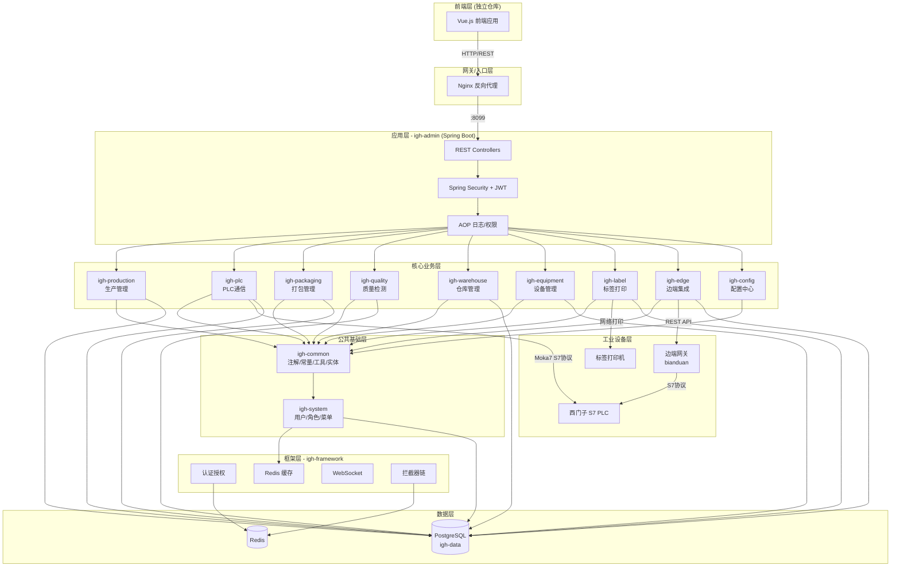

### 2.2 模块依赖分层图

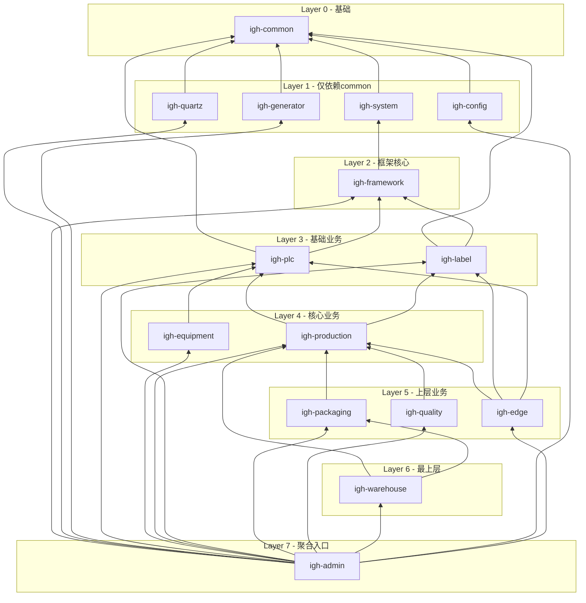

---

## 3. Maven模块依赖分析

### 3.1 15个Maven模块总览

| 模块 | 层级 | 依赖的igh模块 | 核心第三方依赖 |
|------|------|-------------|--------------|
| **igh-common** | L0 基础 | 无 | Spring Security, Redis, PageHelper, POI, FastJSON2, JWT |
| **igh-system** | L1 | igh-common | 无额外 |
| **igh-quartz** | L1 | igh-common | Quartz |
| **igh-generator** | L1 | igh-common | Velocity, Druid |
| **igh-config** | L1 | igh-common | MyBatis, PostgreSQL, Lombok |
| **igh-framework** | L2 | igh-system | Druid, Kaptcha, OSHI, WebSocket, AOP |
| **igh-plc** | L3 | igh-common, igh-framework | **Moka7 1.0.3** (本地S7库), Quartz, WebSocket |
| **igh-label** | L3 | igh-common, igh-framework | MyBatis, PostgreSQL |
| **igh-equipment** | L4 | igh-common, igh-framework, igh-plc | Swagger, WebSocket |
| **igh-production** | L4 | igh-common, igh-framework, igh-plc, igh-label | Lombok, MyBatis |
| **igh-packaging** | L5 | igh-common, igh-framework, igh-production | Lombok, MyBatis |
| **igh-quality** | L5 | igh-common, igh-framework, igh-production | Lombok, MyBatis |
| **igh-edge** | L5 | igh-common, igh-framework, igh-production, igh-label, igh-plc | Lombok, MyBatis |
| **igh-warehouse** | L6 | igh-common, igh-framework, igh-production, igh-packaging | MyBatis |
| **igh-admin** | L7 | 全部12个业务模块 | SpringFox Swagger3, PostgreSQL |

### 3.2 关键配置

| 配置项 | 值 |
|-------|---|
| 服务端口 | 8099 |
| 数据库 | PostgreSQL localhost:5432/igh-data |
| 连接池 | Druid (初始5, 最小10, 最大20) |
| Redis | localhost:6379, Lettuce |
| JWT有效期 | 30分钟 |
| 分页方言 | postgresql (PageHelper) |
| MyBatis Mapper路径 | classpath*:mapper/**/*Mapper.xml |
| Swagger路径映射 | /dev-api |
| 文件上传限制 | 单文件10MB, 总20MB |

---

## 4. 数据模型分析（ER图）

### 4.1 核心业务ER图

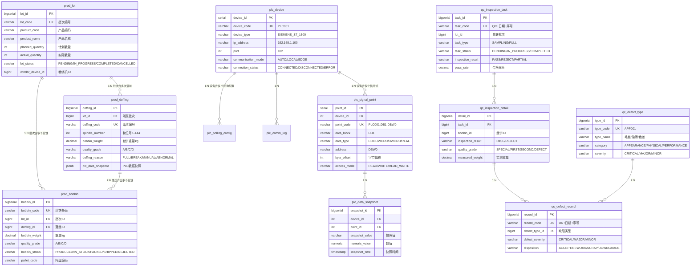

### 4.2 仓储包装ER图

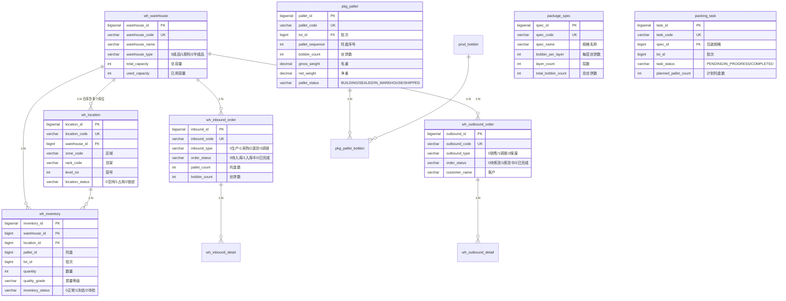

### 4.3 配置中心ER图

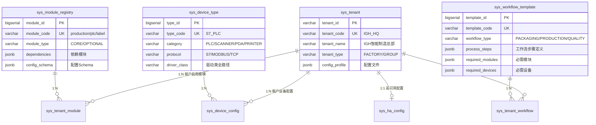

### 4.4 边端集成ER图

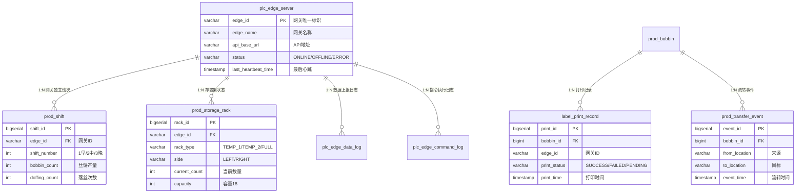

### 4.5 全系统数据库表清单

| 模块 | 表名 | 说明 | 记录数级别 |
|------|-----|------|----------|
| **生产** | prod_lot | 生产批次 | 千级 |
| **生产** | prod_doffing | 落丝记录 | 十万级 |
| **生产** | prod_bobbin | 丝饼记录 | 百万级 |
| **PLC** | plc_device | PLC设备 | 十级 |
| **PLC** | plc_signal_point | 信号点配置 | 百级 |
| **PLC** | plc_polling_config | 轮询配置 | 十级 |
| **PLC** | plc_comm_log | 通讯日志 | 百万级(需分区) |
| **PLC** | plc_data_snapshot | 数据快照 | 千万级(需分区) |
| **PLC** | plc_edge_server | 边端服务注册 | 十级 |
| **PLC** | plc_edge_data_log | 边端数据日志 | 百万级 |
| **PLC** | plc_edge_command_log | 边端指令日志 | 万级 |
| **质量** | qc_inspection_task | 质检任务 | 千级 |
| **质量** | qc_inspection_detail | 质检明细 | 万级 |
| **质量** | qc_defect_type | 缺陷类型(字典) | 十级 |
| **质量** | qc_defect_record | 缺陷记录 | 万级 |
| **仓库** | wh_warehouse | 仓库 | 个位 |
| **仓库** | wh_location | 库位 | 千级 |
| **仓库** | wh_inventory | 库存 | 万级 |
| **仓库** | wh_inbound_order | 入库单 | 千级 |
| **仓库** | wh_inbound_detail | 入库明细 | 万级 |
| **仓库** | wh_outbound_order | 出库单 | 千级 |
| **仓库** | wh_outbound_detail | 出库明细 | 万级 |
| **包装** | package_spec | 包装规格 | 十级 |
| **包装** | packing_task | 打包任务 | 千级 |
| **包装** | pallet (pkg_pallet) | 托盘 | 万级 |
| **标签** | label_template | 标签模板 | 十级 |
| **标签** | label_printer | 打印机 | 十级 |
| **标签** | label_print_task | 打印任务队列 | 万级 |
| **标签** | label_field_metadata | 字段元数据 | 百级 |
| **边端** | prod_shift | 班次记录 | 千级 |
| **边端** | prod_storage_rack | 存置架状态 | 百级 |
| **边端** | label_print_record | 边端打印记录 | 万级 |
| **边端** | prod_transfer_event | 丝饼流转事件 | 万级 |
| **配置** | sys_tenant | 租户 | 个位 |
| **配置** | sys_module_registry | 模块注册 | 十级 |
| **配置** | sys_tenant_module | 租户模块配置 | 十级 |
| **配置** | sys_device_type | 设备类型 | 十级 |
| **配置** | sys_device_config | 设备配置 | 十级 |
| **配置** | sys_workflow_template | 工作流模板 | 十级 |
| **配置** | sys_tenant_workflow | 租户工作流 | 十级 |
| **配置** | sys_ha_config | 高可用配置 | 个位 |
| **系统** | sys_user/role/menu/dept/... | 系统管理表 | 百级 |
| **定时** | sys_job/sys_job_log | 定时任务 | 十级/万级 |

---

## 5. 核心基础模块分析

### 5.1 igh-common (公共组件)

**包结构**:
- `com.igh.common.annotation` — 自定义注解: @Anonymous, @DataScope, @DataSource, @Excel, @Log, @RateLimiter, @RepeatSubmit, @Sensitive
- `com.igh.common.config` — IGHConfig(系统配置), SensitiveJsonSerializer
- `com.igh.common.constant` — CacheConstants, Constants, GenConstants, HttpStatus, ScheduleConstants, UserConstants
- `com.igh.common.core.controller` — BaseController (分页/响应封装基类)
- `com.igh.common.core.domain` — AjaxResult, BaseEntity, TreeEntity, R(泛型响应)
- `com.igh.common.core.domain.entity` — SysUser, SysRole, SysMenu, SysDept, SysDictData, SysDictType
- `com.igh.common.core.domain.model` — LoginBody, LoginUser, RegisterBody
- `com.igh.common.core.page` — PageDomain, TableDataInfo, TableSupport
- `com.igh.common.core.redis` — RedisCache (Redis工具封装)
- `com.igh.common.enums` — BusinessStatus, BusinessType, DataSourceType, HttpMethod, LimitType, OperatorType, UserStatus
- `com.igh.common.exception` — ServiceException, GlobalException, 文件/用户/任务异常
- `com.igh.common.filter` — XssFilter, RepeatableFilter, RefererFilter
- `com.igh.common.utils` — DateUtils, StringUtils, SecurityUtils, ip/文件/Bean/Excel等工具类

### 5.2 igh-system (系统管理)

标准RuoYi系统管理模块，提供RBAC权限体系:

| 实体 | 表 | 功能 |
|-----|---|------|
| SysUser | sys_user | 用户管理 |
| SysRole | sys_role | 角色管理 |
| SysMenu | sys_menu | 菜单权限(M目录/C菜单/F按钮) |
| SysDept | sys_dept | 部门管理(树形) |
| SysPost | sys_post | 岗位管理 |
| SysConfig | sys_config | 参数配置 |
| SysNotice | sys_notice | 通知公告 |
| SysOperLog | sys_oper_log | 操作日志 |
| SysLogininfor | sys_logininfor | 登录日志 |
| SysDictType/Data | sys_dict_type/data | 数据字典 |
| SysUserRole | sys_user_role | 用户-角色关联 |
| SysRoleMenu | sys_role_menu | 角色-菜单关联 |
| SysRoleDept | sys_role_dept | 角色-部门关联 |
| SysUserPost | sys_user_post | 用户-岗位关联 |

### 5.3 igh-framework (框架层)

**安全链**: SecurityConfig → JwtAuthenticationTokenFilter → TokenService → LoginUser
- JWT令牌生成、验证、刷新
- 密码加密(BCrypt)
- 登录限流(Redis计数)

**AOP切面**:
- DataScopeAspect — 数据权限过滤(按部门)
- LogAspect — 操作日志记录(@Log注解)
- RateLimiterAspect — 接口限流

**拦截器**:
- RepeatSubmitInterceptor — 防重复提交
- HeaderInterceptor — 请求头处理

**配置**:
- DruidConfig — 多数据源配置(主从)
- KaptchaConfig — 验证码
- WebSocketConfig — WebSocket支持

---

## 6. 生产管理模块（igh-production）

### 6.1 模块结构

```
com.igh.production/
├── controller/
│   ├── ProdLotController.java         — 批次管理API
│   ├── ProdDoffingController.java     — 落丝记录API
│   └── ProdBobbinController.java      — 丝饼管理API
├── domain/
│   ├── ProdLot.java                   — 生产批次实体
│   ├── ProdDoffing.java               — 落丝记录实体
│   ├── ProdBobbin.java                — 丝饼记录实体
│   └── enums/
│       ├── BobbinStatus.java          — PRODUCED/IN_STOCK/PACKED/SHIPPED/REJECTED
│       ├── DoffingReason.java         — FULL/BREAK/MANUAL/ABNORMAL
│       ├── LotStatus.java             — PENDING/IN_PROGRESS/COMPLETED/CANCELLED
│       └── QualityGrade.java          — A/B/C/D
├── mapper/
│   ├── ProdLotMapper.java
│   ├── ProdDoffingMapper.java
│   └── ProdBobbinMapper.java
└── service/
    ├── IProdLotService.java
    ├── IProdDoffingService.java
    ├── IProdBobbinService.java
    └── impl/
        ├── ProdLotServiceImpl.java
        ├── ProdDoffingServiceImpl.java
        └── ProdBobbinServiceImpl.java
```

### 6.2 核心业务实体

**ProdLot (生产批次)**:
- lot_id, lot_code(唯一编号), lot_name
- product_code, product_name — 产品信息
- planned_quantity, actual_quantity — 计划/实际产量
- lot_status — PENDING→IN_PROGRESS→COMPLETED/CANCELLED
- winder_device_id/code/name — 关联卷绕机
- start_time, end_time — 生产时段

**ProdDoffing (落丝记录)**:
- doffing_id, doffing_code(唯一编号)
- lot_id(FK批次), spindle_number(锭位号1-144)
- bobbin_weight/length/diameter — 丝饼物理参数
- quality_grade(A/B/C/D), is_qualified
- doffing_reason — FULL(满筒)/BREAK(断丝)/MANUAL(手动)/ABNORMAL(异常)
- plc_data_snapshot(JSONB) — 落丝时PLC数据快照
- source_edge_id, plc_timestamp, received_at — 边端溯源字段

**ProdBobbin (丝饼记录)**:
- bobbin_id, bobbin_code(丝饼条码,唯一)
- lot_id(FK批次), doffing_id(FK落丝)
- bobbin_weight/length/diameter, quality_grade
- bobbin_status — PRODUCED→IN_STOCK→PACKED→SHIPPED/REJECTED
- pallet_code, box_code — 包装信息
- warehouse_location — 仓库位置
- source_edge_id, plc_timestamp — 边端溯源

### 6.3 生产管理流程图

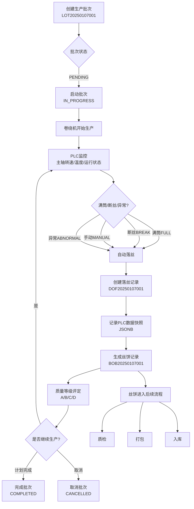

### 6.4 API端点

| HTTP方法 | 路径 | 说明 | 权限标识 |
|---------|------|------|---------|
| GET | /production/lot/list | 查询批次列表 | production:lot:list |
| GET | /production/lot/{lotId} | 获取批次详情 | production:lot:query |
| POST | /production/lot | 新增批次 | production:lot:add |
| PUT | /production/lot | 修改批次 | production:lot:edit |
| DELETE | /production/lot/{lotIds} | 删除批次 | production:lot:remove |
| POST | /production/lot/export | 导出批次 | production:lot:export |
| GET | /production/doffing/list | 查询落丝列表 | production:doffing:list |
| POST | /production/doffing | 新增落丝记录 | production:doffing:add |
| GET | /production/bobbin/list | 查询丝饼列表 | production:bobbin:list |
| POST | /production/bobbin | 新增丝饼 | production:bobbin:add |
| PUT | /production/bobbin | 修改丝饼 | production:bobbin:edit |
| POST | /production/bobbin/export | 导出丝饼 | production:bobbin:export |

---

## 7. PLC通信模块（igh-plc）

### 7.1 模块结构

```
com.igh.plc/
├── controller/
│   ├── PlcDeviceController.java       — PLC设备管理
│   ├── PlcSignalPointController.java  — 信号点配置
│   ├── PlcPollingConfigController.java — 轮询配置
│   ├── PlcMonitorController.java      — 实时监控
│   ├── PlcConfigController.java       — PLC系统配置
│   ├── PlcEdgeServerController.java   — 边端服务管理
│   └── PlcEdgeDataController.java     — 边端数据接收
├── domain/
│   ├── PlcDevice.java                 — PLC设备
│   ├── PlcSignalPoint.java            — 信号点
│   ├── PlcPollingConfig.java          — 轮询配置
│   ├── PlcCommLog.java                — 通讯日志
│   ├── PlcDataSnapshot.java           — 数据快照
│   ├── PlcEdgeServer.java             — 边端服务
│   ├── PlcEdgeDataLog.java            — 边端数据日志
│   ├── PlcEdgeCommandLog.java         — 边端指令日志
│   └── dto/
│       ├── PlcEdgeDataDTO.java        — 边端数据上报DTO
│       ├── PlcEdgeCommandDTO.java     — 边端指令DTO
│       ├── PlcEdgeResponseDTO.java    — 边端响应DTO
│       └── PlcWriteResultDTO.java     — 写入结果DTO
├── communication/
│   └── S7PlcConnector.java            — Moka7 S7协议连接器
├── service/
│   ├── IPlcDeviceService.java
│   ├── IPlcSignalPointService.java
│   ├── IPlcMonitorService.java        — 实时监控服务
│   ├── IPlcRealtimeService.java       — 实时数据服务
│   ├── IPlcConfigService.java         — 配置服务
│   ├── IPlcEdgeServerService.java     — 边端管理
│   ├── IPlcEdgeDataService.java       — 边端数据处理
│   └── impl/ ...
└── websocket/
    └── PlcDataWebSocket.java          — PLC数据WebSocket推送
```

### 7.2 PLC通信架构图

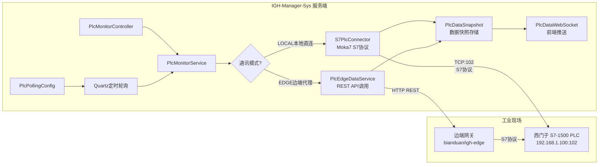

### 7.3 S7通信流程图

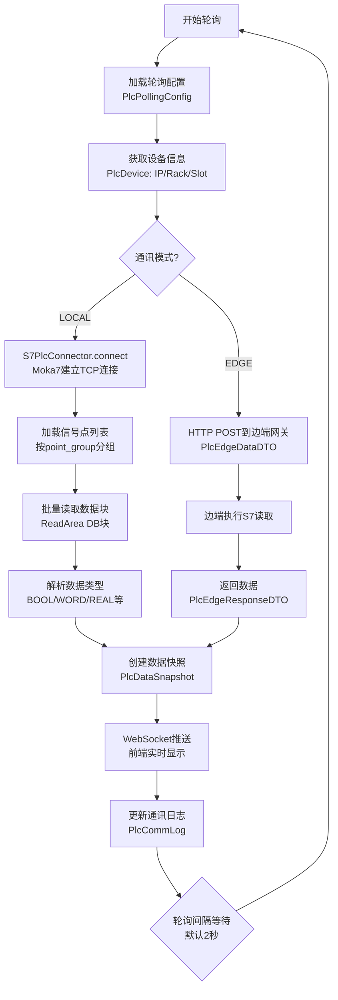

### 7.4 PLC API端点

| HTTP方法 | 路径 | 说明 |
|---------|------|------|
| GET | /plc/device/list | PLC设备列表 |
| POST | /plc/device | 新增PLC设备 |
| GET | /plc/signal/list | 信号点列表 |
| POST | /plc/signal | 新增信号点 |
| GET | /plc/polling/list | 轮询配置列表 |
| GET | /plc/monitor/realtime/{deviceId} | 实时数据 |
| GET | /plc/monitor/snapshot/list | 历史快照 |
| POST | /plc/monitor/write | 写入PLC信号 |
| GET | /plc/config/list | PLC系统配置 |
| GET | /plc/edge/server/list | 边端服务列表 |
| POST | /plc/edge/data/report | 边端数据上报 |
| POST | /plc/edge/command | 下发边端指令 |

---

## 8. 打包管理模块（igh-packaging）

### 8.1 模块结构

```
com.igh.packaging/
├── controller/
│   ├── PackageSpecController.java     — 包装规格管理
│   ├── PackingTaskController.java     — 打包任务管理
│   ├── PalletController.java          — 托盘管理
│   └── PalletPackingController.java   — 智能组盘API
├── domain/
│   ├── PackageSpec.java               — 包装规格
│   ├── PackingTask.java               — 打包任务
│   └── Pallet.java                    — 托盘
├── mapper/
│   ├── PackageSpecMapper.java
│   ├── PackingTaskMapper.java
│   └── PalletMapper.java
└── service/
    ├── IPackageSpecService.java
    ├── IPackingTaskService.java
    ├── IPalletService.java
    ├── IPalletPackingService.java     — 智能组盘服务
    └── impl/
        ├── PackageSpecServiceImpl.java
        ├── PackingTaskServiceImpl.java
        ├── PalletServiceImpl.java
        └── PalletPackingServiceImpl.java
```

### 8.2 打包业务流程

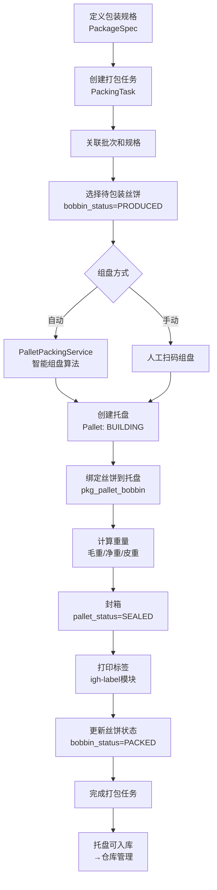

### 8.3 包装规格实体

**PackageSpec (包装规格)**:
- spec_code, spec_name — 规格编码/名称
- bobbin_per_layer — 每层丝饼数
- layer_count — 层数
- total_bobbin_count — 总丝饼数 = 每层 × 层数
- pallet_type, pallet_size — 托盘类型/尺寸

---

## 9. 质量检测模块（igh-quality）

### 9.1 模块结构

```
com.igh.quality/
├── controller/
│   ├── QcInspectionTaskController.java   — 质检任务
│   ├── QcInspectionDetailController.java — 质检明细
│   ├── QcDefectRecordController.java     — 缺陷记录
│   ├── QcDefectTypeController.java       — 缺陷类型
│   └── QcReportController.java           — 质量报表
├── domain/
│   ├── QcInspectionTask.java
│   ├── QcInspectionDetail.java
│   ├── QcDefectRecord.java
│   └── QcDefectType.java
├── mapper/ ...
└── service/
    ├── IQcInspectionTaskService.java
    ├── IQcInspectionDetailService.java
    ├── IQcDefectRecordService.java
    ├── IQcDefectTypeService.java
    ├── IQcReportService.java             — 质量分析报表
    └── impl/ ...
```

### 9.2 质检流程图

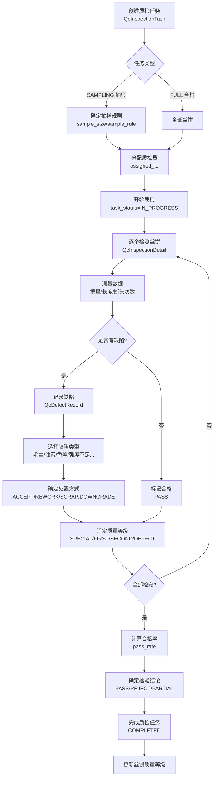

### 9.3 预置缺陷类型

| 代码 | 名称 | 分类 | 严重度 | 默认处置 |
|-----|------|------|-------|---------|
| APP001 | 毛丝 | 外观 | 次要 | 降级 |
| APP002 | 油污 | 外观 | 次要 | 返工 |
| APP003 | 色差 | 外观 | 主要 | 降级 |
| APP004 | 纸管破损 | 外观 | 主要 | 报废 |
| APP005 | 脱筒 | 外观 | 严重 | 报废 |
| APP006 | 塌边 | 外观 | 主要 | 降级 |
| PHY001 | 毛重不足 | 物理 | 次要 | 降级 |
| PHY003 | 长度不足 | 物理 | 主要 | 降级 |
| PHY004 | 断头超标 | 物理 | 主要 | 降级 |
| PER001 | 强度不足 | 性能 | 严重 | 报废 |
| PER002 | 伸长不合格 | 性能 | 主要 | 降级 |
| PER003 | 热收缩不合格 | 性能 | 主要 | 降级 |

---

## 10. 仓库管理模块（igh-warehouse）

### 10.1 模块结构

```
com.igh.warehouse/
├── controller/
│   ├── WhWarehouseController.java      — 仓库管理
│   ├── WhLocationController.java       — 库位管理
│   ├── WhInventoryController.java      — 库存管理
│   ├── WhInboundOrderController.java   — 入库管理
│   └── WhOutboundOrderController.java  — 出库管理
├── domain/
│   ├── WhWarehouse.java                — 仓库
│   ├── WhLocation.java                 — 库位
│   ├── WhInventory.java                — 库存
│   ├── WhInventoryAlert.java           — 库存预警
│   ├── WhInboundOrder.java             — 入库单
│   ├── WhInboundDetail.java            — 入库明细
│   ├── WhOutboundOrder.java            — 出库单
│   └── WhOutboundDetail.java           — 出库明细
├── mapper/ ...
└── service/
    ├── IWhWarehouseService.java
    ├── IWhLocationService.java
    ├── IWhInventoryService.java
    ├── IWhInboundOrderService.java
    ├── IWhOutboundOrderService.java
    ├── IWhInventoryAlertService.java   — 库存预警
    ├── IWhLocationAllocationService.java — 库位分配策略
    ├── IWhPickingStrategyService.java   — 拣货策略
    └── impl/ ...
```

### 10.2 入库出库流程

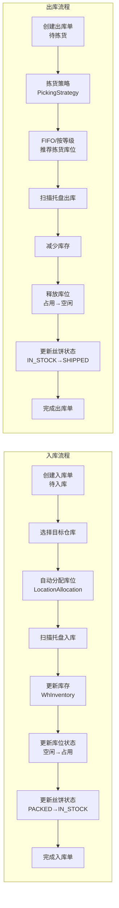

### 10.3 仓库智能服务

- **WhLocationAllocationService** — 库位自动分配策略：根据仓库容量、区域、承重等条件智能推荐库位
- **WhPickingStrategyService** — 拣货策略服务：支持FIFO(先进先出)、按质量等级、按批次等多种拣货策略
- **WhInventoryAlertService** — 库存预警服务：监控库存水平，触发预警

---

## 11. 设备管理模块（igh-equipment）

### 11.1 模块结构

```
com.igh.equipment/
├── controller/
│   ├── EquipmentDeviceController.java         — 设备档案
│   ├── EquipmentDeviceTypeController.java     — 设备类型
│   ├── EquipmentDevicePartController.java     — 设备部件
│   ├── EquipmentPartInstanceController.java   — 部件实例
│   ├── EquipmentMaintenancePlanController.java — 维护计划
│   ├── EquipmentMaintenanceRecordController.java — 维护记录
│   ├── EquipmentWinderSpecController.java     — 卷绕机规格
│   ├── EquipmentDoffingSpecController.java    — 落丝机规格
│   ├── EquipmentCraneSpecController.java      — 天车规格
│   ├── EquipmentTrolleySpecController.java    — 丝车规格
│   ├── EquipmentWeighingSpecController.java   — 称重设备规格
│   ├── EquipmentPrinterSpecController.java    — 打印机规格
│   ├── EquipmentLabelingSpecController.java   — 贴标机规格
│   ├── EquipmentMaterialRackSpecController.java — 料架规格
│   └── WinderMonitorController.java           — 卷绕机实时监控
├── domain/
│   ├── EquipmentDevice.java         — 设备主表
│   ├── EquipmentDeviceType.java     — 设备类型
│   ├── EquipmentDevicePart.java     — 设备部件模板
│   ├── EquipmentPartInstance.java   — 部件实例
│   ├── EquipmentMaintenancePlan.java — 维保计划
│   ├── EquipmentMaintenanceRecord.java — 维保记录
│   ├── EquipmentWinderSpec.java     — 卷绕机规格参数
│   ├── EquipmentDoffingSpec.java    — 落丝机规格
│   ├── EquipmentCraneSpec.java      — 天车规格
│   ├── EquipmentTrolleySpec.java    — 丝车规格
│   ├── EquipmentWeighingSpec.java   — 称重设备
│   ├── EquipmentPrinterSpec.java    — 打印机规格
│   ├── EquipmentLabelingSpec.java   — 贴标机规格
│   └── EquipmentMaterialRackSpec.java — 料架规格
```

### 11.2 设备类型层次

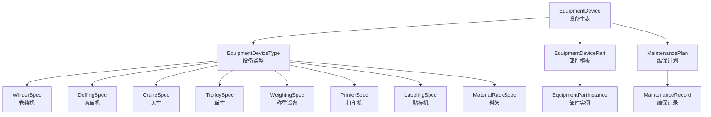

### 11.3 WinderMonitorService

`WinderMonitorController` + `WinderMonitorServiceImpl` 提供卷绕机实时监控功能，通过WebSocket将PLC数据推送到前端，实现主轴转速、温度、运行状态的实时显示。

---

## 12. 标签打印模块（igh-label）

### 12.1 模块结构

```
com.igh.label/
├── controller/
│   ├── LabelTemplateController.java       — 标签模板管理
│   ├── LabelPrinterController.java        — 打印机管理
│   ├── LabelPrintTaskController.java      — 打印任务管理
│   └── LabelFieldMetadataController.java  — 字段元数据
├── domain/
│   ├── LabelTemplate.java    — 标签模板(含ZPL/TSPL模板代码)
│   ├── LabelPrinter.java     — 打印机(IP/端口/型号)
│   ├── LabelPrintTask.java   — 打印任务(队列)
│   └── LabelFieldMetadata.java — 字段元数据(模板字段定义)
└── service/
    ├── ILabelTemplateService.java
    ├── ILabelPrinterService.java
    ├── ILabelPrintTaskService.java
    └── ILabelFieldMetadataService.java
```

### 12.2 标签打印流程

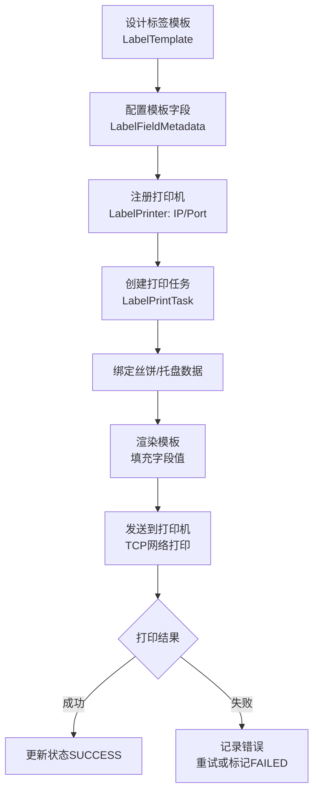

---

## 13. 边端集成模块（igh-edge + bianduan）

### 13.1 igh-edge 模块结构（服务端接收API）

```
com.igh.edge/
├── controller/
│   ├── EdgeHeartbeatController.java      — 心跳检测API
│   ├── EdgeConfigController.java         — 边端配置下发
│   ├── EdgeDoffingController.java        — 落丝数据上报
│   ├── EdgeBobbinController.java         — 丝饼数据上报
│   ├── EdgeShiftController.java          — 班次数据管理
│   ├── EdgeRackStatusController.java     — 存置架状态上报
│   ├── EdgePrintRecordController.java    — 打印记录上报
│   └── EdgeTransferEventController.java  — 丝饼流转事件
├── domain/
│   ├── ProdShift.java          — 班次记录(edge_id关联)
│   ├── ProdStorageRack.java    — 存置架状态(upsert模式)
│   ├── LabelPrintRecord.java   — 边端打印记录
│   └── ProdTransferEvent.java  — 丝饼流转事件
└── service/
    ├── IEdgeHeartbeatService.java
    ├── IEdgeConfigService.java
    ├── IEdgeDoffingService.java
    ├── IEdgeBobbinService.java
    ├── IEdgeShiftService.java
    ├── IEdgeRackService.java
    ├── IEdgePrintRecordService.java
    └── IEdgeTransferEventService.java
```

### 13.2 bianduan 目录

`bianduan/` 目录下仅包含设计文档(.md文件)，无实际可执行源码。边端应用为独立部署的Spring Boot应用，代码不在此仓库中。

### 13.3 边端通信架构

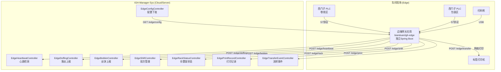

### 13.4 存置架模型

系统支持三种存置架类型，每个架有左右两侧:
- **TEMP_1** — 临时架1
- **TEMP_2** — 临时架2
- **FULL** — 凑满架

每个架位容量为18个丝饼，采用upsert模式更新(UNIQUE约束: edge_id + rack_type + side + rack_number)。

---

## 14. 配置中心模块（igh-config）

### 14.1 模块结构

```
com.igh.config/
├── controller/
│   ├── SysTenantController.java         — 租户管理
│   └── SysTenantModuleController.java   — 租户模块配置
├── domain/
│   ├── SysTenant.java                   — 租户/工厂
│   ├── SysTenantModule.java             — 租户模块配置
│   ├── SysModuleRegistry.java           — 模块注册表
│   ├── SysDeviceType.java               — 设备类型注册
│   └── SysDeviceConfig.java             — 设备配置
├── mapper/
│   ├── SysTenantMapper.java
│   └── SysTenantModuleMapper.java
└── service/
    ├── ISysTenantService.java
    ├── ISysTenantModuleService.java
    └── impl/ ...
```

### 14.2 多租户模块化架构

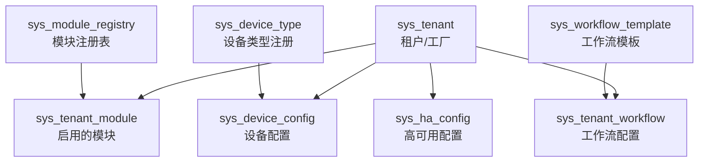

**核心设计理念**: 通过配置中心实现工厂级别的功能定制——不同工厂可以启用不同的模块组合(生产+PLC为核心，质检/包装/仓储为可选)，配置不同的设备类型和工作流程。

**预置工作流模板**:
1. **FULL_AUTO_PACKAGING** — 全自动包装: PLC自动组盘→自动称重→自动打印
2. **SEMI_AUTO_PACKAGING** — 半自动包装: 扫码识别→人工组盘→PDA记录→打印
3. **QUALITY_WITH_SCAN** — 扫码质检: 扫描产品→质量检测→记录缺陷

---

## 15. 系统管理模块（igh-system）

见 [5.2 igh-system](#52-igh-system-系统管理)，提供标准RBAC权限管理体系。

---

## 16. 框架层（igh-framework）

见 [5.3 igh-framework](#53-igh-framework-框架层)，提供安全认证、AOP日志、缓存、WebSocket等基础框架能力。

---

## 17. 定时任务模块（igh-quartz）

基于Quartz框架的定时任务管理:

| 实体 | 表 | 功能 |
|-----|---|------|
| SysJob | sys_job | 定时任务定义(cron表达式/执行策略) |
| SysJobLog | sys_job_log | 任务执行日志 |

支持通过Web界面管理定时任务的创建、修改、暂停、恢复、立即执行。

---

## 18. 启动入口（igh-admin）

### 18.1 主类

- `IGHApplication` — Spring Boot启动类(@SpringBootApplication)
- `IGHServletInitializer` — WAR包部署支持

### 18.2 入口层Controller

| 控制器 | 路径前缀 | 功能 |
|-------|---------|------|
| SysLoginController | /login, /logout | 登录/登出/获取用户信息/路由 |
| SysRegisterController | /register | 用户注册 |
| CaptchaController | /captchaImage | 验证码生成 |
| CommonController | /common | 文件上传下载 |
| SysUserController | /system/user | 用户管理 |
| SysRoleController | /system/role | 角色管理 |
| SysMenuController | /system/menu | 菜单管理 |
| SysDeptController | /system/dept | 部门管理 |
| SysDictTypeController | /system/dict/type | 字典类型 |
| SysDictDataController | /system/dict/data | 字典数据 |
| SysConfigController | /system/config | 参数配置 |
| SysNoticeController | /system/notice | 通知公告 |
| SysProfileController | /system/user/profile | 个人信息 |
| CacheController | /monitor/cache | 缓存监控 |
| ServerController | /monitor/server | 服务器监控 |
| SysLogininforController | /monitor/logininfor | 登录日志 |
| SysOperlogController | /monitor/operlog | 操作日志 |
| SysUserOnlineController | /monitor/online | 在线用户 |
| SwaggerConfig | /swagger-ui/ | API文档 |

---

## 19. 全局数据流图

### 19.1 丝饼生命周期数据流

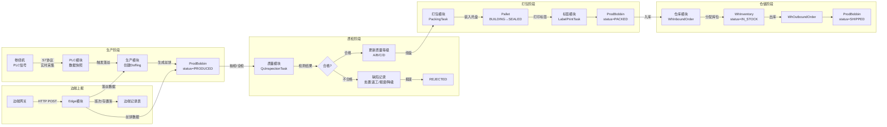

### 19.2 系统间数据流

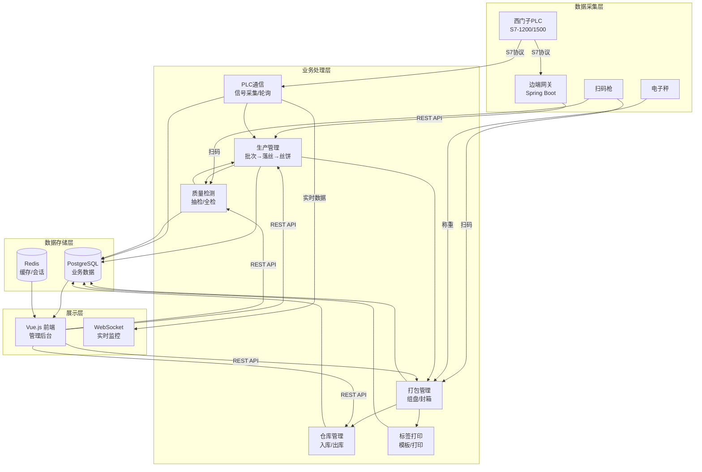

---

## 20. 端到端业务流程图

### 20.1 化纤生产全流程

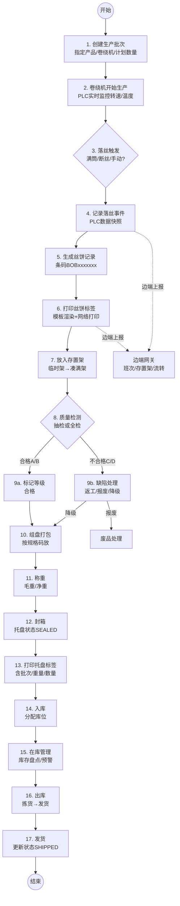

---

## 21. API端点清单

### 21.1 各模块API总览

| 模块 | Controller数 | 主要路径前缀 | 功能 |
|------|------------|------------|------|
| igh-admin (系统) | 17 | /system/*, /monitor/*, /login | 系统管理+监控 |
| igh-production | 3 | /production/lot, /doffing, /bobbin | 生产管理 |
| igh-plc | 7 | /plc/device, /signal, /monitor, /edge | PLC通信 |
| igh-packaging | 4 | /packaging/spec, /task, /pallet | 打包管理 |
| igh-quality | 5 | /quality/inspection, /defect, /report | 质量检测 |
| igh-warehouse | 5 | /warehouse/*, /location, /inventory | 仓库管理 |
| igh-equipment | 15 | /equipment/device, /winder, /crane, ... | 设备管理 |
| igh-label | 4 | /label/template, /printer, /task | 标签打印 |
| igh-edge | 8 | /edge/heartbeat, /doffing, /bobbin, ... | 边端集成 |
| igh-config | 2 | /config/tenant, /module | 配置中心 |
| igh-quartz | 2 | /monitor/job, /jobLog | 定时任务 |
| igh-generator | 1 | /tool/gen | 代码生成 |
| **合计** | **73** | | |

### 21.2 每个Controller标准操作

大多数业务Controller遵循统一的CRUD模式:
- `GET /xxx/list` — 分页查询列表
- `GET /xxx/{id}` — 根据ID查询详情
- `POST /xxx` — 新增
- `PUT /xxx` — 修改
- `DELETE /xxx/{ids}` — 删除(支持批量)
- `POST /xxx/export` — 导出Excel

---

## 22. 技术栈总结

### 22.1 后端技术栈

| 类别 | 技术 | 版本 | 用途 |
|------|-----|------|------|
| 运行时 | Java | 1.8 | 编译目标 |
| 框架 | Spring Boot | 2.5.15 | 应用框架 |
| 安全 | Spring Security | 5.7.14 | 认证授权 |
| ORM | MyBatis | (PageHelper 1.4.7) | 数据库访问 |
| 数据库 | PostgreSQL | 12+ | 主数据库 |
| 连接池 | Druid | 1.2.23 | 数据库连接管理 |
| 缓存 | Redis + Lettuce | - | 会话缓存 |
| 认证 | JWT (jjwt) | 0.9.1 | Token认证 |
| JSON | FastJSON2 | 2.0.58 | JSON序列化 |
| API文档 | SpringFox Swagger3 | 3.0.0 | API文档 |
| Excel | Apache POI | 4.1.2 | Excel导入导出 |
| 定时任务 | Quartz | - | 定时调度 |
| 模板引擎 | Velocity | 2.3 | 代码生成 |
| PLC通信 | **Moka7** | 1.0.3 | 西门子S7协议(本地安装) |
| 验证码 | Kaptcha | 2.3.3 | 登录验证码 |
| 系统信息 | OSHI | 6.8.3 | 服务器监控 |

### 22.2 数据库设计特点

1. **PostgreSQL特性充分利用**: JSONB(PLC数据快照/配置profile), BIGSERIAL自增, CHECK约束, 建议性分区
2. **编号序列**: seq_lot_code, seq_doffing_code, seq_bobbin_code — 独立序列生成业务编号
3. **审计字段**: 所有表统一包含 create_by, create_time, update_by, update_time
4. **软删除**: 部分表使用 del_flag/deleted/status 标记删除
5. **索引策略**: 按查询场景建立复合索引，高频时序表建议按月分区

### 22.3 架构设计亮点

1. **严格分层**: common→system→framework→业务模块，无循环依赖
2. **业务枢纽**: igh-production 是数据中心，被4个上层模块依赖
3. **双模通信**: PLC通信支持LOCAL(直连)和EDGE(边端代理)两种模式
4. **多租户就绪**: 配置中心支持租户级模块开关和工作流定制
5. **工业协议**: 通过Moka7本地库实现原生S7协议通信，非通用MODBUS
6. **边云协同**: 车间边端网关独立运行，通过REST API上报数据到云端

---

> 分析完成。本报告基于588个Java源码文件、67个MyBatis Mapper XML、60+个SQL脚本的纯源码级分析。前端Vue.js代码存放在独立仓库中，不在本次分析范围内。
