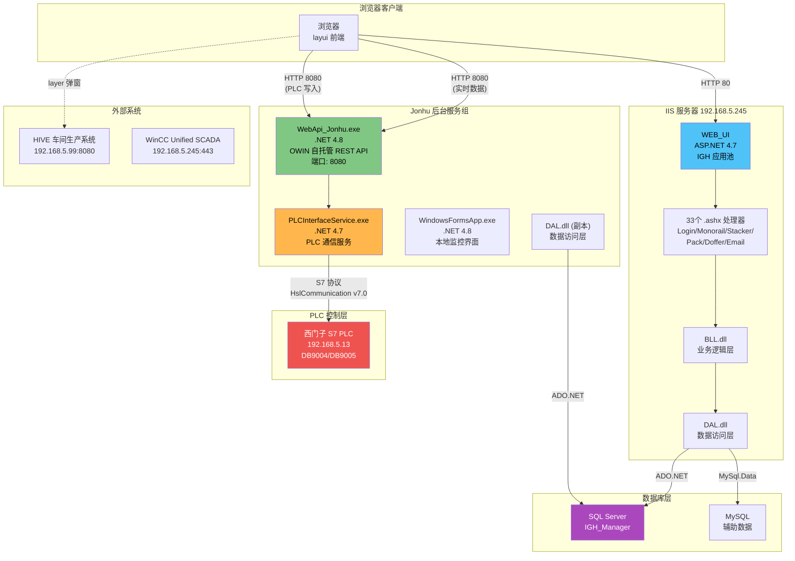
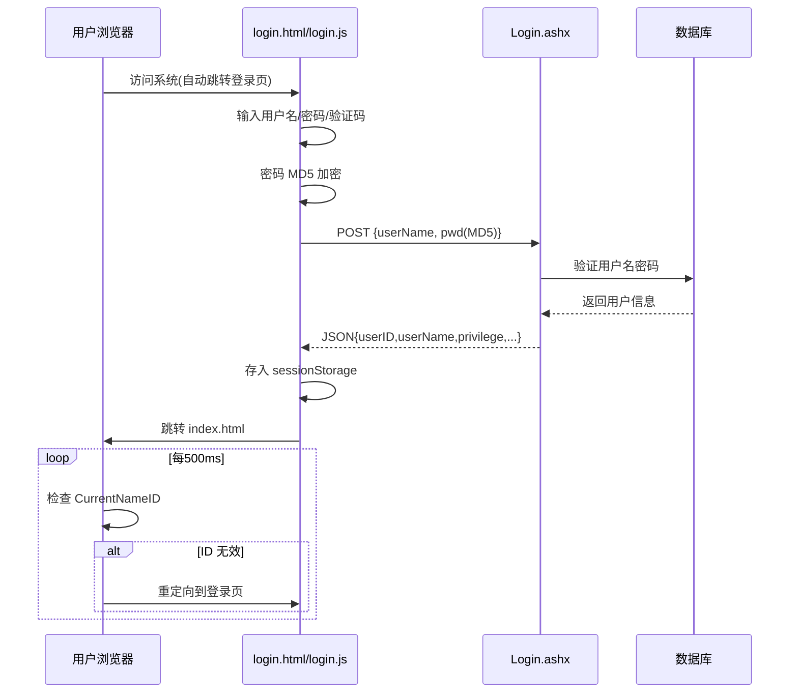
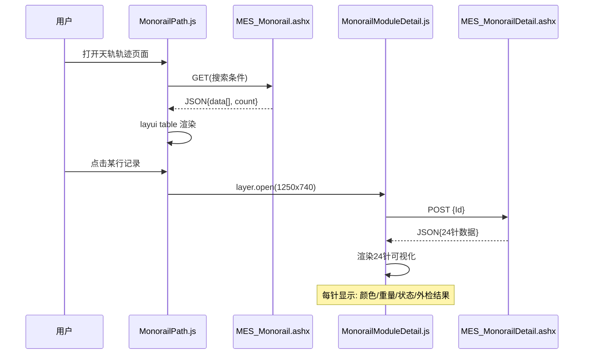
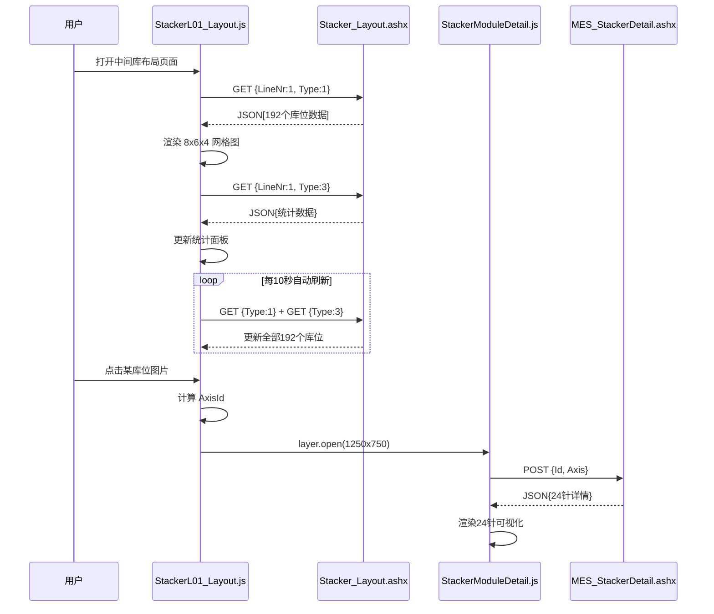
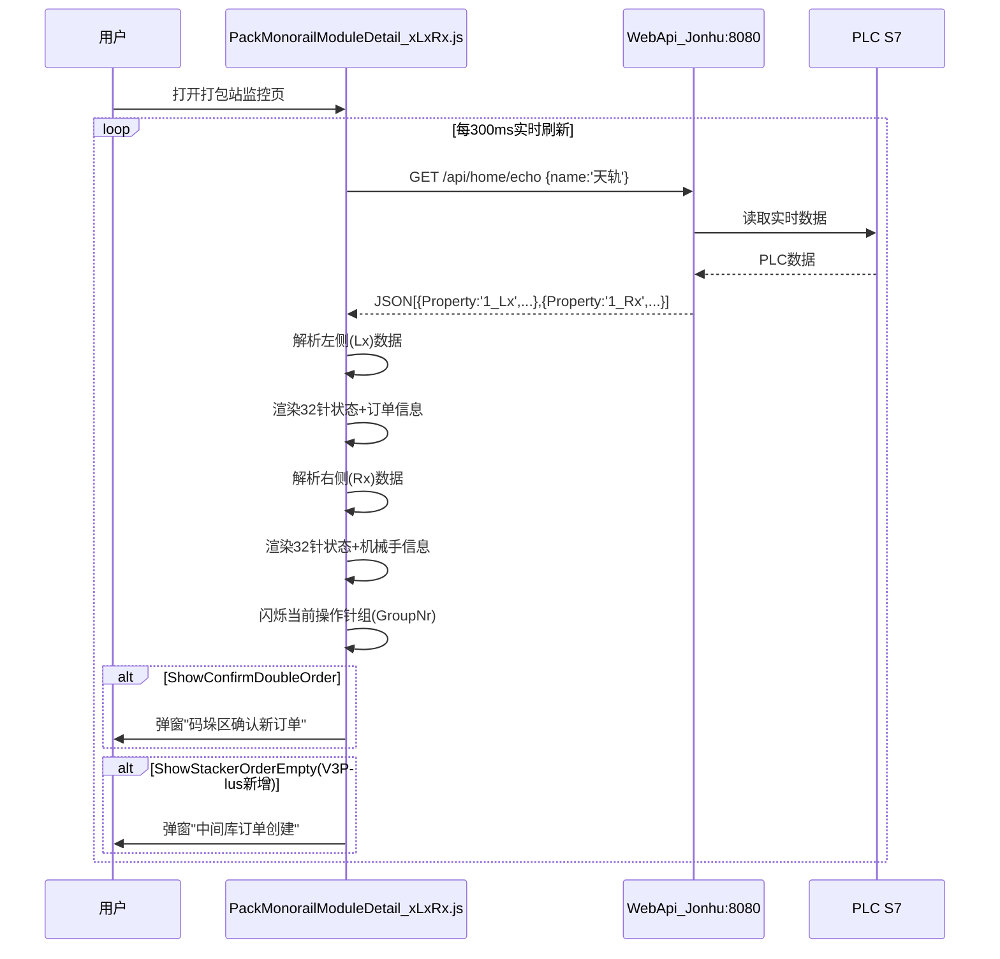
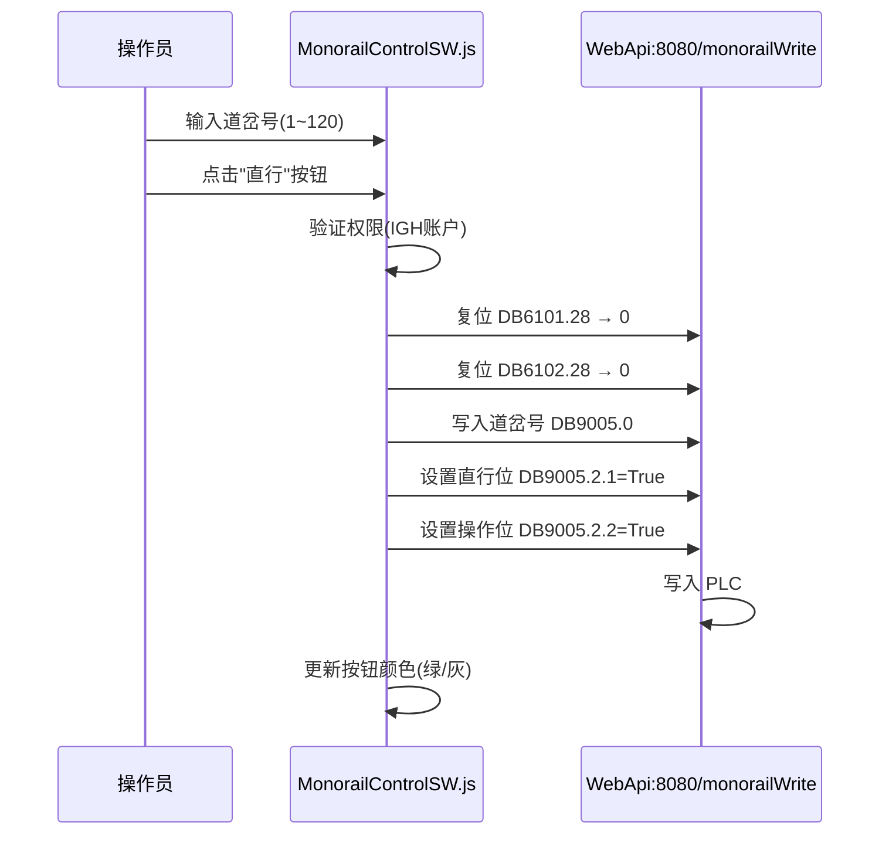
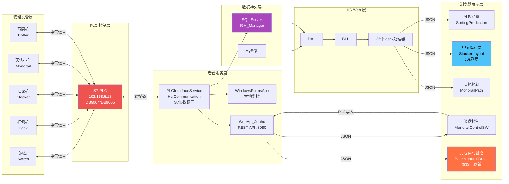
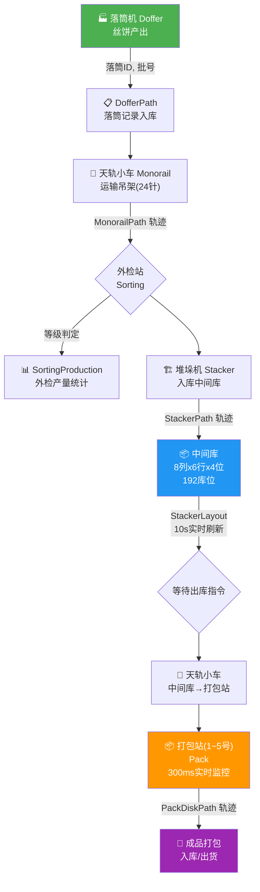
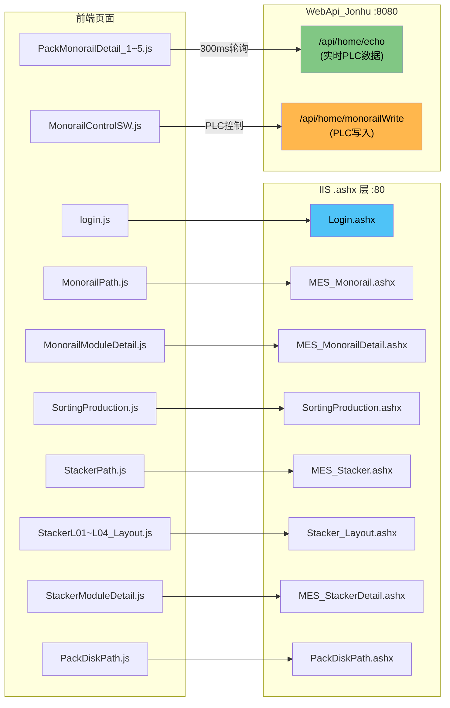

# V3 Plus（第三版本程序PLUS）源码深度分析报告

> **项目名称：** 桐昆嘉通-CP7 IGH 后台管理系统  
> **版本：** 第三版本程序PLUS（V3Plus）  
> **源码路径：** `F:/worktemp/第三版本程序PLUS/aaa/`  
> **分析日期：** 2026-09-17  
> **分析范围：** 纯源码级分析（仅 .js / .html / .css / .config / .ashx / .xml 文件）

---

## 目录

1. [WEB_UI 前端 JS/HTML 逐文件分析](#1-web_ui-前端-jshtml-逐文件分析)
2. [Jonhu 后端 .config 配置分析](#2-jonhu-后端-config-配置分析)
3. [新旧版 WEB_UI 差异对比](#3-新旧版-web_ui-差异对比)
4. [IIS 部署配置分析](#4-iis-部署配置分析)
5. [系统架构 Mermaid 图](#5-系统架构-mermaid-图)
6. [业务页面交互流程 Mermaid 图](#6-业务页面交互流程-mermaid-图)
7. [数据流 Mermaid 图](#7-数据流-mermaid-图)
8. [版本差异清单](#8-版本差异清单)

---

## 1. WEB_UI 前端 JS/HTML 逐文件分析

### 1.1 核心框架文件

#### 1.1.1 `index.html` — 主管理框架页面

| 属性 | 值 |
|------|-----|
| 页面标题 | IGH 后台管理网站 |
| Logo 文字 | 桐昆嘉通-CP7 |
| 页脚版权 | @2022 意锐科(宁波)智能科技有限公司 |
| UI 框架 | layui（中文 UI 框架） |
| 布局方式 | 经典三栏：顶部导航 + 左侧菜单 + 右侧 Tab 内容区 |

**顶部菜单结构：**
- 内容管理（contentManagement）
- 用户中心（memberCenter）
- 系统设置（systemeSttings）
- 车间生产管理 HIVE（外部系统链接）

**功能特征：**
- 左侧导航栏通过 `json/navs.json` 动态加载菜单树
- 右侧内容区使用 layui Tab 实现多窗口模式
- 加载动画由 bodyTab 模块管理

#### 1.1.2 `js/index.js` — 核心应用逻辑

**主要功能：**

1. **菜单加载：** 通过 AJAX GET 请求 `json/navs.json` 获取完整导航结构
2. **HIVE 集成：** 点击"车间生产管理(HIVE)"时弹出密码输入框
   - 密码经双重 MD5 加密后与硬编码哈希 `2E49A9C18CEB017E6A8D3305E3B88695` 比对
   - 验证通过后在 layer 弹窗中打开 `http://192.168.5.99:8080/#/`（HIVE 车间生产管理系统）
3. **Session 保活：** `setInterval(updateTime, 500)` 每 500ms 检测 `sessionStorage.CurrentNameID`
   - 若 ID 无效则自动跳转登录页
   - 开发者注释："不要以为你能看到后台这个名字把Session的名字改了就能登录"
4. **Tab 管理：** 配置最多 50 个 Tab 页同时打开

**关键代码模式：**
```javascript
// HIVE 密码验证 — 双重 MD5
var result = hex_md5(hex_md5(HIVE_pwd));
if (result.toUpperCase() == "2E49A9C18CEB017E6A8D3305E3B88695") {
    // 打开 HIVE 系统
}
```

#### 1.1.3 `js/bodyTab.js` — Tab 多窗口管理

| 属性 | 值 |
|------|-----|
| 作者 | 驊驊龔頾 |
| 日期 | 2017-10 |
| 功能 | Tab 页增删切换、session 持久化、溢出拖拽 |

**核心功能：**
- `tabAdd()` — 新增 Tab（iframe 嵌套子页面）
- `tabDelete()` — 关闭单个 Tab
- `tabDeleteAll()` — 关闭所有/其他 Tab
- Tab 拖拽支持（PC 鼠标 + 移动端触摸）
- Menu 与 Tab 同步联动高亮

#### 1.1.4 `js/main.js` — 主页逻辑

- 显示实时时钟（每秒刷新）
- 加载系统参数 `json/systemParameter.json`
- 加载新闻列表 `json/newsList.json`
- 加载用户统计 `json/userList.json`

#### 1.1.5 `page/main.html` — 首页

- 全屏视频背景 `IGH_final_storage.mp4`
- 绿色引语条显示当前时间问候语
- 企业宣传展示页面

---

### 1.2 登录认证模块

#### 1.2.1 `page/login/login.html`

- 视频背景登录页面
- 表单：用户名 / 密码 / 验证码
- 引入 `md5.js` 用于客户端密码加密

#### 1.2.2 `page/login/login.js`

**登录流程：**

1. 收集用户名和密码
2. 密码进行 MD5 加密：`hex_md5(password)`
3. POST 请求 `../../page/login/Handler/Login.ashx`
4. 请求体：`{ "userName": userName, "pwd": md5Result }`
5. 成功响应后存储至 `sessionStorage`：
   - `CurrentNameID` — 用户 ID
   - `CurrentName` — 用户名
   - `CurrentLoginTime` — 登录时间
   - `CurrentCreatTime` — 创建时间
   - `CurrentNamePrivilege` — 权限等级
6. 跳转至 `../../index.html`

**安全说明：**
- 密码仅单次 MD5，非加盐散列
- Session 存储于 `sessionStorage`（浏览器关闭即失效）
- 注释中存在测试 API 地址：`http://192.168.5.222:8080/api/home/echo`

---

### 1.3 导航结构 `json/navs.json`

完整菜单树（五大模块）：

```
contentManagement（内容管理）
├── 落筒区域
│   ├── DofferPath（POY）— 落筒运行轨迹
│   └── Lot（POY）— 落筒批次管理
├── 天轨管理
│   ├── MonorailPath（POY/FDY）— 天轨运行轨迹
│   ├── MonorailModuleDetail（POY/FDY）— 吊架详情
│   ├── MonorailMultipleModule（POY/FDY）— 多吊架状态
│   ├── MonorailControlSW — 道岔控制
│   ├── CarrierDetail（POY/FDY）— 吊车状态
│   ├── SortingProduction（POY/FDY）— 外检产量报表
│   └── DtyOrder — DTY 订单
├── 中间库区域
│   ├── StackerPath（POY/FDY）— 堆垛机轨迹
│   ├── StackerL01~L04_Layout — 中间库1~4库位布局
│   ├── StackerOrder — 中间库订单
│   ├── StackerStatus — 中间库状态
│   ├── StackerStore — 中间库库存
│   └── StackerStoreOrderByTime — 按时间排序库存
├── 打包管理
│   ├── PackDiskPath — 打包盘轨迹
│   ├── PackConveyorPath — 输送带轨迹
│   └── PackMonorailModuleDetail_1~5LxRx — 打包站实时状态（5站）
└── 其他页面
    ├── Email — 邮件管理
    └── Login — 登录页

memberCenter（用户中心）
└── userList — 用户列表

systemeSttings（系统设置）
├── 系统基本参数
├── 系统日志
└── 友情链接

seraphApi（API 演示）
├── 三级联动模块
├── bodyTab模块
└── 三级菜单
```

---

### 1.4 天轨管理模块（Monorail）

#### 1.4.1 `MonorailPath.js` — 天轨运行轨迹

| 属性 | 值 |
|------|-----|
| API | `Handler/MES_Monorail.ashx` |
| 功能 | 天轨吊车运行轨迹数据表 |
| 分页 | 支持（20/50/100/200/300/500 条/页） |

**数据列（20列）：**
- Id, PointName(地点), InsertTime(时间), CarrierNumber(吊车号), ModuleNumber(吊架号)
- CarrierStatusModule(吊架状态), CarrierDestination(吊车去向)
- CarrierSpinningDestination(落筒去向), CarrierSortingDestination(外检去向)
- CarrierWarehouseDestination(中间库去向), CarrierPackagingDestination(包装去向)
- IdModule(吊架ID), IdOrder(订单号), CodeNumber(批号)
- ToPallBobbins(打包丝饼数), ToTrolleyBobbins(反抓丝饼数)
- Available26(落筒来源), DoffingID1/2(落筒ID), SectionNumber

**搜索功能：**
- 4 个搜索输入框 + 4 个字段选择下拉框
- 排序：升序/降序 radio 切换
- 行点击高亮（绿色 #29C13E）
- 行点击弹出 `MonorailModuleDetail.html`（1250x740px）

#### 1.4.2 `MonorailModuleDetail.js` — 吊架 24 针详情

| 属性 | 值 |
|------|-----|
| API | POST `Handler/MES_MonorailDetail.ashx` |
| 参数 | `{ "Id": Id }` |
| 功能 | 单个吊架的 24 针丝饼详细信息 |

**显示信息：**
- 吊车号(CarrierNumber)、吊架号(CarrierModuleNumber)
- 批号(CodeNumber)、等级(GradeOfModule)
- 时间/地点(InsertTime/PointName)、落筒ID(DoffingID1/2)

**24 针可视化：**
- 每针显示：背景色(PinColor)、重量(Weight/g)、状态名(StatusPinStatusName)、外检结果(Defect)
- 针可见性：`StatusPinValue[i] <= 0` 时隐藏对应针
- URL 参数中若包含 PinNumber 则红色边框高亮对应针

**附加信息面板（右侧）：**
- Id, CarrierIdModule, CarrierIdOrder
- CarrierStatusModule, 五向目的地(落筒/外检/中间库/包装/空架)
- IdModule, IdOrder, Available22/26, GradeOfModule
- NumberOfBobbins, TypeLabel, PalletH, Order_BobbinsNumber, Priority, ModuleNumber

#### 1.4.3 `MonorailControlSW.js` — 道岔控制

| 属性 | 值 |
|------|-----|
| API | 直连 `http://192.168.5.240:8080/api/home/monorailWrite` |
| 功能 | 远程控制天轨道岔开关 |
| 权限 | 仅 `sessionStorage.CurrentName == "IGH"` 用户可操作 |

**操作按钮：**
- **直行(STRAIGHT)：** 写入 PLC DB9005 — STRAIGHTAddress=True, CURVEDAddress=False, Op=True
- **弯道(CURVED)：** 写入 PLC DB9005 — CURVEDAddress=True, STRAIGHTAddress=False, Op=True
- **停止(Stop)：** 全部写 False

**PLC 写入流程（每次操作 5 步 AJAX）：**
1. 复位 HMI DB6101.28 → 0
2. 复位 HMI DB6102.28 → 0
3. 写入道岔号 DB9005.0 → inputValue
4. 写入方向位 DB9005.2.0/2.1
5. 写入操作位 DB9005.2.2

**安全约束：**
- 道岔号范围 1~120
- 仅 IGH 管理员账户可执行（双重验证）

#### 1.4.4 `SortingProduction.js` — 外检产量报表

| 属性 | 值 |
|------|-----|
| API | `Handler/SortingProduction.ashx?DateTime=...&radioType=...` |
| 功能 | 外检站(1~6)按时段统计产量 |

**数据列：**
- 序号, 时间(TimeRangeOneHour), 外检1~6(Sorting1~6), 总计(Total)
- 合计行：`totalRow: true` 自动汇总
- AM/PM 班次切换（radio）
- 单元格点击弹出 `SortingProductionDetail.html`（1350x880px）

#### 1.4.5 `CarrierDetail_FDY.js` — 吊车状态表（FDY，**新增**）

| 属性 | 值 |
|------|-----|
| API | `Handler/CarrierDetail.ashx` |
| 功能 | 展示吊车实时状态表格 |

**数据列：** 序号, 车号(CarrierNr), 吊架号(ModuleNr), 批号(CoderNumber), 丝饼个数(Bobbins), SECTION, 提取时间(UpdateTime)

#### 1.4.6 `MonorailMultipleModule_FDY.js` — 多吊架状态（FDY，**新增**）

| 属性 | 值 |
|------|-----|
| API | `Handler/MonorailMultipleModule_FDY.ashx` |
| 功能 | 设备区域维度的多吊架状态一览 |

**数据列：** 序号, 设备区域(DeviceArea), 吊架号(ModuleNumber), 详细信息(Info)

---

### 1.5 中间库管理模块（Stacker）

#### 1.5.1 `StackerPath.js` — 堆垛机轨迹

| 属性 | 值 |
|------|-----|
| API | `Handler/MES_Stacker.ashx` |
| 功能 | 堆垛机操作轨迹记录 |

**数据列（17列）：**
- Id, LineName(线别), InsertTime, PointName(任务)
- AxisColum/AxisRow/AxisModule(列/行/位坐标), ForkNo
- ModuleNumber(吊架号), IdModule, IdOrder, CodeNumber(批号)
- ToPallBobbins(打包丝饼数), ToTrolleyBobbins(反抓丝饼数)
- Available26(落筒来源), DoffingID1/2

行点击弹出 `StackerModuleDetail.html`（1250x750px）

#### 1.5.2 `StackerModuleDetail.js` — 堆垛机吊架详情

| 属性 | 值 |
|------|-----|
| API | POST `Handler/MES_StackerDetail.ashx` |
| 参数 | `{ "Id": Id, "Axis": Axis }` |

与 MonorailModuleDetail 结构相同的 24 针可视化，额外增加仓储坐标信息：
- AxisColum(列), AxisRow(行), AxisModule(位), ForkNo(叉号)

#### 1.5.3 `StackerL01_Layout.js` — 中间库 1 号仓位布局（**核心页面**）

| 属性 | 值 |
|------|-----|
| API | GET `Handler/Stacker_Layout.ashx` |
| 刷新间隔 | **10 秒自动刷新** `setInterval(..., 10000)` |
| 功能 | 仓库 8x6x4 网格实时可视化 |

**网格结构：** 8 列(colum) x 6 行(row) x 4 模位(module) = **192 个库位**

**图像编码规则：**

| 条件 | 图片 | 背景色 |
|------|------|--------|
| ModuleNumber > 0 且 DoffingID1/2 > 0 | FullModule.png（满架） | Color1（按等级色码） |
| ModuleNumber > 0 但 DoffingID 均为 0 | EmptyModule.png（空架） | 默认 |
| ModuleNumber = 0 | Empty.png（空位） | #808080（灰色） |

**统计面板：**
- TotalHanger（总吊架数）
- FullHanger（满架数）
- EmptyHanger（空架数）
- EmptyPlace（空位数）
- AllLotTotalBobbins（总丝饼数）
- AllLotToPallet（已打包数）
- AllLotToTrolley（反抓数）

**API 调用参数：**
- `Type=1` — 获取全部 192 个库位数据
- `Type=3` — 获取汇总统计数据

**点击交互：**
- 点击任意库位图片 → 计算 AxisId = (hundred-1)*24 + (ten-1)*4 + one
- 弹出 `StackerModuleDetail.html` 查看该位置吊架详情

#### 1.5.4 `StackerStoreOrderByTime_POY.js` — 按时间排序库存（**新增**）

| 属性 | 值 |
|------|-----|
| API | `Handler/StackerStoreOrderByTime_POY.ashx` |
| 功能 | POY 产线中间库库存按落丝时间排序 |

**数据列：**
- Index, LineName(线别), CoderNumber(批号), ModuleNumber(吊架号)
- TMTMachineName(线别), TMTPositionName(位号), GroupNr(吊架组号)
- DoffingID(落筒ID), AxisPos(中间库坐标), DoffingLoadTime(落丝时间)

---

### 1.6 打包管理模块（Pack）

#### 1.6.1 `PackDiskPath.js` — 打包盘轨迹

| 属性 | 值 |
|------|-----|
| API | `Handler/PackDiskPath.ashx` |
| 功能 | 打包盘运行轨迹数据记录 |
| 分页 | 100/200/500/1000/1500/2500 条/页 |

**数据列（15列）：**
- Index, Id, PackName(打包名称), LineNr(线别), InsertTime
- SavePointName(任务), DiskNr(盘子号)
- BobbinsData_Code_Number(批号), BobbinsData_ID_Order(订单号Pc)
- BobbinsData_DoffinID(落筒ID), BobbinsData_ID_Bobbin(丝饼ID)
- BobbinsData_PinNumber(吊架序号), BobbinsData_Grade(等级)
- BobbinsData_TypeLabel(标签类型), BobbinsCount(计数/合计行)

**行操作按钮（两个）：**
- `detailsDiskModule` → 弹出 `PackDiskModuleDetail.html`（1250x780px）—— 查看抓取天轨详情
- `detailsDiskPallet` → 弹出 `PackDiskPalletDetail.html`（1100x800px）—— 查看堆垛箱详情

#### 1.6.2 `PackMonorailModuleDetail_1LxRx.js` — 打包站 1 号实时状态（**核心实时页面**）

| 属性 | 值 |
|------|-----|
| API | 直连 `http://192.168.5.245:8080/api/home/echo` |
| 刷新间隔 | **300ms 实时刷新** `setInterval(..., 300)` |
| 功能 | 打包站左/右两侧吊架的 32 针实时状态 + 生产状态看板 |

**这是整个系统中刷新频率最高的页面，核心实时监控。**

**数据结构：**
- 通过 `data[i].Property` 区分左侧(`1_Lx`)和右侧(`1_Rx`)
- 每侧显示 32 针丝饼状态（比其他页面多 8 针 —— 32 针 vs 24 针）

**左侧(Lx)面板显示：**
- 订单信息：TotalBobbins(总数), Download(已抓), Missed(剩余), OrdersId(订单号)
- 品质信息：GradeNameEN(等级名), GradeColor(等级色)
- 批次信息：LotsPrefix-LotsCode(批号), LotsSpecificationChina(内销), LotsSpecificationExport(外销)
- 管色：TubeColorName, TubeColorColor1/2
- 操作号：OrdersCreated
- 已通过模块计数：PassedNumber[0~7]（8 个通道）

**右侧(Rx)面板显示：**
- 机械手任务(RobotTask) + 机械手丝饼状态(BobbinOnRootStatus)
- 主柜订单号(PackMonorailCreateOrderID)
- 左/右侧吊架 ID 和等级
- 备丝区最大订单号(WaitWayMaxOrderId) + 天轨启用状态(MonorailEnableStatus)
- 天轨就绪状态(左/右)
- 转盘状态(左/右)
- 小车号/目标位置/实际位置(左/右)
- 服务器提取时间

**闪烁动画（正在操作的针组）：**
通过 `invertColor` 变量和 `GroupNr`(1~4) 控制当前操作针组闪烁：
- GroupNr=1: 针 4,3,5,6,12,11,13,14
- GroupNr=2: 针 2,1,7,8,10,9,15,16
- GroupNr=3: 针 20,19,21,22,28,27,29,30
- GroupNr=4: 针 18,17,23,24,26,25,31,32

**弹窗告警：**
- `ShowConfirmDoubleOrder == true` → 弹出"码垛区确认新订单" `ShowConfirmDoubleOrder.html`
- `ShowStackerOrderEmpty == true` → 弹出"中间库订单创建" `ShowStackerOrderEmpty.html`（**V3Plus 新增功能**）

#### 1.6.3 `PackMonorailModuleDetail_5LxRx.js` — 打包站 5 号（**新增**）

与 1~4 号站结构相同，对应 5 号打包站的实时监控。

#### 1.6.4 `ShowStackerOrderEmpty.html` — 中间库订单提示（**新增**）

简单提示页面：**"中间库订单已出完，请前往中间库下单，谢谢！"**

---

### 1.7 .ashx 处理器清单（API 层）

所有 `.ashx` 文件均为一行指令，将请求路由到对应的 C# CodeBehind 类：

| ashx 文件 | 后端类 | 用途 |
|-----------|--------|------|
| Login.ashx | `WebUI.IGH_WebManager.page.login.Handler.HandlerLogin` | 登录认证 |
| MES_Monorail.ashx | `WebUI.Handler.MES_Monorail` | 天轨轨迹(POY) |
| MES_Monorail_FDY.ashx | `WebUI.Handler.MES_Monorail_FDY` | 天轨轨迹(FDY) |
| MES_MonorailDetail.ashx | `WebUI.Handler.MES_MonorailDetail` | 天轨吊架详情(POY) |
| MES_MonorailDetail_FDY.ashx | `WebUI.Handler.MES_MonorailDetail_FDY` | 天轨吊架详情(FDY) |
| MES_MonorailDetail_FDY2.ashx | `WebUI.Handler.MES_MonorailDetail_FDY2` | 天轨吊架详情(FDY2) |
| MonorailMultipleModule.ashx | — | 多吊架状态(POY) |
| MonorailMultipleModule_FDY.ashx | — | 多吊架状态(FDY,**新增**) |
| SortingProduction.ashx | — | 外检产量(POY) |
| SortingProduction_FDY.ashx | — | 外检产量(FDY) |
| SortingProductionDetail.ashx | — | 外检产量详情(POY) |
| SortingProductionDetail_FDY.ashx | — | 外检产量详情(FDY) |
| CarrierDetail.ashx | — | 吊车状态 |
| DtyOrder.ashx | — | DTY 订单 |
| MES_Stacker.ashx | — | 堆垛机轨迹(POY) |
| MES_Stacker_FDY.ashx | — | 堆垛机轨迹(FDY) |
| MES_StackerDetail.ashx | — | 堆垛吊架详情(POY) |
| MES_StackerDetail_FDY.ashx | — | 堆垛吊架详情(FDY) |
| Stacker_Layout.ashx | `WebUI.page.Stacker.Handler.Stacker_Layout1` | 中间库布局 |
| StackerOrder.ashx | — | 中间库订单 |
| StackerStatus.ashx | — | 中间库状态 |
| StackerStore.ashx | — | 中间库库存 |
| StackerStoreOrderByTime.ashx | — | 按时间排库存 |
| StackerStoreOrderByTime_POY.ashx | — | 按时间排库存-POY(**新增**) |
| PackDiskPath.ashx | — | 打包盘轨迹 |
| PackDiskModuleDetail.ashx | — | 打包吊架详情 |
| PackDiskPallDetail.ashx | — | 打包托盘详情 |
| PackConveyorPath.ashx | — | 输送带轨迹 |
| EMS_Doffer.ashx | — | 落筒轨迹 |
| Lot.ashx | — | 批次管理 |
| Email.ashx | — | 邮件列表 |
| EmailDetail.ashx | — | 邮件详情 |
| UpdateEmail.ashx | — | 更新邮件 |

**总计 33 个 .ashx 处理器**

---

## 2. Jonhu 后端 .config 配置分析

### 2.1 PLCInterfaceService.exe.config

| 配置项 | 值 |
|--------|-----|
| 目标框架 | .NET Framework 4.7 |
| HslCommunication | v7.0.1.0（PLC 通信核心库） |
| Newtonsoft.Json | v13.0.0.0 |
| BouncyCastle.Crypto | v1.8.4.0（加密库） |

**注意：** 无数据库连接字符串，无端口配置。PLC 地址在 XML 配置中。

### 2.2 MonorailPlcConfig.xml — PLC 数据点定义

| 配置项 | 值 |
|--------|-----|
| PLC IP | **192.168.5.13** |
| 通信协议 | 西门子 S7 协议（DB 块寻址） |

**数据点映射表：**

| DB 地址 | 数据类型 | 长度 | 推测用途 |
|---------|----------|------|----------|
| DB9004.1820 | Byte | 1 | 状态码 |
| DB9004.1802 | Int32 | 4 | 计数器/编号 |
| DB9004.1800 | Int16 | 2 | 状态/位置 |
| DB9004.1806.0 | Bool | 1 | 开关信号 1 |
| DB9004.1806.1 | Bool | 1 | 开关信号 2 |
| DB9004.1822 | Bytes | 24 | 批量状态数据 |
| DB9004.1808 | String | 11 | 字符串标识 |

### 2.3 WebApi_Jonhu.exe.config

| 配置项 | 值 |
|--------|-----|
| 目标框架 | .NET Framework 4.8 |
| 托管方式 | OWIN 自托管（推测） |
| 端口 | **未在配置中声明**（硬编码于代码中） |

### 2.4 WindowsFormsApp.exe.config

| 配置项 | 值 |
|--------|-----|
| 目标框架 | .NET Framework 4.8 |
| 功能 | 本地 WinForms 监控/调试界面 |

### 2.5 WEB_UI/Web.config

| 配置项 | 值 |
|--------|-----|
| 目标框架 | .NET Framework 4.7 |
| 错误页面 | page/404.html |
| 默认文档 | **page/login/login.html** |
| Session 超时 | **720 分钟（12 小时）** |
| 上传限制 | 4096 KB (4MB) |
| CORS | `Access-Control-Allow-Origin: *`（全开放） |
| 认证头 | Content-Type, X-Requested-With, **token** |

### 2.6 DAL.dll.config / BLL.dll.config

仅包含 Newtonsoft.Json 和 BouncyCastle.Crypto 的绑定重定向。**无数据库连接字符串。**

> **重要发现：** 所有 16 个配置文件中均未找到数据库连接字符串，推断连接信息硬编码在 DAL.dll 的编译后代码中。

### 2.7 新旧配置差异

**结论：所有配置文件（新版 vs 旧版）完全一致，无任何差异。** V3Plus 的改动全部在代码层面（前端 JS/HTML 和后端 DLL）。

---

## 3. 新旧版 WEB_UI 差异对比

### 3.1 新增文件（仅新版有）

| 文件 | 类型 | 说明 |
|------|------|------|
| `page/Monorail/CarrierDetail_FDY.html` | HTML | FDY 吊车状态页面 |
| `page/Monorail/CarrierDetail_FDY.js` | JS | FDY 吊车状态逻辑 |
| `page/Monorail/MonorailMultipleModule_FDY.html` | HTML | FDY 多吊架状态页面 |
| `page/Monorail/MonorailMultipleModule_FDY.js` | JS | FDY 多吊架状态逻辑 |
| `page/Monorail/Handler/MonorailMultipleModule_FDY.ashx` | ashx | FDY 多吊架 API |
| `page/Stacker/StackerStoreOrderByTime_POY.html` | HTML | POY 按时间排序库存页 |
| `page/Stacker/StackerStoreOrderByTime_POY.js` | JS | POY 按时间排序库存逻辑 |
| `page/Stacker/Handler/StackerStoreOrderByTime_POY.ashx` | ashx | POY 按时间排库存 API |
| `page/pack/PackMonorailModuleDetail_5LxRx.html` | HTML | 5 号打包站实时监控页 |
| `page/pack/PackMonorailModuleDetail_5LxRx.js` | JS | 5 号打包站实时监控逻辑 |
| `page/pack/ShowStackerOrderEmpty.html` | HTML | 中间库订单用完提示页 |

**新增 11 个文件，覆盖三大功能增强方向。**

### 3.2 内容变更文件（两版均有但不同）

| 文件 | 变更类型 | 变更内容 |
|------|----------|----------|
| `css/StackerStatus.css` | **布局增大** | 高度从 335→435px, 300→300px, 220→320px, 边距 210→310px |
| `page/Stacker/StackerStatus.js` | **高度增大** | 表格高度从 238→338px |
| `page/Stacker/StackerStoreOrderByTime.html` | 改动 | 适配新列 |
| `page/Monorail/CarrierDetail.html` | 改动 | 页面结构调整 |
| `page/Monorail/MonorailModuleDetail.html` | 改动 | 页面结构调整 |
| `page/Monorail/MonorailModuleDetail_FDY.html` | 改动 | 页面结构调整 |
| `page/pack/PackDiskPath.html` | 改动 | 页面结构调整 |
| `page/pack/PackDiskPath.js` | **功能增强** | 新增 Index 列、BobbinsCount 合计列，修改 BobbinsData_ID_Order 字段名从 Plc/Pc 分列合并为单列 Pc，分页选项改为 100~2500 |
| `page/pack/PackMonorailModuleDetail_1LxRx.js` | **功能增强** | 新增 `ShowStackerOrderEmpty` 弹窗（中间库订单用完提示）、新增 `MonorailEnableStatus` 显示、新增 `alredyShowStacker` 变量 |
| `page/pack/PackMonorailModuleDetail_2LxRx.html/.js` | 同上 | 2 号站同步增强 |
| `page/pack/PackMonorailModuleDetail_3LxRx.html/.js` | 同上 | 3 号站同步增强 |
| `page/pack/PackMonorailModuleDetail_4LxRx.html/.js` | 同上 | 4 号站同步增强 |

**变更 15 个文件。**

---

## 4. IIS 部署配置分析

### 4.1 应用程序池

| 池名称 | 运行时版本 | 管道模式 | 用途 |
|--------|-----------|----------|------|
| DefaultAppPool | v4.0 | Integrated | IIS 默认 |
| .NET v4.5 Classic | v4.0 | Classic | 旧式兼容 |
| .NET v4.5 | v4.0 | Integrated | 标准 .NET |
| WebRHPool | 无托管代码 | Integrated | WinCC WebRH |
| SimaticLogonPool | v4.0 | Integrated | Siemens 认证 |
| umc_pool | 无托管代码 | Integrated | Siemens UMC |
| **IGH** | **v4.0** | **Integrated** | **业务站点** |

### 4.2 站点绑定

| 站点 | ID | 绑定 | 物理路径 |
|------|-----|------|----------|
| Default Web Site | 1 | \*:80 HTTP | inetpub\wwwroot |
| WinCC Unified SCADA | 2 | \*:443 HTTPS | Siemens/WinCCUnified |
| **IGH** | **3** | **192.168.5.245:80 HTTP** | **C:/WEB_UI** |

### 4.3 共存架构

**同一台 Windows Server 上同时运行：**
- IGH 工业自动化管理系统（HTTP:80，绑定 192.168.5.245）
- 西门子 WinCC Unified SCADA 系统（HTTPS:443）
  - 含 WebRH、UMC-IDP、PKI 认证、报表反向代理等子应用

---

## 5. 系统架构 Mermaid 图



---

## 6. 业务页面交互流程 Mermaid 图

### 6.1 用户登录流程



### 6.2 天轨轨迹查询流程



### 6.3 中间库仓位实时监控流程



### 6.4 打包站实时监控流程



### 6.5 道岔远程控制流程



---

## 7. 数据流 Mermaid 图

### 7.1 系统全局数据流



### 7.2 丝饼生命周期数据流



### 7.3 前端-后端 API 调用关系



---

## 8. 版本差异清单

### 8.1 V3Plus 相对 V3（旧版）的变更总结

#### 新增文件（11 个）

| 序号 | 文件路径 | 功能说明 |
|------|----------|----------|
| 1 | `page/Monorail/CarrierDetail_FDY.html` | FDY 产线吊车状态页面 |
| 2 | `page/Monorail/CarrierDetail_FDY.js` | FDY 产线吊车状态逻辑 |
| 3 | `page/Monorail/MonorailMultipleModule_FDY.html` | FDY 多吊架状态页面 |
| 4 | `page/Monorail/MonorailMultipleModule_FDY.js` | FDY 多吊架状态逻辑 |
| 5 | `page/Monorail/Handler/MonorailMultipleModule_FDY.ashx` | FDY 多吊架状态 API |
| 6 | `page/Stacker/StackerStoreOrderByTime_POY.html` | POY 按落丝时间排序库存 |
| 7 | `page/Stacker/StackerStoreOrderByTime_POY.js` | POY 按落丝时间排序逻辑 |
| 8 | `page/Stacker/Handler/StackerStoreOrderByTime_POY.ashx` | POY 排序库存 API |
| 9 | `page/pack/PackMonorailModuleDetail_5LxRx.html` | 5 号打包站实时监控页 |
| 10 | `page/pack/PackMonorailModuleDetail_5LxRx.js` | 5 号打包站实时监控逻辑 |
| 11 | `page/pack/ShowStackerOrderEmpty.html` | 中间库订单用完告警页 |

#### 修改文件（15 个）

| 序号 | 文件 | 变更描述 |
|------|------|----------|
| 1 | `css/StackerStatus.css` | 中间库状态页面布局尺寸增大（高度 +100px，边距 +100px） |
| 2 | `page/Stacker/StackerStatus.js` | 表格高度从 238→338px |
| 3 | `page/Stacker/StackerStoreOrderByTime.html` | 适配新数据列 |
| 4 | `page/Monorail/CarrierDetail.html` | 页面结构调整 |
| 5 | `page/Monorail/MonorailModuleDetail.html` | 页面结构调整 |
| 6 | `page/Monorail/MonorailModuleDetail_FDY.html` | 页面结构调整 |
| 7 | `page/pack/PackDiskPath.html` | 页面结构调整 |
| 8 | `page/pack/PackDiskPath.js` | 新增 Index 序号列、BobbinsCount 合计行、分页选项扩展至 2500、订单号字段合并 |
| 9 | `page/pack/PackMonorailModuleDetail_1LxRx.js` | 新增中间库订单用完弹窗、天轨启用状态显示 |
| 10 | `page/pack/PackMonorailModuleDetail_2LxRx.html` | 同上 |
| 11 | `page/pack/PackMonorailModuleDetail_2LxRx.js` | 同上 |
| 12 | `page/pack/PackMonorailModuleDetail_3LxRx.html` | 同上 |
| 13 | `page/pack/PackMonorailModuleDetail_3LxRx.js` | 同上 |
| 14 | `page/pack/PackMonorailModuleDetail_4LxRx.html` | 同上 |
| 15 | `page/pack/PackMonorailModuleDetail_4LxRx.js` | 同上 |

#### 配置文件变更（0 个）

所有 .config / .xml 配置文件新旧版完全一致，无任何差异。

### 8.2 关键变更详情

#### 8.2.1 PackMonorailModuleDetail_4LxRx.js（最大改动，92行变化）

**(a) API 地址变更：**
- 旧版: `http://192.168.5.240:8080/api/home/echo`
- 新版: `http://192.168.5.245:8080/api/home/echo`

**(b) Property 过滤标识修正：**
- 旧版: `"3_Lx"` / `"3_Rx"` （错误，应该是 4 号站）
- 新版: `"4_Lx"` / `"4_Rx"` （修正为正确的 4 号站标识）

**(c) GroupNr 映射重排：**
- 旧版: GroupNr 1→位置1, 2→位置2, 3→位置3, 4→位置4
- 新版: GroupNr 3→位置1, 4→位置2, 1→位置3, 2→位置4
- 物理分组与界面显示位置的映射关系做了调整

**(d) 新增小车实时位置信息：** LxCarrierNo/RxCarrierNo（小车号）、TargetPos（目标位置）、ActualPos（实际位置）

**(e) 新增天轨启用状态：** `MonorailEnableStatus` + `WaitWayMaxOrderId`（备丝区最大订单号）

**(f) 新增中间库空订单弹窗：** `ShowStackerOrderEmpty` 检测 → 弹出 `ShowStackerOrderEmpty.html`

#### 8.2.2 PackMonorailModuleDetail_1~3LxRx.js（各约 36 行变化）

三个文件改动模式一致：
- 新增 `alredyShowStacker` 变量
- 新增 `MonorailEnableStatus` 天轨启用状态显示
- 新增 `ShowStackerOrderEmpty` 中间库空订单弹窗逻辑（约 30 行）

#### 8.2.3 PackDiskPath.js（13 行变化）

- 新增 `limits: [100, 200, 500, 1000, 1500, 2500]` 灵活分页
- 新增 `totalRow: true` 合计行
- 新增 Index 序号列
- 订单号字段合并：旧版 `BobbinsData_ID_Order_Plc` + `_Pc` 两列 → 新版 `BobbinsData_ID_Order` 单列
- 新增 `BobbinsCount` 计数列（带合计行）

#### 8.2.4 RSW 标签编号修正

| 页面 | 旧版 | 新版 | 变更 |
|------|------|------|------|
| _2LxRx.html | 左RSW79 / 右RSW78 | 左RSW78 / 右RSW79 | 左右互换修正 |
| _3LxRx.html | 左RSW78 / 右RSW79 | 左RSW28 / 右RSW27 | 更换为正确编号 |
| _4LxRx.html | 左RSW82 / 右RSW84 | 左RSW43 / 右RSW44 | 更换为正确编号 |
| _5LxRx.html | (新增) | 左RSW38 / 右RSW39 | 新增第 5 组 |

#### 8.2.5 页面标题标准化

| 页面 | 旧版标题 | 新版标题 |
|------|---------|---------|
| CarrierDetail.html | 小车概览 | **小车概览POY** |
| MonorailModuleDetail.html | 吊架详情 | **吊架详情POY** |
| MonorailModuleDetail_FDY.html | FDY吊架详情 | **吊架详情FDY** |

#### 8.2.6 StackerStoreOrderByTime.html

删除了"中间库4"选项，下拉从 4 个中间库缩减为 3 个。

### 8.3 V3Plus 四大核心增强

| 增强方向 | 具体内容 | 影响范围 |
|----------|----------|----------|
| **FDY 产线覆盖** | 新增 FDY 吊车状态 + FDY 多吊架状态页面及 API | 天轨管理模块 |
| **打包站监控增强** | 新增 5 号打包站、中间库订单用完告警弹窗、天轨启用状态字段、小车实时位置追踪 | 打包管理模块（1~5 号站全部更新） |
| **中间库查询增强** | 新增 POY 按落丝时间排序库存、状态页面布局加大 | 中间库管理模块 |
| **数据准确性修正** | RSW 编号纠正（2/3/4 号站）、4 号站 Property 标识修正、GroupNr 映射重排、API 地址修正、页面标题标准化(POY/FDY) | 全局 |

---

## 附录

### A. 网络地址清单

| IP 地址 | 端口 | 服务 |
|---------|------|------|
| 192.168.5.245 | 80 | IIS WEB_UI 主站 |
| 192.168.5.245 | 443 | WinCC Unified SCADA |
| 192.168.5.245 | 8080 | WebApi_Jonhu REST API |
| 192.168.5.240 | 8080 | WebApi（道岔控制写入） |
| 192.168.5.13 | — | PLC S7（DB9004/DB9005） |
| 192.168.5.99 | 8080 | HIVE 车间生产管理系统 |
| 192.168.5.222 | 8080 | 测试 API（注释中发现） |

### B. 关键技术栈

| 层次 | 技术 |
|------|------|
| 前端 UI | layui 2.x + jQuery |
| 后端 Web | ASP.NET 4.7 + IIS (Generic Handler .ashx) |
| 后端服务 | .NET 4.7/4.8 + OWIN 自托管 |
| PLC 通信 | HslCommunication v7.0.1.0 + 西门子 S7 协议 |
| 数据库 | SQL Server (IGH_Manager) + MySQL |
| 认证 | MD5 密码散列 + sessionStorage + 自定义 token |
| 实时通信 | setInterval 轮询（300ms / 500ms / 10s） |

### C. 安全风险备注

1. **CORS 全开放：** `Access-Control-Allow-Origin: *` 需限制为具体域名
2. **HTTP 明文：** IGH 站点仅 HTTP，建议升级 HTTPS
3. **Session 过长：** 720 分钟（12 小时）Session 超时
4. **密码安全：** 单次 MD5 无加盐
5. **共享服务器：** IGH 与 WinCC SCADA 共用同一台 IIS
6. **PLC 仅读：** MonorailPlcConfig.xml 仅配置 Read 节点
7. **连接字符串缺失：** 数据库连接信息疑似硬编码在 DLL 中

---

> 报告完成。本文档基于纯源码分析，未参考任何 .md 文档。
