# 第四版本程序 - 完整源码深度分析报告

> **分析范围**: Communication_Transfer_Service (CTS) + packaging_line_Transfer_Service
> **分析方法**: 纯源码级逐文件分析，不依赖任何 .md 文档
> **分析日期**: 2026-09-17
> **生产状态**: 在产线实际运行中

---

## 目录

1. [系统总体架构](#1-系统总体架构)
2. [CTS 服务详细分析](#2-cts-服务详细分析)
3. [包装线服务详细分析](#3-包装线服务详细分析)
4. [PLC 通信协议分析](#4-plc-通信协议分析)
5. [标签打印系统分析](#5-标签打印系统分析)
6. [数据模型分析](#6-数据模型分析)
7. [API 端点汇总](#7-api-端点汇总)
8. [班次管理系统分析](#8-班次管理系统分析)
9. [部署架构分析](#9-部署架构分析)
10. [配置文件分析](#10-配置文件分析)
11. [关键业务流程](#11-关键业务流程)
12. [技术栈汇总](#12-技术栈汇总)

---

## 1. 系统总体架构

### 1.1 系统架构图

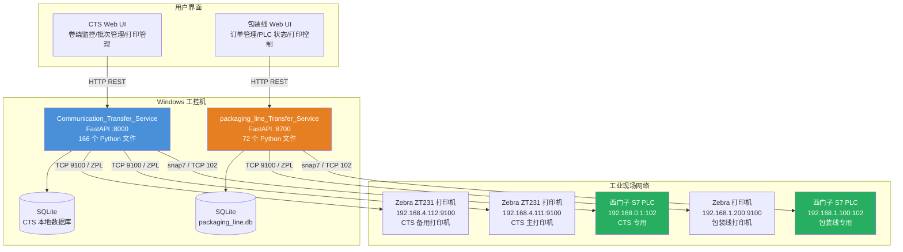
```mermaid
graph TB
    subgraph 工业现场网络
        PLC1["西门子 S7 PLC<br/>192.168.0.1:102<br/>CTS 专用"]
        PLC2["西门子 S7 PLC<br/>192.168.1.100:102<br/>包装线专用"]
        ZT231_1["Zebra ZT231 打印机<br/>192.168.4.111:9100<br/>CTS 主打印机"]
        ZT231_2["Zebra ZT231 打印机<br/>192.168.4.112:9100<br/>CTS 备用打印机"]
        ZT231_3["Zebra 打印机<br/>192.168.1.200:9100<br/>包装线打印机"]
    end

    subgraph 边缘计算节点["Windows 工控机"]
        CTS["Communication_Transfer_Service<br/>FastAPI :8000<br/>166 个 Python 文件"]
        PKG["packaging_line_Transfer_Service<br/>FastAPI :8700<br/>72 个 Python 文件"]
        DB1[("SQLite<br/>CTS 本地数据库")]
        DB2[("SQLite<br/>packaging_line.db")]
    end

    subgraph 用户界面
        WEB1["CTS Web UI<br/>卷绕监控/批次管理/打印管理"]
        WEB2["包装线 Web UI<br/>订单管理/PLC 状态/打印控制"]
    end

    CTS -->|"snap7 / TCP 102"| PLC1
    CTS -->|"TCP 9100 / ZPL"| ZT231_1
    CTS -->|"TCP 9100 / ZPL"| ZT231_2
    CTS --> DB1
    PKG -->|"snap7 / TCP 102"| PLC2
    PKG -->|"TCP 9100 / ZPL"| ZT231_3
    PKG --> DB2
    WEB1 -->|"HTTP REST"| CTS
    WEB2 -->|"HTTP REST"| PKG

    style CTS fill:#4A90D9,color:#fff
    style PKG fill:#E67E22,color:#fff
    style PLC1 fill:#27AE60,color:#fff
    style PLC2 fill:#27AE60,color:#fff
```

### 1.2 两个服务的职责划分

| 维度 | CTS（通信传输服务） | 包装线服务 |
|------|---------------------|-----------|
| **核心职责** | 卷绕工序数据采集、监控、标签打印 | 包装工序订单管理、PLC 交互、标签打印 |
| **PLC 设备** | 192.168.0.1（多 DB 块） | 192.168.1.100（DB750 单块） |
| **数据块** | DB301/320/401/421/651/652/800 | DB750 |
| **运行端口** | 8000 | 8700 |
| **部署方式** | Python venv + NSSM | PyInstaller 打包 + NSSM |
| **数据存储** | SQLite | SQLite |

---

## 2. CTS 服务详细分析

### 2.1 CTS 整体架构

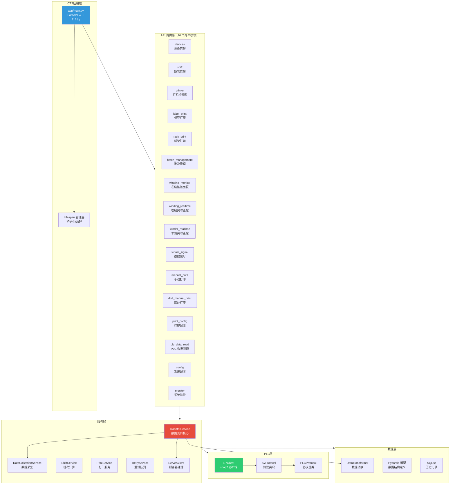
```mermaid
graph TB
    subgraph CTS应用层
        MAIN["app/main.py<br/>FastAPI 入口<br/>916 行"]
        LIFESPAN["Lifespan 管理器<br/>初始化/清理"]
    end

    subgraph API层["API 路由层（16 个路由模块）"]
        API_DEV["devices<br/>设备管理"]
        API_SHIFT["shift<br/>班次管理"]
        API_PRINT["printer<br/>打印机管理"]
        API_LABEL["label_print<br/>标签打印"]
        API_RACK["rack_print<br/>料架打印"]
        API_BATCH["batch_management<br/>批次管理"]
        API_WIND["winding_monitor<br/>卷绕监控面板"]
        API_WREAL["winding_realtime<br/>卷绕实时监控"]
        API_WDREAL["winder_realtime<br/>单锭实时监控"]
        API_VSIG["virtual_signal<br/>虚拟信号"]
        API_MANUAL["manual_print<br/>手动打印"]
        API_DOFF["doff_manual_print<br/>落纱打印"]
        API_PCONF["print_config<br/>打印配置"]
        API_PLCRD["plc_data_read<br/>PLC 数据读取"]
        API_CONF["config<br/>系统配置"]
        API_MON["monitor<br/>系统监控"]
    end

    subgraph 服务层
        TRANSFER["TransferService<br/>数据流转核心"]
        COLLECTION["DataCollectionService<br/>数据采集"]
        SHIFT_SVC["ShiftService<br/>班次计算"]
        PRINT_SVC["PrintService<br/>打印服务"]
        RETRY_SVC["RetryService<br/>重试队列"]
        SERVER_CLI["ServerClient<br/>服务器通信"]
    end

    subgraph PLC层
        S7_CLIENT["S7Client<br/>snap7 客户端"]
        S7_PROTO["S7Protocol<br/>协议实现"]
        BASE_PROTO["PLCProtocol<br/>协议基类"]
    end

    subgraph 数据层
        TRANSFORMER["DataTransformer<br/>数据转换"]
        MODELS["Pydantic 模型<br/>数据结构定义"]
        SQLITE["SQLite<br/>历史记录"]
    end

    MAIN --> LIFESPAN
    MAIN --> API层
    API层 --> 服务层
    服务层 --> PLC层
    服务层 --> 数据层
    S7_PROTO --> BASE_PROTO
    S7_CLIENT --> S7_PROTO
    TRANSFER --> COLLECTION
    TRANSFER --> SERVER_CLI
    TRANSFER --> TRANSFORMER

    style MAIN fill:#3498DB,color:#fff
    style TRANSFER fill:#E74C3C,color:#fff
    style S7_CLIENT fill:#2ECC71,color:#fff
```

### 2.2 启动流程（app/main.py）

CTS 入口文件 `app/main.py`（916 行）负责完整的应用生命周期管理。

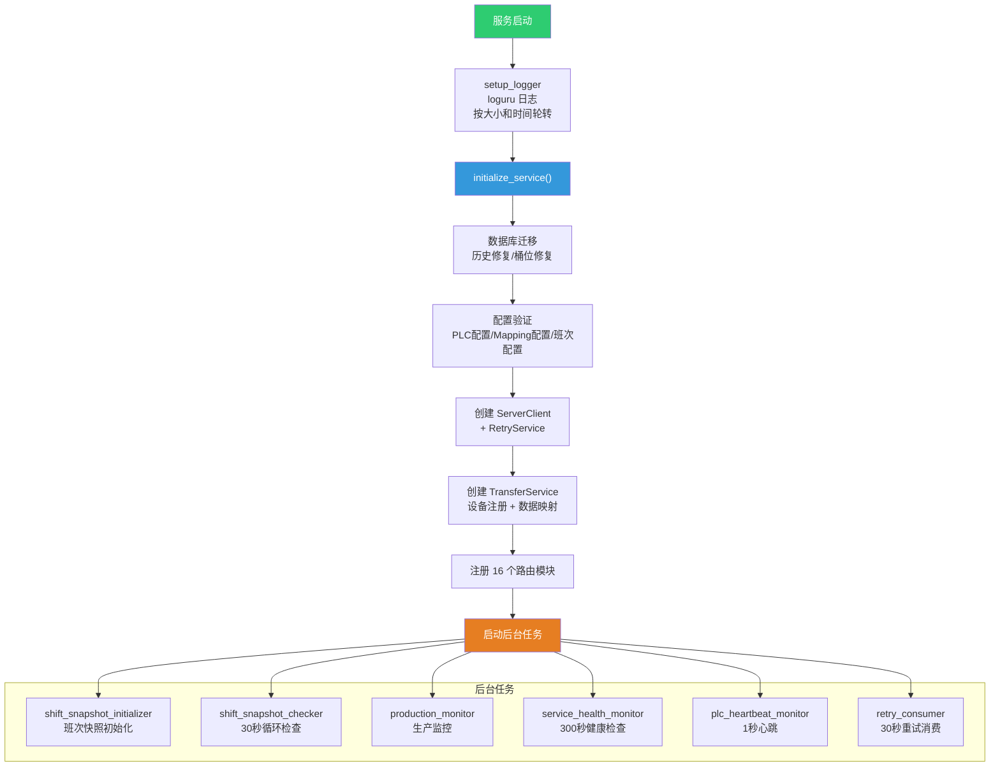
```mermaid
flowchart TD
    START["服务启动"] --> LOG["setup_logger<br/>loguru 日志<br/>按大小和时间轮转"]
    LOG --> INIT["initialize_service()"]
    INIT --> DB_MIG["数据库迁移<br/>历史修复/桶位修复"]
    DB_MIG --> VALID["配置验证<br/>PLC配置/Mapping配置/班次配置"]
    VALID --> CLIENT["创建 ServerClient<br/>+ RetryService"]
    CLIENT --> TRANS["创建 TransferService<br/>设备注册 + 数据映射"]
    TRANS --> ROUTER["注册 16 个路由模块"]
    ROUTER --> BG["启动后台任务"]

    subgraph 后台任务
        BG1["shift_snapshot_initializer<br/>班次快照初始化"]
        BG2["shift_snapshot_checker<br/>30秒循环检查"]
        BG3["production_monitor<br/>生产监控"]
        BG4["service_health_monitor<br/>300秒健康检查"]
        BG5["plc_heartbeat_monitor<br/>1秒心跳"]
        BG6["retry_consumer<br/>30秒重试消费"]
    end

    BG --> BG1
    BG --> BG2
    BG --> BG3
    BG --> BG4
    BG --> BG5
    BG --> BG6

    style START fill:#2ECC71,color:#fff
    style INIT fill:#3498DB,color:#fff
    style BG fill:#E67E22,color:#fff
```

### 2.3 核心服务：TransferService

`app/services/transfer_service.py` 继承 `DataCollectionService`，是数据流转核心：

```python
class TransferService(DataCollectionService):
    """数据流转服务 - 整合数据采集、转换和服务器通讯"""
    def __init__(self, server_client, poll_interval=1.0, enable_cache=True):
        self.server_client = server_client     # 服务器通信客户端
        self.transformer = DataTransformer()   # 数据转换器
        self.device_configs = {}               # 设备配置字典
        self.heartbeat_states = {}             # 心跳状态
        self._heartbeat_locks = {}             # 心跳异步锁
```

**关键方法：**
- `add_device(config)` — 注册 PLC 设备并初始化心跳
- `set_mapping_config(mapping_config)` — 设置数据块到字段的映射关系
- `set_device_configs(device_configs)` — 设置含 metadata 的设备配置

### 2.4 PLC 数据块分布

CTS 管理 7 个数据块，覆盖整个卷绕工序：

| DB 块号 | 名称 | 字节数 | 用途 |
|---------|------|--------|------|
| DB301 | Tail_Rotation_Left | 246 (2×123) | 左侧暂存区（2个位置） |
| DB320 | Tail_Rotation_Right | 246 (2×123) | 右侧暂存区（2个位置） |
| DB401 | Full_Storage_Left | 1107 (9×123) | 左侧满存区（9个位置） |
| DB421 | Full_Storage_Right | 1107 (9×123) | 右侧满存区（9个位置） |
| DB651 | Winder_Monitor_1_4 | 560 (4×140) | 卷绕机 1-4 监控 |
| DB652 | Winder_Monitor_5_8 | 560 (4×140) | 卷绕机 5-8 监控 |
| DB800 | Loading_Monitor | 100 (2×50) | 装车监控（左/右线） |

**每个存储位置（123字节）的字段结构：**

| 字段 | 偏移 | 类型 | 说明 |
|------|------|------|------|
| no_bobbins | +0 | uint16_be | 丝饼数量 |
| position_name | +2 | ascii(8) | 位置名称 |
| doff_no | +10 | uint16_be | 落纱号 |
| chuck_no | +12 | chuck_no | 丝车号 |
| start_time_of_pack | +14 | uint32_be | 包装开始时间 |
| end_time_of_pack | +18 | uint32_be | 包装结束时间 |
| package_type | +22 | uint16_be | 包装类型 |
| package_weight | +24 | uint16_be | 包装重量 |
| yarn_type | +26 | ascii(12) | 丝型号 |
| merge_no | +38 | uint16_be | 合并号 |
| paper_tube | +40 | uint16_be | 纸管 |
| doffing_id | +42 | int32_be | 落纱ID（可写） |
| doffing_product | +46 | ascii(12) | 落纱产品 |
| ... | ... | ... | 约25个字段/位置 |

**doffing_id 特殊含义：**
- `-1` = 待验证
- `0` = 空位
- `>0` = 已验证桶号

---

## 3. 包装线服务详细分析

### 3.1 包装线整体架构

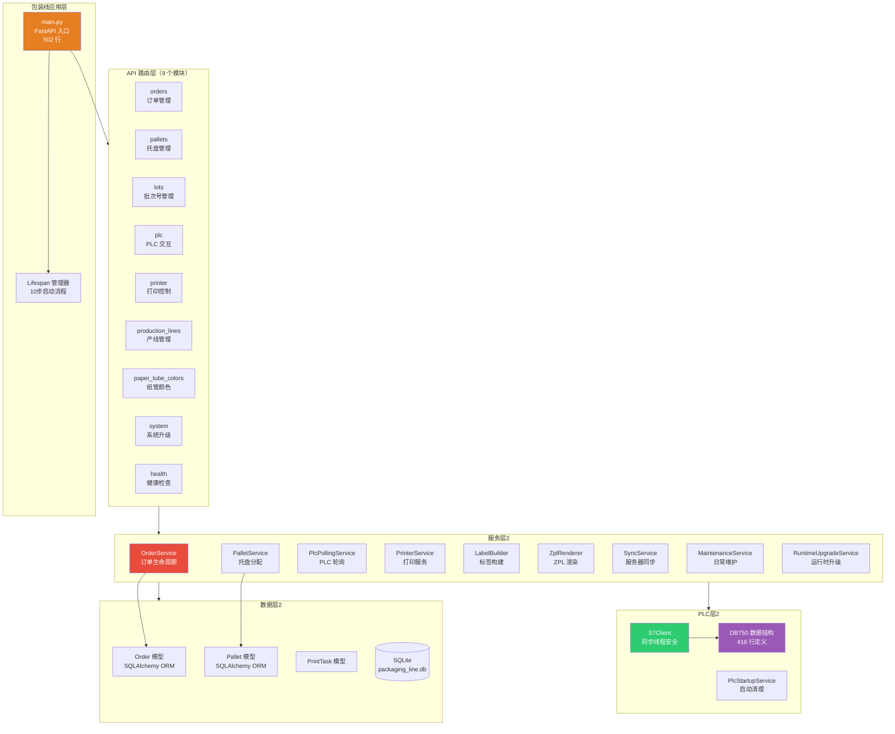
```mermaid
graph TB
    subgraph 包装线应用层
        MAIN2["main.py<br/>FastAPI 入口<br/>502 行"]
        LIFESPAN2["Lifespan 管理器<br/>10步启动流程"]
    end

    subgraph API层2["API 路由层（9 个模块）"]
        API_ORD["orders<br/>订单管理"]
        API_PAL["pallets<br/>托盘管理"]
        API_LOT["lots<br/>批次号管理"]
        API_PLC2["plc<br/>PLC 交互"]
        API_PRINT2["printer<br/>打印控制"]
        API_LINE["production_lines<br/>产线管理"]
        API_COLOR["paper_tube_colors<br/>纸管颜色"]
        API_SYS["system<br/>系统升级"]
        API_HEALTH["health<br/>健康检查"]
    end

    subgraph 服务层2
        ORDER_SVC["OrderService<br/>订单生命周期"]
        PALLET_SVC["PalletService<br/>托盘分配"]
        POLLING_SVC["PlcPollingService<br/>PLC 轮询"]
        PRINTER_SVC2["PrinterService<br/>打印服务"]
        LABEL_BUILD["LabelBuilder<br/>标签构建"]
        ZPL_RENDER["ZplRenderer<br/>ZPL 渲染"]
        SYNC_SVC["SyncService<br/>服务器同步"]
        MAINT_SVC["MaintenanceService<br/>日常维护"]
        UPGRADE_SVC["RuntimeUpgradeService<br/>运行时升级"]
    end

    subgraph PLC层2
        S7_CLIENT2["S7Client<br/>同步线程安全"]
        DB750["DB750 数据结构<br/>416 行定义"]
        STARTUP["PlcStartupService<br/>启动清理"]
    end

    subgraph 数据层2
        ORDER_MODEL["Order 模型<br/>SQLAlchemy ORM"]
        PALLET_MODEL["Pallet 模型<br/>SQLAlchemy ORM"]
        PRINT_TASK["PrintTask 模型"]
        SQLITE2[("SQLite<br/>packaging_line.db")]
    end

    MAIN2 --> LIFESPAN2
    MAIN2 --> API层2
    API层2 --> 服务层2
    服务层2 --> PLC层2
    服务层2 --> 数据层2
    S7_CLIENT2 --> DB750
    ORDER_SVC --> ORDER_MODEL
    PALLET_SVC --> PALLET_MODEL

    style MAIN2 fill:#E67E22,color:#fff
    style ORDER_SVC fill:#E74C3C,color:#fff
    style S7_CLIENT2 fill:#2ECC71,color:#fff
    style DB750 fill:#9B59B6,color:#fff
```

### 3.2 启动流程（10步）

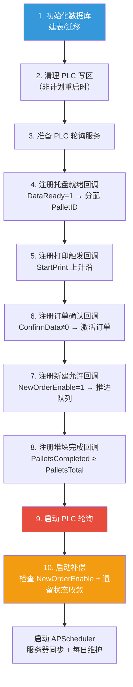
```mermaid
flowchart TD
    S1["1. 初始化数据库<br/>建表/迁移"] --> S2["2. 清理 PLC 写区<br/>（非计划重启时）"]
    S2 --> S3["3. 准备 PLC 轮询服务"]
    S3 --> S4["4. 注册托盘就绪回调<br/>DataReady=1 → 分配 PalletID"]
    S4 --> S5["5. 注册打印触发回调<br/>StartPrint 上升沿"]
    S5 --> S6["6. 注册订单确认回调<br/>ConfirmData≠0 → 激活订单"]
    S6 --> S7["7. 注册新建允许回调<br/>NewOrderEnable=1 → 推进队列"]
    S7 --> S8["8. 注册堆垛完成回调<br/>PalletsCompleted ≥ PalletsTotal"]
    S8 --> S9["9. 启动 PLC 轮询"]
    S9 --> S10["10. 启动补偿<br/>检查 NewOrderEnable + 遗留状态收敛"]
    S10 --> SCHED["启动 APScheduler<br/>服务器同步 + 每日维护"]

    style S1 fill:#3498DB,color:#fff
    style S9 fill:#E74C3C,color:#fff
    style S10 fill:#F39C12,color:#fff
```

### 3.3 DB750 数据块结构

DB750 是包装线与 PLC 的唯一通信接口，定义在 `app/plc/data_blocks.py`（416行）：

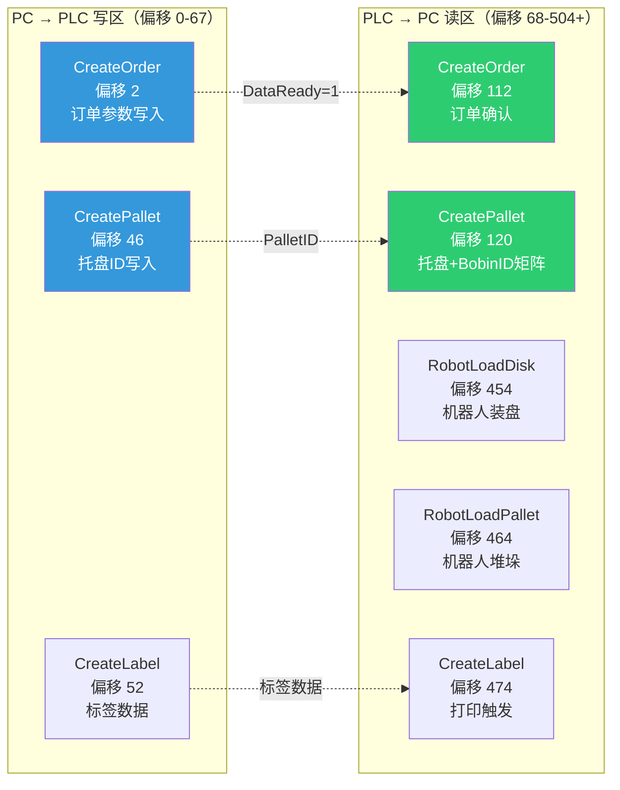
```mermaid
graph LR
    subgraph "PC → PLC 写区（偏移 0-67）"
        CO_W["CreateOrder<br/>偏移 2<br/>订单参数写入"]
        CP_W["CreatePallet<br/>偏移 46<br/>托盘ID写入"]
        CL_W["CreateLabel<br/>偏移 52<br/>标签数据"]
    end

    subgraph "PLC → PC 读区（偏移 68-504+）"
        CO_R["CreateOrder<br/>偏移 112<br/>订单确认"]
        CP_R["CreatePallet<br/>偏移 120<br/>托盘+BobinID矩阵"]
        RD["RobotLoadDisk<br/>偏移 454<br/>机器人装盘"]
        RP["RobotLoadPallet<br/>偏移 464<br/>机器人堆垛"]
        CL_R["CreateLabel<br/>偏移 474<br/>打印触发"]
    end

    CO_W -.->|"DataReady=1"| CO_R
    CP_W -.->|"PalletID"| CP_R
    CL_W -.->|"标签数据"| CL_R

    style CO_W fill:#3498DB,color:#fff
    style CP_W fill:#3498DB,color:#fff
    style CO_R fill:#2ECC71,color:#fff
    style CP_R fill:#2ECC71,color:#fff
```

**CreateOrder 写入结构（PC→PLC）：**

| 字段 | 偏移 | 类型 | 说明 |
|------|------|------|------|
| DataReady | +0 | INT | 状态机（0=空闲, 1=新单, 2=追加, 3=停止） |
| OrderID | +2 | DINT | 订单ID |
| PalletsTotal | +6 | INT | 总托盘数 |
| LayersPerPallet | +8 | INT | 每托盘层数 |
| BobinsPerLayer | +10 | INT | 每层丝饼数（固定9） |
| PalletHeight | +12 | INT | 托盘高度 |
| PalletType | +14 | INT | 托盘类型 |
| ... | ... | ... | 包含纸管颜色等 |

**CreatePallet 读取结构（PLC→PC）：**

| 字段 | 偏移 | 类型 | 说明 |
|------|------|------|------|
| DataReady | +0 | INT | 1=托盘就绪 |
| PalletID | +2 | DINT | 当前托盘ID |
| BobinID_base | +6 | RAW(324) | 81个DINT的丝饼ID矩阵（9层×9列） |

### 3.4 订单生命周期

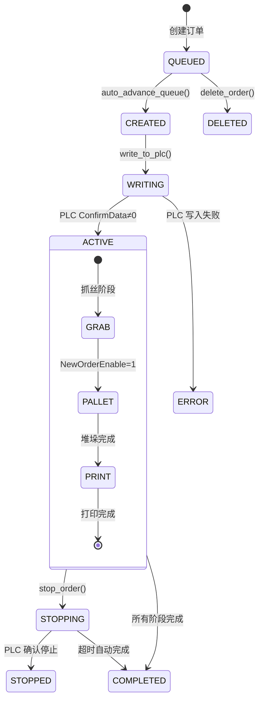
```mermaid
stateDiagram-v2
    [*] --> QUEUED: 创建订单
    QUEUED --> CREATED: auto_advance_queue()
    CREATED --> WRITING: write_to_plc()
    WRITING --> ACTIVE: PLC ConfirmData≠0
    ACTIVE --> STOPPING: stop_order()
    ACTIVE --> COMPLETED: 所有阶段完成
    STOPPING --> STOPPED: PLC 确认停止
    STOPPING --> COMPLETED: 超时自动完成
    QUEUED --> DELETED: delete_order()
    WRITING --> ERROR: PLC 写入失败

    state ACTIVE {
        [*] --> GRAB: 抓丝阶段
        GRAB --> PALLET: NewOrderEnable=1
        PALLET --> PRINT: 堆垛完成
        PRINT --> [*]: 打印完成
    }
```

**三阶段流水线（grab → pallet → print）：**

1. **抓丝阶段（grab）**：PLC 执行机器人抓丝，NewOrderEnable=1 时标记抓丝完成
2. **堆垛阶段（pallet）**：机器人堆垛到托盘，PalletsCompleted ≥ PalletsTotal 时完成
3. **打印阶段（print）**：标签打印完成后订单彻底结束

---

## 4. PLC 通信协议分析

### 4.1 CTS 的 S7 客户端（异步）

`app/plc/s7_client.py`（530行）— 基于 snap7 的异步 S7 通信客户端：

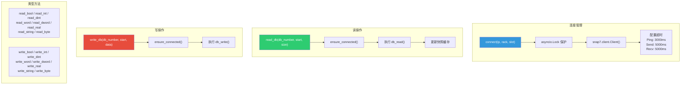
```mermaid
flowchart TD
    subgraph 连接管理
        CONN["connect(ip, rack, slot)"] --> LOCK["asyncio.Lock 保护"]
        LOCK --> SNAP7["snap7.client.Client()"]
        SNAP7 --> TIMEOUT["配置超时<br/>Ping: 3000ms<br/>Send: 5000ms<br/>Recv: 5000ms"]
    end

    subgraph 读操作
        READ["read_db(db_number, start, size)"] --> ENSURE["ensure_connected()"]
        ENSURE --> EXEC["执行 db_read()"]
        EXEC --> CACHE["更新快照缓存"]
    end

    subgraph 写操作
        WRITE["write_db(db_number, start, data)"] --> ENSURE2["ensure_connected()"]
        ENSURE2 --> EXEC2["执行 db_write()"]
    end

    subgraph 类型方法
        RT["read_bool / read_int / read_dint<br/>read_word / read_dword / read_real<br/>read_string / read_byte"]
        WT["write_bool / write_int / write_dint<br/>write_word / write_dword / write_real<br/>write_string / write_byte"]
    end

    style CONN fill:#3498DB,color:#fff
    style READ fill:#2ECC71,color:#fff
    style WRITE fill:#E74C3C,color:#fff
```

**关键设计细节：**

```python
class S7Client:
    _BLOCK_INTERVAL_SECONDS = {651: 2.0, 652: 2.0}  # 监控块降频读取
    _priority_db_numbers = {800, 301, 320, 401, 421}  # 优先读取块

    # 性能阈值
    _slow_read_threshold_ms = 5000.0
    _critical_read_threshold_ms = 15000.0
    _per_block_slow_threshold_ms = 2000.0
    _per_block_critical_threshold_ms = 6000.0

    # 全局单例管理
    @staticmethod
    async def get_or_create_client(ip, rack, slot):
        # asyncio.Lock 保护的全局单例
```

**协议基类（app/plc/protocols/base.py）：**

```python
class PLCProtocol(ABC):
    """PLC 协议抽象接口"""
    async def connect(self) -> bool: ...
    async def disconnect(self): ...
    async def read_data(self) -> List[PLCDataPoint]: ...
    async def write_data(self, address, value, data_type) -> bool: ...
    async def is_connected(self) -> bool: ...
    async def read_bytes(self, address, size) -> bytes: ...
    async def write_bytes(self, address, data) -> bool: ...
```

**S7Protocol 实现（app/plc/protocols/s7.py）：**

```python
class S7Protocol(PLCProtocol):
    """西门子 S7 协议实现"""
    def __init__(self, config):
        self.client = snap7.client.Client()
        self._lock = asyncio.Lock()
        # 连接超时配置
        # PingTimeout: 3000ms, SendTimeout: 5000ms, RecvTimeout: 5000ms
        # WorkInterval: 100ms

    # 快照缓存机制：DB651/652 降频到 2 秒
    _block_snapshot_cache: dict[int, List[PLCDataPoint]] = {}
    _block_last_read_at: dict[int, float] = {}
    _snapshot_fallback_max_age_seconds = 5.0
```

### 4.2 包装线的 S7 客户端（同步线程安全）

`app/plc/s7_client.py`（314行）— 同步版 S7 客户端：

```python
class S7Client:
    """同步线程安全 S7 客户端"""
    # 重连策略：失败时销毁客户端，cooldown 冷却
    # 统计：total_disconnects, reconnect_attempts, online_seconds
    # 类型方法：read/write_int, read/write_dint, read/write_byte,
    #          read_bool, read/write_string
    # 批量读取：read_plc_to_pc_block() 一次读偏移 50-411
```

### 4.3 PLC 轮询服务

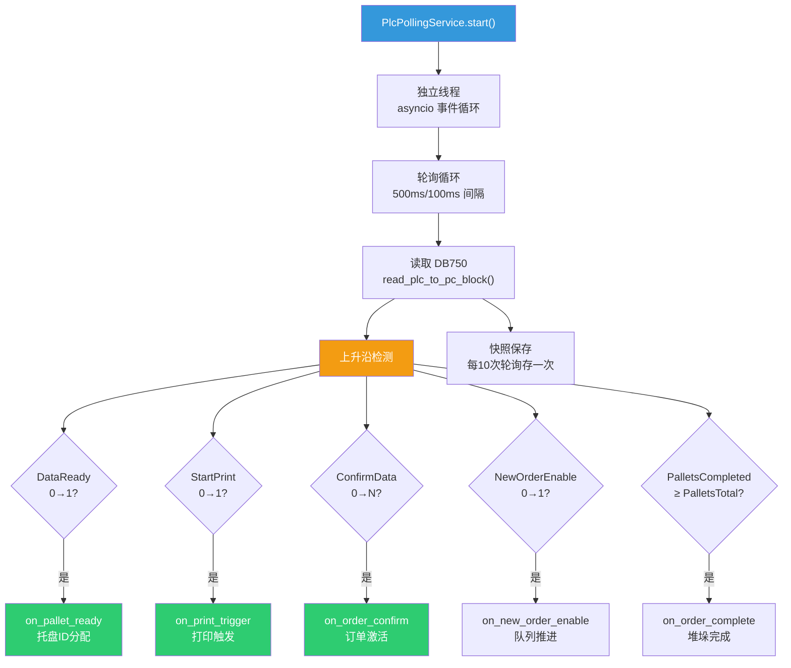
```mermaid
flowchart TD
    START["PlcPollingService.start()"] --> THREAD["独立线程<br/>asyncio 事件循环"]
    THREAD --> POLL["轮询循环<br/>500ms/100ms 间隔"]
    POLL --> READ["读取 DB750<br/>read_plc_to_pc_block()"]
    READ --> DETECT["上升沿检测"]

    DETECT --> E1{"DataReady<br/>0→1?"}
    DETECT --> E2{"StartPrint<br/>0→1?"}
    DETECT --> E3{"ConfirmData<br/>0→N?"}
    DETECT --> E4{"NewOrderEnable<br/>0→1?"}
    DETECT --> E5{"PalletsCompleted<br/>≥ PalletsTotal?"}

    E1 -->|"是"| CB1["on_pallet_ready<br/>托盘ID分配"]
    E2 -->|"是"| CB2["on_print_trigger<br/>打印触发"]
    E3 -->|"是"| CB3["on_order_confirm<br/>订单激活"]
    E4 -->|"是"| CB4["on_new_order_enable<br/>队列推进"]
    E5 -->|"是"| CB5["on_order_complete<br/>堆垛完成"]

    READ --> SNAP["快照保存<br/>每10次轮询存一次"]

    style START fill:#3498DB,color:#fff
    style DETECT fill:#F39C12,color:#fff
    style CB1 fill:#2ECC71,color:#fff
    style CB2 fill:#2ECC71,color:#fff
    style CB3 fill:#2ECC71,color:#fff
```

### 4.4 数据类型转换

CTS 使用 Big-Endian 字节序，支持以下数据类型转换：

| 转换名称 | Python 实现 | 说明 |
|----------|-------------|------|
| `uint8` | `struct.unpack('>B', data)` | 无符号8位 |
| `uint16_be` | `struct.unpack('>H', data)` | 无符号16位大端 |
| `uint32_be` | `struct.unpack('>I', data)` | 无符号32位大端 |
| `int32_be` | `struct.unpack('>i', data)` | 有符号32位大端 |
| `ascii` | `data.decode('ascii').strip('\x00')` | ASCII 字符串 |
| `chuck_no` | 自定义解析 | 丝车号特殊编码 |
| `BYTE_ARRAY` | 原始字节数组 | 基础数据类型 |

---

## 5. 标签打印系统分析

### 5.1 CTS 标签打印架构

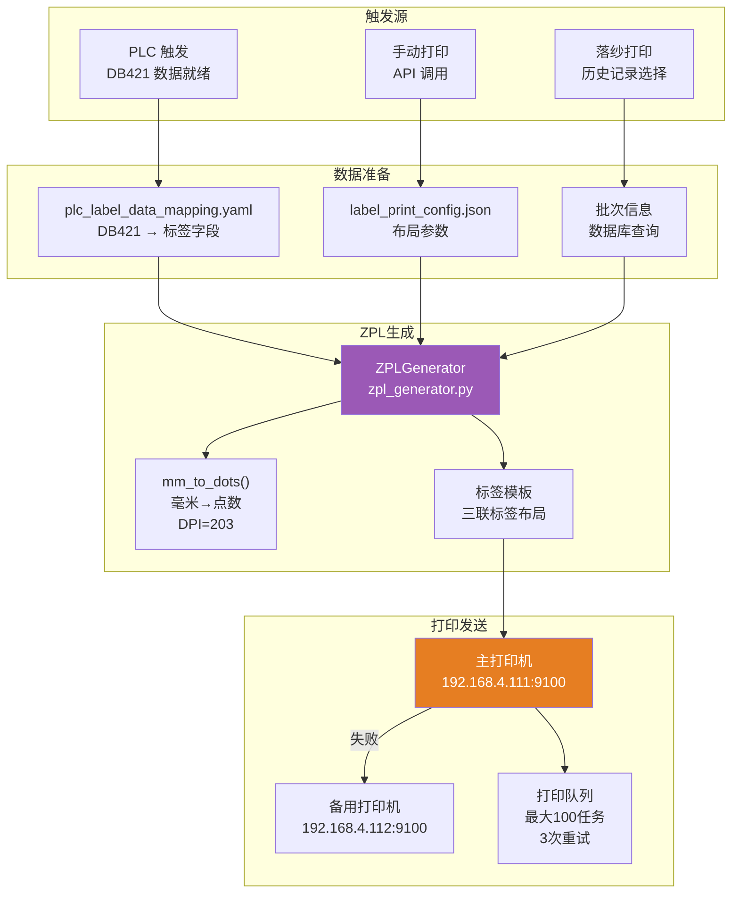
```mermaid
flowchart TD
    subgraph 触发源
        PLC_TRIG["PLC 触发<br/>DB421 数据就绪"]
        MANUAL["手动打印<br/>API 调用"]
        DOFF["落纱打印<br/>历史记录选择"]
    end

    subgraph 数据准备
        MAPPING["plc_label_data_mapping.yaml<br/>DB421 → 标签字段"]
        CONFIG["label_print_config.json<br/>布局参数"]
        BATCH["批次信息<br/>数据库查询"]
    end

    subgraph ZPL生成
        GEN["ZPLGenerator<br/>zpl_generator.py"]
        MM2DOT["mm_to_dots()<br/>毫米→点数<br/>DPI=203"]
        TEMPLATE["标签模板<br/>三联标签布局"]
    end

    subgraph 打印发送
        PRIMARY["主打印机<br/>192.168.4.111:9100"]
        BACKUP["备用打印机<br/>192.168.4.112:9100"]
        QUEUE["打印队列<br/>最大100任务<br/>3次重试"]
    end

    PLC_TRIG --> MAPPING
    MANUAL --> CONFIG
    DOFF --> BATCH
    MAPPING --> GEN
    CONFIG --> GEN
    BATCH --> GEN
    GEN --> MM2DOT
    GEN --> TEMPLATE
    TEMPLATE --> PRIMARY
    PRIMARY -->|"失败"| BACKUP
    PRIMARY --> QUEUE

    style GEN fill:#9B59B6,color:#fff
    style PRIMARY fill:#E67E22,color:#fff
```

### 5.2 ZPL 生成器详解

`app/services/zpl_generator.py` — ZPL 指令生成核心：

```python
class ZPLGenerator:
    def __init__(self, dpi=203, encoding="GB18030"):
        self.dpi = dpi
        self.encoding = encoding

    def mm_to_dots(self, mm, dpi=None):
        """1英寸 = 25.4mm → dots = mm × dpi / 25.4"""
        return int(mm * (dpi or self.dpi) / 25.4)

    def generate_dual_different_label(self, left_data, right_data, darkness=15, print_speed=4):
        """生成左右不同内容的双联标签"""
```

### 5.3 标签数据映射（plc_label_data_mapping.yaml）

| 标签字段 | PLC 来源 | 偏移 | 长度 | 转换规则 |
|----------|----------|------|------|----------|
| batch_no | DB421 | DBB104 | 12字节 | strip("-"后内容) |
| specification | DB421 | DBB38 | 12字节 | yarn_type 原值 |
| winder_position | DB421 | DBB4 | 8字节 | 提取空格后部分 |
| no_bobbins | DB421 | DBB0 | 2字节 | uint16_be |
| doff_no | DB421 | DBB12 | 2字节 | uint16_be |
| 默认值 | — | — | — | UNKNOWN/H805 |

### 5.4 CTS 标签布局配置（label_print_config.json）

```
标签总宽度: 100mm × 20mm（高度）
├── Panel 1: 30mm
├── Gap: 3mm
├── Panel 2: 30mm
├── Gap: 3mm
└── Panel 3: 30mm（或空白）

DPI: 203
打印浓度: 15
打印速度: 4
字体尺寸: 第一行30 / 第二行26 / 第三行26
```

### 5.5 打印机配置（printer_config.yaml）

```yaml
printers:
  primary:
    host: 192.168.4.111
    port: 9100
    model: Zebra ZT231
  backup:
    host: 192.168.4.112
    port: 9100
    model: Zebra ZT231

encoding:
  charset: GB18030
  font: SIMSUN.FNT   # 中文宋体字库

queue:
  max_size: 100
  retry_count: 3
  retry_delay: 2  # 秒
```

### 5.6 包装线标签打印

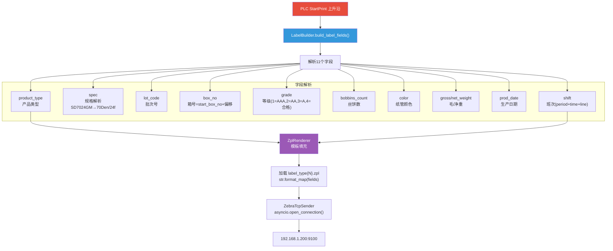
```mermaid
flowchart TD
    TRIG["PLC StartPrint 上升沿"] --> BUILD["LabelBuilder.build_label_fields()"]
    BUILD --> PARSE["解析11个字段"]

    subgraph 字段解析
        F1["product_type<br/>产品类型"]
        F2["spec<br/>规格解析<br/>SD7024GM→70Den/24f"]
        F3["lot_code<br/>批次号"]
        F4["box_no<br/>箱号=start_box_no+偏移"]
        F5["grade<br/>等级(1=AAA,2=AA,3=A,4=合格)"]
        F6["bobbins_count<br/>丝饼数"]
        F7["color<br/>纸管颜色"]
        F8["gross/net_weight<br/>毛/净重"]
        F9["prod_date<br/>生产日期"]
        F10["shift<br/>班次(period+time+line)"]
    end

    PARSE --> F1
    PARSE --> F2
    PARSE --> F3
    PARSE --> F4
    PARSE --> F5
    PARSE --> F6
    PARSE --> F7
    PARSE --> F8
    PARSE --> F9
    PARSE --> F10

    F1 --> RENDER["ZplRenderer<br/>模板填充"]
    F10 --> RENDER
    RENDER --> LOAD["加载 label_type{N}.zpl<br/>str.format_map(fields)"]
    LOAD --> SEND["ZebraTcpSender<br/>asyncio.open_connection()"]
    SEND --> PRINTER["192.168.1.200:9100"]

    style TRIG fill:#E74C3C,color:#fff
    style BUILD fill:#3498DB,color:#fff
    style RENDER fill:#9B59B6,color:#fff
```

**ZebraTcpSender（app/services/zebra_tcp.py, 48行）：**

```python
async def send_zpl(host, port, zpl_bytes, timeout=10):
    """异步 TCP 发送 ZPL 指令"""
    reader, writer = await asyncio.open_connection(host, port)
    writer.write(zpl_bytes)
    await writer.drain()
    # 失败时 transport.abort() 强制关闭
```

---

## 6. 数据模型分析

### 6.1 包装线数据模型

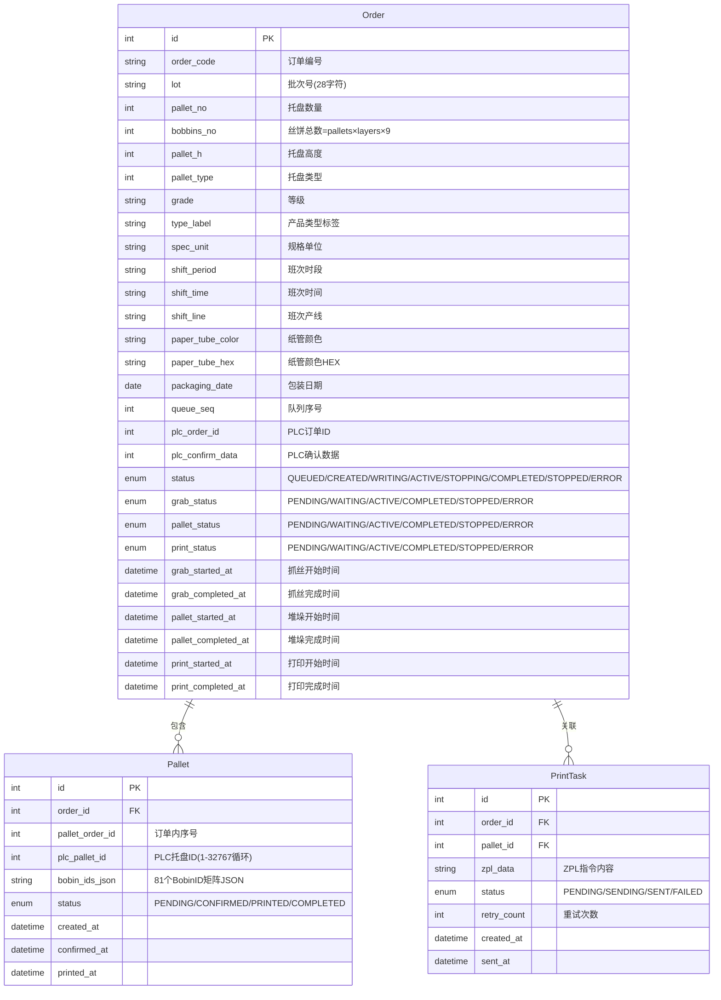
```mermaid
erDiagram
    Order ||--o{ Pallet : "包含"
    Order ||--o{ PrintTask : "关联"

    Order {
        int id PK
        string order_code "订单编号"
        string lot "批次号(28字符)"
        int pallet_no "托盘数量"
        int bobbins_no "丝饼总数=pallets×layers×9"
        int pallet_h "托盘高度"
        int pallet_type "托盘类型"
        string grade "等级"
        string type_label "产品类型标签"
        string spec_unit "规格单位"
        string shift_period "班次时段"
        string shift_time "班次时间"
        string shift_line "班次产线"
        string paper_tube_color "纸管颜色"
        string paper_tube_hex "纸管颜色HEX"
        date packaging_date "包装日期"
        int queue_seq "队列序号"
        int plc_order_id "PLC订单ID"
        int plc_confirm_data "PLC确认数据"
        enum status "QUEUED/CREATED/WRITING/ACTIVE/STOPPING/COMPLETED/STOPPED/ERROR"
        enum grab_status "PENDING/WAITING/ACTIVE/COMPLETED/STOPPED/ERROR"
        enum pallet_status "PENDING/WAITING/ACTIVE/COMPLETED/STOPPED/ERROR"
        enum print_status "PENDING/WAITING/ACTIVE/COMPLETED/STOPPED/ERROR"
        datetime grab_started_at "抓丝开始时间"
        datetime grab_completed_at "抓丝完成时间"
        datetime pallet_started_at "堆垛开始时间"
        datetime pallet_completed_at "堆垛完成时间"
        datetime print_started_at "打印开始时间"
        datetime print_completed_at "打印完成时间"
    }

    Pallet {
        int id PK
        int order_id FK
        int pallet_order_id "订单内序号"
        int plc_pallet_id "PLC托盘ID(1-32767循环)"
        string bobin_ids_json "81个BobinID矩阵JSON"
        enum status "PENDING/CONFIRMED/PRINTED/COMPLETED"
        datetime created_at
        datetime confirmed_at
        datetime printed_at
    }

    PrintTask {
        int id PK
        int order_id FK
        int pallet_id FK
        string zpl_data "ZPL指令内容"
        enum status "PENDING/SENDING/SENT/FAILED"
        int retry_count "重试次数"
        datetime created_at
        datetime sent_at
    }
```

### 6.2 订单状态机

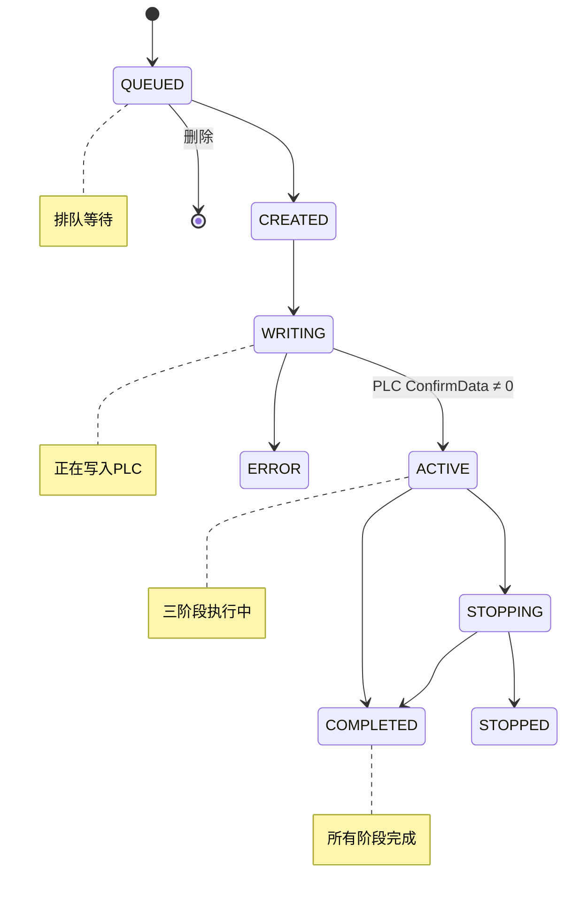
```mermaid
stateDiagram-v2
    [*] --> QUEUED
    QUEUED --> CREATED
    CREATED --> WRITING
    WRITING --> ACTIVE: PLC ConfirmData ≠ 0
    ACTIVE --> STOPPING
    ACTIVE --> COMPLETED
    STOPPING --> STOPPED
    STOPPING --> COMPLETED
    WRITING --> ERROR
    QUEUED --> [*]: 删除

    note right of QUEUED: 排队等待
    note right of WRITING: 正在写入PLC
    note right of ACTIVE: 三阶段执行中
    note right of COMPLETED: 所有阶段完成
```

### 6.3 三阶段状态跟踪（OrderStageStatus）

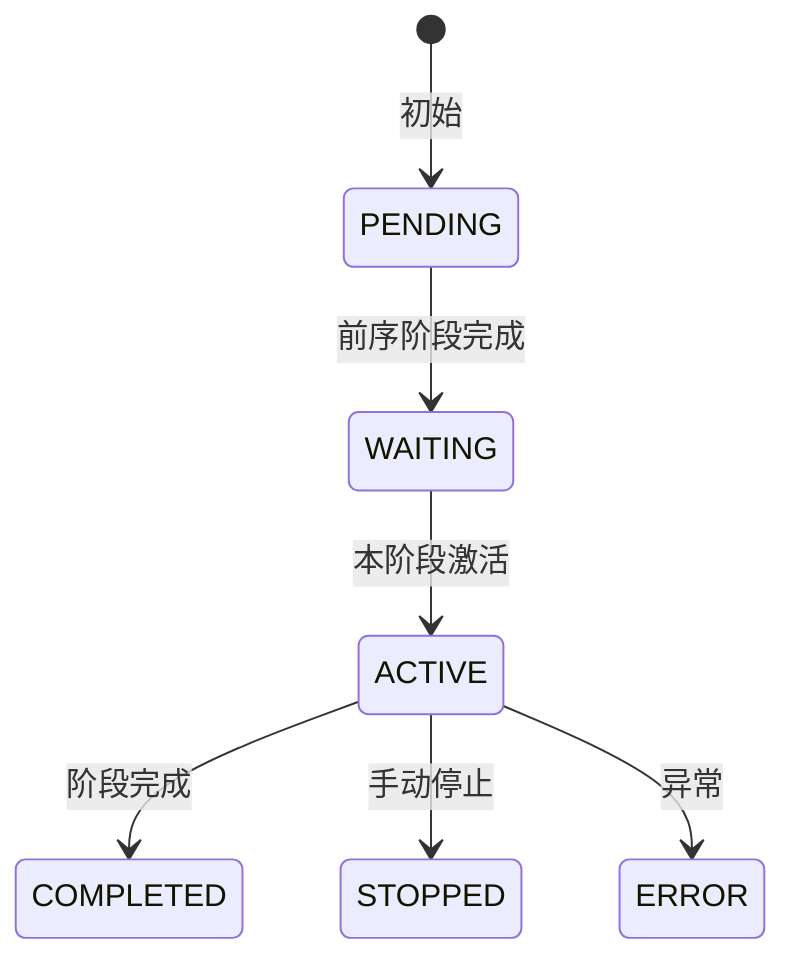
```mermaid
stateDiagram-v2
    [*] --> PENDING: 初始
    PENDING --> WAITING: 前序阶段完成
    WAITING --> ACTIVE: 本阶段激活
    ACTIVE --> COMPLETED: 阶段完成
    ACTIVE --> STOPPED: 手动停止
    ACTIVE --> ERROR: 异常
```

每个订单同时跟踪三个阶段的状态（`grab_status`, `pallet_status`, `print_status`），各阶段独立推进但有依赖顺序。

---

## 7. API 端点汇总

### 7.1 CTS API 端点（端口 8000）

#### 设备管理 `/devices`

| 方法 | 路径 | 说明 |
|------|------|------|
| GET | `/devices/` | 设备列表 |
| GET | `/devices/{device_id}` | 设备详情 |
| POST | `/devices/` | 创建设备 |
| PUT | `/devices/{device_id}` | 更新设备 |
| DELETE | `/devices/{device_id}` | 删除设备 |
| POST | `/devices/{device_id}/reconnect` | 重连设备 |
| POST | `/devices/{device_id}/enable` | 启用设备 |
| POST | `/devices/{device_id}/disable` | 禁用设备 |
| GET | `/devices/{device_id}/data-blocks` | 数据块列表 |
| POST | `/devices/{device_id}/data-blocks` | 创建数据块 |
| PUT | `/devices/{device_id}/data-blocks/{index}` | 更新数据块 |
| DELETE | `/devices/{device_id}/data-blocks/{index}` | 删除数据块 |
| GET | `/devices/{device_id}/data-blocks/{bi}/fields` | 字段列表 |
| POST | `/devices/{device_id}/data-blocks/{bi}/fields` | 创建字段 |
| PUT | `/devices/{device_id}/data-blocks/{bi}/fields/{fi}` | 更新字段 |
| DELETE | `/devices/{device_id}/data-blocks/{bi}/fields/{fi}` | 删除字段 |

#### 班次管理 `/shift`

| 方法 | 路径 | 说明 |
|------|------|------|
| GET | `/shift/status` | 班次状态 |
| GET | `/shift/current` | 当前班次 |
| GET | `/shift/schedule/date/{date}` | 指定日期排班 |
| GET | `/shift/config` | 班次配置 |
| POST | `/shift/reload` | 重新加载配置 |
| GET | `/shift/calculate` | 计算班次 |
| GET | `/shift/definitions` | 班次定义 |
| PUT | `/shift/config` | 更新完整配置 |
| PUT | `/shift/config/global` | 更新全局设置 |
| PUT | `/shift/config/shifts` | 更新班次定义 |
| PUT | `/shift/config/rules` | 更新班次规则 |

#### 打印机管理 `/printer`

| 方法 | 路径 | 说明 |
|------|------|------|
| GET | `/printer/status` | 打印机状态 |
| GET | `/printer/list` | 打印机列表 |
| GET | `/printer/config` | 打印机配置 |
| POST | `/printer/test` | 测试连接 |
| POST | `/printer/test/print` | 测试打印 |
| POST | `/printer/print` | 单张打印 |
| POST | `/printer/print/batch` | 批量打印 |
| GET | `/printer/history` | 打印历史 |
| GET | `/printer/logs` | 打印日志 |
| GET | `/printer/logs/{task_id}` | 任务日志详情 |
| POST | `/printer/logs/{task_id}/reprint` | 重打印 |
| POST | `/printer/reload` | 重新加载配置 |

#### 标签打印 `/label-print`

| 方法 | 路径 | 说明 |
|------|------|------|
| POST | `/label-print/print` | 打印标签 |
| POST | `/label-print/print-batch` | 批量打印 |
| GET | `/label-print/records` | 打印记录 |
| POST | `/label-print/reprint/{record_id}` | 重打印 |
| GET | `/label-print/statistics` | 打印统计 |

#### 料架打印 `/rack-print`

| 方法 | 路径 | 说明 |
|------|------|------|
| POST | `/rack-print/print` | 料架标签打印 |
| GET | `/rack-print/barrels` | 桶信息查询 |

#### 打印配置 `/print-config`

| 方法 | 路径 | 说明 |
|------|------|------|
| GET | `/print-config/config` | 获取标签配置 |
| PUT | `/print-config/config` | 更新标签配置 |
| POST | `/print-config/config/reset` | 重置配置 |
| GET | `/print-config/printers` | 打印机信息 |
| GET | `/print-config/printers/{id}` | 打印机详情 |
| POST | `/print-config/printers/{id}/test` | 测试打印机 |
| POST | `/print-config/printers/{id}/set-default` | 设为默认 |
| POST | `/print-config/print` | 通过配置打印 |
| POST | `/print-config/print/batch` | 批量配置打印 |

#### 监控相关

| 方法 | 路径 | 说明 |
|------|------|------|
| GET | `/winding-monitor/summary` | 卷绕监控概要 |
| GET | `/winding-monitor/winder-status` | 单锭状态 |
| GET | `/winding-monitor/storage-status` | 存储位状态 |
| GET | `/winding-monitor/loading-status` | 装车状态 |
| GET | `/winding-monitor/barrel/{doffing_id}` | 桶详情 |
| GET | `/winding-monitor/recent-prints` | 近期打印 |
| GET | `/winding-monitor/batch-info/{batch_no}` | 批次信息 |
| GET | `/winding-monitor/statistics/today` | 今日统计 |
| GET | `/winding/storage/status` | 存储实时状态 |
| GET | `/winding/statistics` | 卷绕统计 |
| GET | `/winder/realtime/status` | 单锭实时状态 |
| GET | `/winder/history/recent` | 近期历史 |
| GET | `/winder/statistics` | 单锭统计 |

#### 虚拟信号 `/virtual-signal`

| 方法 | 路径 | 说明 |
|------|------|------|
| GET | `/virtual-signal/status` | 信号状态 |
| POST | `/virtual-signal/trigger-loading` | 触发装车 |
| GET | `/virtual-signal/loading-status/{side}` | 装车状态 |
| GET | `/virtual-signal/ok-data/{side}` | OK数据 |
| DELETE | `/virtual-signal/clear-loading/{side}` | 清除装车 |
| DELETE | `/virtual-signal/clear-ok-data/{side}` | 清除OK数据 |
| DELETE | `/virtual-signal/clear-all` | 清除全部 |

#### 其他

| 方法 | 路径 | 说明 |
|------|------|------|
| POST | `/plc/read-batch-data` | PLC批量读取 |
| POST | `/plc/trigger-print-with-plc` | PLC触发打印 |
| GET | `/config/server` | 服务器配置 |
| PUT | `/config/server` | 更新服务器配置 |
| GET | `/config/service` | 服务配置 |
| PUT | `/config/service` | 更新服务配置 |
| GET | `/config/mapping` | 映射配置 |
| PUT | `/config/mapping` | 更新映射 |
| GET | `/monitor/health` | 监控健康 |
| GET | `/monitor/stats` | 监控统计 |
| GET | `/monitor/devices/{id}/data` | 设备数据 |
| GET | `/batch-management/list` | 批次列表 |
| GET | `/batch-management/{code}` | 批次详情 |
| PUT | `/batch-management/{code}` | 更新批次 |
| DELETE | `/batch-management/{code}` | 删除批次 |
| POST | `/manual-print/print` | 手动打印 |
| POST | `/manual-print/preview` | 打印预览 |
| GET | `/doff/history` | 落纱历史 |
| POST | `/doff/print-manual` | 落纱手动打印 |
| GET | `/doff/history/{doff_id}` | 落纱详情 |

#### Web UI 页面

| 路径 | 说明 |
|------|------|
| `/` | 首页 |
| `/batch-management` | 批次管理 |
| `/shift-management` | 班次管理 |
| `/printer-management` | 打印机管理 |
| `/manual-print` | 手动打印 |
| `/label-print-config` | 标签配置 |
| `/winding-monitor` | 卷绕监控面板 |
| `/winding-realtime` | 卷绕实时监控 |
| `/winder-realtime` | 单锭实时监控 |

#### 健康检查

| 方法 | 路径 | 说明 |
|------|------|------|
| GET | `/health` | 综合健康状态（启动状态/PLC心跳/打印队列/异常计数） |
| GET | `/service/health` | 服务层健康 |
| GET | `/devices` | 设备状态汇总 |
| POST | `/devices/{id}/reconnect` | 设备重连 |

### 7.2 包装线 API 端点（端口 8700）

#### 订单管理 `/api/v1/orders`

| 方法 | 路径 | 说明 |
|------|------|------|
| POST | `/api/v1/orders` | 创建订单 |
| POST | `/api/v1/orders/{id}/write-to-plc` | 写入PLC |
| POST | `/api/v1/orders/{id}/add-pallets` | 追加托盘 |
| POST | `/api/v1/orders/{id}/stop` | 停止订单 |
| POST | `/api/v1/orders/{id}/complete` | 完成订单 |
| POST | `/api/v1/orders/{id}/manual-complete` | 异常完成 |
| POST | `/api/v1/orders/{id}/force-local-complete` | 强制本地完成 |
| POST | `/api/v1/orders/{id}/activate` | 激活队列订单 |
| DELETE | `/api/v1/orders/{id}` | 删除排队订单 |
| GET | `/api/v1/orders` | 订单列表 |
| GET | `/api/v1/orders/active` | 当前活跃订单 |
| GET | `/api/v1/orders/{id}` | 订单详情 |

#### 托盘管理 `/api/v1/pallets`

| 方法 | 路径 | 说明 |
|------|------|------|
| GET | `/api/v1/pallets` | 托盘列表 |
| GET | `/api/v1/pallets/manual-create-preview` | 手动创建预览 |
| POST | `/api/v1/pallets/manual-create` | 手动创建托盘 |
| GET | `/api/v1/pallets/{id}` | 托盘详情 |

#### 批次号管理 `/api/v1/lots`

| 方法 | 路径 | 说明 |
|------|------|------|
| POST | `/api/v1/lots` | 创建批次号 |
| PUT | `/api/v1/lots/{id}` | 更新批次号 |
| DELETE | `/api/v1/lots/{id}` | 删除批次号 |
| GET | `/api/v1/lots` | 批次号列表 |
| GET | `/api/v1/lots/{id}` | 批次号详情 |

#### PLC 交互 `/api/v1/plc`

| 方法 | 路径 | 说明 |
|------|------|------|
| GET | `/api/v1/plc/status` | PLC实时状态 |
| GET | `/api/v1/plc/stats` | PLC连接统计 |
| POST | `/api/v1/plc/connect` | 手动连接 |
| POST | `/api/v1/plc/disconnect` | 断开连接 |
| POST | `/api/v1/plc/read-now` | 立即读取快照 |
| POST | `/api/v1/plc/create-pallet-write/clear` | 清零写区 |
| POST | `/api/v1/plc/write` | 手动写寄存器（调试） |
| GET | `/api/v1/plc/snapshots` | 历史快照 |

#### 打印控制 `/api/v1/printer`

| 方法 | 路径 | 说明 |
|------|------|------|
| POST | `/api/v1/printer/print` | 触发打印 |
| GET | `/api/v1/printer/status` | 打印机状态 |
| POST | `/api/v1/printer/test` | 测试连接 |
| GET | `/api/v1/printer/tasks` | 打印任务列表 |
| GET | `/api/v1/printer/tasks/{id}` | 任务详情 |
| POST | `/api/v1/printer/tasks/{id}/retry` | 重试任务 |

#### 产线管理 `/api/v1/production-lines`

| 方法 | 路径 | 说明 |
|------|------|------|
| POST | `/api/v1/production-lines` | 创建产线 |
| PUT | `/api/v1/production-lines/{id}` | 更新产线 |
| DELETE | `/api/v1/production-lines/{id}` | 删除产线 |
| GET | `/api/v1/production-lines` | 产线列表 |
| GET | `/api/v1/production-lines/{id}` | 产线详情 |

#### 纸管颜色 `/api/v1/paper-tube-colors`

| 方法 | 路径 | 说明 |
|------|------|------|
| POST | `/api/v1/paper-tube-colors` | 创建颜色 |
| PUT | `/api/v1/paper-tube-colors/{id}` | 更新颜色 |
| DELETE | `/api/v1/paper-tube-colors/{id}` | 删除颜色 |
| GET | `/api/v1/paper-tube-colors` | 颜色列表 |
| GET | `/api/v1/paper-tube-colors/{id}` | 颜色详情 |

#### 系统管理 `/api/v1/system`

| 方法 | 路径 | 说明 |
|------|------|------|
| GET | `/api/v1/system/upgrade-status` | 升级排空状态 |
| POST | `/api/v1/system/prepare-upgrade` | 进入升级模式 |
| POST | `/api/v1/system/cancel-upgrade` | 取消升级模式 |

#### 健康与安全

| 方法 | 路径 | 说明 |
|------|------|------|
| GET | `/health` | 服务健康检查 |
| POST | `/api/v1/access/verify-lot-password` | 验证批号管理密码 |

---

## 8. 班次管理系统分析

### 8.1 班次定义

系统定义 6 个班次，分属甲乙两班：

| 班次ID | 名称 | 班次编号 | 所属班组 |
|--------|------|---------|---------|
| jia_morning | 甲早 | 1 | 甲班 |
| jia_middle | 甲中 | 2 | 甲班 |
| jia_night | 甲夜 | 3 | 甲班 |
| yi_morning | 乙早 | 1 | 乙班 |
| yi_middle | 乙中 | 2 | 乙班 |
| yi_night | 乙夜 | 3 | 乙班 |

### 8.2 班次规则（按日期轮换）

```mermaid
gantt
    title 月度班次轮换规则
    dateFormat D
    axisFormat %d日

    section 1日（三班制）
    乙早 06:30-14:30     :active, d1_1, 1, 1d
    甲中 14:30-22:30     :d1_2, 1, 1d
    乙夜 22:30-06:30     :d1_3, 1, 1d

    section 2-15日（双班制）
    甲早 06:30-18:30     :active, d2_1, 2, 14d
    乙夜 18:30-06:30     :d2_2, 2, 14d

    section 16日（三班制）
    甲早 06:30-14:30     :active, d16_1, 16, 1d
    乙中 14:30-22:30     :d16_2, 16, 1d
    甲夜 22:30-06:30     :d16_3, 16, 1d

    section 17-31日（双班制）
    乙早 06:30-18:30     :active, d17_1, 17, 15d
    甲夜 18:30-06:30     :d17_2, 17, 15d
```

**详细规则：**

| 日期范围 | 模式 | 班次安排 |
|----------|------|----------|
| 每月1日 | 三班制 | 乙早(06:30-14:30) → 甲中(14:30-22:30) → 乙夜(22:30-06:30) |
| 每月2-15日 | 双班制 | 甲早(06:30-18:30) → 乙夜(18:30-06:30) |
| 每月16日 | 三班制 | 甲早(06:30-14:30) → 乙中(14:30-22:30) → 甲夜(22:30-06:30) |
| 每月17-31日 | 双班制 | 乙早(06:30-18:30) → 甲夜(18:30-06:30) |

**关键配置参数：**
- 时区：`Asia/Shanghai`
- 交接容差：5 分钟（`transition_tolerance_minutes: 5`）
- 跨日规则：以 `start_time` 为准
- 时间边界：半开半闭区间 `(start_time, end_time]`

### 8.3 班次计算流程

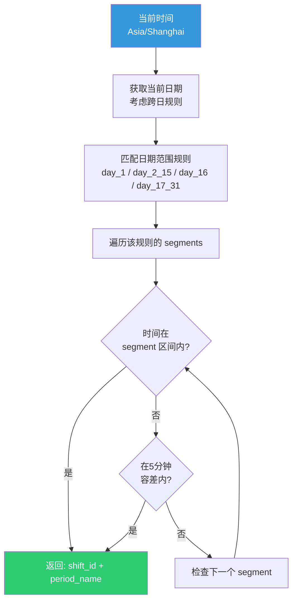
```mermaid
flowchart TD
    NOW["当前时间<br/>Asia/Shanghai"] --> DAY["获取当前日期<br/>考虑跨日规则"]
    DAY --> RULE["匹配日期范围规则<br/>day_1 / day_2_15 / day_16 / day_17_31"]
    RULE --> SEG["遍历该规则的 segments"]
    SEG --> MATCH{"时间在<br/>segment 区间内?"}
    MATCH -->|"是"| RESULT["返回: shift_id + period_name"]
    MATCH -->|"否"| TOLERANCE{"在5分钟<br/>容差内?"}
    TOLERANCE -->|"是"| RESULT
    TOLERANCE -->|"否"| NEXT["检查下一个 segment"]
    NEXT --> MATCH

    style NOW fill:#3498DB,color:#fff
    style RESULT fill:#2ECC71,color:#fff
```

---

## 9. 部署架构分析

### 9.1 CTS 部署架构

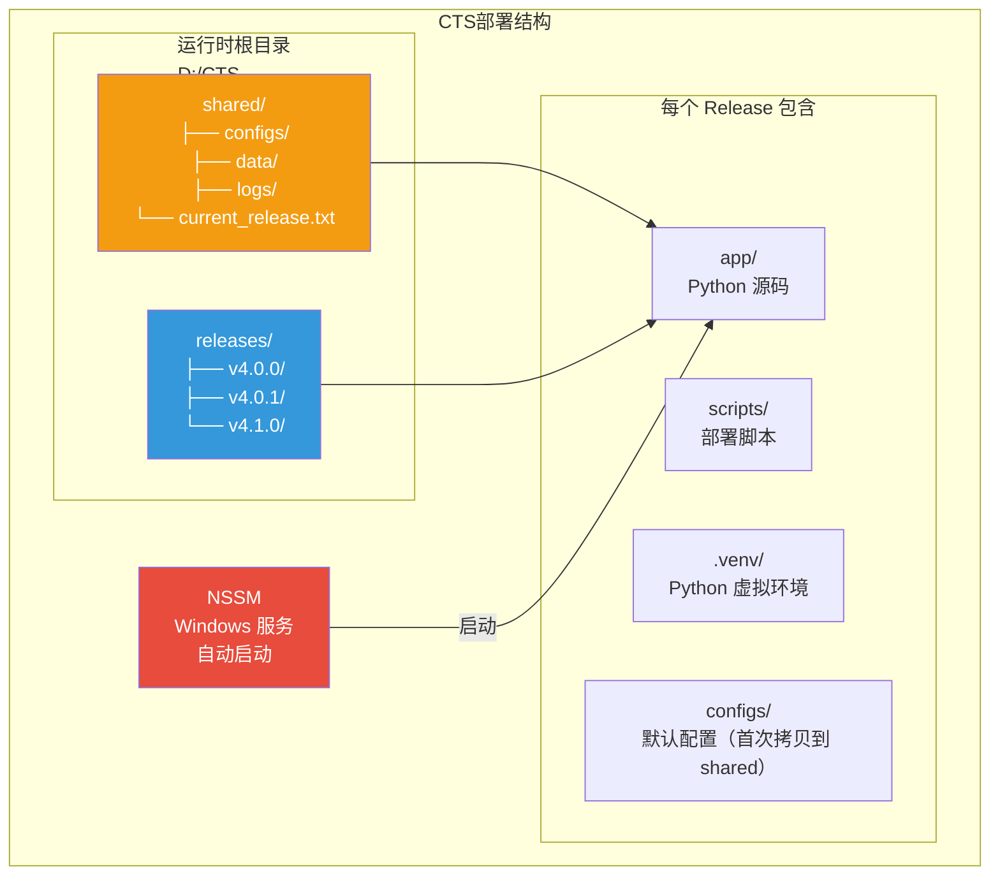
```mermaid
graph TB
    subgraph CTS部署结构
        subgraph 运行时根目录["运行时根目录<br/>D:/CTS"]
            SHARED["shared/<br/>├── configs/<br/>├── data/<br/>├── logs/<br/>└── current_release.txt"]
            RELEASES["releases/<br/>├── v4.0.0/<br/>├── v4.0.1/<br/>└── v4.1.0/"]
        end

        subgraph 发布包["每个 Release 包含"]
            APP2["app/<br/>Python 源码"]
            SCRIPTS["scripts/<br/>部署脚本"]
            VENV[".venv/<br/>Python 虚拟环境"]
            CONFIGS2["configs/<br/>默认配置（首次拷贝到 shared）"]
        end

        NSSM["NSSM<br/>Windows 服务<br/>自动启动"]
    end

    SHARED --> APP2
    RELEASES --> APP2
    NSSM -->|"启动"| APP2

    style SHARED fill:#F39C12,color:#fff
    style RELEASES fill:#3498DB,color:#fff
    style NSSM fill:#E74C3C,color:#fff
```

**CTS 部署脚本一览：**

| 脚本 | 用途 |
|------|------|
| `00_new_line_first_deploy.bat` | 新产线首次部署：PLC IP/打印机IP配置、GUID token生成 |
| `02_publish_this_release.bat` | 发布当前版本：`switch_release.bat` + 健康检查 |
| `03_rollback_release.bat` | 回滚：仅代码回滚，数据库/配置保留 |
| `start.bat` | 启动服务：创建目录、拷贝配置、激活venv、运行 `run.py :8000` |
| `scripts/deploy/switch_release.bat` | 切换活跃版本 |
| `scripts/deploy/install_service.bat` | 注册NSSM服务 |
| `scripts/deploy/check_release_health.bat` | 发布健康检查 |
| `scripts/deploy/init_runtime_layout.bat` | 初始化运行时目录 |

**首次部署流程（`00_new_line_first_deploy.bat`）：**

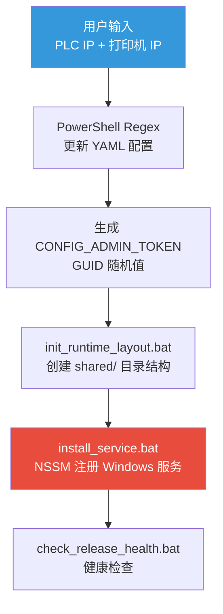
```mermaid
flowchart TD
    INPUT["用户输入<br/>PLC IP + 打印机 IP"] --> PS["PowerShell Regex<br/>更新 YAML 配置"]
    PS --> TOKEN["生成 CONFIG_ADMIN_TOKEN<br/>GUID 随机值"]
    TOKEN --> INIT["init_runtime_layout.bat<br/>创建 shared/ 目录结构"]
    INIT --> INSTALL["install_service.bat<br/>NSSM 注册 Windows 服务"]
    INSTALL --> HEALTH["check_release_health.bat<br/>健康检查"]

    style INPUT fill:#3498DB,color:#fff
    style INSTALL fill:#E74C3C,color:#fff
```

### 9.2 包装线部署架构

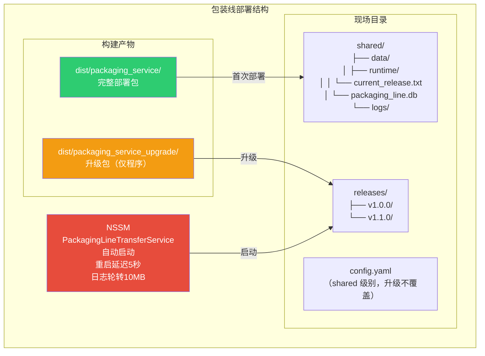
```mermaid
graph TB
    subgraph 包装线部署结构
        subgraph 构建产物
            DEPLOY["dist/packaging_service/<br/>完整部署包"]
            UPGRADE["dist/packaging_service_upgrade/<br/>升级包（仅程序）"]
        end

        subgraph 现场目录
            SHARED2["shared/<br/>├── data/<br/>│   ├── runtime/<br/>│   │   └── current_release.txt<br/>│   └── packaging_line.db<br/>└── logs/"]
            RELEASES2["releases/<br/>├── v1.0.0/<br/>└── v1.1.0/"]
            CONFIG_YAML["config.yaml<br/>（shared 级别，升级不覆盖）"]
        end

        NSSM2["NSSM<br/>PackagingLineTransferService<br/>自动启动<br/>重启延迟5秒<br/>日志轮转10MB"]
    end

    DEPLOY -->|"首次部署"| SHARED2
    UPGRADE -->|"升级"| RELEASES2
    NSSM2 -->|"启动"| RELEASES2

    style DEPLOY fill:#2ECC71,color:#fff
    style UPGRADE fill:#F39C12,color:#fff
    style NSSM2 fill:#E74C3C,color:#fff
```

**包装线构建流程（`build.bat`）：**

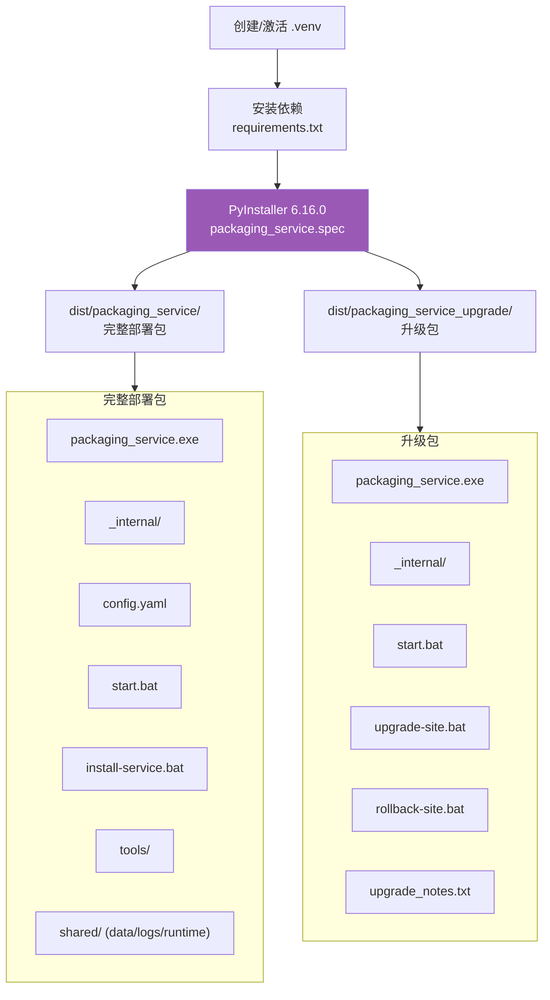
```mermaid
flowchart TD
    VENV["创建/激活 .venv"] --> DEPS["安装依赖<br/>requirements.txt"]
    DEPS --> PYINST["PyInstaller 6.16.0<br/>packaging_service.spec"]
    PYINST --> DEPLOY["dist/packaging_service/<br/>完整部署包"]
    PYINST --> UPGRADE["dist/packaging_service_upgrade/<br/>升级包"]

    subgraph 完整部署包
        EXE1["packaging_service.exe"]
        INTERNAL1["_internal/"]
        CONFIG["config.yaml"]
        START_BAT["start.bat"]
        INSTALL_BAT["install-service.bat"]
        TOOLS1["tools/"]
        SHARED_DIR["shared/ (data/logs/runtime)"]
    end

    subgraph 升级包
        EXE2["packaging_service.exe"]
        INTERNAL2["_internal/"]
        START_BAT2["start.bat"]
        UPGRADE_BAT["upgrade-site.bat"]
        ROLLBACK_BAT["rollback-site.bat"]
        NOTES["upgrade_notes.txt"]
    end

    DEPLOY --> 完整部署包
    UPGRADE --> 升级包

    style PYINST fill:#9B59B6,color:#fff
```

**NSSM 服务配置（`install-service.bat`）：**

| 参数 | 值 |
|------|-----|
| 服务名 | PackagingLineTransferService |
| 启动类型 | 自动启动 |
| 重启延迟 | 5 秒 |
| 日志轮转 | 10MB / 每日 |
| 可执行文件 | `releases/{version}/packaging_service.exe` |

### 9.3 版本管理与回滚

```mermaid
flowchart LR
    subgraph 版本切换
        OLD["旧版本<br/>releases/v1.0.0/"]
        NEW["新版本<br/>releases/v1.1.0/"]
        TXT["current_release.txt<br/>= v1.1.0"]
    end

    subgraph 升级流程
        COPY["复制程序文件"] --> SWITCH["更新 current_release.txt"]
        SWITCH --> RESTART["重启 NSSM 服务"]
    end

    subgraph 回滚流程
        REVERT["current_release.txt<br/>= v1.0.0"] --> RESTART2["重启 NSSM 服务"]
    end

    NEW --> TXT
    TXT -->|"回滚"| REVERT

    style NEW fill:#2ECC71,color:#fff
    style REVERT fill:#E74C3C,color:#fff
```

**关键设计原则：**
- **数据不覆盖**：升级和回滚仅切换程序目录，`shared/` 下的数据库、配置、日志不受影响
- **配置保护**：`config.yaml` 仅首次部署时拷贝，后续升级不覆盖
- **快速回滚**：只需修改 `current_release.txt` 指针 + 重启服务
- **健康检查**：发布后自动运行健康检查，失败时提示回滚

---

## 10. 配置文件分析

### 10.1 CTS 配置文件汇总

| 文件 | 大小 | 用途 |
|------|------|------|
| `configs/plc_config.yaml` | 753KB | PLC设备和数据块完整定义 |
| `configs/mapping_config.yaml` | 751KB | PLC数据到业务字段的映射 |
| `configs/printer_config.yaml` | ~2KB | Zebra打印机配置 |
| `configs/shift_config.yaml` | ~5KB | 班次规则配置 |
| `configs/winder_config.yaml` | ~1KB | 卷绕机配置（H501-H508） |
| `configs/label_print_config.json` | ~1KB | 标签布局参数 |
| `configs/plc_label_data_mapping.yaml` | ~1KB | PLC→标签字段映射 |
| `configs/winding_monitor_fields.yaml` | ~3KB | 卷绕监控字段定义 |

### 10.2 CTS PLC 配置结构（plc_config.yaml 核心结构）

```yaml
devices:
  - id: "s7_plc_1"
    name: "S7-1500 PLC"
    protocol: "s7"
    host: "192.168.0.1"
    port: 102
    rack: 0
    slot: 1
    enabled: true
    data_blocks:
      - db_number: 301
        name: "Tail_Rotation_Left"
        start_address: 0
        size: 246
        data_units:
          - name: "position_1"
            offset: 0
            fields:
              - name: "no_bobbins"
                offset: 0
                data_type: "BYTE_ARRAY"
                size: 2
                transform: "uint16_be"
              # ... 约25个字段/位置
```

### 10.3 包装线配置（config.yaml）

```yaml
app:
  name: PackagingLineTransferService
  version: "1.0.0"
  host: "0.0.0.0"
  port: 8700

database:
  url: "sqlite:///./data/packaging_line.db"

plc:
  host: "192.168.1.100"
  port: 102
  rack: 0
  slot: 1
  db_number: 750
  polling_interval_ms: 500     # 普通轮询 500ms
  pallet_polling_interval_ms: 100  # 托盘轮询 100ms（高频）

printer:
  host: "192.168.1.200"
  port: 9100
  protocol: "tcp_raw"

maintenance:
  enabled: true
  daily_hour: 3
  daily_minute: 10
  log_retention_days: 30
  db_backup_retention_days: 14
```

### 10.4 卷绕监控字段配置（winding_monitor_fields.yaml）

```yaml
winder_monitor:
  source: DB651/652
  count: 8
  size_per_winder: 140 bytes

temp_storage:
  source: DB301/320
  count: 2 positions
  size_per_position: 123 bytes

full_storage:
  source: DB401/421
  count: 18 positions (9 left + 9 right)
  size_per_position: 123 bytes

loading_monitor:
  source: DB800
  left_line_offset: 0
  right_line_offset: 50

# doffing_id 语义:
#   -1 = 待验证
#    0 = 空位
#   >0 = 已验证桶号
```

---

## 11. 关键业务流程

### 11.1 CTS 数据采集与流转

```mermaid
flowchart TD
    subgraph PLC数据采集
        PLC["S7-1500 PLC<br/>192.168.0.1"] -->|"snap7"| READ["异步批量读取<br/>7个DB块"]
        READ --> PARSE["字节数据解析<br/>Big-Endian"]
        PARSE --> TRANSFORM["DataTransformer<br/>类型转换"]
    end

    subgraph 数据处理
        TRANSFORM --> CACHE["变化检测缓存<br/>增量上传"]
        CACHE --> HEARTBEAT["心跳维护<br/>1秒间隔"]
        CACHE --> MONITOR["生产监控<br/>落纱检测"]
    end

    subgraph 标签打印
        MONITOR -->|"落纱事件"| LABEL_DATA["组装标签数据<br/>DB421字段映射"]
        LABEL_DATA --> ZPL["ZPL指令生成<br/>三联标签"]
        ZPL --> PRINT["TCP发送<br/>Zebra ZT231"]
    end

    subgraph 数据存储
        TRANSFORM --> SQLITE_CTS["SQLite<br/>历史记录"]
        TRANSFORM --> SERVER["ServerClient<br/>服务器上报"]
        SERVER -->|"失败"| RETRY["RetryService<br/>30秒重试队列"]
    end

    style PLC fill:#27AE60,color:#fff
    style ZPL fill:#9B59B6,color:#fff
    style SQLITE_CTS fill:#E67E22,color:#fff
```

### 11.2 包装线完整工作流

```mermaid
flowchart TD
    subgraph 订单创建
        USER["操作员<br/>Web UI"] -->|"POST /orders"| CREATE["创建订单<br/>status=QUEUED"]
        CREATE --> QUEUE["订单队列<br/>按 queue_seq 排序"]
    end

    subgraph PLC交互
        QUEUE -->|"auto_advance_queue()"| WRITE["写入PLC<br/>DataReady=1"]
        WRITE -->|"PLC确认<br/>ConfirmData≠0"| ACTIVE["订单激活<br/>status=ACTIVE"]
    end

    subgraph 三阶段执行
        ACTIVE --> GRAB["阶段1: 抓丝<br/>grab_status=ACTIVE"]
        GRAB -->|"NewOrderEnable=1"| PALLET["阶段2: 堆垛<br/>pallet_status=ACTIVE"]
        PALLET -->|"PalletsCompleted ≥ Total"| PRINT["阶段3: 打印<br/>print_status=ACTIVE"]
    end

    subgraph 托盘处理
        PALLET --> PREADY["PLC DataReady=1<br/>托盘就绪"]
        PREADY --> ASSIGN["分配 PalletID<br/>1-32767 循环"]
        ASSIGN --> WRITE_PID["写入 PLC<br/>CreatePallet.PalletID"]
        WRITE_PID --> BOBIN["PLC 返回<br/>BobinID 矩阵<br/>81个DINT"]
        BOBIN --> SAVE["保存到 Pallet 表"]
    end

    subgraph 标签打印
        PRINT --> TRIG["PLC StartPrint<br/>上升沿"]
        TRIG --> BUILD["LabelBuilder<br/>构建11个字段"]
        BUILD --> RENDER["ZplRenderer<br/>模板填充"]
        RENDER --> SEND["异步TCP发送<br/>192.168.1.200:9100"]
    end

    subgraph 完成
        PRINT -->|"所有打印完成"| COMPLETE["订单完成<br/>status=COMPLETED"]
        COMPLETE --> NEXT["推进下一单<br/>auto_advance_queue()"]
    end

    style USER fill:#3498DB,color:#fff
    style ACTIVE fill:#E74C3C,color:#fff
    style COMPLETE fill:#2ECC71,color:#fff
```

### 11.3 PLC 握手协议

```mermaid
sequenceDiagram
    participant PC as 包装线服务
    participant PLC as S7 PLC (DB750)

    Note over PC,PLC: === 创建订单握手 ===
    PC->>PLC: DataReady=1 + OrderID + 参数
    PLC-->>PC: ConfirmData ≠ 0
    PC->>PC: 标记订单 ACTIVE

    Note over PC,PLC: === 托盘分配握手 ===
    PLC->>PC: CreatePallet.DataReady=1
    PC->>PLC: CreatePallet.PalletID = N
    PLC-->>PC: BobinID[81] 矩阵
    PC->>PC: 保存 Pallet 记录

    Note over PC,PLC: === 打印触发 ===
    PLC->>PC: StartPrint 上升沿
    PC->>PC: 构建 ZPL + TCP 发送
    PC->>PLC: (打印完成)

    Note over PC,PLC: === 抓丝完成 ===
    PLC->>PC: NewOrderEnable=1
    PC->>PC: mark_grab_stage_completed()
    PC->>PC: auto_advance_queue()

    Note over PC,PLC: === 堆垛完成 ===
    PLC->>PC: PalletsCompleted >= PalletsTotal
    PC->>PC: mark_pallet_stage_completed()
```

---

## 12. 技术栈汇总

### 12.1 核心技术

| 技术 | 版本/说明 | 用途 |
|------|----------|------|
| **Python** | 3.14 (包装线) | 主开发语言 |
| **FastAPI** | v2.0.6 (CTS) | Web 框架 |
| **uvicorn** | — | ASGI 服务器 |
| **snap7** (python-snap7) | — | 西门子 S7 PLC 通信 |
| **SQLAlchemy** | ORM | 数据库访问层 |
| **SQLite** | — | 本地数据持久化 |
| **Pydantic** | v2 | 数据验证和序列化 |
| **loguru** | — | CTS 日志库 |
| **APScheduler** | AsyncIOScheduler | 包装线定时任务 |
| **PyInstaller** | 6.16.0 | 包装线打包工具 |
| **NSSM** | — | Windows 服务管理 |

### 12.2 通信协议

| 协议 | 端口 | 用途 |
|------|------|------|
| S7 (ISO-on-TCP) | TCP 102 | PLC 数据读写 |
| ZPL over TCP | TCP 9100 | Zebra 打印指令 |
| HTTP REST | TCP 8000/8700 | API 通信 |

### 12.3 编码标准

| 项目 | 标准 |
|------|------|
| ZPL 中文字体 | GB18030 / SIMSUN.FNT |
| PLC 数据字节序 | Big-Endian |
| 字符串编码 | UTF-8（API）/ ASCII（PLC 字段） |
| 时区 | Asia/Shanghai |

### 12.4 并发模型

```mermaid
graph TB
    subgraph CTS并发模型
        UVICORN["uvicorn<br/>asyncio 事件循环"]
        UVICORN --> FASTAPI_CTS["FastAPI 路由<br/>异步处理"]
        UVICORN --> BG_TASKS["后台 asyncio 任务<br/>心跳/监控/重试"]
        UVICORN --> S7_ASYNC["S7Protocol<br/>asyncio.Lock 保护"]
    end

    subgraph 包装线并发模型
        UVICORN2["uvicorn<br/>asyncio 事件循环"]
        UVICORN2 --> FASTAPI_PKG["FastAPI 路由<br/>异步处理"]
        POLL_THREAD["PlcPollingService<br/>独立线程<br/>+ 内部 asyncio"]
        SCHEDULER["APScheduler<br/>AsyncIOScheduler"]
        UVICORN2 --> POLL_THREAD
        UVICORN2 --> SCHEDULER
    end

    style UVICORN fill:#3498DB,color:#fff
    style UVICORN2 fill:#E67E22,color:#fff
    style POLL_THREAD fill:#E74C3C,color:#fff
```

**CTS**：纯 asyncio 模型，所有 PLC 操作通过 `asyncio.Lock` 保护
**包装线**：asyncio + 独立轮询线程，轮询线程内部有自己的 asyncio 循环，通过回调与主线程通信

---

## 附录 A: 卷绕机配置

CTS 管理 8 台卷绕机（H501-H508），配置来自 `configs/winder_config.yaml`：

| 参数 | 值 |
|------|-----|
| 卷绕机数量 | 8 (H501-H508) |
| 班次监听 | 启用，60秒间隔 |
| 自动记录落纱 | 启用 |
| 监控数据块 | DB651(1-4号机) + DB652(5-8号机) |
| 每机数据量 | 140 字节 |

## 附录 B: 文件统计

| 服务 | Python 文件数 | 总行数估算 | 配置文件数 | BAT 脚本数 |
|------|--------------|-----------|-----------|-----------|
| CTS | 166 | ~30,000+ | 8 | 10+ |
| 包装线 | 72 | ~12,000+ | 1 (config.yaml) | 8+ |

---

*报告完毕。本报告基于纯源码文件分析生成，未参考任何 .md 文档。*
