# IGH-Platform 第五版本 -- 纯源码深度分析报告

> **分析范围**: 仅基于源代码文件(.go, .vue, .ts, .js, .yaml, .yml, .sql, .sh)，未读取任何 .md 文档
> **项目路径**: `F:/worktemp/第五版本程序/igh-platform/`
> **生成时间**: 2026-09-17

---

## 目录

1. [项目概述与技术栈](#1-项目概述与技术栈)
2. [系统架构总览](#2-系统架构总览)
3. [go.mod 依赖分析](#3-gomod-依赖分析)
4. [入口点分析 (cmd/)](#4-入口点分析-cmd)
5. [共享包分析 (internal/shared/)](#5-共享包分析-internalshared)
6. [边端核心分析 (internal/edge/)](#6-边端核心分析-internaledge)
7. [服务端核心分析 (internal/server/)](#7-服务端核心分析-internalserver)
8. [Vue3 前端分析 (web/)](#8-vue3-前端分析-web)
9. [配置文件分析](#9-配置文件分析)
10. [边端模板与标签打印](#10-边端模板与标签打印)
11. [部署架构](#11-部署架构)
12. [数据流图](#12-数据流图)
13. [与 igh-silkroad 对比分析](#13-与-igh-silkroad-对比分析)

---

## 1. 项目概述与技术栈

### 1.1 项目定位

IGH-Platform (第五版本) 是一套面向化纤（涤纶长丝）行业的工业智能制造平台，采用**边缘-云端双层架构**，覆盖从 PLC 设备数据采集到生产管理全链路。

### 1.2 核心技术栈

| 层级 | 技术选型 | 说明 |
|------|----------|------|
| **后端语言** | Go 1.23.0 | 单一语言覆盖边端+服务端 |
| **HTTP 框架** | Gin v1.9.1 | 轻量高性能 HTTP 框架 |
| **ORM** | GORM v1.25.12 | Go 语言最流行的 ORM |
| **边端数据库** | SQLite (glebarez/sqlite) | 纯 Go 实现，无 CGO 依赖 |
| **服务端数据库** | PostgreSQL + TimescaleDB | 时序数据扩展 |
| **前端框架** | Vue 3.4+ / Vite 5.2+ | 组合式 API + 快速构建 |
| **UI 组件库** | Naive UI 2.38+ | 工业暗色主题 |
| **图表** | ECharts 5.5+ | 产量/质量/告警可视化 |
| **实时通信** | gorilla/websocket | 服务端推送 |
| **PLC 协议** | gos7 (S7) + goburrow/modbus | 西门子 S7 + Modbus TCP |
| **认证** | JWT (HS256) + API Key | 管理端 JWT / 边端 API Key |
| **监控** | Prometheus + Grafana | 指标采集与可视化 |
| **日志** | uber/zap | 结构化高性能日志 |
| **配置** | spf13/viper | 支持环境变量展开 |
| **高可用** | Keepalived (服务端) + UDP 心跳 (边端) | 双层 HA |

### 1.3 代码规模

| 目录 | Go 文件数 | Vue/TS 文件数 | 说明 |
|------|-----------|---------------|------|
| `cmd/` | 2 | - | 入口点 |
| `internal/shared/` | ~15 | - | 共享类型/模型/配置 |
| `internal/edge/` | ~47 | - | 边端全部逻辑 |
| `internal/server/` | ~40 | - | 服务端全部逻辑 |
| `web/src/` | - | ~41 | 统一前端 |
| **合计** | ~104 | ~41 | |

---

## 2. 系统架构总览

### 2.1 系统架构图

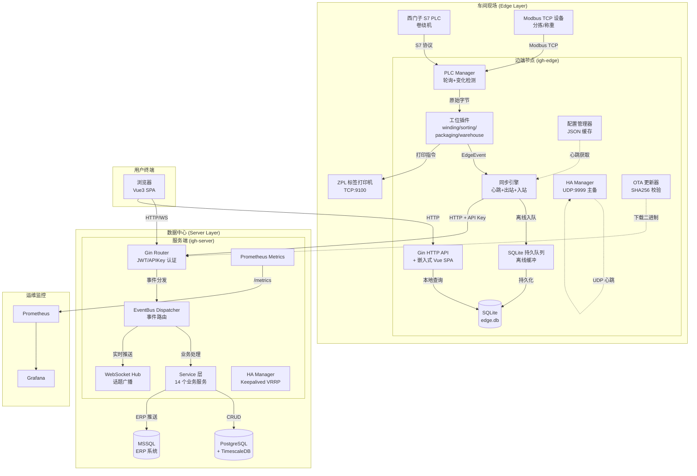

### 2.2 边端-服务端交互时序图

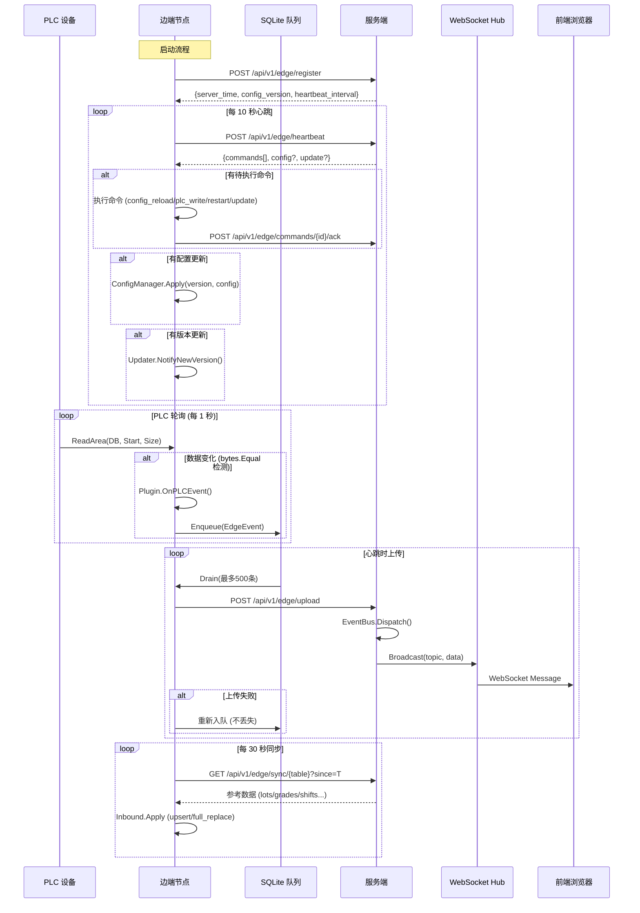

---

## 3. go.mod 依赖分析

**模块名**: `github.com/igh-platform/igh-platform`
**Go 版本**: 1.23.0

### 3.1 直接依赖

| 依赖 | 版本 | 用途 |
|------|------|------|
| `gin-gonic/gin` | v1.9.1 | HTTP 框架 |
| `golang-jwt/jwt/v5` | v5.2.1 | JWT 认证 |
| `gorilla/websocket` | v1.5.3 | WebSocket 服务端 |
| `spf13/viper` | v1.19.0 | 配置文件管理 |
| `uber-go/zap` | v1.27.0 | 结构化日志 |
| `gorm.io/gorm` | v1.25.12 | ORM 框架 |
| `gorm.io/driver/postgres` | v1.5.11 | PostgreSQL 驱动 (服务端) |
| `glebarez/sqlite` | v1.11.0 | 纯 Go SQLite 驱动 (边端) |
| `prometheus/client_golang` | v1.20.5 | Prometheus 客户端 |

### 3.2 关键间接依赖

| 依赖 | 用途 |
|------|------|
| `robinson/gos7` | 西门子 S7 协议 |
| `goburrow/modbus` | Modbus TCP 协议 |
| `denisenkom/go-mssqldb` | MSSQL 驱动 (ERP 对接) |
| `jackc/pgx/v5` | PostgreSQL 高性能驱动 |
| `mattn/go-isatty` | 终端检测 (日志着色) |

### 3.3 依赖架构特点

- **零 CGO 设计**: 边端使用 `glebarez/sqlite` 替代 `mattn/go-sqlite3`，实现纯 Go 交叉编译
- **双数据库策略**: 边端 SQLite (轻量嵌入) + 服务端 PostgreSQL (高并发)
- **工业协议栈**: S7 + Modbus TCP 覆盖主流 PLC 厂商
- **ERP 桥接**: 通过 `go-mssqldb` 直连 MSSQL 实现 ERP 数据推送

---

## 4. 入口点分析 (cmd/)

### 4.1 边端入口 (`cmd/edge/main.go`)

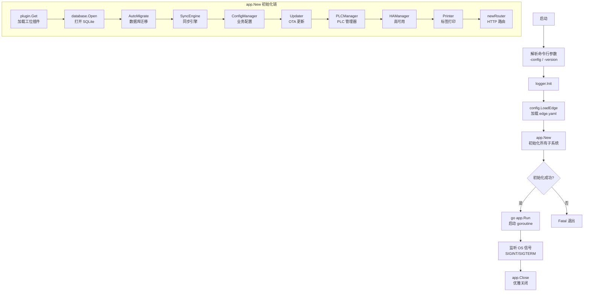

**关键设计**:
- `var version = "dev"` -- 通过 `go build -ldflags "-X main.version=..."` 在编译时注入版本号
- 4 个插件通过 blank import (`_ "...plugin/winding"`) 的 `init()` 函数自注册
- goroutine 中运行 `app.Run()`，主线程监听信号实现优雅关闭

### 4.2 服务端入口 (`cmd/server/main.go`)

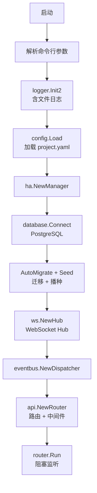

**与边端差异**:
- 使用 `logger.Init2` 支持文件日志输出
- 无插件系统，直接构建完整路由
- `router.Run()` 直接阻塞在主线程（无信号处理 goroutine 包装）

---

## 5. 共享包分析 (internal/shared/)

### 5.1 配置包 (`config/`)

#### 服务端配置 (`config.go`)

```go
type ProjectConfig struct {
    Project  Project   // 项目基本信息
    Server   Server    // 监听地址(默认 :8099)
    HA       HA        // Keepalived 配置
    Database Database  // PostgreSQL DSN
    Redis    Redis     // Redis (预留)
    Shift    Shift     // 班次配置(3班制)
    LotRules LotRules  // 批次编号规则
    Modules  Modules   // 功能模块开关(7个)
}
```

**模块开关** (`Modules`):
| 字段 | 模块 | 说明 |
|------|------|------|
| `Winding` | 卷绕区 | 核心模块，始终开启 |
| `Quality` | 质检区 | 等级/称重/分拣 |
| `Warehouse` | 仓库区 | 库位管理 |
| `Packaging` | 包装区 | 拣选/打包/栈板 |
| `ERP` | ERP 对接 | MSSQL 数据推送 |
| `Maintenance` | 维保管理 | 设备台账+保养 |
| `Vehicle` | 载具管理 | 丝车/AGV/天轨 |

#### 边端配置 (`edge.go`)

```go
type EdgeConfig struct {
    Edge EdgeSection
}

type EdgeSection struct {
    ID       string       // 边端唯一标识
    Type     string       // winding/sorting/packaging/warehouse
    Line     EdgeLine     // 产线信息
    HTTP     EdgeHTTP     // 监听端口(默认 :8080)
    Server   EdgeServer   // 服务端 URL + API Key
    PLC      EdgePLC      // PLC 设备列表
    Printers []EdgePrinter // 打印机列表
    HA       EdgeHA       // 主备配置
    DataDir  string       // 数据目录
    Version  string       // 当前版本
}
```

**PLC 设备配置** (`PLCDevice`):
```go
type PLCDevice struct {
    Code     string       // 设备编码
    Model    string       // 型号
    Protocol string       // s7/modbus/simulation
    Host     string       // IP 地址
    Port     int          // 端口
    Rack     int          // S7 机架号
    Slot     int          // S7 槽号
    ReadBlocks []PLCReadBlock // 轮询读取块列表
}
```

### 5.2 协议常量 (`protocol/constants.go`)

```go
// 事件类型 (14种)
EventDoffing         = "doffing"           // 落丝完成
EventTrolleyLoaded   = "trolley_loaded"    // 台车装载
EventSortingResult   = "sorting_result"    // 分拣结果
EventWeighingResult  = "weighing_result"   // 称重结果
EventPackingComplete = "packing_complete"  // 包装完成
EventWarehouseIn     = "warehouse_in"      // 入库
EventWarehouseOut    = "warehouse_out"     // 出库
EventAlarm           = "alarm"             // 告警
EventAlarmResolved   = "alarm_resolved"    // 告警解除
EventVisionResult    = "vision_result"     // 视觉检测结果
EventERPPush         = "erp_push"          // ERP 推送
EventLabelPrint      = "label_print"       // 标签打印
EventShiftChange     = "shift_change"      // 换班
EventMaintenanceDue  = "maintenance_due"   // 维保到期

// 命令类型 (5种)
CmdConfigReload = "config_reload"  // 重载配置
CmdPLCWrite     = "plc_write"      // PLC 写入
CmdReprintLabel = "reprint_label"  // 重打标签
CmdRestart      = "restart"        // 重启服务
CmdUpdate       = "update"         // OTA 更新

// 告警级别 (3级)
AlarmCritical  = "critical"   // 严重
AlarmWarning   = "warning"    // 警告
AlarmInfo      = "info"       // 信息
```

### 5.3 共享类型 (`types/types.go`)

```go
// 统一 API 响应
type Response struct {
    Code    int    `json:"code"`
    Message string `json:"message,omitempty"`
    Data    any    `json:"data,omitempty"`
}

// 边端事件 (边端→服务端)
type EdgeEvent struct {
    Type      string    `json:"type"`
    EdgeID    string    `json:"edge_id"`
    Timestamp time.Time `json:"timestamp"`
    Payload   any       `json:"payload"`
}

// 心跳请求/响应
type HeartbeatRequest struct {
    EdgeID, Version, ConfigVersion string
    PLCStatus    []PLCStatus
    QueueDepth   int
    UptimeSec    int64
}

type HeartbeatResponse struct {
    ServerTime  time.Time
    Commands    []Command
    Config      *ConfigPayload   // 版本不同时下发
    Update      *UpdatePayload   // 有新版本时下发
}
```

### 5.4 数据模型 (`model/`)

#### 模型关系图

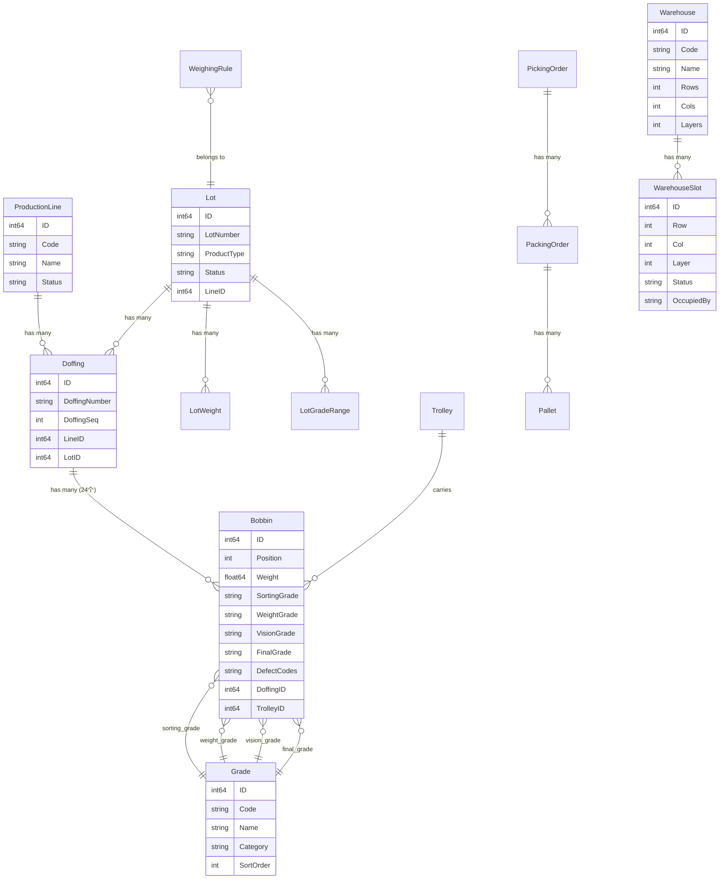

#### 核心模型列表

| 文件 | 模型 | 说明 |
|------|------|------|
| `common.go` | ProductionLine, ProductType, DictItem, Shift, SystemSetting | 基础数据 |
| `doffing.go` | Doffing, Bobbin | 落丝+丝饼(24个位置) |
| `alarm.go` | Alarm | 告警(确认/解决工作流) |
| `lot.go` | Lot, LotWeight, LotGradeRange | 批次+重量标准+等级范围 |
| `order.go` | PickingOrder, PackingOrder, Pallet | 拣选→打包→栈板 |
| `trolley.go` | Trolley | 台车(RFID) |
| `grade.go` | Grade, Defect, WeighingRule | 等级/缺陷/称重规则 |
| `warehouse.go` | Warehouse, WarehouseSlot | 仓库+3D仓位(行/列/层) |

---

## 6. 边端核心分析 (internal/edge/)

### 6.1 包依赖架构

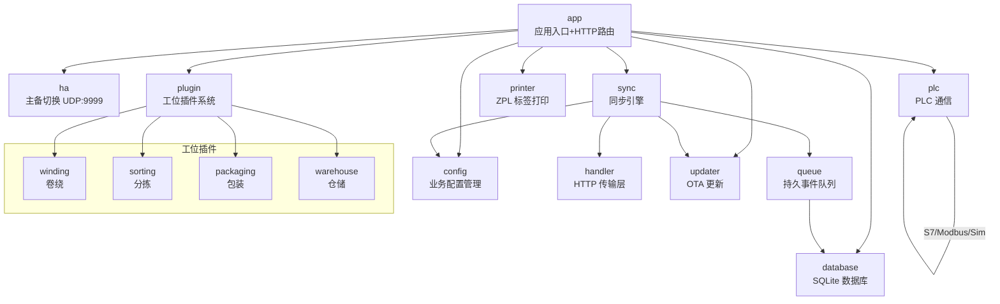

### 6.2 PLC 通信包 (`plc/`)

#### Protocol 接口 -- 硬件抽象层

```go
type Protocol interface {
    Connect() error
    Disconnect()
    IsConnected() bool
    ReadArea(dbNumber int, start int, size int) ([]byte, error)
    WriteArea(dbNumber int, start int, data []byte) error
}
```

**三种实现**:

| 协议 | 实现文件 | 库 | 说明 |
|------|----------|----|------|
| S7 | `s7.go` | `robinson/gos7` | `AGReadDB`/`AGWriteDB` 直接读写 DB 块 |
| Modbus | `modbus.go` | `goburrow/modbus` | `dbNumber` 映射为 Slave ID，寄存器读写 |
| Simulation | `simulation.go` | 内置 | 生成逼真化纤卷绕机数据 |

#### PLC Manager 核心流程

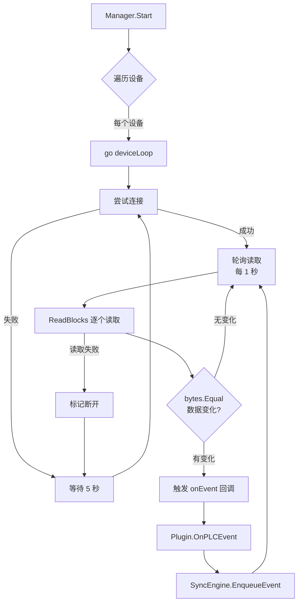

#### 模拟器数据布局

**DB1 -- 状态块 (12 字节)**:
| 偏移 | 长度 | 含义 | 范围 |
|------|------|------|------|
| 0-1 | uint16 | 机器状态 | 0=空闲, 1=运行, 2=报警, 3=落丝 |
| 2-3 | uint16 | 转速 RPM | 3800 +/- 150 (正弦波动) |
| 4-5 | uint16 | 张力 x0.1 | 500 +/- 30 |
| 6-7 | uint16 | 温度 x0.1C | 3000 +/- 100 |
| 8-9 | uint16 | 卷绕位置 | 0-359 度 |
| 10 | byte | 报警代码 | 0=无, 每5分钟触发 |
| 11 | byte | 心跳计数 | 0-255 循环 |

**DB2 -- 生产块 (20 字节)**:
| 偏移 | 长度 | 含义 | 说明 |
|------|------|------|------|
| 0-3 | uint32 | 落丝计数 | 每 65 秒递增 |
| 4-7 | uint32 | 丝饼总数 | 落丝数 x 24 |
| 8-9 | uint16 | 当前丝饼位 | 1-24 |
| 10-11 | uint16 | 当前重量 x0.1g | 3500 +/- 150 |
| 12-13 | uint16 | 批号 | 每10次落丝递增 |
| 14-15 | uint16 | 班次代码 | 按时间自动判断 |
| 16-19 | uint32 | 总米数 | ~120 米/秒 |

### 6.3 插件系统 (`plugin/`)

#### StationPlugin 接口

```go
type StationPlugin interface {
    Type() string                                              // "winding"/"sorting"/"packaging"/"warehouse"
    Models() []any                                             // 数据库模型列表
    RegisterRoutes(rg *gin.RouterGroup, db *gorm.DB)           // HTTP 路由注册
    OnPLCEvent(deviceCode string, data map[string]any) *EdgeEvent  // PLC 事件处理
    SyncSpec() SyncSpec                                        // 同步规格定义
    OnCommand(cmd Command) error                               // 命令处理
}
```

#### 四种工位插件对比

| 特性 | winding (卷绕) | sorting (分拣) | packaging (包装) | warehouse (仓储) |
|------|---------------|---------------|-----------------|-----------------|
| **核心职责** | PLC 数据采集+落丝检测 | 等级评定+称重分级 | 拣选→打包→栈板 | 3D 库位管理 |
| **特有组件** | Interpreter (PLC 数据解释器) | gradeRank 排名系统 | 三级订单流程 | 仓位分配算法 |
| **PLC 事件处理** | 检测落丝计数器递增→创建 Doffing+24 Bobbin | 无 (手工录入) | 无 (手工操作) | 无 (手工操作) |
| **上传策略** | event (Doffing, Bobbin, Trolley) | event (Bobbin 更新) | event (PackingOrder, Pallet) | event (WarehouseSlot 变更) |
| **下拉数据** | Lot, Grade, Defect, Shift... | 同 winding | 同 winding | Warehouse, WarehouseSlot |
| **API 端点数** | 10 | 11 | 9 | 7 |

#### Winding Interpreter -- PLC 数据解释器

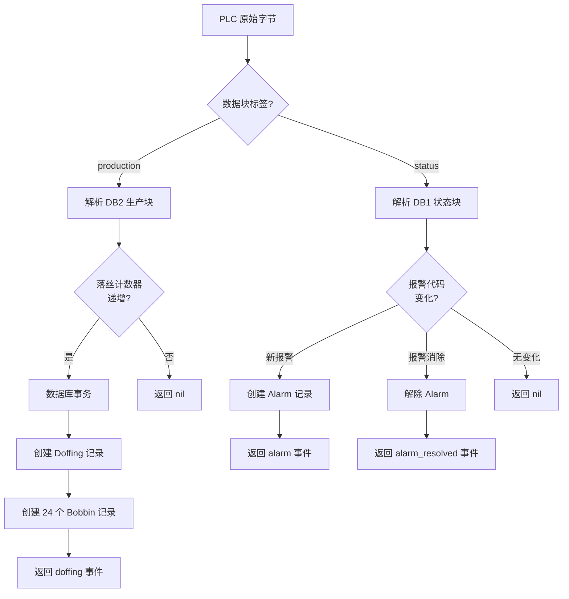

#### Sorting 等级评定逻辑

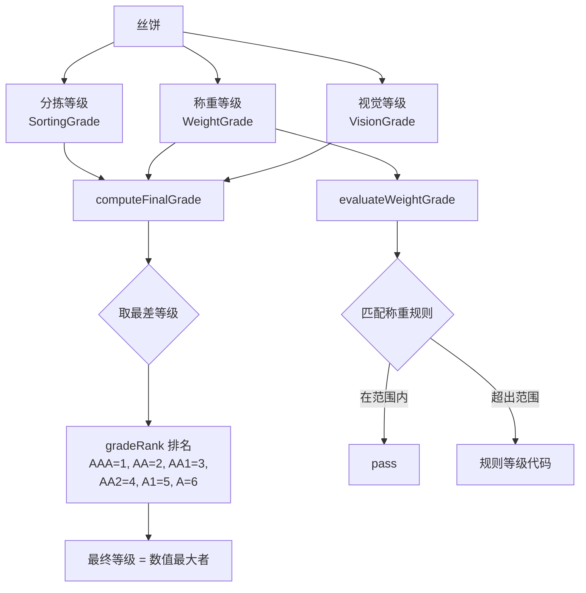

### 6.4 同步引擎 (`sync/`)

#### 双定时器架构

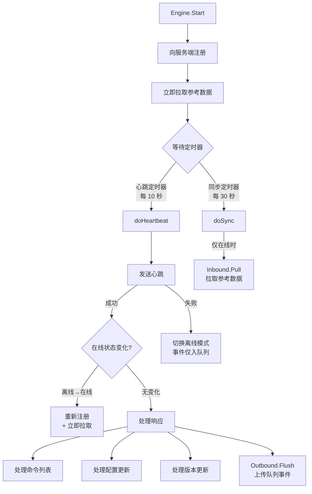

#### 入站同步策略

| 策略 | 说明 | 实现 |
|------|------|------|
| `event` | 事件驱动上传 | 队列 Drain → 批量上传 → 失败重入队 |
| `upsert` | 增量更新 | `clause.OnConflict{UpdateAll: true}` |
| `full_replace` | 全量替换 | 事务内: 清空表 → 批量插入 |

### 6.5 离线事件队列 (`queue/`)

- **SQLite 持久化**: `QueueItem` 表存储序列化的 EdgeEvent
- **FIFO 有序**: 按 ID 升序出队
- **批量限制**: 每次 Drain 最多 500 条
- **不丢失保证**: 上传失败时事件重新入队
- **启动恢复**: 重启后自动检测并报告积压事件

### 6.6 高可用 (`ha/`)

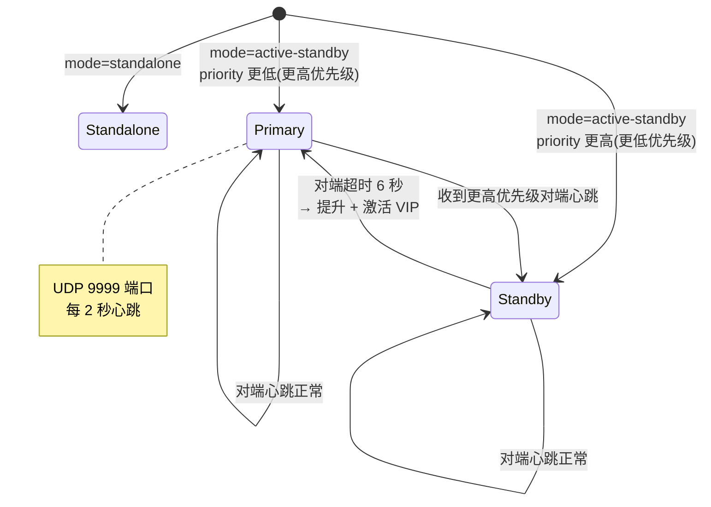

### 6.7 OTA 更新器 (`updater/`)

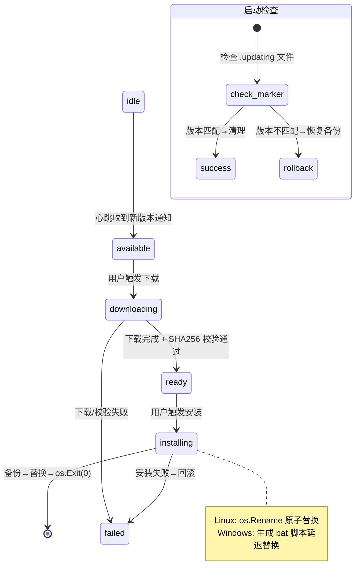

### 6.8 标签打印 (`printer/`)

- **协议**: ZPL 通过 TCP 端口 9100 直连 Zebra 打印机
- **模板引擎**: Go `text/template` 渲染 ZPL 模板
- **内置模板**:
  - `DefaultBobbinLabelTemplate()` -- 丝饼标签 (批号/等级/重量/时间/条码)
  - `DefaultPalletLabelTemplate()` -- 栈板标签 (栈板号/批号/等级/数量/条码)
- **健康检查**: TCP 连通性探测，3 秒连接超时

---

## 7. 服务端核心分析 (internal/server/)

### 7.1 包结构

```
internal/server/
+-- api/              # HTTP 路由层
|   +-- router.go     # 主路由 (Public/Edge/Management 三组)
|   +-- handlers.go   # 通用处理器 (login/register/heartbeat)
|   +-- edge_sync.go  # 边端数据同步端点 (11个)
|   +-- edge/         # 边端管理 API
|   +-- admin/        # 系统管理 API
|   +-- production/   # 生产管理 API
|   +-- quality/      # 质量管理 API
|   +-- order/        # 订单管理 API
|   +-- warehouse/    # 仓库管理 API
|   +-- alarm/        # 告警管理 API
|   +-- stats/        # 统计 API
|   +-- maintenance/  # 维保 API
|   +-- vehicle/      # 载具 API
|   +-- erp/          # ERP 对接 API
|   +-- vision/       # 视觉检测 API
|   +-- label/        # 标签打印 API
|   +-- device/       # 设备管理 API
+-- service/          # 业务逻辑层
|   +-- edge.go       # 边端注册/心跳/命令
|   +-- edge_config.go # 边端配置模板
|   +-- edge_release.go # 边端版本发布
|   +-- production.go # 生产管理
|   +-- quality.go    # 质量管理
|   +-- order.go      # 订单管理
|   +-- warehouse.go  # 仓库管理
|   +-- alarm.go      # 告警管理
|   +-- stats.go      # 统计分析
|   +-- maintenance.go # 维保管理
|   +-- erp.go        # ERP 同步
|   +-- vision.go     # 视觉检测
|   +-- label.go      # 标签打印
|   +-- admin.go      # 系统管理
+-- eventbus/         # 事件总线
|   +-- dispatcher.go # 事件分发器
+-- ws/               # WebSocket
|   +-- hub.go        # Hub + Client + 话题订阅
+-- middleware/        # 中间件
|   +-- auth.go       # JWT + API Key 认证
|   +-- metrics.go    # Prometheus 中间件
+-- metrics/           # Prometheus 指标定义
|   +-- metrics.go
+-- model/             # 服务端专有模型
|   +-- models.go
+-- database/          # 数据库连接
|   +-- database.go
|   +-- seed.go
+-- ha/                # 高可用
    +-- manager.go
```

### 7.2 路由架构 (`api/router.go`)

```mermaid
flowchart TD
    REQ[HTTP 请求] --> ROUTER[Gin Router]
    
    ROUTER --> PUBLIC[公开路由组]
    ROUTER --> EDGE[边端路由组<br/>API Key 认证]
    ROUTER --> MGMT[管理路由组<br/>JWT 认证]
    
    PUBLIC --> H1[GET /health]
    PUBLIC --> H2[GET /metrics]
    PUBLIC --> H3[POST /auth/login]
    PUBLIC --> H4[GET /station/identify]
    
    EDGE --> E1[POST /edge/register]
    EDGE --> E2[POST /edge/heartbeat]
    EDGE --> E3[POST /edge/upload]
    EDGE --> E4[POST /edge/commands/:id/ack]
    EDGE --> E5[GET /edge/sync/* (11个端点)]
    
    MGMT --> GUARD{模块守卫<br/>Modules.XXX?}
    GUARD -->|启用| HANDLER[14 个 Handler 包]
    GUARD -->|禁用| R403[403 模块未启用]
    
    HANDLER --> WS[GET /ws<br/>WebSocket 升级]
```

**三层路由组**:
1. **Public** -- 无认证: 健康检查、Prometheus 指标、登录、工位识别
2. **Edge** -- API Key 认证: 边端注册、心跳、上传、命令确认、数据同步
3. **Management** -- JWT 认证: 所有管理 API（GET 请求无 token 也允许 viewer 访问）

### 7.3 EventBus 事件分发器 (`eventbus/dispatcher.go`)

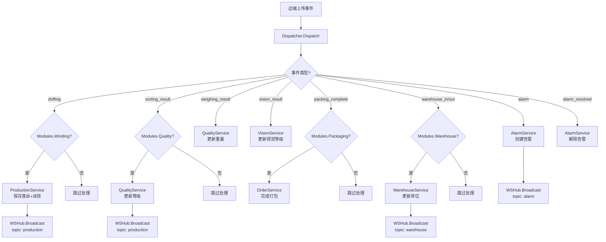

### 7.4 WebSocket Hub (`ws/hub.go`)

```go
type Hub struct {
    clients    map[*Client]bool
    broadcast  chan WSMessage
    register   chan *Client
    unregister chan *Client
}

type Client struct {
    hub     *Hub
    conn    *websocket.Conn
    send    chan []byte
    topics  map[string]bool  // 订阅的话题
}
```

**话题匹配**: 支持通配符 `production.*` 匹配 `production.doffing`

**使用场景**:
| 话题 | 触发者 | 前端消费者 |
|------|--------|-----------|
| `production` | 落丝/分拣/称重事件 | Dashboard, Board/Overview |
| `alarm` | 告警创建/解除 | Dashboard, Admin/Alarms |
| `warehouse` | 入库/出库 | Board/Warehouse |
| `device` | 边端心跳状态 | DevicePanel |
| `device.status` | PLC 连接变化 | DevicePanel |

### 7.5 认证中间件 (`middleware/auth.go`)

| 方式 | 使用场景 | 实现 |
|------|----------|------|
| **API Key** | 边端 → 服务端 | `X-API-Key` 请求头，配置文件中定义 |
| **JWT** | 浏览器 → 管理API | HS256 算法，24小时过期，含 sub/username/role |
| **Viewer 放行** | GET 请求无 token | 自动以 viewer 角色通过 |

**JWT Claims**:
```go
Claims{
    Subject:  userID,
    Username: username,
    Role:     roleCode,  // admin/winding_op/sorting_op/packaging_op/warehouse_op/viewer
    ExpiresAt: 24h,
}
```

### 7.6 服务端专有模型 (`model/models.go`)

| 模型 | 说明 |
|------|------|
| `User` | 用户 (username, password_sha256, role_id) |
| `Role` | 角色 (admin, winding_op, sorting_op...) |
| `EdgeNode` | 边端节点注册表 (code, type, version, ip, status, last_heartbeat) |
| `EdgeNodeConfig` | 边端配置关联 |
| `EdgeConfigTemplate` | 边端配置模板 (版本化) |
| `EdgeRelease` | 边端版本发布 (version, platform, download_path, checksum) |
| `EdgeUpdateLog` | 更新日志 |
| `EdgeCommand` | 待执行命令队列 (edge_code, type, payload, status, acked_at) |
| `StationBinding` | 工位 IP 绑定 (ip_address, station_type, line_id) |
| `Equipment` | 设备台账 |
| `Vehicle` | 载具 (丝车/吊车/AGV/天轨/穿梭车) |
| `ERPSyncQueue` | ERP 同步队列 (方向, 状态, 重试) |
| `MaintenancePlan` | 维保计划 (周期, 下次执行时间) |
| `MaintenanceRecord` | 维保记录 |

### 7.7 边端数据同步端点 (`api/edge_sync.go`)

提供 11 个 GET 端点供边端拉取参考数据:

| 端点 | 数据 | 增量支持 |
|------|------|---------|
| `/edge/sync/lots` | 活跃批次 | `?since=` |
| `/edge/sync/lot-weights` | 批次重量标准 | `?since=` |
| `/edge/sync/lot-grade-ranges` | 批次等级范围 | `?since=` |
| `/edge/sync/lines` | 产线列表 | 否 |
| `/edge/sync/grades` | 等级定义 | 否 |
| `/edge/sync/defects` | 缺陷定义 | 否 |
| `/edge/sync/dict-items` | 数据字典 | 否 |
| `/edge/sync/shifts` | 班次定义 | 否 |
| `/edge/sync/settings` | 系统设置 | `?since=` |
| `/edge/sync/weighing-rules` | 称重规则 | `?since=` |
| `/edge/sync/product-types` | 产品类型 | 否 |

### 7.8 Prometheus 指标

```go
// metrics/metrics.go
var (
    HTTPRequestDuration  = prometheus.NewHistogramVec(...)  // HTTP 请求耗时
    HTTPRequestsTotal    = prometheus.NewCounterVec(...)     // HTTP 请求计数
    EdgeHeartbeatsTotal  = prometheus.NewCounterVec(...)     // 边端心跳计数
    EdgeEventsTotal      = prometheus.NewCounterVec(...)     // 边端事件计数
    ActiveEdgeNodes      = prometheus.NewGauge(...)          // 在线边端数
    WebSocketClients     = prometheus.NewGauge(...)          // WS 连接数
)
```

---

## 8. Vue3 前端分析 (web/)

### 8.1 技术栈

| 技术 | 版本 | 用途 |
|------|------|------|
| Vue 3 | 3.4+ | 核心框架 (Composition API) |
| Vite | 5.2+ | 构建工具 |
| Naive UI | 2.38+ | 组件库 (暗色工业主题) |
| Pinia | 2.1+ | 状态管理 |
| Vue Router | 4.3+ | SPA 路由 |
| Axios | 1.6+ | HTTP 客户端 |
| ECharts | 5.5+ | 数据可视化 |
| Playwright | 1.60+ | E2E 测试 |

**重要发现**: 该项目为**统一单体前端**，非分离的 edge/server 两个前端。Edge/Server 的区分通过运行时 API 检测实现。

### 8.2 路由架构

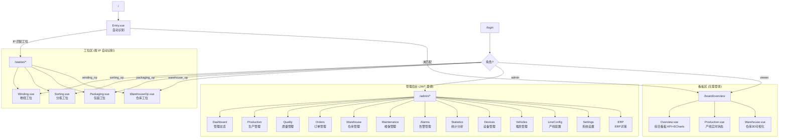

### 8.3 组合式函数 (Composables)

| 函数 | 文件 | 功能 |
|------|------|------|
| `useAuth()` | `useAuth.ts` | 登录/登出/权限检查/弹窗式登录 |
| `useEdge()` | `useEdge.ts` | 检测 Edge 模式 + 服务器在线状态 |
| `useStation()` | `useStation.ts` | 工位 IP 自动识别 (调用 `/station/identify`) |
| `useWebSocket(topics)` | `useWebSocket.ts` | WebSocket 连接 + 自动重连(3秒) |

### 8.4 公共组件

| 组件 | 功能 | 使用位置 |
|------|------|----------|
| `LoginModal` | 弹窗式登录(工位页面) | station/* |
| `ModuleAlert` | 模块未启用警告条 | admin/Layout, station/* |
| `EdgeStatus` | Edge 在线/离线指示器 | Dashboard |
| `DevicePanel` | Edge+PLC 实时状态面板(WS 驱动) | Dashboard |
| `WarehouseGrid` | SVG 等轴测3D库位图 | 4处复用 |

### 8.5 WebSocket 实时通信

```javascript
// useWebSocket.ts
const ws = new WebSocket(
    `${protocol}//${location.host}/api/v1/ws?token=${token}&subscribe=${topics.join(',')}`
)
```

- **话题订阅**: `production`, `alarm`, `device`, `warehouse`
- **自动重连**: 断线后 3 秒重试
- **生命周期**: `onUnmounted` 自动断开

### 8.6 HTTP 客户端

```typescript
// api/http.ts
const http = axios.create({
    baseURL: '/api/v1',
    timeout: 10000,
})

// 拦截器
- 请求: 自动附加 Bearer token
- 响应 403 + "模块未启用": 设置 moduleDisabled ref
- 响应 401 + admin 路径: 清 token 跳转登录页
```

### 8.7 ECharts 可视化

| 页面 | 图表 | 类型 |
|------|------|------|
| Board/Overview | 7日产量趋势 | 柱状图 |
| Board/Overview | 等级分布 | 环形饼图 |
| Board/Overview | 各线今日产量 | 柱状图 |
| Board/Overview | 30天告警频率 | 柱状图 |
| Statistics | 每日产量趋势 | 柱状图 |
| Statistics | 等级分布 | 环形饼图 |
| Statistics | 今日各线产量 | 柱状图 |
| Statistics | 异常频率(30天) | 面积折线图 |

### 8.8 主题设计

- **风格**: 工业暗色主题 (深蓝黑底)
- **主色**: `#00d4ff` (青蓝色)
- **背景**: `#1a1a2e` (body) / `#0f3460` (卡片)
- **字号**: 16px 基准
- **数据刷新**: 工位页面每 20 秒自动轮询

---

## 9. 配置文件分析

### 9.1 配置文件列表

| 文件 | 用途 | 加载方式 |
|------|------|---------|
| `configs/project.yaml` | 服务端主配置 | Viper + 环境变量展开 |
| `configs/edge.yaml` | 边端主配置 | Viper + 环境变量展开 |
| `configs/edge-winding.yaml` | 卷绕工位模板 | 模板参考 |
| `configs/edge-sorting.yaml` | 分拣工位模板 | 模板参考 |
| `configs/edge-packaging.yaml` | 包装工位模板 | 模板参考 |
| `configs/edge-warehouse.yaml` | 仓储工位模板 | 模板参考 |
| `docker-compose.yml` | Docker 编排 | Docker Compose |
| `docker-compose.dev.yml` | 开发环境编排 | Docker Compose |
| `deploy/keepalived.conf` | Keepalived HA | 系统服务 |
| `deploy/prometheus.yml` | Prometheus 配置 | Prometheus |

### 9.2 服务端配置结构 (`project.yaml`)

```yaml
project:
  name: "IGH 智能制造平台"
  version: "5.0.0"

server:
  host: "0.0.0.0"
  port: 8099

ha:
  enabled: false
  mode: "keepalived"
  virtual_ip: ""
  priority: 100

database:
  host: "${DB_HOST:localhost}"      # 支持环境变量
  port: 5432
  name: "igh_platform"
  user: "${DB_USER:postgres}"
  password: "${DB_PASSWORD:}"
  sslmode: "disable"

shift:
  count: 3
  start_hour: 8

lot_rules:
  prefix: "L"
  date_format: "20060102"

modules:                             # 7 个功能模块开关
  winding: true
  quality: true
  warehouse: true
  packaging: true
  erp: false
  maintenance: false
  vehicle: false
```

### 9.3 边端配置结构 (`edge.yaml`)

```yaml
edge:
  id: "edge-winding-01"
  type: "winding"                    # winding/sorting/packaging/warehouse
  version: "dev"
  data_dir: "./data"
  
  line:
    code: "L01"
    name: "一号卷绕线"
  
  http:
    host: "0.0.0.0"
    port: 8080
  
  server:
    url: "http://192.168.1.100:8099"
    api_key: "edge-secret-key"
    heartbeat_sec: 10
    sync_interval_sec: 30
  
  plc:
    poll_interval_ms: 1000
    devices:
      - code: "PLC-W01"
        model: "S7-1200"
        protocol: "s7"               # s7/modbus/simulation
        host: "192.168.1.10"
        port: 102
        rack: 0
        slot: 1
        read_blocks:
          - db: 1
            start: 0
            size: 12
            tag: "status"
          - db: 2
            start: 0
            size: 20
            tag: "production"
  
  printers:
    - code: "PRN-01"
      host: "192.168.30.100"
      port: 9100
  
  ha:
    mode: "standalone"               # standalone/active-standby
    peer: ""
    priority: 100
    vip: ""
```

---

## 10. 边端模板与标签打印

### 10.1 ZPL 标签模板

**丝饼标签** (DefaultBobbinLabelTemplate):
```
^XA
^FO50,30^A0N,30,30^FD批号: {{.LotNumber}}^FS
^FO50,70^A0N,25,25^FD等级: {{.Grade}}^FS
^FO50,100^A0N,25,25^FD重量: {{.Weight}}g^FS
^FO50,130^A0N,20,20^FD时间: {{.Time}}^FS
^FO50,170^BY2^BCN,60,Y,N^FD{{.Barcode}}^FS
^XZ
```

**栈板标签** (DefaultPalletLabelTemplate):
```
^XA
^FO50,30^A0N,35,35^FD栈板号: {{.PalletNumber}}^FS
^FO50,75^A0N,25,25^FD批号: {{.LotNumber}}^FS
^FO50,110^A0N,25,25^FD等级: {{.Grade}}^FS
^FO50,145^A0N,25,25^FD数量: {{.Count}}^FS
^FO50,180^A0N,25,25^FD净重: {{.NetWeight}}kg^FS
^FO50,225^BY2^BCN,80,Y,N^FD{{.Barcode}}^FS
^XZ
```

### 10.2 打印架构

```
前端 → POST /edge/print → printer.Client
    → TCP 9100 → Zebra ZPL 打印机
    
模式1: 原始 ZPL 直传 (raw_zpl)
模式2: 模板渲染 (template_name + data)
```

---

## 11. 部署架构

### 11.1 Docker Compose 编排

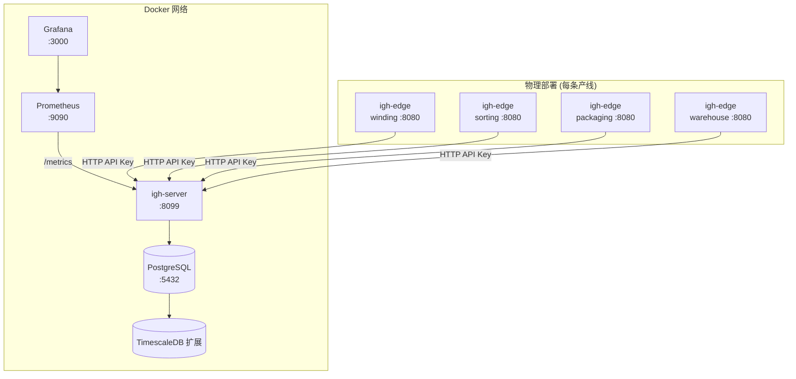

### 11.2 高可用架构

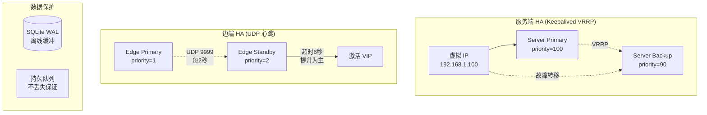

### 11.3 Prometheus 监控

**采集目标**:
| 指标类型 | 指标名 | 说明 |
|----------|--------|------|
| Counter | `http_requests_total` | HTTP 请求总数 |
| Histogram | `http_request_duration_seconds` | 请求耗时分布 |
| Counter | `edge_heartbeats_total` | 边端心跳总数 |
| Counter | `edge_events_total` | 边端事件总数 |
| Gauge | `active_edge_nodes` | 在线边端数 |
| Gauge | `websocket_clients` | WebSocket 连接数 |

---

## 12. 数据流图

### 12.1 完整数据流

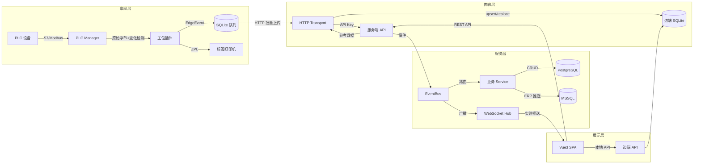

### 12.2 丝饼全生命周期

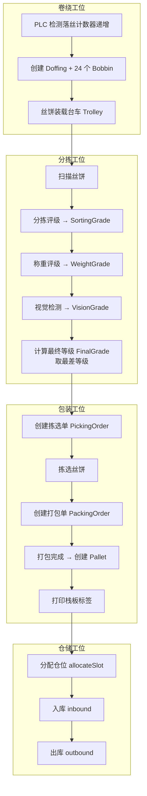

---

## 13. 与 igh-silkroad 对比分析

### 13.1 架构对比

| 维度 | igh-silkroad (历史版本) | igh-platform (第五版本) |
|------|------------------------|------------------------|
| **后端语言** | Java (Spring Boot) / Python / Go 混合 | **纯 Go** 统一 |
| **架构模式** | 微服务 (多个独立服务) | **双二进制** (igh-edge + igh-server) |
| **边端设计** | 无独立边端 / 简单采集脚本 | **完整边端应用** (离线运行+插件系统) |
| **数据库** | MySQL / PostgreSQL | SQLite (边端) + PostgreSQL+TimescaleDB (服务端) |
| **PLC 通信** | 第三方中间件/OPC UA | **直接协议** (S7 + Modbus TCP，Go 原生) |
| **前端** | 多个独立前端 | **统一 SPA** (Vue3 运行时检测模式) |
| **部署** | K8s / Docker Swarm 复杂编排 | **单二进制 + Docker Compose** 极简部署 |
| **离线能力** | 无 / 依赖中间件 | **原生离线** (SQLite 队列 + 自动恢复) |
| **更新机制** | 手动部署 / CI/CD 管道 | **OTA 自动更新** (SHA256 + 回滚) |
| **CGO 依赖** | 多 (SQLite C 绑定) | **零 CGO** (纯 Go 交叉编译) |

### 13.2 关键改进

#### 1. 架构简化
- **从微服务到双二进制**: 消除了服务间通信复杂性、服务发现、API 网关等基础设施开销
- **插件替代服务**: 4 种工位类型通过 `StationPlugin` 接口实现，编译为同一二进制

#### 2. 边端自治
- **完整离线能力**: SQLite + 持久队列确保断网不丢数据
- **自动恢复**: 网络恢复后自动注册 + 数据补传 + 配置同步
- **嵌入式前端**: Vue SPA 直接嵌入 Go 二进制，无需额外 Web 服务器

#### 3. 工业协议原生化
- **S7 直连**: 替代 OPC UA 中间件，减少延迟和依赖
- **Modbus TCP**: 覆盖非西门子设备
- **模拟器**: 开发调试无需真实 PLC

#### 4. 运维简化
- **OTA 更新**: 边端自动升级，无需现场干预
- **零 CGO**: 纯 Go 交叉编译，ARM/x86/Windows/Linux 统一构建
- **嵌入式数据库**: 边端无需安装数据库服务

### 13.3 技术债务与改进建议

| 类别 | 发现 | 建议 |
|------|------|------|
| **安全** | JWT 密钥硬编码在源码中 | 迁移到配置文件/环境变量 |
| **安全** | 密码使用 SHA256 明文哈希 | 改用 bcrypt/argon2 |
| **安全** | API Key 单一共享 | 每个边端独立 Key + 轮换机制 |
| **可靠性** | HA VIP 激活仅日志记录 | 实现 `ip addr add` 自动 VIP 切换 |
| **性能** | SQLite 单连接限制 | 对高频写入场景评估 WAL+多连接方案 |
| **可观测性** | 边端无 Prometheus 指标 | 添加边端 /metrics 端点 |
| **测试** | 测试覆盖率较低 | 增加集成测试，特别是同步引擎 |

### 13.4 演进路线图

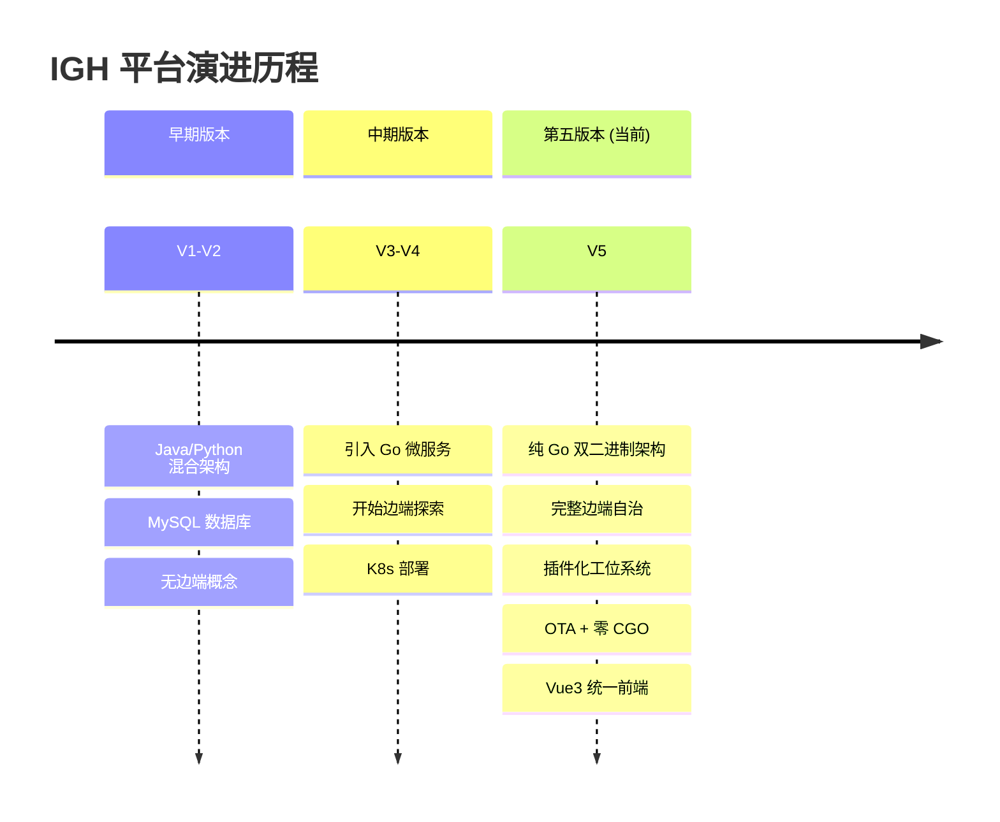

---

## 附录 A: 完整 API 端点汇总

### 边端 API (igh-edge)

| 方法 | 端点 | 功能 |
|------|------|------|
| GET | `/health` | 健康检查 |
| GET | `/api/v1/station/identify` | 工位识别 |
| GET | `/api/v1/edge/info` | 边端信息 |
| GET | `/api/v1/edge/sync/status` | 同步状态 |
| GET | `/api/v1/edge/plc/status` | PLC 设备状态 |
| POST | `/api/v1/edge/plc/write` | PLC 数据写入 |
| POST | `/api/v1/edge/plc/read` | PLC 数据读取 |
| GET | `/api/v1/edge/ha/status` | HA 状态 |
| GET | `/api/v1/edge/printers` | 打印机列表 |
| POST | `/api/v1/edge/printers/check` | 检查打印机连通性 |
| POST | `/api/v1/edge/print` | 打印标签 |
| GET | `/api/v1/edge/diagnostics` | 运行时诊断 |
| GET | `/api/v1/system/modules` | 模块开关 |
| GET | `/api/v1/edge/config` | 业务配置 |
| GET | `/api/v1/edge/update/status` | 更新状态 |
| POST | `/api/v1/edge/update/download` | 触发下载 |
| POST | `/api/v1/edge/update/install` | 触发安装 |
| * | `/api/v1/*` (插件路由) | 各工位业务 API |

### 服务端 API (igh-server)

| 组 | 方法 | 端点 | 功能 |
|----|------|------|------|
| Public | GET | `/health` | 健康检查 |
| Public | GET | `/metrics` | Prometheus 指标 |
| Public | POST | `/api/v1/auth/login` | 用户登录 |
| Public | GET | `/api/v1/station/identify` | 工位识别 |
| Edge | POST | `/api/v1/edge/register` | 边端注册 |
| Edge | POST | `/api/v1/edge/heartbeat` | 边端心跳 |
| Edge | POST | `/api/v1/edge/upload` | 事件上传 |
| Edge | POST | `/api/v1/edge/commands/:id/ack` | 命令确认 |
| Edge | GET | `/api/v1/edge/sync/*` | 数据同步 (11端点) |
| Mgmt | GET | `/api/v1/ws` | WebSocket 连接 |
| Mgmt | * | `/api/v1/lots/*` | 批次管理 |
| Mgmt | * | `/api/v1/doffings/*` | 落丝管理 |
| Mgmt | * | `/api/v1/bobbins/*` | 丝饼管理 |
| Mgmt | * | `/api/v1/quality/*` | 质量管理 |
| Mgmt | * | `/api/v1/picking-orders/*` | 拣选订单 |
| Mgmt | * | `/api/v1/packing-orders/*` | 打包订单 |
| Mgmt | * | `/api/v1/pallets/*` | 栈板管理 |
| Mgmt | * | `/api/v1/warehouses/*` | 仓库管理 |
| Mgmt | * | `/api/v1/alarms/*` | 告警管理 |
| Mgmt | * | `/api/v1/stats/*` | 统计分析 |
| Mgmt | * | `/api/v1/maintenance/*` | 维保管理 |
| Mgmt | * | `/api/v1/devices/*` | 设备管理 |
| Mgmt | * | `/api/v1/vehicles/*` | 载具管理 |
| Mgmt | * | `/api/v1/erp/*` | ERP 对接 |
| Mgmt | * | `/api/v1/admin/*` | 系统管理 |
| Mgmt | * | `/api/v1/labels/*` | 标签打印 |

## 附录 B: 并发架构总结

| 组件 | goroutine | 用途 |
|------|-----------|------|
| SyncEngine.Start | 1 | 心跳+出站上传+入站拉取主循环 |
| PLCManager.Start | N (每设备1个) | PLC 轮询、重连 |
| HAManager.Start | 3 | UDP 发送/接收/监控 |
| HTTP Server | gin 管理 | HTTP 请求处理 |
| WebSocket Hub | 1 + N | Hub 主循环 + 每客户端 2 (read/write pump) |
| Command ACK | 每命令 1 个 | 异步确认 |
| Updater | 0-1 | 后台下载/安装 |
| EventBus | 同步 | 事件处理 (在 HTTP handler 中) |

## 附录 C: 锁使用统计

| 组件 | 锁类型 | 保护对象 |
|------|--------|---------|
| config.Manager | RWMutex | 业务配置读写 |
| ha.Manager | RWMutex | 角色状态 |
| plc.DeviceState | Mutex | 单设备连接+数据 |
| plc.s7Protocol | Mutex | S7 连接 |
| plc.modbusProtocol | Mutex | Modbus 连接 |
| plc.simulationProtocol | Mutex | 模拟数据 |
| printer.Client | RWMutex | 打印机注册表+模板 |
| queue.Queue | Mutex | 队列操作 |
| updater.Updater | RWMutex | 更新状态 |
| winding.interpreter | Mutex | 落丝计数/报警状态 |
| ws.Hub | channel-based | 客户端注册/广播 |

---

> 本报告基于 igh-platform 源代码逐文件分析生成，覆盖 Go 后端 (~104 文件) 和 Vue3 前端 (~41 文件)，以及全部配置文件和部署脚本。
