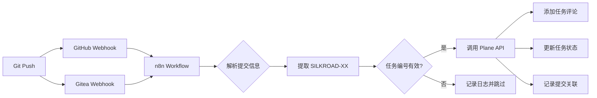

# n8n + Plane 自动化集成方案

**创建日期：** 2026-09-16  
**负责人：** andy  
**状态：** 📝 设计阶段

---

## 🎯 目标

实现 Git 提交/推送后自动更新 Plane 任务，减少手动操作，提升工作流效率。

```
GitHub/Gitea Push → Webhook → n8n → Plane API → 任务状态更新
```

---

## 🏗️ 架构设计

### 整体流程



### 组件清单

| 组件 | 地址 | 用途 | 凭证 |
|------|------|------|------|
| **n8n** | http://192.168.2.16:5678 | 工作流引擎 | Admin Token |
| **GitHub** | https://github.com | 外部代码仓库 | Webhook Secret |
| **Gitea** | http://192.168.2.84 | 内部代码仓库 | Webhook Secret |
| **Plane API** | 环境变量配置 | 任务管理 | PLANE_API_KEY |

---

## 📋 Webhook 配置

### GitHub Webhook 设置

**路径：** Repository Settings → Webhooks → Add webhook

```json
{
  "payload_url": "https://n8n.yourdomain.com/webhook/github-plane",
  "content_type": "application/json",
  "secret": "YOUR_WEBHOOK_SECRET",
  "events": ["push", "pull_request"],
  "active": true
}
```

**触发事件：**
- `push` - 代码推送
- `pull_request` - PR 创建/合并

### Gitea Webhook 设置

**路径：** 仓库设置 → Webhooks → 添加 Webhook → Gitea

```json
{
  "url": "http://192.168.2.16:5678/webhook/gitea-plane",
  "content_type": "application/json",
  "secret": "YOUR_WEBHOOK_SECRET",
  "events": ["push", "pull_request"],
  "active": true
}
```

---

## 🔧 n8n Workflow 设计

### Workflow 1: Git Push → Plane 评论

**触发器：** Webhook (GitHub/Gitea push event)

**节点流程：**

1. **Webhook 节点** - 接收 GitHub/Gitea 推送事件
   ```javascript
   // 输入数据示例
   {
     "ref": "refs/heads/main",
     "commits": [
       {
         "id": "abc123...",
         "message": "fix(auth): handle invalid token [SILKROAD-5]",
         "author": { "name": "Andy Yuan" },
         "url": "https://github.com/.../commit/abc123"
       }
     ]
   }
   ```

2. **Function 节点** - 解析提交信息
   ```javascript
   // 提取任务编号和提交信息
   const commits = $input.all()[0].json.commits;
   const results = [];
   
   for (const commit of commits) {
     // 匹配 SILKROAD-XX 格式
     const match = commit.message.match(/\[?(SILKROAD-\d+)\]?/i);
     
     if (match) {
       results.push({
         taskId: match[1],
         commitHash: commit.id.substring(0, 7),
         commitMessage: commit.message.split('[')[0].trim(),
         commitUrl: commit.url,
         author: commit.author.name,
         timestamp: commit.timestamp
       });
     }
   }
   
   return results;
   ```

3. **Split Out 节点** - 拆分为多个任务更新

4. **HTTP Request 节点** - 调用 Plane API 添加评论
   ```javascript
   // Plane API: 添加工作项评论
   // POST /api/v1/workspaces/{workspace_slug}/projects/{project_id}/issues/{issue_id}/comments/
   
   {
     "method": "POST",
     "url": "{{$env.PLANE_BASE_URL}}/api/v1/workspaces/{{$env.PLANE_WORKSPACE_SLUG}}/projects/2f1e469d-f629-4fb2-884c-fc3347363060/issues/{{$node['Function'].json.taskId}}/comments/",
     "headers": {
       "X-API-Key": "{{$env.PLANE_API_KEY}}",
       "Content-Type": "application/json"
     },
     "body": {
       "comment_html": "<h3>✅ 代码已提交</h3><p><strong>Commit:</strong> <code>{{$node['Function'].json.commitHash}}</code></p><p><strong>Message:</strong> {{$node['Function'].json.commitMessage}}</p><p><strong>Author:</strong> {{$node['Function'].json.author}}</p><p><a href='{{$node['Function'].json.commitUrl}}'>查看提交</a></p>"
     }
   }
   ```

5. **Error Handling 节点** - 记录失败日志

---

### Workflow 2: PR Merge → Plane 状态更新

**触发器：** Webhook (pull_request merged)

**节点流程：**

1. **Webhook 节点** - 接收 PR 事件
   ```javascript
   {
     "action": "closed",
     "pull_request": {
       "merged": true,
       "title": "feat: implement user login [SILKROAD-5]",
       "html_url": "https://github.com/.../pull/42"
     }
   }
   ```

2. **Switch 节点** - 判断 PR 是否合并
   ```javascript
   // 仅处理已合并的 PR
   return [{
     json: $input.item.json.pull_request.merged === true
   }];
   ```

3. **Function 节点** - 提取任务编号
   ```javascript
   const title = $input.item.json.pull_request.title;
   const match = title.match(/\[?(SILKROAD-\d+)\]?/i);
   
   if (!match) return [];
   
   return [{
     json: {
       taskId: match[1],
       prUrl: $input.item.json.pull_request.html_url,
       prTitle: title
     }
   }];
   ```

4. **HTTP Request 节点** - 调用 Plane API 更新状态
   ```javascript
   // 方案 1: 添加评论 + 手动确认状态
   {
     "comment_html": "<h3>🎉 PR 已合并</h3><p><a href='{{$json.prUrl}}'>{{$json.prTitle}}</a></p><p>请人工验收后标记为 Done</p>"
   }
   
   // 方案 2 (可选): 自动标记为 In Review
   // PATCH /api/v1/.../issues/{issue_id}/
   {
     "state": "in_review_state_id"  // 需要先查询 state ID
   }
   ```

---

### Workflow 3: 每日任务同步报告

**触发器：** Cron (每天 18:00)

**节点流程：**

1. **Cron 节点** - 定时触发 `0 18 * * *`

2. **HTTP Request** - 查询 Plane 今日活动
   ```javascript
   // GET /api/v1/.../projects/{project_id}/issues/
   // 过滤今日更新的任务
   {
     "params": {
       "updated_at__gte": "{{$today().toISOString()}}"
     }
   }
   ```

3. **Function 节点** - 生成汇总报告
   ```javascript
   const issues = $input.all()[0].json.results;
   
   const summary = {
     total: issues.length,
     completed: issues.filter(i => i.state_detail.group === 'completed').length,
     inProgress: issues.filter(i => i.state_detail.group === 'started').length,
     blocked: issues.filter(i => i.priority === 'urgent').length
   };
   
   return [{
     json: {
       date: new Date().toISOString().split('T')[0],
       summary,
       details: issues.map(i => ({
         id: i.identifier,
         name: i.name,
         state: i.state_detail.name,
         assignees: i.assignee_details.map(a => a.display_name)
       }))
     }
   }];
   ```

4. **Write File 节点** - 保存到 `.agent-pm/daily-reports/`

5. **Slack/Email 节点** (可选) - 发送通知

---

## 🔐 安全配置

### 环境变量设置

在 n8n 中配置以下环境变量：

```bash
# Plane API
PLANE_BASE_URL=https://plane.yourdomain.com
PLANE_WORKSPACE_SLUG=your-workspace
PLANE_API_KEY=your-api-key

# Webhook 安全
GITHUB_WEBHOOK_SECRET=random-secret-string
GITEA_WEBHOOK_SECRET=random-secret-string
```

### Webhook 验证

**GitHub Signature 验证：**
```javascript
// n8n Function 节点
const crypto = require('crypto');

function verifyGitHubSignature(payload, signature, secret) {
  const hmac = crypto.createHmac('sha256', secret);
  const digest = 'sha256=' + hmac.update(payload).digest('hex');
  return crypto.timingSafeEqual(Buffer.from(signature), Buffer.from(digest));
}

// 在 Webhook 节点中验证
const signature = $request.headers['x-hub-signature-256'];
const isValid = verifyGitHubSignature(
  JSON.stringify($request.body),
  signature,
  $env.GITHUB_WEBHOOK_SECRET
);

if (!isValid) {
  throw new Error('Invalid webhook signature');
}
```

---

## 📊 Plane API 参考

### 常用端点

| 操作 | Method | Endpoint |
|------|--------|----------|
| 查询任务 | GET | `/api/v1/workspaces/{ws}/projects/{proj}/issues/{id}/` |
| 添加评论 | POST | `/api/v1/workspaces/{ws}/projects/{proj}/issues/{id}/comments/` |
| 更新状态 | PATCH | `/api/v1/workspaces/{ws}/projects/{proj}/issues/{id}/` |
| 查询状态列表 | GET | `/api/v1/workspaces/{ws}/projects/{proj}/states/` |
| 任务活动日志 | GET | `/api/v1/workspaces/{ws}/projects/{proj}/issues/{id}/activities/` |

### 关键数据结构

**工作项标识符：**
- `id` - UUID (用于 API 调用)
- `identifier` - 人类可读 (SILKROAD-5)

**状态映射：**
```javascript
// 需要先调用 states API 获取状态 ID
const stateMap = {
  'backlog': 'uuid-1',
  'todo': 'uuid-2',
  'in_progress': 'uuid-3',
  'in_review': 'uuid-4',
  'done': 'uuid-5'
};
```

---

## 🚀 部署步骤

### 1. 准备 n8n 环境

```bash
# 确认 n8n 安装和运行状态
# 检查是否已有 n8n 实例

# 如果未安装，使用 Docker 部署：
docker run -d \
  --name n8n \
  -p 5678:5678 \
  -v ~/.n8n:/home/node/.n8n \
  -e PLANE_BASE_URL="$PLANE_BASE_URL" \
  -e PLANE_WORKSPACE_SLUG="$PLANE_WORKSPACE_SLUG" \
  -e PLANE_API_KEY="$PLANE_API_KEY" \
  n8nio/n8n
```

### 2. 导入 Workflow 模板

1. 登录 n8n Web UI: http://192.168.2.16:5678
2. 创建新 Workflow
3. 导入本文档中的节点配置
4. 配置环境变量和凭证

### 3. 配置 Webhook

**GitHub:**
```bash
# 使用 gh CLI 配置 webhook
gh webhook forward \
  --repo kpvcufighihigkkh-wq/igh-silkroad \
  --events push,pull_request \
  --url https://your-n8n.com/webhook/github-plane
```

**Gitea:**
- 访问仓库设置页面
- 添加 Webhook (POST 请求)
- 配置触发事件和密钥

### 4. 测试验证

```bash
# 测试提交格式
git commit -m "test: webhook integration [SILKROAD-5]"
git push

# 检查：
# 1. n8n Workflow 执行日志
# 2. Plane 任务是否收到评论
# 3. .agent-pm/ 日志文件
```

---

## 📝 提交信息规范

为了让自动化正常工作，提交信息必须遵循以下格式：

### 标准格式

```
<type>(<scope>): <subject> [SILKROAD-XX]

<body>

Refs: #1
```

**示例：**
```
feat(auth): implement JWT token validation [SILKROAD-5]

- Add token expiry check
- Implement refresh token logic
- Add unit tests for token validation

Refs: #1
```

### 类型标识 (type)

| Type | 说明 | 更新 Plane |
|------|------|-----------|
| `feat` | 新功能 | ✅ 添加评论 |
| `fix` | Bug 修复 | ✅ 添加评论 |
| `docs` | 文档更新 | ⚠️ 可选 |
| `style` | 代码格式 | ❌ 跳过 |
| `refactor` | 重构 | ✅ 添加评论 |
| `test` | 测试 | ⚠️ 可选 |
| `chore` | 构建/工具 | ❌ 跳过 |

### 任务编号提取规则

n8n Function 节点会使用以下正则表达式：

```javascript
// 匹配以下所有格式：
// [SILKROAD-5]
// SILKROAD-5
// [silkroad-5] (不区分大小写)
// feat: xxx [SILKROAD-5] yyy

const pattern = /\[?(SILKROAD-\d+)\]?/i;
const match = commitMessage.match(pattern);

if (match) {
  const taskId = match[1].toUpperCase(); // 统一转大写
  // 调用 Plane API...
}
```

---

## 🔄 状态转换逻辑（每步触发）

### 核心原则：**每个 Git 操作都更新 Plane**

| Git 操作 | 触发事件 | Plane 更新内容 | 示例 |
|---------|---------|---------------|------|
| **本地提交** | `git commit` | 添加评论：提交哈希 + 消息 | "💾 本地提交 `abc123`: fix login bug" |
| **推送到远程** | `git push` | 添加评论：推送确认 + 分支 | "⬆️ 推送到 `feat/SILKROAD-5` 分支" |
| **创建分支** | `git push -u origin new-branch` | 添加评论：新分支创建 | "🌿 创建分支 `feat/SILKROAD-5`" |
| **创建 PR** | `pull_request opened` | 添加评论：PR 链接<br>状态：→ In Review | "🔀 PR 创建: [#42](url)" |
| **PR 更新** | `pull_request synchronized` | 添加评论：新提交同步 | "🔄 PR 更新：新增 3 个提交" |
| **PR 审查** | `pull_request_review submitted` | 添加评论：审查结果 | "👀 Code Review: 2 条建议" |
| **PR 合并** | `pull_request closed (merged)` | 添加评论：合并确认<br>状态：→ In Review | "✅ PR 已合并到 `main`" |
| **标签创建** | `tag created` | 添加评论：版本标签 | "🏷️ 发布标签 `v1.0.0`" |

### 详细触发规则

#### 1️⃣ 本地提交 (post-commit hook)

**触发：** 每次 `git commit` 完成后

**操作流程：**
```bash
# .git/hooks/post-commit
#!/bin/bash
# 1. 读取提交信息
COMMIT_HASH=$(git rev-parse --short HEAD)
COMMIT_MSG=$(git log -1 --pretty=%s)
TASK_ID=$(echo "$COMMIT_MSG" | grep -oP '\[?(SILKROAD-\d+)\]?' | tr -d '[]')

# 2. 调用 n8n Webhook (本地触发)
curl -X POST http://192.168.2.16:5678/webhook/git-commit \
  -H "Content-Type: application/json" \
  -d "{
    \"event\": \"commit\",
    \"task_id\": \"$TASK_ID\",
    \"commit_hash\": \"$COMMIT_HASH\",
    \"commit_message\": \"$COMMIT_MSG\",
    \"author\": \"$(git config user.name)\",
    \"branch\": \"$(git branch --show-current)\",
    \"timestamp\": \"$(date -u +%Y-%m-%dT%H:%M:%SZ)\"
  }"
```

**Plane 更新：**
```html
<!-- 添加评论 -->
<h3>💾 本地提交</h3>
<p><code>abc123</code> - fix(auth): handle invalid token</p>
<p><strong>分支:</strong> feat/SILKROAD-5</p>
<p><strong>作者:</strong> Andy Yuan</p>
<p><em>尚未推送到远程</em></p>
```

#### 2️⃣ 推送到远程 (post-push hook + GitHub/Gitea Webhook)

**触发：** 每次 `git push` 完成后

**操作流程：**

**A. 本地 post-push hook**
```bash
# .git/hooks/post-push (自定义)
#!/bin/bash
while read local_ref local_sha remote_ref remote_sha; do
  BRANCH=$(echo "$remote_ref" | sed 's|refs/heads/||')
  COMMITS=$(git log $remote_sha..$local_sha --oneline)
  
  # 提取所有 SILKROAD-XX
  TASK_IDS=$(echo "$COMMITS" | grep -oP 'SILKROAD-\d+' | sort -u)
  
  for TASK_ID in $TASK_IDS; do
    curl -X POST http://192.168.2.16:5678/webhook/git-push \
      -d "{
        \"event\": \"push\",
        \"task_id\": \"$TASK_ID\",
        \"branch\": \"$BRANCH\",
        \"commit_count\": $(echo "$COMMITS" | wc -l),
        \"remote\": \"$1\"
      }"
  done
done
```

**B. GitHub/Gitea Webhook (远程确认)**
- GitHub/Gitea 接收到 push 后触发 Webhook
- n8n 接收远程事件，再次确认推送成功
- 更新 Plane 评论：推送成功 + 远程链接

**Plane 更新：**
```html
<!-- 本地 push 触发 -->
<h3>⬆️ 推送中...</h3>
<p><strong>分支:</strong> feat/SILKROAD-5</p>
<p><strong>提交数:</strong> 3 个新提交</p>

<!-- 远程 Webhook 确认 -->
<h3>✅ 推送成功</h3>
<p><a href="https://github.com/.../compare/main...feat/SILKROAD-5">查看远程分支</a></p>
```

#### 3️⃣ 创建 PR (pull_request opened)

**触发：** GitHub/Gitea 创建 PR 时

**Plane 更新：**
```html
<h3>🔀 PR 已创建</h3>
<p><strong>标题:</strong> feat: implement user login</p>
<p><strong>链接:</strong> <a href="https://github.com/.../pull/42">#42</a></p>
<p><strong>状态:</strong> Open (等待审查)</p>
```

**状态变更：**
- 如果当前状态是 `In Progress` → 保持不变（因为还在开发）
- 如果已是 `In Review` → 保持不变
- **不自动改变状态，仅添加 PR 链接**

#### 4️⃣ PR 代码审查 (pull_request_review)

**触发：** PR 收到 Review 时

**Plane 更新：**
```html
<h3>👀 代码审查</h3>
<p><strong>审查人:</strong> Reviewer Name</p>
<p><strong>结果:</strong> ✅ Approved / ⚠️ Changes Requested / 💬 Commented</p>
<p><strong>评论数:</strong> 3 条建议</p>
<p><a href="https://github.com/.../pull/42#pullrequestreview-123">查看审查</a></p>
```

#### 5️⃣ PR 合并 (pull_request closed + merged)

**触发：** PR 被合并到主分支

**Plane 更新：**
```html
<h3>✅ PR 已合并</h3>
<p><strong>PR:</strong> <a href="https://github.com/.../pull/42">#42</a></p>
<p><strong>合并到:</strong> main</p>
<p><strong>合并提交:</strong> <code>xyz789</code></p>
<p><strong>合并人:</strong> Maintainer Name</p>
```

**状态变更：**
- `In Progress` → `In Review` (自动)
- `In Review` → 保持不变
- 添加标签：`merged` (可选)

#### 6️⃣ 版本标签 (tag created)

**触发：** 创建 Git Tag (如 `v1.0.0`)

**Plane 更新：**
```html
<h3>🏷️ 版本发布</h3>
<p><strong>标签:</strong> v1.0.0</p>
<p><strong>提交:</strong> <code>abc123</code></p>
<p><a href="https://github.com/.../releases/tag/v1.0.0">查看 Release</a></p>
```

---

### 状态更新规则（严格模式）

**⚠️ 核心原则：**
```
┌─────────────────────────────────────────────────┐
│  所有 Git 操作 = 添加评论（记录变化）           │
│  状态变更 = 仅人工确认后执行                     │
└─────────────────────────────────────────────────┘
```

| Git 操作 | Plane 操作 | 状态变更 | 说明 |
|---------|-----------|---------|------|
| `git commit` | 📝 添加评论 | ❌ 不变 | 记录提交哈希 + 消息 |
| `git push` | 📝 添加评论 | ❌ 不变 | 记录推送分支 + 提交数 |
| `PR created` | 📝 添加评论 | ❌ 不变 | 记录 PR 链接 |
| `PR review` | 📝 添加评论 | ❌ 不变 | 记录审查结果 |
| `PR merged` | 📝 添加评论 | ❌ 不变 | 记录合并确认 |
| `Tag release` | 📝 添加评论 | ❌ 不变 | 记录版本标签 |
| **人工确认完成** | 📝 添加评论 + 🔄 状态更新 | ✅ → Done | **唯一允许改状态的方式** |

**图例：**
- 📝 评论：记录活动日志，状态不变
- 🔄 状态更新：仅人工操作
- ❌ 不变：系统永不自动改状态

---

### 评论内容标准格式

每个 Git 操作都生成结构化评论，包含：

#### 1. 提交记录
```html
<h3>💾 代码提交</h3>
<table>
  <tr><td><strong>提交哈希</strong></td><td><code>abc123</code></td></tr>
  <tr><td><strong>提交信息</strong></td><td>fix(auth): handle invalid token</td></tr>
  <tr><td><strong>作者</strong></td><td>Andy Yuan</td></tr>
  <tr><td><strong>分支</strong></td><td>feat/SILKROAD-5</td></tr>
  <tr><td><strong>时间</strong></td><td>2026-09-16 14:30:00</td></tr>
</table>

<h4>📝 修改文件</h4>
<ul>
  <li>✏️ src/auth/token.ts (+15, -3)</li>
  <li>✅ tests/auth/token.test.ts (+42, -0)</li>
  <li>📝 docs/api/auth.md (+8, -2)</li>
</ul>

<h4>🔗 关联链接</h4>
<p><a href="https://github.com/.../commit/abc123">查看完整 Diff</a></p>
```

#### 2. 推送记录
```html
<h3>⬆️ 推送到远程</h3>
<table>
  <tr><td><strong>分支</strong></td><td>feat/SILKROAD-5</td></tr>
  <tr><td><strong>远程仓库</strong></td><td>origin (GitHub)</td></tr>
  <tr><td><strong>新增提交</strong></td><td>3 个</td></tr>
  <tr><td><strong>推送时间</strong></td><td>2026-09-16 14:35:00</td></tr>
</table>

<h4>📦 提交列表</h4>
<ul>
  <li><code>abc123</code> - fix(auth): handle invalid token</li>
  <li><code>def456</code> - test(auth): add token validation tests</li>
  <li><code>ghi789</code> - docs(auth): update API documentation</li>
</ul>

<h4>🔗 关联链接</h4>
<p><a href="https://github.com/.../compare/main...feat/SILKROAD-5">查看远程分支</a></p>
```

#### 3. PR 记录
```html
<h3>🔀 Pull Request</h3>
<table>
  <tr><td><strong>PR 编号</strong></td><td><a href="https://github.com/.../pull/42">#42</a></td></tr>
  <tr><td><strong>标题</strong></td><td>feat: implement user login</td></tr>
  <tr><td><strong>状态</strong></td><td>✅ Merged / 🔄 Open / ❌ Closed</td></tr>
  <tr><td><strong>创建人</strong></td><td>Andy Yuan</td></tr>
  <tr><td><strong>审查人</strong></td><td>Reviewer Name</td></tr>
  <tr><td><strong>合并时间</strong></td><td>2026-09-16 15:00:00</td></tr>
</table>

<h4>📊 变更统计</h4>
<ul>
  <li>📁 文件变更: 8 个</li>
  <li>➕ 新增: 156 行</li>
  <li>➖ 删除: 42 行</li>
  <li>✅ 测试通过: 23/23</li>
</ul>

<blockquote>
<p><strong>⚠️ 人工验收待完成</strong></p>
<p>请在实际验证功能后手动标记任务为 Done</p>
</blockquote>
```

#### 4. 审查记录
```html
<h3>👀 代码审查</h3>
<table>
  <tr><td><strong>审查人</strong></td><td>Reviewer Name</td></tr>
  <tr><td><strong>结果</strong></td><td>✅ Approved / ⚠️ Changes Requested / 💬 Commented</td></tr>
  <tr><td><strong>审查时间</strong></td><td>2026-09-16 14:50:00</td></tr>
</table>

<h4>💬 审查意见</h4>
<ul>
  <li>✅ 代码逻辑清晰</li>
  <li>⚠️ 建议添加边界测试</li>
  <li>💬 命名建议: getUserToken → fetchUserToken</li>
</ul>

<p><a href="https://github.com/.../pull/42#pullrequestreview-123">查看完整审查</a></p>
```

---

### 实现优先级（修正版）

| 优先级 | 功能 | 操作 | 实现方式 |
|-------|------|------|----------|
| **P0** | Commit → 记录 | 📝 评论 | post-commit hook + n8n |
| **P0** | Push → 记录 | 📝 评论 | GitHub/Gitea Webhook + n8n |
| **P0** | PR 状态 → 记录 | 📝 评论 | GitHub/Gitea Webhook + n8n |
| **P1** | PR Review → 记录 | 📝 评论 | GitHub/Gitea Webhook + n8n |
| **P1** | 文件变更统计 | 📊 数据 | git diff-tree + n8n |
| **P2** | 每日汇总报告 | 📈 报告 | Cron + n8n |
| **P3** | Tag Release → 记录 | 📝 评论 | GitHub/Gitea Webhook + n8n |

---

### 人工确认流程

**唯一允许改变任务状态的方式：**

```bash
# 方式 1: 通过 Vikunja 标记完成
veans update #1 -s completed --comment "<p>功能已验收通过</p>"

# 方式 2: 通过 Plane Web UI
# 登录 Plane → 打开任务 → 标记为 Done → 填写验收说明

# 方式 3: 通过 MCP 工具（Claude Code 辅助）
mcp__plane__workitem update \
  --project_id "2f1e469d..." \
  --workitem_id "SILKROAD-5-uuid" \
  --state "done_state_uuid"
```

**验收检查清单（强制）：**
```markdown
- [ ] 功能符合需求描述
- [ ] 单元测试全部通过
- [ ] 集成测试验证成功
- [ ] 代码审查已完成
- [ ] 文档已同步更新
- [ ] 无遗留 TODO 或 FIXME
```

**验收后的 Plane 评论：**
```html
<h3>✅ 任务验收完成</h3>
<table>
  <tr><td><strong>验收人</strong></td><td>Andy Yuan</td></tr>
  <tr><td><strong>验收时间</strong></td><td>2026-09-16 16:00:00</td></tr>
  <tr><td><strong>状态变更</strong></td><td>In Progress → Done</td></tr>
</table>

<h4>✅ 验收结果</h4>
<ul>
  <li>✅ 功能测试通过</li>
  <li>✅ 单元测试覆盖率 85%</li>
  <li>✅ 代码审查无阻塞问题</li>
  <li>✅ 文档已更新</li>
</ul>

<h4>📊 完成统计</h4>
<ul>
  <li>总提交数: 8 次</li>
  <li>代码行数: +523 / -124</li>
  <li>开发时长: 3 天</li>
  <li>关联 PR: <a href="https://github.com/.../pull/42">#42</a></li>
</ul>
```

---

**⚠️ 严格规则：**
1. ❌ **n8n 工作流永不调用状态更新 API**
2. ✅ **所有 Git 操作仅记录活动日志**
3. 👤 **状态变更 100% 由人工确认触发**
4. 📝 **每条评论必须包含时间戳和操作者**
5. 🔄 **完整的审计追踪，可回溯每次变更**

---

## 📈 监控与日志

### 日志文件结构

```
.agent-pm/
├── commits.ndjson              # Git 提交日志（现有）
├── plane-updates.ndjson        # Plane 更新记录（新增）
├── webhook-events.ndjson       # Webhook 事件日志（新增）
└── daily-reports/
    ├── 2026-09-16.json         # 每日汇总报告
    └── 2026-09-17.json
```

### plane-updates.ndjson 格式

```json
{"timestamp":"2026-09-16T10:30:00Z","task_id":"SILKROAD-5","commit":"abc123","action":"comment_added","status":"success"}
{"timestamp":"2026-09-16T10:35:00Z","task_id":"SILKROAD-6","commit":"def456","action":"state_updated","from":"in_progress","to":"in_review","status":"success"}
{"timestamp":"2026-09-16T10:40:00Z","task_id":"SILKROAD-7","commit":"ghi789","action":"comment_failed","error":"Task not found","status":"error"}
```

### 监控仪表板 (可选)

在 n8n 中创建监控 Workflow：

1. **读取日志文件** - 解析 `.agent-pm/*.ndjson`
2. **统计指标** - 成功率、失败原因、响应时间
3. **可视化** - 导出到 Grafana/Metabase
4. **告警** - 连续失败 3 次时发送通知

---

## 🐛 故障排查

### 常见问题

**1. Webhook 未触发**
```bash
# 检查 n8n 日志
docker logs n8n

# 检查 Webhook 配置
gh webhook list --repo your-repo

# 测试 Webhook 连通性
curl -X POST https://your-n8n.com/webhook-test/github-plane \
  -H "Content-Type: application/json" \
  -d '{"test": true}'
```

**2. Plane API 调用失败**
```bash
# 验证 API Key
curl -H "X-API-Key: $PLANE_API_KEY" \
  "$PLANE_BASE_URL/api/v1/workspaces/$PLANE_WORKSPACE_SLUG/projects/"

# 检查任务是否存在
curl -H "X-API-Key: $PLANE_API_KEY" \
  "$PLANE_BASE_URL/api/v1/workspaces/$PLANE_WORKSPACE_SLUG/projects/PROJECT_ID/issues/?search=SILKROAD-5"
```

**3. 任务编号未识别**
```javascript
// 在 n8n Function 节点添加调试日志
console.log('Commit message:', commitMessage);
console.log('Regex match:', commitMessage.match(/\[?(SILKROAD-\d+)\]?/i));

// 检查提交格式是否正确
git log --oneline | grep SILKROAD
```

---

## 🔮 未来扩展

### 阶段 2: 智能状态管理

- 根据提交内容自动判断任务完成度
- 识别 "WIP"、"Draft" 等关键词，避免误更新
- 分析代码覆盖率，自动评估质量

### 阶段 3: 多项目支持

- 支持多个 Plane 项目（AGV、信息化集成）
- 根据仓库路径自动路由到对应项目
- 统一的任务编号命名空间

### 阶段 4: AI 辅助

- 自动生成任务进度摘要
- 识别阻塞风险并提醒
- 预测任务完成时间

---

**文档维护：** andy  
**最后更新：** 2026-09-16  
**版本：** v1.0
