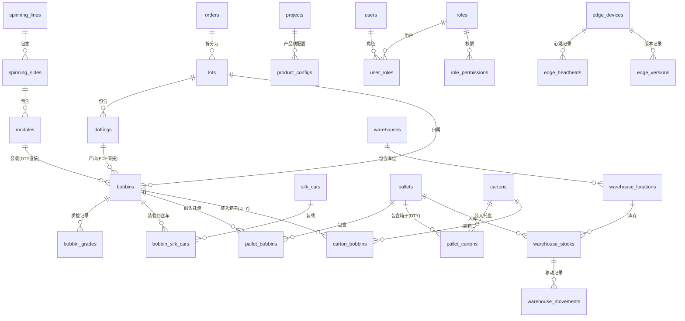

# IGH 数据库详细设计

> **文档编号:** DB-DESIGN-001  
> **版本:** 1.0  
> **基于:** 系统需求规格说明书 v1.2 (238条需求 + 28项ADR)  
> **日期:** 2026-09-24  
> **设计者:** 浮浮酱

---

## 一、设计原则

### 1.1 核心约束（来自ADR）

| ADR编号 | 约束 | 数据库影响 |
|---------|------|------------|
| **ADR-02** | 混合生产模式：可配置但不混合，同一产线同时只跑一种产品 | 统一数据模型，通过product_type字段区分FDY/POY/DTY |
| **ADR-07** | 边端SQLite + 可配置保留策略 + 自动清理 | 边端表需要created_at/synced_at字段，支持按时间窗口清理 |
| **ADR-09** | 中心端PostgreSQL + 边端SQLite | 中心端完整Schema，边端简化Schema + sync_status字段 |
| **ADR-19** | 双机热备（IGH-SilkGuard） | PostgreSQL主从流复制，表设计需考虑WAL复制性能 |

### 1.2 设计目标

✅ **统一数据模型** - 不再像V2那样FDY/DTY分库，通过product_type区分  
✅ **追溯完整性** - 从成品反向追溯到原料/模组/PLC参数  
✅ **性能优化** - 避免N+1查询，批量操作优化  
✅ **边端离线** - SQLite支持完整的本地业务流转  
✅ **数据一致性** - 边端上传后与中心端合并，冲突处理机制  

### 1.3 命名约定

```yaml
表名: 
  - 小写蛇形命名: orders, lots, bobbins
  - 复数形式: users (不是user)
  - 关联表: bobbin_grades, pallet_bobbins

字段名:
  - 小写蛇形: order_number, created_at
  - 主键统一: id (UUID)
  - 外键命名: {table}_id (如 order_id)
  - 布尔字段: is_*, has_*, can_*
  - 时间字段: *_at (如 created_at, updated_at)

索引命名:
  - idx_{table}_{column(s)} (如 idx_bobbins_lot_id)
  - uk_{table}_{column(s)} (唯一索引)
  - fk_{table}_{ref_table} (外键)
```

---

## 二、中心端数据库设计（PostgreSQL）

### 2.1 整体ER图



---

### 2.2 核心业务表

#### 2.2.1 订单管理 (orders)

```sql
-- 订单表（统一FDY/POY/DTY）
CREATE TABLE orders (
  id UUID PRIMARY KEY DEFAULT gen_random_uuid(),
  order_number VARCHAR(50) UNIQUE NOT NULL,                -- 订单号
  product_type VARCHAR(20) NOT NULL CHECK (product_type IN ('FDY', 'POY', 'DTY')),
  status VARCHAR(20) NOT NULL DEFAULT 'pending' 
    CHECK (status IN ('pending', 'in_progress', 'paused', 'completed', 'cancelled')),
  
  -- 产品信息
  product_name VARCHAR(100) NOT NULL,                      -- 产品名称
  specification TEXT,                                       -- 规格说明
  target_weight_kg DECIMAL(12, 3),                         -- 目标重量(kg)
  
  -- 计划与实际
  planned_quantity INT,                                     -- 计划数量
  actual_quantity INT DEFAULT 0,                            -- 实际产量
  
  -- 时间信息
  planned_start_at TIMESTAMPTZ,                             -- 计划开始时间
  planned_end_at TIMESTAMPTZ,                               -- 计划完成时间
  started_at TIMESTAMPTZ,                                   -- 实际开始时间
  completed_at TIMESTAMPTZ,                                 -- 实际完成时间
  
  -- 客户信息
  customer_name VARCHAR(100),                               -- 客户名称
  customer_code VARCHAR(50),                                -- 客户编码
  
  -- ERP集成
  erp_order_id VARCHAR(100),                                -- ERP订单ID
  erp_synced_at TIMESTAMPTZ,                                -- ERP同步时间
  
  -- 元数据
  created_by UUID REFERENCES users(id),
  created_at TIMESTAMPTZ NOT NULL DEFAULT NOW(),
  updated_at TIMESTAMPTZ NOT NULL DEFAULT NOW(),
  
  -- 审计
  version INT NOT NULL DEFAULT 1,                           -- 乐观锁版本号
  
  -- 全文搜索
  search_vector TSVECTOR GENERATED ALWAYS AS (
    to_tsvector('simple', 
      COALESCE(order_number, '') || ' ' ||
      COALESCE(product_name, '') || ' ' ||
      COALESCE(customer_name, '')
    )
  ) STORED
);

-- 索引
CREATE INDEX idx_orders_status ON orders(status) WHERE status IN ('pending', 'in_progress');
CREATE INDEX idx_orders_product_type ON orders(product_type);
CREATE INDEX idx_orders_planned_start ON orders(planned_start_at) WHERE status = 'pending';
CREATE INDEX idx_orders_search ON orders USING GIN(search_vector);
CREATE INDEX idx_orders_erp ON orders(erp_order_id) WHERE erp_order_id IS NOT NULL;

-- 更新时间触发器
CREATE TRIGGER set_orders_updated_at
  BEFORE UPDATE ON orders
  FOR EACH ROW
  EXECUTE FUNCTION update_updated_at_column();
```

#### 2.2.2 批次管理 (lots)

```sql
-- 批次表
CREATE TABLE lots (
  id UUID PRIMARY KEY DEFAULT gen_random_uuid(),
  order_id UUID NOT NULL REFERENCES orders(id) ON DELETE CASCADE,
  lot_number VARCHAR(50) UNIQUE NOT NULL,                  -- 批号
  prefix VARCHAR(20),                                       -- 批次前缀
  
  -- 批次属性
  sequence_in_order INT NOT NULL,                           -- 在订单中的序号
  target_weight_kg DECIMAL(12, 3),                         -- 目标重量
  actual_weight_kg DECIMAL(12, 3) DEFAULT 0,               -- 实际重量
  
  -- 状态
  status VARCHAR(20) NOT NULL DEFAULT 'pending'
    CHECK (status IN ('pending', 'in_progress', 'completed', 'cancelled')),
  is_locked BOOLEAN NOT NULL DEFAULT FALSE,                 -- 打包锁定
  
  -- 时间信息
  started_at TIMESTAMPTZ,
  completed_at TIMESTAMPTZ,
  
  -- 元数据
  created_at TIMESTAMPTZ NOT NULL DEFAULT NOW(),
  updated_at TIMESTAMPTZ NOT NULL DEFAULT NOW(),
  
  -- 约束
  UNIQUE(order_id, sequence_in_order)
);

-- 索引
CREATE INDEX idx_lots_order_id ON lots(order_id);
CREATE INDEX idx_lots_status ON lots(status) WHERE status IN ('pending', 'in_progress');
CREATE INDEX idx_lots_locked ON lots(is_locked) WHERE is_locked = TRUE;

-- 更新时间触发器
CREATE TRIGGER set_lots_updated_at
  BEFORE UPDATE ON lots
  FOR EACH ROW
  EXECUTE FUNCTION update_updated_at_column();
```

#### 2.2.3 卷绕机模组 (modules)

```sql
-- 卷绕机模组表
CREATE TABLE modules (
  id UUID PRIMARY KEY DEFAULT gen_random_uuid(),
  module_code VARCHAR(50) UNIQUE NOT NULL,                 -- 模组编号
  
  -- 归属
  spinning_side_id UUID REFERENCES spinning_sides(id),      -- 所属纺丝侧
  
  -- 产品类型
  product_type VARCHAR(20) NOT NULL CHECK (product_type IN ('FDY', 'POY', 'DTY')),
  position_count INT NOT NULL CHECK (position_count IN (24, 96)),  -- 锭位数：24(FDY/POY) 96(DTY)
  
  -- 状态
  status VARCHAR(20) NOT NULL DEFAULT 'idle'
    CHECK (status IN ('idle', 'running', 'paused', 'maintenance', 'error')),
  
  -- PLC连接
  plc_address VARCHAR(100),                                 -- PLC地址
  plc_db_number INT,                                        -- DB块号
  
  -- 元数据
  created_at TIMESTAMPTZ NOT NULL DEFAULT NOW(),
  updated_at TIMESTAMPTZ NOT NULL DEFAULT NOW()
);

-- 索引
CREATE INDEX idx_modules_spinning_side ON modules(spinning_side_id);
CREATE INDEX idx_modules_product_type ON modules(product_type);
CREATE INDEX idx_modules_status ON modules(status) WHERE status != 'idle';

-- 更新时间触发器
CREATE TRIGGER set_modules_updated_at
  BEFORE UPDATE ON modules
  FOR EACH ROW
  EXECUTE FUNCTION update_updated_at_column();
```

#### 2.2.4 落纱记录 (doffings)

```sql
-- 落纱记录表（FDY/POY间接关联方式）
CREATE TABLE doffings (
  id UUID PRIMARY KEY DEFAULT gen_random_uuid(),
  lot_id UUID NOT NULL REFERENCES lots(id) ON DELETE CASCADE,
  module_id UUID NOT NULL REFERENCES modules(id),
  
  -- 落纱信息
  doffing_number VARCHAR(50) NOT NULL,                      -- 落纱编号
  doffing_sequence INT NOT NULL,                            -- 落纱序号
  
  -- 时间信息
  doffed_at TIMESTAMPTZ NOT NULL DEFAULT NOW(),            -- 落纱时间
  
  -- 班次信息
  shift_id UUID REFERENCES shifts(id),
  operator_id UUID REFERENCES users(id),                    -- 操作员
  
  -- 元数据
  created_at TIMESTAMPTZ NOT NULL DEFAULT NOW(),
  
  -- 约束
  UNIQUE(lot_id, doffing_sequence)
);

-- 索引
CREATE INDEX idx_doffings_lot_id ON doffings(lot_id);
CREATE INDEX idx_doffings_module_id ON doffings(module_id);
CREATE INDEX idx_doffings_doffed_at ON doffings(doffed_at DESC);
CREATE INDEX idx_doffings_shift ON doffings(shift_id);
```

#### 2.2.5 丝锭 (bobbins)

```sql
-- 丝锭表（核心追溯实体）
CREATE TABLE bobbins (
  id UUID PRIMARY KEY DEFAULT gen_random_uuid(),
  
  -- 归属关系
  lot_id UUID NOT NULL REFERENCES lots(id) ON DELETE CASCADE,
  module_id UUID NOT NULL REFERENCES modules(id),           -- DTY直接关联
  doffing_id UUID REFERENCES doffings(id),                  -- FDY/POY间接关联
  
  -- 丝锭标识
  bobbin_code VARCHAR(50) UNIQUE NOT NULL,                  -- 丝锭编码（唯一追溯码）
  position INT NOT NULL,                                    -- 锭位号(1-24 或 1-96)
  
  -- 生命周期状态
  lifecycle VARCHAR(20) NOT NULL DEFAULT 'produced'
    CHECK (lifecycle IN ('produced', 'inspected', 'on_silk_car', 'in_carton', 'on_pallet', 'in_warehouse', 'shipped', 'archived')),
  
  -- 物理属性
  gross_weight_g DECIMAL(10, 3),                            -- 毛重(克)
  net_weight_g DECIMAL(10, 3),                              -- 净重(克)
  tube_weight_g DECIMAL(10, 3),                             -- 纸管重(克)
  length_m DECIMAL(12, 3),                                  -- 长度(米)
  
  -- 纸管属性
  tube_color1 VARCHAR(20),                                  -- 纸管颜色1
  tube_color2 VARCHAR(20),                                  -- 纸管颜色2
  
  -- 质检结果（冗余最终等级，便于查询）
  final_grade VARCHAR(10),                                  -- 最终等级(AA/B/C/D等)
  is_qualified BOOLEAN,                                     -- 是否合格
  
  -- 时间信息
  produced_at TIMESTAMPTZ NOT NULL DEFAULT NOW(),          -- 生产时间
  inspected_at TIMESTAMPTZ,                                 -- 质检时间
  
  -- 边端来源
  edge_device_id UUID REFERENCES edge_devices(id),          -- 采集边端
  
  -- 元数据
  created_at TIMESTAMPTZ NOT NULL DEFAULT NOW(),
  updated_at TIMESTAMPTZ NOT NULL DEFAULT NOW(),
  
  -- 约束：DTY必须有module_id，FDY/POY必须有doffing_id
  CHECK (
    (module_id IS NOT NULL) OR 
    (doffing_id IS NOT NULL)
  )
);

-- 索引
CREATE INDEX idx_bobbins_lot_id ON bobbins(lot_id);
CREATE INDEX idx_bobbins_module_id ON bobbins(module_id) WHERE module_id IS NOT NULL;
CREATE INDEX idx_bobbins_doffing_id ON bobbins(doffing_id) WHERE doffing_id IS NOT NULL;
CREATE INDEX idx_bobbins_lifecycle ON bobbins(lifecycle);
CREATE INDEX idx_bobbins_final_grade ON bobbins(final_grade) WHERE final_grade IS NOT NULL;
CREATE INDEX idx_bobbins_produced_at ON bobbins(produced_at DESC);
CREATE INDEX idx_bobbins_edge_device ON bobbins(edge_device_id);

-- 分区策略（按生产时间月份分区，提升查询性能）
-- 注意：需要手动创建分区表或使用pg_partman自动管理
-- CREATE TABLE bobbins_y2026m09 PARTITION OF bobbins
--   FOR VALUES FROM ('2026-09-01') TO ('2026-10-01');

-- 更新时间触发器
CREATE TRIGGER set_bobbins_updated_at
  BEFORE UPDATE ON bobbins
  FOR EACH ROW
  EXECUTE FUNCTION update_updated_at_column();
```

#### 2.2.6 质检等级 (bobbin_grades)

```sql
-- 丝锭质检等级表（多维度等级记录）
CREATE TABLE bobbin_grades (
  id UUID PRIMARY KEY DEFAULT gen_random_uuid(),
  bobbin_id UUID NOT NULL REFERENCES bobbins(id) ON DELETE CASCADE,
  
  -- 等级维度
  dimension VARCHAR(20) NOT NULL 
    CHECK (dimension IN ('vision', 'weight', 'sorting', 'knitting', 'final')),
  
  -- 等级值（可配置等级体系：FDY/POY用AA/B/C/D，DTY用AA/AA1/AA2/A1/A）
  grade_value VARCHAR(10) NOT NULL,
  
  -- 缺陷信息
  defect_codes TEXT[],                                      -- 缺陷代码数组
  defect_description TEXT,                                  -- 缺陷描述
  
  -- 检测设备
  inspection_station VARCHAR(50),                           -- 检测工位
  equipment_code VARCHAR(50),                               -- 设备编号
  
  -- 操作信息
  inspector_id UUID REFERENCES users(id),                   -- 检测员
  inspected_at TIMESTAMPTZ NOT NULL DEFAULT NOW(),         -- 检测时间
  
  -- 边端来源
  edge_device_id UUID REFERENCES edge_devices(id),
  
  -- 元数据
  created_at TIMESTAMPTZ NOT NULL DEFAULT NOW(),
  
  -- 约束：每个丝锭每个维度只能有一条最新记录（通过应用层保证或使用排他约束）
  UNIQUE(bobbin_id, dimension, inspected_at)
);

-- 索引
CREATE INDEX idx_bobbin_grades_bobbin_id ON bobbin_grades(bobbin_id);
CREATE INDEX idx_bobbin_grades_dimension ON bobbin_grades(dimension);
CREATE INDEX idx_bobbin_grades_grade_value ON bobbin_grades(grade_value);
CREATE INDEX idx_bobbin_grades_inspected_at ON bobbin_grades(inspected_at DESC);
CREATE INDEX idx_bobbin_grades_inspector ON bobbin_grades(inspector_id);
```

#### 2.2.7 丝车 (silk_cars)

```sql
-- 丝车表
CREATE TABLE silk_cars (
  id UUID PRIMARY KEY DEFAULT gen_random_uuid(),
  silk_car_code VARCHAR(50) UNIQUE NOT NULL,               -- 丝车编号
  
  -- 丝车属性
  capacity INT NOT NULL,                                    -- 容量（可装载丝锭数）
  current_count INT NOT NULL DEFAULT 0,                     -- 当前装载数量
  
  -- 状态
  status VARCHAR(20) NOT NULL DEFAULT 'empty'
    CHECK (status IN ('empty', 'loading', 'full', 'in_transit', 'unloading')),
  
  -- 追踪方式
  tracking_method VARCHAR(20) NOT NULL DEFAULT 'rfid'
    CHECK (tracking_method IN ('rfid', 'barcode', 'manual')),
  rfid_tag VARCHAR(50) UNIQUE,                              -- RFID标签
  
  -- 当前位置
  current_location VARCHAR(100),                            -- 当前位置描述
  current_zone VARCHAR(50),                                 -- 当前功能区
  
  -- 元数据
  created_at TIMESTAMPTZ NOT NULL DEFAULT NOW(),
  updated_at TIMESTAMPTZ NOT NULL DEFAULT NOW()
);

-- 索引
CREATE INDEX idx_silk_cars_status ON silk_cars(status) WHERE status != 'empty';
CREATE INDEX idx_silk_cars_rfid ON silk_cars(rfid_tag) WHERE rfid_tag IS NOT NULL;
CREATE INDEX idx_silk_cars_zone ON silk_cars(current_zone);

-- 更新时间触发器
CREATE TRIGGER set_silk_cars_updated_at
  BEFORE UPDATE ON silk_cars
  FOR EACH ROW
  EXECUTE FUNCTION update_updated_at_column();
```

#### 2.2.8 丝车装载记录 (bobbin_silk_cars)

```sql
-- 丝锭-丝车关联表（装载记录）
CREATE TABLE bobbin_silk_cars (
  id UUID PRIMARY KEY DEFAULT gen_random_uuid(),
  bobbin_id UUID NOT NULL REFERENCES bobbins(id) ON DELETE CASCADE,
  silk_car_id UUID NOT NULL REFERENCES silk_cars(id) ON DELETE CASCADE,
  
  -- 装载信息
  face VARCHAR(10) NOT NULL CHECK (face IN ('A', 'B')),    -- A面/B面
  position_in_car INT,                                      -- 在丝车中的位置
  
  -- 时间信息
  loaded_at TIMESTAMPTZ NOT NULL DEFAULT NOW(),            -- 装车时间
  unloaded_at TIMESTAMPTZ,                                  -- 卸车时间
  
  -- 操作员
  loaded_by UUID REFERENCES users(id),
  unloaded_by UUID REFERENCES users(id),
  
  -- 约束：同一丝锭同一时间只能在一辆丝车上
  UNIQUE(bobbin_id, loaded_at)
);

-- 索引
CREATE INDEX idx_bobbin_silk_cars_bobbin ON bobbin_silk_cars(bobbin_id);
CREATE INDEX idx_bobbin_silk_cars_silk_car ON bobbin_silk_cars(silk_car_id);
CREATE INDEX idx_bobbin_silk_cars_active ON bobbin_silk_cars(silk_car_id) 
  WHERE unloaded_at IS NULL;  -- 当前在车上的丝锭
```

#### 2.2.9 托盘 (pallets)

```sql
-- 托盘表
CREATE TABLE pallets (
  id UUID PRIMARY KEY DEFAULT gen_random_uuid(),
  pallet_code VARCHAR(50) UNIQUE NOT NULL,                 -- 托盘编码
  
  -- 托盘类型
  pallet_type VARCHAR(20) NOT NULL 
    CHECK (pallet_type IN ('bobbin', 'carton')),           -- 直接码丝锭 or 码箱子
  
  -- 关联批次
  lot_id UUID NOT NULL REFERENCES lots(id),
  
  -- 容量
  capacity INT NOT NULL,                                    -- 容量
  current_count INT NOT NULL DEFAULT 0,                     -- 当前数量
  
  -- 状态
  status VARCHAR(20) NOT NULL DEFAULT 'packing'
    CHECK (status IN ('packing', 'sealed', 'in_warehouse', 'shipped')),
  is_sealed BOOLEAN NOT NULL DEFAULT FALSE,                 -- 是否封装
  
  -- 重量
  gross_weight_kg DECIMAL(12, 3),                           -- 毛重
  net_weight_kg DECIMAL(12, 3),                             -- 净重
  tare_weight_kg DECIMAL(12, 3),                            -- 皮重
  
  -- 时间信息
  packed_at TIMESTAMPTZ NOT NULL DEFAULT NOW(),            -- 打包时间
  sealed_at TIMESTAMPTZ,                                    -- 封装时间
  
  -- 边端来源
  edge_device_id UUID REFERENCES edge_devices(id),
  
  -- 元数据
  created_at TIMESTAMPTZ NOT NULL DEFAULT NOW(),
  updated_at TIMESTAMPTZ NOT NULL DEFAULT NOW()
);

-- 索引
CREATE INDEX idx_pallets_lot_id ON pallets(lot_id);
CREATE INDEX idx_pallets_status ON pallets(status);
CREATE INDEX idx_pallets_sealed ON pallets(is_sealed) WHERE is_sealed = FALSE;
CREATE INDEX idx_pallets_edge_device ON pallets(edge_device_id);

-- 更新时间触发器
CREATE TRIGGER set_pallets_updated_at
  BEFORE UPDATE ON pallets
  FOR EACH ROW
  EXECUTE FUNCTION update_updated_at_column();
```

#### 2.2.10 托盘-丝锭关联 (pallet_bobbins)

```sql
-- 托盘-丝锭关联表（FDY/POY直接码盘）
CREATE TABLE pallet_bobbins (
  id UUID PRIMARY KEY DEFAULT gen_random_uuid(),
  pallet_id UUID NOT NULL REFERENCES pallets(id) ON DELETE CASCADE,
  bobbin_id UUID NOT NULL REFERENCES bobbins(id) ON DELETE CASCADE,
  
  -- 码垛信息
  layer INT NOT NULL,                                       -- 层号
  position_in_layer INT NOT NULL,                           -- 层内位置
  
  -- 时间
  packed_at TIMESTAMPTZ NOT NULL DEFAULT NOW(),
  
  -- 约束：同一丝锭只能在一个未封装的托盘上
  UNIQUE(bobbin_id)
);

-- 索引
CREATE INDEX idx_pallet_bobbins_pallet ON pallet_bobbins(pallet_id);
CREATE INDEX idx_pallet_bobbins_bobbin ON pallet_bobbins(bobbin_id);
```

#### 2.2.11 箱子 (cartons)

```sql
-- 箱子表（DTY装箱）
CREATE TABLE cartons (
  id UUID PRIMARY KEY DEFAULT gen_random_uuid(),
  carton_code VARCHAR(50) UNIQUE NOT NULL,                 -- 箱号
  
  -- 关联批次
  lot_id UUID NOT NULL REFERENCES lots(id),
  
  -- 容量
  capacity INT NOT NULL,                                    -- 容量
  current_count INT NOT NULL DEFAULT 0,                     -- 当前数量
  
  -- 状态
  status VARCHAR(20) NOT NULL DEFAULT 'packing'
    CHECK (status IN ('packing', 'sealed', 'on_pallet')),
  is_sealed BOOLEAN NOT NULL DEFAULT FALSE,
  
  -- 重量
  gross_weight_kg DECIMAL(12, 3),
  net_weight_kg DECIMAL(12, 3),
  
  -- 时间
  packed_at TIMESTAMPTZ NOT NULL DEFAULT NOW(),
  sealed_at TIMESTAMPTZ,
  
  -- 边端来源
  edge_device_id UUID REFERENCES edge_devices(id),
  
  -- 元数据
  created_at TIMESTAMPTZ NOT NULL DEFAULT NOW(),
  updated_at TIMESTAMPTZ NOT NULL DEFAULT NOW()
);

-- 索引
CREATE INDEX idx_cartons_lot_id ON cartons(lot_id);
CREATE INDEX idx_cartons_status ON cartons(status);
CREATE INDEX idx_cartons_edge_device ON cartons(edge_device_id);

-- 更新时间触发器
CREATE TRIGGER set_cartons_updated_at
  BEFORE UPDATE ON cartons
  FOR EACH ROW
  EXECUTE FUNCTION update_updated_at_column();
```

#### 2.2.12 箱子-丝锭关联 (carton_bobbins)

```sql
-- 箱子-丝锭关联表（DTY装箱）
CREATE TABLE carton_bobbins (
  id UUID PRIMARY KEY DEFAULT gen_random_uuid(),
  carton_id UUID NOT NULL REFERENCES cartons(id) ON DELETE CASCADE,
  bobbin_id UUID NOT NULL REFERENCES bobbins(id) ON DELETE CASCADE,
  
  -- 装箱信息
  position_in_carton INT NOT NULL,
  
  -- 时间
  packed_at TIMESTAMPTZ NOT NULL DEFAULT NOW(),
  
  -- 约束
  UNIQUE(bobbin_id)
);

-- 索引
CREATE INDEX idx_carton_bobbins_carton ON carton_bobbins(carton_id);
CREATE INDEX idx_carton_bobbins_bobbin ON carton_bobbins(bobbin_id);
```

#### 2.2.13 托盘-箱子关联 (pallet_cartons)

```sql
-- 托盘-箱子关联表（DTY箱子码垛）
CREATE TABLE pallet_cartons (
  id UUID PRIMARY KEY DEFAULT gen_random_uuid(),
  pallet_id UUID NOT NULL REFERENCES pallets(id) ON DELETE CASCADE,
  carton_id UUID NOT NULL REFERENCES cartons(id) ON DELETE CASCADE,
  
  -- 码垛信息
  layer INT NOT NULL,
  position_in_layer INT NOT NULL,
  
  -- 时间
  packed_at TIMESTAMPTZ NOT NULL DEFAULT NOW(),
  
  -- 约束
  UNIQUE(carton_id)
);

-- 索引
CREATE INDEX idx_pallet_cartons_pallet ON pallet_cartons(pallet_id);
CREATE INDEX idx_pallet_cartons_carton ON pallet_cartons(carton_id);
```

---

### 2.3 仓储管理表

#### 2.3.1 仓库 (warehouses)

```sql
-- 仓库表
CREATE TABLE warehouses (
  id UUID PRIMARY KEY DEFAULT gen_random_uuid(),
  warehouse_code VARCHAR(50) UNIQUE NOT NULL,
  warehouse_name VARCHAR(100) NOT NULL,
  
  -- 仓库类型
  warehouse_type VARCHAR(20) NOT NULL 
    CHECK (warehouse_type IN ('stereo', 'flat')),          -- 立体库/平库
  
  -- 容量
  total_locations INT NOT NULL,                             -- 总库位数
  occupied_locations INT NOT NULL DEFAULT 0,                -- 已占用库位
  
  -- PLC连接（立体库堆垛机）
  plc_address VARCHAR(100),
  plc_db_number INT,
  
  -- 状态
  status VARCHAR(20) NOT NULL DEFAULT 'active'
    CHECK (status IN ('active', 'maintenance', 'disabled')),
  
  -- 元数据
  created_at TIMESTAMPTZ NOT NULL DEFAULT NOW(),
  updated_at TIMESTAMPTZ NOT NULL DEFAULT NOW()
);

-- 索引
CREATE INDEX idx_warehouses_type ON warehouses(warehouse_type);
CREATE INDEX idx_warehouses_status ON warehouses(status) WHERE status = 'active';

-- 更新时间触发器
CREATE TRIGGER set_warehouses_updated_at
  BEFORE UPDATE ON warehouses
  FOR EACH ROW
  EXECUTE FUNCTION update_updated_at_column();
```

#### 2.3.2 库位 (warehouse_locations)

```sql
-- 库位表
CREATE TABLE warehouse_locations (
  id UUID PRIMARY KEY DEFAULT gen_random_uuid(),
  warehouse_id UUID NOT NULL REFERENCES warehouses(id) ON DELETE CASCADE,
  location_code VARCHAR(50) NOT NULL,                      -- 库位编码（如：01-02-03表示巷道-排-层）
  
  -- 坐标（立体库）
  aisle INT,                                                -- 巷道
  row_number INT,                                           -- 排
  tier INT,                                                 -- 层
  
  -- 状态
  status VARCHAR(20) NOT NULL DEFAULT 'empty'
    CHECK (status IN ('empty', 'occupied', 'reserved', 'locked', 'maintenance')),
  
  -- 优先级（FIFO优化）
  priority INT NOT NULL DEFAULT 0,                          -- 优先级（用于就近原则）
  
  -- 元数据
  created_at TIMESTAMPTZ NOT NULL DEFAULT NOW(),
  updated_at TIMESTAMPTZ NOT NULL DEFAULT NOW(),
  
  -- 约束
  UNIQUE(warehouse_id, location_code)
);

-- 索引
CREATE INDEX idx_warehouse_locations_warehouse ON warehouse_locations(warehouse_id);
CREATE INDEX idx_warehouse_locations_status ON warehouse_locations(status);
CREATE INDEX idx_warehouse_locations_coordinates ON warehouse_locations(warehouse_id, aisle, row_number, tier)
  WHERE aisle IS NOT NULL;  -- 立体库坐标查询

-- 更新时间触发器
CREATE TRIGGER set_warehouse_locations_updated_at
  BEFORE UPDATE ON warehouse_locations
  FOR EACH ROW
  EXECUTE FUNCTION update_updated_at_column();
```

#### 2.3.3 库存 (warehouse_stocks)

```sql
-- 库存表
CREATE TABLE warehouse_stocks (
  id UUID PRIMARY KEY DEFAULT gen_random_uuid(),
  location_id UUID NOT NULL REFERENCES warehouse_locations(id) ON DELETE CASCADE,
  pallet_id UUID NOT NULL REFERENCES pallets(id) ON DELETE CASCADE,
  
  -- 入库信息
  inbound_at TIMESTAMPTZ NOT NULL DEFAULT NOW(),           -- 入库时间（FIFO依据）
  inbound_by UUID REFERENCES users(id),                     -- 入库操作员
  
  -- 出库信息
  outbound_at TIMESTAMPTZ,                                  -- 出库时间
  outbound_by UUID REFERENCES users(id),                    -- 出库操作员
  
  -- 状态
  status VARCHAR(20) NOT NULL DEFAULT 'in_stock'
    CHECK (status IN ('in_stock', 'reserved', 'picking', 'out_of_stock')),
  
  -- 边端来源
  edge_device_id UUID REFERENCES edge_devices(id),
  
  -- 约束：同一托盘同一时间只能在一个库位
  UNIQUE(pallet_id) WHERE outbound_at IS NULL
);

-- 索引
CREATE INDEX idx_warehouse_stocks_location ON warehouse_stocks(location_id);
CREATE INDEX idx_warehouse_stocks_pallet ON warehouse_stocks(pallet_id);
CREATE INDEX idx_warehouse_stocks_inbound ON warehouse_stocks(inbound_at) 
  WHERE status = 'in_stock';  -- FIFO查询
CREATE INDEX idx_warehouse_stocks_active ON warehouse_stocks(location_id, status) 
  WHERE outbound_at IS NULL;  -- 当前在库
```

#### 2.3.4 库存移动记录 (warehouse_movements)

```sql
-- 库存移动记录表
CREATE TABLE warehouse_movements (
  id UUID PRIMARY KEY DEFAULT gen_random_uuid(),
  stock_id UUID NOT NULL REFERENCES warehouse_stocks(id) ON DELETE CASCADE,
  
  -- 移动类型
  movement_type VARCHAR(20) NOT NULL 
    CHECK (movement_type IN ('inbound', 'outbound', 'transfer', 'adjustment')),
  
  -- 位置信息
  from_location_id UUID REFERENCES warehouse_locations(id),
  to_location_id UUID REFERENCES warehouse_locations(id),
  
  -- 数量（调拨场景）
  quantity INT DEFAULT 1,
  
  -- 操作信息
  operator_id UUID REFERENCES users(id),
  moved_at TIMESTAMPTZ NOT NULL DEFAULT NOW(),
  
  -- 备注
  remarks TEXT,
  
  -- 元数据
  created_at TIMESTAMPTZ NOT NULL DEFAULT NOW()
);

-- 索引
CREATE INDEX idx_warehouse_movements_stock ON warehouse_movements(stock_id);
CREATE INDEX idx_warehouse_movements_type ON warehouse_movements(movement_type);
CREATE INDEX idx_warehouse_movements_moved_at ON warehouse_movements(moved_at DESC);
CREATE INDEX idx_warehouse_movements_from_location ON warehouse_movements(from_location_id);
CREATE INDEX idx_warehouse_movements_to_location ON warehouse_movements(to_location_id);
```

---

### 2.4 配置管理表

#### 2.4.1 项目配置 (projects)

```sql
-- 项目表（多租户支持）
CREATE TABLE projects (
  id UUID PRIMARY KEY DEFAULT gen_random_uuid(),
  project_code VARCHAR(50) UNIQUE NOT NULL,
  project_name VARCHAR(100) NOT NULL,
  
  -- 状态
  status VARCHAR(20) NOT NULL DEFAULT 'active'
    CHECK (status IN ('active', 'suspended', 'archived')),
  
  -- 元数据
  created_at TIMESTAMPTZ NOT NULL DEFAULT NOW(),
  updated_at TIMESTAMPTZ NOT NULL DEFAULT NOW()
);

-- 索引
CREATE INDEX idx_projects_status ON projects(status) WHERE status = 'active';

-- 更新时间触发器
CREATE TRIGGER set_projects_updated_at
  BEFORE UPDATE ON projects
  FOR EACH ROW
  EXECUTE FUNCTION update_updated_at_column();
```

#### 2.4.2 产品线配置 (product_configs)

```sql
-- 产品线配置表（ADR-02：可配置但不混合）
CREATE TABLE product_configs (
  id UUID PRIMARY KEY DEFAULT gen_random_uuid(),
  project_id UUID NOT NULL REFERENCES projects(id) ON DELETE CASCADE,
  product_type VARCHAR(20) NOT NULL CHECK (product_type IN ('FDY', 'POY', 'DTY')),
  
  -- 模组配置
  position_count INT NOT NULL CHECK (position_count IN (24, 96)),
  
  -- 等级体系配置（JSON）
  -- FDY/POY: ["AA", "B", "C", "D"]
  -- DTY: ["AA", "AA1", "AA2", "A1", "A"]
  grade_system JSONB NOT NULL DEFAULT '{
    "dimensions": ["vision", "weight", "sorting", "knitting", "final"],
    "grades": ["AA", "B", "C", "D"],
    "rules": {
      "calculation": "min",
      "description": "最终等级取5个维度中的最低等级"
    }
  }'::jsonb,
  
  -- 追踪路径配置
  tracking_mode VARCHAR(20) NOT NULL 
    CHECK (tracking_mode IN ('doffing_indirect', 'module_direct')),
  
  -- 纸管颜色配置
  tube_colors JSONB DEFAULT '[]'::jsonb,
  
  -- 打包配置
  packing_config JSONB DEFAULT '{
    "type": "pallet",
    "pallet_capacity": 100,
    "carton_capacity": 0
  }'::jsonb,
  
  -- 元数据
  created_at TIMESTAMPTZ NOT NULL DEFAULT NOW(),
  updated_at TIMESTAMPTZ NOT NULL DEFAULT NOW(),
  
  -- 约束
  UNIQUE(project_id, product_type)
);

-- 索引
CREATE INDEX idx_product_configs_project ON product_configs(project_id);
CREATE INDEX idx_product_configs_product_type ON product_configs(product_type);

-- 更新时间触发器
CREATE TRIGGER set_product_configs_updated_at
  BEFORE UPDATE ON product_configs
  FOR EACH ROW
  EXECUTE FUNCTION update_updated_at_column();
```

#### 2.4.3 纺丝线 (spinning_lines)

```sql
-- 纺丝线表
CREATE TABLE spinning_lines (
  id UUID PRIMARY KEY DEFAULT gen_random_uuid(),
  line_code VARCHAR(50) UNIQUE NOT NULL,
  line_name VARCHAR(100) NOT NULL,
  project_id UUID NOT NULL REFERENCES projects(id),
  
  -- 状态
  status VARCHAR(20) NOT NULL DEFAULT 'active'
    CHECK (status IN ('active', 'maintenance', 'disabled')),
  
  -- 元数据
  created_at TIMESTAMPTZ NOT NULL DEFAULT NOW(),
  updated_at TIMESTAMPTZ NOT NULL DEFAULT NOW()
);

-- 索引
CREATE INDEX idx_spinning_lines_project ON spinning_lines(project_id);
CREATE INDEX idx_spinning_lines_status ON spinning_lines(status) WHERE status = 'active';

-- 更新时间触发器
CREATE TRIGGER set_spinning_lines_updated_at
  BEFORE UPDATE ON spinning_lines
  FOR EACH ROW
  EXECUTE FUNCTION update_updated_at_column();
```

#### 2.4.4 纺丝侧 (spinning_sides)

```sql
-- 纺丝侧表
CREATE TABLE spinning_sides (
  id UUID PRIMARY KEY DEFAULT gen_random_uuid(),
  spinning_line_id UUID NOT NULL REFERENCES spinning_lines(id) ON DELETE CASCADE,
  side_code VARCHAR(50) NOT NULL,
  side_name VARCHAR(100) NOT NULL,
  
  -- 位置
  position VARCHAR(10) NOT NULL CHECK (position IN ('A', 'B', 'C', 'D')),
  
  -- 状态
  status VARCHAR(20) NOT NULL DEFAULT 'active'
    CHECK (status IN ('active', 'maintenance', 'disabled')),
  
  -- 元数据
  created_at TIMESTAMPTZ NOT NULL DEFAULT NOW(),
  updated_at TIMESTAMPTZ NOT NULL DEFAULT NOW(),
  
  -- 约束
  UNIQUE(spinning_line_id, position)
);

-- 索引
CREATE INDEX idx_spinning_sides_line ON spinning_sides(spinning_line_id);
CREATE INDEX idx_spinning_sides_status ON spinning_sides(status) WHERE status = 'active';

-- 更新时间触发器
CREATE TRIGGER set_spinning_sides_updated_at
  BEFORE UPDATE ON spinning_sides
  FOR EACH ROW
  EXECUTE FUNCTION update_updated_at_column();
```

---

### 2.5 用户与权限表

#### 2.5.1 用户 (users)

```sql
-- 用户表
CREATE TABLE users (
  id UUID PRIMARY KEY DEFAULT gen_random_uuid(),
  username VARCHAR(50) UNIQUE NOT NULL,
  
  -- 认证
  password_hash VARCHAR(255) NOT NULL,                     -- bcrypt/argon2哈希
  password_changed_at TIMESTAMPTZ DEFAULT NOW(),
  must_change_password BOOLEAN NOT NULL DEFAULT FALSE,
  
  -- 个人信息
  full_name VARCHAR(100) NOT NULL,
  employee_number VARCHAR(50),
  email VARCHAR(100),
  phone VARCHAR(20),
  
  -- 状态
  status VARCHAR(20) NOT NULL DEFAULT 'active'
    CHECK (status IN ('active', 'disabled', 'locked')),
  failed_login_attempts INT NOT NULL DEFAULT 0,
  locked_until TIMESTAMPTZ,
  
  -- 最后登录
  last_login_at TIMESTAMPTZ,
  last_login_ip INET,
  
  -- 元数据
  created_at TIMESTAMPTZ NOT NULL DEFAULT NOW(),
  updated_at TIMESTAMPTZ NOT NULL DEFAULT NOW()
);

-- 索引
CREATE INDEX idx_users_username ON users(username);
CREATE INDEX idx_users_status ON users(status) WHERE status = 'active';
CREATE INDEX idx_users_employee_number ON users(employee_number) WHERE employee_number IS NOT NULL;

-- 更新时间触发器
CREATE TRIGGER set_users_updated_at
  BEFORE UPDATE ON users
  FOR EACH ROW
  EXECUTE FUNCTION update_updated_at_column();
```

#### 2.5.2 角色 (roles)

```sql
-- 角色表
CREATE TABLE roles (
  id UUID PRIMARY KEY DEFAULT gen_random_uuid(),
  role_code VARCHAR(50) UNIQUE NOT NULL,
  role_name VARCHAR(100) NOT NULL,
  
  -- 角色类型
  role_type VARCHAR(20) NOT NULL 
    CHECK (role_type IN ('system', 'custom')),
  
  -- 描述
  description TEXT,
  
  -- 元数据
  created_at TIMESTAMPTZ NOT NULL DEFAULT NOW(),
  updated_at TIMESTAMPTZ NOT NULL DEFAULT NOW()
);

-- 索引
CREATE INDEX idx_roles_code ON roles(role_code);

-- 更新时间触发器
CREATE TRIGGER set_roles_updated_at
  BEFORE UPDATE ON roles
  FOR EACH ROW
  EXECUTE FUNCTION update_updated_at_column();
```

#### 2.5.3 用户角色关联 (user_roles)

```sql
-- 用户角色关联表
CREATE TABLE user_roles (
  id UUID PRIMARY KEY DEFAULT gen_random_uuid(),
  user_id UUID NOT NULL REFERENCES users(id) ON DELETE CASCADE,
  role_id UUID NOT NULL REFERENCES roles(id) ON DELETE CASCADE,
  
  -- 授予信息
  granted_by UUID REFERENCES users(id),
  granted_at TIMESTAMPTZ NOT NULL DEFAULT NOW(),
  
  -- 约束
  UNIQUE(user_id, role_id)
);

-- 索引
CREATE INDEX idx_user_roles_user ON user_roles(user_id);
CREATE INDEX idx_user_roles_role ON user_roles(role_id);
```

#### 2.5.4 权限 (permissions)

```sql
-- 权限表（资源-动作）
CREATE TABLE permissions (
  id UUID PRIMARY KEY DEFAULT gen_random_uuid(),
  permission_code VARCHAR(100) UNIQUE NOT NULL,            -- 如：orders.create
  resource VARCHAR(50) NOT NULL,                            -- 资源：orders
  action VARCHAR(20) NOT NULL,                              -- 动作：create/read/update/delete
  description TEXT,
  
  -- 元数据
  created_at TIMESTAMPTZ NOT NULL DEFAULT NOW()
);

-- 索引
CREATE INDEX idx_permissions_resource ON permissions(resource);
```

#### 2.5.5 角色权限关联 (role_permissions)

```sql
-- 角色权限关联表
CREATE TABLE role_permissions (
  id UUID PRIMARY KEY DEFAULT gen_random_uuid(),
  role_id UUID NOT NULL REFERENCES roles(id) ON DELETE CASCADE,
  permission_id UUID NOT NULL REFERENCES permissions(id) ON DELETE CASCADE,
  
  -- 约束
  UNIQUE(role_id, permission_id)
);

-- 索引
CREATE INDEX idx_role_permissions_role ON role_permissions(role_id);
CREATE INDEX idx_role_permissions_permission ON role_permissions(permission_id);
```

#### 2.5.6 班次 (shifts)

```sql
-- 班次表
CREATE TABLE shifts (
  id UUID PRIMARY KEY DEFAULT gen_random_uuid(),
  shift_code VARCHAR(20) NOT NULL,
  shift_name VARCHAR(50) NOT NULL,
  
  -- 时间
  start_time TIME NOT NULL,
  end_time TIME NOT NULL,
  
  -- 班组
  team_name VARCHAR(50),
  
  -- 元数据
  created_at TIMESTAMPTZ NOT NULL DEFAULT NOW(),
  updated_at TIMESTAMPTZ NOT NULL DEFAULT NOW()
);

-- 索引
CREATE INDEX idx_shifts_code ON shifts(shift_code);

-- 更新时间触发器
CREATE TRIGGER set_shifts_updated_at
  BEFORE UPDATE ON shifts
  FOR EACH ROW
  EXECUTE FUNCTION update_updated_at_column();
```

---

### 2.6 边端设备管理表

#### 2.6.1 边端设备 (edge_devices)

```sql
-- 边端设备表（ADR-27：IP白名单认证）
CREATE TABLE edge_devices (
  id UUID PRIMARY KEY DEFAULT gen_random_uuid(),
  device_id VARCHAR(50) UNIQUE NOT NULL,                   -- 设备唯一ID
  device_name VARCHAR(100) NOT NULL,
  
  -- 网络信息
  ip_address INET NOT NULL,                                 -- IP地址（白名单）
  mac_address MACADDR,                                      -- MAC地址
  
  -- 区域类型（ADR-20）
  zone_type VARCHAR(20) NOT NULL 
    CHECK (zone_type IN ('production', 'sorting', 'warehouse', 'packaging')),
  
  -- 状态
  status VARCHAR(20) NOT NULL DEFAULT 'registered'
    CHECK (status IN ('registered', 'active', 'offline', 'disabled')),
  
  -- 版本信息
  current_version VARCHAR(50),                              -- 当前运行版本
  
  -- 连接信息
  last_heartbeat_at TIMESTAMPTZ,                            -- 最后心跳时间
  last_connected_at TIMESTAMPTZ,                            -- 最后连接时间
  
  -- 元数据
  registered_by UUID REFERENCES users(id),
  registered_at TIMESTAMPTZ NOT NULL DEFAULT NOW(),
  created_at TIMESTAMPTZ NOT NULL DEFAULT NOW(),
  updated_at TIMESTAMPTZ NOT NULL DEFAULT NOW(),
  
  -- 约束
  UNIQUE(ip_address)
);

-- 索引
CREATE INDEX idx_edge_devices_ip ON edge_devices(ip_address);
CREATE INDEX idx_edge_devices_zone ON edge_devices(zone_type);
CREATE INDEX idx_edge_devices_status ON edge_devices(status);
CREATE INDEX idx_edge_devices_heartbeat ON edge_devices(last_heartbeat_at DESC) 
  WHERE status IN ('active', 'offline');

-- 更新时间触发器
CREATE TRIGGER set_edge_devices_updated_at
  BEFORE UPDATE ON edge_devices
  FOR EACH ROW
  EXECUTE FUNCTION update_updated_at_column();
```

#### 2.6.2 边端心跳记录 (edge_heartbeats)

```sql
-- 边端心跳记录表（用于监控和故障诊断）
CREATE TABLE edge_heartbeats (
  id UUID PRIMARY KEY DEFAULT gen_random_uuid(),
  edge_device_id UUID NOT NULL REFERENCES edge_devices(id) ON DELETE CASCADE,
  
  -- 心跳数据
  heartbeat_at TIMESTAMPTZ NOT NULL DEFAULT NOW(),
  
  -- 设备状态
  cpu_usage DECIMAL(5, 2),                                  -- CPU使用率%
  memory_usage DECIMAL(5, 2),                               -- 内存使用率%
  disk_usage DECIMAL(5, 2),                                 -- 磁盘使用率%
  sqlite_size_mb DECIMAL(12, 3),                            -- SQLite数据库大小(MB)
  
  -- 同步状态
  pending_upload_count INT DEFAULT 0,                       -- 待上传记录数
  upload_delay_seconds INT DEFAULT 0,                       -- 上传延迟(秒)
  
  -- 元数据
  created_at TIMESTAMPTZ NOT NULL DEFAULT NOW()
);

-- 索引
CREATE INDEX idx_edge_heartbeats_device ON edge_heartbeats(edge_device_id);
CREATE INDEX idx_edge_heartbeats_time ON edge_heartbeats(heartbeat_at DESC);

-- 分区策略（按月分区，自动清理旧数据）
-- CREATE TABLE edge_heartbeats_y2026m09 PARTITION OF edge_heartbeats
--   FOR VALUES FROM ('2026-09-01') TO ('2026-10-01');
```

#### 2.6.3 边端版本记录 (edge_versions)

```sql
-- 边端版本更新记录表
CREATE TABLE edge_versions (
  id UUID PRIMARY KEY DEFAULT gen_random_uuid(),
  edge_device_id UUID NOT NULL REFERENCES edge_devices(id) ON DELETE CASCADE,
  
  -- 版本信息
  from_version VARCHAR(50),
  to_version VARCHAR(50) NOT NULL,
  
  -- 更新状态
  update_status VARCHAR(20) NOT NULL 
    CHECK (update_status IN ('notified', 'downloading', 'ready', 'installing', 'completed', 'failed')),
  
  -- 下载进度
  download_progress INT DEFAULT 0,                          -- 0-100
  
  -- 时间信息
  notified_at TIMESTAMPTZ,
  download_started_at TIMESTAMPTZ,
  download_completed_at TIMESTAMPTZ,
  install_started_at TIMESTAMPTZ,
  install_completed_at TIMESTAMPTZ,
  
  -- 失败信息
  error_message TEXT,
  
  -- 元数据
  created_at TIMESTAMPTZ NOT NULL DEFAULT NOW(),
  updated_at TIMESTAMPTZ NOT NULL DEFAULT NOW()
);

-- 索引
CREATE INDEX idx_edge_versions_device ON edge_versions(edge_device_id);
CREATE INDEX idx_edge_versions_status ON edge_versions(update_status);
CREATE INDEX idx_edge_versions_created ON edge_versions(created_at DESC);

-- 更新时间触发器
CREATE TRIGGER set_edge_versions_updated_at
  BEFORE UPDATE ON edge_versions
  FOR EACH ROW
  EXECUTE FUNCTION update_updated_at_column();
```

---

### 2.7 系统管理表

#### 2.7.1 审计日志 (audit_logs)

```sql
-- 审计日志表（关键操作留痕）
CREATE TABLE audit_logs (
  id UUID PRIMARY KEY DEFAULT gen_random_uuid(),
  
  -- 操作信息
  operation VARCHAR(50) NOT NULL,                           -- 操作类型
  resource_type VARCHAR(50) NOT NULL,                       -- 资源类型
  resource_id UUID,                                         -- 资源ID
  
  -- 操作者
  user_id UUID REFERENCES users(id),
  username VARCHAR(50),                                     -- 冗余用户名（防止用户删除）
  ip_address INET,
  user_agent TEXT,
  
  -- 变更内容
  old_value JSONB,                                          -- 变更前值
  new_value JSONB,                                          -- 变更后值
  
  -- 结果
  status VARCHAR(20) NOT NULL CHECK (status IN ('success', 'failed')),
  error_message TEXT,
  
  -- 时间
  occurred_at TIMESTAMPTZ NOT NULL DEFAULT NOW(),
  
  -- 元数据
  created_at TIMESTAMPTZ NOT NULL DEFAULT NOW()
);

-- 索引
CREATE INDEX idx_audit_logs_user ON audit_logs(user_id);
CREATE INDEX idx_audit_logs_resource ON audit_logs(resource_type, resource_id);
CREATE INDEX idx_audit_logs_operation ON audit_logs(operation);
CREATE INDEX idx_audit_logs_occurred ON audit_logs(occurred_at DESC);

-- 分区策略（按月分区）
-- CREATE TABLE audit_logs_y2026m09 PARTITION OF audit_logs
--   FOR VALUES FROM ('2026-09-01') TO ('2026-10-01');
```

#### 2.7.2 系统配置 (system_configs)

```sql
-- 系统配置表
CREATE TABLE system_configs (
  id UUID PRIMARY KEY DEFAULT gen_random_uuid(),
  config_key VARCHAR(100) UNIQUE NOT NULL,
  config_value TEXT NOT NULL,
  
  -- 分类
  category VARCHAR(50) NOT NULL,                            -- 配置分类
  
  -- 描述
  description TEXT,
  data_type VARCHAR(20) NOT NULL 
    CHECK (data_type IN ('string', 'int', 'float', 'boolean', 'json')),
  
  -- 是否敏感（加密存储）
  is_sensitive BOOLEAN NOT NULL DEFAULT FALSE,
  
  -- 元数据
  updated_by UUID REFERENCES users(id),
  created_at TIMESTAMPTZ NOT NULL DEFAULT NOW(),
  updated_at TIMESTAMPTZ NOT NULL DEFAULT NOW()
);

-- 索引
CREATE INDEX idx_system_configs_category ON system_configs(category);

-- 更新时间触发器
CREATE TRIGGER set_system_configs_updated_at
  BEFORE UPDATE ON system_configs
  FOR EACH ROW
  EXECUTE FUNCTION update_updated_at_column();
```

---

### 2.8 IGH-SilkGuard 双机热备表

#### 2.8.1 故障转移事件 (failover_events)

```sql
-- 故障转移事件表
CREATE TABLE failover_events (
  id UUID PRIMARY KEY DEFAULT gen_random_uuid(),
  
  -- 事件类型
  event_type VARCHAR(20) NOT NULL 
    CHECK (event_type IN ('auto_failover', 'manual_switchover', 'recovery')),
  
  -- 角色转换
  from_role VARCHAR(20) NOT NULL CHECK (from_role IN ('primary', 'standby')),
  to_role VARCHAR(20) NOT NULL CHECK (to_role IN ('primary', 'standby')),
  
  -- 服务器信息
  server_hostname VARCHAR(100) NOT NULL,
  peer_hostname VARCHAR(100),
  
  -- PostgreSQL信息
  pg_lsn_before TEXT,                                       -- 切换前WAL位点
  pg_lsn_after TEXT,                                        -- 切换后WAL位点
  pg_lsn_diff_bytes BIGINT,                                 -- LSN差值（字节）
  
  -- 故障原因
  trigger_reason TEXT,                                      -- 触发原因
  heartbeat_miss_count INT,                                 -- 心跳丢失次数
  
  -- 二次确认结果
  tcp_probe_go_success BOOLEAN,                             -- Go端口探测结果
  tcp_probe_pg_success BOOLEAN,                             -- PG端口探测结果
  
  -- 切换步骤执行情况
  pg_promote_started_at TIMESTAMPTZ,
  pg_promote_completed_at TIMESTAMPTZ,
  pg_promote_duration_ms INT,
  
  service_switch_started_at TIMESTAMPTZ,
  service_switch_completed_at TIMESTAMPTZ,
  service_switch_duration_ms INT,
  
  -- 结果
  status VARCHAR(20) NOT NULL CHECK (status IN ('success', 'failed', 'partial')),
  error_message TEXT,
  
  -- 时间
  started_at TIMESTAMPTZ NOT NULL DEFAULT NOW(),
  completed_at TIMESTAMPTZ,
  
  -- 元数据
  created_at TIMESTAMPTZ NOT NULL DEFAULT NOW()
);

-- 索引
CREATE INDEX idx_failover_events_type ON failover_events(event_type);
CREATE INDEX idx_failover_events_started ON failover_events(started_at DESC);
CREATE INDEX idx_failover_events_server ON failover_events(server_hostname);
```

#### 2.8.2 复制延迟监控 (replication_lag_metrics)

```sql
-- 复制延迟监控表
CREATE TABLE replication_lag_metrics (
  id UUID PRIMARY KEY DEFAULT gen_random_uuid(),
  
  -- 服务器信息
  server_hostname VARCHAR(100) NOT NULL,
  server_role VARCHAR(20) NOT NULL CHECK (server_role IN ('primary', 'standby')),
  
  -- WAL位点
  primary_lsn TEXT NOT NULL,
  standby_lsn TEXT,
  lag_bytes BIGINT,
  lag_seconds DECIMAL(12, 3),
  
  -- 采集时间
  measured_at TIMESTAMPTZ NOT NULL DEFAULT NOW(),
  
  -- 元数据
  created_at TIMESTAMPTZ NOT NULL DEFAULT NOW()
);

-- 索引
CREATE INDEX idx_replication_lag_server ON replication_lag_metrics(server_hostname);
CREATE INDEX idx_replication_lag_measured ON replication_lag_metrics(measured_at DESC);

-- 分区策略（按天分区，保留7天）
-- CREATE TABLE replication_lag_metrics_20260924 PARTITION OF replication_lag_metrics
--   FOR VALUES FROM ('2026-09-24') TO ('2026-09-25');
```

---

### 2.9 OTA更新管理表

#### 2.9.1 OTA版本包 (ota_packages)

```sql
-- OTA版本包表
CREATE TABLE ota_packages (
  id UUID PRIMARY KEY DEFAULT gen_random_uuid(),
  
  -- 版本信息
  version VARCHAR(50) UNIQUE NOT NULL,
  component VARCHAR(20) NOT NULL 
    CHECK (component IN ('igh-edge', 'igh-center', 'igh-silkguard')),
  
  -- 文件信息
  file_name VARCHAR(255) NOT NULL,
  file_size_bytes BIGINT NOT NULL,
  file_path TEXT NOT NULL,                                  -- 存储路径
  sha256_hash VARCHAR(64) NOT NULL,                         -- SHA256校验值
  
  -- 签名（可选，ADR-25）
  signature TEXT,                                           -- 数字签名
  
  -- 变更说明
  changelog TEXT,
  release_notes TEXT,
  
  -- 发布信息
  is_published BOOLEAN NOT NULL DEFAULT FALSE,
  published_by UUID REFERENCES users(id),
  published_at TIMESTAMPTZ,
  
  -- 元数据
  uploaded_by UUID NOT NULL REFERENCES users(id),
  created_at TIMESTAMPTZ NOT NULL DEFAULT NOW(),
  updated_at TIMESTAMPTZ NOT NULL DEFAULT NOW()
);

-- 索引
CREATE INDEX idx_ota_packages_version ON ota_packages(version);
CREATE INDEX idx_ota_packages_component ON ota_packages(component);
CREATE INDEX idx_ota_packages_published ON ota_packages(is_published) WHERE is_published = TRUE;

-- 更新时间触发器
CREATE TRIGGER set_ota_packages_updated_at
  BEFORE UPDATE ON ota_packages
  FOR EACH ROW
  EXECUTE FUNCTION update_updated_at_column();
```

#### 2.9.2 OTA推送任务 (ota_push_tasks)

```sql
-- OTA推送任务表
CREATE TABLE ota_push_tasks (
  id UUID PRIMARY KEY DEFAULT gen_random_uuid(),
  package_id UUID NOT NULL REFERENCES ota_packages(id) ON DELETE CASCADE,
  
  -- 推送目标
  target_type VARCHAR(20) NOT NULL 
    CHECK (target_type IN ('all', 'zone', 'device')),
  target_zone VARCHAR(20) CHECK (target_zone IN ('production', 'sorting', 'warehouse', 'packaging')),
  target_device_id UUID REFERENCES edge_devices(id),
  
  -- 推送策略
  push_strategy VARCHAR(20) NOT NULL DEFAULT 'notify'
    CHECK (push_strategy IN ('notify', 'force')),           -- 通知/强制
  
  -- 状态
  status VARCHAR(20) NOT NULL DEFAULT 'pending'
    CHECK (status IN ('pending', 'in_progress', 'completed', 'failed', 'cancelled')),
  
  -- 统计
  total_devices INT DEFAULT 0,
  notified_devices INT DEFAULT 0,
  updated_devices INT DEFAULT 0,
  failed_devices INT DEFAULT 0,
  
  -- 时间
  scheduled_at TIMESTAMPTZ,
  started_at TIMESTAMPTZ,
  completed_at TIMESTAMPTZ,
  
  -- 元数据
  created_by UUID NOT NULL REFERENCES users(id),
  created_at TIMESTAMPTZ NOT NULL DEFAULT NOW(),
  updated_at TIMESTAMPTZ NOT NULL DEFAULT NOW()
);

-- 索引
CREATE INDEX idx_ota_push_tasks_package ON ota_push_tasks(package_id);
CREATE INDEX idx_ota_push_tasks_status ON ota_push_tasks(status);
CREATE INDEX idx_ota_push_tasks_created ON ota_push_tasks(created_at DESC);

-- 更新时间触发器
CREATE TRIGGER set_ota_push_tasks_updated_at
  BEFORE UPDATE ON ota_push_tasks
  FOR EACH ROW
  EXECUTE FUNCTION update_updated_at_column();
```

---

## 三、边端数据库设计（SQLite）

### 3.1 设计原则

**边端SQLite特点：**
- ✅ **简化Schema** - 只保留离线运行必需的表
- ✅ **同步字段** - 每表增加sync_status/sync_version/synced_at
- ✅ **自动清理** - 按配置的时间窗口自动删除过期数据
- ✅ **无外键** - SQLite性能考虑，外键关系由应用层保证
- ✅ **紧凑类型** - 用TEXT存储UUID（SQLite无原生UUID）

### 3.2 核心表（简化版）

#### 3.2.1 批次 (lots)

```sql
-- 批次表（边端简化版）
CREATE TABLE lots (
  id TEXT PRIMARY KEY,                                      -- UUID as TEXT
  lot_number TEXT UNIQUE NOT NULL,
  order_id TEXT NOT NULL,
  product_type TEXT NOT NULL CHECK (product_type IN ('FDY', 'POY', 'DTY')),
  
  -- 状态
  status TEXT NOT NULL DEFAULT 'in_progress',
  is_locked INTEGER NOT NULL DEFAULT 0,                     -- BOOLEAN as INTEGER
  
  -- 同步
  sync_status TEXT NOT NULL DEFAULT 'PENDING' 
    CHECK (sync_status IN ('PENDING', 'SYNCED', 'FAILED')),
  sync_version INTEGER NOT NULL DEFAULT 0,
  synced_at TEXT,                                           -- TIMESTAMPTZ as TEXT (ISO 8601)
  
  -- 时间
  created_at TEXT NOT NULL DEFAULT (datetime('now')),
  updated_at TEXT NOT NULL DEFAULT (datetime('now'))
);

CREATE INDEX idx_lots_sync_status ON lots(sync_status) WHERE sync_status != 'SYNCED';
CREATE INDEX idx_lots_order_id ON lots(order_id);
```

#### 3.2.2 丝锭 (bobbins)

```sql
-- 丝锭表（边端简化版）
CREATE TABLE bobbins (
  id TEXT PRIMARY KEY,
  lot_id TEXT NOT NULL,
  module_id TEXT NOT NULL,
  doffing_id TEXT,
  
  -- 标识
  bobbin_code TEXT UNIQUE NOT NULL,
  position INTEGER NOT NULL,
  
  -- 生命周期
  lifecycle TEXT NOT NULL DEFAULT 'produced',
  
  -- 物理属性
  gross_weight_g REAL,
  net_weight_g REAL,
  tube_weight_g REAL,
  
  -- 质检结果（冗余）
  final_grade TEXT,
  is_qualified INTEGER,
  
  -- 同步
  sync_status TEXT NOT NULL DEFAULT 'PENDING',
  sync_version INTEGER NOT NULL DEFAULT 0,
  synced_at TEXT,
  
  -- 时间
  produced_at TEXT NOT NULL DEFAULT (datetime('now')),
  created_at TEXT NOT NULL DEFAULT (datetime('now')),
  updated_at TEXT NOT NULL DEFAULT (datetime('now'))
);

CREATE INDEX idx_bobbins_lot_id ON bobbins(lot_id);
CREATE INDEX idx_bobbins_lifecycle ON bobbins(lifecycle);
CREATE INDEX idx_bobbins_sync_status ON bobbins(sync_status) WHERE sync_status != 'SYNCED';
```

#### 3.2.3 质检等级 (bobbin_grades)

```sql
-- 质检等级表（边端简化版）
CREATE TABLE bobbin_grades (
  id TEXT PRIMARY KEY,
  bobbin_id TEXT NOT NULL,
  
  -- 等级
  dimension TEXT NOT NULL,
  grade_value TEXT NOT NULL,
  defect_codes TEXT,                                        -- JSON as TEXT
  
  -- 同步
  sync_status TEXT NOT NULL DEFAULT 'PENDING',
  sync_version INTEGER NOT NULL DEFAULT 0,
  synced_at TEXT,
  
  -- 时间
  inspected_at TEXT NOT NULL DEFAULT (datetime('now')),
  created_at TEXT NOT NULL DEFAULT (datetime('now'))
);

CREATE INDEX idx_bobbin_grades_bobbin_id ON bobbin_grades(bobbin_id);
CREATE INDEX idx_bobbin_grades_sync ON bobbin_grades(sync_status) WHERE sync_status != 'SYNCED';
```

#### 3.2.4 托盘 (pallets)

```sql
-- 托盘表（边端简化版）
CREATE TABLE pallets (
  id TEXT PRIMARY KEY,
  pallet_code TEXT UNIQUE NOT NULL,
  lot_id TEXT NOT NULL,
  pallet_type TEXT NOT NULL,
  
  -- 状态
  status TEXT NOT NULL DEFAULT 'packing',
  is_sealed INTEGER NOT NULL DEFAULT 0,
  
  -- 容量
  capacity INTEGER NOT NULL,
  current_count INTEGER NOT NULL DEFAULT 0,
  
  -- 同步
  sync_status TEXT NOT NULL DEFAULT 'PENDING',
  sync_version INTEGER NOT NULL DEFAULT 0,
  synced_at TEXT,
  
  -- 时间
  packed_at TEXT NOT NULL DEFAULT (datetime('now')),
  created_at TEXT NOT NULL DEFAULT (datetime('now')),
  updated_at TEXT NOT NULL DEFAULT (datetime('now'))
);

CREATE INDEX idx_pallets_lot_id ON pallets(lot_id);
CREATE INDEX idx_pallets_sync ON pallets(sync_status) WHERE sync_status != 'SYNCED';
```

#### 3.2.5 同步队列 (sync_queue)

```sql
-- 同步队列表（核心）
CREATE TABLE sync_queue (
  id INTEGER PRIMARY KEY AUTOINCREMENT,
  
  -- 实体信息
  entity_type TEXT NOT NULL,                                -- 'LOT', 'BOBBIN', 'GRADE', etc.
  entity_id TEXT NOT NULL,
  operation TEXT NOT NULL CHECK (operation IN ('INSERT', 'UPDATE', 'DELETE')),
  
  -- 负载
  payload TEXT NOT NULL,                                    -- JSON
  
  -- 重试
  retry_count INTEGER NOT NULL DEFAULT 0,
  max_retries INTEGER NOT NULL DEFAULT 8,                   -- 8次重试（ADR要求）
  next_retry_at TEXT,
  
  -- 状态
  status TEXT NOT NULL DEFAULT 'PENDING' 
    CHECK (status IN ('PENDING', 'IN_PROGRESS', 'SYNCED', 'FAILED')),
  error_message TEXT,
  
  -- 时间
  created_at TEXT NOT NULL DEFAULT (datetime('now')),
  synced_at TEXT
);

CREATE INDEX idx_sync_queue_status ON sync_queue(status, next_retry_at);
CREATE INDEX idx_sync_queue_entity ON sync_queue(entity_type, entity_id);
```

#### 3.2.6 数据清理配置 (cleanup_policies)

```sql
-- 数据清理策略表（ADR-07）
CREATE TABLE cleanup_policies (
  id INTEGER PRIMARY KEY AUTOINCREMENT,
  table_name TEXT UNIQUE NOT NULL,
  retention_days INTEGER NOT NULL,                          -- 保留天数
  last_cleanup_at TEXT,
  enabled INTEGER NOT NULL DEFAULT 1
);

-- 预置策略
INSERT INTO cleanup_policies (table_name, retention_days) VALUES
  ('audit_logs', 7),           -- 操作日志7天
  ('plc_raw_data', 3),         -- PLC原始数据3天
  ('bobbins', 30),             -- 生产数据30天
  ('bobbin_grades', 30),
  ('pallets', 30),
  ('system_logs', 14);         -- 系统日志14天
```

---

## 四、数据迁移策略

### 4.1 中心端（ent自动迁移）

**工具：** ent框架自动Schema迁移

**流程：**
```go
// 启动时自动执行
client, err := ent.Open("postgres", dsn)
if err != nil {
    log.Fatal(err)
}

// 自动迁移（开发环境）
if err := client.Schema.Create(ctx); err != nil {
    log.Fatal(err)
}

// 生产环境使用Atlas CLI
// atlas migrate apply --url "postgres://..."
```

**版本控制：**
- 每个Schema变更对应一个migration文件
- migration文件提交到Git
- Atlas自动管理版本号和依赖关系

### 4.2 边端（golang-migrate）

**工具：** golang-migrate (ADR-07)

**迁移文件命名：**
```
migrations/
  20260924120000_init_schema.up.sql
  20260924120000_init_schema.down.sql
  20260925100000_add_sync_queue.up.sql
  20260925100000_add_sync_queue.down.sql
```

**自动执行：**
```go
// OTA更新时自动执行迁移
func RunMigrations(db *sql.DB) error {
    driver, err := sqlite3.WithInstance(db, &sqlite3.Config{})
    if err != nil {
        return err
    }
    
    m, err := migrate.NewWithDatabaseInstance(
        "file://migrations",
        "sqlite3", driver)
    if err != nil {
        return err
    }
    
    return m.Up()  // 执行所有待执行的up迁移
}
```

---

## 五、索引策略

### 5.1 索引设计原则

| 原则 | 说明 | 示例 |
|------|------|------|
| **查询驱动** | 根据实际查询模式设计索引 | WHERE status = 'active' → 部分索引 |
| **复合索引顺序** | 高选择性列在前 | (status, created_at) 比 (created_at, status) 好 |
| **部分索引** | 只索引感兴趣的行 | WHERE status != 'archived' |
| **覆盖索引** | 索引包含查询所需的所有列 | INCLUDE (name, email) |
| **避免过度索引** | 写入性能与查询性能平衡 | 单表索引数 < 10 |

### 5.2 关键查询优化

#### 5.2.1 FIFO出库查询

```sql
-- 需求：按入库时间FIFO，同时考虑批次/等级/养丝完成
SELECT ws.*, p.*, l.*
FROM warehouse_stocks ws
JOIN pallets p ON ws.pallet_id = p.id
JOIN lots l ON p.lot_id = l.id
WHERE ws.status = 'in_stock'
  AND l.lot_number LIKE 'FDY%'
  AND p.final_grade = 'AA'
ORDER BY ws.inbound_at ASC
LIMIT 10;

-- 索引优化
CREATE INDEX idx_warehouse_stocks_fifo ON warehouse_stocks(status, inbound_at)
  WHERE status = 'in_stock';
CREATE INDEX idx_pallets_lot_grade ON pallets(lot_id, final_grade);
```

#### 5.2.2 丝锭追溯查询

```sql
-- 需求：从成品托盘反向追溯到原料批次和PLC参数
WITH RECURSIVE trace AS (
  -- 起点：托盘中的丝锭
  SELECT b.id, b.bobbin_code, b.lot_id, b.module_id, b.doffing_id
  FROM pallet_bobbins pb
  JOIN bobbins b ON pb.bobbin_id = b.id
  WHERE pb.pallet_id = $1
)
SELECT 
  t.*,
  l.lot_number,
  l.order_id,
  m.module_code,
  d.doffing_number,
  bg.dimension,
  bg.grade_value
FROM trace t
JOIN lots l ON t.lot_id = l.id
LEFT JOIN modules m ON t.module_id = m.id
LEFT JOIN doffings d ON t.doffing_id = d.id
LEFT JOIN bobbin_grades bg ON t.id = bg.bobbin_id;

-- 索引优化
CREATE INDEX idx_bobbins_lot_module_doffing ON bobbins(lot_id, module_id, doffing_id);
CREATE INDEX idx_bobbin_grades_bobbin_dimension ON bobbin_grades(bobbin_id, dimension);
```

---

## 六、数据保留与归档策略

### 6.1 数据保留策略（ADR-07 / 需求9.3）

| 数据类型 | 边端保留 | 中心端保留 | 归档策略 |
|----------|----------|------------|----------|
| **操作日志** | 7天 | 永久 | 边端自动清理 |
| **PLC原始数据** | 3天 | 90天 | 中心端按月分区，90天后归档到冷存储 |
| **生产数据** | 30天 | 永久 | 边端自动清理，中心端按年分区 |
| **质检记录** | 30天 | 永久 | 同生产数据 |
| **系统日志** | 14天 | 365天 | 中心端按月分区，1年后归档 |
| **审计日志** | 30天 | 永久（不可删） | 中心端按月分区，永久保留 |
| **心跳记录** | 不保留 | 7天 | 中心端按天分区，7天后删除 |

### 6.2 自动清理实现（边端）

```sql
-- 定时任务（每天凌晨3点执行）
CREATE TABLE cleanup_logs (
  id INTEGER PRIMARY KEY AUTOINCREMENT,
  table_name TEXT NOT NULL,
  deleted_count INTEGER NOT NULL,
  executed_at TEXT NOT NULL DEFAULT (datetime('now'))
);

-- 清理逻辑（Go代码伪代码）
func AutoCleanup() {
  policies := loadCleanupPolicies()
  for _, policy := range policies {
    if !policy.Enabled {
      continue
    }
    
    cutoffDate := time.Now().AddDate(0, 0, -policy.RetentionDays)
    result := db.Exec(fmt.Sprintf(
      "DELETE FROM %s WHERE created_at < ?",
      policy.TableName,
    ), cutoffDate)
    
    // 记录清理日志
    logCleanup(policy.TableName, result.RowsAffected())
  }
}
```

### 6.3 分区策略（中心端）

#### 6.3.1 按时间范围分区

```sql
-- bobbins表按月分区
CREATE TABLE bobbins (
  id UUID PRIMARY KEY DEFAULT gen_random_uuid(),
  -- ... 其他字段 ...
  produced_at TIMESTAMPTZ NOT NULL DEFAULT NOW()
) PARTITION BY RANGE (produced_at);

-- 自动创建分区（使用pg_partman扩展）
SELECT create_parent(
  'public.bobbins',
  'produced_at',
  'native',
  'monthly'
);

-- 自动维护（每天检查创建新分区、删除旧分区）
SELECT run_maintenance('public.bobbins');
```

#### 6.3.2 归档旧分区

```sql
-- 将旧分区移动到归档表空间
ALTER TABLE bobbins_y2025m01 SET TABLESPACE archive_tablespace;

-- 或导出到冷存储（S3/MinIO）
COPY bobbins_y2025m01 TO '/archive/bobbins_2025_01.csv' WITH CSV HEADER;
```

---

## 七、性能优化

### 7.1 查询优化

#### 7.1.1 避免N+1查询

**❌ 错误示例（V2教训）：**
```javascript
// V2 modules.js循环单条UPDATE
for (let i = 0; i < modules.length; i++) {
  await db.query('UPDATE modules SET status = $1 WHERE id = $2', 
    [status, modules[i].id]);
}
```

**✅ 正确示例：**
```go
// Go批量更新
ids := make([]uuid.UUID, len(modules))
for i, m := range modules {
  ids[i] = m.ID
}

err := client.Module.Update().
  Where(module.IDIn(ids...)).
  SetStatus(status).
  Exec(ctx)
```

#### 7.1.2 批量插入优化

```go
// 使用ent的批量创建（单次INSERT ... VALUES (...), (...), (...)）
bulk := make([]*ent.BobbinCreate, len(bobbins))
for i, b := range bobbins {
  bulk[i] = client.Bobbin.Create().
    SetLotID(b.LotID).
    SetModuleID(b.ModuleID).
    SetPosition(b.Position)
}

err := client.Bobbin.CreateBulk(bulk...).Exec(ctx)
```

#### 7.1.3 分页优化（窗口函数）

**沿用V2的COUNT(*) OVER()模式：**
```sql
-- 单次查询返回总数+分页数据
SELECT 
  *,
  COUNT(*) OVER() AS total_count
FROM bobbins
WHERE lot_id = $1
ORDER BY produced_at DESC
LIMIT $2 OFFSET $3;
```

### 7.2 数据库连接池

**PgBouncer配置：**
```ini
[databases]
igh_mes = host=localhost port=5432 dbname=igh_mes

[pgbouncer]
pool_mode = transaction
max_client_conn = 500
default_pool_size = 50
reserve_pool_size = 10
reserve_pool_timeout = 3
```

### 7.3 读写分离（可选）

**双机热备环境下：**
- 写操作 → Primary
- 只读查询（报表/追溯） → Standby
- Go代码通过不同DSN区分

```go
// 主库（读写）
primaryDB, _ := ent.Open("postgres", primaryDSN)

// 从库（只读）
replicaDB, _ := ent.Open("postgres", replicaDSN)

// 查询路由
if readOnly {
  return replicaDB.Bobbin.Query().All(ctx)
} else {
  return primaryDB.Bobbin.Create().Save(ctx)
}
```

---

## 八、数据一致性保证

### 8.1 边端数据上传冲突处理

**冲突场景：**
1. 边端离线期间产生的数据，恢复后与中心端已有数据冲突
2. 同一丝锭在边端和中心端同时被修改

**解决策略（system-requirements.md 3.4.2）：**

| 规则 | 优先级 | 说明 |
|------|--------|------|
| **PLC数据优先** | 最高 | 边端PLC采集的数据 > 系统录入数据 |
| **最新时间戳优先** | 中 | 比较updated_at，取较新的 |
| **人工介入** | 兜底 | 无法自动解决的冲突记录到data_conflicts表 |

**冲突记录表（已在2.8章节定义）：**
```sql
CREATE TABLE data_conflicts (
  id UUID PRIMARY KEY,
  entity_type VARCHAR(50) NOT NULL,
  entity_id UUID NOT NULL,
  edge_data JSONB NOT NULL,        -- 边端数据
  center_data JSONB NOT NULL,      -- 中心数据
  resolution VARCHAR(50),           -- PLC_WINS/LATEST_WINS/MANUAL
  resolved_at TIMESTAMPTZ,
  resolved_by UUID,
  created_at TIMESTAMPTZ DEFAULT NOW(),
  
  FOREIGN KEY (resolved_by) REFERENCES users(id)
);
```

### 8.2 事务边界

**原则：**
- 单一业务操作在同一事务内完成
- 跨边端/跨系统操作使用最终一致性（不用分布式事务）

**示例：落纱操作**
```go
// 落纱操作必须原子性完成
func DoffingOperation(ctx context.Context, client *ent.Client, req *DoffingRequest) error {
  tx, err := client.Tx(ctx)
  if err != nil {
    return err
  }
  defer tx.Rollback()
  
  // 1. 创建落纱记录
  doffing, err := tx.Doffing.Create().
    SetLotID(req.LotID).
    SetModuleID(req.ModuleID).
    Save(ctx)
  if err != nil {
    return err
  }
  
  // 2. 批量创建丝锭
  bulk := make([]*ent.BobbinCreate, req.PositionCount)
  for i := 0; i < req.PositionCount; i++ {
    bulk[i] = tx.Bobbin.Create().
      SetDoffingID(doffing.ID).
      SetLotID(req.LotID).
      SetPosition(i + 1)
  }
  if err := tx.Bobbin.CreateBulk(bulk...).Exec(ctx); err != nil {
    return err
  }
  
  // 3. 更新批次状态
  if err := tx.Lot.UpdateOneID(req.LotID).
    SetStatus("in_progress").
    Exec(ctx); err != nil {
    return err
  }
  
  return tx.Commit()
}
```

---

## 九、安全考虑

### 9.1 SQL注入防护

**ent框架自动参数化（V2教训）：**
```go
// ✅ 自动参数化，不会SQL注入
client.Order.Query().
  Where(order.OrderNumberEQ(userInput)).
  All(ctx)

// ❌ 永远不要这样做
db.Exec(fmt.Sprintf("SELECT * FROM orders WHERE order_number = '%s'", userInput))
```

### 9.2 密码存储

**bcrypt哈希（V2用MD5教训）：**
```go
// 存储
hashedPassword, _ := bcrypt.GenerateFromPassword([]byte(password), bcrypt.DefaultCost)
user.SetPasswordHash(string(hashedPassword))

// 验证
err := bcrypt.CompareHashAndPassword([]byte(user.PasswordHash), []byte(password))
```

### 9.3 敏感数据加密

**数据库级加密（可选）：**
```sql
-- pgcrypto扩展
CREATE EXTENSION IF NOT EXISTS pgcrypto;

-- 加密存储
INSERT INTO system_configs (config_key, config_value, is_sensitive)
VALUES ('erp_api_key', pgp_sym_encrypt('secret_key', 'encryption_password'), true);

-- 解密读取
SELECT pgp_sym_decrypt(config_value::bytea, 'encryption_password')
FROM system_configs
WHERE config_key = 'erp_api_key';
```

---

## 十、触发器与存储过程

### 10.1 自动更新时间戳

```sql
-- 通用触发器函数
CREATE OR REPLACE FUNCTION update_updated_at_column()
RETURNS TRIGGER AS $$
BEGIN
  NEW.updated_at = NOW();
  RETURN NEW;
END;
$$ LANGUAGE plpgsql;

-- 为每个需要的表创建触发器（已在表定义中包含）
CREATE TRIGGER set_orders_updated_at
  BEFORE UPDATE ON orders
  FOR EACH ROW
  EXECUTE FUNCTION update_updated_at_column();
```

### 10.2 库存数量自动维护

```sql
-- 托盘装载时自动更新current_count
CREATE OR REPLACE FUNCTION update_pallet_count()
RETURNS TRIGGER AS $$
BEGIN
  IF TG_OP = 'INSERT' THEN
    UPDATE pallets
    SET current_count = current_count + 1
    WHERE id = NEW.pallet_id;
  ELSIF TG_OP = 'DELETE' THEN
    UPDATE pallets
    SET current_count = current_count - 1
    WHERE id = OLD.pallet_id;
  END IF;
  RETURN NULL;
END;
$$ LANGUAGE plpgsql;

CREATE TRIGGER pallet_bobbins_count_trigger
  AFTER INSERT OR DELETE ON pallet_bobbins
  FOR EACH ROW
  EXECUTE FUNCTION update_pallet_count();
```

---

## 十一、数据库初始化脚本

### 11.1 中心端初始化

```sql
-- 01_init_extensions.sql
CREATE EXTENSION IF NOT EXISTS "uuid-ossp";
CREATE EXTENSION IF NOT EXISTS "pg_trgm";       -- 模糊搜索
CREATE EXTENSION IF NOT EXISTS "pgcrypto";       -- 加密
CREATE EXTENSION IF NOT EXISTS "pg_partman";     -- 分区管理

-- 02_init_schemas.sql
CREATE SCHEMA IF NOT EXISTS public;
CREATE SCHEMA IF NOT EXISTS erp_sync;            -- ERP中间表专用Schema

-- 03_init_functions.sql
-- (update_updated_at_column等函数定义)

-- 04_init_tables.sql
-- (所有表定义，按依赖顺序)

-- 05_init_indexes.sql
-- (额外索引，如需单独管理)

-- 06_init_seed_data.sql
-- 初始化数据
INSERT INTO roles (role_code, role_name, role_type) VALUES
  ('admin', '系统管理员', 'system'),
  ('operator', '操作员', 'system'),
  ('inspector', '质检员', 'system'),
  ('viewer', '查看者', 'system');

INSERT INTO permissions (permission_code, resource, action) VALUES
  ('orders.create', 'orders', 'create'),
  ('orders.read', 'orders', 'read'),
  ('orders.update', 'orders', 'update'),
  ('orders.delete', 'orders', 'delete');
  -- ... 更多权限 ...

-- 默认管理员（密码: admin123，生产环境必须修改）
INSERT INTO users (username, password_hash, full_name, status)
VALUES ('admin', '$2a$10$...', '系统管理员', 'active');

-- 关联管理员角色
INSERT INTO user_roles (user_id, role_id)
SELECT u.id, r.id
FROM users u, roles r
WHERE u.username = 'admin' AND r.role_code = 'admin';
```

### 11.2 边端初始化

```sql
-- edge_init.sql

-- 启用WAL模式（提升并发性能）
PRAGMA journal_mode=WAL;
PRAGMA synchronous=NORMAL;
PRAGMA temp_store=MEMORY;
PRAGMA mmap_size=30000000000;

-- 创建所有表（见3.2章节）

-- 初始化清理策略
INSERT INTO cleanup_policies (table_name, retention_days) VALUES
  ('audit_logs', 7),
  ('bobbins', 30),
  ('bobbin_grades', 30),
  ('pallets', 30);
```

---

## 十二、总结

### 12.1 核心设计决策

| 决策点 | 方案 | 理由 |
|-------|------|------|
| **统一数据模型** | product_type字段区分FDY/POY/DTY | 避免V2的代码复制，单一代码库 |
| **追溯模型** | DTY直接module_id，FDY/POY通过doffing_id | 符合实际业务流程 |
| **边端存储** | SQLite + sync_queue同步 | 轻量级、离线可用、数据最终一致 |
| **中心端存储** | PostgreSQL + 分区表 | 企业级可靠性、高并发、HA支持 |
| **索引策略** | 查询驱动 + 部分索引 + 覆盖索引 | 平衡查询性能与写入性能 |
| **数据保留** | 边端按表配置自动清理，中心端分区+归档 | 控制数据增长，满足追溯需求 |
| **冲突解决** | PLC优先 → 时间戳 → 人工 | 业务规则驱动 |

### 12.2 与V2对比

| 维度 | V2 | 新系统 |
|------|-----|--------|
| **数据模型** | FDY/DTY分库，6+代码库 | 统一模型，单一代码库 |
| **SQL安全** | 字符串拼接，有注入风险 | ent/sqlc 100%参数化 |
| **查询优化** | N+1查询问题 | 批量操作 + JOIN优化 |
| **Schema管理** | 手动SQL | ent自动迁移 + golang-migrate |
| **分页** | 两次查询（COUNT + SELECT） | 窗口函数一次查询 |
| **密码哈希** | MD5 | bcrypt/argon2 |
| **数据保留** | 无限增长（教训） | 可配置自动清理 |

### 12.3 质检等级配置示例

**初始化产品线等级体系：**

```sql
-- FDY产品线配置
INSERT INTO product_configs (
  project_id, 
  product_type, 
  position_count,
  grade_system,
  tracking_mode
) VALUES (
  '550e8400-e29b-41d4-a716-446655440000',  -- 默认项目
  'FDY',
  24,
  '{
    "dimensions": ["vision", "weight", "sorting", "knitting", "final"],
    "grades": ["AA", "B", "C", "D"],
    "rules": {
      "calculation": "min",
      "description": "最终等级取5个维度中的最低等级",
      "grade_priority": {"AA": 1, "B": 2, "C": 3, "D": 4}
    }
  }'::jsonb,
  'doffing_indirect'
);

-- POY产品线配置（与FDY相同等级体系）
INSERT INTO product_configs (
  project_id, 
  product_type, 
  position_count,
  grade_system,
  tracking_mode
) VALUES (
  '550e8400-e29b-41d4-a716-446655440000',
  'POY',
  24,
  '{
    "dimensions": ["vision", "weight", "sorting", "knitting", "final"],
    "grades": ["AA", "B", "C", "D"],
    "rules": {
      "calculation": "min",
      "description": "最终等级取5个维度中的最低等级",
      "grade_priority": {"AA": 1, "B": 2, "C": 3, "D": 4}
    }
  }'::jsonb,
  'doffing_indirect'
);

-- DTY产品线配置（独立等级体系）
INSERT INTO product_configs (
  project_id, 
  product_type, 
  position_count,
  grade_system,
  tracking_mode,
  packing_config
) VALUES (
  '550e8400-e29b-41d4-a716-446655440000',
  'DTY',
  96,
  '{
    "dimensions": ["vision", "weight", "sorting", "knitting", "final"],
    "grades": ["AA", "AA1", "AA2", "A1", "A"],
    "rules": {
      "calculation": "min",
      "description": "最终等级取5个维度中的最低等级",
      "grade_priority": {"AA": 1, "AA1": 2, "AA2": 3, "A1": 4, "A": 5}
    }
  }'::jsonb,
  'module_direct',
  '{
    "type": "carton",
    "pallet_capacity": 100,
    "carton_capacity": 12
  }'::jsonb
);
```

**等级验证函数（PostgreSQL）：**

```sql
-- 验证质检等级是否合法
CREATE OR REPLACE FUNCTION validate_bobbin_grade()
RETURNS TRIGGER AS $$
DECLARE
  allowed_grades TEXT[];
  product_type_val TEXT;
BEGIN
  -- 查询该丝锭所属批次的产品类型
  SELECT l.product_type INTO product_type_val
  FROM bobbins b
  JOIN lots l ON l.id = b.lot_id
  WHERE b.id = NEW.bobbin_id;
  
  -- 从产品配置中提取允许的等级
  SELECT ARRAY(
    SELECT jsonb_array_elements_text(pc.grade_system->'grades')
    FROM product_configs pc
    WHERE pc.product_type = product_type_val
    LIMIT 1
  ) INTO allowed_grades;
  
  -- 验证等级是否合法
  IF NOT (NEW.grade_value = ANY(allowed_grades)) THEN
    RAISE EXCEPTION '非法等级 "%" 不适用于产品类型 "%"，允许的等级: %', 
      NEW.grade_value, product_type_val, allowed_grades;
  END IF;
  
  RETURN NEW;
END;
$$ LANGUAGE plpgsql;

-- 创建触发器
CREATE TRIGGER validate_grade_before_insert
  BEFORE INSERT OR UPDATE ON bobbin_grades
  FOR EACH ROW
  EXECUTE FUNCTION validate_bobbin_grade();
```

**等级验证示例（Go服务层）：**

```go
// internal/domain/grade_validator.go
package domain

import (
	"fmt"
)

// GradeConfig 等级配置
type GradeConfig struct {
	Dimensions    []string          `json:"dimensions"`
	Grades        []string          `json:"grades"`
	Rules         map[string]any    `json:"rules"`
	GradePriority map[string]int    `json:"grade_priority"`
}

// GradeValidator 等级验证器
type GradeValidator struct {
	configs map[ProductType]GradeConfig
}

// NewGradeValidator 创建验证器
func NewGradeValidator(configs map[ProductType]GradeConfig) *GradeValidator {
	return &GradeValidator{configs: configs}
}

// ValidateGrade 验证等级是否合法
func (v *GradeValidator) ValidateGrade(productType ProductType, grade string) error {
	config, ok := v.configs[productType]
	if !ok {
		return fmt.Errorf("未找到产品类型 %s 的等级配置", productType)
	}
	
	for _, allowedGrade := range config.Grades {
		if grade == allowedGrade {
			return nil
		}
	}
	
	return fmt.Errorf("非法等级 %s 不适用于产品类型 %s，允许的等级: %v", 
		grade, productType, config.Grades)
}

// CalculateFinalGrade 计算最终等级（取最低）
func (v *GradeValidator) CalculateFinalGrade(productType ProductType, grades []string) (string, error) {
	config, ok := v.configs[productType]
	if !ok {
		return "", fmt.Errorf("未找到产品类型 %s 的等级配置", productType)
	}
	
	if len(grades) == 0 {
		return "", fmt.Errorf("等级列表为空")
	}
	
	// 找出优先级最高（数值最大）的等级
	finalGrade := grades[0]
	maxPriority := config.GradePriority[finalGrade]
	
	for _, grade := range grades[1:] {
		priority := config.GradePriority[grade]
		if priority > maxPriority {
			maxPriority = priority
			finalGrade = grade
		}
	}
	
	return finalGrade, nil
}
```

**使用示例：**

```go
// internal/service/inspection_service.go
func (s *InspectionService) SubmitInspection(ctx context.Context, req *pb.SubmitInspectionRequest) error {
	// 1. 查询丝锭和产品类型
	bobbin, err := s.bobbinRepo.FindByID(ctx, req.BobbinId)
	if err != nil {
		return err
	}
	
	lot, err := s.lotRepo.FindByID(ctx, bobbin.LotID)
	if err != nil {
		return err
	}
	
	// 2. 验证等级是否合法
	if err := s.gradeValidator.ValidateGrade(lot.ProductType, req.Grade); err != nil {
		return status.Errorf(codes.InvalidArgument, "等级验证失败: %v", err)
	}
	
	// 3. 保存质检记录
	grade := &domain.BobbinGrade{
		BobbinID:   req.BobbinId,
		Dimension:  req.Dimension,
		GradeValue: req.Grade,
		// ...
	}
	
	return s.gradeRepo.Create(ctx, grade)
}
```

### 12.4 下一步工作

1. **ent Schema定义** - 将本文档的表结构转换为ent Schema代码
2. **边端迁移文件** - 编写golang-migrate的SQL迁移文件
3. **初始化脚本** - 准备seed data和测试数据（包含上述等级配置）
4. **等级验证服务** - 实现GradeValidator并注入到质检服务中
4. **性能测试** - 验证索引策略和查询性能
5. **API设计** - 基于数据模型设计RESTful/gRPC接口

---

> **文档状态：** ✅ 数据库详细设计完成！
> **下一步：** ent Schema代码生成 + 边端SQLite迁移文件编写
