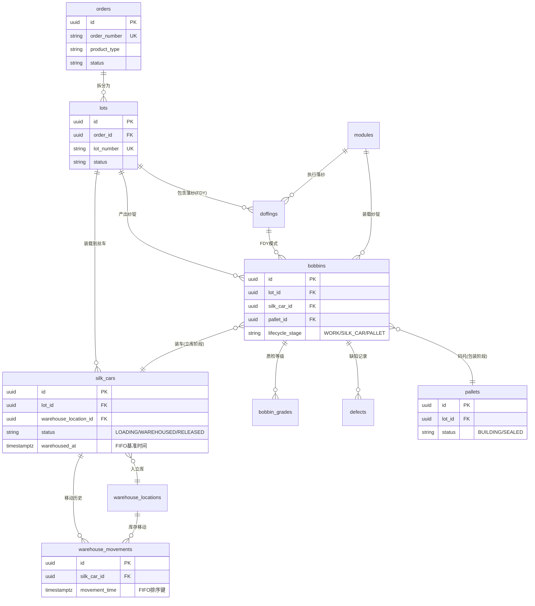

# IGH-MES 数据库详细设计

> **文档编号:** DSD-001
> **版本:** 1.0
> **基于:** system-requirements.md v1.2
> **日期:** 2026-09-18
> **ORM工具:** ent (Facebook/Meta)
> **数据库:** PostgreSQL 14+ (中心端) / SQLite 3.35+ (边端)

---

## 一、设计原则

### 1.1 通用原则

| 原则 | 说明 |
|------|------|
| **UUID主键** | 所有表使用UUID作为主键，便于分布式环境数据合并 |
| **软删除** | 关键业务表支持软删除（deleted_at字段），不物理删除数据 |
| **审计字段** | 标准审计字段：created_at, updated_at, created_by, updated_by |
| **乐观锁** | 高并发表使用version字段实现乐观锁 |
| **外键约束** | PostgreSQL使用外键约束，SQLite使用应用层校验 |
| **索引策略** | 查询频繁的外键、状态字段、时间字段建立索引 |

### 1.2 命名规范

| 类型 | 规范 | 示例 |
|------|------|------|
| 表名 | 小写单词，下划线分隔，复数形式 | `orders`, `work_bobbins` |
| 字段名 | 小写单词，下划线分隔 | `order_number`, `created_at` |
| 索引名 | `idx_表名_字段名` | `idx_orders_status` |
| 外键名 | `fk_表名_引用表名` | `fk_lots_orders` |
| 枚举类型 | 大写，下划线分隔 | `ORDER_STATUS_PENDING` |

### 1.3 字段类型映射

| 业务类型 | PostgreSQL | SQLite | 说明 |
|----------|------------|--------|------|
| UUID | uuid | TEXT | UUID字符串 |
| 时间戳 | timestamptz | TEXT | ISO8601格式 |
| 日期 | date | TEXT | YYYY-MM-DD |
| 枚举 | VARCHAR(50) | TEXT | 应用层枚举 |
| JSON | jsonb | TEXT | JSON数据 |
| 布尔 | boolean | INTEGER | 0/1 |
| 大文本 | text | TEXT | 无长度限制 |

---

## 二、核心实体表设计

### 2.1 订单管理

#### 2.1.1 orders (生产订单)

**表说明：** 生产订单主表，记录客户订单或生产计划。

| 字段名 | 类型 | 约束 | 说明 |
|--------|------|------|------|
| id | uuid | PK | 订单ID |
| order_number | varchar(50) | NOT NULL, UNIQUE | 订单编号（业务唯一标识） |
| product_type | varchar(20) | NOT NULL | 产品类型：FDY/POY/DTY/SPINNING |
| product_code | varchar(50) | NOT NULL | 产品代码 |
| product_name | varchar(200) | NOT NULL | 产品名称 |
| customer_id | uuid | NULL | 客户ID（可选） |
| customer_name | varchar(200) | NULL | 客户名称 |
| target_quantity | decimal(12,2) | NOT NULL | 目标产量（单位：吨） |
| completed_quantity | decimal(12,2) | DEFAULT 0 | 已完成产量 |
| status | varchar(20) | NOT NULL | 状态：PENDING/SCHEDULED/IN_PROGRESS/PAUSED/COMPLETED/CANCELLED |
| priority | integer | DEFAULT 5 | 优先级（1-10，数字越小优先级越高） |
| planned_start_date | date | NULL | 计划开始日期 |
| planned_end_date | date | NULL | 计划结束日期 |
| actual_start_date | timestamptz | NULL | 实际开始时间 |
| actual_end_date | timestamptz | NULL | 实际结束时间 |
| notes | text | NULL | 备注 |
| external_source | varchar(50) | NULL | 外部来源系统（如ERP系统名称） |
| external_id | varchar(100) | NULL | 外部系统ID |
| created_at | timestamptz | NOT NULL | 创建时间 |
| updated_at | timestamptz | NOT NULL | 更新时间 |
| created_by | uuid | NULL | 创建人ID |
| updated_by | uuid | NULL | 更新人ID |
| deleted_at | timestamptz | NULL | 软删除时间 |

**索引：**
```sql
CREATE UNIQUE INDEX idx_orders_order_number ON orders(order_number) WHERE deleted_at IS NULL;
CREATE INDEX idx_orders_status ON orders(status) WHERE deleted_at IS NULL;
CREATE INDEX idx_orders_product_type ON orders(product_type) WHERE deleted_at IS NULL;
CREATE INDEX idx_orders_external_source_id ON orders(external_source, external_id) WHERE deleted_at IS NULL;
CREATE INDEX idx_orders_planned_dates ON orders(planned_start_date, planned_end_date) WHERE deleted_at IS NULL;
```

**约束：**
```sql
ALTER TABLE orders ADD CONSTRAINT chk_orders_quantity CHECK (target_quantity > 0 AND completed_quantity >= 0);
ALTER TABLE orders ADD CONSTRAINT chk_orders_priority CHECK (priority BETWEEN 1 AND 10);
```

---

#### 2.1.2 lots (生产批次)

**表说明：** 订单拆分的生产批次，一个订单可拆分为多个批次。

| 字段名 | 类型 | 约束 | 说明 |
|--------|------|------|------|
| id | uuid | PK | 批次ID |
| order_id | uuid | NOT NULL, FK→orders.id | 所属订单ID |
| lot_number | varchar(50) | NOT NULL, UNIQUE | 批次编号（业务唯一标识） |
| prefix | varchar(20) | NOT NULL | 批次前缀（用于标签打印） |
| sequence | integer | NOT NULL | 批次序号（同一订单内递增） |
| target_weight | decimal(10,2) | NOT NULL | 目标重量（单位：公斤） |
| completed_weight | decimal(10,2) | DEFAULT 0 | 已完成重量 |
| status | varchar(20) | NOT NULL | 状态：PENDING/IN_PROGRESS/COMPLETED/CANCELLED |
| is_locked | boolean | DEFAULT false | 是否锁定（锁定后不可继续生产） |
| end_lot | boolean | DEFAULT false | 是否为订单最后一批 |
| spinning_line_id | uuid | NULL | 纺丝线ID |
| spinning_side_id | uuid | NULL | 纺丝侧ID |
| paper_tube_color1 | varchar(20) | NULL | 纸管颜色1 |
| paper_tube_color2 | varchar(20) | NULL | 纸管颜色2 |
| notes | text | NULL | 备注 |
| external_source | varchar(50) | NULL | 外部来源 |
| external_id | varchar(100) | NULL | 外部ID |
| created_at | timestamptz | NOT NULL | 创建时间 |
| updated_at | timestamptz | NOT NULL | 更新时间 |
| created_by | uuid | NULL | 创建人ID |
| updated_by | uuid | NULL | 更新人ID |
| deleted_at | timestamptz | NULL | 软删除时间 |

**索引：**
```sql
CREATE UNIQUE INDEX idx_lots_lot_number ON lots(lot_number) WHERE deleted_at IS NULL;
CREATE INDEX idx_lots_order_id ON lots(order_id) WHERE deleted_at IS NULL;
CREATE INDEX idx_lots_status ON lots(status) WHERE deleted_at IS NULL;
CREATE INDEX idx_lots_prefix ON lots(prefix) WHERE deleted_at IS NULL;
```

**约束：**
```sql
ALTER TABLE lots ADD CONSTRAINT fk_lots_orders FOREIGN KEY (order_id) REFERENCES orders(id);
ALTER TABLE lots ADD CONSTRAINT chk_lots_weight CHECK (target_weight > 0 AND completed_weight >= 0);
ALTER TABLE lots ADD CONSTRAINT chk_lots_sequence CHECK (sequence > 0);
```

---

### 2.2 模组与纱锭管理

#### 2.2.1 modules (模组)

**表说明：** 24位或96位的纱锭模组，是生产的基本单元。

| 字段名 | 类型 | 约束 | 说明 |
|--------|------|------|------|
| id | uuid | PK | 模组ID |
| module_number | varchar(50) | NOT NULL, UNIQUE | 模组编号 |
| position_count | integer | NOT NULL | 位数：24(FDY) / 96(DTY) |
| zone_type | varchar(20) | NOT NULL | 所属区域：PRODUCTION/SORTING/WAREHOUSE/PACKAGING |
| edge_device_id | uuid | NULL | 所属边端设备ID |
| spinning_line_id | uuid | NULL | 纺丝线ID（FDY专用） |
| spinning_side_id | uuid | NULL | 纺丝侧ID（FDY专用） |
| status | varchar(20) | NOT NULL | 状态：IDLE/WORKING/MAINTENANCE/FAULT |
| last_operation_at | timestamptz | NULL | 最后操作时间 |
| notes | text | NULL | 备注 |
| external_source | varchar(50) | NULL | 外部来源 |
| external_id | varchar(100) | NULL | 外部ID |
| created_at | timestamptz | NOT NULL | 创建时间 |
| updated_at | timestamptz | NOT NULL | 更新时间 |
| deleted_at | timestamptz | NULL | 软删除时间 |

**索引：**
```sql
CREATE UNIQUE INDEX idx_modules_module_number ON modules(module_number) WHERE deleted_at IS NULL;
CREATE INDEX idx_modules_zone_type ON modules(zone_type) WHERE deleted_at IS NULL;
CREATE INDEX idx_modules_edge_device_id ON modules(edge_device_id) WHERE deleted_at IS NULL;
CREATE INDEX idx_modules_status ON modules(status) WHERE deleted_at IS NULL;
```

**约束：**
```sql
ALTER TABLE modules ADD CONSTRAINT chk_modules_position_count CHECK (position_count IN (24, 96));
```

---

#### 2.2.2 doffings (落纱记录)

**表说明：** 落纱操作记录，FDY生产模式使用（DTY直接关联module）。

| 字段名 | 类型 | 约束 | 说明 |
|--------|------|------|------|
| id | uuid | PK | 落纱ID |
| lot_id | uuid | NOT NULL, FK→lots.id | 所属批次ID |
| module_id | uuid | NOT NULL, FK→modules.id | 模组ID |
| doffing_number | varchar(50) | NOT NULL | 落纱编号 |
| sequence | integer | NOT NULL | 落纱序号（同一批次内递增） |
| doffing_time | timestamptz | NOT NULL | 落纱时间 |
| operator_id | uuid | NULL | 操作员ID |
| operator_name | varchar(100) | NULL | 操作员姓名 |
| team | varchar(20) | NULL | 班组 |
| turn | varchar(20) | NULL | 轮次 |
| bobbin_count | integer | NOT NULL | 纱锭数量 |
| total_weight | decimal(10,2) | NULL | 总重量（kg） |
| notes | text | NULL | 备注 |
| external_source | varchar(50) | NULL | 外部来源 |
| external_id | varchar(100) | NULL | 外部ID |
| created_at | timestamptz | NOT NULL | 创建时间 |
| updated_at | timestamptz | NOT NULL | 更新时间 |

**索引：**
```sql
CREATE INDEX idx_doffings_lot_id ON doffings(lot_id);
CREATE INDEX idx_doffings_module_id ON doffings(module_id);
CREATE INDEX idx_doffings_doffing_time ON doffings(doffing_time);
CREATE INDEX idx_doffings_doffing_number ON doffings(doffing_number);
```

**约束：**
```sql
ALTER TABLE doffings ADD CONSTRAINT fk_doffings_lots FOREIGN KEY (lot_id) REFERENCES lots(id);
ALTER TABLE doffings ADD CONSTRAINT fk_doffings_modules FOREIGN KEY (module_id) REFERENCES modules(id);
ALTER TABLE doffings ADD CONSTRAINT chk_doffings_bobbin_count CHECK (bobbin_count > 0);
```

---

#### 2.2.3 bobbins (纱锭)

**表说明：** 纱锭主表，记录每个纱锭的完整生命周期。

| 字段名 | 类型 | 约束 | 说明 |
|--------|------|------|------|
| id | uuid | PK | 纱锭ID |
| bobbin_code | varchar(50) | NOT NULL, UNIQUE | 纱锭编码（唯一标识） |
| lot_id | uuid | NOT NULL, FK→lots.id | 所属批次ID |
| doffing_id | uuid | NULL, FK→doffings.id | 落纱记录ID（FDY模式） |
| module_id | uuid | NOT NULL, FK→modules.id | 模组ID |
| position_in_module | integer | NOT NULL | 模组内位置（1-24或1-96） |
| product_type | varchar(20) | NOT NULL | 产品类型：FDY/POY/DTY |
| weight | decimal(8,2) | NULL | 重量（kg） |
| length | decimal(10,2) | NULL | 长度（米） |
| status | varchar(20) | NOT NULL | 状态：WORKING/SORTED/ON_SILK_CAR/WAREHOUSED/PACKED/SHIPPED |
| lifecycle_stage | varchar(20) | NOT NULL | 生命周期阶段：WORK/SILK_CAR/PALLET/ARCHIVE |
| produced_at | timestamptz | NOT NULL | 生产时间 |
| silk_car_id | uuid | NULL, FK→silk_cars.id | 丝车ID（立库暂存阶段） |
| pallet_id | uuid | NULL, FK→pallets.id | 托盘ID（包装完成阶段） |
| notes | text | NULL | 备注 |
| external_source | varchar(50) | NULL | 外部来源 |
| external_id | varchar(100) | NULL | 外部ID |
| created_at | timestamptz | NOT NULL | 创建时间 |
| updated_at | timestamptz | NOT NULL | 更新时间 |
| deleted_at | timestamptz | NULL | 软删除时间 |

**索引：**
```sql
CREATE UNIQUE INDEX idx_bobbins_bobbin_code ON bobbins(bobbin_code) WHERE deleted_at IS NULL;
CREATE INDEX idx_bobbins_lot_id ON bobbins(lot_id) WHERE deleted_at IS NULL;
CREATE INDEX idx_bobbins_doffing_id ON bobbins(doffing_id) WHERE deleted_at IS NULL;
CREATE INDEX idx_bobbins_module_id ON bobbins(module_id) WHERE deleted_at IS NULL;
CREATE INDEX idx_bobbins_status ON bobbins(status) WHERE deleted_at IS NULL;
CREATE INDEX idx_bobbins_lifecycle_stage ON bobbins(lifecycle_stage) WHERE deleted_at IS NULL;
CREATE INDEX idx_bobbins_pallet_id ON bobbins(pallet_id) WHERE deleted_at IS NULL;
CREATE INDEX idx_bobbins_produced_at ON bobbins(produced_at) WHERE deleted_at IS NULL;
```

**约束：**
```sql
ALTER TABLE bobbins ADD CONSTRAINT fk_bobbins_lots FOREIGN KEY (lot_id) REFERENCES lots(id);
ALTER TABLE bobbins ADD CONSTRAINT fk_bobbins_doffings FOREIGN KEY (doffing_id) REFERENCES doffings(id);
ALTER TABLE bobbins ADD CONSTRAINT fk_bobbins_modules FOREIGN KEY (module_id) REFERENCES modules(id);
ALTER TABLE bobbins ADD CONSTRAINT fk_bobbins_silk_cars FOREIGN KEY (silk_car_id) REFERENCES silk_cars(id);
ALTER TABLE bobbins ADD CONSTRAINT fk_bobbins_pallets FOREIGN KEY (pallet_id) REFERENCES pallets(id);
ALTER TABLE bobbins ADD CONSTRAINT chk_bobbins_position CHECK (position_in_module BETWEEN 1 AND 96);
```

---

### 2.3 丝车与立库管理

#### 2.3.1 silk_cars (丝车)

**表说明：** 丝车（立库存储单位），用于装载待包装的丝饼，在立库区暂存等待质检或凑单。

**业务场景：**
- 纺丝生产完成后，外观质检合格的丝饼装载到丝车上
- 丝车入库到立库区（自动化立体仓库）暂存
- 暂存目的：① 静置等待性能质检；② 凑满同批号包装数量
- 满足出库条件后，丝车出库到包装区，丝饼卸车后码托盘

| 字段名 | 类型 | 约束 | 说明 |
|--------|------|------|------|
| id | uuid | PK | 丝车ID |
| car_code | varchar(50) | NOT NULL, UNIQUE | 丝车编码（物理车号） |
| lot_id | uuid | NOT NULL, FK→lots.id | 批次ID（车上所有丝饼属于同一批次） |
| bobbin_count | integer | DEFAULT 0 | 装载丝饼数量 |
| total_weight | decimal(10,2) | DEFAULT 0 | 总重量（kg） |
| capacity | integer | DEFAULT 24 | 容量（最多装载数量，默认24） |
| status | varchar(20) | NOT NULL | 状态：LOADING/READY/WAREHOUSED/OUT_FOR_INSPECTION/RELEASED |
| warehouse_location_id | uuid | NULL, FK→warehouse_locations.id | 当前库位ID（在库时） |
| warehoused_at | timestamptz | NULL | 入库时间（用于FIFO和库龄计算） |
| released_at | timestamptz | NULL | 出库时间 |
| edge_device_id | uuid | NULL | 所属边端设备ID（立库区边端） |
| notes | text | NULL | 备注 |
| external_source | varchar(50) | NULL | 外部来源 |
| external_id | varchar(100) | NULL | 外部ID |
| created_at | timestamptz | NOT NULL | 创建时间 |
| updated_at | timestamptz | NOT NULL | 更新时间 |
| deleted_at | timestamptz | NULL | 软删除时间 |

**索引：**
```sql
CREATE UNIQUE INDEX idx_silk_cars_car_code ON silk_cars(car_code) WHERE deleted_at IS NULL;
CREATE INDEX idx_silk_cars_lot_id ON silk_cars(lot_id) WHERE deleted_at IS NULL;
CREATE INDEX idx_silk_cars_status ON silk_cars(status) WHERE deleted_at IS NULL;
CREATE INDEX idx_silk_cars_warehouse_location_id ON silk_cars(warehouse_location_id) WHERE deleted_at IS NULL;
CREATE INDEX idx_silk_cars_warehoused_at ON silk_cars(warehoused_at) WHERE deleted_at IS NULL;

-- FIFO查询专用索引（基于movement_time，主人决策2选择的方案B）
-- 通过warehouse_movements表的movement_time实现FIFO，此处索引配合
CREATE INDEX idx_silk_cars_fifo ON silk_cars(lot_id, warehouse_location_id, warehoused_at) 
  WHERE status = 'WAREHOUSED' AND deleted_at IS NULL;
```

**约束：**
```sql
ALTER TABLE silk_cars ADD CONSTRAINT fk_silk_cars_lots FOREIGN KEY (lot_id) REFERENCES lots(id);
ALTER TABLE silk_cars ADD CONSTRAINT fk_silk_cars_warehouse_locations FOREIGN KEY (warehouse_location_id) REFERENCES warehouse_locations(id);
ALTER TABLE silk_cars ADD CONSTRAINT chk_silk_cars_bobbin_count CHECK (bobbin_count >= 0 AND bobbin_count <= capacity);
ALTER TABLE silk_cars ADD CONSTRAINT chk_silk_cars_capacity CHECK (capacity > 0);
```

**状态说明：**
- `LOADING` - 装车中（丝饼陆续装载到车上）
- `READY` - 就绪（装载完成，等待入库）
- `WAREHOUSED` - 在库（已入立库暂存）
- `OUT_FOR_INSPECTION` - 出库检测（临时出库做性能质检，检测完会回库）
- `RELEASED` - 已释放（出库到包装区，丝饼卸车完成）

---

### 2.4 质检与等级管理

#### 2.4.1 bobbin_grades (纱锭等级)

**表说明：** 纱锭质检等级记录，支持5维等级体系。

| 字段名 | 类型 | 约束 | 说明 |
|--------|------|------|------|
| id | uuid | PK | 等级记录ID |
| bobbin_id | uuid | NOT NULL, FK→bobbins.id | 纱锭ID |
| grade_type | varchar(20) | NOT NULL | 等级类型：SORTING/WEIGHT/VISION/KNITTING/FINAL |
| grade_value | varchar(20) | NOT NULL | 等级值：AA/A/B/C/D 或自定义 |
| grade_score | integer | NULL | 等级分数（用于排序和统计） |
| graded_at | timestamptz | NOT NULL | 评级时间 |
| graded_by | uuid | NULL | 评级人ID |
| graded_by_name | varchar(100) | NULL | 评级人姓名 |
| edge_device_id | uuid | NULL | 评级设备ID |
| notes | text | NULL | 备注 |
| created_at | timestamptz | NOT NULL | 创建时间 |
| updated_at | timestamptz | NOT NULL | 更新时间 |

**索引：**
```sql
CREATE INDEX idx_bobbin_grades_bobbin_id ON bobbin_grades(bobbin_id);
CREATE INDEX idx_bobbin_grades_grade_type ON bobbin_grades(grade_type);
CREATE INDEX idx_bobbin_grades_grade_value ON bobbin_grades(grade_value);
CREATE INDEX idx_bobbin_grades_graded_at ON bobbin_grades(graded_at);
```

**约束：**
```sql
ALTER TABLE bobbin_grades ADD CONSTRAINT fk_bobbin_grades_bobbins FOREIGN KEY (bobbin_id) REFERENCES bobbins(id);
ALTER TABLE bobbin_grades ADD CONSTRAINT uq_bobbin_grades_bobbin_type UNIQUE (bobbin_id, grade_type);
```

---

#### 2.4.2 defects (缺陷记录)

**表说明：** 纱锭缺陷详细记录。

| 字段名 | 类型 | 约束 | 说明 |
|--------|------|------|------|
| id | uuid | PK | 缺陷ID |
| bobbin_id | uuid | NOT NULL, FK→bobbins.id | 纱锭ID |
| defect_code | varchar(20) | NOT NULL | 缺陷代码 |
| defect_name | varchar(100) | NOT NULL | 缺陷名称 |
| severity | varchar(20) | NOT NULL | 严重程度：CRITICAL/MAJOR/MINOR |
| detected_at | timestamptz | NOT NULL | 检测时间 |
| detected_by | uuid | NULL | 检测人ID |
| detection_method | varchar(50) | NULL | 检测方法：VISUAL/WEIGHT/KNITTING/MANUAL |
| edge_device_id | uuid | NULL | 检测设备ID |
| notes | text | NULL | 备注 |
| created_at | timestamptz | NOT NULL | 创建时间 |
| updated_at | timestamptz | NOT NULL | 更新时间 |

**索引：**
```sql
CREATE INDEX idx_defects_bobbin_id ON defects(bobbin_id);
CREATE INDEX idx_defects_defect_code ON defects(defect_code);
CREATE INDEX idx_defects_severity ON defects(severity);
CREATE INDEX idx_defects_detected_at ON defects(detected_at);
```

**约束：**
```sql
ALTER TABLE defects ADD CONSTRAINT fk_defects_bobbins FOREIGN KEY (bobbin_id) REFERENCES bobbins(id);
```

---

### 2.5 托盘与包装管理

#### 2.5.1 pallets (托盘)

**表说明：** 托盘主表，用于包装区码垛管理。包装完成后的成品托盘（整托）不在当前系统管理范围。

**业务场景：**
- 丝车从立库出库到包装区
- 丝饼从丝车卸下，按批次码放到托盘上
- 托盘码满后进行打包、贴标、封装
- **注意：包装完成后的成品托盘出库、成品立库存储不在当前系统范围，为后续扩展预留**

| 字段名 | 类型 | 约束 | 说明 |
|--------|------|------|------|
| id | uuid | PK | 托盘ID |
| pallet_code | varchar(50) | NOT NULL, UNIQUE | 托盘编码 |
| pallet_type | varchar(20) | NOT NULL | 托盘类型：FDY/DTY |
| lot_id | uuid | NULL, FK→lots.id | 批次ID |
| bobbin_count | integer | DEFAULT 0 | 纱锭数量 |
| total_weight | decimal(10,2) | DEFAULT 0 | 总重量（kg） |
| status | varchar(20) | NOT NULL | 状态：BUILDING/COMPLETED/LABELING/SEALED |
| created_at_location | varchar(50) | NULL | 创建位置（包装区） |
| completed_at | timestamptz | NULL | 码垛完成时间 |
| sealed_at | timestamptz | NULL | 封装完成时间 |
| notes | text | NULL | 备注 |
| external_source | varchar(50) | NULL | 外部来源 |
| external_id | varchar(100) | NULL | 外部ID |
| created_at | timestamptz | NOT NULL | 创建时间 |
| updated_at | timestamptz | NOT NULL | 更新时间 |
| deleted_at | timestamptz | NULL | 软删除时间 |

**索引：**
```sql
CREATE UNIQUE INDEX idx_pallets_pallet_code ON pallets(pallet_code) WHERE deleted_at IS NULL;
CREATE INDEX idx_pallets_lot_id ON pallets(lot_id) WHERE deleted_at IS NULL;
CREATE INDEX idx_pallets_status ON pallets(status) WHERE deleted_at IS NULL;
CREATE INDEX idx_pallets_completed_at ON pallets(completed_at) WHERE deleted_at IS NULL;
```

**约束：**
```sql
ALTER TABLE pallets ADD CONSTRAINT fk_pallets_lots FOREIGN KEY (lot_id) REFERENCES lots(id);
ALTER TABLE pallets ADD CONSTRAINT chk_pallets_bobbin_count CHECK (bobbin_count >= 0);
```

**状态说明：**
- `BUILDING` - 码垛中（丝饼陆续码放到托盘）
- `COMPLETED` - 码垛完成（待打包）
- `LABELING` - 贴标中（打印并粘贴标签）
- `SEALED` - 封装完成（打包封装完毕，此后不在系统管理范围）

---

#### 2.5.2 warehouse_locations (仓库位置 - 立库区专用)

**表说明：** 立库区的库位信息，用于存放丝车。**注意：此表仅用于中间库（丝车立库），不用于成品库。**

| 字段名 | 类型 | 约束 | 说明 |
|--------|------|------|------|
| id | uuid | PK | 位置ID |
| location_code | varchar(50) | NOT NULL, UNIQUE | 位置编码 |
| warehouse_zone | varchar(20) | NOT NULL | 仓库区域：WAREHOUSE_ZONE_A/B/C |
| aisle | varchar(10) | NULL | 巷道号 |
| row_number | integer | NULL | 排号 |
| column_number | integer | NULL | 列号 |
| level | integer | NULL | 层号 |
| location_type | varchar(20) | NOT NULL | 位置类型：RACK/FLOOR/STAGING |
| capacity | integer | DEFAULT 1 | 容量（可存放丝车数） |
| occupied_count | integer | DEFAULT 0 | 已占用数量 |
| status | varchar(20) | NOT NULL | 状态：AVAILABLE/OCCUPIED/LOCKED/MAINTENANCE |
| is_locked | boolean | DEFAULT false | 是否锁定 |
| locked_reason | varchar(200) | NULL | 锁定原因 |
| edge_device_id | uuid | NULL | 所属边端设备ID |
| notes | text | NULL | 备注 |
| created_at | timestamptz | NOT NULL | 创建时间 |
| updated_at | timestamptz | NOT NULL | 更新时间 |
| deleted_at | timestamptz | NULL | 软删除时间 |

**索引：**
```sql
CREATE UNIQUE INDEX idx_warehouse_locations_code ON warehouse_locations(location_code) WHERE deleted_at IS NULL;
CREATE INDEX idx_warehouse_locations_zone ON warehouse_locations(warehouse_zone) WHERE deleted_at IS NULL;
CREATE INDEX idx_warehouse_locations_status ON warehouse_locations(status) WHERE deleted_at IS NULL;
CREATE INDEX idx_warehouse_locations_edge_device_id ON warehouse_locations(edge_device_id) WHERE deleted_at IS NULL;
CREATE INDEX idx_warehouse_locations_position ON warehouse_locations(aisle, row_number, column_number, level) WHERE deleted_at IS NULL;
```

**约束：**
```sql
ALTER TABLE warehouse_locations ADD CONSTRAINT chk_warehouse_locations_capacity CHECK (capacity > 0);
ALTER TABLE warehouse_locations ADD CONSTRAINT chk_warehouse_locations_occupied CHECK (occupied_count >= 0 AND occupied_count <= capacity);
```

---

#### 2.5.3 warehouse_movements (库存移动记录 - 立库区丝车移动)

**表说明：** 立库区丝车的出入库移动记录。用于追踪丝车的入库、出库、移库操作，支持基于movement_time的FIFO查询。

| 字段名 | 类型 | 约束 | 说明 |
|--------|------|------|------|
| id | uuid | PK | 移动记录ID |
| movement_type | varchar(20) | NOT NULL | 移动类型：IN/OUT/TRANSFER/ADJUST |
| silk_car_id | uuid | NOT NULL, FK→silk_cars.id | 丝车ID |
| from_location_id | uuid | NULL, FK→warehouse_locations.id | 源位置ID |
| to_location_id | uuid | NULL, FK→warehouse_locations.id | 目标位置ID |
| movement_time | timestamptz | NOT NULL | 移动时间（用于FIFO排序） |
| operator_id | uuid | NULL | 操作员ID |
| operator_name | varchar(100) | NULL | 操作员姓名 |
| edge_device_id | uuid | NULL | 操作设备ID |
| notes | text | NULL | 备注 |
| created_at | timestamptz | NOT NULL | 创建时间 |
| updated_at | timestamptz | NOT NULL | 更新时间 |

**索引：**
```sql
CREATE INDEX idx_warehouse_movements_silk_car_id ON warehouse_movements(silk_car_id);
CREATE INDEX idx_warehouse_movements_from_location_id ON warehouse_movements(from_location_id);
CREATE INDEX idx_warehouse_movements_to_location_id ON warehouse_movements(to_location_id);
CREATE INDEX idx_warehouse_movements_movement_time ON warehouse_movements(movement_time);
CREATE INDEX idx_warehouse_movements_movement_type ON warehouse_movements(movement_type);

-- FIFO查询优化索引（主人决策2：基于movement_time实现FIFO）
CREATE INDEX idx_warehouse_movements_fifo 
  ON warehouse_movements(to_location_id, movement_time, id) 
  WHERE movement_type = 'IN';
```

**约束：**
```sql
ALTER TABLE warehouse_movements ADD CONSTRAINT fk_warehouse_movements_silk_cars FOREIGN KEY (silk_car_id) REFERENCES silk_cars(id);
ALTER TABLE warehouse_movements ADD CONSTRAINT fk_warehouse_movements_from_location FOREIGN KEY (from_location_id) REFERENCES warehouse_locations(id);
ALTER TABLE warehouse_movements ADD CONSTRAINT fk_warehouse_movements_to_location FOREIGN KEY (to_location_id) REFERENCES warehouse_locations(id);
```

**FIFO查询示例：**
```sql
-- 查询某批次最早入库的丝车（用于出库）
SELECT sc.* 
FROM silk_cars sc
JOIN warehouse_movements wm ON wm.silk_car_id = sc.id
WHERE sc.lot_id = ?
  AND sc.status = 'WAREHOUSED'
  AND wm.movement_type = 'IN'
  AND wm.to_location_id = sc.warehouse_location_id
ORDER BY wm.movement_time ASC, wm.id ASC  -- movement_time主排序，id打散相同时间
LIMIT 1;
```

---

## 三、数据模型关系图



**关键业务流程：**

1. **生产阶段（WORK）：** 订单 → 批次 → 落纱 → 纱锭产出
2. **立库阶段（SILK_CAR）：** 纱锭装车 → 丝车入库 → 静置/凑单 → FIFO出库
3. **包装阶段（PALLET）：** 丝车出库 → 纱锭卸车 → 码托盘 → 打包封装

---

## 四、下一步设计内容

本文档当前完成了**核心实体表设计**（订单/批次/模组/纱锭/丝车/托盘/立库仓储），接下来需要补充：

1. **边端设备管理表**（设备清单/连接状态/版本信息）
2. **OTA更新相关表**（版本包/更新历史/状态追踪）
3. **审计日志表**（操作日志/配置变更/告警记录）
4. **用户与权限表**（用户/角色/权限/会话）
5. **系统配置表**（参数配置/字典数据）
6. **统计与报表相关表**（周期统计/OEE数据）

---

## 五、设计决策记录

本次设计基于主人审阅后的决策：

| 决策项 | 选择方案 | 理由 |
|--------|----------|------|
| **级联删除策略** | 方案A：软删除 + RESTRICT约束 | 应用层级联，数据可追溯可恢复 |
| **立库FIFO实现** | 方案B：基于movement_time查询 | 丝车入库频率低，时间戳冲突概率小；需要追溯真实库龄 |
| **历史数据归档** | 方案B：V1.0不分区，运行半年后评估 | 避免过度设计，后期根据实际数据量决策 |
| **JSONB扩展字段** | 方案A：适度使用（每表1-2个） | 平衡灵活性和结构化，预留扩展空间 |

**重要澄清：**
- 立库区存储的是**丝车**（装载待包装丝饼），不是成品托盘
- 丝车用于静置缓冲和批次凑单，满足条件后出库到包装区
- 包装完成后的成品托盘及其立库管理**不在当前系统范围**，为后续扩展预留

---

> **文档状态：** 核心实体表设计完成（含丝车立库），待补充设备管理、OTA、审计等表结构 ✅
> **版本：** 1.1 (2026-09-18 - 补充丝车表，明确立库业务逻辑)
