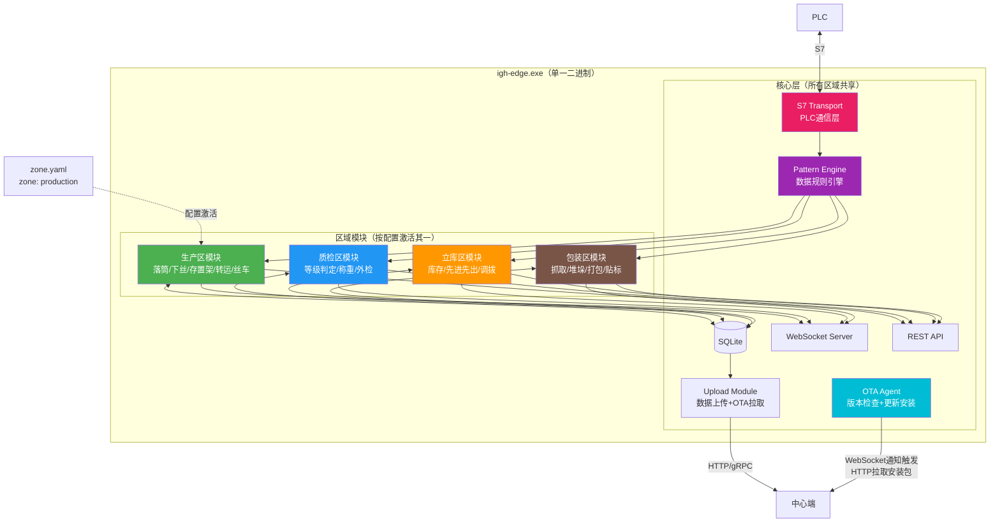
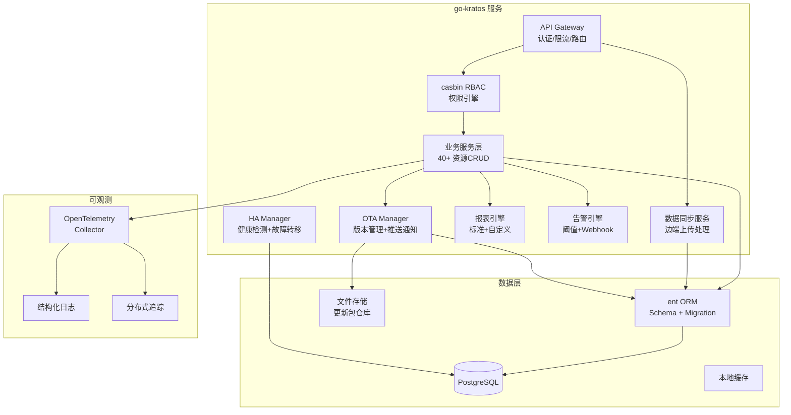
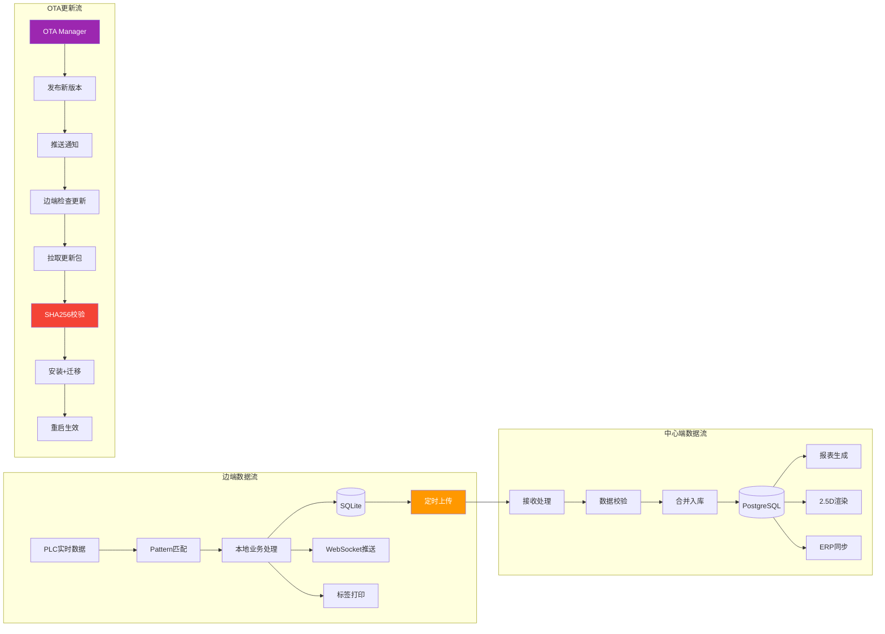
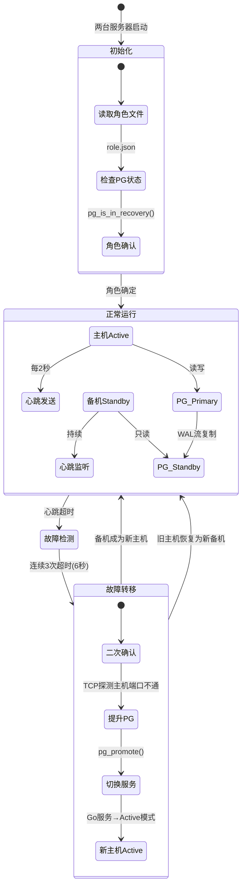
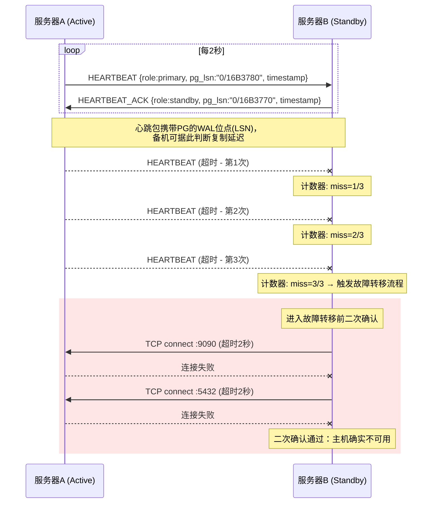
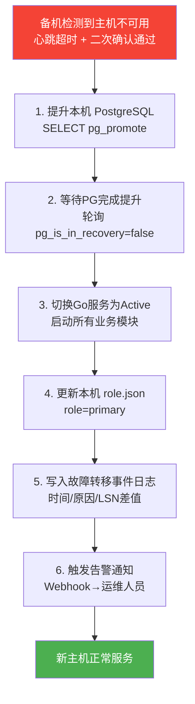
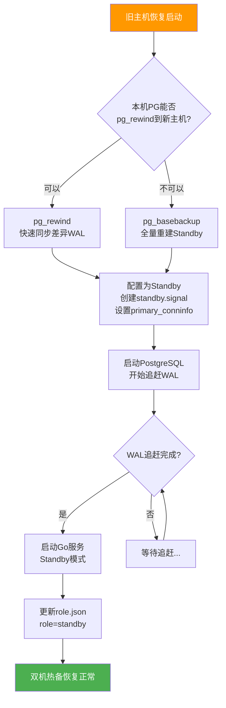
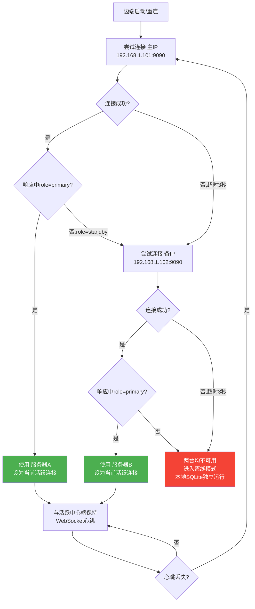
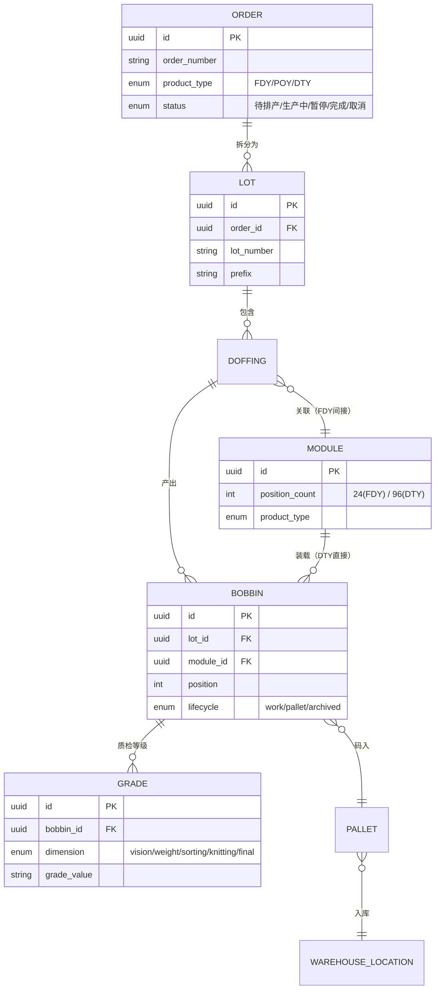

# IGH-MES 系统需求规格说明书

> **文档编号:** SRS-001
> **版本:** 1.2
> **基于:** 21份源码分析报告 (33,541行 / 347张Mermaid图) + 28项架构决策 + 审阅决策确认
> **分析范围:** V1 (VB.NET) → V2 (Node.js) → V3PLUS (.NET) → V3 (Java) → V4 (Python) → V5 (Go) → igh-silkroad (Go)
> **日期:** 2026-09-18
> **变更记录:** v1.1 (172条需求, 26项ADR) → v1.2 (238条需求, 28项ADR, +66条需求, 增长38%)

---

## 一、架构决策记录 (ADR)

以下26项决策由需求研讨确认，构成本系统的架构约束。

### ADR-01: 系统范围

| 项目 | 决策 |
|------|------|
| **决策** | MES全链路覆盖：订单→落纱→检测→分拣→打包→仓储→ERP同步 |
| **理由** | 7个版本分析表明核心业务链路稳定，新系统需完整覆盖 |

### ADR-02: 混合生产模式

| 项目 | 决策 |
|------|------|
| **决策** | 可配置但不混合——同一产线同一时间只跑一种产品（FDY/POY/DTY），通过配置切换 |
| **理由** | V2的FDY/DTY代码完全复制（6+代码库）证明混合产线复杂度不可控；配置化隔离兼顾灵活性 |
| **约束** | 产品线配置引擎需支持：模组位数(24/96)、等级体系、追踪路径、工艺流程的差异化 |

### ADR-03: 部署架构

| 项目 | 决策 |
|------|------|
| **决策** | 边端：Windows原生部署（Go exe + Windows Service）；中心端：Windows Server优先，预留Linux/Docker能力 |
| **理由** | 客户环境90%以上是Windows Server或Windows 11，无Linux服务器；部分客户有信息安全和虚拟化要求 |
| **约束** | 中心端设计为可移植架构，后期可配置Linux版本适配虚拟化客户 |

### ADR-04: 交付策略

| 项目 | 决策 |
|------|------|
| **决策** | 边端优先，但边端与中心端同步交付（一次性项目交付） |
| **理由** | 项目为一次性交付模式，边端和中心端需同步搭建 |
| **约束** | 边端需具备离线独立运行能力，中心端掉线不影响产线生产 |

### ADR-05: 后端技术栈

| 项目 | 决策 |
|------|------|
| **决策** | Go全栈（边端+中心端），企业级框架加持 |
| **框架** | go-kratos (微服务框架) + ent/sqlc (ORM) + casbin (RBAC) + OpenTelemetry (可观测) |
| **理由** | igh-silkroad已验证Go边端可行性；中心端ORM/框架生态通过go-kratos+ent补齐 |
| **约束** | 中心端必须支持大数据量吞吐；前端能力需超过V3PLUS |

### ADR-06: 产品范围

| 项目 | 决策 |
|------|------|
| **决策** | 核心三件套（边端采集+中心管理+可视化大屏），不含独立移动端 |
| **理由** | 工厂环境以工控机/触摸屏为主，移动端非刚需 |

### ADR-07: 边端存储

| 项目 | 决策 |
|------|------|
| **决策** | SQLite + 可配置保留策略 + 自动清理 |
| **Schema迁移** | golang-migrate（独立迁移工具，SQL文件管理），OTA更新时自动执行迁移脚本 |
| **用途** | 保证离线生产流转、边端打印、数据采集上传、短期数据查询 |
| **约束** | 不同类型记录可设不同有效期；数据不能无限增长（V2经验）；长周期历史查询走中心端 |
| **清理** | 自动按时间窗口替换旧数据，类似V2的滚动存储 |

### ADR-08: 前端方向

| 项目 | 决策 |
|------|------|
| **决策** | Vue3 + 自建工业UI组件库，工业级操控感 |
| **理由** | 需要超越V3PLUS的前端体验，接近数字孪生能力 |
| **约束** | 不使用通用UI框架（Element Plus/Ant Design），而是针对工业场景定制 |

### ADR-09: 数据库

| 项目 | 决策 |
|------|------|
| **决策** | 中心端 PostgreSQL + 边端 SQLite |
| **理由** | PostgreSQL企业级可靠性 + 原生流复制HA；SQLite零配置适合边端 |

### ADR-10: 2.5D可视化层级

| 项目 | 决策 |
|------|------|
| **决策** | 三级下钻：车间总览 → 产线详情 → 设备实时 |
| **L1** | 车间等轴测全景：产线布局+整体产能热力图 |
| **L2** | 单产线横截面：模组状态矩阵+物流动线 |
| **L3** | 设备级：单锭位状态+PLC实时参数 |

### ADR-11: 2.5D渲染引擎

| 项目 | 决策 |
|------|------|
| **决策** | PixiJS |
| **理由** | 2D精灵方案性能好、学习曲线低；等轴测投影适合工业可视化而不需要Three.js全3D |

### ADR-12: 边端前端定位

| 项目 | 决策 |
|------|------|
| **决策** | 操作控制台 + 状态看板（双功能） |
| **功能** | 触摸屏友好的大按钮操控 + 产线实时状态仪表盘 |
| **理由** | 边端既需要一线操作员操控（落纱/打包），也需要管理人员巡检查看状态 |

### ADR-13: 实时推送

| 项目 | 决策 |
|------|------|
| **决策** | WebSocket |
| **理由** | 工业场景需要双向通信（状态推送+指令下发）；V2已验证WebSocket binlog推送模式 |

### ADR-14: 权限模型

| 项目 | 决策 |
|------|------|
| **决策** | 双层权限：边端简化（固定角色+IP绑定）+ 中心端完整RBAC（casbin） |
| **边端** | 固定角色（操作员/班长/维护），仅允许对应IP登录 |
| **中心端** | casbin RBAC：角色-权限-资源 完整模型 |
| **预留** | 中心端预留LDAP/AD集成接口，当前不实现 |

### ADR-15: ERP集成

| 项目 | 决策 |
|------|------|
| **决策** | 中间表模式（本系统设计），同时保留单向上报能力 |
| **方式** | 本系统写中间表，ERP定期拉取；支持按需单向主动推送 |
| **理由** | 中间表解耦度最高，适应不同ERP厂商；V2的erpBobbins/erpPallets验证了单向推送可行 |

### ADR-16: 告警通知

| 项目 | 决策 |
|------|------|
| **决策** | 内置阈值告警 + 预留Webhook外发 |
| **内置** | PLC参数超限、设备离线、产量异常等内置告警规则 |
| **预留** | Webhook出口用于对接企业微信/钉钉/邮件等外部系统 |

### ADR-17: 报表

| 项目 | 决策 |
|------|------|
| **决策** | 内置报表 + 可配置 + BI导出（三合一） |
| **内置** | 产量日报、质量分析、设备OEE等标准报表 |
| **配置** | 用户可自定义报表维度、时间范围、筛选条件 |
| **导出** | 标准数据视图供外部BI工具（Power BI/帆软）查询 |

### ADR-18: 日志

| 项目 | 决策 |
|------|------|
| **决策** | 集中式日志 + 操作审计 |
| **技术** | 边端本地日志 → 中心端集中存储 → 结构化查询 |
| **审计** | 关键操作（落纱/打包/质检/配置变更）全程留痕，支持追溯 |
| **可观测** | OpenTelemetry traces + metrics + logs 统一采集 |

### ADR-19: 高可用

| 项目 | 决策 |
|------|------|
| **决策** | IGH-SilkGuard（丝盾热备系统）独立服务 + 双服务器热备（可选部署） |
| **架构** | IGH-SilkGuard 是独立Go服务，与 igh-center（MES业务）完全解耦 |
| **单机模式** | 不安装 IGH-SilkGuard，igh-center 默认 Active，无需额外配置 |
| **双机模式** | 两台服务器各运行 IGH-SilkGuard + igh-center + PostgreSQL |
| **数据库** | PostgreSQL Streaming Replication，主→备实时流复制 |
| **故障转移** | IGH-SilkGuard 检测对端不可用 → pg_promote本机PG → 通知本机 igh-center 切Active |
| **边端切换** | 边端配置双地址（主IP+备IP），主连不上自动切备，无需VIP |
| **理由** | HA逻辑与业务解耦：不需要HA的项目零成本，需要HA的项目即插即用 |

### ADR-20: 边端区域架构

| 项目 | 决策 |
|------|------|
| **决策** | 单一二进制 + 配置激活区域模块 |
| **区域划分** | 生产区（纺丝→落筒/下丝→存置架→转运→丝车装载）、质检区（等级判定/称重/外检）、立库区（库存状态/先进先出/调拨）、包装区（抓取/流转/堆垛/打包/贴标/封装） |
| **部署粒度** | 每个功能区一套边端，功能区内可有多个相似功能的边端设备 |
| **实现** | 编译出一个 `igh-edge.exe`，启动时通过配置文件 `zone.yaml` 的 `zone: production` 字段决定加载哪个区域模块 |
| **理由** | Go二进制体积可控，多区域代码增量可忽略；运维只管一个程序；OTA只推一种包；按功能区部署保证各区独立运行 |
| **约束** | 各区域模块必须松耦合，可独立注册/卸载；未激活区域的代码不执行、不占用资源 |

### ADR-21: 仓库结构

| 项目 | 决策 |
|------|------|
| **决策** | 全量Monorepo |
| **结构** | 一个Git仓库包含：Go三入口（cmd/igh-center、cmd/igh-edge、cmd/igh-silkguard）+ Vue3两前端（web/center、web/edge）+ 共享代码（internal/shared）+ API定义（api/）+ 部署配置（deploy/）+ 文档（docs/） |
| **理由** | 单一二进制需要Go+Vue3构建时合并（go:embed）；center/edge共享大量领域类型；SilkGuard引用center接口定义；OTA构建流水线统一；当前团队规模无需多仓库隔离 |

### ADR-22: OTA更新粒度

| 项目 | 决策 |
|------|------|
| **决策** | 整包替换 |
| **内容** | 每次OTA推送完整的 igh-edge.exe + 嵌入的前端资源 + 配置模板 |
| **理由** | 工厂内网带宽充裕，30-80MB完整包几秒传完；整包逻辑简单、回滚容易（保留上一版本即可）；差量更新复杂度收益比低 |

### ADR-23: OTA触发方式

| 项目 | 决策 |
|------|------|
| **决策** | Center WebSocket通知 + Edge主动拉取安装 |
| **流程** | 管理员在center后台上传新版本 → center通过WebSocket通知目标边端"有新版本" → edge收到通知后主动从center下载安装包 |
| **理由** | 管理员掌控更新时机；edge主动拉取避免center管理大量并发上传；利用已有WebSocket通道（ADR-13）；边端离线重连后自动检查补上错过的更新 |

### ADR-24: OTA更新策略

| 项目 | 决策 |
|------|------|
| **决策** | 默认操作员确认 + 管理员可强制优雅停机 |
| **默认流程** | Edge下载好新版本后提示"新版本已就绪"，现场操作员在界面确认"立即更新" → 完成当前操作周期 → 优雅停机 → 看门狗拉起新版本 |
| **强制流程** | 管理员在center后台发起"强制更新" → edge进入排空状态（完成当前操作，不接受新操作）→ 优雅停机 → 自动更新 |
| **理由** | 尊重生产现场操作节奏，避免高峰期中断；保留中心管控能力用于紧急修复；更新前完成当前操作周期保证不丢数据 |

### ADR-25: Go项目结构

| 项目 | 决策 |
|------|------|
| **决策** | 按服务+领域两层组织 |
| **第一层** | 按可部署服务划分：internal/center/、internal/edge/、internal/silkguard/、internal/shared/ |
| **第二层** | 按业务领域划分：如 internal/edge/zone/production/、internal/center/order/、internal/shared/domain/ |
| **理由** | 第一层标识代码归属哪个可部署单元；第二层按领域组织方便业务开发；shared放center和edge共用的领域类型 |

### ADR-26: 前端应用结构

| 项目 | 决策 |
|------|------|
| **Edge前端** | 单一Vue3应用 + 路由懒加载 |
| **Edge实现** | 一个 web/edge/ Vue3项目，按区域拆分路由模块（views/production/、views/sorting/、views/warehouse/、views/packaging/），启动时根据后端配置只加载对应区域的路由和组件 |
| **Center前端** | 单一Vue3应用（管理后台+2.5D可视化统一入口），通过IP访问 |
| **Center实现** | 一个 web/center/ Vue3项目，管理后台和2.5D可视化通过路由切换，共享登录/权限/WebSocket |
| **理由** | 与后端ADR-20保持一致的设计哲学；各区域/模块共享基础设施零成本复用；Vue3动态路由+defineAsyncComponent天然支持懒加载；编译产物一份go:embed嵌入 |

### ADR-27: 边端设备认证

| 项目 | 决策 |
|------|------|
| **决策** | IP白名单 + 预配置设备清单 |
| **实现** | 管理员在中心端提前录入边端设备清单（设备ID+IP地址+区域类型），边端连接时自动匹配，未预配置的IP拒绝连接 |
| **注销** | 管理员在center后台手动标记设备"已停用"，该设备后续连接被拒绝 |
| **理由** | 工厂内网环境IP相对固定；简单可靠；安全性高（未知设备无法接入）；管理员掌控设备准入 |

### ADR-28: PLC断线处理策略

| 项目 | 决策 |
|------|------|
| **决策** | 只读模式 + 降级运行 |
| **只读模式** | PLC断线后，边端界面显示当前状态，所有实时操作按钮禁用（落纱/打包/称重等） |
| **降级运行** | 查询历史数据、查看库位状态等非实时操作仍可用 |
| **不缓冲指令** | 不接受操作指令暂存，避免重连后PLC状态已变化导致的不一致 |
| **理由** | 保证操作员能看到断线前的状态；允许查询和非实时操作；避免盲目下发指令导致安全问题 |

---

## 二、技术栈规格

### 2.1 后端

| 层级 | 技术 | 版本 | 用途 |
|------|------|------|------|
| 语言 | Go | 1.22+ | 边端+中心端统一 |
| 框架 | go-kratos | v2 | HTTP/gRPC 微服务框架 |
| ORM | ent + sqlc | 最新稳定 | 中心端ent（代码生成），边端sqlc（轻量SQL映射） |
| 权限 | casbin | v2 | RBAC 策略引擎 |
| 可观测 | OpenTelemetry | 最新稳定 | traces + metrics + logs |
| PLC通信 | gos7 | — | S7 协议直连（替代V2的nodes7） |
| 配置 | Viper | — | YAML/环境变量/远程配置 |
| 验证 | go-playground/validator | v10 | 输入校验 |
| 日志 | zerolog / zap | — | 结构化日志 |

### 2.2 前端

| 层级 | 技术 | 版本 | 用途 |
|------|------|------|------|
| 框架 | Vue 3 | 3.4+ | SPA 框架 |
| 构建 | Vite | 5+ | 构建工具 |
| 状态 | Pinia | 2+ | 状态管理 |
| UI | 自建工业UI组件库 | — | 工业场景专用组件 |
| 可视化 | PixiJS | 7+ | 2.5D等轴测渲染 |
| 通信 | WebSocket | — | 实时双向通信 |
| 图表 | ECharts | 5+ | 数据图表 |
| 类型 | TypeScript | 5+ | 类型安全 |

### 2.3 数据库

| 环境 | 数据库 | 用途 |
|------|--------|------|
| 中心端 | PostgreSQL 16+ | 主数据存储 |
| 中心端备 | PostgreSQL 16+ (Standby) | 流复制热备 |
| 边端 | SQLite 3 | 本地数据缓存 |

### 2.4 部署

| 环境 | 服务 | 方式 | 说明 |
|------|------|------|------|
| 边端 | igh-edge | Go exe + Windows Service | 工控机/触摸屏一体机 |
| 中心端(单机) | igh-center + PostgreSQL | Windows Service | 不需要HA的项目 |
| 中心端(双机HA) | igh-center + IGH-SilkGuard + PostgreSQL ×2台 | Windows Service | 需要HA的项目，IGH-SilkGuard可选部署 |
| 中心端(预留) | 同上 | Docker + Linux | 虚拟化客户适配 |

---

## 三、系统架构

### 3.1 整体拓扑

```mermaid
graph TB
    subgraph "车间层"
        subgraph "生产区"
            PLC_PROD[PLC]
            TS_PROD[触摸屏]
            PRINTER_PROD[打印机]
        end
        
        subgraph "质检区"
            PLC_SORT[PLC]
            TS_SORT[触摸屏]
            SENSOR_SORT[传感器/秤]
        end
        
        subgraph "立库区"
            PLC_WH[PLC/堆垛机]
            TS_WH[触摸屏]
        end
        
        subgraph "包装区"
            PLC_PACK[PLC]
            TS_PACK[触摸屏]
            PRINTER_PACK[打印机]
        end
    end

    subgraph "边端层 (每个功能区一套)"
        subgraph "生产区边端"
            EDGE_PROD[igh-edge.exe<br/>zone: production]
        end
        
        subgraph "质检区边端"
            EDGE_SORT[igh-edge.exe<br/>zone: sorting]
        end
        
        subgraph "立库区边端"
            EDGE_WH[igh-edge.exe<br/>zone: warehouse]
        end
        
        subgraph "包装区边端"
            EDGE_PACK[igh-edge.exe<br/>zone: packaging]
        end
    end

    subgraph "中心端 服务器A (主)"
        HA_A[IGH-SilkGuard<br/>HA管理 可选]
        CENTER_A[igh-center<br/>MES业务 Active]
        PG_A[(PostgreSQL<br/>Primary)]
        FE_A[Vue3前端<br/>管理+2.5D]
    end

    subgraph "中心端 服务器B (备·可选)"
        HA_B[IGH-SilkGuard<br/>HA管理]
        CENTER_B[igh-center<br/>MES业务 Standby]
        PG_B[(PostgreSQL<br/>Standby)]
    end

    subgraph "外部系统"
        ERP[ERP系统]
        BI[BI工具]
    end

    PLC_PROD <-->|S7| EDGE_PROD
    TS_PROD -->|浏览器| EDGE_PROD
    EDGE_PROD -->|打印| PRINTER_PROD
    
    PLC_SORT <-->|S7| EDGE_SORT
    TS_SORT -->|浏览器| EDGE_SORT
    SENSOR_SORT -->|数据| EDGE_SORT
    
    PLC_WH <-->|S7| EDGE_WH
    TS_WH -->|浏览器| EDGE_WH
    
    PLC_PACK <-->|S7| EDGE_PACK
    TS_PACK -->|浏览器| EDGE_PACK
    EDGE_PACK -->|打印| PRINTER_PACK

    EDGE_PROD & EDGE_SORT & EDGE_WH & EDGE_PACK -->|数据上传<br/>双地址切换| CENTER_A
    EDGE_PROD & EDGE_SORT & EDGE_WH & EDGE_PACK -.->|故障切换| CENTER_B
    
    HA_A <-->|心跳| HA_B
    HA_A -->|/internal/mode| CENTER_A
    HA_B -->|/internal/mode| CENTER_B
    CENTER_A <--> PG_A
    CENTER_B <--> PG_B
    PG_A -->|Streaming Replication| PG_B
    FE_A <-->|WebSocket + REST| CENTER_A

    CENTER_A -->|中间表| ERP
    CENTER_A -->|数据视图| BI

    style EDGE_PROD fill:#4CAF50,stroke:#333,color:#fff
    style EDGE_SORT fill:#2196F3,stroke:#333,color:#fff
    style EDGE_WH fill:#FF9800,stroke:#333,color:#fff
    style EDGE_PACK fill:#795548,stroke:#333,color:#fff
    style HA_A fill:#9C27B0,stroke:#333,color:#fff
    style HA_B fill:#7B1FA2,stroke:#333,color:#fff
    style CENTER_A fill:#2196F3,stroke:#333,color:#fff
    style CENTER_B fill:#607D8B,stroke:#333,color:#fff
    style PG_A fill:#FF9800,stroke:#333,color:#fff
    style PG_B fill:#9E9E9E,stroke:#333,color:#fff
```



### 3.2 边端内部架构

> 单一二进制，按配置激活区域模块（ADR-20）



### 3.3 中心端内部架构



### 3.4 数据流



### 3.5 双机热备详细设计（IGH-SilkGuard / 丝盾热备系统）

#### 3.5.1 整体方案

**IGH-SilkGuard（丝盾热备系统）** 是一个**独立的 Go 服务**，专门负责双机热备管理。它与 MES 业务服务（igh-center）完全解耦。

**部署模式：**

| 场景 | 服务器数 | 部署的服务 | 说明 |
|------|----------|------------|------|
| **不需要HA** | 1台 | igh-center + PostgreSQL | IGH-SilkGuard 不安装，igh-center 默认Active模式 |
| **需要HA** | 2台 | 每台：IGH-SilkGuard + igh-center + PostgreSQL | IGH-SilkGuard 管理切换，igh-center 接受指令 |

**igh-center 的设计原则：** igh-center 启动时默认为 Active 模式。如果没有 IGH-SilkGuard 来管理它，它就一直是 Active——这意味着单机部署无需任何额外配置。只有当 IGH-SilkGuard 通过 `/internal/mode` 通知它时，它才会切换到 Standby。

两台 Windows Server 各运行一套完整的 IGH-SilkGuard + igh-center + PostgreSQL，形成 Active/Standby 双机热备。



#### 3.5.2 角色确定机制

系统启动时，Go服务需要确定自己是主机(Active)还是备机(Standby)。

**IGH-SilkGuard 启动流程：**

```
1. 读取本机 config/ha.yaml
   → peer_ip, peer_port, heartbeat参数

2. 查询本机 PostgreSQL 状态
   → SELECT pg_is_in_recovery()
   → false = Primary，true = Standby

3. 通知本机 igh-center 切换模式
   → PG是Primary → POST http://127.0.0.1:9090/internal/mode {"mode":"active"}
   → PG是Standby → POST http://127.0.0.1:9090/internal/mode {"mode":"standby"}

4. 启动心跳 + 健康监控循环
   → 与对端 IGH-SilkGuard 建立心跳连接
   → 持续监控本机PG状态
```

**igh-center 启动流程（独立于 IGH-SilkGuard）：**

```
1. 启动时默认 Active 模式（无需等待 IGH-SilkGuard）
2. 如果 IGH-SilkGuard 存在，后续会收到 /internal/mode 指令调整模式
3. 如果 IGH-SilkGuard 不存在（单机部署），一直保持 Active
```

> **关键设计：** igh-center 不依赖 IGH-SilkGuard 就能正常工作。IGH-SilkGuard 是增强件，不是必需件。

**IGH-SilkGuard 配置文件 `config/ha.yaml`：**

```yaml
# IGH-SilkGuard (丝盾热备系统) 配置
peer:
  ip: 192.168.1.102        # 对端 IGH-SilkGuard 地址
  port: 9091                # 对端 IGH-SilkGuard 心跳端口

local:
  port: 9091                # 本机 IGH-SilkGuard 心跳端口
  center_url: "http://127.0.0.1:9090"  # 本机 igh-center 地址

postgresql:
  host: 127.0.0.1
  port: 5432
  user: replicator
  password_file: /etc/IGH-SilkGuard/pg_repl_password  # 密码不硬编码

heartbeat:
  interval_ms: 2000         # 心跳间隔
  timeout_ms: 6000          # 超时阈值（3次心跳）
  confirm_attempts: 3       # 二次确认次数

failover:
  pg_promote_timeout: 30s   # pg_promote 超时
  pg_ready_timeout: 60s     # PG提升就绪超时
  notify_webhook: ""        # 可选：故障通知Webhook
```

**为什么以PG状态为最终判据：** PostgreSQL自己明确知道自己是Primary还是Standby（`pg_is_in_recovery()`不会说谎），所以PG状态是IGH-SilkGuard判断角色的"真相来源"。

#### 3.5.3 心跳检测

两台Go服务之间通过TCP长连接保持心跳。



**心跳协议设计：**

| 字段 | 类型 | 说明 |
|------|------|------|
| `type` | string | `HEARTBEAT` 或 `HEARTBEAT_ACK` |
| `role` | string | `primary` 或 `standby` |
| `pg_lsn` | string | 当前PG的WAL日志位点 |
| `pg_state` | string | `running` / `recovering` / `error` |
| `timestamp` | int64 | Unix毫秒时间戳 |
| `uptime_sec` | int64 | 服务运行时长(秒) |

**参数说明：**

| 参数 | 默认值 | 说明 |
|------|--------|------|
| 心跳间隔 | 2秒 | 主备双向发送 |
| 超时阈值 | 6秒 | 连续3次心跳未收到 |
| 二次确认 | TCP探测 | 分别探测Go端口和PG端口 |
| 探测超时 | 2秒/次 | 二次确认单次超时 |

**为什么需要二次确认：** 网络抖动可能导致心跳包暂时丢失，但主机实际正常运行。二次确认通过直接TCP连接主机的Go端口(9090)和PG端口(5432)来排除"网络抖动导致误切"的风险。

#### 3.5.4 PostgreSQL 数据复制


**PostgreSQL 配置要点：**

**Primary (postgresql.conf)：**
```
wal_level = replica
max_wal_senders = 3
wal_keep_size = 1GB
synchronous_standby_names = ''   # 异步复制（性能优先）
hot_standby = on
```

**Standby (postgresql.conf + standby.signal)：**
```
primary_conninfo = 'host=192.168.1.101 port=5432 user=replicator password=xxx'
hot_standby = on
# standby.signal 文件存在即表示Standby模式
```

**复制用户：**
```sql
CREATE ROLE replicator WITH REPLICATION LOGIN PASSWORD 'xxx';
```

**pg_hba.conf (双向，两台都配)：**
```
host replication replicator 192.168.1.101/32 md5
host replication replicator 192.168.1.102/32 md5
```

**为什么用异步复制：** 同步复制（`synchronous_standby_names = 'standby1'`）会让每次写入等待备机确认，在工厂内网环境下虽然延迟很低（<1ms），但如果备机临时不可用会导致主机写入阻塞。工厂生产环境可用性 > 数据绝对一致性，所以用异步复制，接受极端情况下可能丢失最近几个事务（毫秒级）。

**复制延迟监控：**
心跳包中携带的 `pg_lsn` 可计算主备之间的WAL延迟：

```sql
-- 在Primary上查询
SELECT pg_current_wal_lsn();

-- 在Standby上查询
SELECT pg_last_wal_replay_lsn();

-- 延迟字节数 = Primary LSN - Standby LSN
```

Go服务定期将此延迟上报到OpenTelemetry metrics，超过阈值（如100MB）触发告警。

#### 3.5.5 故障转移流程



**步骤详解：**

| 步骤 | 操作 | 超时 | 失败处理 |
|------|------|------|----------|
| 1 | `SELECT pg_promote()` | 30秒 | PG提升失败→放弃切换，写告警，等人工介入 |
| 2 | 轮询 `pg_is_in_recovery()` 直到返回false | 60秒 | 超时→放弃切换，写告警 |
| 3 | 初始化go-kratos业务服务（API/同步/报表） | 30秒 | 部分服务失败→继续运行已启动的服务，写告警 |
| 4 | 写入 `config/role.json` | — | 写入失败不阻塞，内存状态已切换 |
| 5 | 写入 `failover_events` 表 | — | 数据库刚提升，应该可写 |
| 6 | HTTP POST 到配置的Webhook地址 | 5秒 | 通知失败不影响服务 |

**防脑裂（Split-Brain）机制：**

脑裂是指两台服务器都认为自己是Primary，同时接受写入，导致数据分叉。

```
防线1: PostgreSQL层
  → Standby被promote后，旧Primary即使恢复也无法写入
  → 因为WAL时间线(timeline)已分叉，旧Primary必须重建为Standby

防线2: 应用层
  → Go服务启动时始终以PG状态为准（pg_is_in_recovery）
  → 如果PG是Standby模式，Go服务不会进入Active

防线3: 旧主机恢复
  → 旧主机恢复后检测到本机PG时间线落后
  → 自动切为Standby模式（需要pg_rewind或重做basebackup）
```

#### 3.5.6 旧主机恢复流程

旧主机（服务器A）恢复后，不能直接以Primary启动，必须作为新的Standby加入。



**pg_rewind vs pg_basebackup：**

| 方式 | 速度 | 条件 | 适用场景 |
|------|------|------|----------|
| pg_rewind | 快（秒级） | PG开启了`wal_log_hints=on`，且WAL未被清理 | 正常故障转移后恢复 |
| pg_basebackup | 慢（分钟~小时） | 无条件 | pg_rewind失败或数据严重分叉 |

> 建议在postgresql.conf中开启 `wal_log_hints = on`，为pg_rewind提供基础。

#### 3.5.7 边端连接策略

边端通过双地址配置实现自动切换到当前Active的中心端。



**边端配置 `config/center.yaml`：**

```yaml
center:
  addresses:
    - host: 192.168.1.101   # 主IP（优先尝试）
      port: 9090
    - host: 192.168.1.102   # 备IP（主不通时尝试）
      port: 9090
  connect_timeout: 3s        # 单次连接超时
  heartbeat_interval: 10s    # WebSocket心跳间隔
  reconnect_backoff:
    initial: 1s              # 首次重试延迟
    max: 30s                 # 最大重试延迟
    multiplier: 2            # 退避倍数
```

**连接判断逻辑要点：**

| 场景 | 行为 |
|------|------|
| 主IP可达且role=primary | 连接主IP（正常情况） |
| 主IP可达但role=standby | 跳过，尝试备IP（说明已发生过切换） |
| 主IP不可达，备IP可达且role=primary | 连接备IP（故障转移后） |
| 两台都不可达 | 离线模式，定期重试 |
| 连接中断 | 从头开始尝试（先主后备） |

**为什么要检查role而不只检查连通性：** 故障转移后旧主机可能恢复了网络但还没完成Standby重建，此时它虽然可达但不应接收业务请求。边端通过检查 `/api/health` 返回的role字段确认对方确实是Active状态。

**健康检查接口：**
```
GET /api/health

Response:
{
  "status": "ok",
  "role": "primary",        // primary | standby
  "pg_state": "running",    // running | recovering | error
  "uptime_sec": 86400,
  "version": "1.0.0"
}
```

#### 3.5.8 运维操作

| 操作 | 步骤 | 说明 |
|------|------|------|
| **计划内切换**（维护主机） | 1. 主机Go服务API关闭新连接<br/>2. 等待进行中请求完成(drain)<br/>3. 备机执行pg_promote+切Active<br/>4. 边端自动重连到新主机<br/>5. 维护旧主机 | 零停机切换 |
| **计划内切回** | 同上，反向操作 | 维护完成后切回 |
| **灾难恢复** | 自动：备机检测到主机故障→自动切换<br/>人工：恢复旧主机→pg_rewind→Standby加入 | 自动切换 + 人工恢复 |
| **监控指标** | 复制延迟(LSN差)、心跳RTT、PG状态、磁盘空间 | OpenTelemetry上报 |

#### 3.5.9 中心端 Schema 更新策略

**更新时机：** 中心端通过OTA升级时，如果新版本包含数据库Schema变更，需要在服务启动前自动执行迁移。

**迁移工具：** 使用 [golang-migrate](https://github.com/golang-migrate/migrate)（与边端保持一致）。

**HA环境下的迁移流程：**

```mermaid
flowchart TD
    START[管理员发布新版本<br/>包含Schema变更] --> DRAIN_PRIMARY
    
    DRAIN_PRIMARY[1. 主机 igh-center drain<br/>拒绝新连接，等待现有请求完成] --> STOP_PRIMARY
    STOP_PRIMARY[2. 停止主机 igh-center] --> MIGRATE_PRIMARY
    
    MIGRATE_PRIMARY[3. 主机执行迁移<br/>golang-migrate up] --> CHECK_MIGRATE
    CHECK_MIGRATE{迁移成功?} -->|否| ROLLBACK
    CHECK_MIGRATE -->|是| START_PRIMARY
    
    ROLLBACK[回滚迁移<br/>golang-migrate down<br/>恢复服务旧版本] --> ALERT_FAIL
    ALERT_FAIL[告警通知运维] --> END_FAIL[迁移失败，保持旧版本]
    
    START_PRIMARY[4. 启动主机新版本 igh-center] --> WAIT_REPL
    WAIT_REPL[5. 等待 WAL 复制到备机<br/>监控 LSN 差值 < 1MB] --> SWITCHOVER
    
    SWITCHOVER[6. 计划内切换<br/>备机提升为新主机] --> STOP_OLD_PRIMARY
    STOP_OLD_PRIMARY[7. 旧主机(现在是备机)停服务] --> REWIND
    
    REWIND[8. pg_rewind 同步旧主机] --> START_STANDBY
    START_STANDBY[9. 旧主机以 Standby 模式启动<br/>安装新版本 igh-center] --> DONE
    
    DONE[HA 双机均已升级<br/>Schema 迁移完成]
    
    style MIGRATE_PRIMARY fill:#ff9800,color:#fff
    style ROLLBACK fill:#f44336,color:#fff
    style DONE fill:#4caf50,color:#fff
```

**关键要点：**

1. **顺序迁移：** 先主机迁移验证，成功后再通过WAL复制同步到备机
2. **零停机切换：** 主机升级完成后，通过计划内切换让备机提升，旧主机再升级
3. **回滚能力：** 迁移失败时，golang-migrate支持 `down` 回滚到前一个版本
4. **兼容性窗口：** 新旧两个版本的代码必须兼容同一个Schema状态（向后兼容原则）
5. **Schema版本号：** 迁移文件命名格式 `YYYYMMDDHHMMSS_description.up.sql` / `.down.sql`

**单机环境下的迁移：**

单机无HA时，迁移流程简化为：

```
1. 停止 igh-center
2. 执行 golang-migrate up
3. 启动新版本 igh-center
```

服务会有短暂停机（秒级），在维护窗口执行。

**与边端迁移的对比：**

| 维度 | 边端 (SQLite) | 中心端 (PostgreSQL + HA) |
|------|---------------|--------------------------|
| 迁移工具 | golang-migrate | golang-migrate |
| 触发时机 | OTA更新安装时自动 | OTA更新安装时自动 |
| 停机时间 | 重启生效（秒级） | HA环境零停机 / 单机秒级 |
| 回滚方式 | down脚本 | down脚本 |
| 特殊考虑 | 无 | WAL复制同步 + 计划内切换 |

---

## 四、边端功能需求

> 边端为每个功能区配备一套，独立运行于工控机/触摸屏一体机。
> 单一二进制 `igh-edge.exe`，通过配置文件 `zone` 字段激活对应区域模块（ADR-20）。
> 四大功能区：**生产区**（落筒/下丝/存置架/转运/丝车装载）、**质检区**（等级判定/称重/外检）、**立库区**（库存状态/先进先出/调拨）、**包装区**（抓取/流转/堆垛/打包/贴标/封装）。

### 4.1 PLC数据采集

| 编号 | 需求 | 优先级 | 说明 |
|------|------|--------|------|
| EDGE-001 | S7协议直连 | P0 | gos7库实现，支持S7-300/400/1200/1500 |
| EDGE-002 | 数据块映射配置 | P0 | DB地址、变量类型、读取周期可配置（替代V2硬编码） |
| EDGE-003 | Pattern规则引擎 | P0 | 沿用igh-silkroad的Pattern Engine，支持条件触发→动作执行 |
| EDGE-004 | 多PLC连接 | P1 | 单边端支持连接多台PLC（不同产线段） |
| EDGE-005 | 通信断线重连 | P0 | 自动重连+指数退避，避免V2的无限重试问题 |
| EDGE-006 | 数据缓冲队列 | P1 | PLC读取数据先入内存队列，业务层异步消费 |

### 4.2 落纱管理

| 编号 | 需求 | 优先级 | 说明 |
|------|------|--------|------|
| EDGE-010 | FDY落纱操作 | P0 | 24位/模组，doffing间接关联，沿用V2 manage_doffing逻辑 |
| EDGE-011 | POY落纱操作 | P0 | 与FDY共享落纱框架，区分等级体系 |
| EDGE-012 | DTY装载操作 | P0 | 96位/模组，module_id直接关联，沿用V2 manage_dty_bobbins逻辑 |
| EDGE-013 | 负落纱/回滚 | P1 | 落纱操作可撤销（V2 manage_negative_doffing） |
| EDGE-014 | 自动落纱触发 | P0 | PLC信号触发自动落纱（Pattern Engine规则） |
| EDGE-015 | 落纱计数统计 | P1 | 按班次/周期/日统计落纱数量 |

### 4.3 质检与分拣

| 编号 | 需求 | 优先级 | 说明 |
|------|------|--------|------|
| EDGE-020 | 视觉检测接口 | P0 | 接收相机系统数据，生成vision_grade |
| EDGE-021 | 称重检测 | P0 | 电子秤数据接入，自动评级weight_grade |
| EDGE-022 | 自动分拣 | P0 | 多维等级综合评定，自动分拣决策 |
| EDGE-023 | 等级体系可配置 | P0 | FDY(AA/B/C/D)、DTY(AA/AA1/AA2/A1/A)按产品线配置 |
| EDGE-024 | 缺陷代码库 | P1 | 20+种缺陷代码可配置管理 |
| EDGE-025 | 针织检测 | P2 | 织样检测评级（可选功能） |

### 4.4 打包管理

| 编号 | 需求 | 优先级 | 说明 |
|------|------|--------|------|
| EDGE-030 | FDY码垛 | P0 | 托盘管理、码垛规则可配置 |
| EDGE-031 | DTY装箱 | P0 | DTY筒子装箱管理 |
| EDGE-032 | DTY码垛 | P0 | DTY箱子码垛 |
| EDGE-033 | 托盘编码生成 | P0 | 自动编码生成（沿用V2 GET_PALLET_CODE逻辑） |
| EDGE-034 | 打包锁定 | P1 | 批次级打包锁定控制 |

### 4.5 标签打印

| 编号 | 需求 | 优先级 | 说明 |
|------|------|--------|------|
| EDGE-040 | 多打印机协议 | P0 | Eidos热转印、Macsa激光、ZPL斑马（三协议） |
| EDGE-041 | 打印队列管理 | P1 | 异步打印队列+重试机制 |
| EDGE-042 | 标签模板管理 | P1 | 标签布局可配置（替代V2硬编码） |
| EDGE-043 | 打印机状态监控 | P1 | 打印机在线/离线/故障状态实时检测 |

### 4.6 立库区边端管理

> 立库区（Warehouse Zone）边端专门负责自动化立体仓库的库存管理、先进先出（FIFO）策略、调拨操作等。

| 编号 | 需求 | 优先级 | 说明 |
|------|------|--------|------|
| EDGE-045 | 库位状态同步 | P0 | 与PLC/堆垛机实时同步每个库位的占用/空闲状态 |
| EDGE-046 | 先进先出（FIFO）策略 | P0 | 出库时自动选择最早入库的托盘，避免长期积压 |
| EDGE-047 | 入库调度 | P0 | 接收待入库托盘，分配最优库位（就近原则+负载均衡） |
| EDGE-048 | 出库调度 | P0 | 按订单需求出库，FIFO + 批次匹配 |
| EDGE-049 | 库存盘点 | P1 | 支持全库盘点和抽查盘点，自动生成差异报告 |
| EDGE-04A | 库位锁定 | P1 | 维护/盘点时锁定特定库位，禁止出入库操作 |
| EDGE-04B | 2.5D仓库可视化 | P1 | PixiJS渲染立体仓库实时状态（库位占用热力图） |
| EDGE-04C | 堆垛机状态监控 | P0 | 实时监控堆垛机位置、故障状态、任务队列 |
| EDGE-04D | 库存预警 | P1 | 库存上下限告警、长期未出库提醒 |

**与其他区域的交互：**

- **从生产区接收：** 生产完成的托盘通过转运系统到达立库入口，立库边端接收入库请求
- **向包装区输出：** 包装订单触发出库，立库边端调度堆垛机将托盘送至出库口
- **中心端协调：** 立库边端上报库存变更，中心端统一调度多个立库（如有多个仓库）

### 4.7 本地存储与数据同步

| 编号 | 需求 | 优先级 | 说明 |
|------|------|--------|------|
| EDGE-050 | SQLite本地存储 | P0 | 所有边端业务数据本地持久化 |
| EDGE-051 | 离线独立运行 | P0 | 中心端不可用时，边端完全自主运行 |
| EDGE-052 | 数据上传同步 | P0 | 中心端恢复后自动同步积压数据 |
| EDGE-053 | 分类型保留策略 | P1 | 不同数据类型配置不同有效期（如：操作日志7天，生产数据30天） |
| EDGE-054 | 自动清理 | P1 | 按配置的时间窗口自动删除过期数据，防止无限增长 |
| EDGE-055 | 短期数据查询 | P1 | 边端支持近期数据的本地快速查询 |

### 4.8 边端前端

| 编号 | 需求 | 优先级 | 说明 |
|------|------|--------|------|
| EDGE-060 | 触摸屏操作界面 | P0 | 大按钮、高对比度、触摸友好 |
| EDGE-061 | 落纱操作面板 | P0 | 一键落纱、模组状态矩阵显示 |
| EDGE-062 | 打包操作面板 | P0 | 码垛操作、托盘状态 |
| EDGE-063 | 产线状态看板 | P0 | 实时产线运行状态仪表盘 |
| EDGE-064 | 实时数据推送 | P0 | WebSocket驱动的实时UI更新 |
| EDGE-065 | 简化登录 | P1 | 固定角色+IP绑定认证 |
| EDGE-066 | 离线指示器 | P1 | 明确显示与中心端的连接状态 |

### 4.9 区域模块管理

| 编号 | 需求 | 优先级 | 说明 |
|------|------|--------|------|
| EDGE-070 | 区域配置激活 | P0 | 启动时读取 zone.yaml 配置，仅加载对应区域模块（ADR-20） |
| EDGE-071 | 生产区模块 | P0 | 落筒、下丝、存置架、转运到丝车、丝车装载等生产操作 |
| EDGE-072 | 质检区模块 | P0 | 等级判定、称重、外检、分拣等质检操作 |
| EDGE-073 | 立库区模块 | P0 | 库存状态、先进先出、立库调拨等仓储操作 |
| EDGE-074 | 包装区模块 | P0 | 抓取、流转、堆垛、打包、贴标、封装等包装操作 |
| EDGE-075 | 区域模块接口规范 | P0 | 统一的模块注册/初始化/停止接口，保证各区域模块可独立插拔 |
| EDGE-076 | 区域前端路由隔离 | P0 | Vue3前端按区域懒加载路由，未激活区域的页面不加载（ADR-26） |

### 4.10 OTA在线更新

| 编号 | 需求 | 优先级 | 说明 |
|------|------|--------|------|
| EDGE-080 | 版本检查 | P0 | 启动时+WebSocket通知时检查center是否有新版本 |
| EDGE-081 | 安装包下载 | P0 | 从center HTTP接口拉取完整安装包（整包替换，ADR-22） |
| EDGE-082 | 下载进度上报 | P1 | 下载进度实时上报center，管理员可监控更新状态 |
| EDGE-083 | 操作员确认更新 | P0 | 下载完成后在边端界面提示，操作员手动确认开始更新（ADR-24） |
| EDGE-084 | 管理员强制更新 | P0 | center管理员可远程触发优雅停机更新（ADR-24） |
| EDGE-085 | 优雅停机 | P0 | 更新前完成当前操作周期（如一次落纱/一次称重），不丢数据 |
| EDGE-086 | 自动回滚 | P1 | 新版本启动失败时自动回滚到上一版本 |
| EDGE-087 | 版本信息上报 | P0 | 边端向center上报当前运行版本号，center汇总所有边端版本状态 |

**OTA安全措施：**

| 编号 | 需求 | 优先级 | 说明 |
|------|------|--------|------|
| EDGE-088 | SHA256完整性校验 | P0 | 下载完成后校验SHA256哈希值，不匹配则拒绝安装（ADR-25） |
| EDGE-089 | 版本号防回滚 | P0 | 拒绝安装版本号低于当前版本的更新包，防止降级攻击（ADR-25） |
| EDGE-090 | IP白名单验证 | P0 | 仅从配置的center地址下载更新包，拒绝未授权来源（ADR-25） |
| EDGE-091 | 数字签名验证（可选） | P1 | 如开发资源允许，使用RSA/ECDSA签名验证更新包发布者身份（ADR-25） |

**重试与容错策略：**

| 编号 | 需求 | 优先级 | 说明 |
|------|------|--------|------|
| EDGE-092 | 下载重试策略 | P0 | 下载失败后最多重试8次，指数退避（1s→2s→4s→8s→16s→32s→60s→60s），8次后停止并告警 |
| EDGE-093 | 断点续传 | P1 | 支持HTTP Range请求，下载中断后从断点继续，避免重复下载 |
| EDGE-094 | 手动同步触发 | P1 | 自动重试8次失败后，操作员可在界面手动重新发起更新 |
| EDGE-095 | 更新失败告警 | P0 | 更新失败时向center上报错误详情（校验失败/下载失败/安装失败），center记录并告警 |
| EDGE-096 | 多边端批量更新 | P1 | center支持分批更新（如先更新1台试点，验证成功后再推送全部），降低大规模更新风险 |

---

## 五、中心端功能需求

> 中心端部署于数据中心服务器，管理所有边端数据并提供管理后台。

### 5.1 生产管理

| 编号 | 需求 | 优先级 | 说明 |
|------|------|--------|------|
| CTR-001 | 订单管理 | P0 | CRUD + 状态机（待排产/生产中/暂停/完成/取消） |
| CTR-002 | 订单队列排序 | P0 | 同批次/跨批次灵活排序 |
| CTR-003 | 批次管理 | P0 | 订单拆分为批次，前缀/重量/锁定控制 |
| CTR-004 | 统一订单模型 | P0 | FDY/POY/DTY通过product_type字段区分，不再分库 |
| CTR-005 | 产品线配置引擎 | P0 | 模组位数、等级体系、追踪路径按产品线配置 |
| CTR-006 | 生产周期统计 | P1 | doffer/warehouse/palletizer多维周期 |
| CTR-007 | 班组/轮次管理 | P1 | 班组排班、轮次计算 |
| CTR-008 | 纺丝线配置 | P1 | 纺丝线/纺丝侧/卷绕机配置管理 |

### 5.2 质量管理

| 编号 | 需求 | 优先级 | 说明 |
|------|------|--------|------|
| CTR-010 | 多维等级汇总 | P0 | 汇总所有边端的质检数据 |
| CTR-011 | 可配置等级体系 | P0 | 按产品线定义等级名称和层级关系 |
| CTR-012 | 质量趋势分析 | P1 | SPC统计过程控制图表 |
| CTR-013 | 缺陷统计 | P1 | 按缺陷类型/产线/时间段分析 |
| CTR-014 | 质量追溯 | P1 | 从成品反向追溯到原丝/模组/PLC参数 |
| CTR-015 | POY→DTY追溯 | P2 | POY原丝到DTY成品的全链路质量关联 |

### 5.3 仓储管理

| 编号 | 需求 | 优先级 | 说明 |
|------|------|--------|------|
| CTR-020 | 统一仓库管理 | P0 | 单一服务管理多仓库（替代V2的6个O17007实例） |
| CTR-021 | 仓位状态同步 | P0 | PLC堆垛机状态实时同步 |
| CTR-022 | 出入库调度 | P0 | 自动/手动出入库操作 |
| CTR-023 | 托盘追踪 | P1 | 托盘全生命周期追踪 |
| CTR-024 | 库存查询 | P1 | 按产品/批次/等级/位置多维查询 |
| CTR-025 | 物料移动记录 | P1 | 模组/托盘在工厂内的移动轨迹 |

### 5.4 设备管理

| 编号 | 需求 | 优先级 | 说明 |
|------|------|--------|------|
| CTR-030 | 边端设备注册 | P0 | 管理员在中心端预配置边端设备清单（设备ID+IP地址+区域类型），作为IP白名单认证基础（ADR-27） |
| CTR-031 | 边端连接状态监控 | P0 | 实时监控所有边端的在线/离线状态、最后心跳时间、WebSocket连接健康度 |
| CTR-032 | 边端自动发现 | P1 | 新边端首次连接时，自动匹配预配置清单中的IP地址，完成设备认证和激活 |
| CTR-033 | 边端分组管理 | P1 | 按功能区（生产/质检/立库/包装）对边端设备分组，支持按组查看/操作 |
| CTR-034 | 边端配置下发 | P1 | 中心端向边端下发配置更新（如PLC地址、上传频率），边端部分热更新生效（ADR-21） |
| CTR-035 | 边端性能指标监控 | P1 | 监控边端CPU/内存/磁盘使用率、SQLite大小、数据上传延迟 |
| CTR-036 | PLC设备监控 | P1 | 汇总所有PLC设备的运行参数（通过边端上报） |
| CTR-037 | 设备OEE | P1 | 设备综合效率计算（可用率×性能率×合格率） |
| CTR-038 | 维护计划 | P2 | 设备保养/维护工单管理 |
| CTR-039 | 边端操作日志审计 | P1 | 记录边端的关键操作（落纱/质检/出入库）和操作员信息 |

### 5.5 数据同步与上传处理

| 编号 | 需求 | 优先级 | 说明 |
|------|------|--------|------|
| CTR-040 | 边端数据接收 | P0 | 接收并校验所有边端上传数据 |
| CTR-041 | 数据合并入库 | P0 | 边端数据合并到中心PostgreSQL |
| CTR-042 | 冲突处理 | P1 | 边端离线期间产生的数据冲突自动处理 |
| CTR-043 | 上传进度监控 | P1 | 每个边端的数据同步进度和延迟 |

### 5.6 报表

| 编号 | 需求 | 优先级 | 说明 |
|------|------|--------|------|
| CTR-050 | 产量日报 | P0 | 按产线/产品/批次/区域的日产量统计（区域维度：生产区/质检区/立库区/包装区） |
| CTR-051 | 质量分析报表 | P0 | 等级分布、合格率、缺陷率，支持按区域（质检区）细分 |
| CTR-052 | 设备OEE报表 | P1 | 可用率×性能率×合格率，支持按区域汇总和对比 |
| CTR-053 | 库存报表 | P1 | 按立库区统计当前库存、周转率、库龄分布 |
| CTR-054 | 区域效率对比 | P1 | 横向对比四大功能区的产出效率、设备利用率、异常率 |
| CTR-055 | 自定义报表 | P1 | 用户可配置维度（含区域维度）、时间范围、筛选条件 |
| CTR-056 | 报表导出 | P1 | Excel/PDF导出 |
| CTR-057 | BI数据视图 | P2 | PostgreSQL标准视图供Power BI/帆软查询 |

### 5.7 告警

| 编号 | 需求 | 优先级 | 说明 |
|------|------|--------|------|
| CTR-060 | 内置阈值告警 | P0 | PLC参数超限、设备离线自动告警 |
| CTR-061 | 告警规则配置 | P1 | 阈值、条件、频率可配置 |
| CTR-062 | 告警历史 | P1 | 告警记录和处理状态追踪 |
| CTR-063 | Webhook出口 | P2 | 预留企业微信/钉钉/邮件通知接口 |

### 5.8 系统管理

| 编号 | 需求 | 优先级 | 说明 |
|------|------|--------|------|
| CTR-070 | 用户管理 | P0 | 用户CRUD、角色分配 |
| CTR-071 | RBAC权限 | P0 | casbin策略：角色→权限→资源 |
| CTR-072 | 操作审计日志 | P0 | 关键操作全程留痕（用户登录/退出、数据增删改、权限变更、配置修改、OTA推送、故障转移） |
| CTR-073 | 配置变更审计 | P0 | 记录所有系统配置变更（修改人/时间/修改前后值/修改原因），支持配置回滚 |
| CTR-074 | 系统配置管理 | P1 | 全局参数配置管理（分类：边端配置/业务规则/告警阈值/集成参数） |
| CTR-075 | 数据库迁移 | P0 | ent自动Schema迁移（替代V2的手动SQL） |
| CTR-076 | API文档 | P0 | OpenAPI/Swagger自动生成 |

### 5.9 OTA更新管理

| 编号 | 需求 | 优先级 | 说明 |
|------|------|--------|------|
| CTR-080 | 版本包上传 | P0 | 管理员上传新版本安装包，记录版本号/变更说明/发布时间 |
| CTR-081 | 推送目标选择 | P0 | 选择推送目标：按区域/按设备/全部边端 |
| CTR-082 | WebSocket更新通知 | P0 | 向目标边端发送"新版本可用"通知（ADR-23） |
| CTR-083 | 强制更新指令 | P0 | 管理员可远程下发强制优雅停机更新（ADR-24） |
| CTR-084 | 更新状态监控 | P0 | 实时查看每台边端的更新状态（待更新/下载中/已就绪/更新中/完成/失败） |
| CTR-085 | 版本状态总览 | P1 | 汇总所有边端当前运行版本号，一目了然哪些设备需要更新 |
| CTR-086 | 更新历史记录 | P1 | 记录每次OTA更新的时间/版本/结果，支持审计追溯 |

**OTA安全增强（中心端）：**

| 编号 | 需求 | 优先级 | 说明 |
|------|------|--------|------|
| CTR-087 | 更新包SHA256计算 | P0 | 上传时自动计算SHA256哈希值并存储，供边端校验（ADR-25） |
| CTR-088 | 版本号单调递增验证 | P0 | 上传新版本时强制版本号必须大于当前最新版本，防止误操作（ADR-25） |
| CTR-089 | 更新包签名生成（可选） | P1 | 使用私钥对更新包生成数字签名，边端用公钥验证（ADR-25） |
| CTR-090 | 更新包存储隔离 | P1 | 更新包存储在独立目录，只读权限，防止篡改 |

**IGH-SilkGuard OTA支持：**

| 编号 | 需求 | 优先级 | 说明 |
|------|------|--------|------|
| CTR-091 | SilkGuard版本管理 | P0 | 中心端支持管理IGH-SilkGuard自身的版本更新包（独立于igh-center） |
| CTR-092 | SilkGuard双机协调更新 | P0 | 更新SilkGuard时，先更新备机，验证通过后切换主备，再更新原主机 |
| CTR-093 | SilkGuard更新状态监控 | P0 | 监控两台服务器的SilkGuard版本和更新状态 |

### 5.10 IGH-SilkGuard 双机热备服务需求

> IGH-SilkGuard（丝盾热备系统）是可选的独立HA管理服务，仅在双机热备环境下部署。

| 编号 | 需求 | 优先级 | 说明 |
|------|------|--------|------|
| HA-001 | 角色自动识别 | P0 | 启动时通过 pg_is_in_recovery() 自动识别本机角色（Primary/Standby） |
| HA-002 | 心跳监控 | P0 | 主备双机每2秒互发心跳，超时6秒（3次）触发故障检测 |
| HA-003 | 二次确认机制 | P0 | 心跳超时后，通过TCP探测对方Go端口(9090)和PG端口(5432)，排除网络抖动 |
| HA-004 | PostgreSQL自动提升 | P0 | 确认主机故障后，执行 pg_promote() 将本机PG提升为Primary |
| HA-005 | MES服务模式切换 | P0 | 通过 /internal/mode API 通知本机 igh-center 切换为Active模式 |
| HA-006 | 故障转移日志 | P0 | 记录每次故障转移的时间/原因/LSN差值/二次确认结果 |
| HA-007 | 告警通知 | P0 | 故障转移时通过Webhook发送告警给运维人员 |
| HA-008 | 旧主机恢复协调 | P1 | 检测到旧主机网络恢复时，引导其执行pg_rewind重建为Standby |
| HA-009 | 复制延迟监控 | P1 | 定期计算主备WAL LSN差值，上报OpenTelemetry，超过100MB告警 |
| HA-010 | 健康检查接口 | P0 | 提供 /health 接口返回当前角色/PG状态/运行时长/版本号 |
| HA-011 | 计划内切换 | P1 | 支持人工触发的零停机主备切换（维护场景） |
| HA-012 | 配置热更新 | P1 | 心跳间隔/超时阈值等参数支持reload配置文件生效，无需重启 |
| HA-013 | 单机兼容模式 | P0 | igh-center不依赖SilkGuard，单机部署时自动以Active模式运行 |

**SilkGuard与MES的接口协议：**

| 编号 | 需求 | 优先级 | 说明 |
|------|------|--------|------|
| HA-014 | 内部模式切换API | P0 | SilkGuard通过 POST /internal/mode {"mode":"active\|standby"} 控制igh-center |
| HA-015 | 健康状态上报 | P1 | igh-center定期向SilkGuard上报自身健康状态（可选，用于更精细的故障检测） |
| HA-016 | 优雅停机协调 | P1 | SilkGuard发起切换时，先通知igh-center drain请求再执行pg_promote |

---

## 六、中心端前端需求

### 6.1 管理后台

| 编号 | 需求 | 优先级 | 说明 |
|------|------|--------|------|
| FE-001 | Vue3 SPA | P0 | 自建工业UI组件库 |
| FE-002 | 响应式布局 | P0 | 适配1920×1080及以上分辨率 |
| FE-003 | 深色/浅色主题 | P2 | 适应工厂控制室光线条件 |
| FE-004 | 数据表格 | P0 | 高性能虚拟滚动表格，支持大数据量 |
| FE-005 | 实时数据看板 | P0 | WebSocket驱动的实时仪表盘 |

### 6.2 2.5D可视化

| 编号 | 需求 | 优先级 | 说明 |
|------|------|--------|------|
| FE-010 | 车间总览(L1) | P0 | PixiJS等轴测全景：产线布局+产能热力图 |
| FE-011 | 产线详情(L2) | P0 | 单产线横截面：模组状态矩阵+物流动线 |
| FE-012 | 设备实时(L3) | P1 | 设备级：单锭位状态+PLC实时参数 |
| FE-013 | 下钻交互 | P0 | L1→L2→L3平滑过渡动画 |
| FE-014 | 状态着色 | P0 | 运行/停机/告警/维护用颜色区分 |
| FE-015 | 工厂布局编辑 | P2 | 拖拽式布局配置（后期） |

### 6.3 通用前端需求

| 编号 | 需求 | 优先级 | 说明 |
|------|------|--------|------|
| FE-020 | 国际化框架 | P1 | vue-i18n，中文优先，预留多语言 |
| FE-021 | 权限路由守卫 | P0 | 基于casbin策略的前端路由控制 |
| FE-022 | WebSocket管理 | P0 | 自动重连、心跳保活、消息分发 |
| FE-023 | 离线检测 | P1 | 边端/中心端连接状态全局指示 |

---

## 七、集成需求

### 7.1 ERP集成

| 编号 | 需求 | 优先级 | 说明 |
|------|------|--------|------|
| INT-001 | 中间表写入 | P0 | 本系统写中间表（PostgreSQL专用Schema），ERP定期拉取 |
| INT-002 | 单向推送 | P1 | 按需HTTP/DB方式主动推送数据到ERP |
| INT-003 | ERP适配器 | P1 | 抽象适配层，支持不同ERP厂商（SAP/用友/金蝶） |
| INT-004 | 数据映射配置 | P2 | MES字段到ERP字段的映射可配置 |

### 7.2 PLC通信

| 编号 | 需求 | 优先级 | 说明 |
|------|------|--------|------|
| INT-010 | S7协议 | P0 | 西门子S7-300/400/1200/1500全系列 |
| INT-011 | 地址映射表 | P0 | DB块地址、偏移、数据类型可配置 |
| INT-012 | 读写周期 | P0 | 可配置的读取/写入间隔 |
| INT-013 | 通信状态监控 | P0 | PLC连接状态实时监控+自动重连 |

### 7.3 打印系统

| 编号 | 需求 | 优先级 | 说明 |
|------|------|--------|------|
| INT-020 | Eidos协议 | P0 | TCP Socket热转印打印 |
| INT-021 | Macsa协议 | P0 | TCP Socket激光打印 |
| INT-022 | ZPL协议 | P1 | Zebra条码打印机 |
| INT-023 | 打印机管理 | P1 | 多打印机发现、配置、状态监控 |

---

## 八、非功能需求

### 8.1 高可用 (ADR-19)

| 编号 | 需求 | 优先级 | 说明 |
|------|------|--------|------|
| NFR-001 | 双服务器热备 | P0 | 两台服务器各运行完整的Go服务+PostgreSQL |
| NFR-002 | 数据库流复制 | P0 | PostgreSQL Streaming Replication，RPO≈0 |
| NFR-003 | 应用层心跳 | P0 | 两台Go服务互相心跳检测，备机发现主机不可用触发切换 |
| NFR-004 | 自动故障转移 | P0 | 备机执行：pg_promote本机PG → 本机Go服务切为Active |
| NFR-005 | 边端双地址切换 | P0 | 边端配置主IP+备IP，主连不上自动切备，无需VIP |
| NFR-006 | 边端独立运行 | P0 | 中心端双机均故障时，边端完全自主生产 |
| NFR-007 | 数据零丢失 | P0 | 边端SQLite缓冲+中心端恢复后补传 |
| NFR-008 | RTO ≤ 30s | P1 | 中心端故障转移完成时间目标 |

### 8.2 安全

| 编号 | 需求 | 优先级 | 说明 |
|------|------|--------|------|
| NFR-010 | 参数化查询 | P0 | 全系统杜绝SQL注入（V2教训） |
| NFR-011 | 安全密码存储 | P0 | bcrypt/argon2哈希（替代V2的MD5） |
| NFR-012 | 凭据管理 | P0 | 环境变量/配置文件加密，禁止硬编码 |
| NFR-013 | RBAC全覆盖 | P0 | 中心端所有API必须经过权限检查（V2教训：已实现RBAC但路由未应用） |
| NFR-014 | 操作审计 | P0 | 关键操作留痕，不可篡改 |
| NFR-015 | HTTPS | P2 | 内网TLS（按客户安全要求启用） |
| NFR-016 | LDAP/AD预留 | P2 | 中心端预留接口，当前不实现 |

### 8.3 性能

| 编号 | 需求 | 优先级 | 说明 |
|------|------|--------|------|
| NFR-020 | PLC读取延迟 ≤ 100ms | P0 | 边端S7通信周期 |
| NFR-021 | 边端API响应 ≤ 200ms | P0 | 本地操作响应时间 |
| NFR-022 | 中心端API响应 ≤ 500ms | P0 | 管理后台操作响应时间 |
| NFR-023 | 2.5D渲染 ≥ 30fps | P1 | PixiJS可视化帧率 |
| NFR-024 | 批量操作优化 | P0 | 杜绝N+1查询（V2教训） |
| NFR-025 | 大数据量分页 | P0 | 窗口函数分页（沿用V2的COUNT(*) OVER()模式） |

### 8.4 可维护性

| 编号 | 需求 | 优先级 | 说明 |
|------|------|--------|------|
| NFR-030 | 自动化测试 | P0 | 单元测试+集成测试+E2E测试（V2零测试教训） |
| NFR-031 | CI/CD | P0 | 只有测试通过的代码才能推送远端 |
| NFR-032 | OpenAPI文档 | P0 | API文档自动生成（V2无文档教训） |
| NFR-033 | Schema迁移 | P0 | ent自动迁移管理（V2无migration教训） |
| NFR-034 | 统一代码库 | P0 | 单一仓库，产品线配置化（V2 6+复制代码库教训） |
| NFR-035 | 结构化日志 | P0 | 统一格式，边端→中心端集中查询 |
| NFR-036 | OpenTelemetry | P1 | traces+metrics+logs 全链路可观测 |

### 8.5 部署

| 编号 | 需求 | 优先级 | 说明 |
|------|------|--------|------|
| NFR-040 | Windows Service | P0 | 边端+中心端均以Windows服务运行 |
| NFR-041 | 一键安装 | P1 | 安装包/脚本化部署 |
| NFR-042 | 配置外部化 | P0 | YAML配置文件，不硬编码 |
| NFR-043 | Linux/Docker预留 | P2 | Dockerfile+docker-compose，按需启用 |
| NFR-044 | 数据库备份 | P0 | 自动定期备份+恢复验证 |
| NFR-045 | Monorepo构建 | P0 | 全量Monorepo，Go三入口+Vue3两前端，go:embed嵌入前端（ADR-21） |
| NFR-046 | OTA整包分发 | P0 | 边端在线更新：center通知+edge拉取+整包替换（ADR-22/23） |
| NFR-047 | OTA优雅停机 | P0 | 更新前完成当前操作周期，支持操作员确认+管理员强制（ADR-24） |
| NFR-048 | OTA版本回滚 | P1 | 新版本启动失败自动回滚上一版本 |

### 8.6 接口兼容性

| 编号 | 需求 | 优先级 | 说明 |
|------|------|--------|------|
| NFR-050 | API版本控制 | P1 | REST API支持版本号（如/v1/orders），主版本不兼容变更时递增 |
| NFR-051 | 向后兼容窗口 | P1 | 新版本API必须兼容前一个版本的请求格式（至少一个版本的兼容窗口） |
| NFR-052 | 废弃API标记 | P1 | 即将移除的API在响应头标记Deprecated，文档说明迁移路径 |
| NFR-053 | Schema演化规则 | P0 | 数据库Schema变更遵循向后兼容原则：只增不删字段（删除标记为废弃）、新字段可空或有默认值 |

### 8.7 边端认证与授权

| 编号 | 需求 | 优先级 | 说明 |
|------|------|--------|------|
| NFR-060 | IP白名单认证 | P0 | 边端连接center时，center验证其IP地址在预配置设备清单中（ADR-27） |
| NFR-061 | 设备ID绑定 | P0 | 每台边端有唯一设备ID，center校验IP+设备ID双重匹配 |
| NFR-062 | 边端角色隔离 | P1 | 边端操作员角色权限受限（仅本区域操作），管理员角色可访问中心端 |
| NFR-063 | 会话超时 | P1 | 边端用户会话超时后自动登出（可配置，默认8小时） |

### 8.8 配置管理

| 编号 | 需求 | 优先级 | 说明 |
|------|------|--------|------|
| NFR-070 | 配置分层 | P0 | 配置分为：默认配置（代码内置）→ 配置文件（YAML）→ 环境变量（优先级递增） |
| NFR-071 | 配置校验 | P0 | 启动时校验配置完整性和合法性，缺失或非法则拒绝启动并明确报错 |
| NFR-072 | 敏感配置加密 | P1 | 数据库密码、API密钥等敏感配置支持加密存储，启动时解密 |
| NFR-073 | 配置热更新范围 | P0 | 边端支持部分配置热更新（PLC地址/上传频率/日志级别），zone.type需要重启（ADR-21） |
| NFR-074 | 配置版本追踪 | P1 | 配置文件变更记录到审计日志，支持查看历史版本和回滚 |

### 8.9 容错与降级

| 编号 | 需求 | 优先级 | 说明 |
|------|------|--------|------|
| NFR-080 | PLC断线降级 | P0 | PLC断线时边端进入只读模式，拒绝操作指令，不缓冲指令（ADR-28） |
| NFR-081 | 中心端断线容错 | P0 | 边端与中心端断开时，边端完全自主运行，数据缓存本地SQLite |
| NFR-082 | 数据库连接池 | P0 | 中心端PostgreSQL连接池，连接故障时自动重试（指数退避，最多重试8次） |
| NFR-083 | 超时与熔断 | P1 | 外部API调用（ERP/打印机）设置合理超时，连续失败触发熔断，避免雪崩 |
| NFR-084 | 优雅降级策略 | P1 | 非关键功能（报表/可视化）故障时不影响核心生产流程 |

---

## 九、数据模型需求

### 9.1 核心实体



### 9.2 产品线配置模型

| 配置项 | FDY | POY | DTY |
|--------|-----|-----|-----|
| 模组位数 | 24 | 24 | 96 |
| 追踪关联 | doffing间接 | doffing间接 | module_id直接 |
| 等级体系 | AA/B/C/D | AA/B/C/D | AA/AA1/AA2/A1/A |
| 等级维度 | 5维 | 5维 | 可配置 |
| 打包方式 | 托盘码垛 | 托盘码垛 | 装箱→码垛 |
| 纸管颜色 | color1+color2 | color1+color2 | 可配置 |

### 9.3 数据保留策略

| 数据类型 | 边端保留 | 中心端保留 | 说明 |
|----------|----------|------------|------|
| 操作日志 | 7天 | 永久 | 边端自动清理 |
| PLC原始数据 | 3天 | 90天 | 采集频率高，数据量大 |
| 生产数据 | 30天 | 永久 | 落纱/打包/质检记录 |
| 系统日志 | 14天 | 365天 | 应用日志 |
| 审计日志 | 30天 | 永久 | 不可删除 |

> 所有保留时间可通过配置文件调整，边端自动按策略执行清理。

---

## 十、从历史版本吸取的教训

> 以下问题在7个版本中反复出现，新系统必须从架构层面杜绝。

| 教训 | 来源版本 | 新系统对策 |
|------|----------|------------|
| SQL注入漏洞 | V2 (dailyBobbinsAmounts.js) | ent/sqlc 100%参数化查询 |
| RBAC形同虚设 | V2 (认证已实现但路由未应用) | casbin全局中间件，默认拒绝 |
| 代码复制而非复用 | V2 (6+几乎相同的代码库) | 单一代码库+产品线配置 |
| Electron壳浪费资源 | V2 (REST API包在桌面壳中) | Go原生Windows Service |
| 无自动化测试 | V1-V5全部 | CI必须测试通过才能推送 |
| 无数据库迁移管理 | V1-V4 | ent自动Schema迁移 |
| 无API文档 | V1-V4 (280+端点无文档) | OpenAPI自动生成 |
| HTTP无限重试 | V2 (O17007重试限制被注释) | 有限重试+指数退避+熔断 |
| N+1查询 | V2 (modules.js循环单条UPDATE) | 批量操作+查询优化 |
| 密码MD5哈希 | V2 | bcrypt/argon2 |
| 硬编码凭据 | V2 (config.js) | 环境变量/加密配置 |
| 前端过度简陋 | V2/V4/V5 (Milligram/基础layui) | 自建工业UI组件库 |
| HA实现不完整 | igh-silkroad (10个HA问题) | 应用层完整HA方案 |
| PLC仿真器不可靠 | igh-silkroad (12个SIM问题) | 改进仿真器设计 |

---

## 十一、需求统计

| 域 | 需求数 | P0 | P1 | P2 |
|----|--------|----|----|-----|
| **边端功能需求** | **73** | | | |
| 边端-PLC采集 | 6 | 4 | 2 | 0 |
| 边端-落纱 | 6 | 4 | 2 | 0 |
| 边端-质检分拣 | 6 | 4 | 1 | 1 |
| 边端-打包 | 5 | 3 | 2 | 0 |
| 边端-打印 | 4 | 1 | 3 | 0 |
| 边端-立库区 | 9 | 5 | 4 | 0 |
| 边端-存储同步 | 6 | 3 | 3 | 0 |
| 边端-前端 | 7 | 4 | 3 | 0 |
| 边端-区域模块 | 7 | 7 | 0 | 0 |
| 边端-OTA更新 | 17 | 10 | 6 | 1 |
| **中心端功能需求** | **67** | | | |
| 中心端-生产 | 8 | 5 | 3 | 0 |
| 中心端-质量 | 6 | 2 | 3 | 1 |
| 中心端-仓储 | 6 | 3 | 3 | 0 |
| 中心端-设备 | 10 | 5 | 4 | 1 |
| 中心端-同步 | 4 | 2 | 2 | 0 |
| 中心端-报表 | 8 | 3 | 4 | 1 |
| 中心端-告警 | 4 | 1 | 2 | 1 |
| 中心端-系统管理 | 7 | 5 | 1 | 1 |
| 中心端-OTA管理 | 14 | 10 | 4 | 0 |
| **中心端前端需求** | **15** | | | |
| 前端-管理后台 | 5 | 3 | 0 | 2 |
| 前端-2.5D | 6 | 3 | 1 | 2 |
| 前端-通用 | 4 | 2 | 2 | 0 |
| **集成需求** | **12** | | | |
| 集成-ERP | 4 | 1 | 2 | 1 |
| 集成-PLC | 4 | 4 | 0 | 0 |
| 集成-打印 | 4 | 2 | 2 | 0 |
| **非功能需求** | **55** | | | |
| 非功能-HA | 8 | 7 | 1 | 0 |
| 非功能-安全 | 7 | 5 | 0 | 2 |
| 非功能-性能 | 6 | 4 | 1 | 1 |
| 非功能-可维护 | 7 | 5 | 1 | 1 |
| 非功能-部署 | 9 | 6 | 2 | 1 |
| 非功能-接口兼容 | 4 | 1 | 3 | 0 |
| 非功能-边端认证 | 4 | 2 | 2 | 0 |
| 非功能-配置管理 | 5 | 2 | 3 | 0 |
| 非功能-容错降级 | 5 | 3 | 2 | 0 |
| **IGH-SilkGuard HA服务** | **16** | | | |
| HA服务需求 | 13 | 10 | 3 | 0 |
| HA接口协议 | 3 | 2 | 1 | 0 |
| **总计** | **238** | **143** | **75** | **20** |

**v1.1 → v1.2 变更摘要：**
- 新增立库区边端管理需求（9条）
- 新增IGH-SilkGuard双机热备服务需求（16条）
- 展开OTA更新需求：边端安全措施+重试策略（+9条），中心端安全+SilkGuard OTA（+7条）
- 展开边端设备管理需求（CTR-030系列，+6条）
- 新增按区域统计维度的报表需求（CTR-050~057系列，+2条）
- 新增配置变更审计需求（CTR-073）
- 新增NFR章节：接口兼容性（4条）、边端认证（4条）、配置管理（5条）、容错降级（5条）
- 总需求数从172条增加到238条（+66条，增长38%）

---

## 十二、文档索引

本文档基于以下分析报告：

| 报告 | 路径 |
|------|------|
| V1完整分析 | `docs/analysis/v1/01-v1-complete-analysis.md` |
| V2架构分析(11份) | `docs/analysis/v2/01~11-*.md` |
| V3PLUS分析 | `docs/analysis/v3plus/01-v3plus-analysis.md` |
| V3 Java分析 | `docs/analysis/v3/01-v3-complete-analysis.md` |
| V4 Python分析 | `docs/analysis/v4/01-v4-complete-analysis.md` |
| V5 Go分析 | `docs/analysis/v5/01-v5-complete-analysis.md` |
| igh-silkroad分析(5份) | `docs/analysis/silkroad/01~05-*.md` |
| 汇总报告 | `docs/analysis/00-silkroad5-summary.md` |
| 初步需求(已被本文替代) | `docs/analysis/12-preliminary-requirements.md` |
