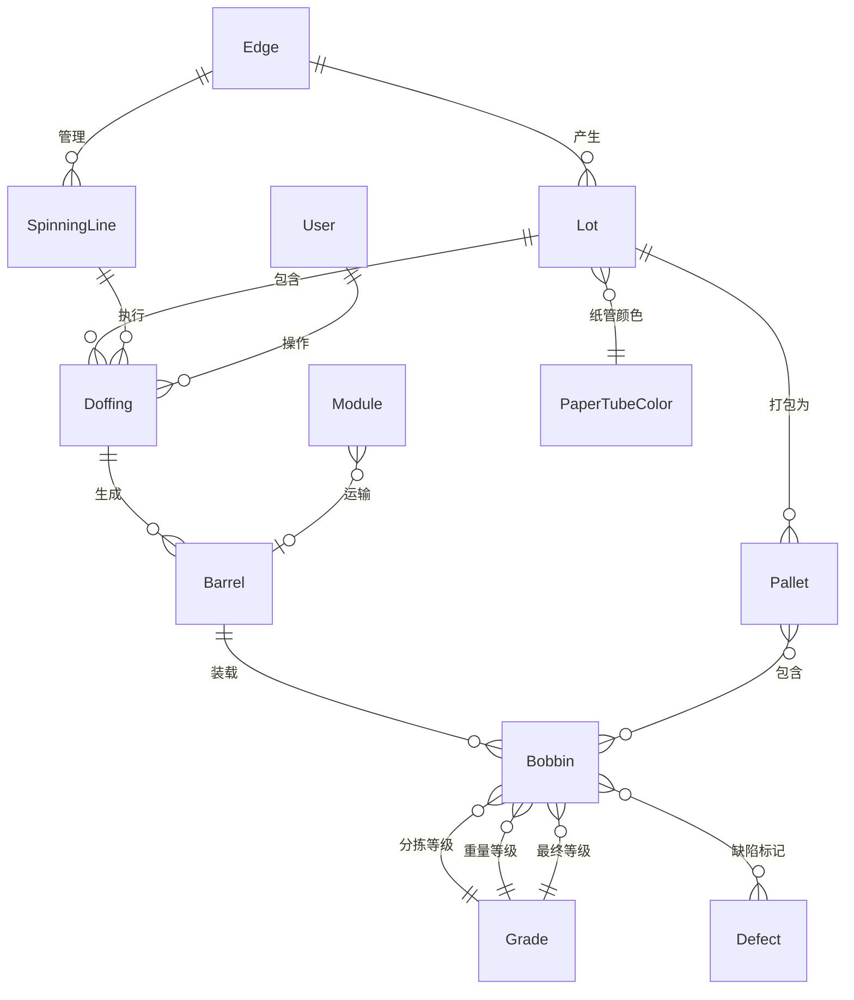

# IGH Silkroad V3 数据模型设计规范

> **设计日期**: 2026-09-29  
> **基于**: V2 数据库架构分析 (98表)  
> **目标**: 重构后端数据模型，删除错误的Project/Order，补全真实业务实体  
> **范围**: MVP核心业务域

---

## 1. 设计原则

### 1.1 与V2的关系
- **保留**: V2核心业务逻辑和数据流
- **简化**: 去除DTY特有流程（聚焦FDY）
- **增强**: 边端能力、中心管理、高可用架构

### 1.2 架构约束
- **边端数据库**: SQLite (已实现)
- **中心数据库**: PostgreSQL (已实现)
- **同步机制**: Edge → Center 数据上传
- **配置下发**: Center → Edge 配置推送

---

## 2. 核心业务域

基于V2的8大业务域，MVP阶段聚焦4个核心域：

```
┌─────────────────────────────────────────────┐
│          V3 MVP 核心业务域                   │
├────────────┬────────────┬──────────┬────────┤
│ 生产域      │ 质量域      │ 包装域    │ 系统域  │
│ (核心)     │ (简化)     │ (基础)   │ (必需) │
└────────────┴────────────┴──────────┴────────┘
```

**暂缓实现**:
- 仓储物流域 (单轨、AGV追踪)
- DTY加工域 (专用于DTY产线)
- ERP接口域 (后期集成)
- 设备监控域 (告警、周期，后期完善)

---

## 3. 核心数据实体

### 3.1 生产域 - 核心实体

#### 3.1.1 Lot (批号) - 顶层实体

**V2字段** (lots表):
```sql
CREATE TABLE lots (
  id INT PRIMARY KEY AUTO_INCREMENT,
  prefix VARCHAR(10),              -- 批次前缀
  code VARCHAR(20) UNIQUE,         -- 批号编码
  order_code VARCHAR(50),          -- 订单编号(可空)
  specification VARCHAR(100),      -- 规格
  type ENUM('FDY', 'POY', 'DTY'), -- 产品类型
  paper_tube_color_id INT,         -- 纸管颜色
  start_time DATETIME,
  end_time DATETIME,
  status ENUM('active', 'paused', 'completed'),
  packing_lock TINYINT DEFAULT 0,  -- 打包锁定
  hidden TINYINT DEFAULT 0,        -- 隐藏标记
  created_at TIMESTAMP,
  updated_at TIMESTAMP
)
```

**V3调整**:
- ✅ 保留所有字段
- ➕ 添加 `edge_id` - 来源边端设备ID
- ➕ 添加 `plc_lot_number` - PLC原始批号
- ❌ `order_code` 字段保留但不强制，仅用于ERP集成

**业务含义**:
- Lot是生产追溯的**唯一标识**
- 从卷绕机PLC读取，不是手工创建
- 一个Lot包含多个落纱桶(Barrel)

#### 3.1.2 Doffing (落纱记录)

**V2字段** (doffings表):
```sql
CREATE TABLE doffings (
  id INT PRIMARY KEY AUTO_INCREMENT,
  winder_id INT,                   -- 卷绕头ID
  doff_no INT,                     -- 落纱序号
  lot_id INT,                      -- 批号ID
  yarn_type VARCHAR(50),           -- 纱线类型
  start_time DATETIME,
  end_time DATETIME,
  status ENUM('active', 'completed', 'cancelled'),
  rack_id INT,                     -- 料架ID
  created_at TIMESTAMP
)
```

**V3调整**:
- ✅ 保留核心字段
- ➕ 添加 `spinning_line_id` - 纺丝线ID (替代winder_id)
- ➕ 添加 `spinning_position` - 锭位号
- ➕ 添加 `operator_id` - 操作工ID
- ➕ 添加 `edge_id` - 边端设备ID
- ✅ 已实现 (internal/database/ent/schema/doffing.go)

#### 3.1.3 Barrel (落纱桶) - **V2核心，V3缺失**

**V2实现**: `work_bobbins` 表（在制丝饼）

```sql
CREATE TABLE work_bobbins (
  id INT PRIMARY KEY AUTO_INCREMENT,
  doffing_id INT,                  -- 落纱ID (FDY)
  module_id INT,                   -- 模块ID (DTY)
  place INT,                       -- 桶内锭位 (1-9)
  net_weight DECIMAL(8,2),
  gross_weight DECIMAL(8,2),
  tare_weight DECIMAL(8,2),
  sorting_grade_id INT,            -- 分拣等级
  weight_grade_id INT,             -- 重量等级
  final_grade_id INT,              -- 最终等级
  vision_grade_id INT,             -- 外观等级
  status ENUM('active', 'sorted', 'packed'),
  created_at TIMESTAMP
)
```

**V3设计** (新增):
```go
// Barrel - 落纱桶(载具)
type Barrel struct {
  ID           uuid.UUID
  BarrelNumber string    // 桶编号
  DoffingID    uuid.UUID // 落纱ID
  LotID        uuid.UUID // 批号ID
  Capacity     int       // 容量 (通常9个锭位)
  Status       string    // active, full, sorted, packed
  CreatedAt    time.Time
  UpdatedAt    time.Time
}
```

**关系**: `Lot 1-N Doffing 1-N Barrel`

#### 3.1.4 Bobbin (丝饼) - 最终产品

**V2字段** (bobbins表 - 已入栈板的丝饼):
```sql
CREATE TABLE bobbins (
  id INT PRIMARY KEY AUTO_INCREMENT,
  pallet_id INT,                   -- 栈板ID
  pallet_place INT,                -- 栈板位置
  lot_code VARCHAR(20),            -- 批号
  net_weight DECIMAL(8,2),
  gross_weight DECIMAL(8,2),
  tare_weight DECIMAL(8,2),
  sorting_grade VARCHAR(10),
  weight_grade VARCHAR(10),
  final_grade VARCHAR(10),
  vision_grade VARCHAR(10),
  knitting_grade VARCHAR(10),
  paper_tube_color VARCHAR(20),
  created_at TIMESTAMP
)
```

**V3调整**:
- ✅ 已有基础实现 (internal/database/ent/schema/bobbin.go)
- ➕ 添加 `barrel_id` - 落纱桶ID
- ➕ 添加 `barrel_position` - 桶内位置 (1-9)
- ➕ 分离质检等级到独立字段

**关系**: `Barrel 1-N Bobbin`

#### 3.1.5 Module (吊车/模块) - 载具

**V2字段** (modules表):
```sql
CREATE TABLE modules (
  id INT PRIMARY KEY AUTO_INCREMENT,
  number VARCHAR(20) UNIQUE,       -- 吊车编号
  doffing1_id INT,                 -- 第一个落纱ID
  doffing2_id INT,                 -- 第二个落纱ID (双落纱)
  sorting_id INT,                  -- 分拣工位ID
  pallet_level INT,                -- 栈板层级 (1-9)
  status ENUM('loading', 'transporting', 'sorting', 'warehouse'),
  rfid VARCHAR(50),                -- RFID标签
  created_at TIMESTAMP
)
```

**V3设计** (新增):
```go
// Module - 吊车(载具，可装载多个落纱桶)
type Module struct {
  ID           uuid.UUID
  ModuleNumber string
  Barrel1ID    *uuid.UUID // 第一个桶
  Barrel2ID    *uuid.UUID // 第二个桶
  Status       string     // loading, transporting, sorting, warehouse
  RFID         string
  CreatedAt    time.Time
  UpdatedAt    time.Time
}
```

### 3.2 包装域

#### 3.2.1 Pallet (栈板) - **V2核心，V3缺失**

**V2字段** (pallets表):
```sql
CREATE TABLE pallets (
  id INT PRIMARY KEY AUTO_INCREMENT,
  code VARCHAR(50) UNIQUE,         -- 栈板编号
  lot_code VARCHAR(20),            -- 批号
  level INT,                       -- 层级 (1-9)
  bobbins_count INT DEFAULT 0,     -- 丝饼数量
  net_weight DECIMAL(10,2),        -- 净重
  gross_weight DECIMAL(10,2),      -- 毛重
  tare_weight DECIMAL(10,2),       -- 皮重
  status ENUM('building', 'completed', 'shipped'),
  palletizer_id INT,               -- 码垛机ID
  printed TINYINT DEFAULT 0,       -- 是否已打印标签
  created_at TIMESTAMP
)
```

**V3设计** (新增):
```go
// Pallet - 栈板(包装单元)
type Pallet struct {
  ID            uuid.UUID
  PalletCode    string
  LotID         uuid.UUID
  Level         int       // 层数 1-9
  BobbinsCount  int       // 实际丝饼数
  NetWeight     float64
  GrossWeight   float64
  TareWeight    float64
  Status        string    // building, completed, shipped
  PalletizerID  *uuid.UUID
  Printed       bool
  CreatedAt     time.Time
  UpdatedAt     time.Time
}
```

**关系**: `Lot 1-N Pallet M-N Bobbin`

### 3.3 质量域 (简化版)

#### 3.3.1 Grade (等级) - 统一等级表

**V2实现**: 分散在多个表 (sorting_grades, weight_grades, final_grades, vision_grades, knitting_grades)

**V3设计** (统一):
```go
// Grade - 统一等级定义
type Grade struct {
  ID          uuid.UUID
  GradeType   string // sorting, weight, final, vision, knitting
  GradeCode   string // A, B, C, D, 废品
  GradeName   string
  Description string
  SortOrder   int
  IsActive    bool
  CreatedAt   time.Time
}
```

#### 3.3.2 Defect (缺陷)

**V2字段** (defects表):
```sql
CREATE TABLE defects (
  id INT PRIMARY KEY AUTO_INCREMENT,
  code VARCHAR(20) UNIQUE,
  name VARCHAR(100),
  description TEXT,
  severity ENUM('minor', 'major', 'critical'),
  is_active TINYINT DEFAULT 1
)
```

**V3设计**:
- ✅ 保留V2结构
- 用于丝饼缺陷标记

### 3.4 基础数据域

#### 3.4.1 SpinningLine (纺丝线)

**V2字段** (spinnings表):
```sql
CREATE TABLE spinnings (
  id INT PRIMARY KEY AUTO_INCREMENT,
  code VARCHAR(20) UNIQUE,
  name VARCHAR(100),
  side_id INT,                     -- 纺丝侧ID
  winders_count INT,               -- 卷绕头数量
  is_active TINYINT DEFAULT 1
)
```

**V3调整**:
- ✅ 保留
- ➕ 添加 `edge_id` - 边端设备ID

#### 3.4.2 PaperTubeColor (纸管颜色)

**V2**: paper_tube_colors表

**V3**: ✅ 保留

### 3.5 系统域

#### 3.5.1 User (用户)

**V2**: auth_users + auth_users_simple

**V3**: ✅ 已实现 (internal/database/ent/schema/user.go)

#### 3.5.2 Edge (边端设备) - **新增**

```go
// Edge - 边端设备注册
type Edge struct {
  ID          uuid.UUID
  EdgeCode    string    // edge-001, line-01
  EdgeName    string
  IPAddress   string
  Status      string    // online, offline, error
  LastSeen    time.Time
  Version     string
  Config      map[string]interface{} // JSON配置
  CreatedAt   time.Time
  UpdatedAt   time.Time
}
```

---

## 4. 实体关系图 (ER Diagram)



---

## 5. 数据流

### 5.1 生产流程

```
PLC → Edge采集 → 创建Lot → 检测落纱信号 → 创建Doffing → 
生成Barrel → 装载Bobbin → 质检评级 → 打包到Pallet → 
数据上传Center
```

### 5.2 Edge端数据流

```
SQLite本地存储 (Lot, Doffing, Barrel, Bobbin) → 
定时同步 → 
Center PostgreSQL
```

### 5.3 Center端配置下发

```
Center Web UI配置 (SpinningLine, Grade, Defect, PaperTubeColor) → 
API推送 → 
Edge SQLite本地缓存
```

---

## 6. 与当前实现的差距

### 6.1 需要删除的实体
- ❌ `Project` - 不存在于真实业务
- ❌ `Order` - 不存在于真实业务

### 6.2 需要新增的实体
- ➕ `Barrel` (落纱桶) - **核心缺失**
- ➕ `Module` (吊车) - 载具
- ➕ `Pallet` (栈板) - **核心缺失**
- ➕ `Edge` (边端设备) - 设备管理

### 6.3 需要调整的实体
- 🔧 `Lot` - 添加edge_id, plc_lot_number
- 🔧 `Doffing` - 已基本正确
- 🔧 `Bobbin` - 添加barrel_id, barrel_position
- 🔧 `SpinningLine` - 添加edge_id

### 6.4 质量域重构
- 统一多个Grade表为一个Grade表
- 简化质检流程

---

## 7. MVP实现优先级

### Phase 1: 核心生产流程 (本次重构)
1. ✅ 删除 Project, Order
2. ➕ 新增 Barrel, Pallet, Module, Edge
3. 🔧 调整 Lot, Bobbin, SpinningLine
4. 🔧 统一 Grade表

### Phase 2: 质量管理 (后续)
- Defect缺陷管理
- 多维质检流程

### Phase 3: 高级功能 (后续)
- 仓储物流
- ERP集成
- 设备监控

---

## 8. 数据库迁移策略

### 8.1 Center数据库 (PostgreSQL)

**步骤**:
1. 备份当前数据库
2. 生成新的Ent schema
3. 生成迁移SQL
4. 执行迁移
5. 验证数据完整性

**影响范围**:
- 删除 projects, orders 表
- 新增 barrels, pallets, modules, edges 表
- 修改 lots, bobbins, spinning_lines 表
- 统一 grades 表

### 8.2 Edge数据库 (SQLite)

**步骤**:
1. 删除现有 edge.db
2. 重新生成schema
3. 重新初始化数据

**影响**: Edge端目前无生产数据，可直接重建

---

**下一步**: 编写Ent schema定义文件
